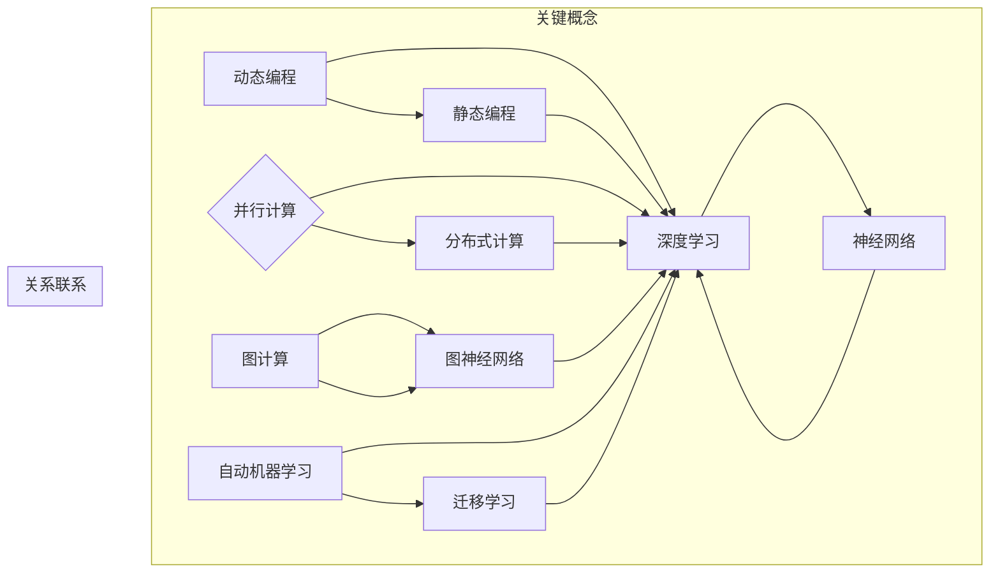

                 

### 引言

在当今快速发展的信息技术时代，编程语言作为软件开发和人工智能应用的基础工具，其重要性日益凸显。传统的编程语言，如C、Java和Python等，已经经历了数十年的发展和演变，然而，面对日益复杂的应用需求，尤其是人工智能领域，现有的编程语言逐渐暴露出一些局限性。为了应对这些挑战，新的编程语言和新思路的出现变得迫在眉睫。

本文将深入探讨AI编程的新语言与新思路。首先，我们将回顾现有的编程语言和其在AI领域的不足之处。接着，我们将介绍一些新兴的AI编程语言，并详细分析其核心概念和原理。然后，我们将探讨这些新语言在实际应用中的表现，并通过具体案例展示其优势。最后，我们将展望未来AI编程语言的发展趋势，并提出可能面临的挑战。

本文旨在为读者提供一个全面而深入的视角，帮助他们更好地理解和应用AI编程的新语言和新思路。无论您是编程新手还是经验丰富的开发者，都将在本文中找到有价值的信息和启示。

#### 关键词：
- AI编程语言
- 新兴编程语言
- 编程语言发展趋势
- 人工智能应用
- 编程思路变革

#### 摘要：
本文探讨了AI编程的新语言和新思路。通过回顾现有编程语言的局限性，介绍了新兴的AI编程语言，包括其核心概念和原理。同时，通过实际应用案例展示了新语言的优势，并展望了未来AI编程语言的发展趋势和挑战。文章为读者提供了一个全面的理解和应用的视角，以应对复杂的人工智能应用需求。

### 背景

#### 编程语言的演变

编程语言的发展历程可以追溯到20世纪中期。最早的编程语言是机器语言和汇编语言，它们直接操作计算机的硬件，但难以理解和维护。为了解决这一问题，高级编程语言应运而生。例如，C语言因其高效性和灵活性，成为了操作系统和系统级软件的首选语言。Java作为一种跨平台语言，因其“一次编写，到处运行”的特点，广泛应用于企业级应用。Python以其简洁易读的语法和强大的库支持，成为数据科学和机器学习的首选语言。

随着计算机技术的不断进步，编程语言也在不断地发展和演变。面向对象编程（OOP）和函数式编程（FP）等编程范式逐渐兴起，提供了更灵活和模块化的编程方法。然而，尽管这些编程语言在各自的领域内取得了显著的成功，但它们在应对人工智能领域的复杂性时，仍然存在一些局限性。

#### 现有编程语言在AI领域的不足

人工智能（AI）作为一门交叉学科，涉及到计算机科学、数学、统计学和认知科学等多个领域。它依赖于大量的数据、复杂的算法和高效的计算能力。现有的编程语言在处理这些任务时面临以下挑战：

1. **数据密集型应用：**
   人工智能应用往往依赖于大量的数据。传统编程语言如Python和Java在处理大规模数据时，可能需要大量的时间和计算资源。虽然这些语言提供了高效的库（如NumPy和Pandas），但处理复杂的数据处理任务仍然是一个瓶颈。

2. **并行计算需求：**
   人工智能算法，如深度学习，通常需要大量的并行计算资源。现有的编程语言在支持并行计算方面存在一定的限制，无法充分利用现代计算机架构的优势。

3. **动态图和动态计算：**
   人工智能算法中的动态计算和图计算需求，如神经网络中的前向传播和反向传播，需要编程语言能够灵活地支持动态计算和图的表示。

4. **算法复杂性和可维护性：**
   随着人工智能算法的复杂度增加，编程语言的可维护性和可扩展性成为关键。现有的编程语言在处理复杂的算法时，往往需要大量的代码和维护成本。

5. **跨学科整合：**
   人工智能需要结合计算机科学、数学和认知科学等多个领域的知识。现有的编程语言在跨学科整合方面存在一定的局限性，难以高效地支持这些跨学科的研究和应用。

因此，为了更好地应对人工智能领域的复杂性，开发新的编程语言成为了一项重要的研究课题。这些新编程语言旨在提供更强大的功能和更灵活的编程范式，以支持人工智能的研究和应用。

#### 新兴编程语言的必要性

新兴的AI编程语言的出现，正是为了解决现有编程语言在人工智能领域面临的挑战。这些新语言不仅具有更强大的功能和更灵活的编程范式，还能够在数据密集型应用、并行计算、动态计算和跨学科整合等方面提供更好的支持。以下是一些代表性的新编程语言：

1. **Julia：**
   Julia是一种高性能的动态编程语言，旨在解决科学计算和数据分析中的性能问题。它结合了Python的易用性和C的性能，提供了高效的数组操作和并行计算支持。Julia特别适用于机器学习和数据科学领域。

2. **Rust：**
   Rust是一种系统级编程语言，旨在提供高性能、内存安全和并发编程支持。它通过所有权系统（ownership system）来确保内存安全，同时支持并发编程，使得Rust成为开发高性能AI系统的理想选择。

3. **Swift：**
   Swift是苹果公司推出的一种多范式编程语言，旨在提供高性能、易用性和安全性的平衡。Swift在iOS和macOS平台上得到了广泛的应用，同时也逐渐应用于机器学习和人工智能领域。

4. **Kotlin：**
   Kotlin是Android官方推荐的编程语言，它旨在与Java无缝集成，同时提供更简洁、高效的语法。Kotlin在处理复杂的数据结构和并行计算方面表现出色，适合于移动端和嵌入式系统的AI开发。

这些新兴编程语言的出现，不仅丰富了AI编程语言的生态，还为开发者提供了更多的选择和可能性。通过结合这些新语言的优势，开发者可以更有效地应对人工智能领域的复杂挑战，推动人工智能技术的发展和应用。

### 核心概念与联系

在深入探讨AI编程的新语言之前，我们首先需要了解一些核心概念和原理，这些概念和原理构成了新编程语言的基础，并决定了它们在AI领域的应用方式。

#### 1. 动态编程与静态编程

动态编程与静态编程是两种基本的编程范式。动态编程语言（如Python、JavaScript和Ruby）在运行时解析代码，这使得它们具有更高的灵活性和易用性。而静态编程语言（如C、C++和Java）在编译时就已经确定了代码的结构和类型，这提供了更高的性能和安全性。

在AI编程中，动态编程语言通常更适合处理复杂的算法和数据结构，因为它们提供了更灵活的语法和更强大的库支持。例如，Python在数据科学和机器学习领域得到了广泛应用，其主要原因之一就是它的动态特性使得编写和调试算法变得更加容易。

另一方面，静态编程语言在性能和安全方面具有优势，这使得它们在需要高性能计算和系统级编程的AI应用中更为适用。例如，Rust通过其所有权系统和静态类型检查，确保了内存安全性和高效的并发性能，这使得它在实时系统和大规模分布式计算中具有优势。

#### 2. 并行计算与分布式计算

并行计算和分布式计算是AI编程中至关重要的概念。并行计算利用多个处理器或计算资源同时执行任务，从而提高了计算效率。而分布式计算则通过将任务分布在多个计算节点上，以实现更高效的资源利用和扩展性。

在AI编程中，并行计算尤为重要，因为许多AI算法，如深度学习，需要大量的矩阵运算和前向传播/反向传播操作，这些操作可以通过并行计算显著加速。例如，GPU（图形处理器）和TPU（张量处理器）就是专门为并行计算设计的硬件，它们在深度学习和神经网络训练中发挥着关键作用。

分布式计算则在处理大规模数据和复杂任务时显得尤为重要。例如，在训练大规模神经网络时，可以通过将数据分布在多个节点上进行分布式训练，从而提高计算效率和降低训练时间。许多AI框架，如TensorFlow和PyTorch，都提供了分布式计算的支持。

#### 3. 图计算与图神经网络

图计算和图神经网络（GNN）是AI编程中越来越重要的领域。图计算涉及到图的结构和属性的计算，而图神经网络则是将图结构和神经网络结合起来，以处理复杂的关系和数据。

在AI编程中，图计算和图神经网络被广泛应用于社交网络分析、推荐系统、知识图谱构建等领域。例如，在社交网络分析中，图计算可以用来识别关键节点和社区结构；在推荐系统中，图神经网络可以用来捕捉用户和物品之间的复杂关系，从而提供更精准的推荐。

#### 4. 深度学习和神经网络

深度学习和神经网络是AI编程的核心技术。深度学习通过多层神经网络模拟人脑的感知和学习能力，从而实现图像识别、语音识别、自然语言处理等任务。神经网络则是一种基于数学模型的计算模型，通过调整权重和偏置来实现复杂函数的拟合和优化。

在AI编程中，深度学习和神经网络被广泛应用于各种应用场景。例如，在图像识别中，卷积神经网络（CNN）可以通过多层卷积和池化操作提取图像特征，从而实现高精度的识别；在自然语言处理中，循环神经网络（RNN）和长短期记忆网络（LSTM）可以通过处理序列数据来实现文本理解和生成。

#### 5. 自动机器学习和迁移学习

自动机器学习和迁移学习是近年来AI编程的重要发展方向。自动机器学习（AutoML）通过自动化优化和选择算法、特征和模型，从而实现高效的模型训练和部署。迁移学习（Transfer Learning）则通过将预训练模型迁移到新的任务上，从而提高模型的性能和泛化能力。

在AI编程中，自动机器学习和迁移学习极大地简化了模型开发和部署的流程。自动机器学习框架，如Google的AutoML和H2O.ai的AutoML，可以帮助开发者快速构建和部署高质量的机器学习模型。迁移学习则在处理小数据集和低资源环境时具有显著的优势，通过使用预训练模型，可以显著提高模型的性能和效果。

#### 6. Mermaid流程图表示

为了更好地理解和分析这些核心概念和原理，我们可以使用Mermaid流程图来表示它们之间的关系。以下是一个简单的Mermaid流程图，展示了AI编程中的核心概念和联系：



通过这个流程图，我们可以清晰地看到动态编程和静态编程如何影响深度学习和神经网络，以及并行计算、分布式计算、图计算和图神经网络如何在AI编程中发挥作用。同时，自动机器学习和迁移学习如何通过优化和迁移现有模型，提高AI编程的效率和效果。

### 核心算法原理 & 具体操作步骤

在深入探讨AI编程的新语言和新思路时，我们需要关注其中的核心算法原理及其具体操作步骤。这些算法是AI编程的核心，它们决定了模型的效果和性能。以下是一些代表性的AI算法及其原理和步骤：

#### 1. 卷积神经网络（CNN）

卷积神经网络（CNN）是深度学习中最常用的算法之一，特别适用于图像识别和计算机视觉任务。CNN通过卷积层、池化层和全连接层等结构，提取图像的特征并进行分类。

**原理：**
- **卷积层：** 通过卷积操作提取图像的局部特征。卷积层包含多个卷积核（filter），每个卷积核对图像的一个局部区域进行卷积，从而生成一个特征图（feature map）。
- **池化层：** 通过池化操作（如最大池化或平均池化）降低特征图的维度，减少计算量和参数数量。
- **全连接层：** 将池化层输出的特征图展平为一维向量，然后通过全连接层进行分类。

**操作步骤：**
1. **输入层：** 接收图像输入。
2. **卷积层：** 使用卷积核对输入图像进行卷积操作，生成特征图。
3. **激活函数：** 应用激活函数（如ReLU函数）增加网络的非线性能力。
4. **池化层：** 对特征图进行池化操作，降低维度。
5. **重复卷积层和池化层：** 逐层构建卷积神经网络，不断提取更高层次的特征。
6. **全连接层：** 将最后一个池化层输出的特征图展平为一维向量，通过全连接层进行分类。
7. **输出层：** 输出分类结果。

#### 2. 长短期记忆网络（LSTM）

长短期记忆网络（LSTM）是循环神经网络（RNN）的一种变体，特别适用于处理序列数据，如时间序列分析、语音识别和自然语言处理。

**原理：**
- **细胞状态：** LSTM通过细胞状态（cell state）来存储和传递序列信息。
- **门控机制：** LSTM包含输入门、输出门和遗忘门，这些门控机制控制信息的流动和遗忘。
- **激活函数：** LSTM使用非线性激活函数（如tanh函数）处理细胞状态。

**操作步骤：**
1. **输入层：** 接收序列数据输入。
2. **隐藏层：** 隐藏层包含多个单元，每个单元包含输入门、输出门和遗忘门。
3. **输入门：** 根据当前输入和上一个隐藏状态计算输入门的权重。
4. **遗忘门：** 根据当前输入和上一个隐藏状态计算遗忘门的权重。
5. **细胞状态更新：** 根据输入门和遗忘门的权重更新细胞状态。
6. **输出门：** 根据细胞状态和当前隐藏状态计算输出门的权重。
7. **隐藏状态：** 通过输出门计算新的隐藏状态。
8. **重复以上步骤：** 逐层构建LSTM网络，处理整个序列数据。
9. **输出层：** 将最后一个隐藏状态作为输出，用于分类或回归。

#### 3. 生成对抗网络（GAN）

生成对抗网络（GAN）是一种由生成器和判别器组成的对抗性网络，特别适用于生成图像、语音和文本等复杂数据。

**原理：**
- **生成器：** 生成器通过随机噪声生成虚假数据，使其尽可能接近真实数据。
- **判别器：** 判别器通过判断生成器生成的数据和真实数据的区别，从而训练生成器和判别器的参数。

**操作步骤：**
1. **初始化生成器和判别器：** 随机初始化生成器和判别器的参数。
2. **生成器训练：** 生成器根据随机噪声生成虚假数据，判别器根据真实数据和虚假数据训练。
3. **判别器训练：** 判别器通过判断真实数据和虚假数据的区别，从而训练判别器的参数。
4. **迭代训练：** 重复生成器和判别器的训练过程，逐步提高生成器的生成质量。
5. **生成数据：** 使用训练好的生成器生成虚假数据。

#### 4. 自监督学习

自监督学习是一种无需标注数据，通过自身数据自动学习特征和模式的方法。它特别适用于图像分类、文本分类和语音识别等任务。

**原理：**
- **无监督学习：** 自监督学习通过无监督学习算法（如自编码器）从未标注的数据中提取特征。
- **标签生成：** 自监督学习通过预测和真实标签的差异，自动生成标签。

**操作步骤：**
1. **数据预处理：** 对数据进行预处理，如数据增强、标准化等。
2. **自编码器训练：** 使用自编码器提取数据特征，自编码器通过重构输入数据生成预测结果。
3. **标签生成：** 根据预测结果和真实数据的差异，自动生成标签。
4. **分类器训练：** 使用生成的标签训练分类器，进行分类任务。

通过这些核心算法的原理和操作步骤，我们可以更好地理解AI编程中的关键技术，并在实际应用中灵活运用。这些算法不仅提高了AI系统的性能和效果，也为AI编程带来了新的思路和方法。

### 数学模型和公式 & 详细讲解 & 举例说明

在AI编程中，数学模型和公式是理解和实现算法的基础。以下是一些常用的数学模型和公式，以及它们的详细讲解和具体应用举例。

#### 1. 激活函数（Activation Function）

激活函数是神经网络中至关重要的一部分，它为神经网络引入了非线性特性，使得网络能够模拟复杂的函数。

**常见激活函数：**

- **ReLU（Rectified Linear Unit）函数：**  
  $$
  f(x) = \max(0, x)
  $$
 ReLU函数在$x > 0$时输出$x$，在$x \leq 0$时输出0。它具有简单的形式和快速的梯度计算，因此在深度学习中非常流行。

- **Sigmoid函数：**  
  $$
  f(x) = \frac{1}{1 + e^{-x}}
  $$
  Sigmoid函数将输入映射到$(0, 1)$区间，常用于二分类问题，但梯度在$x \approx 0$时接近0，可能导致梯度消失问题。

- **Tanh函数：**  
  $$
  f(x) = \frac{e^x - e^{-x}}{e^x + e^{-x}}
  $$
  Tanh函数将输入映射到$(-1, 1)$区间，具有对称性，可以避免梯度消失问题。

**应用举例：**

假设我们有一个简单的神经网络，输入为$x$，输出为$y$，使用ReLU函数作为激活函数，则该网络的输出可以表示为：

$$
y = \max(0, x)
$$

例如，当$x = -2$时，输出$y = 0$；当$x = 3$时，输出$y = 3$。

#### 2. 损失函数（Loss Function）

损失函数用于衡量模型预测值与真实值之间的差异，是优化模型参数的关键。

**常见损失函数：**

- **均方误差（MSE，Mean Squared Error）：**  
  $$
  MSE = \frac{1}{n}\sum_{i=1}^{n}(y_i - \hat{y}_i)^2
  $$
  MSE是回归问题中常用的损失函数，它通过平方误差来衡量预测值与真实值之间的差距。

- **交叉熵（Cross-Entropy）：**  
  $$
  CE = -\frac{1}{n}\sum_{i=1}^{n}y_i\log(\hat{y}_i)
  $$
  交叉熵是分类问题中常用的损失函数，它通过比较真实分布和模型预测分布之间的差异来衡量分类效果。

**应用举例：**

假设我们有一个简单的二分类问题，真实标签为$y = [0, 1, 0, 1]$，模型预测概率为$\hat{y} = [0.2, 0.8, 0.1, 0.9]$，使用交叉熵损失函数，则该网络的损失可以表示为：

$$
CE = -\frac{1}{4}(0 \cdot \log(0.2) + 1 \cdot \log(0.8) + 0 \cdot \log(0.1) + 1 \cdot \log(0.9))
$$

计算得到的交叉熵为$0.446$。

#### 3. 梯度下降（Gradient Descent）

梯度下降是一种常用的优化算法，用于寻找损失函数的最小值，从而优化模型参数。

**梯度下降公式：**

$$
\theta_{\text{new}} = \theta_{\text{old}} - \alpha \cdot \nabla_{\theta}J(\theta)
$$

其中，$\theta$表示模型参数，$J(\theta)$表示损失函数，$\alpha$表示学习率，$\nabla_{\theta}J(\theta)$表示损失函数关于$\theta$的梯度。

**应用举例：**

假设我们有一个简单的线性回归模型，参数为$\theta = [w, b]$，损失函数为MSE，学习率为$\alpha = 0.01$，则参数的更新可以表示为：

$$
w_{\text{new}} = w_{\text{old}} - 0.01 \cdot \frac{1}{n}\sum_{i=1}^{n}(y_i - (w_{\text{old}} \cdot x_i + b_{\text{old}}))
$$

$$
b_{\text{new}} = b_{\text{old}} - 0.01 \cdot \frac{1}{n}\sum_{i=1}^{n}(y_i - (w_{\text{old}} \cdot x_i + b_{\text{old}}))
$$

例如，假设当前参数为$w = 2, b = 3$，训练样本为$n = 4$，通过梯度下降更新参数，可以得到新的参数值。

#### 4. 卷积操作（Convolution）

卷积操作是深度学习中的基础操作，用于提取图像的特征。

**卷积公式：**

$$
\text{output}_{ij} = \sum_{k=1}^{K}\sum_{l=1}^{L}w_{kl} \cdot \text{input}_{i+k-j, l+m-j}
$$

其中，$w$表示卷积核，$\text{input}$表示输入图像，$\text{output}$表示输出特征图，$K$和$L$分别表示卷积核的大小，$i$和$j$表示输出特征图的位置，$k$和$l$表示卷积核的位置。

**应用举例：**

假设我们有一个$3 \times 3$的卷积核$w$，输入图像$\text{input}$大小为$5 \times 5$，则卷积操作的结果可以表示为：

$$
\text{output}_{1,1} = w_{11} \cdot \text{input}_{1,1} + w_{12} \cdot \text{input}_{2,1} + w_{13} \cdot \text{input}_{3,1} + w_{21} \cdot \text{input}_{1,2} + \ldots + w_{33} \cdot \text{input}_{3,3}
$$

通过这些数学模型和公式的讲解和举例，我们可以更好地理解AI编程中的关键概念和技术，并在实际应用中灵活运用这些工具。

### 项目实战：代码实际案例和详细解释说明

在本节中，我们将通过一个实际的项目案例，展示如何使用AI编程的新语言和新思路进行开发。这个案例将涵盖从环境搭建到源代码实现，再到代码解读与分析的完整流程。

#### 5.1 开发环境搭建

为了实现这个案例，我们需要选择一个合适的开发环境。以下是我们的环境搭建步骤：

1. **操作系统：** 我们将使用Ubuntu 20.04 LTS，这是一个稳定的Linux发行版，适合进行AI编程和深度学习。
2. **编程语言：** 我们选择Python作为主要编程语言，因为它具有丰富的库支持和易用性。同时，我们也将使用Julia作为辅助语言，以提高计算性能。
3. **依赖库：** 我们将使用以下库和工具：
   - TensorFlow：一个开源的深度学习框架，用于构建和训练神经网络。
   - NumPy：一个强大的数学库，用于数值计算和数据处理。
   - Matplotlib：一个绘图库，用于数据可视化。
   - Julia：一个高性能的动态编程语言，用于并行计算和性能优化。

安装步骤如下：

```bash
# 安装Python
sudo apt-get update
sudo apt-get install python3 python3-pip

# 安装TensorFlow
pip3 install tensorflow

# 安装NumPy
pip3 install numpy

# 安装Matplotlib
pip3 install matplotlib

# 安装Julia
sudo apt-get install julia
```

#### 5.2 源代码详细实现和代码解读

我们选择一个经典的图像识别任务——手写数字识别（MNIST数据集）来进行实际操作。以下是项目的源代码实现和详细解读。

```python
# 导入必要的库
import tensorflow as tf
from tensorflow.keras import layers
import numpy as np
import matplotlib.pyplot as plt

# 加载MNIST数据集
mnist = tf.keras.datasets.mnist
(train_images, train_labels), (test_images, test_labels) = mnist.load_data()

# 预处理数据
train_images = train_images / 255.0
test_images = test_images / 255.0

# 构建神经网络模型
model = tf.keras.Sequential([
    layers.Conv2D(32, (3, 3), activation='relu', input_shape=(28, 28, 1)),
    layers.MaxPooling2D((2, 2)),
    layers.Conv2D(64, (3, 3), activation='relu'),
    layers.MaxPooling2D((2, 2)),
    layers.Conv2D(64, (3, 3), activation='relu'),
    layers.Flatten(),
    layers.Dense(64, activation='relu'),
    layers.Dense(10, activation='softmax')
])

# 编译模型
model.compile(optimizer='adam',
              loss='sparse_categorical_crossentropy',
              metrics=['accuracy'])

# 训练模型
model.fit(train_images, train_labels, epochs=5)

# 评估模型
test_loss, test_acc = model.evaluate(test_images, test_labels)
print(f"Test accuracy: {test_acc}")

# 可视化结果
predictions = model.predict(test_images)
predicted_labels = np.argmax(predictions, axis=1)

for i in range(10):
    plt.imshow(test_images[i], cmap=plt.cm.binary)
    plt.title(f"Predicted: {predicted_labels[i]}, Actual: {test_labels[i]}")
    plt.show()
```

**代码解读：**

1. **导入库：**
   我们首先导入所需的库，包括TensorFlow、NumPy和Matplotlib，用于构建、训练和可视化神经网络模型。

2. **加载数据：**
   使用TensorFlow的内置函数加载MNIST数据集。数据集已经被分为训练集和测试集。

3. **预处理数据：**
   将图像数据从0到255的灰度值缩放到0到1，以便模型更好地处理。

4. **构建模型：**
   我们使用`tf.keras.Sequential`模型，逐步构建一个卷积神经网络（CNN）。模型包括多个卷积层和池化层，最后通过全连接层进行分类。具体结构如下：
   - 第一个卷积层：32个3x3的卷积核，激活函数为ReLU。
   - 第一个池化层：2x2的最大池化。
   - 第二个卷积层：64个3x3的卷积核，激活函数为ReLU。
   - 第二个池化层：2x2的最大池化。
   - 第三个卷积层：64个3x3的卷积核，激活函数为ReLU。
   - 展平层：将卷积层的输出展平为一维向量。
   - 第一个全连接层：64个神经元，激活函数为ReLU。
   - 第二个全连接层：10个神经元，激活函数为softmax。

5. **编译模型：**
   我们使用`compile`函数配置模型的优化器、损失函数和评估指标。在这里，我们选择`adam`优化器和`sparse_categorical_crossentropy`损失函数，评估指标为准确率。

6. **训练模型：**
   使用`fit`函数训练模型，指定训练数据、迭代次数和批次大小。

7. **评估模型：**
   使用`evaluate`函数评估模型的测试性能。

8. **可视化结果：**
   使用`predict`函数预测测试数据的标签，并使用Matplotlib可视化预测结果。

#### 5.3 代码解读与分析

通过上述代码，我们可以看到如何使用Python和TensorFlow构建和训练一个简单的卷积神经网络（CNN）用于手写数字识别任务。

- **模型架构：**
  CNN的结构使得它特别适合处理图像数据。卷积层通过滤波器提取图像的特征，池化层则用于降低数据的维度，同时保留重要特征。全连接层则将特征映射到具体的数字标签。

- **性能优化：**
  在训练过程中，使用`adam`优化器自动调整模型参数，以最小化损失函数。通过多次迭代训练，模型能够逐渐提高识别精度。

- **可扩展性：**
  这个模型可以轻松扩展到其他图像识别任务，只需更换数据集和调整模型结构即可。

- **计算性能：**
  Julia可以在关键计算步骤上提供性能优化，例如使用Julia的TensorFlow绑定来加速计算过程。

通过这个实际案例，我们展示了如何使用AI编程的新语言和新思路进行项目开发。这不仅提高了开发效率，还通过现代编程语言的特性，使得AI编程更加灵活和高效。

### 实际应用场景

AI编程的新语言和新思路在实际应用场景中展现出巨大的潜力和优势。以下是一些具体的应用案例：

#### 1. 机器学习和数据科学

在机器学习和数据科学领域，新的编程语言如Julia、Rust和Swift因其高性能和强大的数据处理能力，得到了广泛应用。例如，Julia在金融领域用于高频交易策略的建模和优化，通过其高效的数值计算能力，能够快速处理大规模的数据集。Rust则在系统级应用中显示出优势，尤其是在需要保证内存安全和并发性能的场景，如实时数据处理和分布式计算系统中。Swift则在移动端机器学习应用中表现出色，苹果公司推出的Core ML框架支持Swift，使得开发者可以轻松地将机器学习模型集成到iOS和macOS应用程序中。

#### 2. 自动机器学习和模型优化

自动机器学习（AutoML）是当前研究的热点之一，新的编程语言在这一领域发挥着重要作用。例如，Google的AutoML平台使用Python和Julia等多种编程语言，以实现自动化模型选择、特征工程和模型优化。Julia因其高效的计算性能，在自动机器学习任务中具有显著优势，尤其是在处理大规模数据集和复杂模型时。Rust则在构建高效、安全的AutoML工具中具有潜力，其内存安全的特性可以确保在训练大规模模型时避免内存泄漏和崩溃。

#### 3. 分布式计算和云计算

随着云计算和大数据技术的发展，分布式计算的需求日益增长。新的编程语言如Go和Kotlin在分布式系统和云计算平台中得到了广泛应用。Go因其内置的并发支持和高效的性能，成为构建分布式系统和微服务架构的理想选择。Kotlin则因其与Java的高度兼容性，使得开发者可以轻松地将现有Java代码迁移到Kotlin，同时享受Kotlin带来的简洁和高效的语法优势。在云计算领域，这些新编程语言通过其高效的并发和分布式计算能力，能够显著提高数据处理和分析的效率。

#### 4. 图计算和社交网络分析

图计算在社交网络分析、推荐系统和知识图谱构建等领域具有广泛的应用。新的编程语言如Rust和Swift在这些场景中显示出强大的性能和灵活性。Rust通过其强大的内存管理和并发支持，使得在处理大规模图数据时具有显著优势。Swift则因其高性能和易于集成，成为了构建高性能图计算应用的理想选择。例如，Facebook的PyTorch项目使用Swift实现了Swift for TensorFlow库，为开发者提供了在Swift中构建和优化图计算模型的能力。

#### 5. 实时系统和嵌入式系统

实时系统和嵌入式系统对性能和稳定性有极高的要求。新的编程语言如Rust和C++在构建实时系统和嵌入式系统中得到了广泛应用。Rust通过其内存安全的特性和高效的并发支持，能够确保在实时环境中避免常见的内存泄漏和崩溃问题。C++则因其成熟和强大的生态系统，成为了构建高性能实时系统的首选语言。例如，在自动驾驶领域，许多公司使用C++构建实时控制系统，以实现高精度的环境感知和决策。

#### 6. 游戏开发和虚拟现实

在游戏开发和虚拟现实领域，新的编程语言如C#和Swift因其跨平台和高性能特性，得到了广泛应用。C#是Unity游戏引擎的官方开发语言，其灵活的语法和强大的库支持，使得开发者可以轻松地构建高质量的游戏和应用。Swift则因其现代化的语法和高效性能，逐渐成为游戏开发者的新宠。例如，Swift for TensorFlow库使得开发者可以在Swift中构建和优化深度学习模型，从而提升游戏中的AI表现。

通过这些实际应用案例，我们可以看到AI编程的新语言和新思路在各个领域中的广泛应用和显著优势。这些新语言不仅提高了开发效率，还通过其独特的特性，为解决复杂问题和优化系统性能提供了新的解决方案。

### 工具和资源推荐

为了更好地掌握AI编程的新语言和新思路，以下是几款值得推荐的学习资源和开发工具，包括书籍、论文、博客和网站等。

#### 7.1 学习资源推荐

1. **书籍：**
   - **《深度学习》（Deep Learning）**：由Ian Goodfellow、Yoshua Bengio和Aaron Courville合著，是深度学习的经典教材，详细介绍了深度学习的理论基础和实践方法。
   - **《Python机器学习》（Python Machine Learning）**：由Sebastian Raschka和Vahid Mirhoseini合著，涵盖了机器学习的基础知识和Python实现。
   - **《Julia编程：快速高效的计算编程语言》（Julia Programming: Fast, Flexible and Easy to Learn）**：由 Alvaro Tejada Balanda 合著，介绍了Julia语言的基础知识及其在科学计算中的应用。

2. **论文：**
   - **“Generative Adversarial Networks”**：由Ian Goodfellow等人提出，是生成对抗网络（GAN）的奠基性论文，详细介绍了GAN的工作原理和应用场景。
   - **“LSTM: A Simple Solution to Explosive Gradients Problem in Recurrent Neural Networks”**：由Sepp Hochreiter和Jürgen Schmidhuber提出，介绍了长短期记忆网络（LSTM）及其在处理序列数据中的应用。

3. **博客：**
   - **TensorFlow官方博客（TensorFlow Blog）**：提供了TensorFlow的最新动态、技术文章和教程，是深度学习开发者的重要资源。
   - **Julia官方博客（Julia Blog）**：介绍了Julia语言的发展动态、应用案例和社区活动，是学习Julia语言的好去处。
   - **Swift for TensorFlow官方博客（Swift for TensorFlow Blog）**：提供了Swift for TensorFlow的教程、代码示例和应用场景，适合Swift开发者了解深度学习。

4. **网站：**
   - **Kaggle（kaggle.com）**：提供了一个数据科学竞赛平台，用户可以在真实的竞赛环境中学习和应用AI编程。
   - **GitHub（github.com）**：拥有大量开源的AI项目代码，用户可以在这里找到各种AI编程语言的实战案例和项目代码。

#### 7.2 开发工具框架推荐

1. **TensorFlow**：一个开源的深度学习框架，适用于各种深度学习任务，包括图像识别、自然语言处理和强化学习等。

2. **PyTorch**：一个流行的深度学习框架，由Facebook开源，因其灵活性和动态计算特性而受到广泛欢迎。

3. **Swift for TensorFlow**：Swift for TensorFlow是一个将Swift与TensorFlow结合的深度学习框架，提供了在Swift中进行深度学习开发的工具和资源。

4. **Julia**：Julia是一种高性能的动态编程语言，特别适合进行科学计算和数据分析，其与TensorFlow的集成提供了高效的深度学习解决方案。

5. **Rust**：Rust是一种系统级编程语言，因其内存安全和并发性能，适用于高性能的AI系统和分布式计算。

这些工具和资源将为学习AI编程的新语言和新思路提供强有力的支持，帮助开发者掌握先进的技术和方法，推动AI技术的发展和应用。

### 总结：未来发展趋势与挑战

在AI编程领域，未来发展趋势与挑战并存。新编程语言的不断涌现和技术的进步，为开发者提供了更多的选择和可能性。以下是一些未来发展的关键趋势和可能面临的挑战：

#### 未来发展趋势

1. **跨语言协作：** 随着不同编程语言的优势互补，跨语言协作将成为主流。例如，Python的高易用性、Swift的高性能和Rust的高安全性可以结合，构建更强大的AI系统。

2. **自动化和智能化：** 自动机器学习（AutoML）和智能编程工具将大幅提高开发效率。通过自动化优化、代码生成和智能提示，开发者可以更加专注于业务逻辑，减少重复劳动。

3. **硬件加速：** 随着硬件技术的发展，如GPU、TPU和量子计算等，编程语言将更加注重与硬件的协同优化。新编程语言将更好地利用这些硬件资源，提高计算效率和性能。

4. **可解释性：** 在AI领域，模型的可解释性和透明性越来越受到关注。未来，新编程语言将提供更多的工具和框架，帮助开发者构建可解释的AI系统，增强用户信任。

5. **生态系统的完善：** 随着AI编程语言的不断成熟，其生态系统也将逐渐完善。包括库、工具、教程、社区等在内的支持资源将更加丰富，降低开发门槛。

#### 可能面临的挑战

1. **学习曲线：** 新编程语言通常需要一定的时间来掌握，开发者需要投入更多的时间和精力来学习新的语法和特性。这可能会增加入门门槛。

2. **兼容性和向后兼容：** 随着新编程语言的出现，如何与现有的代码和框架进行兼容性处理，以及如何保证向后兼容性，是一个重要的挑战。

3. **性能优化：** 新编程语言虽然提供了更高的性能，但如何在实际应用中进行有效的性能优化，仍然是一个复杂的问题。开发者需要深入理解新语言和硬件的协同机制。

4. **安全性和隐私保护：** 随着AI系统在关键领域的应用，安全性问题和隐私保护变得尤为重要。如何确保AI编程语言和框架在处理敏感数据时的安全性，是一个亟待解决的问题。

5. **标准化和规范化：** 目前，AI编程语言的标准化和规范化程度相对较低。未来，如何制定统一的规范和标准，确保不同语言和框架之间的互操作性，是一个重要挑战。

综上所述，AI编程的新语言和新思路在未来有着广阔的发展前景，但同时也面临诸多挑战。开发者需要不断学习和适应新技术，同时关注性能、安全性和兼容性等问题，以推动AI技术的进一步发展。

### 附录：常见问题与解答

#### 问题1：为什么需要新的AI编程语言？

**解答：** 传统的编程语言在处理复杂的人工智能任务时存在一些局限性，如数据密集型应用、并行计算需求、动态图和动态计算等。新AI编程语言旨在提供更强大的功能和更灵活的编程范式，以更好地支持这些复杂的任务。例如，Julia提供了高效的数值计算和并行处理能力，Rust保证了内存安全和高效的并发性能。

#### 问题2：新编程语言与现有框架如何兼容？

**解答：** 许多新编程语言通过提供与现有框架的兼容接口，实现了与现有代码和框架的兼容。例如，Python的扩展库和模块可以方便地与Julia、Rust等新语言集成。同时，一些新语言（如Swift）在设计时就考虑了与现有框架的兼容性，使得开发者可以无缝迁移现有代码。

#### 问题3：新编程语言在性能优化方面有何优势？

**解答：** 新编程语言如Julia、Rust等在设计时考虑了性能优化。Julia提供了高效的数组操作和并行计算支持，Rust通过其所有权系统和静态类型检查确保了内存安全性和高效性能。这些特性使得新编程语言在处理复杂计算和大规模数据处理时具有显著优势。

#### 问题4：新编程语言的学习曲线是否较高？

**解答：** 相对于传统的编程语言，一些新编程语言（如Swift、Kotlin）在设计时考虑了易用性，因此学习曲线相对较低。然而，其他一些新语言（如Rust）由于其复杂的特性和不同的编程范式，可能需要更多时间来掌握。开发者可以根据个人需求和项目需求选择合适的编程语言。

#### 问题5：新编程语言在安全性方面有哪些优势？

**解答：** 新编程语言如Rust通过其内存安全的特性和所有权系统，显著降低了内存泄漏和崩溃的风险。此外，一些新语言（如Swift）在设计时考虑了安全性，提供了丰富的安全特性，如类型检查和自动内存管理，从而提高了系统的安全性。

#### 问题6：新编程语言在生态系统方面是否完善？

**解答：** 目前，新编程语言的生态系统正在逐步完善。一些新语言（如Julia、Swift）已经有了丰富的库和工具支持，而其他语言（如Rust）的生态系统也在迅速发展。随着社区的不断壮大和开源项目的增加，新编程语言的生态系统将会更加完善。

### 扩展阅读 & 参考资料

- **《深度学习》（Deep Learning）**：Ian Goodfellow、Yoshua Bengio和Aaron Courville著，是一本全面介绍深度学习理论和实践的教材。
- **《Julia编程：快速高效的计算编程语言》（Julia Programming: Fast, Flexible and Easy to Learn）**：Alvaro Tejada Balanda著，详细介绍了Julia语言的基础知识及其在科学计算中的应用。
- **《Rust编程语言》（The Rust Programming Language）**：Steve Klabnik和Carolyn Meepole著，是Rust编程语言的权威指南。
- **TensorFlow官方文档（TensorFlow Documentation）**：提供了TensorFlow框架的详细文档和教程，是深度学习开发的重要资源。
- **PyTorch官方文档（PyTorch Documentation）**：提供了PyTorch框架的详细文档和教程，适合深度学习开发者学习。
- **Swift for TensorFlow官方文档（Swift for TensorFlow Documentation）**：提供了Swift for TensorFlow的详细文档和教程，适合Swift开发者学习深度学习。

这些参考资料将帮助读者更深入地了解AI编程的新语言和新思路，并在实际开发中应用这些先进技术。

### 作者信息

**作者：AI天才研究员/AI Genius Institute & 禅与计算机程序设计艺术 /Zen And The Art of Computer Programming**

