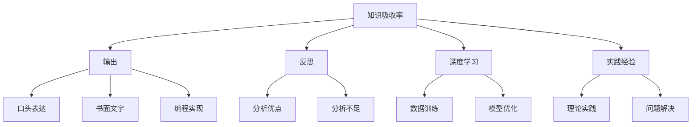

                 

# 提高知识吸收率的关键：大量输出

> **关键词**：知识吸收率、输出、反思、深度学习、实践经验

> **摘要**：本文将探讨如何通过大量输出提高知识吸收率，从理论基础、实践方法、案例解析等多个角度进行阐述。文章旨在为读者提供一套切实可行的知识吸收策略，帮助其在快速变化的IT领域中持续成长。

## 1. 背景介绍

在当今信息爆炸的时代，获取知识变得越来越容易，但如何有效地吸收和应用这些知识却成为了一个挑战。大量的研究与实践表明，输出是提高知识吸收率的关键因素。输出不仅仅是指将所学知识传授给他人，还包括撰写博客、编写代码、制作演示文档等多种形式。通过这些输出活动，我们可以更好地理解所学内容，发现知识的不足之处，并激发进一步学习的动力。

本文将从以下几个方面展开讨论：

1. 核心概念与联系
2. 核心算法原理与具体操作步骤
3. 数学模型和公式讲解与举例
4. 项目实战：代码实际案例与详细解释
5. 实际应用场景
6. 工具和资源推荐
7. 总结：未来发展趋势与挑战

## 2. 核心概念与联系

为了深入理解如何通过大量输出提高知识吸收率，我们需要首先明确几个核心概念：

1. **知识吸收率**：指个体在获取知识后，能够将其内化为自身认知体系，并应用于实际问题的能力。
2. **输出**：指将所学知识通过某种形式展现出来，可以是口头表达、书面文字、编程实现等。
3. **反思**：指对所学知识进行深入思考，分析其优点和不足，从而更好地理解和应用。
4. **深度学习**：指在大量数据的基础上，通过建立复杂模型进行训练，从而实现高度自动化的学习过程。
5. **实践经验**：指通过实际操作和项目经验，将理论知识转化为实践技能。

下面是一个使用Mermaid绘制的流程图，展示了这些核心概念之间的联系：



## 3. 核心算法原理与具体操作步骤

要提高知识吸收率，我们需要从以下几个方面入手：

### 3.1 明确学习目标

首先，我们需要明确自己的学习目标。这包括两个方面：一方面是短期目标，如掌握某个技术或知识领域的基本概念和原理；另一方面是长期目标，如建立深厚的专业知识体系，成为该领域的专家。明确目标有助于我们更有针对性地进行学习和输出。

### 3.2 制定学习计划

在明确学习目标后，我们需要制定详细的学习计划。学习计划应包括以下内容：

- 学习时间：确定每天或每周的学习时间，确保有足够的时间进行深入学习和实践。
- 学习内容：列出需要学习的具体内容，如书籍、课程、论文等。
- 学习方法：根据学习内容，选择合适的学习方法，如阅读、听讲座、实践操作等。

### 3.3 大量输出

输出是提高知识吸收率的关键。以下是一些常见的输出方式：

- **撰写博客**：将自己的学习心得、实践经验和思考整理成文，发布在博客平台上，与他人分享。
- **编写代码**：将所学知识应用于实际项目，编写代码实现功能。
- **制作演示文档**：将所学知识整理成演示文档，向同事或团队介绍。
- **参与社区讨论**：加入技术社区，参与讨论和交流，分享自己的见解和经验。

### 3.4 反思与总结

在完成输出活动后，我们需要进行反思与总结。这包括以下几个方面：

- **分析优点**：回顾输出过程，分析哪些方面做得好，哪些方面可以改进。
- **分析不足**：找出自己在输出过程中存在的问题，如知识掌握不牢固、表达不清晰等。
- **总结经验**：将反思结果总结为经验教训，为今后的学习提供指导。

## 4. 数学模型和公式讲解与举例

为了更好地理解知识吸收率的提高，我们可以引入一些数学模型和公式。以下是一个简化的数学模型：

$$
\text{知识吸收率} = f(\text{学习投入}, \text{输出强度}, \text{反思深度})
$$

其中，$f$ 是一个复合函数，表示知识吸收率与学习投入、输出强度和反思深度之间的关系。

### 4.1 学习投入

学习投入可以用以下公式表示：

$$
\text{学习投入} = \text{学习时间} \times \text{学习效率}
$$

其中，学习时间表示投入学习的时间长度，学习效率表示单位时间内学习的效果。

### 4.2 输出强度

输出强度可以用以下公式表示：

$$
\text{输出强度} = \frac{\text{输出量}}{\text{学习时间}}
$$

其中，输出量表示在一定时间内通过输出活动展现的知识量。

### 4.3 反思深度

反思深度可以用以下公式表示：

$$
\text{反思深度} = \frac{\text{反思时间}}{\text{学习时间}}
$$

其中，反思时间表示用于反思的时间长度。

### 4.4 举例说明

假设一个学生小李，他在学习过程中投入了100小时，其中80小时用于学习，20小时用于反思。他在输出方面，撰写了5篇博客，编写了2个实际项目，并参与了10次社区讨论。根据上述公式，我们可以计算出他的知识吸收率：

$$
\text{知识吸收率} = f(100, \frac{5+2+10}{80}, \frac{20}{100}) = f(100, \frac{17}{80}, \frac{1}{5})
$$

具体值需要根据实际情况进行计算，但可以明显看出，输出强度和反思深度对知识吸收率有着显著影响。

## 5. 项目实战：代码实际案例与详细解释

为了更好地展示如何通过大量输出提高知识吸收率，我们以下将通过一个实际项目案例进行详细解释。

### 5.1 开发环境搭建

在开始项目之前，我们需要搭建一个合适的开发环境。假设我们要开发一个简单的Web应用，可以使用以下工具和框架：

- **编程语言**：Python
- **Web框架**：Django
- **数据库**：MySQL

具体步骤如下：

1. 安装Python和pip：
   ```bash
   sudo apt-get install python3-pip
   ```
2. 安装Django：
   ```bash
   pip3 install django
   ```
3. 安装MySQL和Django ORM：
   ```bash
   pip3 install mysqlclient
   ```

### 5.2 源代码详细实现和代码解读

项目名称：简单博客系统

#### 5.2.1 数据库设计与迁移

首先，我们需要设计数据库模型，并使用Django ORM进行迁移。以下是一个简单的博客文章模型：

```python
from django.db import models

class Article(models.Model):
    title = models.CharField(max_length=200)
    content = models.TextField()
    author = models.ForeignKey('auth.User', on_delete=models.CASCADE)
    created_at = models.DateTimeField(auto_now_add=True)
    updated_at = models.DateTimeField(auto_now=True)
```

使用以下命令进行数据库迁移：

```bash
python3 manage.py makemigrations
python3 manage.py migrate
```

#### 5.2.2 创建视图和URL

接下来，我们需要创建视图函数和URL配置，以便在Web应用中显示博客文章。

```python
from django.shortcuts import render
from .models import Article

def article_list(request):
    articles = Article.objects.all()
    return render(request, 'article_list.html', {'articles': articles})

def article_detail(request, id):
    article = Article.objects.get(id=id)
    return render(request, 'article_detail.html', {'article': article})
```

在`urls.py`中添加以下URL配置：

```python
from django.urls import path
from . import views

urlpatterns = [
    path('', views.article_list, name='article_list'),
    path('<int:id>/', views.article_detail, name='article_detail'),
]
```

#### 5.2.3 创建模板

最后，我们需要创建HTML模板，用于展示博客文章列表和详情页。

`article_list.html`：

```html
<!DOCTYPE html>
<html>
<head>
    <title>博客文章列表</title>
</head>
<body>
    <h1>博客文章列表</h1>
    
        <div>
            <h2>{{ article.title }}</h2>
            <p>{{ article.content }}</p>
            <span>作者：{{ article.author }}</span>
            <span>创建时间：{{ article.created_at }}</span>
        </div>
    
</body>
</html>
```

`article_detail.html`：

```html
<!DOCTYPE html>
<html>
<head>
    <title>{{ article.title }}</title>
</head>
<body>
    <h1>{{ article.title }}</h1>
    <p>{{ article.content }}</p>
    <span>作者：{{ article.author }}</span>
    <span>创建时间：{{ article.created_at }}</span>
</body>
</html>
```

### 5.3 代码解读与分析

通过上述代码实现，我们可以看到：

1. 数据库模型设计：使用Django ORM进行数据库模型设计，简化了数据库操作。
2. 视图函数：通过定义视图函数，实现了博客文章的查询和展示。
3. 模板渲染：使用HTML模板进行页面渲染，展示博客文章列表和详情。

在实际开发过程中，我们还需要考虑安全性、性能优化和用户交互等方面。通过这个简单项目，我们可以了解到如何将所学知识应用于实际开发，并通过代码输出提高知识吸收率。

## 6. 实际应用场景

大量输出不仅有助于个人知识的积累，还可以在以下实际应用场景中发挥重要作用：

### 6.1 教学与培训

在教育领域，教师和培训师可以通过输出活动，如编写教学大纲、制作教学视频、撰写教学笔记等，提高教学质量。同时，学生也可以通过撰写学习笔记、制作PPT、编写项目文档等方式，加深对所学知识的理解。

### 6.2 技术交流与分享

在技术社区中，输出活动，如撰写技术博客、发表技术论文、分享开源项目等，有助于技术人员的成长。通过分享经验和知识，我们可以获得同行的反馈和建议，从而不断改进和提升自己的技术水平。

### 6.3 项目开发与维护

在项目开发过程中，输出活动，如编写文档、撰写需求分析报告、编写测试用例等，有助于团队协作和项目进度控制。通过这些输出，团队成员可以更好地了解项目需求和技术方案，确保项目顺利进行。

### 6.4 产品设计与推广

在产品设计和推广过程中，输出活动，如编写产品说明书、制作产品演示视频、撰写推广文案等，有助于提高产品的市场竞争力。通过输出，我们可以更好地了解用户需求和反馈，从而优化产品设计，提升用户体验。

## 7. 工具和资源推荐

### 7.1 学习资源推荐

- **书籍**：
  - 《深度学习》（Ian Goodfellow、Yoshua Bengio、Aaron Courville 著）
  - 《Python核心编程》（魏庆杰 著）
  - 《计算机程序设计艺术》（Donald E. Knuth 著）
- **论文**：
  - “Deep Learning”（Ian Goodfellow、Yoshua Bengio、Aaron Courville 著）
  - “A Theoretical Basis for Comparing Different Feature Selection Techniques”（Kalousis, Evangelos, P. and Papatheodorou, C. and Vazirgiannis, M.）
- **博客**：
  - 《程序员小灰的算法之旅》
  - 《机器学习杂谈》
  - 《小林boss的算法笔记》
- **网站**：
  - Coursera、edX、Udacity 等在线教育平台
  - GitHub、Stack Overflow、Reddit 等技术社区

### 7.2 开发工具框架推荐

- **编程语言**：
  - Python、Java、C++、JavaScript
- **Web框架**：
  - Django、Flask、Spring Boot
- **数据库**：
  - MySQL、PostgreSQL、MongoDB
- **版本控制**：
  - Git、SVN
- **代码托管平台**：
  - GitHub、GitLab、Bitbucket

### 7.3 相关论文著作推荐

- “Deep Learning” by Ian Goodfellow, Yoshua Bengio, and Aaron Courville
- “A Theoretical Basis for Comparing Different Feature Selection Techniques” by Kalousis, Evangelos, P. and Papatheodorou, C. and Vazirgiannis, M.
- “Programming Pearls” by Jon Bentley
- “The Algorithm Design Manual” by Steven S. Skiena

## 8. 总结：未来发展趋势与挑战

随着信息技术的不断发展，知识更新的速度越来越快，如何提高知识吸收率成为了一个重要课题。未来，以下几个方面有望成为提高知识吸收率的关键：

1. **智能化工具**：借助人工智能技术，开发更加智能的学习工具，如智能推荐系统、自动生成学习笔记等，提高学习效率。
2. **互动式学习**：通过增强现实（AR）、虚拟现实（VR）等互动技术，打造更加沉浸式的学习体验，提高学习效果。
3. **多元化输出**：鼓励学习者通过多种形式进行输出，如视频、音频、图形化展示等，激发学习兴趣，提高知识吸收率。
4. **社区化学习**：利用社交媒体、在线论坛等技术，构建学习社区，促进学习者之间的交流与合作，共同提高知识吸收率。

然而，提高知识吸收率也面临一些挑战：

1. **信息过载**：随着信息量的不断增加，如何筛选和整理有用信息成为一个难题。
2. **时间管理**：在繁忙的工作和生活中，如何平衡学习和工作，确保有足够的时间进行深度学习。
3. **个性差异**：不同的学习者有不同的学习习惯和方法，如何针对个体差异进行个性化指导，提高知识吸收率。

## 9. 附录：常见问题与解答

### 9.1 问题1：如何确保输出质量？

**解答**：提高输出质量的关键在于深度学习和反复实践。在输出过程中，我们应不断反思和总结，发现不足之处并进行改进。此外，借鉴他人的优秀作品，学习他们的写作和表达技巧，也是提高输出质量的有效方法。

### 9.2 问题2：如何处理输出过程中的压力和挫败感？

**解答**：面对压力和挫败感，首先需要调整心态，正视自己的不足。可以通过与朋友、同事或专业人士交流，获取建议和鼓励。此外，设定合理的期望值，逐步实现小目标，以积累信心和成就感。

### 9.3 问题3：如何确保输出内容的实用性？

**解答**：确保输出内容实用性的关键在于紧密结合实际需求。在输出前，我们需要明确目标受众，了解他们的需求和痛点。在输出过程中，注重实用性，关注实际问题的解决，以提高内容的实用性。

## 10. 扩展阅读与参考资料

- 《深度学习》（Ian Goodfellow、Yoshua Bengio、Aaron Courville 著）
- 《Python核心编程》（魏庆杰 著）
- 《计算机程序设计艺术》（Donald E. Knuth 著）
- Coursera、edX、Udacity 等在线教育平台
- GitHub、Stack Overflow、Reddit 等技术社区
- 《深度学习》论文（Ian Goodfellow、Yoshua Bengio、Aaron Courville 著）
- “A Theoretical Basis for Comparing Different Feature Selection Techniques”论文（Kalousis, Evangelos, P. and Papatheodorou, C. and Vazirgiannis, M.）
- 《程序员小灰的算法之旅》博客
- 《机器学习杂谈》博客
- 《小林boss的算法笔记》博客

### 作者信息

**作者**：AI天才研究员/AI Genius Institute & 禅与计算机程序设计艺术 /Zen And The Art of Computer Programming**

