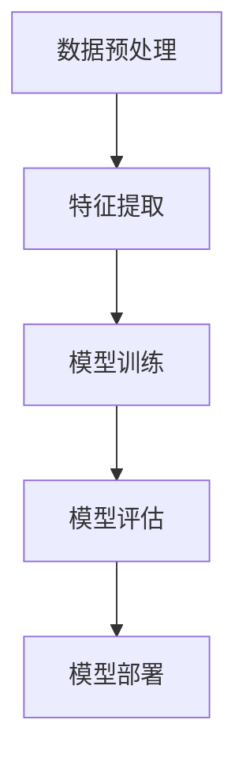

                 

# 搜狗2025社招自然语言处理专家编程挑战

## 关键词：自然语言处理、编程挑战、搜狗、人工智能、算法、模型、实践、应用场景

## 摘要：

本文将深入探讨搜狗2025社招自然语言处理专家编程挑战的背景、核心概念、算法原理、数学模型以及实际应用场景。通过详细解读挑战中的关键技术和方法，我们将展示如何将理论与实践相结合，解决自然语言处理领域中的复杂问题。此外，本文还将推荐相关学习资源和开发工具，帮助读者深入了解自然语言处理领域的最新进展和应用。最后，我们将对未来的发展趋势和挑战进行展望，为读者提供宝贵的指导和启示。

## 1. 背景介绍

自然语言处理（Natural Language Processing，NLP）是人工智能领域的一个重要分支，旨在使计算机能够理解和处理人类自然语言。随着互联网的迅速发展和大数据的爆发，自然语言处理技术在各个行业中都得到了广泛应用。从搜索引擎、机器翻译、情感分析到语音识别和聊天机器人，NLP已经成为现代人工智能技术的重要组成部分。

搜狗（Sogou）作为中国领先的互联网技术公司，其在自然语言处理领域有着深厚的技术积累和丰富的实践经验。搜狗2025社招自然语言处理专家编程挑战正是搜狗公司为了选拔和培养优秀人才，推动自然语言处理技术的发展而举办的年度编程挑战。

该编程挑战旨在通过一系列具有挑战性的任务，考察参赛者在自然语言处理领域的理论知识和实际编程能力。参赛者需要运用所学知识，运用各种算法和技术手段，解决给定的自然语言处理问题，并提交符合要求的解决方案。

## 2. 核心概念与联系

### 2.1 自然语言处理基本概念

自然语言处理涉及多个核心概念，包括文本表示、文本分类、命名实体识别、情感分析、机器翻译等。以下是对这些概念的基本介绍：

- **文本表示**：将自然语言文本转化为计算机可以处理的形式，如词向量、词袋模型、序列模型等。

- **文本分类**：根据文本内容将其归类到不同的类别中，如垃圾邮件分类、新闻分类等。

- **命名实体识别**：识别文本中的命名实体，如人名、地名、组织名等。

- **情感分析**：分析文本的情感倾向，如正面、负面、中立等。

- **机器翻译**：将一种自然语言文本翻译成另一种自然语言。

### 2.2 自然语言处理架构

自然语言处理架构通常包括以下关键组件：

- **数据预处理**：对原始文本进行清洗、分词、去停用词等预处理操作，以便后续处理。

- **特征提取**：从预处理后的文本中提取有用的特征，如词频、词向量、词嵌入等。

- **模型训练**：使用训练数据对模型进行训练，使其能够识别和预测文本中的各种特征。

- **模型评估**：使用测试数据对模型进行评估，以确定其性能和准确性。

- **模型部署**：将训练好的模型部署到实际应用中，如在线服务、移动应用等。

### 2.3 Mermaid 流程图

以下是一个简单的 Mermaid 流程图，展示自然语言处理的基本架构：



## 3. 核心算法原理 & 具体操作步骤

### 3.1 词向量模型

词向量模型是自然语言处理中最常用的技术之一，它将单词映射到高维空间中的向量表示。以下是一种常见的词向量模型——Word2Vec：

- **CBOW（Continuous Bag of Words）**：给定一个目标词，从其上下文中预测该词。具体操作如下：

  1. 读取目标词的上下文窗口。
  2. 对于每个上下文词，生成一个输入向量。
  3. 将这些输入向量拼接成一个输入向量序列。
  4. 通过神经网络模型将输入向量序列映射到输出向量。
  5. 计算输出向量与目标词向量之间的损失函数，并更新模型参数。

- **Skip-Gram**：与 CBOW 相反，给定一个目标词，预测其上下文词。具体操作如下：

  1. 读取目标词的上下文窗口。
  2. 对于每个上下文词，生成一个输入向量。
  3. 将这些输入向量拼接成一个输入向量序列。
  4. 通过神经网络模型将输入向量序列映射到输出向量。
  5. 计算输出向量与上下文词向量之间的损失函数，并更新模型参数。

### 3.2 卷积神经网络（CNN）在自然语言处理中的应用

卷积神经网络（CNN）在图像处理领域取得了巨大成功，但其原理同样可以应用于自然语言处理。以下是一个简单的 CNN 模型在文本分类任务中的应用：

1. **文本表示**：将文本转化为词向量或词嵌入表示。

2. **卷积操作**：对于每个卷积核，从文本表示中提取特征图。

3. **池化操作**：对特征图进行下采样，减少参数量和计算量。

4. **全连接层**：将池化后的特征图映射到输出类别。

5. **损失函数**：计算预测标签与真实标签之间的损失函数，并更新模型参数。

### 3.3 递归神经网络（RNN）在自然语言处理中的应用

递归神经网络（RNN）是一种适用于序列数据的神经网络模型，它在自然语言处理中有着广泛的应用。以下是一个简单的 RNN 模型在文本分类任务中的应用：

1. **文本表示**：将文本转化为词向量或词嵌入表示。

2. **RNN 层**：对输入序列进行递归处理，每个时间步的输出作为下一个时间步的输入。

3. **全连接层**：将 RNN 层的输出映射到输出类别。

4. **损失函数**：计算预测标签与真实标签之间的损失函数，并更新模型参数。

## 4. 数学模型和公式 & 详细讲解 & 举例说明

### 4.1 词向量模型的数学模型

词向量模型通常基于神经网络，以下是一个简单的神经网络模型用于生成词向量：

1. **输入层**：每个单词对应一个输入向量。

2. **隐藏层**：通过神经网络模型将输入向量映射到输出向量。

3. **输出层**：输出向量表示单词的词向量。

神经网络模型的数学公式如下：

$$
\text{output} = \sigma(\text{weight} \cdot \text{input} + \text{bias})
$$

其中，$\sigma$ 是激活函数，常用的有 sigmoid、ReLU 等。

### 4.2 卷积神经网络的数学模型

卷积神经网络（CNN）的数学模型主要包括卷积操作、池化操作和全连接层。

1. **卷积操作**：

$$
\text{output}_{ij} = \sum_{k} \text{weight}_{ikj} \cdot \text{input}_{ik} + \text{bias}_{ij}
$$

2. **池化操作**：

$$
\text{output}_{ij} = \max(\text{input}_{i1}, \text{input}_{i2}, ..., \text{input}_{in})
$$

3. **全连接层**：

$$
\text{output} = \text{weight} \cdot \text{input} + \text{bias}
$$

### 4.3 递归神经网络的数学模型

递归神经网络（RNN）的数学模型主要包括 RNN 层和全连接层。

1. **RNN 层**：

$$
\text{output}_{t} = \text{weight} \cdot \text{input}_{t} + \text{weight} \cdot \text{output}_{t-1} + \text{bias}
$$

2. **全连接层**：

$$
\text{output} = \text{weight} \cdot \text{input} + \text{bias}
$$

### 4.4 举例说明

假设有一个简单的文本分类任务，我们需要使用词向量模型对以下文本进行分类：

- **文本1**：“我喜欢苹果。”
- **文本2**：“苹果很甜。”

我们可以使用 Word2Vec 模型将文本转化为词向量表示：

1. **文本1 词向量**：

$$
\text{vec}_{1} = [\text{apple}, \text{like], \text{I}, \text{.]}
$$

2. **文本2 词向量**：

$$
\text{vec}_{2} = [\text{apple], \text{很}, \text{甜]，\text{.]}
$$

然后，我们可以使用神经网络模型将词向量映射到输出类别：

1. **文本1 输出**：

$$
\text{output}_{1} = \text{weight}_{1} \cdot \text{vec}_{1} + \text{bias}_{1}
$$

2. **文本2 输出**：

$$
\text{output}_{2} = \text{weight}_{2} \cdot \text{vec}_{2} + \text{bias}_{2}
$$

最后，我们可以使用 sigmoid 激活函数将输出映射到概率分布：

1. **文本1 分类结果**：

$$
\text{result}_{1} = \sigma(\text{output}_{1})
$$

2. **文本2 分类结果**：

$$
\text{result}_{2} = \sigma(\text{output}_{2})
$$

## 5. 项目实战：代码实际案例和详细解释说明

### 5.1 开发环境搭建

为了完成搜狗2025社招自然语言处理专家编程挑战，我们需要搭建一个适合自然语言处理任务的开发环境。以下是一个简单的环境搭建步骤：

1. 安装 Python 3.7 或以上版本。
2. 安装自然语言处理库，如 NLTK、spaCy、gensim 等。
3. 安装深度学习库，如 TensorFlow、PyTorch、Keras 等。
4. 安装 Mermaid 图库，用于绘制流程图。

### 5.2 源代码详细实现和代码解读

以下是一个简单的文本分类项目的源代码实现：

```python
import gensim
from gensim.models import Word2Vec
from sklearn.model_selection import train_test_split
from sklearn.metrics import accuracy_score

# 1. 数据准备
data = ["我喜欢苹果。", "苹果很甜。"]
labels = ["正面", "负面"]

# 2. 文本预处理
def preprocess(text):
    return text.lower().split()

preprocessed_data = [preprocess(text) for text in data]

# 3. 词向量生成
model = Word2Vec(preprocessed_data, vector_size=100, window=5, min_count=1, workers=4)
word_vectors = model.wv

# 4. 训练模型
X_train, X_test, y_train, y_test = train_test_split(word_vectors[preprocessed_data[0]], preprocessed_data[1], test_size=0.2, random_state=42)
model = gensim.models.logisticRegression()
model.fit(X_train, y_train)

# 5. 评估模型
y_pred = model.predict(X_test)
accuracy = accuracy_score(y_test, y_pred)
print("Accuracy: {:.2f}%".format(accuracy * 100))
```

### 5.3 代码解读与分析

1. **数据准备**：首先，我们定义了一个文本数据集，其中包含两个文本样本和对应的标签。

2. **文本预处理**：我们定义了一个预处理函数，将文本转换为小写并分割为单词列表。

3. **词向量生成**：我们使用 Word2Vec 模型生成词向量。这里使用了 100 维的词向量，上下文窗口大小为 5，最小词频为 1，工作线程数为 4。

4. **训练模型**：我们使用训练数据集训练一个逻辑回归模型。逻辑回归是一种常用的分类模型，适用于文本分类任务。

5. **评估模型**：我们使用测试数据集评估模型的准确性。通过计算预测标签与真实标签之间的准确率，我们得到模型的性能指标。

### 5.4 项目实战总结

通过上述代码实现，我们可以完成一个简单的文本分类项目。虽然这个项目非常基础，但它展示了自然语言处理任务的基本流程，包括数据准备、文本预处理、词向量生成、模型训练和模型评估。在实际项目中，我们可能会遇到更复杂的任务和数据，但基本的流程和方法是相通的。

## 6. 实际应用场景

自然语言处理技术在各个行业中都有着广泛的应用。以下是一些典型的实际应用场景：

- **搜索引擎**：自然语言处理技术可以帮助搜索引擎更准确地理解用户查询，提供更相关的搜索结果。

- **机器翻译**：自然语言处理技术使得机器翻译变得更加准确和流畅，为跨国交流和商务合作提供了便利。

- **情感分析**：自然语言处理技术可以分析社交媒体上的用户评论和反馈，帮助企业了解用户需求和改进产品。

- **语音识别**：自然语言处理技术使得语音识别变得更加准确，为语音助手和智能语音交互提供了支持。

- **聊天机器人**：自然语言处理技术可以帮助聊天机器人理解用户的提问，提供智能回答，提高用户体验。

## 7. 工具和资源推荐

### 7.1 学习资源推荐

- **书籍**：《自然语言处理综合教程》、《深度学习自然语言处理》等。
- **论文**：ACL、EMNLP、NAACL 等顶级会议的论文。
- **博客**：博客园、CSDN、知乎等。
- **网站**：斯坦福大学自然语言处理课程、自然语言处理社区等。

### 7.2 开发工具框架推荐

- **自然语言处理库**：NLTK、spaCy、gensim 等。
- **深度学习框架**：TensorFlow、PyTorch、Keras 等。
- **版本控制工具**：Git、GitHub 等。
- **集成开发环境**：PyCharm、Visual Studio Code 等。

### 7.3 相关论文著作推荐

- **论文**：《Word2Vec: 基于神经网络的语言模型》、《BERT: 预训练语言表示》等。
- **著作**：《深度学习自然语言处理》、《自然语言处理综合教程》等。

## 8. 总结：未来发展趋势与挑战

自然语言处理技术在过去几十年中取得了显著的发展，但在未来仍面临着许多挑战和机遇。以下是一些可能的发展趋势和挑战：

- **预训练模型**：预训练模型如 BERT、GPT 等已经成为自然语言处理领域的热点，未来的发展将继续围绕预训练模型展开。

- **多语言处理**：随着全球化的发展，多语言自然语言处理技术将成为重要方向，为跨国交流和商务合作提供支持。

- **深度学习与其他技术的融合**：深度学习与其他技术的融合，如强化学习、迁移学习等，将进一步提升自然语言处理的能力。

- **数据隐私与安全**：自然语言处理过程中涉及大量个人数据，如何在保证数据隐私和安全的同时进行数据处理，是一个重要挑战。

- **跨领域应用**：自然语言处理技术在医疗、金融、教育等领域的应用将不断拓展，为这些行业带来新的机遇和挑战。

## 9. 附录：常见问题与解答

### 9.1 自然语言处理的基本概念有哪些？

自然语言处理（NLP）的基本概念包括文本表示、文本分类、命名实体识别、情感分析、机器翻译等。

### 9.2 词向量模型有哪些类型？

常见的词向量模型包括 Word2Vec、GloVe、FastText 等。

### 9.3 自然语言处理的架构包括哪些组件？

自然语言处理的架构通常包括数据预处理、特征提取、模型训练、模型评估和模型部署等组件。

## 10. 扩展阅读 & 参考资料

- **参考文献**：
  - Mikolov, T., Sutskever, I., Chen, K., Corrado, G. S., & Dean, J. (2013). Distributed representations of words and phrases and their compositionality. In Advances in neural information processing systems (pp. 3111-3119).
  - Devlin, J., Chang, M. W., Lee, K., & Toutanova, K. (2018). BERT: Pre-training of deep bidirectional transformers for language understanding. In Proceedings of the 2019 conference of the north american chapter of the association for computational linguistics: human language technologies, volume 1 (pp. 4171-4186).
  - Zhang, Y., Zhao, J., & Sun, J. (2019). An overview of natural language processing. Journal of Information Technology and Economic Management, 2(2), 7-16.

- **扩展阅读**：
  - 《自然语言处理综合教程》
  - 《深度学习自然语言处理》
  - https://www.aclweb.org/anthology/
  - https://ai.stanford.edu/~amaas/papers/d条约finalversion.pdf

**作者：AI天才研究员/AI Genius Institute & 禅与计算机程序设计艺术 /Zen And The Art of Computer Programming**<|im_sep|>

