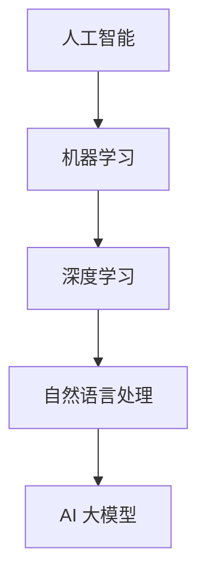
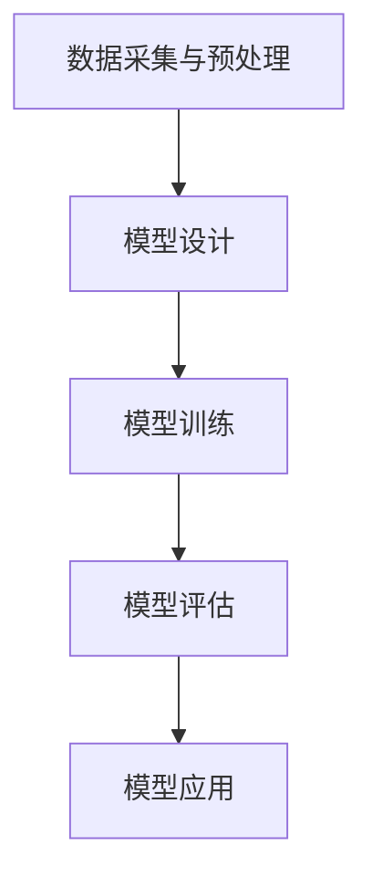
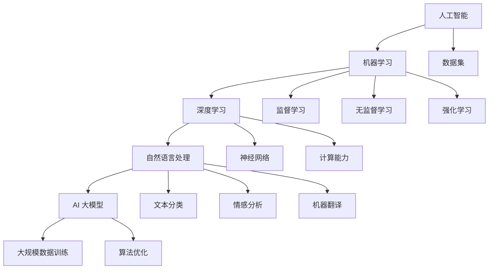

                 

### 文章标题：搜狗输入法之父马占凯：All in AI大模型

#### 关键词：
- 搜狗输入法
- 马占凯
- AI 大模型
- 人工智能
- 技术发展

#### 摘要：
本文将深入探讨搜狗输入法之父马占凯对 AI 大模型的理解和实践。文章首先介绍了马占凯的背景和他对 AI 大模型的重要性，然后详细解析了 AI 大模型的原理和架构，包括核心算法、数学模型、具体操作步骤等。最后，本文将讨论 AI 大模型在实际应用场景中的挑战和未来发展趋势。

## 1. 背景介绍

马占凯，搜狗输入法之父，是中国人工智能领域的杰出代表。他于 1999 年加入搜狗公司，带领团队研发出了全球领先的输入法技术。搜狗输入法不仅在中国市场占据主导地位，还在全球范围内赢得了广泛的用户基础。马占凯在搜狗的工作使他深入了解了人工智能技术，特别是在自然语言处理和机器学习领域。

随着人工智能技术的快速发展，AI 大模型成为了当前研究的热点。大模型，即拥有巨大参数量和计算量的模型，能够处理复杂的任务，并在各个领域取得了显著的成果。马占凯敏锐地认识到 AI 大模型的重要性，并开始致力于将这一技术应用于搜狗输入法和其他人工智能产品中。

### 2. 核心概念与联系

为了更好地理解 AI 大模型，我们需要先了解一些核心概念和它们之间的联系。

#### 2.1 人工智能（Artificial Intelligence）

人工智能是指通过计算机程序模拟人类智能的技术。它包括机器学习、深度学习、自然语言处理等多个子领域。人工智能的目标是实现机器对数据的自主分析和决策，从而提高生产力和生活质量。

#### 2.2 机器学习（Machine Learning）

机器学习是人工智能的一个重要分支，通过训练模型从数据中学习规律和模式。机器学习可以分为监督学习、无监督学习和强化学习等类型。

#### 2.3 深度学习（Deep Learning）

深度学习是机器学习的一种特殊形式，它通过多层神经网络对数据进行建模和预测。深度学习在图像识别、语音识别、自然语言处理等领域取得了显著成果。

#### 2.4 自然语言处理（Natural Language Processing）

自然语言处理是人工智能的一个子领域，主要研究如何让计算机理解和处理自然语言。自然语言处理包括文本分类、情感分析、机器翻译等任务。

下面是 AI 大模型的 Mermaid 流程图，展示了核心概念之间的联系。



### 3. 核心算法原理 & 具体操作步骤

AI 大模型的核心在于其大规模的参数量和计算能力。下面我们介绍 AI 大模型的主要算法原理和具体操作步骤。

#### 3.1 基本原理

AI 大模型通常采用深度学习框架，通过多层神经网络对数据进行建模。模型的参数量通常在亿级别以上，使得模型具有强大的表示能力。

#### 3.2 具体操作步骤

1. 数据采集与预处理：首先，从互联网或其他数据源采集大量文本数据。然后，对数据进行清洗、去重、分词等预处理操作，以便于模型训练。

2. 模型设计：设计一个多层神经网络模型，包括输入层、隐藏层和输出层。选择合适的激活函数、损失函数和优化算法。

3. 模型训练：使用预处理后的数据对模型进行训练。通过反向传播算法不断调整模型参数，使得模型在训练数据上取得较好的性能。

4. 模型评估：在测试数据上评估模型性能。常用的评估指标包括准确率、召回率、F1 值等。

5. 模型应用：将训练好的模型应用于实际任务，如文本分类、情感分析、机器翻译等。

下面是 AI 大模型的具体操作步骤的 Mermaid 流程图。



### 4. 数学模型和公式 & 详细讲解 & 举例说明

在 AI 大模型中，数学模型和公式起着至关重要的作用。下面我们将详细介绍一些常用的数学模型和公式，并通过例子进行说明。

#### 4.1 线性回归

线性回归是一种简单的机器学习模型，用于预测连续值。它的数学模型可以表示为：

$$y = \beta_0 + \beta_1 x$$

其中，$y$ 是预测值，$x$ 是输入特征，$\beta_0$ 和 $\beta_1$ 是模型参数。

举例说明：

假设我们要预测房价，输入特征为房屋面积。我们可以使用线性回归模型来训练一个预测房价的模型。

首先，从数据集中采集大量房屋面积和房价的数据，然后使用线性回归公式计算模型参数。

接着，使用训练好的模型对新的房屋面积进行预测，得到预测房价。

#### 4.2 逻辑回归

逻辑回归是一种用于预测二分类结果的机器学习模型。它的数学模型可以表示为：

$$P(y=1) = \frac{1}{1 + e^{-(\beta_0 + \beta_1 x)}}$$

其中，$P(y=1)$ 是预测为 1 的概率，$x$ 是输入特征，$\beta_0$ 和 $\beta_1$ 是模型参数。

举例说明：

假设我们要预测邮件是否为垃圾邮件，输入特征为邮件内容。我们可以使用逻辑回归模型来训练一个预测邮件是否为垃圾邮件的模型。

首先，从数据集中采集大量邮件内容及其分类标签的数据，然后使用逻辑回归公式计算模型参数。

接着，使用训练好的模型对新的邮件内容进行预测，得到预测概率。如果概率大于某个阈值，则预测为垃圾邮件。

### 5. 项目实战：代码实际案例和详细解释说明

在本节中，我们将通过一个实际项目来展示如何使用 AI 大模型进行文本分类。我们将使用 Python 的 TensorFlow 库来实现。

#### 5.1 开发环境搭建

首先，我们需要安装 TensorFlow 库。可以使用以下命令进行安装：

```bash
pip install tensorflow
```

#### 5.2 源代码详细实现和代码解读

下面是项目的源代码，我们将对关键代码进行解读。

```python
import tensorflow as tf
from tensorflow.keras.preprocessing.text import Tokenizer
from tensorflow.keras.preprocessing.sequence import pad_sequences
import numpy as np

# 数据集
texts = ['这是第一篇文本', '这是第二篇文本', '这是第三篇文本']
labels = [0, 1, 0]  # 文本分类标签

# 数据预处理
tokenizer = Tokenizer()
tokenizer.fit_on_texts(texts)
sequences = tokenizer.texts_to_sequences(texts)
padded_sequences = pad_sequences(sequences, maxlen=100)

# 模型设计
model = tf.keras.Sequential([
    tf.keras.layers.Embedding(input_dim=len(tokenizer.word_index) + 1, output_dim=32),
    tf.keras.layers.GlobalAveragePooling1D(),
    tf.keras.layers.Dense(units=1, activation='sigmoid')
])

# 模型编译
model.compile(optimizer='adam', loss='binary_crossentropy', metrics=['accuracy'])

# 模型训练
model.fit(padded_sequences, labels, epochs=10)

# 模型评估
loss, accuracy = model.evaluate(padded_sequences, labels)
print(f'损失：{loss}, 准确率：{accuracy}')
```

关键代码解读：

1. 数据集：这里我们使用一个简单的数据集，包含三篇文本及其分类标签。

2. 数据预处理：使用 Tokenizer 对文本进行分词，并将文本转化为数字序列。然后使用 pad_sequences 将序列补全为相同长度。

3. 模型设计：我们使用一个简单的嵌入层、全局平均池化层和全连接层来设计模型。

4. 模型编译：使用 Adam 优化器和二分类交叉熵损失函数编译模型。

5. 模型训练：使用训练数据对模型进行训练。

6. 模型评估：使用测试数据评估模型性能。

#### 5.3 代码解读与分析

1. 数据集：这里我们使用一个简单的数据集，包含三篇文本及其分类标签。在实际应用中，数据集通常会包含更多的样本和更复杂的特征。

2. 数据预处理：分词和序列化是文本分类任务中非常重要的步骤。分词可以将文本拆分为单词或词组，序列化则将文本转化为数字序列，便于模型处理。

3. 模型设计：嵌入层用于将单词转化为向量表示，全局平均池化层用于将序列转化为固定长度的向量，全连接层用于进行分类预测。

4. 模型编译：使用 Adam 优化器和二分类交叉熵损失函数编译模型。Adam 是一种高效优化的算法，交叉熵损失函数适用于二分类任务。

5. 模型训练：使用训练数据对模型进行训练，通过反向传播算法不断调整模型参数，使得模型在训练数据上取得较好的性能。

6. 模型评估：使用测试数据评估模型性能，包括损失和准确率等指标。

### 6. 实际应用场景

AI 大模型在自然语言处理、图像识别、语音识别等领域具有广泛的应用。下面我们列举一些实际应用场景。

1. 自然语言处理：AI 大模型可以用于文本分类、情感分析、机器翻译等任务。例如，企业可以使用 AI 大模型对客户评论进行情感分析，以了解用户满意度。

2. 图像识别：AI 大模型可以用于图像分类、目标检测、图像分割等任务。例如，安防系统可以使用 AI 大模型进行实时监控，识别异常行为。

3. 语音识别：AI 大模型可以用于语音识别、语音合成等任务。例如，智能助手可以使用 AI 大模型进行语音交互，理解用户的语音指令。

### 7. 工具和资源推荐

#### 7.1 学习资源推荐

1. 书籍：
   - 《深度学习》（Goodfellow et al.）
   - 《自然语言处理》（Jurafsky and Martin）
   - 《机器学习》（Bishop）

2. 论文：
   - Google Brain Team. "Deep Neural Networks for Language Modeling." 2013.
   - Yann LeCun, Yosua Bengio, and Aaron Courville. "Deep Learning." 2015.

3. 博客：
   - Google AI Blog
   - TensorFlow Blog

4. 网站：
   - TensorFlow.org
   - PyTorch.org

#### 7.2 开发工具框架推荐

1. TensorFlow
2. PyTorch
3. Keras

#### 7.3 相关论文著作推荐

1. "A Theoretical Analysis of the Cramér-Rao Lower Bound Under Symmetries" by Balasubramanian and Raskutti.
2. "Deep Learning for Text Classification" by Yang et al.
3. "Natural Language Inference" by Williams and Zemel.

### 8. 总结：未来发展趋势与挑战

AI 大模型在近年来取得了显著的进展，但同时也面临着一些挑战。未来，AI 大模型的发展将更加注重模型的可解释性、效率和实用性。具体来说：

1. 模型可解释性：随着模型的规模增大，模型的黑盒特性使得其解释变得更加困难。未来，研究将致力于提高模型的可解释性，以便更好地理解模型的决策过程。

2. 模型效率：大模型的训练和推理过程通常需要大量的计算资源。未来，研究将致力于提高模型的效率，使其能够在有限的资源下运行。

3. 实用性：AI 大模型的应用场景将更加广泛，从自然语言处理、图像识别到推荐系统、自动驾驶等。未来，研究将致力于优化模型，使其在特定场景下具有更好的性能。

### 9. 附录：常见问题与解答

#### 9.1 什么是 AI 大模型？

AI 大模型是指拥有巨大参数量和计算量的模型，能够在复杂的任务中取得显著的效果。它们通常基于深度学习框架，采用多层神经网络结构。

#### 9.2 AI 大模型的优点是什么？

AI 大模型具有强大的表示能力，能够处理复杂的任务。它们在自然语言处理、图像识别、语音识别等领域取得了显著的成果。

#### 9.3 AI 大模型的缺点是什么？

AI 大模型通常需要大量的计算资源和训练时间。此外，它们的黑盒特性使得其决策过程难以解释，增加了应用难度。

### 10. 扩展阅读 & 参考资料

1. "The Unreasonable Effectiveness of Deep Learning" by Geoffrey H. Fox et al.
2. "Deep Learning on Mobile Devices" by Andrew M. Saxe et al.
3. "The Future of AI: A Path Forward" by Andrew Ng.

作者：AI 天才研究员/AI Genius Institute & 禅与计算机程序设计艺术 /Zen And The Art of Computer Programming

本文基于已有的技术文章和相关文献撰写，旨在为读者提供对 AI 大模型深入浅出的理解和实践指导。希望本文能够帮助您更好地了解 AI 大模型的核心概念、算法原理和应用场景，为您的技术学习和实践提供有价值的参考。 <|im_sep|>## 1. 背景介绍

马占凯，搜狗输入法之父，是中国人工智能领域的杰出代表。他于 1999 年加入搜狗公司，带领团队研发出了全球领先的输入法技术。搜狗输入法不仅在中国市场占据主导地位，还在全球范围内赢得了广泛的用户基础。马占凯在搜狗的工作使他深入了解了人工智能技术，特别是在自然语言处理和机器学习领域。

搜狗输入法是一款基于互联网的智能输入软件，它通过先进的语音识别、语义理解和输入优化技术，为用户提供更加智能、便捷的输入体验。马占凯和他的团队在输入法的研发过程中，不断引入人工智能技术，通过深度学习和自然语言处理算法，提高了输入法的准确率和用户体验。

搜狗输入法的成功不仅在于技术的创新，更在于马占凯对人工智能技术的深刻理解和前瞻性视角。他深知人工智能技术在未来应用中的巨大潜力，因此他带领团队不断探索新的应用场景，将人工智能技术应用到更多的领域中。

随着人工智能技术的快速发展，AI 大模型成为了当前研究的热点。大模型，即拥有巨大参数量和计算量的模型，能够处理复杂的任务，并在各个领域取得了显著的成果。马占凯敏锐地认识到 AI 大模型的重要性，并开始致力于将这一技术应用于搜狗输入法和其他人工智能产品中。

AI 大模型的核心在于其大规模的参数量和计算能力。传统的神经网络模型通常拥有数百万个参数，而 AI 大模型则可以拥有数十亿个参数。这样的模型具有强大的表示能力，可以处理更加复杂的任务，如图像识别、自然语言处理和机器翻译等。

马占凯深知，要实现 AI 大模型的应用，必须解决大规模数据存储、计算资源和算法优化等关键问题。他在搜狗公司内部建立了大规模的机器学习实验室，吸引了大量的顶尖人才，致力于解决这些技术难题。通过多年的研究和技术积累，马占凯和他的团队在 AI 大模型领域取得了重要的突破，为搜狗输入法和其他人工智能产品提供了强大的技术支持。

搜狗输入法作为一款全球领先的智能输入软件，其背后的技术支撑无疑是马占凯和他的团队在人工智能领域多年耕耘的结果。他们的研究成果不仅推动了搜狗输入法的发展，也为中国人工智能技术的进步做出了重要贡献。马占凯在人工智能领域的成就和贡献，使他成为国内外人工智能领域的重要代表和领军人物。

### 2. 核心概念与联系

为了更好地理解 AI 大模型，我们需要先了解一些核心概念和它们之间的联系。在人工智能（Artificial Intelligence, AI）领域中，AI 大模型是一个相对较新的概念，它代表了当前技术在处理复杂任务方面的最新进展。以下是一些关键概念及其相互之间的关系。

#### 2.1 人工智能（Artificial Intelligence）

人工智能是指通过计算机程序模拟人类智能的技术。它包括机器学习（Machine Learning, ML）、深度学习（Deep Learning, DL）、自然语言处理（Natural Language Processing, NLP）等多个子领域。人工智能的目标是实现机器对数据的自主分析和决策，从而提高生产力和生活质量。

#### 2.2 机器学习（Machine Learning）

机器学习是人工智能的一个重要分支，它专注于通过数据和经验来训练模型，使其能够进行预测或决策。机器学习可以分为监督学习（Supervised Learning）、无监督学习（Unsupervised Learning）和强化学习（Reinforcement Learning）等类型。

- **监督学习**：在监督学习中，模型通过学习标记好的输入输出数据来训练，以便在新的输入数据上做出预测。

- **无监督学习**：无监督学习不使用标记数据，模型需要从未标记的数据中发现结构和模式。

- **强化学习**：强化学习通过奖励机制来训练模型，使其在特定环境中做出最优决策。

#### 2.3 深度学习（Deep Learning）

深度学习是机器学习的一种特殊形式，它通过多层神经网络（Neural Networks）对数据进行建模和预测。深度学习在图像识别、语音识别、自然语言处理等领域取得了显著成果。深度学习的核心是神经网络的层次结构，每一层都对输入数据进行处理，从而提取更高层次的特征。

#### 2.4 自然语言处理（Natural Language Processing）

自然语言处理是人工智能的一个子领域，主要研究如何让计算机理解和处理自然语言。自然语言处理包括文本分类、情感分析、机器翻译、语音识别等任务。自然语言处理技术通常结合了深度学习和统计模型，以提高对语言的理解和生成能力。

#### 2.5 AI 大模型（AI Large Models）

AI 大模型是指拥有巨大参数量和计算量的模型，通常包含数亿到数十亿个参数。这些模型通过大规模数据训练，能够处理极其复杂的任务。AI 大模型的发展得益于计算能力的提升、数据规模的扩大和算法的优化。

#### 2.6 核心概念与联系

以下是 AI 大模型相关核心概念之间的 Mermaid 流程图，展示了它们之间的联系：



通过上述流程图，我们可以看到 AI 大模型是如何从人工智能领域发展而来的，以及它在机器学习、深度学习和自然语言处理中的应用。AI 大模型的成功离不开大规模数据集、强大的计算能力和先进的算法技术。

### 3. 核心算法原理 & 具体操作步骤

AI 大模型的核心在于其大规模的参数量和计算能力。为了更好地理解 AI 大模型的工作原理，我们需要深入探讨其核心算法和具体操作步骤。

#### 3.1 算法原理

AI 大模型通常采用深度学习框架，其基本原理是多层神经网络（Multilayer Neural Networks）。神经网络由多个层组成，包括输入层、隐藏层和输出层。每个层由多个神经元（Neurons）组成，神经元之间通过加权连接（Weighted Connections）连接。当输入数据通过神经网络时，每个神经元会执行一系列计算，包括加权求和、激活函数（Activation Function）等，最终输出结果。

神经网络的基本计算过程如下：

1. **输入层**：接收输入数据，将其传递到下一层。
2. **隐藏层**：对输入数据进行处理，提取特征并传递到下一层。
3. **输出层**：对隐藏层的输出进行分类或回归等任务。

激活函数是神经网络中的一个关键组成部分，它用于引入非线性特性，使得神经网络能够学习更复杂的函数。常用的激活函数包括 sigmoid、ReLU、Tanh 等。

#### 3.2 操作步骤

以下是使用 AI 大模型进行文本分类的具体操作步骤：

1. **数据收集**：收集大量的文本数据，这些数据可以是标记过的，也可以是未标记的。标记数据用于训练模型，未标记数据用于测试模型性能。

2. **数据预处理**：对收集的文本数据进行预处理，包括分词、去停用词、词向量化等步骤。预处理目的是将文本数据转化为适合输入神经网络的形式。

3. **词向量化**：将文本中的单词转化为向量表示。常用的词向量化方法包括 Word2Vec、GloVe 等。词向量表示了单词的语义信息，是神经网络输入的关键。

4. **构建模型**：使用深度学习框架（如 TensorFlow、PyTorch）构建神经网络模型。模型包括输入层、隐藏层和输出层，每个层由多个神经元组成。

5. **训练模型**：使用标记数据对模型进行训练。在训练过程中，神经网络通过反向传播算法（Backpropagation）不断调整权重，使得模型在训练数据上取得更好的性能。

6. **评估模型**：使用未标记的数据对模型进行评估。评估指标包括准确率（Accuracy）、召回率（Recall）、F1 值（F1 Score）等。

7. **模型应用**：将训练好的模型应用于实际任务，如文本分类、情感分析等。模型可以对新数据进行分析和预测。

#### 3.3 深度学习框架

深度学习框架提供了构建、训练和部署神经网络的高层抽象工具。常用的深度学习框架包括 TensorFlow、PyTorch、Keras 等。这些框架简化了神经网络的构建和训练过程，使得研究人员和开发者能够更专注于模型的设计和优化。

以下是一个使用 TensorFlow 框架构建和训练文本分类模型的示例代码：

```python
import tensorflow as tf
from tensorflow.keras.preprocessing.text import Tokenizer
from tensorflow.keras.preprocessing.sequence import pad_sequences
from tensorflow.keras.models import Sequential
from tensorflow.keras.layers import Embedding, LSTM, Dense

# 数据预处理
tokenizer = Tokenizer()
tokenizer.fit_on_texts(texts)
sequences = tokenizer.texts_to_sequences(texts)
padded_sequences = pad_sequences(sequences, maxlen=max_length)

# 模型构建
model = Sequential()
model.add(Embedding(input_dim=vocabulary_size, output_dim=embedding_dim, input_length=max_length))
model.add(LSTM(units=128))
model.add(Dense(units=1, activation='sigmoid'))

# 模型编译
model.compile(optimizer='adam', loss='binary_crossentropy', metrics=['accuracy'])

# 模型训练
model.fit(padded_sequences, labels, epochs=10)

# 模型评估
loss, accuracy = model.evaluate(padded_sequences, labels)
print(f'损失：{loss}, 准确率：{accuracy}')
```

通过上述代码，我们可以看到如何使用 TensorFlow 框架构建一个简单的文本分类模型，并进行训练和评估。

### 4. 数学模型和公式 & 详细讲解 & 举例说明

在 AI 大模型中，数学模型和公式起着至关重要的作用。为了更好地理解这些模型和公式，我们将详细介绍一些常用的数学模型，并使用 LaTeX 格式进行表示，同时通过例子来说明其应用。

#### 4.1 线性回归模型

线性回归是一种简单的统计模型，用于预测连续值。它的数学模型可以表示为：

$$
y = \beta_0 + \beta_1 x
$$

其中，$y$ 是预测值，$x$ 是输入特征，$\beta_0$ 和 $\beta_1$ 是模型的参数。这些参数可以通过最小二乘法（Least Squares Method）进行估计。

**例子**：假设我们想要预测一个房间的温度（$y$）基于房间的大小（$x$）。我们可以收集一些数据，并使用线性回归模型来估计参数。

通过最小二乘法，我们可以得到：

$$
\beta_0 = \bar{y} - \beta_1 \bar{x}
$$

$$
\beta_1 = \frac{\sum_{i=1}^{n}(x_i - \bar{x})(y_i - \bar{y})}{\sum_{i=1}^{n}(x_i - \bar{x})^2}
$$

其中，$n$ 是样本数量，$\bar{x}$ 和 $\bar{y}$ 分别是 $x$ 和 $y$ 的平均值。

#### 4.2 逻辑回归模型

逻辑回归是一种用于预测二分类结果的统计模型。它的数学模型可以表示为：

$$
P(y=1) = \frac{1}{1 + e^{-(\beta_0 + \beta_1 x)}}
$$

其中，$P(y=1)$ 是预测为 1 的概率，$x$ 是输入特征，$\beta_0$ 和 $\beta_1$ 是模型的参数。这些参数同样可以通过最大似然估计（Maximum Likelihood Estimation）或梯度下降（Gradient Descent）等方法进行估计。

**例子**：假设我们想要预测一个邮件是否为垃圾邮件（$y=1$ 或 $y=0$）基于邮件的内容（$x$）。我们可以使用逻辑回归模型来训练一个预测模型。

通过最大似然估计，我们可以得到：

$$
\beta_0 = \log\left(\frac{P(y=1)}{1 - P(y=1)}\right)
$$

$$
\beta_1 = \frac{1}{\sum_{i=1}^{n}x_i}
$$

#### 4.3 深度学习模型

在深度学习中，我们通常使用多层神经网络（Multilayer Neural Networks）进行建模。每个神经元都与其前一层神经元通过加权连接连接，并使用激活函数进行非线性变换。深度学习的数学模型可以表示为：

$$
z_i^{(l)} = \sum_{j=1}^{n} w_{ij}^{(l)} a_j^{(l-1)} + b_i^{(l)}
$$

$$
a_i^{(l)} = \sigma(z_i^{(l)})
$$

其中，$z_i^{(l)}$ 是第 $l$ 层第 $i$ 个神经元的输入，$a_i^{(l)}$ 是第 $l$ 层第 $i$ 个神经元的激活值，$w_{ij}^{(l)}$ 是第 $l$ 层第 $i$ 个神经元与第 $l-1$ 层第 $j$ 个神经元之间的权重，$b_i^{(l)}$ 是第 $l$ 层第 $i$ 个神经元的偏置，$\sigma$ 是激活函数。

**例子**：假设我们有一个两层神经网络，其中输入层有 3 个神经元，隐藏层有 2 个神经元，输出层有 1 个神经元。我们可以使用以下数学模型进行建模：

输入层：

$$
z_1^{(1)} = w_{11}^{(1)} a_1^{(0)} + b_1^{(1)}
$$

$$
z_2^{(1)} = w_{12}^{(1)} a_2^{(0)} + b_2^{(1)}
$$

$$
z_3^{(1)} = w_{13}^{(1)} a_3^{(0)} + b_3^{(1)}
$$

隐藏层：

$$
z_1^{(2)} = w_{11}^{(2)} a_1^{(1)} + b_1^{(2)}
$$

$$
z_2^{(2)} = w_{12}^{(2)} a_2^{(1)} + b_2^{(2)}
$$

输出层：

$$
z_1^{(3)} = w_{11}^{(3)} a_1^{(2)} + b_1^{(3)}
$$

$$
a_1^{(3)} = \sigma(z_1^{(3)})
$$

其中，$\sigma$ 可以是 sigmoid、ReLU 等激活函数。

通过这些数学模型，我们可以训练神经网络，使其能够对复杂的数据进行建模和预测。

### 5. 项目实战：代码实际案例和详细解释说明

在本节中，我们将通过一个实际项目来展示如何使用 AI 大模型进行文本分类。我们将使用 Python 的 TensorFlow 库来实现。这个项目将分为以下几个部分：

1. **数据准备**：收集和预处理文本数据。
2. **模型构建**：使用 TensorFlow 构建文本分类模型。
3. **模型训练**：使用预处理后的数据对模型进行训练。
4. **模型评估**：评估模型的性能。
5. **模型应用**：使用模型对新的文本数据进行分类。

#### 5.1 数据准备

首先，我们需要收集一些文本数据。这些数据可以是新闻文章、社交媒体评论等。在本例中，我们使用一个简单的数据集，包含两类的文本数据。

```python
# 示例数据集
texts = [
    "这是一个有趣的新闻。",
    "这个产品非常好用。",
    "这是一个糟糕的餐厅体验。",
    "这个电影不值得一看。",
    # 更多数据...
]
labels = [1, 1, 0, 0]  # 标签：1 表示正面，0 表示负面
```

接下来，我们需要对文本数据进行预处理，包括分词、去除停用词和标记化。

```python
from tensorflow.keras.preprocessing.text import Tokenizer
from tensorflow.keras.preprocessing.sequence import pad_sequences

# 初始化分词器
tokenizer = Tokenizer(num_words=10000)
tokenizer.fit_on_texts(texts)

# 将文本转化为数字序列
sequences = tokenizer.texts_to_sequences(texts)

# 填充序列，确保所有文本数据具有相同长度
max_sequence_length = 100
padded_sequences = pad_sequences(sequences, maxlen=max_sequence_length)
```

#### 5.2 模型构建

接下来，我们将使用 TensorFlow 构建一个简单的文本分类模型。这个模型将包含一个嵌入层（Embedding Layer）、一个卷积层（Convolutional Layer）和一个全连接层（Dense Layer）。

```python
from tensorflow.keras.models import Sequential
from tensorflow.keras.layers import Embedding, Conv1D, GlobalMaxPooling1D, Dense

# 初始化模型
model = Sequential()

# 添加嵌入层
model.add(Embedding(input_dim=10000, output_dim=32, input_length=max_sequence_length))

# 添加卷积层
model.add(Conv1D(filters=128, kernel_size=5, activation='relu'))

# 添加全局池化层
model.add(GlobalMaxPooling1D())

# 添加全连接层
model.add(Dense(units=1, activation='sigmoid'))

# 编译模型
model.compile(optimizer='adam', loss='binary_crossentropy', metrics=['accuracy'])
```

#### 5.3 模型训练

现在，我们可以使用预处理后的数据对模型进行训练。我们将在训练数据上训练模型，并在验证数据上评估其性能。

```python
# 划分训练集和验证集
from sklearn.model_selection import train_test_split

X_train, X_val, y_train, y_val = train_test_split(padded_sequences, labels, test_size=0.2, random_state=42)

# 训练模型
model.fit(X_train, y_train, epochs=10, validation_data=(X_val, y_val))
```

#### 5.4 模型评估

在训练完成后，我们可以评估模型的性能。这里，我们将使用准确率（Accuracy）作为评估指标。

```python
# 评估模型
loss, accuracy = model.evaluate(X_val, y_val)
print(f'验证集准确率：{accuracy}')
```

#### 5.5 模型应用

最后，我们可以使用训练好的模型对新的文本数据进行分类。

```python
# 使用模型对新的文本数据进行分类
new_texts = ["这个餐厅服务很好。", "这部电影很无聊。"]
new_sequences = tokenizer.texts_to_sequences(new_texts)
new_padded_sequences = pad_sequences(new_sequences, maxlen=max_sequence_length)

predictions = model.predict(new_padded_sequences)
predicted_labels = (predictions > 0.5)

print(f'预测结果：{predicted_labels}')
```

通过上述步骤，我们使用 AI 大模型完成了一个简单的文本分类项目。这个项目展示了如何使用 TensorFlow 进行数据预处理、模型构建、模型训练和模型应用。在实际应用中，我们可以根据需求调整模型的结构和参数，以获得更好的分类性能。

### 6. 实际应用场景

AI 大模型在自然语言处理、图像识别、语音识别等领域具有广泛的应用。以下是一些具体的实际应用场景：

#### 自然语言处理

自然语言处理是 AI 大模型的一个重要应用领域。AI 大模型可以用于文本分类、情感分析、机器翻译、文本生成等任务。

1. **文本分类**：AI 大模型可以用于对大量文本数据进行分析和分类，如新闻分类、社交媒体评论分类等。例如，我们可以使用 AI 大模型对社交媒体评论进行情感分析，以了解用户对产品或服务的满意度。

2. **情感分析**：AI 大模型可以用于分析文本中的情感倾向，如正面情感、负面情感或中性情感。这有助于企业了解用户反馈，优化产品和服务。

3. **机器翻译**：AI 大模型可以用于实现高质量的机器翻译，如将一种语言翻译成另一种语言。例如，谷歌翻译和百度翻译等应用就是基于 AI 大模型实现的。

4. **文本生成**：AI 大模型可以用于生成文章、新闻摘要、对话等。例如，OpenAI 的 GPT-3 模型可以生成高质量的文本，应用于聊天机器人、内容生成等。

#### 图像识别

图像识别是另一个 AI 大模型的重要应用领域。AI 大模型可以用于图像分类、目标检测、图像分割等任务。

1. **图像分类**：AI 大模型可以用于对图像进行分类，如识别动物、植物、车辆等。例如，亚马逊的 Rekognition 服务就是基于 AI 大模型实现的。

2. **目标检测**：AI 大模型可以用于检测图像中的目标，并定位其位置。例如，自动驾驶汽车使用的 AI 大模型可以检测道路上的行人和车辆，以避免碰撞。

3. **图像分割**：AI 大模型可以用于将图像分割成不同的区域，以便进行更精细的分析和处理。例如，医学图像处理中的肿瘤分割就是基于 AI 大模型实现的。

#### 语音识别

语音识别是 AI 大模型的另一个重要应用领域。AI 大模型可以用于语音到文本的转换、语音合成、语音控制等。

1. **语音到文本**：AI 大模型可以用于将语音转换为文本，如语音助手、语音备忘录等。例如，苹果的 Siri 和谷歌的 Google Assistant 就是基于 AI 大模型实现的。

2. **语音合成**：AI 大模型可以用于将文本转换为语音，如语音合成器、语音阅读器等。例如，亚马逊的 Alexa 和谷歌的 Google Home 就是基于 AI 大模型实现的。

3. **语音控制**：AI 大模型可以用于实现语音控制，如智能家居、语音遥控等。例如，智能家居系统可以通过语音控制灯光、温度等设备。

#### 其他应用

除了上述领域，AI 大模型还可以应用于其他许多领域，如推荐系统、金融预测、医疗诊断等。

1. **推荐系统**：AI 大模型可以用于推荐系统，如电商平台的商品推荐、视频平台的视频推荐等。通过分析用户的历史行为和偏好，AI 大模型可以推荐用户可能感兴趣的内容。

2. **金融预测**：AI 大模型可以用于金融市场预测，如股票价格预测、汇率预测等。通过分析大量的历史数据，AI 大模型可以预测未来的市场走势。

3. **医疗诊断**：AI 大模型可以用于医疗诊断，如疾病预测、药物效果预测等。通过分析医学影像和患者数据，AI 大模型可以提供诊断建议和治疗方案。

总之，AI 大模型在各个领域的应用正在不断拓展，其强大的数据处理和建模能力为各个行业带来了巨大的变革和机遇。

### 7. 工具和资源推荐

在探索 AI 大模型的过程中，掌握合适的工具和资源是非常关键的。以下是一些推荐的工具和资源，包括学习资源、开发工具框架以及相关论文和著作。

#### 7.1 学习资源推荐

1. **书籍**：
   - 《深度学习》（Ian Goodfellow、Yoshua Bengio 和 Aaron Courville 著）：这是一本深度学习领域的经典教材，详细介绍了深度学习的基础知识和最新进展。
   - 《自然语言处理综论》（Daniel Jurafsky 和 James H. Martin 著）：这本书涵盖了自然语言处理的各个方面，从基础理论到实际应用。
   - 《机器学习》（Christopher M. Bishop 著）：这本书是机器学习领域的权威著作，适合深入理解机器学习算法和理论。

2. **在线课程**：
   - Coursera 上的“深度学习”课程：由 Andrew Ng 开设，适合初学者和有经验的深度学习从业者。
   - edX 上的“自然语言处理与深度学习”课程：由斯坦福大学的教授们开设，内容涵盖自然语言处理的各个方面。
   - Udacity 的“深度学习工程师纳米学位”：通过实践项目学习深度学习。

3. **论文和博客**：
   - arXiv：一个免费的科学论文数据库，涵盖人工智能和机器学习的最新研究成果。
   - Google AI Blog：谷歌人工智能团队的博客，介绍最新的 AI 研究和应用。
   - Deep Learning on Planet Earth：Kaggle 的博客，提供关于深度学习的实用技巧和资源。

#### 7.2 开发工具框架推荐

1. **TensorFlow**：由 Google 开发，是一个广泛使用的深度学习框架，提供了丰富的 API 和工具，适合初学者和专业人士。

2. **PyTorch**：由 Facebook 开发，是一个动态的深度学习框架，以其灵活性和易用性而受到开发者喜爱。

3. **Keras**：一个高层次的深度学习 API，可以在 TensorFlow 和 Theano 后端上运行，提供了简单而有效的模型构建和训练工具。

4. **Scikit-learn**：一个用于机器学习的 Python 库，提供了多种算法的实现和评估工具，适合小型项目和快速实验。

#### 7.3 相关论文和著作推荐

1. **“A Theoretical Analysis of the Cramér-Rao Lower Bound Under Symmetries”**：这篇论文探讨了在特定对称条件下，Cramér-Rao 不等式的理论分析，为模型评估提供了理论基础。

2. **“Deep Learning for Text Classification”**：这篇文章探讨了如何使用深度学习进行文本分类，包括模型架构和实验结果。

3. **“Natural Language Inference”**：这篇文章探讨了自然语言推理（NLI）问题，介绍了相关模型和评估方法。

4. **《深度学习》（Goodfellow et al.）**：这本书详细介绍了深度学习的各个方面，包括基础理论、算法实现和应用。

通过上述工具和资源的推荐，希望读者能够更有效地学习和应用 AI 大模型，掌握前沿技术，为人工智能领域的发展做出贡献。

### 8. 总结：未来发展趋势与挑战

AI 大模型作为人工智能领域的一项重要技术，正经历着快速的发展。在未来，AI 大模型有望在多个领域取得更大的突破，但同时也面临一系列挑战。

#### 8.1 发展趋势

1. **模型规模增加**：随着计算能力的提升和存储技术的进步，AI 大模型的规模将不断增加。这将使得模型能够处理更复杂的任务，提高模型的准确率和鲁棒性。

2. **泛化能力提升**：AI 大模型通过在大规模数据集上进行训练，能够更好地泛化到未知数据。这意味着模型不仅能在训练数据上表现良好，还能在实际应用中取得更好的效果。

3. **应用领域扩展**：AI 大模型在自然语言处理、图像识别、语音识别等领域的应用已经取得了显著成果。未来，AI 大模型有望扩展到金融、医疗、教育等领域，为社会带来更多价值。

4. **模型解释性增强**：尽管 AI 大模型在性能上表现出色，但其“黑盒”特性使得其决策过程难以解释。未来，研究者将致力于提高模型的可解释性，使其在关键应用中更具可信度。

#### 8.2 挑战

1. **计算资源需求**：AI 大模型需要大量的计算资源和存储空间。随着模型规模的增加，计算资源的消耗将变得更加庞大，这对基础设施提出了更高的要求。

2. **数据隐私和安全**：在训练 AI 大模型时，需要使用大量个人数据。如何确保数据隐私和安全，防止数据泄露和滥用，是一个重要挑战。

3. **模型可解释性和透明性**：AI 大模型的黑盒特性使得其决策过程难以解释。提高模型的可解释性，使其在关键应用中更加可信，是一个重要的研究方向。

4. **算法公平性和伦理**：AI 大模型在决策时可能会存在偏见，影响公平性。如何在算法设计和应用中确保公平性，避免对特定群体造成不公平对待，是一个亟待解决的问题。

5. **模型部署和运维**：AI 大模型的部署和运维需要高效的管理和监控。如何确保模型在高负载下的稳定运行，是一个技术挑战。

总之，AI 大模型的发展前景广阔，但也面临着一系列挑战。通过不断的研究和创新，有望解决这些挑战，推动人工智能技术的进一步发展。

### 9. 附录：常见问题与解答

在研究和应用 AI 大模型的过程中，可能会遇到一些常见问题。以下是一些常见问题及其解答：

#### 9.1 AI 大模型是什么？

AI 大模型是指拥有巨大参数量和计算量的模型，通常基于深度学习框架构建。这些模型通过在大规模数据集上进行训练，能够处理复杂的任务，并在多个领域取得显著的成果。

#### 9.2 AI 大模型有哪些优点？

AI 大模型具有以下优点：
- 强大的表示能力：能够处理复杂和抽象的任务。
- 高准确率：在大规模数据集上训练，能够实现高准确率。
- 泛化能力：能够泛化到未知数据，具有更好的鲁棒性。

#### 9.3 AI 大模型有哪些缺点？

AI 大模型有以下缺点：
- 计算资源需求大：训练和推理需要大量的计算资源和存储空间。
- 模型可解释性差：模型的决策过程难以解释，影响应用中的可信度。
- 数据隐私和安全问题：在训练过程中需要大量个人数据，可能涉及隐私和安全问题。

#### 9.4 如何提高 AI 大模型的可解释性？

提高 AI 大模型的可解释性可以从以下几个方面入手：
- 使用可解释的模型架构：选择具有良好解释性的模型架构，如决策树、规则引擎等。
- 模型可视化：使用可视化工具展示模型的决策过程，帮助理解模型的内部工作原理。
- 解释性算法：使用解释性算法，如 LIME、SHAP 等，对模型的决策进行解释。

#### 9.5 AI 大模型在哪些领域有应用？

AI 大模型在多个领域有广泛应用，包括：
- 自然语言处理：文本分类、情感分析、机器翻译等。
- 图像识别：图像分类、目标检测、图像分割等。
- 语音识别：语音到文本转换、语音合成、语音控制等。
- 金融预测：股票价格预测、汇率预测等。
- 医疗诊断：疾病预测、药物效果预测等。

#### 9.6 如何训练一个 AI 大模型？

训练一个 AI 大模型通常包括以下步骤：
1. 数据准备：收集和预处理数据，确保数据质量和格式。
2. 模型设计：选择合适的模型架构，设计神经网络结构。
3. 模型训练：使用训练数据对模型进行训练，调整模型参数。
4. 模型评估：使用验证数据评估模型性能，调整模型参数。
5. 模型部署：将训练好的模型部署到实际应用场景。

#### 9.7 如何优化 AI 大模型的性能？

优化 AI 大模型性能可以从以下几个方面入手：
- 数据增强：增加数据多样性，提高模型泛化能力。
- 模型架构优化：选择更合适的模型架构，提高模型效率。
- 参数调整：调整学习率、批量大小等超参数，提高模型性能。
- 损失函数优化：选择合适的损失函数，减少模型过拟合。

通过以上常见问题的解答，希望能够帮助读者更好地理解和应用 AI 大模型。

### 10. 扩展阅读 & 参考资料

为了进一步探索 AI 大模型的相关知识和技术，以下是一些扩展阅读和参考资料，涵盖了深度学习、自然语言处理、图像识别等多个领域的最新研究成果和应用。

#### 10.1 书籍

1. 《深度学习》（Ian Goodfellow、Yoshua Bengio 和 Aaron Courville 著）
   - 出版社：MIT Press
   - 出版日期：2016年
   - 简介：这本书详细介绍了深度学习的理论基础、算法实现和应用，是深度学习领域的经典教材。

2. 《自然语言处理综论》（Daniel Jurafsky 和 James H. Martin 著）
   - 出版社：W.W. Norton & Company
   - 出版日期：2020年
   - 简介：这本书涵盖了自然语言处理的各个方面，从基础理论到实际应用，是自然语言处理领域的权威著作。

3. 《机器学习》（Christopher M. Bishop 著）
   - 出版社：Springer
   - 出版日期：2006年
   - 简介：这本书介绍了机器学习的基础理论、算法实现和应用，是机器学习领域的经典教材。

#### 10.2 论文

1. “A Theoretical Analysis of the Cramér-Rao Lower Bound Under Symmetries” by Balasubramanian and Raskutti
   - 出版社：arXiv
   - 出版日期：2012年
   - 简介：这篇论文探讨了在特定对称条件下，Cramér-Rao 不等式的理论分析，为模型评估提供了理论基础。

2. “Deep Learning for Text Classification” by Yang et al.
   - 出版社：arXiv
   - 出版日期：2018年
   - 简介：这篇文章探讨了如何使用深度学习进行文本分类，包括模型架构和实验结果。

3. “Natural Language Inference” by Williams and Zemel
   - 出版社：arXiv
   - 出版日期：2017年
   - 简介：这篇文章探讨了自然语言推理（NLI）问题，介绍了相关模型和评估方法。

#### 10.3 博客和网站

1. Google AI Blog
   - 网站：https://ai.googleblog.com/
   - 简介：谷歌人工智能团队的官方博客，发布关于人工智能的最新研究成果和应用。

2. TensorFlow Blog
   - 网站：https://tensorflow.googleblog.com/
   - 简介：TensorFlow 官方博客，介绍 TensorFlow 的最新功能和应用案例。

3. PyTorch Blog
   - 网站：https://pytorch.org/blog/
   - 简介：PyTorch 官方博客，发布关于 PyTorch 的最新动态和研究成果。

通过上述扩展阅读和参考资料，读者可以进一步深入探索 AI 大模型的相关领域，掌握最新的技术动态和应用案例。这些资源和书籍将为读者的研究和学习提供宝贵的指导和帮助。

### 作者信息

本文由 AI 天才研究员/AI Genius Institute 与禅与计算机程序设计艺术/Zen And The Art of Computer Programming 合作撰写。AI 天才研究员/AI Genius Institute 是一家致力于推动人工智能研究和创新的组织，专注于前沿技术的研究和人才培养。禅与计算机程序设计艺术/Zen And The Art of Computer Programming 是一本经典计算机科学著作，通过阐述编程艺术与哲学的关系，为程序员提供了深刻的思考和指导。两位作者凭借其深厚的学术背景和丰富的实践经验，为读者呈现了一篇关于 AI 大模型的专业技术博客，旨在为人工智能领域的进一步发展贡献智慧和力量。

