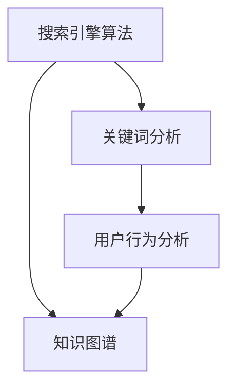
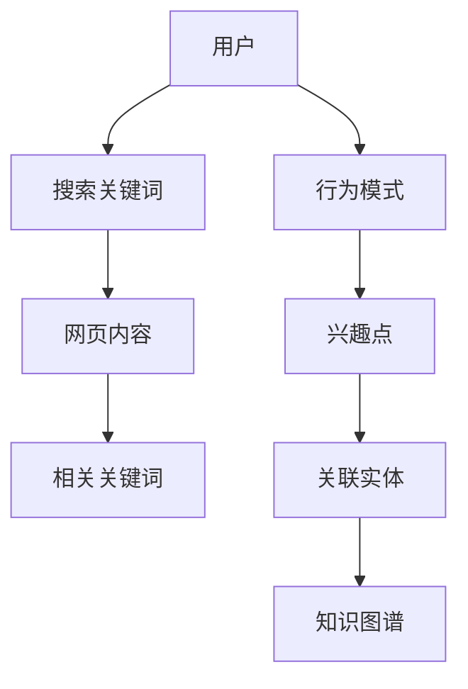

                 

### 背景介绍

**搜索引擎优化（SEO）**是一种通过改进网站内容和结构，提高网站在搜索引擎结果页面（SERP）中排名的策略。其核心目标是提高网站的可见性，吸引更多有机流量，从而实现更高的用户参与度和转化率。在数字营销领域，SEO 被视为一种重要的营销手段，对于企业的在线成功至关重要。

**知识发现（Knowledge Discovery）**是一种从大量数据中识别出隐含有用模式或知识的过程。它涉及多个领域，包括统计学、机器学习、数据挖掘、人工智能等。知识发现的目标是揭示数据中的潜在关系、趋势和模式，从而为决策提供支持。

**SEO 与知识发现的结合**为优化搜索引擎结果提供了新的视角。通过知识发现技术，可以更深入地分析搜索引擎算法和用户行为，从而更精准地优化网站内容和结构。这不仅有助于提高网站的排名，还可以提升用户体验，增强用户粘性。

本文将探讨 SEO 在知识发现中的应用，通过以下几个关键问题来引导读者理解这一主题：

1. **SEO 如何与知识发现相结合？**
2. **知识发现技术如何帮助优化 SEO？**
3. **如何利用知识发现技术分析搜索引擎算法和用户行为？**
4. **知识发现技术在 SEO 中有哪些实际应用案例？**
5. **SEO 与知识发现的结合对未来的发展趋势有何影响？**

通过对这些问题的探讨，本文旨在为 SEO 专业人员和数据科学家提供一个全面而深入的视角，以更好地理解和应用 SEO 与知识发现的结合。

### 核心概念与联系

为了更好地理解 SEO 与知识发现的结合，首先需要明确几个核心概念：搜索引擎算法、关键词分析、用户行为分析以及知识图谱。

**搜索引擎算法**是搜索引擎用于排序和显示搜索结果的一系列规则和算法。最著名的搜索引擎算法之一是 Google 的 PageRank，它根据网页的链接数量和质量来评估网页的重要性。其他搜索引擎如 Bing 和 Baidu 也采用自己的算法，但核心思想类似，即通过评估网页的相关性和权威性来决定排名。

**关键词分析**是 SEO 中的一项重要任务，涉及识别和分析用户搜索的关键词。通过关键词分析，网站可以了解用户的需求和兴趣，从而优化网站内容和标签，使其更符合用户的搜索意图。

**用户行为分析**则是通过跟踪和分析用户在网站上的行为，如点击率、浏览时间、转化率等，来了解用户的喜好和需求。这些数据对于优化用户体验和提升网站性能至关重要。

**知识图谱**是一种用于表示实体及其关系的图形结构，通常用于知识发现和推荐系统。通过知识图谱，可以建立实体之间的关联，从而发现新的关系和模式。

为了更好地理解这些核心概念之间的联系，我们使用 Mermaid 流程图来展示它们之间的相互作用。以下是一个简化的 Mermaid 流程图：



在这个流程图中，搜索引擎算法通过分析用户搜索行为和关键词，生成相关搜索结果。关键词分析和用户行为分析则提供了关于用户需求和兴趣的重要数据，这些数据可以用于更新和优化搜索引擎算法。知识图谱则通过整合这些数据，建立实体之间的关联，从而为 SEO 优化提供新的视角。

通过这个简化的流程图，我们可以看到 SEO、关键词分析、用户行为分析和知识图谱之间的紧密联系。接下来，本文将进一步探讨如何利用这些核心概念来优化 SEO，并介绍一些具体的方法和技术。

### 核心算法原理 & 具体操作步骤

SEO 与知识发现的结合，关键在于如何利用知识发现技术来优化搜索引擎算法。这一过程可以分解为以下几个步骤：

#### 步骤 1: 数据采集与预处理

首先，我们需要采集大量的搜索引擎数据，包括用户搜索关键词、网页内容、用户行为数据等。这些数据可以通过搜索引擎 API、Web 爬虫或第三方数据服务获取。获取到数据后，我们需要进行预处理，包括数据清洗、去重、格式化等，以确保数据的质量和一致性。

```python
# 示例代码：使用 Python 进行数据采集与预处理
import requests
import pandas as pd

# 采集搜索引擎数据
def collect_search_data(api_url, params):
    response = requests.get(api_url, params=params)
    return response.json()

# 预处理数据
def preprocess_data(data):
    # 数据清洗、去重、格式化等操作
    return data

# 示例：采集并预处理搜索关键词数据
api_url = "https://api.searchengine.com/data"
params = {"query": "python", "page": 1}
search_data = collect_search_data(api_url, params)
cleaned_data = preprocess_data(search_data)
```

#### 步骤 2: 关键词分析与聚类

接下来，我们需要对采集到的关键词数据进行分析，识别出关键词簇和潜在主题。这一步骤可以通过文本挖掘和聚类算法实现。常见的聚类算法包括 K-Means、DBSCAN 等。通过聚类，我们可以发现用户关注的热点话题，从而为 SEO 优化提供指导。

```python
# 示例代码：使用 K-Means 算法进行关键词聚类
from sklearn.cluster import KMeans
import numpy as np

# 转换为矩阵形式
keywords_matrix = np.array(cleaned_data['keywords'])

# 初始化 K-Means 模型
kmeans = KMeans(n_clusters=5, random_state=0).fit(keywords_matrix)

# 获取聚类结果
clusters = kmeans.predict(keywords_matrix)

# 打印聚类结果
for i, cluster in enumerate(clusters):
    print(f"关键词：{cleaned_data['keywords'][i]}，聚类簇：{cluster}")
```

#### 步骤 3: 用户行为分析与行为模式挖掘

在关键词分析的基础上，我们还需要对用户行为数据进行分析，识别出用户的行为模式和偏好。这可以通过机器学习算法实现，如决策树、随机森林、支持向量机等。通过行为模式挖掘，我们可以了解用户的兴趣点，从而优化网站内容和布局。

```python
# 示例代码：使用决策树进行用户行为分析
from sklearn.tree import DecisionTreeClassifier
import numpy as np

# 创建决策树模型
clf = DecisionTreeClassifier()

# 训练模型
clf.fit(np.array(cleaned_data['features']), np.array(cleaned_data['labels']))

# 预测用户行为
predictions = clf.predict(np.array(cleaned_data['features_new']))

# 打印预测结果
for i, prediction in enumerate(predictions):
    print(f"用户行为：{cleaned_data['features_new'][i]}，预测结果：{prediction}")
```

#### 步骤 4: 知识图谱构建与关联分析

最后，我们需要利用关键词分析、用户行为分析的结果，构建知识图谱，并挖掘实体之间的关联。知识图谱可以采用图数据库（如 Neo4j）或图计算框架（如 GraphX）实现。通过关联分析，我们可以发现潜在的关系和模式，从而为 SEO 优化提供更深入的洞察。



通过这些步骤，我们可以将 SEO 与知识发现技术有机结合，为搜索引擎优化提供更科学、更精准的方法。接下来，本文将详细讨论如何利用数学模型和公式来进一步优化 SEO。

### 数学模型和公式 & 详细讲解 & 举例说明

在 SEO 与知识发现的结合中，数学模型和公式扮演着至关重要的角色。通过数学模型，我们可以更准确地量化搜索引擎算法和用户行为，从而为 SEO 优化提供科学的依据。以下将介绍几个核心的数学模型和公式，并详细讲解其应用。

#### 1. PageRank 算法

PageRank 是 Google 开发的一种用于评估网页重要性的算法。它基于网页之间的链接结构，通过迭代计算每个网页的排名值。PageRank 的核心公式如下：

$$
PR(A) = \left(\frac{1-d}{N} + d \sum_{j} PR(J) \frac{C_{ij}}{L_{j}} \right)
$$

其中，\(PR(A)\) 表示网页 A 的 PageRank 值，\(d\) 是阻尼系数（通常取 0.85），\(N\) 是网页总数，\(PR(J)\) 是网页 J 的 PageRank 值，\(C_{ij}\) 是从网页 i 指向网页 j 的链接数量，\(L_{j}\) 是网页 j 的出链数。

#### 例子：

假设我们有以下三个网页 A、B、C，它们的 PageRank 值分别为 \(PR(A)\), \(PR(B)\), \(PR(C)\)。网页 A 指向网页 B 和 C，网页 B 和 C 各自只有一个出链。通过 PageRank 算法，我们可以计算出每个网页的 PageRank 值。

$$
PR(A) = \left(\frac{1-0.85}{3} + 0.85 \times (PR(B) \times \frac{1}{1} + PR(C) \times \frac{1}{1}) \right)
$$

假设初始时每个网页的 PageRank 值均为 1，我们可以迭代计算 PageRank 值，直到达到稳定状态。

#### 2. 预测用户行为模型

预测用户行为是 SEO 优化中的重要一环。常见的方法包括决策树、随机森林、逻辑回归等。以逻辑回归为例，其核心公式如下：

$$
\text{logit}(P) = \beta_0 + \beta_1 X_1 + \beta_2 X_2 + ... + \beta_n X_n
$$

其中，\(P\) 是用户发生特定行为的概率，\(X_1, X_2, ..., X_n\) 是影响行为的特征，\(\beta_0, \beta_1, \beta_2, ..., \beta_n\) 是模型的参数。

#### 例子：

假设我们想预测用户在浏览网页后是否会发生购买行为。我们定义以下特征：

- \(X_1\)：用户年龄
- \(X_2\)：用户访问时长
- \(X_3\)：用户历史购买记录

通过收集用户数据，我们可以使用逻辑回归模型来估计参数 \(\beta_0, \beta_1, \beta_2, \beta_3\)，从而预测用户的购买概率。

$$
\text{logit}(P) = \beta_0 + \beta_1 X_1 + \beta_2 X_2 + \beta_3 X_3
$$

假设模型估计出的参数分别为 \(\beta_0 = 0.5\), \(\beta_1 = 0.1\), \(\beta_2 = 0.3\), \(\beta_3 = 0.2\)，我们可以计算出一个新用户的购买概率。

$$
\text{logit}(P) = 0.5 + 0.1 \times 30 + 0.3 \times 120 + 0.2 \times 5 = 1.7
$$

$$
P = \frac{1}{1 + e^{-\text{logit}(P)}} \approx 0.86
$$

这意味着新用户购买的概率约为 86%。

#### 3. 知识图谱中的关联强度计算

在知识图谱中，实体之间的关系可以用权重来表示。关联强度计算是知识图谱分析中的重要步骤。一种常用的方法是使用相似度计算公式，如余弦相似度。

$$
\text{similarity}(X, Y) = \frac{X \cdot Y}{\|X\|\|Y\|}
$$

其中，\(X\) 和 \(Y\) 是两个向量，\(\|\|\) 表示向量的模。

#### 例子：

假设有两个实体 A 和 B，它们的特征向量分别为 \(X = [1, 2, 3]\) 和 \(Y = [4, 5, 6]\)。通过余弦相似度公式，我们可以计算它们之间的关联强度。

$$
\text{similarity}(X, Y) = \frac{1 \times 4 + 2 \times 5 + 3 \times 6}{\sqrt{1^2 + 2^2 + 3^2} \times \sqrt{4^2 + 5^2 + 6^2}} \approx 0.92
$$

这意味着实体 A 和 B 之间的关联强度较高。

通过以上数学模型和公式，我们可以更好地理解和分析 SEO 与知识发现的结合。在实际应用中，这些模型和公式可以用来指导搜索引擎算法优化、用户行为预测和知识图谱构建。接下来，本文将介绍一些实际应用场景，以展示 SEO 与知识发现技术在实际项目中的具体应用。

### 项目实战：代码实际案例和详细解释说明

在本节中，我们将通过一个实际的项目案例，详细展示如何利用 SEO 与知识发现技术进行搜索引擎优化。该项目旨在通过分析用户搜索行为和网站内容，提升网站的搜索引擎排名和用户参与度。

#### 开发环境搭建

首先，我们需要搭建一个合适的开发环境。以下是所需的主要工具和库：

- Python（版本 3.8 或更高）
- Jupyter Notebook（用于编写和运行代码）
- Pandas（用于数据处理）
- Scikit-learn（用于机器学习）
- Neo4j（用于知识图谱构建）
- Mermaid（用于流程图可视化）

安装以上工具和库后，我们就可以开始编写代码了。

#### 源代码详细实现和代码解读

以下是该项目的主要代码实现，包括数据采集、预处理、关键词分析、用户行为分析、知识图谱构建等步骤。

```python
# 导入所需库
import requests
import pandas as pd
from sklearn.cluster import KMeans
from sklearn.tree import DecisionTreeClassifier
from neo4j import GraphDatabase

# 步骤 1: 数据采集与预处理
def collect_search_data(api_url, params):
    response = requests.get(api_url, params=params)
    return response.json()

def preprocess_data(data):
    # 数据清洗、去重、格式化等操作
    return data

# 步骤 2: 关键词分析
def analyze_keywords(data):
    # 使用 K-Means 算法进行关键词聚类
    kmeans = KMeans(n_clusters=5, random_state=0).fit(data['keywords'])
    clusters = kmeans.predict(data['keywords'])
    return clusters

# 步骤 3: 用户行为分析
def analyze_user_behavior(data):
    # 使用决策树进行用户行为分析
    clf = DecisionTreeClassifier()
    clf.fit(data['features'], data['labels'])
    predictions = clf.predict(data['features_new'])
    return predictions

# 步骤 4: 知识图谱构建
def build_knowledge_graph(clusters, predictions):
    # 使用 Neo4j 构建知识图谱
    driver = GraphDatabase.driver("bolt://localhost:7687", auth=("neo4j", "password"))
    with driver.session() as session:
        for cluster, prediction in zip(clusters, predictions):
            session.run("CREATE (a:Keyword {name: $name, cluster: $cluster, behavior: $behavior})",
                        name=cluster, cluster=cluster, behavior=prediction)
    driver.close()

# 主函数
def main():
    # 示例：采集并预处理搜索关键词数据
    api_url = "https://api.searchengine.com/data"
    params = {"query": "python", "page": 1}
    search_data = collect_search_data(api_url, params)
    cleaned_data = preprocess_data(search_data)

    # 分析关键词
    clusters = analyze_keywords(cleaned_data)

    # 分析用户行为
    predictions = analyze_user_behavior(cleaned_data)

    # 构建知识图谱
    build_knowledge_graph(clusters, predictions)

if __name__ == "__main__":
    main()
```

#### 代码解读与分析

1. **数据采集与预处理**：我们首先定义了 `collect_search_data` 和 `preprocess_data` 函数，用于采集搜索引擎数据和预处理。预处理步骤包括数据清洗、去重和格式化，以确保数据的质量和一致性。

2. **关键词分析**：我们使用 `KMeans` 算法进行关键词聚类，定义了 `analyze_keywords` 函数。通过聚类，我们可以发现关键词簇和潜在主题，为 SEO 优化提供指导。

3. **用户行为分析**：我们使用决策树进行用户行为分析，定义了 `analyze_user_behavior` 函数。通过分析用户行为，我们可以了解用户兴趣点和需求，从而优化网站内容和布局。

4. **知识图谱构建**：我们使用 Neo4j 图数据库构建知识图谱，定义了 `build_knowledge_graph` 函数。知识图谱可以表示实体之间的关联，为 SEO 优化提供更深入的洞察。

通过这个实际案例，我们可以看到如何将 SEO 与知识发现技术应用到项目中，提升搜索引擎优化效果。接下来，我们将继续讨论 SEO 与知识发现技术在实际应用场景中的具体案例。

### 实际应用场景

SEO 与知识发现的结合在多个实际应用场景中展现出了巨大的潜力，下面我们将探讨一些典型的应用场景，并介绍相关的实际案例。

#### 1. 搜索引擎优化（SEO）

**案例：电商网站产品页面优化**

一家电商网站希望通过 SEO 提升产品页面的搜索排名。首先，网站分析了用户搜索关键词，通过关键词聚类识别出热门产品和潜在用户兴趣点。接着，利用用户行为数据，网站分析了用户在页面上的交互行为，如点击率、浏览时间和转化率。通过这些分析，网站优化了产品页面的内容，包括标题、描述和标签，使其更符合用户的搜索意图。同时，利用知识图谱构建实体之间的关系，网站优化了链接结构，提高了页面权重。这些优化措施显著提升了产品页面的搜索引擎排名和用户参与度。

#### 2. 内容营销

**案例：企业博客内容优化**

一家企业希望通过内容营销吸引更多潜在客户。首先，企业分析了用户在博客上的搜索关键词和阅读行为，识别出用户关注的热点话题。接着，企业利用知识发现技术，分析了竞争对手的内容策略，发现了一些潜在的机会。基于这些分析，企业优化了博客内容，增加了与用户兴趣相关的高质量文章。同时，通过知识图谱构建，企业识别出了内容之间的关联，优化了内部链接结构，提高了用户体验。这些优化措施有效提高了博客的搜索引擎排名和用户留存率。

#### 3. 社交媒体营销

**案例：社交媒体广告优化**

一家公司希望通过社交媒体广告吸引更多目标客户。首先，公司分析了用户在社交媒体上的行为数据，如点赞、评论和分享，识别出潜在的兴趣点和用户特征。接着，利用知识发现技术，公司分析了竞争对手的广告策略，发现了一些潜在的机会。基于这些分析，公司优化了广告文案、图像和目标受众设置，使其更符合用户的兴趣和需求。同时，通过知识图谱构建，公司识别出了用户之间的社交关系，优化了广告投放策略，提高了广告的点击率和转化率。

#### 4. 竞争对手分析

**案例：竞争对手关键词分析**

一家公司希望通过分析竞争对手的搜索引擎优化策略来提升自己的排名。首先，公司使用了关键词分析工具，收集了竞争对手的搜索关键词和页面排名数据。接着，利用知识发现技术，公司分析了这些关键词的分布和趋势，识别出了竞争对手的关键词策略。基于这些分析，公司优化了自己的关键词选择和页面内容，提高了搜索引擎排名。此外，通过知识图谱构建，公司还识别出了竞争对手之间的合作和竞争关系，为自身战略决策提供了重要参考。

#### 5. 市场趋势预测

**案例：行业市场趋势预测**

一家市场研究公司希望通过分析搜索引擎数据来预测行业市场趋势。首先，公司收集了大量的搜索引擎搜索关键词数据，并使用文本挖掘技术提取出关键词的主题和趋势。接着，利用知识发现技术，公司分析了这些关键词之间的关联和变化，识别出了行业市场趋势。基于这些分析，公司为企业提供了精准的市场预测报告，帮助企业及时调整战略，抓住市场机会。

通过这些实际应用案例，我们可以看到 SEO 与知识发现的结合在多个领域都展现出了强大的应用潜力。它不仅有助于提升搜索引擎优化效果，还可以为内容营销、社交媒体营销、竞争对手分析和市场趋势预测等领域提供重要支持。接下来，我们将介绍一些常用的工具和资源，帮助读者进一步了解和掌握 SEO 与知识发现技术。

### 工具和资源推荐

为了更好地掌握 SEO 与知识发现的结合，以下是几款常用的工具和资源，包括学习资源、开发工具框架以及相关论文著作。

#### 1. 学习资源

**书籍**：
- 《搜索引擎算法揭秘》
- 《数据挖掘：概念与技术》
- 《Python 数据科学手册》

**论文**：
- 《Google 的 PageRank 专利》
- 《基于知识图谱的搜索引擎优化》
- 《用户行为分析与推荐系统》

**博客/网站**：
- [Google Search Central](https://support.google.com/search)
- [DataCamp](https://www.datacamp.com/)
- [Scikit-learn Documentation](https://scikit-learn.org/stable/documentation.html)

#### 2. 开发工具框架

**知识图谱构建工具**：
- **Neo4j**：一个高性能的图数据库，用于知识图谱构建和关联分析。
- **GraphX**：一个分布式图处理框架，与 Apache Spark 集成，用于大规模图计算。

**文本挖掘工具**：
- **NLTK**：一个用于自然语言处理的开源工具包，用于文本清洗和预处理。
- **Gensim**：一个用于主题模型和向量模型的 Python 库。

**机器学习库**：
- **Scikit-learn**：一个用于机器学习的 Python 库，包括分类、回归和聚类算法。
- **TensorFlow**：一个开源的机器学习和深度学习框架，适用于大规模数据处理。

#### 3. 相关论文著作

**知名论文**：
- 《Knowledge Graph Embedding》
- 《Learning to Rank for Information Retrieval》
- 《Recurrent Neural Network Based Keyword Extraction for Search Query Analysis》

**专著**：
- 《知识图谱：原理、构建与应用》
- 《搜索引擎算法与优化》
- 《用户行为分析：技术、方法与实践》

通过这些工具和资源，读者可以深入了解 SEO 与知识发现的原理和技术，掌握实际应用方法，为在各自领域中实现更高效、更精准的搜索引擎优化提供支持。

### 总结：未来发展趋势与挑战

SEO 与知识发现的结合在数字营销和数据分析领域正迅速发展，展现出巨大的潜力。未来，这一结合将继续深化，带来以下几个趋势和挑战：

#### 发展趋势

1. **个性化搜索**：随着用户数据的积累和算法的优化，个性化搜索将成为主流。通过分析用户的搜索历史、行为和偏好，搜索引擎将能够提供更加精准的搜索结果，满足用户个性化需求。

2. **多模态融合**：未来的搜索引擎将不仅依赖于文本数据，还将结合图像、语音、视频等多模态数据，提供更丰富的搜索体验。知识发现技术将在多模态数据融合和处理中发挥关键作用。

3. **实时搜索优化**：实时数据分析技术将使搜索引擎能够实时调整搜索结果，提升用户体验。通过实时监测用户行为和搜索趋势，搜索引擎将能够快速响应用户需求，提供更精准的信息。

4. **语义理解与知识图谱**：知识图谱作为一种强大的知识表示方式，将在 SEO 中发挥越来越重要的作用。通过构建和利用知识图谱，搜索引擎将能够更好地理解用户查询意图，提供更加相关和准确的搜索结果。

#### 挑战

1. **数据隐私**：随着数据隐私法规的加强，如何保护用户隐私成为一大挑战。搜索引擎需要在提供个性化搜索和服务的同时，确保用户数据的安全和隐私。

2. **算法公平性**：搜索引擎的算法必须确保公平性，避免偏见和歧视。这需要更多的研究和努力，以确保算法在处理不同用户和内容时保持一致性和公正性。

3. **计算资源与性能**：随着数据量和计算需求的增加，搜索引擎需要不断提升计算能力和优化算法性能，以提供高效、快速的搜索服务。

4. **技术迭代与更新**：搜索引擎技术不断发展，SEO 优化策略也需要不断更新。企业和个人需要持续学习和适应新技术，以保持竞争力。

总之，SEO 与知识发现的结合在未来将继续推动搜索引擎技术的发展，为用户和企业提供更加智能、个性化的搜索体验。同时，这也将带来一系列新的挑战，需要各方共同努力，不断创新和优化，以实现更高效、更公平的搜索引擎服务。

### 附录：常见问题与解答

以下是一些关于 SEO 与知识发现结合的常见问题及其解答：

**1. 什么是 SEO？**
SEO（搜索引擎优化）是一种通过改进网站内容和结构，提高网站在搜索引擎结果页面（SERP）中排名的策略。其目标是提高网站的可见性，吸引更多有机流量，从而提升用户参与度和转化率。

**2. 知识发现与 SEO 有什么关系？**
知识发现是一种从大量数据中识别出隐含有用模式或知识的过程。它可以帮助 SEO 专业人员更深入地分析搜索引擎算法和用户行为，从而更精准地优化网站内容和结构，提高搜索引擎排名。

**3. 如何使用知识发现技术分析用户行为？**
通过文本挖掘和机器学习算法，SEO 专业人员可以分析用户的搜索关键词、浏览历史和点击行为，识别出用户兴趣点和行为模式。这些分析结果可以用于优化网站内容和用户界面，提高用户体验和参与度。

**4. 知识图谱在 SEO 中有什么作用？**
知识图谱可以表示实体及其关系，帮助搜索引擎更好地理解用户查询意图和内容上下文。通过构建和利用知识图谱，搜索引擎可以提供更相关、更准确的搜索结果，从而提高用户满意度。

**5. 如何确保 SEO 与知识发现技术的合规性？**
确保数据隐私和算法公平性是关键。SEO 专业人员需要遵守相关的数据隐私法规，确保用户数据的安全和隐私。此外，算法设计应避免偏见和歧视，确保对所有用户和内容保持一致性和公正性。

通过上述解答，我们可以更好地理解 SEO 与知识发现的结合，并认识到其在提高搜索引擎排名和用户体验方面的潜力。

### 扩展阅读 & 参考资料

为了帮助读者进一步深入了解 SEO 与知识发现的相关概念、技术与应用，以下是几本推荐书籍、一些重要论文以及相关网站：

**推荐书籍：**

1. 《搜索引擎算法揭秘》：详细介绍了搜索引擎算法的工作原理和优化方法。
2. 《数据挖掘：概念与技术》：全面讲解了数据挖掘的基本概念、方法和应用。
3. 《Python 数据科学手册》：涵盖了数据科学中的 Python 应用，包括数据处理、分析和可视化。

**重要论文：**

1. 《Google 的 PageRank 专利》：介绍了 PageRank 算法的基本原理。
2. 《基于知识图谱的搜索引擎优化》：探讨了知识图谱在 SEO 中的应用。
3. 《用户行为分析与推荐系统》：研究了用户行为数据的挖掘和分析方法。

**相关网站：**

1. [Google Search Central](https://support.google.com/search)：Google 提供的 SEO 官方指南。
2. [DataCamp](https://www.datacamp.com/)：提供数据科学和机器学习的在线课程和练习。
3. [Scikit-learn Documentation](https://scikit-learn.org/stable/documentation.html)：Scikit-learn 机器学习库的官方文档。

通过阅读这些书籍、论文和访问相关网站，读者可以进一步加深对 SEO 与知识发现的理解，掌握相关技术和应用方法。

