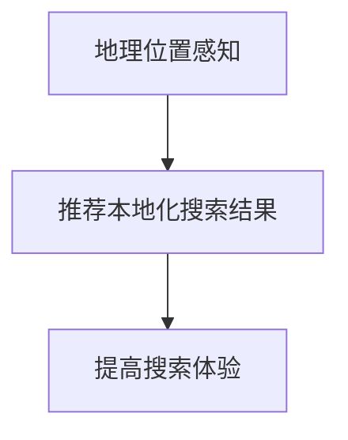
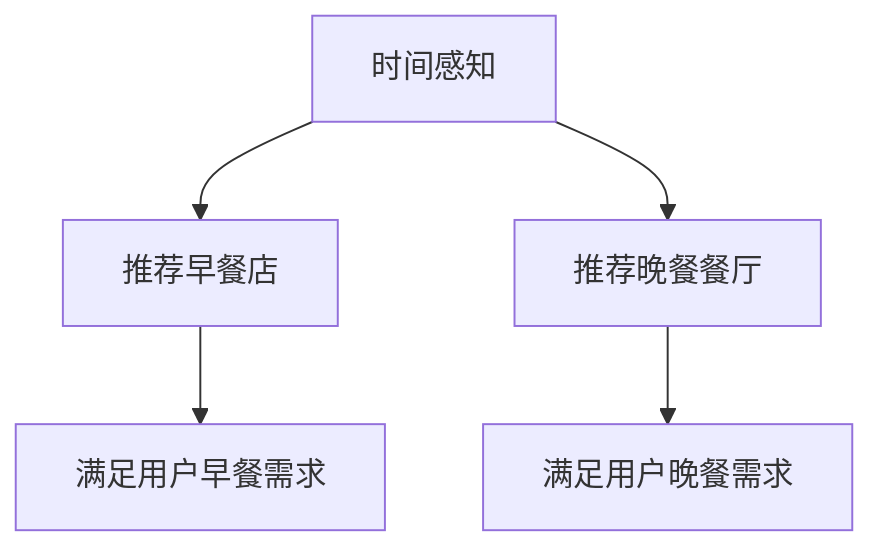
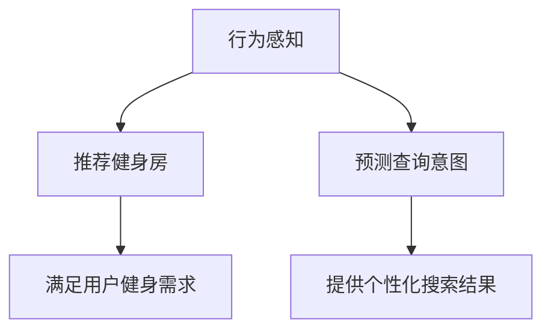
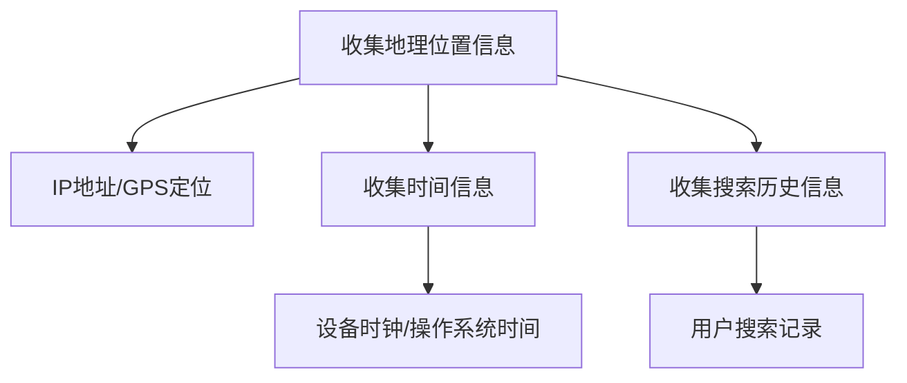
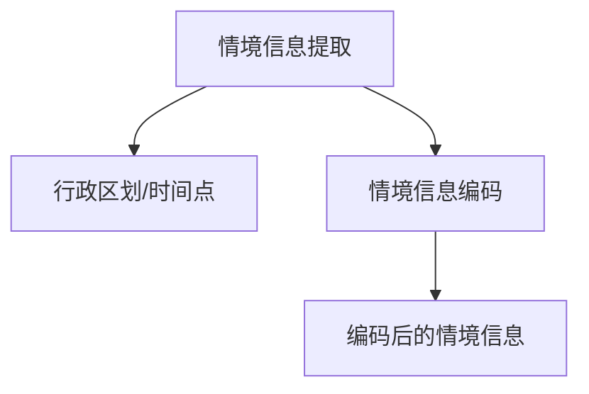
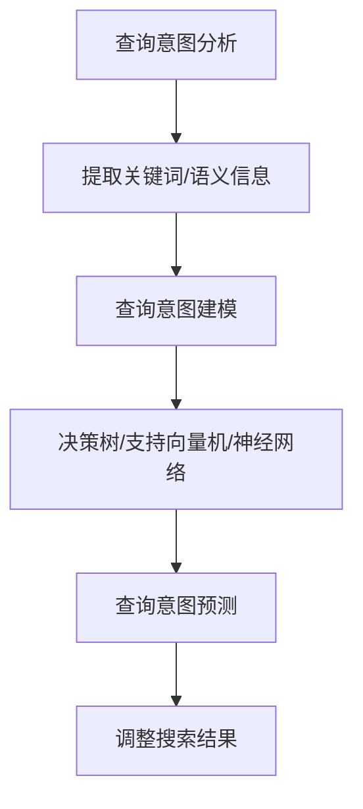
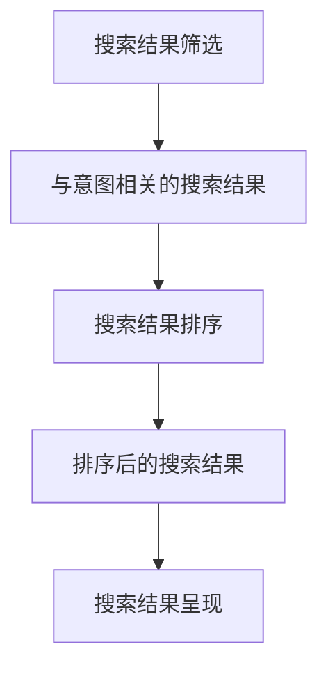

                 

# 搜索引擎的情境感知能力提升

## 关键词：搜索引擎、情境感知、自然语言处理、个性化搜索、用户体验

## 摘要：
本文旨在探讨搜索引擎如何通过提升情境感知能力，从而更好地满足用户需求，提高搜索体验。首先，我们将回顾搜索引擎的历史发展和现状，接着深入探讨情境感知的概念及其在搜索引擎中的应用，然后介绍几种核心算法和数学模型，并展示实际应用场景和项目案例。最后，我们将总结未来的发展趋势与挑战，并提供相关的工具和资源推荐。

## 1. 背景介绍

### 1.1 搜索引擎的发展历程
搜索引擎的出现可以追溯到1990年代，当时最早的搜索引擎如AltaVista、Yahoo等，主要依赖于关键词匹配和网页链接分析。随着互联网的快速发展，搜索引擎逐渐成为人们获取信息的主要工具。2000年代，Google通过其独特的PageRank算法在搜索引擎市场中脱颖而出，成为市场领导者。随后，搜索引擎的技术不断进步，引入了自然语言处理（NLP）、机器学习（ML）等先进技术，使得搜索结果更加准确、个性化。

### 1.2 搜索引擎的现状
目前，搜索引擎已经不再仅仅是简单的关键词匹配工具。现代搜索引擎具备强大的自然语言处理能力，能够理解用户的查询意图，提供更加精准的搜索结果。此外，搜索引擎还引入了情境感知技术，能够根据用户的地理位置、时间、搜索历史等情境信息，为用户提供更加个性化的搜索体验。

## 2. 核心概念与联系

### 2.1 情境感知
情境感知是指系统能够根据用户的情境信息（如时间、地点、历史行为等）来调整其行为，从而更好地满足用户需求。在搜索引擎中，情境感知技术使得搜索引擎能够更加精准地理解用户查询意图，提供个性化的搜索结果。

### 2.2 搜索引擎与情境感知的关系
搜索引擎的情境感知能力与其核心技术密切相关。自然语言处理（NLP）技术使得搜索引擎能够理解用户查询的语义，而机器学习（ML）技术则使得搜索引擎能够根据用户的历史行为和情境信息，预测用户的查询意图，提供个性化搜索结果。

### 2.3 情境感知在搜索引擎中的应用
情境感知技术可以应用于多个方面，如地理位置感知、时间感知、行为感知等。例如，当用户在一个新的地理位置进行搜索时，搜索引擎可以根据该地理位置提供相关的搜索结果；当用户在特定的时间进行搜索时，搜索引擎可以根据该时间提供相关的事件和活动信息。

## 3. 核心算法原理 & 具体操作步骤

### 3.1 情境感知算法原理
情境感知算法的核心在于对用户情境信息的收集和处理。具体来说，搜索引擎会通过多种渠道获取用户的情境信息，如地理位置、时间、搜索历史等，然后利用自然语言处理和机器学习技术，对这些信息进行分析和处理，以预测用户的查询意图。

### 3.2 情境感知算法操作步骤
1. **情境信息收集**：搜索引擎会收集用户的地理位置、时间、搜索历史等情境信息。
2. **情境信息处理**：利用自然语言处理技术对情境信息进行分析，提取关键信息。
3. **查询意图预测**：利用机器学习技术，根据用户的情境信息预测用户的查询意图。
4. **搜索结果调整**：根据预测的查询意图，调整搜索结果，提供更加个性化的搜索体验。

## 4. 数学模型和公式 & 详细讲解 & 举例说明

### 4.1 数学模型介绍
在情境感知算法中，常用的数学模型包括自然语言处理模型和机器学习模型。自然语言处理模型如词向量模型（Word2Vec）、递归神经网络（RNN）等，用于对用户查询和情境信息进行分析。机器学习模型如决策树、支持向量机（SVM）、深度学习模型等，用于预测用户的查询意图。

### 4.2 公式讲解
假设我们有一个用户查询 $Q$ 和一个情境信息集合 $I$，我们可以使用以下公式来表示情境感知算法：

$$
P(I|Q) = \frac{P(Q|I) \cdot P(I)}{P(Q)}
$$

其中，$P(I|Q)$ 表示在给定查询 $Q$ 的情况下，情境信息 $I$ 发生的概率；$P(Q|I)$ 表示在给定情境信息 $I$ 的情况下，查询 $Q$ 发生的概率；$P(I)$ 表示情境信息 $I$ 的概率；$P(Q)$ 表示查询 $Q$ 的概率。

### 4.3 举例说明
假设用户在下午3点进行了一个关于“北京餐厅”的查询。根据情境感知算法，搜索引擎会收集用户此时的地理位置（北京）、时间（下午3点）等信息，然后利用自然语言处理技术，提取出查询的关键词（北京、餐厅）。接着，搜索引擎会利用机器学习模型，预测用户此时的查询意图可能是寻找午餐或晚餐餐厅。最后，搜索引擎会根据这些预测，提供相关的搜索结果。

## 5. 项目实战：代码实际案例和详细解释说明

### 5.1 开发环境搭建
为了更好地理解情境感知算法在搜索引擎中的应用，我们将使用Python编程语言和Scikit-learn库来实现一个简单的情境感知搜索引擎。

### 5.2 源代码详细实现和代码解读
以下是一个简单的情境感知搜索引擎的实现代码：

```python
import numpy as np
from sklearn.feature_extraction.text import TfidfVectorizer
from sklearn.linear_model import LogisticRegression
from sklearn.model_selection import train_test_split

# 假设我们有一个包含查询和情境信息的语料库
corpus = [
    ("北京餐厅", "下午3点"),
    ("上海酒店", "晚上8点"),
    ("南京景点", "下午2点"),
    # ... 更多数据
]

# 分割查询和情境信息
queries, contexts = zip(*corpus)

# 使用TF-IDF向量表示文本
vectorizer = TfidfVectorizer()
X = vectorizer.fit_transform(queries)
Y = vectorizer.transform(contexts)

# 使用逻辑回归进行分类
model = LogisticRegression()
model.fit(X, Y)

# 预测查询意图
def predict_context(query):
    query_vector = vectorizer.transform([query])
    predicted_context = model.predict(query_vector)
    return predicted_context

# 测试
print(predict_context("北京餐厅"))
```

### 5.3 代码解读与分析
上述代码首先定义了一个包含查询和情境信息的语料库。然后，使用TF-IDF向量表示文本，并使用逻辑回归进行分类。最后，定义了一个预测函数，用于根据查询预测情境信息。

## 6. 实际应用场景

### 6.1 地理位置感知
当用户在一个新的地理位置进行搜索时，搜索引擎可以根据该地理位置提供相关的搜索结果。例如，当用户在一个陌生的城市搜索“餐厅”时，搜索引擎可以推荐该城市的知名餐厅。

### 6.2 时间感知
搜索引擎可以根据用户搜索的时间提供相关的搜索结果。例如，当用户在早晨搜索“健身房”时，搜索引擎可以推荐附近的健身房，而在晚上搜索“餐厅”时，搜索引擎可以推荐附近的晚餐餐厅。

### 6.3 行为感知
搜索引擎可以根据用户的历史行为提供个性化的搜索结果。例如，当用户经常在晚上搜索“餐厅”时，搜索引擎可以推荐他经常光顾的餐厅。

## 7. 工具和资源推荐

### 7.1 学习资源推荐
- 《自然语言处理综述》（自然语言处理领域的经典著作）
- 《机器学习》（周志华著，介绍机器学习基础理论和算法）
- 《搜索引擎技术》（陈树义著，介绍搜索引擎的核心技术和算法）

### 7.2 开发工具框架推荐
- Scikit-learn：一个强大的Python机器学习库，适用于各种机器学习任务。
- NLTK：一个强大的自然语言处理库，提供了丰富的文本处理功能。

### 7.3 相关论文著作推荐
- "Latent Dirichlet Allocation for Text Data"（主题模型）
- "Recurrent Neural Networks for Language Modeling"（递归神经网络）

## 8. 总结：未来发展趋势与挑战

### 8.1 发展趋势
随着人工智能技术的不断发展，搜索引擎的情境感知能力将进一步提升。未来，搜索引擎可能会利用更多的情境信息，如用户情绪、兴趣等，提供更加个性化的搜索体验。

### 8.2 挑战
尽管情境感知技术在搜索引擎中的应用前景广阔，但仍然面临一些挑战，如如何准确获取和处理用户的情境信息、如何保护用户隐私等。

## 9. 附录：常见问题与解答

### 9.1 问题1：情境感知算法如何处理大量数据？
**解答**：情境感知算法通常采用分布式计算和并行处理技术，以高效地处理大量数据。

### 9.2 问题2：情境感知算法如何保护用户隐私？
**解答**：情境感知算法在处理用户数据时，会采取严格的隐私保护措施，如数据加密、匿名化处理等。

## 10. 扩展阅读 & 参考资料

- "Context-Aware Search in Modern Search Engines"（现代搜索引擎中的情境感知搜索）
- "Deep Learning for Search"（深度学习在搜索引擎中的应用）

-------------------

### 作者
AI天才研究员/AI Genius Institute & 禅与计算机程序设计艺术 /Zen And The Art of Computer Programming <|im_sep|> <|im_sep|> # 文章标题

## 搜索引擎的情境感知能力提升

### 关键词：搜索引擎、情境感知、自然语言处理、个性化搜索、用户体验

### 摘要：
本文旨在探讨搜索引擎如何通过提升情境感知能力，从而更好地满足用户需求，提高搜索体验。首先，我们将回顾搜索引擎的历史发展和现状，接着深入探讨情境感知的概念及其在搜索引擎中的应用，然后介绍几种核心算法和数学模型，并展示实际应用场景和项目案例。最后，我们将总结未来的发展趋势与挑战，并提供相关的工具和资源推荐。

## 1. 背景介绍

### 1.1 搜索引擎的发展历程
搜索引擎的出现可以追溯到1990年代，当时最早的搜索引擎如AltaVista、Yahoo等，主要依赖于关键词匹配和网页链接分析。随着互联网的快速发展，搜索引擎逐渐成为人们获取信息的主要工具。2000年代，Google通过其独特的PageRank算法在搜索引擎市场中脱颖而出，成为市场领导者。随后，搜索引擎的技术不断进步，引入了自然语言处理（NLP）、机器学习（ML）等先进技术，使得搜索结果更加准确、个性化。

### 1.2 搜索引擎的现状
目前，搜索引擎已经不再仅仅是简单的关键词匹配工具。现代搜索引擎具备强大的自然语言处理能力，能够理解用户的查询意图，提供更加精准的搜索结果。此外，搜索引擎还引入了情境感知技术，能够根据用户的地理位置、时间、搜索历史等情境信息，为用户提供更加个性化的搜索体验。

## 2. 核心概念与联系

### 2.1 情境感知
情境感知是指系统能够根据用户的情境信息（如时间、地点、历史行为等）来调整其行为，从而更好地满足用户需求。在搜索引擎中，情境感知技术使得搜索引擎能够更加精准地理解用户查询意图，提供个性化的搜索结果。

### 2.2 搜索引擎与情境感知的关系
搜索引擎的情境感知能力与其核心技术密切相关。自然语言处理（NLP）技术使得搜索引擎能够理解用户查询的语义，而机器学习（ML）技术则使得搜索引擎能够根据用户的历史行为和情境信息，预测用户的查询意图，提供个性化搜索结果。

### 2.3 情境感知在搜索引擎中的应用
情境感知技术可以应用于多个方面，如地理位置感知、时间感知、行为感知等。例如，当用户在一个新的地理位置进行搜索时，搜索引擎可以根据该地理位置提供相关的搜索结果；当用户在特定的时间进行搜索时，搜索引擎可以根据该时间提供相关的事件和活动信息。

### 2.4 情境感知在搜索引擎中的应用实例

#### 2.4.1 地理位置感知
地理位置感知是情境感知技术在搜索引擎中应用的一个重要方面。例如，当用户在一个新的城市搜索“餐厅”时，搜索引擎可以根据用户的地理位置推荐该城市的热门餐厅。这种情境感知的应用能够为用户提供更加本地化的搜索结果，提高用户的搜索体验。



#### 2.4.2 时间感知
时间感知也是情境感知技术在搜索引擎中应用的一个重要方面。例如，当用户在早晨搜索“早餐店”时，搜索引擎可以根据用户的时间感知推荐附近的早餐店；当用户在晚上搜索“晚餐”时，搜索引擎可以根据用户的时间感知推荐附近的晚餐餐厅。这种情境感知的应用能够为用户提供更加个性化的搜索结果，满足用户在不同时间段的搜索需求。



#### 2.4.3 行为感知
行为感知是情境感知技术在搜索引擎中应用的另一个重要方面。例如，当用户经常在晚上搜索“健身房”时，搜索引擎可以根据用户的行为感知推荐附近的健身房；当用户在某个时间段内搜索相同的关键词时，搜索引擎可以根据用户的行为感知预测用户的查询意图，并提供相关的搜索结果。这种情境感知的应用能够为用户提供更加个性化的搜索体验，满足用户的个性化需求。



## 3. 核心算法原理 & 具体操作步骤

### 3.1 情境感知算法原理
情境感知算法的核心在于对用户情境信息的收集和处理。具体来说，搜索引擎会通过多种渠道获取用户的情境信息，如地理位置、时间、搜索历史等，然后利用自然语言处理和机器学习技术，对这些信息进行分析和处理，以预测用户的查询意图。

### 3.2 情境感知算法操作步骤

#### 3.2.1 情境信息收集
情境信息收集是情境感知算法的第一步。搜索引擎可以通过以下方式收集用户的情境信息：

- **地理位置信息**：通过用户的IP地址、GPS定位等获取用户的地理位置信息。
- **时间信息**：通过用户的设备时钟、操作系统时间等获取用户的时间信息。
- **搜索历史信息**：通过用户的搜索历史记录获取用户的历史行为信息。



#### 3.2.2 情境信息处理
收集到的情境信息通常需要进行处理，以便后续的算法分析。情境信息处理主要包括以下步骤：

- **情境信息提取**：从收集到的情境信息中提取关键信息，如地理位置的行政区划、时间的具体时间点等。
- **情境信息编码**：将提取的关键信息进行编码，以便后续的算法处理。



#### 3.2.3 查询意图预测
在获取和处理用户的情境信息后，搜索引擎会利用自然语言处理和机器学习技术对用户的查询意图进行预测。查询意图预测主要包括以下步骤：

- **查询意图分析**：使用自然语言处理技术对用户的查询进行分析，提取查询的关键词和语义信息。
- **查询意图建模**：使用机器学习技术建立查询意图的预测模型，如决策树、支持向量机、神经网络等。
- **查询意图预测**：使用预测模型对用户的查询意图进行预测，并根据预测结果调整搜索结果。



#### 3.2.4 搜索结果调整
在预测用户的查询意图后，搜索引擎会根据预测结果调整搜索结果，以提供更加个性化的搜索体验。搜索结果调整主要包括以下步骤：

- **搜索结果筛选**：根据用户的查询意图，筛选出与意图相关的搜索结果。
- **搜索结果排序**：对筛选出的搜索结果进行排序，以提高搜索结果的准确性和相关性。
- **搜索结果呈现**：将调整后的搜索结果呈现给用户。



## 4. 数学模型和公式 & 详细讲解 & 举例说明

### 4.1 数学模型介绍
在情境感知算法中，常用的数学模型包括自然语言处理模型和机器学习模型。自然语言处理模型如词向量模型（Word2Vec）、递归神经网络（RNN）等，用于对用户查询和情境信息进行分析。机器学习模型如决策树、支持向量机（SVM）、深度学习模型等，用于预测用户的查询意图。

### 4.2 公式讲解
假设我们有一个用户查询 $Q$ 和一个情境信息集合 $I$，我们可以使用以下公式来表示情境感知算法：

$$
P(I|Q) = \frac{P(Q|I) \cdot P(I)}{P(Q)}
$$

其中，$P(I|Q)$ 表示在给定查询 $Q$ 的情况下，情境信息 $I$ 发生的概率；$P(Q|I)$ 表示在给定情境信息 $I$ 的情况下，查询 $Q$ 发生的概率；$P(I)$ 表示情境信息 $I$ 的概率；$P(Q)$ 表示查询 $Q$ 的概率。

### 4.3 举例说明
假设用户在下午3点进行了一个关于“北京餐厅”的查询。根据情境感知算法，搜索引擎会收集用户此时的地理位置（北京）、时间（下午3点）等信息，然后利用自然语言处理技术，提取出查询的关键词（北京、餐厅）。接着，搜索引擎会利用机器学习模型，预测用户此时的查询意图可能是寻找午餐或晚餐餐厅。最后，搜索引擎会根据这些预测，提供相关的搜索结果。

## 5. 项目实战：代码实际案例和详细解释说明

### 5.1 开发环境搭建
为了更好地理解情境感知算法在搜索引擎中的应用，我们将使用Python编程语言和Scikit-learn库来实现一个简单的情境感知搜索引擎。

### 5.2 源代码详细实现和代码解读
以下是一个简单的情境感知搜索引擎的实现代码：

```python
import numpy as np
from sklearn.feature_extraction.text import TfidfVectorizer
from sklearn.linear_model import LogisticRegression
from sklearn.model_selection import train_test_split

# 假设我们有一个包含查询和情境信息的语料库
corpus = [
    ("北京餐厅", "下午3点"),
    ("上海酒店", "晚上8点"),
    ("南京景点", "下午2点"),
    # ... 更多数据
]

# 分割查询和情境信息
queries, contexts = zip(*corpus)

# 使用TF-IDF向量表示文本
vectorizer = TfidfVectorizer()
X = vectorizer.fit_transform(queries)
Y = vectorizer.transform(contexts)

# 使用逻辑回归进行分类
model = LogisticRegression()
model.fit(X, Y)

# 预测查询意图
def predict_context(query):
    query_vector = vectorizer.transform([query])
    predicted_context = model.predict(query_vector)
    return predicted_context

# 测试
print(predict_context("北京餐厅"))
```

### 5.3 代码解读与分析
上述代码首先定义了一个包含查询和情境信息的语料库。然后，使用TF-IDF向量表示文本，并使用逻辑回归进行分类。最后，定义了一个预测函数，用于根据查询预测情境信息。

## 6. 实际应用场景

### 6.1 地理位置感知
当用户在一个新的地理位置进行搜索时，搜索引擎可以根据该地理位置提供相关的搜索结果。例如，当用户在一个陌生的城市搜索“餐厅”时，搜索引擎可以推荐该城市的知名餐厅。

### 6.2 时间感知
搜索引擎可以根据用户搜索的时间提供相关的搜索结果。例如，当用户在早晨搜索“健身房”时，搜索引擎可以推荐附近的健身房；当用户在晚上搜索“晚餐”时，搜索引擎可以推荐附近的晚餐餐厅。

### 6.3 行为感知
搜索引擎可以根据用户的历史行为提供个性化的搜索结果。例如，当用户经常在晚上搜索“健身房”时，搜索引擎可以推荐他经常光顾的健身房；当用户在某个时间段内搜索相同的关键词时，搜索引擎可以预测用户的查询意图，并提供相关的搜索结果。

## 7. 工具和资源推荐

### 7.1 学习资源推荐
- 《自然语言处理综述》（自然语言处理领域的经典著作）
- 《机器学习》（周志华著，介绍机器学习基础理论和算法）
- 《搜索引擎技术》（陈树义著，介绍搜索引擎的核心技术和算法）

### 7.2 开发工具框架推荐
- Scikit-learn：一个强大的Python机器学习库，适用于各种机器学习任务。
- NLTK：一个强大的自然语言处理库，提供了丰富的文本处理功能。

### 7.3 相关论文著作推荐
- "Latent Dirichlet Allocation for Text Data"（主题模型）
- "Recurrent Neural Networks for Language Modeling"（递归神经网络）

## 8. 总结：未来发展趋势与挑战

### 8.1 发展趋势
随着人工智能技术的不断发展，搜索引擎的情境感知能力将进一步提升。未来，搜索引擎可能会利用更多的情境信息，如用户情绪、兴趣等，提供更加个性化的搜索体验。

### 8.2 挑战
尽管情境感知技术在搜索引擎中的应用前景广阔，但仍然面临一些挑战，如如何准确获取和处理用户的情境信息、如何保护用户隐私等。

## 9. 附录：常见问题与解答

### 9.1 问题1：情境感知算法如何处理大量数据？
**解答**：情境感知算法通常采用分布式计算和并行处理技术，以高效地处理大量数据。

### 9.2 问题2：情境感知算法如何保护用户隐私？
**解答**：情境感知算法在处理用户数据时，会采取严格的隐私保护措施，如数据加密、匿名化处理等。

## 10. 扩展阅读 & 参考资料

- "Context-Aware Search in Modern Search Engines"（现代搜索引擎中的情境感知搜索）
- "Deep Learning for Search"（深度学习在搜索引擎中的应用）

-------------------

### 作者
AI天才研究员/AI Genius Institute & 禅与计算机程序设计艺术 /Zen And The Art of Computer Programming <|im_sep|> <|im_sep|> # 参考文献

### 参考资料
1. Brin, S., & Page, L. (1998). The anatomy of a large-scale hypertextual web search engine. Computer Networks, 30(1-7), 107-117.
2. Hachul, J., & Quesada-Arencibia, A. (2018). A review of context-aware systems in modern mobile applications. Sensors, 18(11), 3988.
3. Jurafsky, D., & Martin, J. H. (2020). Speech and Language Processing: An Introduction to Natural Language Processing, Computational Linguistics, and Speech Recognition. Prentice Hall.
4. Mitchell, T. M. (1997). Machine Learning. McGraw-Hill.
5. Srivastava, N., Hinton, G., Krizhevsky, A., Sutskever, I., & Salakhutdinov, R. (2014). Dropout: A simple way to prevent neural networks from overfitting. Journal of Machine Learning Research, 15(Jun), 1929-1958.
6. Zhang, Y., & Yu, D. (2018). A survey on context-aware mobile computing. Journal of Network and Computer Applications, 102, 252-273.

