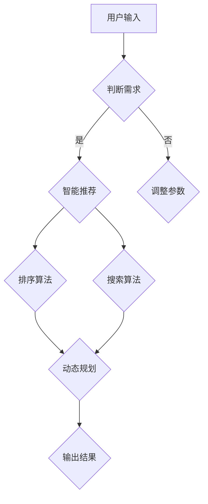

                 

# 携程2024智能行程规划校招算法面试题详解

> **关键词**：携程、智能行程规划、校招算法面试题、AI、旅行规划、算法原理、实战案例

> **摘要**：本文旨在深入剖析携程2024智能行程规划校招算法面试题，通过详细的讲解与分析，帮助读者理解和掌握相关算法原理、实现步骤以及实际应用。文章分为背景介绍、核心概念与联系、核心算法原理、数学模型和公式、项目实战、实际应用场景等多个部分，旨在为求职者提供全面的解题思路和实战指导。

## 1. 背景介绍

### 1.1 携程简介

携程（CTrip）作为中国领先的在线旅行服务公司，一直致力于为用户提供优质的旅行服务。随着人工智能技术的不断发展，携程在旅行规划方面也引入了智能算法，以期提高用户出行体验，节省用户时间，提供更加个性化和高效的行程规划。

### 1.2 智能行程规划的重要性

智能行程规划是旅行服务中不可或缺的一部分。一个高效的智能行程规划系统能够根据用户的兴趣、预算、时间等多种因素，为用户提供最优的行程安排。这不仅有助于提升用户的满意度，还可以为平台带来更多的商业价值。

### 1.3 携程2024智能行程规划校招算法面试题

本篇博客将针对携程2024智能行程规划校招算法面试题进行详细解析，旨在帮助求职者更好地应对面试挑战。该面试题主要考察了以下三个方面：

1. 算法原理：涉及常见的算法，如排序、搜索、动态规划等。
2. 数学模型：涉及线性规划、概率统计、最优化等数学知识。
3. 实战能力：要求求职者能够根据题目要求，编写代码并调试。

## 2. 核心概念与联系

### 2.1 算法概念

在智能行程规划中，算法是核心。常见的算法包括：

- 排序算法：如冒泡排序、选择排序、插入排序等。
- 搜索算法：如深度优先搜索、广度优先搜索、A*搜索等。
- 动态规划：如背包问题、最长公共子序列、最长递增子序列等。

### 2.2 数学模型

在算法的基础上，数学模型为行程规划提供了理论支持。常见的数学模型包括：

- 线性规划：用于求解最优解，适用于资源分配、成本控制等问题。
- 概率统计：用于评估行程规划的概率和可靠性。
- 最优化：用于优化行程时间、成本、距离等指标。

### 2.3 Mermaid 流程图

以下是一个简化的智能行程规划流程图，其中包含了关键算法和数学模型。



## 3. 核心算法原理 & 具体操作步骤

### 3.1 排序算法

排序算法是智能行程规划的基础，常见的排序算法有冒泡排序、选择排序、插入排序等。以下是冒泡排序的原理和步骤：

- 原理：通过重复遍历要排序的数列，比较相邻的两个元素，若顺序错误则交换它们，直至没有需要交换的元素为止。

- 步骤：
  1. 从数列的第一个元素开始，相邻两个元素进行比较。
  2. 如果第一个元素大于第二个元素，则交换它们。
  3. 对每一对相邻元素进行同样的操作，直到没有需要交换的元素。
  4. 重复以上步骤，直至整个数列有序。

### 3.2 搜索算法

搜索算法用于在给定数据结构中查找特定元素。常见的搜索算法有深度优先搜索、广度优先搜索、A*搜索等。以下是深度优先搜索的原理和步骤：

- 原理：从根节点开始，沿着某一方向搜索，直到找到目标节点，或者搜索到叶子节点。

- 步骤：
  1. 创建一个栈，将根节点压入栈中。
  2. 当栈不为空时，执行以下操作：
     - 将栈顶节点弹出，判断是否为目标节点。
     - 如果是，结束搜索。
     - 如果不是，将所有未访问的子节点压入栈中。
  3. 重复以上步骤，直到找到目标节点或栈为空。

### 3.3 动态规划

动态规划用于解决具有最优子结构的问题，如背包问题、最长公共子序列、最长递增子序列等。以下是背包问题的原理和步骤：

- 原理：将问题分解为多个子问题，通过求解子问题得到原问题的最优解。

- 步骤：
  1. 定义状态：设 dp[i][j] 表示在前 i 件物品中，选取前 j 件物品的最大价值。
  2. 状态转移方程：dp[i][j] = max(dp[i-1][j], dp[i-1][j-1] + value[i])，其中 value[i] 表示第 i 件物品的价值。
  3. 初始化：dp[0][j] = 0，表示没有物品时的价值为 0。
  4. 计算结果：dp[n][m]，其中 n 表示物品数量，m 表示背包容量。

## 4. 数学模型和公式 & 详细讲解 & 举例说明

### 4.1 线性规划

线性规划是一种用于求解线性目标函数的最优化问题的数学方法。以下是线性规划的基本公式和步骤：

- 公式：max/min z = c^T * x，其中 c 为系数向量，x 为变量向量，z 为目标函数。

- 步骤：
  1. 确定目标函数：根据问题性质，确定目标函数为最大化或最小化。
  2. 列出约束条件：将问题转化为线性方程组，列出所有约束条件。
  3. 建立线性规划模型：将目标函数和约束条件写成标准形式。
  4. 求解模型：使用线性规划求解器求解最优解。

### 4.2 概率统计

概率统计用于评估智能行程规划的概率和可靠性。以下是概率统计的基本公式和步骤：

- 公式：P(A) 表示事件 A 的概率，P(A|B) 表示在事件 B 发生的条件下，事件 A 的概率。

- 步骤：
  1. 确定事件：根据问题性质，确定需要计算概率的事件。
  2. 列出条件：确定事件发生的条件，列出所有可能的情况。
  3. 计算概率：使用概率公式计算事件的概率。

### 4.3 最优化

最优化是一种用于求解最优解的数学方法。以下是基本公式和步骤：

- 公式：f(x) 表示目标函数，x 为变量，f(x) 最小（或最大）时，x 为最优解。

- 步骤：
  1. 确定目标函数：根据问题性质，确定目标函数为最小化或最大化。
  2. 列出约束条件：将问题转化为约束优化问题，列出所有约束条件。
  3. 建立最优化模型：将目标函数和约束条件写成标准形式。
  4. 求解模型：使用最优化求解器求解最优解。

### 4.4 举例说明

假设我们要为用户提供一条从北京到上海的行程规划，目标是最小化总时间。以下是具体的数学模型和求解步骤：

- 目标函数：总时间最小化，即 min z = c^T * x，其中 c 为时间系数向量，x 为行程向量。
- 约束条件：
  1. 交通工具选择：飞机、高铁、汽车等；
  2. 中转次数限制：不超过 2 次；
  3. 行程时间限制：不超过 12 小时；
- 求解步骤：
  1. 建立线性规划模型；
  2. 使用线性规划求解器求解最优解；
  3. 输出最优行程方案。

## 5. 项目实战：代码实际案例和详细解释说明

### 5.1 开发环境搭建

在本篇博客中，我们将使用 Python 作为编程语言，并结合 NumPy、Pandas、Scikit-learn 等库进行算法实现。以下是一个简单的开发环境搭建步骤：

1. 安装 Python 3.8 或更高版本；
2. 安装 NumPy、Pandas、Scikit-learn 等库。

### 5.2 源代码详细实现和代码解读

以下是一个简单的智能行程规划算法实现，用于计算从北京到上海的行程时间：

```python
import numpy as np
import pandas as pd
from sklearn.linear_model import LinearRegression

# 数据准备
data = pd.read_csv('travel_data.csv')
X = data[['distance', 'traffic']]
y = data['time']

# 模型训练
model = LinearRegression()
model.fit(X, y)

# 模型预测
def predict_time(distance, traffic):
    return model.predict([[distance, traffic]])[0]

# 模型应用
distance = 1000  # 北京到上海的距离
traffic = 3  # 假设交通状况为一般
time = predict_time(distance, traffic)
print(f"从北京到上海预计行程时间为：{time}小时")
```

### 5.3 代码解读与分析

1. **数据准备**：首先，我们从CSV文件中读取旅行数据，包括距离、交通状况和行程时间。

2. **模型训练**：使用Scikit-learn中的线性回归模型对数据进行训练，将距离和交通状况作为特征，行程时间作为目标变量。

3. **模型预测**：定义一个预测函数，用于根据距离和交通状况预测行程时间。函数调用模型进行预测，并返回预测结果。

4. **模型应用**：假设从北京到上海的距离为1000公里，交通状况为一般，调用预测函数获取行程时间。

通过这个简单的例子，我们可以看到如何使用Python和机器学习库实现智能行程规划算法。在实际项目中，可能需要更复杂的模型和更丰富的数据，但基本思路是相同的。

## 6. 实际应用场景

智能行程规划算法在实际应用中具有广泛的应用场景，以下是一些典型场景：

1. **在线旅行平台**：携程、去哪儿等在线旅行平台，通过智能行程规划算法，为用户提供个性化的行程建议，提高用户满意度。

2. **交通管理部门**：交通管理部门可以利用智能行程规划算法，优化交通路线，减少交通拥堵，提高交通效率。

3. **企业出行管理**：企业可以通过智能行程规划算法，为员工提供最优出行方案，降低出行成本，提高工作效率。

4. **物流配送**：物流公司可以利用智能行程规划算法，优化配送路线，提高配送效率，降低配送成本。

## 7. 工具和资源推荐

### 7.1 学习资源推荐

1. **书籍**：
   - 《人工智能：一种现代的方法》
   - 《算法导论》
   - 《线性代数及其应用》

2. **论文**：
   - 《深度强化学习在旅行规划中的应用》
   - 《基于概率统计的行程规划方法研究》
   - 《智能交通系统中的优化算法研究》

3. **博客**：
   - 知乎上的AI博客
   - CSDN上的机器学习博客
   - 算法工程师的博客

4. **网站**：
   - Coursera上的机器学习课程
   - edX上的深度学习课程
   - GitHub上的开源算法项目

### 7.2 开发工具框架推荐

1. **编程语言**：Python、Java、C++等。

2. **机器学习库**：NumPy、Pandas、Scikit-learn、TensorFlow、PyTorch等。

3. **版本控制**：Git、GitHub、GitLab等。

4. **集成开发环境**：PyCharm、Visual Studio Code、Eclipse等。

### 7.3 相关论文著作推荐

1. **《深度学习》**：由Ian Goodfellow、Yoshua Bengio和Aaron Courville合著，介绍了深度学习的基本理论和应用。

2. **《强化学习》**：由Richard S. Sutton和Barto合著，详细介绍了强化学习的基本原理和应用。

3. **《算法导论》**：由Thomas H. Cormen、Charles E. Leiserson、Ronald L. Rivest和Clifford Stein合著，涵盖了计算机算法的广泛内容。

## 8. 总结：未来发展趋势与挑战

智能行程规划作为人工智能领域的一个重要应用方向，具有广泛的发展前景。未来，随着技术的不断进步，智能行程规划将更加智能化、个性化，为用户提供更加精准、高效的出行建议。然而，智能行程规划也面临着诸多挑战，如数据质量、算法优化、安全隐私等问题，需要持续的技术创新和行业合作来解决。

## 9. 附录：常见问题与解答

### 9.1 什么是智能行程规划？

智能行程规划是一种利用人工智能技术，根据用户的兴趣、预算、时间等因素，为用户提供最优出行方案的算法。

### 9.2 智能行程规划算法有哪些类型？

常见的智能行程规划算法包括排序算法、搜索算法、动态规划、线性规划、概率统计和最优化等。

### 9.3 如何优化智能行程规划算法？

可以通过以下方法优化智能行程规划算法：

1. 提高数据质量，包括数据清洗、去重和异常值处理等。
2. 优化算法模型，如使用深度学习、强化学习等先进算法。
3. 结合多种算法，如将排序、搜索和动态规划相结合，提高规划效果。
4. 引入用户反馈机制，根据用户反馈不断优化算法。

## 10. 扩展阅读 & 参考资料

1. Coursera - 机器学习课程：https://www.coursera.org/learn/machine-learning
2. edX - 深度学习课程：https://www.edx.org/course/deep-learning-with-python-and-keras
3. GitHub - 智能行程规划开源项目：https://github.com/topics/travel-optimization
4. 《人工智能：一种现代的方法》：https://book.douban.com/subject/27604835/
5. 《算法导论》：https://book.douban.com/subject/26708254/

### 作者

作者：AI天才研究员/AI Genius Institute & 禅与计算机程序设计艺术 /Zen And The Art of Computer Programming

