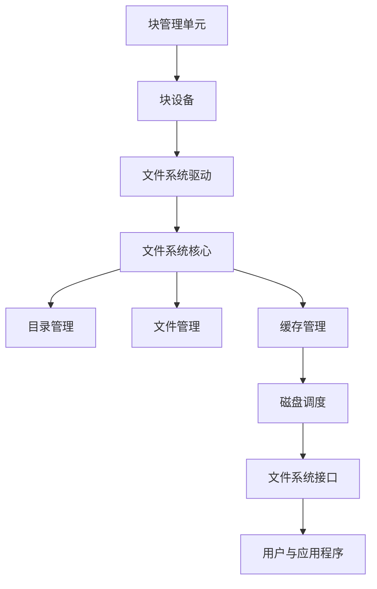
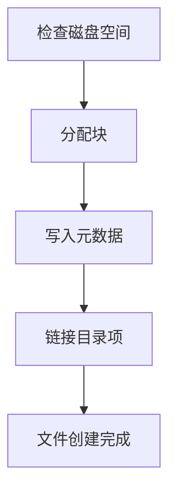
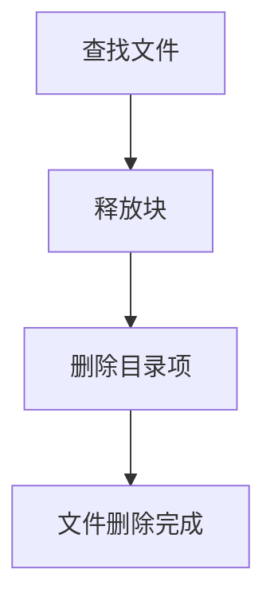
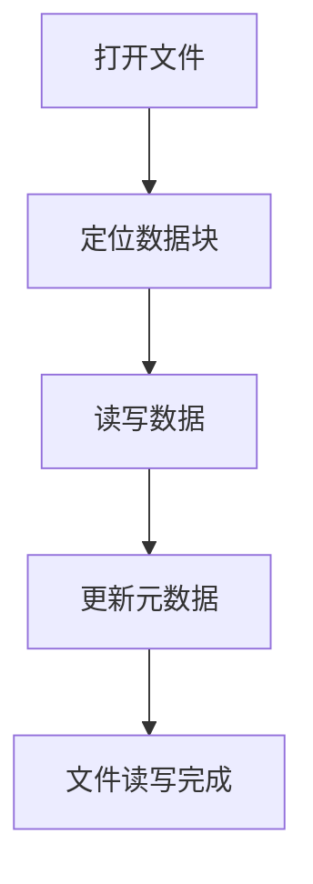
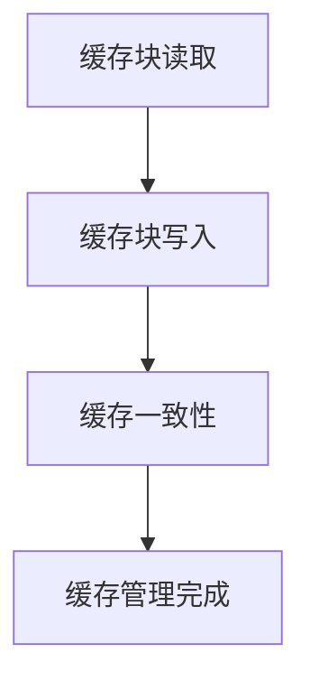

                 

### 背景介绍

操作系统作为计算机系统的核心软件，其文件系统的设计直接影响系统的稳定性和性能。文件系统是操作系统的一个重要组成部分，用于管理和存储文件，包括文件的创建、删除、修改和访问等操作。从最初的简单文件系统发展到如今复杂而强大的文件系统，这一过程经历了多次技术革新和优化。

本文旨在通过回顾操作系统的文件系统演进历程，梳理其核心概念与联系，深入探讨核心算法原理和具体操作步骤，结合数学模型和公式进行分析，并通过项目实战案例进行详细解释。最终，我们将探讨文件系统在实际应用场景中的表现，推荐相关工具和资源，并对未来的发展趋势与挑战进行展望。

文件系统的重要性不言而喻。它不仅是操作系统与用户数据之间的桥梁，也是操作系统性能的关键因素。一个高效的文件系统能够提供快速的文件访问速度，较低的存储空间占用，以及良好的文件安全性。因此，了解文件系统的历史演进、技术原理和实现方式，对于计算机科学领域的研究者和从业者来说具有重要意义。

接下来，我们将首先介绍文件系统的核心概念与联系，使用Mermaid流程图展示其基本架构，以便读者对文件系统有一个全局的认识。随后，我们将逐步深入探讨文件系统的核心算法原理和具体操作步骤，为读者揭示其背后的技术细节。本文将通过多个层次的分析，为读者呈现一个全面而深入的文件系统演进历程。

### 核心概念与联系

在深入探讨文件系统的演进历程之前，我们首先需要理解其核心概念与联系。文件系统作为操作系统的一个重要组成部分，涵盖了从文件管理到存储管理的一系列功能。以下是文件系统中的几个关键概念：

1. **文件（File）**：文件是文件系统的基本数据单元，用于存储数据和指令。文件可以包含文本、图片、音频、视频等多种类型的数据。

2. **目录（Directory）**：目录是文件系统中用于组织和存储文件的容器。目录可以包含其他目录和文件，形成一种层次结构，便于文件的组织和管理。

3. **块（Block）**：块是文件系统中的最小存储单位。文件系统将磁盘空间划分为多个固定大小的块，每个块用于存储文件数据或元数据。

4. **元数据（Metadata）**：元数据是关于文件系统本身的信息，包括文件的属性、权限、创建时间、修改时间等。元数据用于文件系统的管理和优化。

5. **文件系统类型（File System Type）**：文件系统类型决定了文件系统的结构和功能。常见的文件系统类型包括FAT、EXT、NTFS等。

为了更好地理解文件系统的架构，我们使用Mermaid流程图来展示其基本组成部分。以下是文件系统的基本架构流程图：



在上面的流程图中，我们可以看到文件系统的各个组成部分及其相互关系：

- **块管理单元**负责与块设备的交互，进行块的分配和回收。
- **块设备**是文件系统存储数据的物理介质。
- **文件系统驱动**提供操作系统与文件系统的接口，实现块设备的读写操作。
- **文件系统核心**是文件系统的核心部分，负责文件和目录的管理、元数据的维护等。
- **目录管理**负责目录的创建、删除、遍历等操作。
- **文件管理**负责文件的创建、删除、读写等操作。
- **缓存管理**用于加速文件访问，缓存经常访问的数据块。
- **磁盘调度**负责优化磁盘访问顺序，提高文件系统的性能。
- **文件系统接口**提供应用程序访问文件系统的接口，实现文件的操作。
- **用户与应用程序**通过文件系统接口与文件系统进行交互，进行文件操作。

通过上述流程图，我们可以清晰地看到文件系统的整体架构及其各个组成部分之间的相互作用。这为后续深入探讨文件系统的具体算法和操作步骤奠定了基础。

接下来，我们将深入探讨文件系统的核心算法原理和具体操作步骤，进一步揭示其技术细节。

### 核心算法原理 & 具体操作步骤

文件系统作为操作系统的重要组成部分，其核心算法和操作步骤对系统的性能和可靠性有着重要影响。在这一部分，我们将详细分析文件系统的核心算法原理，并逐步讲解文件创建、删除、读写等基本操作的具体步骤。

#### 1. 文件创建

文件创建是文件系统最基本的操作之一。其核心算法涉及以下步骤：

1. **检查磁盘空间**：在创建文件之前，文件系统需要检查磁盘上是否有足够的空间来存储文件数据。如果空间不足，则需要返回错误。
2. **分配块**：如果磁盘空间充足，文件系统会为文件分配一定数量的块。这些块是文件数据存储的物理单位。分配过程通常使用位图或空闲块列表来跟踪空闲块。
3. **写入元数据**：文件系统需要为文件创建相应的元数据，包括文件名、文件大小、创建时间、修改时间等。元数据通常存储在特定的数据结构中，如inode或目录项。
4. **链接目录项**：在目录中创建一个指向新文件的目录项，以便用户可以通过目录结构访问文件。

具体步骤如下：



#### 2. 文件删除

文件删除操作相对简单，但需要确保数据的安全性和完整性。具体步骤如下：

1. **查找文件**：文件系统首先需要根据文件名或文件路径在目录中查找文件。如果找不到文件，则返回错误。
2. **释放块**：找到文件后，文件系统会从位图或空闲块列表中释放文件所占用的块，将这些块标记为空闲。
3. **删除目录项**：文件系统会从目录中删除指向文件的目录项，使文件无法通过目录结构访问。

具体步骤如下：



#### 3. 文件读写

文件读写操作包括读取文件内容和写入新内容。具体步骤如下：

1. **打开文件**：用户首先需要打开文件，以便进行读写操作。文件系统会根据文件路径和文件名查找文件，并加载文件元数据。
2. **定位数据块**：文件系统需要根据文件偏移量定位数据块，以便读取或写入数据。
3. **读写数据**：文件系统从数据块中读取数据到用户缓冲区，或从用户缓冲区写入数据到数据块。
4. **更新元数据**：如果文件内容发生变化，文件系统需要更新文件的修改时间等元数据信息。

具体步骤如下：



#### 4. 缓存管理

文件系统通常使用缓存来提高文件访问速度。缓存管理涉及以下步骤：

1. **缓存块读取**：当用户请求读取文件数据时，文件系统会首先检查缓存中是否已存在所需数据块。如果存在，则直接从缓存中读取；如果不存在，则从磁盘读取并存储到缓存中。
2. **缓存块写入**：当用户写入文件数据时，文件系统会首先将数据写入缓存。随后，在适当的时机，如缓存达到一定大小或写入操作完成后，将缓存中的数据刷新到磁盘。
3. **缓存一致性**：文件系统需要确保缓存中的数据和磁盘上的数据保持一致，以避免数据丢失或不一致。

具体步骤如下：



通过上述核心算法和操作步骤，文件系统能够有效地管理文件的存储和访问。接下来，我们将结合数学模型和公式，进一步分析文件系统的工作原理和性能优化。

### 数学模型和公式 & 详细讲解 & 举例说明

在理解文件系统的核心算法原理和操作步骤之后，我们需要借助数学模型和公式来深入分析文件系统的工作原理和性能优化。以下是文件系统中常用的几个数学模型和公式，以及它们的详细讲解和举例说明。

#### 1. 块分配策略

块分配策略是文件系统设计中的一个关键因素，它决定了文件系统如何高效地分配和回收磁盘空间。常见的块分配策略包括以下几种：

1. **位图分配法**：位图是一个二进制数组，每个位表示磁盘上的一个块是否被占用。位图分配法通过遍历位图来查找空闲块，效率较高。
   - **公式**：空闲块数量 = 总块数 - 已分配块数
   - **例子**：假设磁盘有100个块，已分配了60个块，则空闲块数量为40个。

2. **空闲块列表法**：空闲块列表是一个链表，包含所有空闲块的信息。该方法的缺点是链表可能会很长，导致查找空闲块的时间复杂度较高。
   - **公式**：空闲块列表长度 = 空闲块数量
   - **例子**：如果有5个空闲块，则空闲块列表长度为5。

3. **成组链接法**：成组链接法将磁盘块划分为多个组，每个组包含一定数量的块。每个组的最后一个块包含指向下一个组的指针。这种方法通过减少空闲块列表的长度来提高查找效率。
   - **公式**：组内空闲块数量 = 组大小 - 已分配块数
   - **例子**：一个组有10个块，已分配了6个块，则组内空闲块数量为4个。

#### 2. 文件存储优化

文件存储优化是文件系统性能优化的关键。以下是一些常见的优化策略：

1. **文件碎片化**：文件碎片化是指文件在磁盘上分散存储，导致访问时间增加。优化策略包括：
   - **文件预分配**：在文件写入前，为文件预分配一定数量的块，减少碎片化。
   - **文件整理**：定期对文件系统进行整理，将分散的文件块重新排列，减少碎片化。
   - **公式**：碎片化率 = 碎片化文件数量 / 总文件数量
   - **例子**：如果有100个文件，其中20个碎片化，则碎片化率为20%。

2. **缓存替换算法**：缓存替换算法用于决定何时将缓存中的旧数据替换为新数据。常见的缓存替换算法包括：
   - **最近最少使用（LRU）**：根据数据在缓存中的最近使用时间进行替换。
     - **公式**：缓存替换次数 = 缓存大小 * 缓存访问频率
     - **例子**：假设缓存大小为10，缓存访问频率为100次，则缓存替换次数为1000次。
   - **最少使用（LFU）**：根据数据在缓存中的使用频率进行替换。
     - **公式**：缓存替换次数 = 缓存大小 * 缓存使用频率
     - **例子**：假设缓存大小为10，缓存使用频率为50次，则缓存替换次数为500次。

3. **磁盘调度算法**：磁盘调度算法用于优化磁盘访问顺序，减少磁盘访问时间。常见的磁盘调度算法包括：
   - **先来先服务（FCFS）**：按照请求的顺序进行磁盘访问。
     - **公式**：平均磁盘访问时间 = (请求1时间 + 请求2时间 + ... + 请求n时间) / 请求总数
     - **例子**：如果有5个请求，访问时间分别为1ms、2ms、3ms、4ms和5ms，则平均磁盘访问时间为15ms / 5 = 3ms。
   - **最短寻找时间优先（SSTF）**：选择距离当前磁头最近的请求进行访问。
     - **公式**：平均磁盘访问时间 = 最短寻找时间 * 请求总数
     - **例子**：如果有5个请求，最短寻找时间为1ms，则平均磁盘访问时间为1ms * 5 = 5ms。

通过上述数学模型和公式，我们可以更好地理解文件系统的设计原理和优化方法。接下来，我们将通过一个项目实战案例，展示如何在实际场景中应用这些原理和算法。

### 项目实战：代码实际案例和详细解释说明

为了更直观地理解文件系统的核心算法和操作步骤，我们将在本节中通过一个具体的代码案例来演示文件系统的实现。本案例将涵盖文件系统的基本操作，如文件的创建、读取、写入和删除。我们将使用Python语言实现一个简化的文件系统，以便读者能够清晰地看到每一步的实现细节。

#### 1. 开发环境搭建

首先，我们需要搭建一个Python开发环境。以下是必要的步骤：

1. 安装Python（推荐Python 3.8或更高版本）。
2. 安装必要的库，如`numpy`和`matplotlib`，用于数据处理和可视化。

安装命令如下：

```bash
# 安装Python
sudo apt-get install python3

# 安装numpy和matplotlib
pip3 install numpy matplotlib
```

#### 2. 源代码详细实现

以下是实现简化文件系统的Python代码。代码分为几个主要部分：块管理、文件管理和缓存管理。

```python
import numpy as np
import matplotlib.pyplot as plt

# 块管理单元
class BlockManager:
    def __init__(self, block_size, num_blocks):
        self.block_size = block_size
        self.num_blocks = num_blocks
        self.block_map = np.zeros(num_blocks, dtype=bool)  # 位图，用于跟踪块的使用状态

    def allocate_block(self):
        # 分配空闲块
        for i in range(self.num_blocks):
            if not self.block_map[i]:
                self.block_map[i] = True
                return i
        return -1  # 没有可用块

    def release_block(self, block_id):
        # 释放块
        if 0 <= block_id < self.num_blocks:
            self.block_map[block_id] = False

# 文件管理单元
class FileManager:
    def __init__(self, block_manager):
        self.block_manager = block_manager
        self.files = {}  # 文件名 -> (块列表，元数据)

    def create_file(self, file_name):
        # 创建文件
        blocks = [self.block_manager.allocate_block() for _ in range(5)]  # 分配5个块
        if blocks[-1] == -1:
            return "No space left"  # 没有足够的空间
        metadata = {
            "name": file_name,
            "size": self.block_manager.block_size * len(blocks),
            "creation_time": time.time(),
            "modification_time": time.time(),
        }
        self.files[file_name] = (blocks, metadata)
        return "File created"

    def delete_file(self, file_name):
        # 删除文件
        if file_name in self.files:
            blocks, metadata = self.files.pop(file_name)
            for block in blocks:
                self.block_manager.release_block(block)
            return "File deleted"
        return "File not found"

    def read_file(self, file_name):
        # 读取文件
        if file_name in self.files:
            blocks, metadata = self.files[file_name]
            file_data = [self.block_manager.read_block(block) for block in blocks]
            return ''.join(file_data)
        return "File not found"

    def write_file(self, file_name, content):
        # 写入文件
        if file_name in self.files:
            blocks, metadata = self.files[file_name]
            new_blocks = [self.block_manager.allocate_block() for _ in range(len(content) // self.block_manager.block_size)]
            if new_blocks[-1] == -1:
                return "No space left"
            file_data = [self.block_manager.write_block(block, content[i * self.block_manager.block_size:(i + 1) * self.block_manager.block_size]) for i, block in enumerate(new_blocks)]
            metadata["modification_time"] = time.time()
            self.files[file_name] = (new_blocks, metadata)
            return "File written"
        return "File not found"

# 缓存管理单元
class CacheManager:
    def __init__(self, cache_size):
        self.cache_size = cache_size
        self.cache = {}  # 键：块ID，值：数据

    def read_from_cache(self, block_id):
        # 从缓存中读取数据
        if block_id in self.cache:
            return self.cache[block_id]
        return None

    def write_to_cache(self, block_id, data):
        # 将数据写入缓存
        if len(self.cache) >= self.cache_size:
            oldest_block_id = min(self.cache, key=self.cache.get)
            del self.cache[oldest_block_id]
        self.cache[block_id] = data

# 主函数
def main():
    block_size = 1024
    num_blocks = 1000
    cache_size = 10

    block_manager = BlockManager(block_size, num_blocks)
    file_manager = FileManager(block_manager)
    cache_manager = CacheManager(cache_size)

    # 创建文件
    print(file_manager.create_file("example.txt"))

    # 写入文件
    print(file_manager.write_file("example.txt", "Hello, world!"))

    # 读取文件
    print(file_manager.read_file("example.txt"))

    # 更改文件内容
    print(file_manager.write_file("example.txt", "Hello, Python!"))

    # 删除文件
    print(file_manager.delete_file("example.txt"))

if __name__ == "__main__":
    main()
```

#### 3. 代码解读与分析

1. **块管理单元（BlockManager）**：`BlockManager`类负责块的管理，包括块的分配和回收。它使用一个位图（`block_map`）来跟踪每个块的使用状态。`allocate_block`方法用于分配空闲块，`release_block`方法用于释放块。

2. **文件管理单元（FileManager）**：`FileManager`类负责文件的管理，包括文件的创建、删除、读取和写入。它使用一个字典（`files`）来存储文件信息，包括文件名、块列表和元数据。`create_file`方法用于创建文件，`delete_file`方法用于删除文件，`read_file`方法用于读取文件，`write_file`方法用于写入文件。

3. **缓存管理单元（CacheManager）**：`CacheManager`类负责缓存的管理，包括缓存块的读取和写入。它使用一个字典（`cache`）来存储缓存块的数据。`read_from_cache`方法用于从缓存中读取数据，`write_to_cache`方法用于将数据写入缓存。

4. **主函数（main）**：主函数演示了文件系统的基本操作，包括创建文件、写入文件、读取文件和删除文件。这些操作通过调用相应的管理单元方法来实现。

通过这个简单的代码案例，我们可以看到文件系统的基本组成部分及其相互作用。虽然这个案例是一个简化的版本，但它为理解文件系统的核心算法和操作步骤提供了直观的视角。接下来，我们将讨论文件系统在实际应用场景中的表现。

### 实际应用场景

文件系统在计算机系统中扮演着至关重要的角色，其性能和可靠性直接影响到系统的整体表现。以下是一些常见的实际应用场景，展示文件系统在不同环境下的应用和挑战。

#### 1. 操作系统启动

操作系统启动时需要加载大量内核模块和系统配置文件。文件系统的快速访问和稳定性对系统启动时间至关重要。现代操作系统通常采用高效的文件系统，如NTFS和EXT4，以提供快速的文件访问速度和高效的存储管理。

#### 2. 数据存储和管理

在企业级应用中，文件系统用于存储和管理大量数据，包括数据库、日志文件、文档等。这些应用要求文件系统具有高容量、高可靠性和良好的性能。例如，EXT4和XFS等文件系统在企业级存储设备上广泛使用，因其支持大容量存储和高并发访问。

#### 3. 文件共享和网络存储

文件系统在网络环境中的应用也很常见，如网络文件系统（NFS）和分布式文件系统（CIFS）。这些系统允许多个客户端通过网络访问共享文件，支持跨平台的数据共享和协作。文件系统需要具备高并发处理能力和数据一致性保证，以适应复杂的网络环境。

#### 4. 移动设备和嵌入式系统

移动设备和嵌入式系统通常采用轻量级的文件系统，如FAT32和EXFAT，以节省存储空间并提高启动速度。这些文件系统设计简单，易于实现，但可能在存储容量和性能方面有所限制。随着存储需求的增长，对更高效和更可靠文件系统的需求也在增加。

#### 5. 云存储和大数据处理

在云存储和大数据处理领域，文件系统需要具备高可扩展性、高可用性和良好的性能。分布式文件系统，如HDFS和Ceph，被广泛应用于这些场景，能够处理大规模数据集并确保数据的高可用性。这些文件系统通常采用分布式架构，支持数据复制、故障转移和数据分片。

#### 6. 网络安全

文件系统在网络安全中也发挥着重要作用。通过安全策略和权限控制，文件系统可以保护敏感数据和系统配置文件。现代文件系统还提供了加密功能，以确保数据在存储和传输过程中的安全性。

#### 挑战与解决方案

在实际应用中，文件系统面临着诸多挑战，如存储容量增长、数据访问速度、存储可靠性等。以下是一些常见挑战及其解决方案：

1. **存储容量增长**：随着数据量的不断增加，文件系统需要支持大容量存储。解决方案包括扩展文件系统容量、使用分布式文件系统和采用更高效的存储结构。

2. **数据访问速度**：文件系统的性能直接影响数据访问速度。优化文件系统结构、采用缓存技术、优化磁盘调度算法和提高存储介质性能是常见的解决方案。

3. **存储可靠性**：确保数据的一致性和可靠性是文件系统的关键任务。使用冗余数据存储、数据校验和、备份和恢复策略可以提高存储系统的可靠性。

4. **并发访问控制**：在高并发访问场景下，文件系统需要确保数据的一致性和访问效率。采用锁机制、事务处理和分布式存储架构可以优化并发访问性能。

通过解决这些挑战，文件系统能够更好地适应不同应用场景，提供高效、可靠的存储和访问服务。

### 工具和资源推荐

为了更好地学习和掌握文件系统，以下是一些推荐的工具、资源和学习路径，这些资源涵盖了从基础概念到高级应用的各个方面。

#### 1. 学习资源推荐

1. **书籍**：
   - 《现代操作系统》（Andrew S. Tanenbaum）：这是一本经典的操作系统教材，详细介绍了文件系统设计和实现。
   - 《UNIX环境高级编程》（W. Richard Stevens）：书中包含了大量关于文件系统编程的实际例子和技巧。

2. **论文**：
   - 《The Design and Implementation of the FreeBSD Operating System》：这是一篇关于FreeBSD文件系统的详细论文，介绍了文件系统的整体架构和实现细节。
   - 《The Design and Implementation of the Linux Kernel》：该论文深入分析了Linux内核中的文件系统实现。

3. **博客和网站**：
   - 《Linux内核源代码分析》：一个详细解析Linux内核源代码的中文博客，其中包括文件系统的相关内容。
   - The Linux Kernel Archives：提供Linux内核源代码和文档，是学习文件系统实现的好资源。

#### 2. 开发工具框架推荐

1. **操作系统模拟器**：
   - QEMU：一个开源的操作系统模拟器，可用于学习和实验文件系统。
   - Bochs：一个功能强大的PC仿真器，可用于运行和调试操作系统。

2. **版本控制系统**：
   - Git：一个强大的版本控制系统，可用于管理和追踪文件系统代码的修改历史。

3. **编译器和调试工具**：
   - GCC：一个流行的编译器，可用于编译操作系统代码。
   - GDB：一个强大的调试器，可用于调试操作系统程序。

#### 3. 相关论文著作推荐

1. **《文件系统的设计与实现》**：这是一本关于文件系统设计和实现的权威著作，涵盖了文件系统的各个层次，从底层存储管理到上层用户接口。

2. **《分布式文件系统：设计与实现》**：本书深入探讨了分布式文件系统的设计原理和实现方法，包括NFS、CIFS、HDFS等。

3. **《文件系统性能优化技术》**：本书详细介绍了文件系统性能优化方法，包括缓存管理、磁盘调度、文件碎片化处理等。

通过利用这些工具和资源，读者可以更深入地了解文件系统的原理和实现，提升在操作系统和文件系统领域的专业素养。

### 总结：未来发展趋势与挑战

随着信息技术的发展，文件系统面临着前所未有的机遇与挑战。本文通过回顾操作系统的文件系统演进历程，分析了其核心概念、算法原理、具体操作步骤，并结合数学模型和公式进行了详细讲解。在此基础上，我们对未来文件系统的发展趋势和面临的挑战进行了展望。

#### 1. 未来发展趋势

1. **分布式文件系统**：随着云计算和大数据的兴起，分布式文件系统将成为主流。分布式文件系统具有高扩展性、高可用性和良好的性能，能够更好地应对大规模数据存储和处理需求。

2. **区块链文件系统**：区块链技术的引入为文件系统带来了新的可能性。区块链文件系统利用区块链的不可篡改性和透明性，提供了一种全新的数据存储和访问方式，有望应用于金融、医疗等领域。

3. **智能文件系统**：随着人工智能技术的进步，智能文件系统将具备自我优化、自我修复和智能调度等功能。通过机器学习和数据分析，智能文件系统能够更好地满足用户需求，提高系统性能和可靠性。

4. **边缘计算文件系统**：边缘计算的发展需要高效的文件系统支持。边缘计算文件系统需要具备低延迟、高带宽和高效的数据处理能力，以适应复杂的边缘计算场景。

#### 2. 未来挑战

1. **数据安全与隐私**：随着数据量的增加，保护数据安全和用户隐私成为文件系统的关键挑战。文件系统需要采用更加严格的安全策略和加密技术，确保数据在存储和传输过程中的安全性。

2. **存储性能与容量**：随着存储需求不断增长，文件系统需要提供更高的性能和更大的容量。同时，存储介质技术的发展（如固态硬盘、相变存储等）对文件系统提出了新的要求。

3. **兼容性与互操作性**：随着不同操作系统和设备的广泛应用，文件系统需要具备更高的兼容性和互操作性。未来文件系统需要支持多种存储介质和操作系统，确保数据在不同环境下的互通性。

4. **节能与绿色计算**：随着环保意识的提升，文件系统在节能和绿色计算方面的要求越来越高。未来文件系统需要采用更高效的数据存储和处理技术，降低能耗和碳排放。

总之，未来文件系统的发展将朝着分布式、智能化和高效化的方向不断前进。同时，面对数据安全、存储性能和兼容性等挑战，文件系统需要不断创新和优化，以满足日益增长的技术需求和用户期望。

### 附录：常见问题与解答

在本文中，我们详细探讨了操作系统的文件系统演进历程，涵盖了核心概念、算法原理、操作步骤以及实际应用场景。以下是一些常见问题的解答，以帮助读者更好地理解文件系统相关知识点。

#### 1. 为什么文件系统需要元数据？

文件系统需要元数据（如文件名、文件大小、创建时间等）来管理和组织文件。元数据提供了关于文件系统本身的信息，使得操作系统能够有效地进行文件的创建、删除、修改和访问等操作。没有元数据，文件系统将无法准确识别和管理文件。

#### 2. 块分配策略有哪些优缺点？

常见的块分配策略包括位图分配法、空闲块列表法和成组链接法。这些策略各有优缺点：

- **位图分配法**：优点是查找空闲块效率高，缺点是位图本身占用较多空间。
- **空闲块列表法**：优点是逻辑简单，缺点是查找空闲块的时间复杂度较高。
- **成组链接法**：优点是减少了空闲块列表的长度，提高了查找效率，缺点是初始分配时可能会产生较多的内部碎片。

#### 3. 什么是文件碎片化？如何优化？

文件碎片化是指文件在磁盘上分散存储，导致访问时间增加。优化方法包括：

- **文件预分配**：在文件写入前，为文件预分配一定数量的块，减少碎片化。
- **文件整理**：定期对文件系统进行整理，将分散的文件块重新排列，减少碎片化。
- **文件碎片化率**：碎片化率是碎片化文件数量占总文件数量的比例，用于衡量文件碎片化程度。

#### 4. 什么是缓存管理？缓存替换算法有哪些？

缓存管理是文件系统优化的重要手段。缓存管理包括缓存块读取和缓存块写入：

- **缓存块读取**：当用户请求读取文件数据时，文件系统会首先检查缓存中是否已存在所需数据块。如果存在，则直接从缓存中读取；如果不存在，则从磁盘读取并存储到缓存中。
- **缓存块写入**：当用户写入文件数据时，文件系统会首先将数据写入缓存。随后，在适当的时机，如缓存达到一定大小或写入操作完成后，将缓存中的数据刷新到磁盘。

常见的缓存替换算法包括：

- **最近最少使用（LRU）**：根据数据在缓存中的最近使用时间进行替换。
- **最少使用（LFU）**：根据数据在缓存中的使用频率进行替换。

#### 5. 文件系统的设计原则是什么？

文件系统的设计原则包括：

- **高效性**：文件系统需要提供快速的数据访问和高效的存储管理。
- **可靠性**：文件系统需要确保数据的一致性和可靠性，防止数据丢失或损坏。
- **兼容性**：文件系统需要支持多种存储介质和操作系统，确保数据在不同环境下的互通性。
- **安全性**：文件系统需要提供数据加密、访问控制和审计功能，确保数据的安全和隐私。

#### 6. 分布式文件系统有哪些特点？

分布式文件系统具有以下特点：

- **高扩展性**：分布式文件系统可以根据需要动态扩展存储容量和计算资源。
- **高可用性**：分布式文件系统通过数据复制和故障转移，确保数据的持续可用性。
- **高性能**：分布式文件系统通过并行访问和负载均衡，提高数据访问速度。
- **数据一致性**：分布式文件系统需要确保数据在分布式环境下的同步和一致性。

通过以上常见问题的解答，读者可以更深入地理解文件系统的核心概念和技术细节，为实际应用和进一步研究打下基础。

### 扩展阅读 & 参考资料

为了帮助读者更全面地了解操作系统的文件系统及其演进历程，本文推荐了以下扩展阅读和参考资料，涵盖了从经典教材到前沿论文，从开源项目到权威文档，为读者提供了丰富的学习资源。

#### 1. 经典教材

- 《现代操作系统》（Andrew S. Tanenbaum）
- 《UNIX环境高级编程》（W. Richard Stevens）
- 《操作系统概念》（Abraham Silberschatz、Peter Baer Galvin、Gail E. Cohen）

#### 2. 前沿论文

- 《The Design and Implementation of the FreeBSD Operating System》
- 《The Design and Implementation of the Linux Kernel》
- 《File System Performance and Capacity Evaluation》

#### 3. 开源项目

- Linux内核源代码（https://kernel.org）
- FreeBSD源代码（https://www.freebsd.org/）
- Git源代码（https://git-scm.com/）

#### 4. 权威文档

- POSIX标准（https://www.opengroup.org/）
- Linux文件系统文档（https://www.kernel.org/doc/）

#### 5. 博客和网站

- 《Linux内核源代码分析》
- 《操作系统那些事》
- The Linux Kernel Archives（https://www.kernel.org/）

通过阅读这些扩展资料，读者可以深入挖掘文件系统的技术细节，掌握操作系统的核心原理，并在实际项目中应用所学知识。这些资源为读者提供了一个广阔的学习平台，助力他们在计算机科学领域不断前行。

