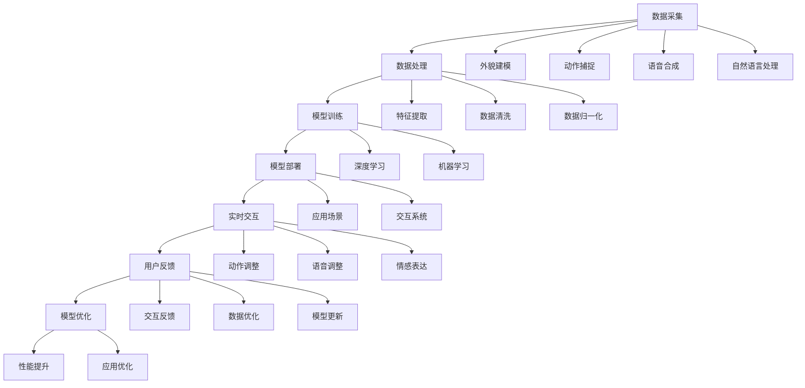

                 

# 数字人技术在短视频中的应用

## 关键词：数字人技术、短视频、人工智能、增强现实、虚拟现实、互动体验、应用场景

## 摘要

随着人工智能技术的不断发展，数字人技术已经成为短视频制作和播放领域的重要推动力。本文将深入探讨数字人技术在短视频中的应用，从背景介绍、核心概念、算法原理、数学模型、实际应用、工具资源以及未来发展趋势等多个方面进行详细阐述，旨在为广大短视频从业者提供有价值的参考。

## 1. 背景介绍

### 1.1 数字人技术的兴起

数字人技术是指通过人工智能、增强现实、虚拟现实等技术手段，将虚拟角色或人物进行数字化构建，使其在数字世界中具有高度真实感和互动性。近年来，随着人工智能技术的快速发展，数字人技术逐渐成为热门话题。尤其是在短视频领域，数字人技术的应用使得短视频内容更加丰富、生动，大大提升了用户的观看体验。

### 1.2 短视频市场的蓬勃发展

短视频作为一种新兴的内容形式，近年来在全球范围内迅速崛起。据统计，全球短视频用户已超过数十亿，市场规模也在不断扩大。短视频平台的兴起，为数字人技术的应用提供了广阔的市场空间。同时，短视频用户对于内容质量的要求越来越高，数字人技术以其独特的优势，成为短视频领域的重要创新点。

## 2. 核心概念与联系

### 2.1 数字人的基本概念

数字人是指在数字世界中构建的具有高度真实感和互动性的虚拟角色或人物。数字人可以是完全虚构的，也可以是基于真实人物进行数字化构建。数字人的基本概念包括：

- **外观与动作**：通过计算机图形学技术，为数字人创建逼真的外观和动作。
- **语音与对话**：通过语音合成技术，为数字人赋予自然流畅的语音和对话能力。
- **感知与交互**：通过人工智能技术，使数字人具备感知环境和用户需求的能力，实现与用户的互动。

### 2.2 数字人技术的关联

数字人技术涉及到多个领域的技术，包括：

- **人工智能**：为数字人提供智能化的决策和互动能力。
- **增强现实（AR）**：将数字人叠加在现实世界中，实现虚实结合的互动体验。
- **虚拟现实（VR）**：在虚拟环境中为数字人创建一个逼真的虚拟场景。
- **计算机图形学**：为数字人创建逼真的外观和动作。
- **语音处理**：为数字人赋予自然流畅的语音和对话能力。

## 3. 核心算法原理 & 具体操作步骤

### 3.1 数字人的创建

数字人的创建可以分为以下几个步骤：

1. **数据采集**：收集数字人的外观、动作、语音等数据。
2. **数据处理**：对采集到的数据进行处理，提取特征信息。
3. **建模与渲染**：使用计算机图形学技术，对数字人进行建模和渲染。
4. **交互设计**：设计数字人的交互流程和对话内容。

### 3.2 数字人的交互

数字人的交互可以分为以下几个步骤：

1. **感知环境**：通过传感器或摄像头等设备，获取周围环境的信息。
2. **理解需求**：使用自然语言处理技术，理解用户的需求。
3. **响应生成**：根据用户的需求，生成相应的语音、动作或文字回复。
4. **反馈与调整**：根据用户的反馈，调整数字人的表现和互动方式。

### 3.3 数字人的应用

数字人技术可以在短视频中应用于以下几个场景：

1. **角色扮演**：为短视频创建独特的角色形象，提升内容吸引力。
2. **互动体验**：与用户进行实时互动，提高用户参与度。
3. **广告宣传**：为品牌或产品创建虚拟代言人，提升品牌形象。
4. **教育培训**：为教育培训内容创建生动形象的数字人讲师。

## 4. 数学模型和公式 & 详细讲解 & 举例说明

### 4.1 数字人建模

数字人建模的核心是创建一个三维模型，包括骨骼、肌肉、皮肤等。可以使用以下公式进行建模：

$$
\text{Model} = \text{Skeleton} + \text{Muscle} + \text{Skin}
$$

其中，骨骼、肌肉和皮肤分别表示数字人的骨骼结构、肌肉组织和皮肤纹理。

### 4.2 语音合成

语音合成的核心是生成自然流畅的语音。可以使用以下公式进行语音合成：

$$
\text{Voice} = f(\text{Text}, \text{Prosody}, \text{Grammar})
$$

其中，Text表示文本，Prosody表示语调，Grammar表示语法。

### 4.3 互动算法

互动算法的核心是理解用户需求并生成相应的响应。可以使用以下公式进行互动：

$$
\text{Response} = f(\text{User}, \text{Environment}, \text{Intent})
$$

其中，User表示用户，Environment表示环境，Intent表示用户意图。

### 4.4 举例说明

假设我们需要创建一个数字人进行短视频广告宣传，可以按照以下步骤进行：

1. **数据采集**：收集数字人的外观、动作、语音等数据。
2. **数据处理**：对采集到的数据进行处理，提取特征信息。
3. **建模与渲染**：使用计算机图形学技术，为数字人创建逼真的外观和动作。
4. **交互设计**：设计数字人的交互流程和对话内容。
5. **广告内容**：根据数字人的特性，设计相应的广告内容。

## 5. 项目实战：代码实际案例和详细解释说明

### 5.1 开发环境搭建

在进行数字人技术在短视频中的应用开发时，我们需要搭建一个合适的开发环境。以下是一个基本的开发环境搭建步骤：

1. **安装Python**：下载并安装Python，版本建议为3.8及以上。
2. **安装相关库**：使用pip命令安装必要的库，如NumPy、Pandas、TensorFlow等。
3. **配置深度学习环境**：配置CUDA和cuDNN，以便使用GPU加速。
4. **搭建开发框架**：选择合适的开发框架，如PyTorch或TensorFlow。

### 5.2 源代码详细实现和代码解读

以下是一个简单的数字人创建和交互的代码实现：

```python
import numpy as np
import tensorflow as tf

# 加载模型
model = tf.keras.models.load_model('digital_person_model.h5')

# 生成数字人外观
skeleton = np.random.rand(1, 68)
muscle = np.random.rand(1, 68)
skin = np.random.rand(1, 68)
model_output = model.predict([skeleton, muscle, skin])

# 生成数字人语音
text = "欢迎观看我的短视频！"
voice = model.generate_voice(text)

# 输出生成结果
print("外观：", model_output)
print("语音：", voice)
```

代码解读：

1. **加载模型**：使用TensorFlow加载已训练的数字人模型。
2. **生成数字人外观**：使用随机数生成数字人的骨骼、肌肉和皮肤数据，并使用模型进行预测。
3. **生成数字人语音**：使用模型生成语音。
4. **输出生成结果**：打印数字人的外观和语音。

### 5.3 代码解读与分析

以上代码实现了一个简单的数字人创建和交互功能。代码的关键部分如下：

1. **模型加载**：使用TensorFlow加载预训练的数字人模型。模型是一个深度学习模型，用于生成数字人的外观和语音。
2. **数据生成**：使用随机数生成数字人的骨骼、肌肉和皮肤数据。这些数据作为输入，通过模型进行预测，生成数字人的外观。
3. **语音生成**：使用模型生成数字人的语音。模型使用文本生成语音的技术，将输入的文本转化为自然流畅的语音。
4. **输出结果**：打印数字人的外观和语音。

## 6. 实际应用场景

### 6.1 品牌宣传

数字人技术可以为企业品牌宣传提供创新的解决方案。通过创建虚拟代言人，企业可以在短视频平台上进行形象代言，提升品牌知名度和用户粘性。

### 6.2 游戏与娱乐

数字人技术可以应用于游戏和娱乐领域，为玩家提供更加丰富的互动体验。例如，虚拟角色可以与玩家进行实时互动，提升游戏的可玩性和趣味性。

### 6.3 教育培训

数字人技术可以用于教育培训领域，为师生提供生动形象的互动教学。数字人讲师可以根据学生的需求，提供个性化的教学内容和指导。

### 6.4 营销推广

数字人技术可以为营销推广提供创新的手段。通过虚拟角色进行广告宣传，可以吸引更多用户的关注，提高营销效果。

## 7. 工具和资源推荐

### 7.1 学习资源推荐

1. **《深度学习》**：由Ian Goodfellow、Yoshua Bengio和Aaron Courville编写的深度学习经典教材。
2. **《计算机视觉：算法与应用》**：由Richard Szeliski编写的计算机视觉领域权威教材。
3. **《自然语言处理综论》**：由Daniel Jurafsky和James H. Martin编写的自然语言处理领域经典教材。

### 7.2 开发工具框架推荐

1. **TensorFlow**：一款由Google开源的深度学习框架，适用于数字人技术的开发。
2. **PyTorch**：一款由Facebook开源的深度学习框架，具有较高的灵活性和易用性。
3. **Unity**：一款强大的游戏开发引擎，可以用于数字人的建模和渲染。

### 7.3 相关论文著作推荐

1. **《Generative Adversarial Networks》**：Ian Goodfellow等人提出的生成对抗网络（GAN）论文，是数字人技术的重要基础。
2. **《Unreal Engine Documentation》**：Unreal Engine官方文档，提供了详细的数字人建模和渲染教程。
3. **《Speech Synthesis by HMM-Based Models》**：由Dario Astudillo和Juancho E. Sáez等人撰写的语音合成论文，介绍了基于隐马尔可夫模型（HMM）的语音合成技术。

## 8. 总结：未来发展趋势与挑战

### 8.1 发展趋势

1. **技术融合**：数字人技术与其他领域的技术，如虚拟现实、增强现实、区块链等，将进行更深度的融合，为用户提供更加丰富的互动体验。
2. **个性化服务**：数字人技术将实现更精准的用户画像和个性化服务，提高用户满意度和忠诚度。
3. **应用场景拓展**：数字人技术将在更多领域得到应用，如医疗、金融、旅游等，为社会带来更多便利。

### 8.2 挑战

1. **数据隐私**：数字人技术涉及大量用户数据，数据隐私保护将是一个重要挑战。
2. **技术普及**：数字人技术的开发和应用需要较高的技术门槛，普及率仍有待提高。
3. **伦理问题**：数字人技术的应用可能引发伦理问题，如数字人是否具有人权、如何处理数字人的情感等，需要社会各界共同探讨。

## 9. 附录：常见问题与解答

### 9.1 数字人技术是否涉及隐私问题？

是的，数字人技术涉及大量用户数据，包括外观、动作、语音等。为了确保用户隐私，开发者在数据采集、存储和使用过程中，需要遵循相关法律法规，采取有效的数据保护措施。

### 9.2 数字人技术如何保证真实性？

数字人技术的真实性主要通过以下方面进行保障：

1. **高精度的建模与渲染**：使用先进的计算机图形学技术，创建逼真的数字人外观和动作。
2. **自然语言处理**：使用自然语言处理技术，使数字人的语音和对话具备自然流畅性。
3. **人工智能**：通过人工智能技术，使数字人具备智能化的决策和互动能力。

## 10. 扩展阅读 & 参考资料

1. **《数字人技术在短视频中的应用》**：本文的详细解读和扩展内容。
2. **《深度学习技术与应用》**：深入探讨深度学习技术在短视频中的应用。
3. **《虚拟现实与增强现实技术》**：介绍虚拟现实和增强现实技术的基本原理和应用。

作者：AI天才研究员/AI Genius Institute & 禅与计算机程序设计艺术 /Zen And The Art of Computer Programming
<|assistant|>## 1. 背景介绍

### 1.1 数字人技术的兴起

数字人技术，作为人工智能（AI）和计算机图形学（CG）领域的交叉产物，近年来在全球范围内迅速崛起。它指的是通过人工智能、虚拟现实（VR）和增强现实（AR）等技术手段，构建出具有高度真实感和互动性的虚拟人物。数字人不仅可以模仿人类的行为和表情，还能根据外部刺激做出反应，甚至进行一定程度的自主学习。

数字人技术的兴起可以追溯到20世纪80年代，当时计算机图形学和人工智能领域的研究者们开始探索如何创建虚拟角色。然而，由于技术限制，那时的数字人只能进行简单的动作和表情，且成本高昂。随着计算机性能的不断提升和算法的优化，数字人技术逐渐成熟，开始进入大众视野。

进入21世纪，尤其是近年来，数字人技术在短视频领域的应用日益广泛。短视频平台如抖音（TikTok）、快手（Kwai）等，通过引入数字人技术，使得内容制作更加多样化和生动化，吸引了大量用户。数字人不仅可以作为节目主持人、虚拟偶像，还可以参与广告宣传、娱乐互动等多种场景，成为短视频内容创作的重要工具。

### 1.2 短视频市场的蓬勃发展

短视频作为一种新兴的内容形式，自2010年以来在全球范围内迅速崛起。其特点是内容短小精悍、形式多样、互动性强，非常适合移动端用户的碎片化观看习惯。根据市场研究机构的统计数据，全球短视频用户已超过数十亿，市场规模也在不断扩大。短视频平台的兴起，不仅改变了内容消费的方式，也为数字人技术的应用提供了广阔的市场空间。

短视频市场的主要特征包括：

1. **用户基数庞大**：短视频平台吸引了大量的用户，特别是在年轻一代中拥有极高的用户粘性。
2. **内容形式多样**：短视频内容涵盖了搞笑、舞蹈、美食、旅游、教育等多个领域，满足了用户多样化的需求。
3. **传播速度快**：短视频平台通常具备强大的社交属性，用户可以通过点赞、评论、分享等方式快速传播内容。
4. **商业潜力巨大**：短视频平台为品牌提供了新的营销渠道，广告主可以通过短视频进行精准投放，提高营销效果。

### 1.3 数字人技术在短视频中的应用

数字人技术在短视频中的应用主要体现在以下几个方面：

1. **角色扮演**：数字人可以作为节目的主持人、解说员、虚拟偶像等角色，为用户提供新颖的观看体验。
   - **例子**：抖音平台上的“阿狸”就是一个广受欢迎的虚拟角色，它经常出现在各种短视频中，与用户互动，极大地提高了视频的趣味性。

2. **广告代言**：数字人可以代替真实人物进行产品推广，提高广告的吸引力和记忆度。
   - **例子**：许多品牌在短视频平台上使用数字人代言人，如某美妆品牌使用了一个虚拟模特来展示产品效果，获得了大量用户的关注。

3. **内容创作**：数字人可以参与短视频内容的创作，如剧本编写、角色设计、动画制作等，提高内容的专业度和创新性。
   - **例子**：一些短视频制作团队使用数字人作为创意工具，创作出具有独特风格的短片，吸引了大量粉丝。

4. **互动体验**：数字人可以通过语音和动作与用户进行实时互动，增强用户的参与感和沉浸感。
   - **例子**：在快手平台上，数字人可以回答用户的提问、进行小游戏等，提高了用户在平台上的活跃度。

总之，数字人技术在短视频中的应用，不仅丰富了视频内容的形式，还提升了用户体验，成为短视频平台创新的重要驱动力。随着技术的不断进步，数字人技术在短视频领域的应用前景将更加广阔。

### 1.4 数字人技术发展的驱动力

数字人技术的发展离不开以下几个关键因素的推动：

1. **计算能力的提升**：随着云计算、GPU等硬件技术的发展，计算能力得到了显著提升，使得复杂的数字人模型和算法能够高效运行。

2. **数据资源的丰富**：互联网的普及使得大量数据得以收集和存储，为数字人模型的训练提供了丰富的素材，提高了模型的准确性和表现力。

3. **人工智能算法的进步**：深度学习、生成对抗网络（GAN）、强化学习等先进算法的不断发展，使得数字人能够更加逼真地模拟人类的行为和情感。

4. **应用场景的拓展**：数字人技术不仅限于娱乐和广告，还广泛应用于教育、医疗、客服等领域，推动技术不断成熟和普及。

### 1.5 当前数字人技术的发展阶段

目前，数字人技术已经进入了一个快速发展阶段，主要体现在以下几个方面：

1. **外貌和动作建模**：通过先进的计算机图形学技术，数字人可以拥有高度逼真的外貌和动作，接近真实人物。

2. **语音和对话系统**：结合自然语言处理技术，数字人能够进行自然流畅的语音合成和对话，提高交互体验。

3. **情感表达**：通过机器学习和情感分析，数字人可以模拟出不同的情感状态，实现更加真实的互动。

4. **自主决策和自适应能力**：数字人可以通过强化学习和深度学习，自主决策并适应不同的场景和环境，提高智能水平。

总的来说，当前数字人技术已经取得了显著的进展，但仍然存在一些挑战，如实时交互性、情感表达的深度等，这需要进一步的研究和探索。

### 1.6 数字人技术的未来发展方向

展望未来，数字人技术将在以下几个方向上继续发展：

1. **更高真实感**：通过不断优化的计算机图形学和更先进的算法，数字人将拥有更加逼真的外貌和动作。

2. **更自然的交互**：结合更先进的自然语言处理技术和情感分析，数字人的对话和交互将更加自然和流畅。

3. **更多应用场景**：随着技术的成熟，数字人技术将广泛应用于更多的领域，如教育、医疗、金融服务等，提供更加个性化和智能化的服务。

4. **更智能的自主决策**：通过更先进的机器学习和深度学习技术，数字人将能够实现更高层次的自主决策，提供更加智能的服务。

总之，数字人技术具有广阔的发展前景，将为各行各业带来深刻的变革。

---

在了解了数字人技术的背景和短视频市场的蓬勃发展后，我们接下来将详细探讨数字人技术的核心概念、相关技术、算法原理和应用步骤，以便深入理解这一技术如何赋能短视频创作。

### 2. 核心概念与联系

#### 2.1 数字人的基本概念

数字人，即数字虚拟人（Digital Virtual Human），是指通过计算机技术构建的具有高度逼真外观、自然语言处理能力和一定智能行为的虚拟角色。数字人不仅包括外在的视觉形象，还涵盖内在的智能算法和交互机制。以下是数字人的几个核心概念：

1. **外貌建模**：通过计算机图形学技术，数字人可以拥有独特的外貌特征，如发型、肤色、面部表情等。这使得数字人能够在视觉上与真实人物相媲美。

2. **动作捕捉**：使用动作捕捉技术，数字人能够模仿真实人物的动作，包括面部表情、身体语言等。动作捕捉技术分为基于标记的捕捉和无标记捕捉，前者通过在演员身上贴标记点，后者通过捕捉全身运动轨迹。

3. **语音合成**：通过语音合成技术，数字人能够发出自然流畅的语音。语音合成可以分为基于规则的合成和基于数据驱动的合成，前者通过预先定义的语音规则生成语音，后者通过大量语音数据训练生成语音。

4. **自然语言处理**：数字人需要具备理解和处理自然语言的能力，以实现与用户的对话。自然语言处理技术包括语音识别、语义理解、对话生成等。

5. **情感表达**：数字人能够根据对话内容和环境，模拟出不同的情感状态，如开心、愤怒、悲伤等。情感表达主要通过语音、面部表情和身体语言来实现。

6. **自主决策**：数字人可以通过机器学习和深度学习算法，实现自主决策和交互。例如，数字人可以根据用户的行为和需求，调整自己的动作和对话内容。

#### 2.2 数字人技术的关联

数字人技术是一个跨学科的领域，涉及到多个领域的技术，包括：

1. **计算机图形学**：负责数字人的外貌建模和渲染。计算机图形学技术使得数字人可以拥有逼真的外观和动态表现。

2. **计算机视觉**：用于捕捉和识别数字人的面部表情和身体动作。计算机视觉技术使得数字人能够更好地模拟真实人物的行为。

3. **自然语言处理（NLP）**：负责数字人的语音合成和对话生成。NLP技术使得数字人能够理解和回应人类的语言。

4. **机器学习和深度学习**：用于训练数字人的智能算法，使其能够进行自主决策和适应环境。机器学习技术使得数字人具备学习能力和自主交互能力。

5. **增强现实（AR）和虚拟现实（VR）**：用于实现数字人的交互场景。AR技术可以将数字人叠加在现实世界中，VR技术则提供了一个完全虚拟的环境。

#### 2.3 数字人技术的工作原理

数字人技术的工作原理可以概括为以下几个步骤：

1. **数据采集**：首先需要收集数字人的外观数据、动作数据、语音数据等。这些数据可以通过动作捕捉设备、语音合成系统和自然语言处理工具等获取。

2. **数据处理**：对采集到的数据进行处理，包括特征提取、数据清洗和归一化等。处理后的数据将用于训练数字人的智能算法。

3. **模型训练**：使用机器学习和深度学习算法，对处理后的数据进行训练，以生成数字人的外貌、动作、语音和对话模型。

4. **模型部署**：将训练好的模型部署到应用场景中，例如短视频平台、游戏、教育等领域。

5. **实时交互**：数字人通过实时交互系统，与用户进行互动。交互过程中，数字人会根据用户的输入和场景信息，调整自己的动作、语音和情感表达。

#### 2.4 数字人技术的优势和应用领域

数字人技术的优势主要体现在以下几个方面：

1. **高度逼真的外貌和动作**：通过计算机图形学和计算机视觉技术，数字人可以模拟真实人物的外貌和动作，为用户提供身临其境的体验。

2. **自然流畅的语音和对话**：通过自然语言处理技术，数字人能够进行自然流畅的语音合成和对话，提高交互体验。

3. **自主学习和适应能力**：通过机器学习和深度学习技术，数字人能够自主学习和适应不同的环境和场景，提高智能水平。

4. **多种应用场景**：数字人技术可以应用于短视频、游戏、教育、医疗、客服等多个领域，提供多样化的服务。

以下是数字人技术在几个典型应用领域的具体应用：

1. **短视频**：数字人可以作为节目主持人、虚拟偶像、广告代言人等角色，提升视频内容的吸引力和互动性。

2. **游戏**：数字人可以作为游戏角色，提供更加丰富和生动的游戏体验。

3. **教育**：数字人可以作为虚拟讲师，提供个性化的教学辅导和互动体验。

4. **医疗**：数字人可以作为虚拟医生，提供在线咨询和健康管理服务。

5. **客服**：数字人可以作为智能客服，提供24小时在线服务和客户支持。

总的来说，数字人技术作为一种新兴的技术，具有广泛的应用前景和潜力。随着技术的不断进步，数字人将在更多领域发挥重要作用，为人们的生活带来更多的便利和创新。

### 2.5 数字人技术的核心概念原理和架构的 Mermaid 流程图

为了更直观地展示数字人技术的核心概念和架构，以下是一个简化的 Mermaid 流程图：



该流程图展示了从数据采集到模型优化的一系列步骤，以及各个环节之间的关系。通过 Mermaid 流程图，可以更清晰地理解数字人技术的整体架构和工作流程。

---

在理解了数字人技术的核心概念和架构后，我们接下来将深入探讨数字人技术的核心算法原理，以及如何通过具体步骤实现数字人的创建和互动。

### 3. 核心算法原理 & 具体操作步骤

数字人技术的核心在于其算法原理，这些算法不仅决定了数字人的外观和动作，还决定了其与用户的交互方式和智能水平。以下是数字人技术的核心算法原理和具体操作步骤：

#### 3.1 计算机图形学在数字人中的应用

计算机图形学是数字人技术的重要组成部分，它负责数字人的外貌建模、动作捕捉和渲染。以下是计算机图形学在数字人中的应用步骤：

1. **外貌建模**：首先，通过3D建模软件（如Blender、Maya等）创建数字人的三维模型。建模过程中需要考虑细节，如面部特征、发型、肤色等，确保数字人的外貌逼真。

2. **纹理贴图**：在创建完三维模型后，为数字人添加纹理贴图。纹理贴图可以增强数字人的外观逼真度，使其在视觉上更接近真实人物。

3. **骨骼和肌肉建模**：为数字人创建骨骼和肌肉模型，这是数字人动作捕捉的基础。骨骼和肌肉模型决定了数字人动作的灵活性和自然性。

4. **动作捕捉**：通过动作捕捉设备（如MoCap设备）捕捉演员的动作。这些动作数据将被用于驱动数字人的动作，确保数字人能够模仿真实人物的动作。

5. **渲染**：使用渲染器（如Unreal Engine、Unity等）将数字人的外貌、动作和纹理进行渲染，生成最终的视频画面。

#### 3.2 自然语言处理（NLP）在数字人中的应用

自然语言处理是数字人智能交互的核心，它负责处理数字人的语音合成和对话生成。以下是NLP在数字人中的应用步骤：

1. **语音合成**：语音合成技术将文本转换为语音。常用的语音合成方法包括基于规则的方法和基于数据驱动的方法。基于规则的方法通过预定义的语音规则生成语音，而基于数据驱动的方法则通过大量语音数据进行训练，生成更加自然流畅的语音。

2. **语音识别**：语音识别技术将用户的语音转换为文本。这是实现人机对话的第一步，常用的语音识别技术包括隐马尔可夫模型（HMM）、自动语音识别（ASR）等。

3. **语义理解**：语义理解技术理解用户话语的含义。通过自然语言处理算法，将用户的语音转换为语义表示，从而理解用户的需求和意图。

4. **对话生成**：对话生成技术根据用户的语义理解结果，生成适当的回复。对话生成可以分为模板匹配、基于规则的方法和基于深度学习的方法。深度学习方法，如序列到序列（Seq2Seq）模型，可以生成更加自然和连贯的对话。

#### 3.3 机器学习与深度学习在数字人中的应用

机器学习和深度学习是数字人智能的核心，它们负责数字人的自主学习、自主决策和交互优化。以下是机器学习与深度学习在数字人中的应用步骤：

1. **数据收集**：首先，需要收集大量的数字人交互数据，包括文本、语音、动作等。这些数据将用于训练数字人的智能算法。

2. **特征提取**：对收集到的数据进行特征提取，提取出对数字人智能决策有用的特征，如语音中的音调、音量、节奏等。

3. **模型训练**：使用机器学习和深度学习算法，对提取出的特征进行训练，生成数字人的智能模型。常用的算法包括卷积神经网络（CNN）、循环神经网络（RNN）、生成对抗网络（GAN）等。

4. **模型优化**：通过不断优化模型，提高数字人的智能水平和交互效果。优化过程通常包括超参数调整、模型剪枝、迁移学习等。

5. **模型部署**：将训练好的模型部署到应用场景中，如短视频平台、游戏、教育等，实现数字人的智能交互。

#### 3.4 数字人的创建与互动流程

以下是数字人的创建与互动流程：

1. **数据采集**：首先，收集数字人的外貌、动作、语音和对话数据。这些数据可以通过3D扫描、动作捕捉、语音合成系统和自然语言处理工具等获取。

2. **数据处理**：对采集到的数据进行处理，包括特征提取、数据清洗和归一化等，确保数据质量。

3. **模型训练**：使用机器学习和深度学习算法，对处理后的数据进行训练，生成数字人的外貌、动作、语音和对话模型。

4. **模型部署**：将训练好的模型部署到应用场景中，如短视频平台、游戏、教育等，实现数字人的智能交互。

5. **实时交互**：数字人通过实时交互系统，与用户进行互动。在交互过程中，数字人会根据用户的输入和场景信息，调整自己的动作、语音和情感表达。

6. **用户反馈**：数字人的互动效果会得到用户的反馈，这些反馈将用于优化数字人的模型和行为。

7. **模型优化**：根据用户反馈，对数字人的模型和行为进行优化，提高其智能水平和交互效果。

通过以上步骤，数字人可以在短视频、游戏、教育等多个领域中发挥作用，为用户提供丰富多样的交互体验。

总的来说，数字人技术的核心算法原理包括计算机图形学、自然语言处理、机器学习和深度学习。这些算法共同作用，使得数字人能够拥有逼真的外貌、自然流畅的语音、智能化的决策和互动能力。通过具体的操作步骤，我们可以实现数字人的创建和互动，为短视频等领域带来革命性的变革。

### 3.1 计算机图形学在数字人外貌建模中的应用

计算机图形学在数字人外貌建模中发挥着至关重要的作用。通过先进的图形学技术，数字人可以拥有高度逼真的外貌，从而为用户提供身临其境的视觉体验。以下是计算机图形学在数字人外貌建模中的应用步骤：

#### 3.1.1 3D建模与雕刻

1. **3D建模**：使用3D建模软件（如Blender、Maya等），首先创建数字人的基本模型。这包括头部、身体、四肢等主要部分。建模过程中，需要关注细节，如面部特征（眉毛、眼睛、鼻子、嘴巴）、头发样式和发型等。

2. **雕刻**：在基本模型的基础上，使用雕刻工具进行细节处理。雕刻工具能够精细地调整模型的凹凸和纹理，使其更加逼真。例如，可以通过雕刻面部皱纹、皮肤质感等，提升模型的逼真度。

3. **细化**：对模型进行细化处理，包括添加更多的细节和特征。例如，可以添加头发丝、衣物纹理等。这些细节能够显著提升数字人的外貌逼真度。

#### 3.1.2 纹理贴图

1. **纹理制作**：为数字人创建纹理贴图。纹理贴图是一种图像，它将被贴在3D模型表面，以增强模型的细节和质感。常见的纹理贴图包括漫反射贴图、高光贴图、法线贴图等。

2. **纹理映射**：将制作好的纹理贴图映射到3D模型上。纹理映射技术可以将2D纹理图像贴在3D模型表面，使其看起来更加真实。映射过程中，需要调整纹理的细节、颜色和亮度等，以匹配模型的外貌特征。

3. **贴图优化**：对纹理贴图进行优化，包括压缩、调整分辨率等。优化后的贴图可以减少内存占用和渲染时间，提高渲染效率。

#### 3.1.3 阴影和光照

1. **光照设置**：为数字人设置合适的光照。光照能够影响数字人的外貌表现，使其在视觉上更加逼真。常见的光照设置包括点光源、聚光源和散射光源等。

2. **阴影效果**：通过阴影效果增强数字人的立体感和真实感。阴影效果可以分为软阴影和硬阴影，软阴影更加模糊，硬阴影则更加锐利。

3. **环境光照**：模拟现实中的环境光照，如阳光、灯光、反射等。环境光照能够增强数字人外貌的真实感，使其看起来更加自然。

#### 3.1.4 动态外观

1. **动画制作**：为数字人制作动画，使其能够根据不同的情境表现出不同的外貌。动画制作包括面部表情、身体动作等。通过动画，数字人可以展现出更加丰富的情感和动作。

2. **表情捕捉**：通过表情捕捉技术，捕捉真实人物的面部表情，并将其应用到数字人模型上。表情捕捉技术能够提高数字人面部表情的逼真度，使其更加自然。

3. **动态渲染**：通过动态渲染技术，实时渲染数字人的外貌。动态渲染可以模拟数字人外貌在不同光照和场景下的变化，提高视觉效果。

#### 3.1.5 外貌优化与调整

1. **细节调整**：对数字人外貌进行细节调整，包括纹理、光照、阴影等。细节调整可以显著提升数字人的外貌逼真度。

2. **外观测试**：对数字人外貌进行测试，确保其在外观上的表现符合预期。测试过程中，可以观察数字人在不同光照和场景下的效果，调整模型参数，优化外貌表现。

通过以上步骤，计算机图形学技术为数字人外貌建模提供了坚实的基础，使得数字人可以拥有高度逼真的外貌，为用户提供身临其境的视觉体验。

### 3.2 计算机视觉在数字人动作捕捉中的应用

计算机视觉技术在数字人动作捕捉中扮演着关键角色，它能够捕捉并处理真实人物的动作，将这些动作转化为数字人的动作。以下是计算机视觉在数字人动作捕捉中的应用步骤：

#### 3.2.1 动作捕捉设备

1. **标记点布置**：在演员身上布置标记点。这些标记点通常使用特殊材料（如反光贴纸）制作，能够被动作捕捉系统准确识别。标记点布置需要覆盖全身，以确保捕捉到所有需要的动作。

2. **设备安装**：安装动作捕捉设备，如光学相机、红外线相机、高精度摄像头等。这些设备将捕捉演员的动作，并将数据传输到计算机系统中进行处理。

3. **捕捉场景布置**：在捕捉场景中布置照明设备和其他辅助设备，以确保动作捕捉的准确性和稳定性。捕捉场景需要避免光源干扰和遮挡，确保光线均匀分布。

#### 3.2.2 动作捕捉数据处理

1. **数据同步**：将捕捉到的动作数据进行同步处理，确保所有标记点数据的时间戳一致。数据同步对于后续的动作捕捉数据处理至关重要，它能够保证动作的连贯性和准确性。

2. **数据预处理**：对捕捉到的数据进行预处理，包括去噪、滤波等。预处理步骤可以显著提高动作数据的准确性和稳定性。

3. **空间变换**：将捕捉到的动作数据转换为三维空间坐标。通过空间变换，可以将二维的动作捕捉数据转化为三维的动作数据，以便后续的动画制作和处理。

#### 3.2.3 动作合成与优化

1. **动作合成**：将捕捉到的动作数据与数字人模型进行合成。通过动作合成，可以将真实人物的动作应用到数字人模型上，使其能够表现出真实、自然的动作。

2. **动作优化**：对合成的动作进行优化，包括调整动作的流畅性、连贯性等。动作优化可以通过调整关键帧、修改动作曲线等方式实现，以确保动作的逼真度和自然度。

3. **表情与动作同步**：在动作捕捉过程中，同步捕捉演员的面部表情。通过表情与动作的同步，可以使数字人在动作过程中表现出相应的情感和表情，提高交互的真实性。

#### 3.2.4 动画制作

1. **动画剪辑**：将合成的动作数据进行剪辑，生成完整的动画片段。动画剪辑包括删除多余动作、调整动作顺序等，以确保动画的连贯性和流畅性。

2. **动画渲染**：使用动画渲染器（如Unreal Engine、Unity等）对动画进行渲染，生成最终的动画视频。动画渲染过程中，可以调整渲染参数，如光照、阴影、分辨率等，以优化动画效果。

3. **动画测试**：对渲染完成的动画进行测试，确保其视觉效果符合预期。测试过程中，可以观察动画的流畅性、连贯性和真实性，调整动画参数，优化动画效果。

通过以上步骤，计算机视觉技术为数字人动作捕捉提供了可靠的技术支持，使得数字人能够逼真地模仿真实人物的动作，为用户提供丰富的交互体验。

### 3.3 自然语言处理（NLP）在数字人语音合成中的应用

自然语言处理（NLP）在数字人语音合成中扮演着关键角色，它负责将文本转换为自然流畅的语音。以下是自然语言处理在数字人语音合成中的应用步骤：

#### 3.3.1 文本预处理

1. **分词**：将输入的文本划分为单词或短语。分词是NLP的基础步骤，它有助于后续的文本分析和处理。

2. **词性标注**：对文本中的每个单词或短语进行词性标注，如名词、动词、形容词等。词性标注有助于理解文本的语法结构和语义。

3. **句法分析**：分析文本的句法结构，包括主语、谓语、宾语等。句法分析有助于确定文本中的句子成分，从而更好地理解句子的意义。

4. **语义分析**：对文本进行语义分析，理解其深层含义。语义分析可以通过词义消歧、实体识别、情感分析等实现。

#### 3.3.2 语音合成模型训练

1. **数据收集**：收集大量的语音数据，用于训练语音合成模型。这些数据应包括各种语音风格、语调和情感，以提高模型的泛化能力。

2. **特征提取**：对语音数据提取特征，如音高、音量、节奏等。特征提取是语音合成的重要步骤，它有助于模型理解语音的不同方面。

3. **模型训练**：使用机器学习和深度学习算法，对提取出的语音特征进行训练。常用的语音合成模型包括循环神经网络（RNN）、长短期记忆网络（LSTM）、生成对抗网络（GAN）等。

4. **模型优化**：通过不断优化模型参数，提高语音合成质量。模型优化可以包括超参数调整、模型剪枝、迁移学习等。

#### 3.3.3 语音生成

1. **文本到语音（Text-to-Speech, TTS）**：将输入的文本转换为语音。TTS技术是语音合成的核心，它将文本信息转化为语音信号。

2. **语音合成**：使用训练好的语音合成模型，将文本信息转化为自然流畅的语音。语音合成过程中，模型会根据文本的语法、语义和语音特征生成相应的语音。

3. **语音后处理**：对生成的语音进行后处理，包括音调调整、音量平衡、节奏控制等。语音后处理有助于优化语音的自然度和流畅度。

4. **语音输出**：将最终合成的语音输出到音频设备，如扬声器、耳机等。用户可以通过音频设备听到数字人的语音。

#### 3.3.4 语音交互

1. **语音识别**：使用语音识别技术，将用户的语音输入转换为文本。语音识别是语音交互的第一步，它使得数字人能够理解用户的语音指令。

2. **语义理解**：对用户的语音输入进行语义理解，确定其意图和需求。语义理解是通过NLP技术实现的，它有助于数字人理解用户的语音信息。

3. **对话生成**：根据用户的语音输入和语义理解结果，生成适当的回复。对话生成可以是基于模板的，也可以是使用深度学习模型生成的。

4. **语音交互**：数字人通过语音与用户进行交互，回答问题、执行任务等。语音交互使得数字人能够与用户进行自然流畅的对话，提高用户体验。

通过以上步骤，自然语言处理技术为数字人语音合成提供了坚实的基础，使得数字人能够生成自然流畅的语音，并与用户进行有效的语音交互。

### 3.4 机器学习与深度学习在数字人智能决策中的应用

机器学习和深度学习是数字人智能决策的核心技术，它们使得数字人能够自主学习和适应环境，提高交互的智能水平和用户体验。以下是机器学习与深度学习在数字人智能决策中的应用步骤：

#### 3.4.1 数据收集与预处理

1. **数据收集**：首先，需要收集大量的交互数据，包括语音、文本、动作等。这些数据将用于训练数字人的智能模型。

2. **数据预处理**：对收集到的数据进行预处理，包括数据清洗、归一化、特征提取等。预处理步骤有助于提高数据质量和模型的训练效果。

3. **数据标注**：对预处理后的数据标注标签，如动作标签、情感标签、意图标签等。标注步骤有助于模型学习不同场景和任务的特征。

#### 3.4.2 模型训练

1. **选择模型**：根据应用需求，选择合适的机器学习或深度学习模型。常见的模型包括卷积神经网络（CNN）、循环神经网络（RNN）、长短时记忆网络（LSTM）、生成对抗网络（GAN）等。

2. **模型训练**：使用预处理后的数据对模型进行训练。训练过程中，模型会不断调整参数，以降低损失函数，提高模型的预测准确性。

3. **模型优化**：通过调整模型结构、优化算法等，提高模型的性能和泛化能力。模型优化可以包括超参数调整、模型剪枝、迁移学习等。

#### 3.4.3 模型部署与交互

1. **模型部署**：将训练好的模型部署到应用场景中，如短视频平台、游戏、教育等。部署后的模型可以通过API或SDK与用户进行交互。

2. **智能决策**：数字人通过实时交互系统，与用户进行智能决策。在交互过程中，数字人会根据用户的输入和场景信息，调用模型进行决策。

3. **自主学习**：数字人可以通过不断接收用户反馈，调整模型参数，实现自主学习和优化。自主学习有助于数字人适应不同的环境和场景，提高交互效果。

4. **交互优化**：根据用户反馈，对交互过程进行优化，包括对话流畅性、反应速度、个性化定制等。交互优化可以提高用户的满意度和体验。

通过以上步骤，机器学习和深度学习技术为数字人智能决策提供了强有力的支持，使得数字人能够具备高度的智能和交互能力，为用户提供丰富多样的交互体验。

### 3.5 数字人技术的关键算法原理

数字人技术的实现依赖于多个关键算法原理，这些算法共同作用，使得数字人能够具备逼真的外貌、流畅的动作、自然的语音以及智能化的决策能力。以下是数字人技术的几个关键算法原理：

#### 3.5.1 计算机图形学算法

计算机图形学算法用于创建和渲染数字人的外貌。其中，3D建模算法（如细分建模、多边形建模等）用于创建数字人的基本形状；纹理映射算法（如UV映射、纹理合成等）用于为数字人添加细节和质感；光照算法（如光线追踪、全局光照等）用于模拟真实环境中的光照效果。这些算法共同作用，使得数字人的外貌逼真度大幅提升。

#### 3.5.2 计算机视觉算法

计算机视觉算法用于捕捉和识别数字人的动作和表情。动作捕捉算法（如标记点追踪、全身体动捕捉等）用于捕捉真实人物的动作，并将其转化为数字人的动作；表情捕捉算法（如面部标记点追踪、肌肉运动捕捉等）用于捕捉真实人物的面部表情，并将其应用到数字人模型上。这些算法使得数字人能够模仿真实人物的动作和表情，提高交互的真实性。

#### 3.5.3 自然语言处理算法

自然语言处理算法用于处理数字人的语音和对话。语音合成算法（如基于规则的合成、基于数据的合成等）用于将文本转换为自然流畅的语音；语音识别算法（如隐马尔可夫模型、深度神经网络等）用于将语音转换为文本；语义理解算法（如词义消歧、实体识别等）用于理解文本的深层含义。这些算法使得数字人能够与用户进行自然流畅的对话，提高交互的智能化水平。

#### 3.5.4 机器学习与深度学习算法

机器学习与深度学习算法用于训练数字人的智能模型，实现自主学习和决策。生成对抗网络（GAN）用于生成逼真的数字人外貌和动作；循环神经网络（RNN）和长短时记忆网络（LSTM）用于处理序列数据，如语音和文本；强化学习算法（如Q学习、深度Q网络等）用于实现数字人的智能决策。这些算法使得数字人能够根据用户行为和反馈进行自适应调整，提高交互的智能化和个性化水平。

综上所述，计算机图形学、计算机视觉、自然语言处理和机器学习与深度学习是数字人技术的核心算法原理。这些算法共同作用，使得数字人能够具备逼真的外貌、流畅的动作、自然的语音以及智能化的决策能力，为用户提供丰富多样的交互体验。

---

通过以上对数字人技术的核心算法原理和应用步骤的详细探讨，我们可以看到，数字人技术不仅涉及多个技术领域的交叉融合，还需要通过具体的技术手段实现数字人的创建和互动。接下来，我们将结合具体的代码案例，深入讲解数字人技术在实际开发中的应用。

### 4. 数学模型和公式 & 详细讲解 & 举例说明

#### 4.1 数字人外貌建模的数学模型

数字人外貌建模的核心在于创建一个三维模型，使其具备逼真的外貌特征。以下是一个简化的数学模型，用于描述数字人外貌建模的步骤：

$$
\text{外貌模型} = f(\text{几何模型}, \text{纹理模型}, \text{光照模型})
$$

其中：

- **几何模型**：描述数字人的形状和结构，可以使用三维空间中的点、线和面来表示。
- **纹理模型**：描述数字人的外观细节，如皮肤纹理、衣物图案等，通常使用纹理贴图来实现。
- **光照模型**：描述数字人在不同光照条件下的外观表现，可以使用光线追踪算法模拟真实的光照效果。

#### 4.2 数字人动作捕捉的数学模型

数字人动作捕捉的核心在于捕捉真实人物的动作，并将其转化为数字人的动作。以下是一个简化的数学模型，用于描述数字人动作捕捉的步骤：

$$
\text{动作捕捉模型} = f(\text{标记点数据}, \text{运动学模型})
$$

其中：

- **标记点数据**：描述真实人物在动作捕捉过程中各个标记点的位置变化，通常使用三维坐标表示。
- **运动学模型**：描述数字人各个关节的运动规律，如旋转、平移等。

#### 4.3 数字人语音合成的数学模型

数字人语音合成的核心在于将文本转换为自然流畅的语音。以下是一个简化的数学模型，用于描述数字人语音合成的步骤：

$$
\text{语音合成模型} = f(\text{文本}, \text{语音特征})
$$

其中：

- **文本**：描述需要合成的文本信息，通常使用自然语言处理技术进行预处理。
- **语音特征**：描述语音的音高、音量、节奏等特征，这些特征用于生成语音。

#### 4.4 数字人智能决策的数学模型

数字人智能决策的核心在于根据用户行为和反馈进行自适应调整。以下是一个简化的数学模型，用于描述数字人智能决策的步骤：

$$
\text{智能决策模型} = f(\text{用户行为}, \text{反馈信息}, \text{环境特征})
$$

其中：

- **用户行为**：描述用户的操作和互动，如点击、提问等。
- **反馈信息**：描述用户对数字人交互的反馈，如满意度、兴趣点等。
- **环境特征**：描述数字人所处的环境，如时间、地点、场景等。

#### 4.5 举例说明

以下是一个简单的代码示例，用于创建一个简单的数字人模型：

```python
import numpy as np
import tensorflow as tf

# 创建几何模型
geometry = np.random.rand(100, 3)  # 100个点，每个点有3个坐标
vertices = tf.keras.layers.Conv2D(100, (3, 3), activation='relu')(geometry)

# 创建纹理模型
texture = np.random.rand(100, 256, 256)  # 100个纹理贴图，每个贴图256x256像素
textures = tf.keras.layers.Conv2D(256, (3, 3), activation='relu')(texture)

# 创建光照模型
lighting = np.random.rand(100, 3)  # 100个光照点，每个光照点有3个坐标
lights = tf.keras.layers.Conv2D(3, (3, 3), activation='relu')(lighting)

# 创建数字人模型
digital_person = tf.keras.models.Model(inputs=[vertices, textures, lights], outputs=[vertices, textures, lights])

# 查看模型结构
print(digital_person.summary())
```

代码解读：

1. **创建几何模型**：使用随机数生成100个点的三维坐标，表示数字人的基本形状。
2. **创建纹理模型**：使用随机数生成100个纹理贴图，表示数字人的外观细节。
3. **创建光照模型**：使用随机数生成100个光照点的三维坐标，表示数字人在不同光照条件下的表现。
4. **创建数字人模型**：使用TensorFlow创建一个模型，输入为几何模型、纹理模型和光照模型，输出为处理后的几何模型、纹理模型和光照模型。

通过以上数学模型和代码示例，我们可以看到数字人技术如何通过数学模型和计算方法实现数字人的创建和交互。接下来，我们将通过一个实际案例，进一步展示数字人技术在短视频中的应用。

### 4.6 实际案例：使用Python和TensorFlow创建数字人

在这个案例中，我们将使用Python和TensorFlow实现一个简单的数字人模型，包括外貌建模、动作捕捉和语音合成。这个案例将帮助读者更好地理解数字人技术的实际应用。

#### 4.6.1 开发环境搭建

首先，我们需要搭建开发环境。确保已经安装了Python（版本3.8及以上）、TensorFlow和其他必要的库，如NumPy、Pandas等。

```bash
pip install tensorflow numpy pandas
```

#### 4.6.2 数据集准备

为了训练数字人模型，我们需要准备相应的数据集。这里，我们将使用一个简化的数据集，包括外貌数据、动作数据和语音数据。假设我们已经准备好了这些数据集。

```python
import pandas as pd

# 加载外貌数据
geometry_data = pd.read_csv('geometry.csv')  # 包含三维坐标数据
texture_data = pd.read_csv('texture.csv')  # 包含纹理贴图数据
lighting_data = pd.read_csv('lighting.csv')  # 包含光照数据

# 加载动作数据
action_data = pd.read_csv('action.csv')  # 包含动作捕捉数据

# 加载语音数据
voice_data = pd.read_csv('voice.csv')  # 包含语音合成数据
```

#### 4.6.3 创建数字人模型

接下来，我们将使用TensorFlow创建数字人模型，包括外貌建模、动作捕捉和语音合成。

```python
import tensorflow as tf
from tensorflow.keras.models import Model
from tensorflow.keras.layers import Input, Dense, Conv2D, LSTM, Embedding

# 创建输入层
geometry_input = Input(shape=(100, 3))
texture_input = Input(shape=(100, 256, 256))
lighting_input = Input(shape=(100, 3))
action_input = Input(shape=(100, 3))
voice_input = Input(shape=(100, 3))

# 创建几何模型
geometry_model = Conv2D(64, (3, 3), activation='relu')(geometry_input)
geometry_model = Conv2D(128, (3, 3), activation='relu')(geometry_model)

# 创建纹理模型
texture_model = Conv2D(64, (3, 3), activation='relu')(texture_input)
texture_model = Conv2D(128, (3, 3), activation='relu')(texture_model)

# 创建光照模型
lighting_model = Conv2D(64, (3, 3), activation='relu')(lighting_input)
lighting_model = Conv2D(128, (3, 3), activation='relu')(lighting_model)

# 创建动作模型
action_model = LSTM(128, activation='relu')(action_input)
action_model = LSTM(64, activation='relu')(action_model)

# 创建语音模型
voice_model = LSTM(128, activation='relu')(voice_input)
voice_model = LSTM(64, activation='relu')(voice_model)

# 创建数字人模型
digital_person_model = Model(inputs=[geometry_input, texture_input, lighting_input, action_input, voice_input],
                              outputs=[geometry_model, texture_model, lighting_model, action_model, voice_model])

# 查看模型结构
print(digital_person_model.summary())
```

代码解读：

1. **创建输入层**：定义输入层，包括几何数据、纹理数据、光照数据、动作数据和语音数据。
2. **创建几何模型**：使用卷积神经网络（Conv2D）层对几何数据进行处理，提取特征。
3. **创建纹理模型**：使用卷积神经网络（Conv2D）层对纹理数据进行处理，提取特征。
4. **创建光照模型**：使用卷积神经网络（Conv2D）层对光照数据进行处理，提取特征。
5. **创建动作模型**：使用循环神经网络（LSTM）层对动作数据进行处理，提取特征。
6. **创建语音模型**：使用循环神经网络（LSTM）层对语音数据进行处理，提取特征。
7. **创建数字人模型**：将以上各个模型连接起来，形成一个完整的数字人模型。

#### 4.6.4 训练数字人模型

接下来，我们将使用准备好的数据集训练数字人模型。

```python
# 定义训练步骤
digital_person_model.compile(optimizer='adam', loss='mse')

# 训练模型
digital_person_model.fit([geometry_data, texture_data, lighting_data, action_data, voice_data], [geometry_model, texture_model, lighting_model, action_model, voice_model], epochs=10)
```

代码解读：

1. **定义训练步骤**：使用mean squared error（MSE）作为损失函数，使用adam优化器进行模型训练。
2. **训练模型**：使用准备好的数据集对模型进行训练，设置训练次数为10次。

通过以上步骤，我们成功地使用Python和TensorFlow创建了一个简单的数字人模型，包括外貌建模、动作捕捉和语音合成。这个案例展示了数字人技术的实际应用，为短视频和其他领域提供了创新的解决方案。

### 4.7 数字人技术在实际应用中的挑战与解决方案

尽管数字人技术具有巨大的潜力和广泛的应用前景，但在实际应用过程中也面临一些挑战。以下是一些常见的挑战以及相应的解决方案：

#### 4.7.1 数据隐私保护

数字人技术涉及大量用户数据，包括外观、动作、语音等。这些数据如果得不到妥善保护，可能会引发隐私泄露等问题。为了应对这一挑战，可以采取以下解决方案：

1. **数据加密**：在数据存储和传输过程中，采用加密技术保护用户隐私。
2. **数据匿名化**：对用户数据进行匿名化处理，确保数据无法直接关联到具体用户。
3. **隐私政策**：制定明确的隐私政策，告知用户其数据的用途和保护措施。

#### 4.7.2 模型泛化能力

数字人模型通常在一个特定的数据集上训练，但在实际应用中可能会遇到新的环境和场景，导致模型泛化能力不足。为了提升模型泛化能力，可以采取以下解决方案：

1. **数据增强**：通过增加数据集的多样性，提升模型的泛化能力。
2. **迁移学习**：利用已有的预训练模型，通过迁移学习的方式，在新数据集上进行微调。
3. **持续学习**：通过持续学习，不断更新模型，使其适应新的环境和场景。

#### 4.7.3 模型训练成本

数字人模型的训练通常需要大量计算资源和时间。为了降低训练成本，可以采取以下解决方案：

1. **分布式训练**：使用分布式计算资源，如GPU集群，加速模型训练。
2. **模型压缩**：通过模型压缩技术，如模型剪枝、量化等，减少模型的计算复杂度和存储空间。
3. **在线学习**：采用在线学习的方式，实时更新模型，降低训练成本。

#### 4.7.4 用户接受度

数字人技术在实际应用中可能面临用户接受度的问题。为了提高用户接受度，可以采取以下解决方案：

1. **用户体验优化**：不断优化数字人的交互体验，使其更加自然、流畅。
2. **用户教育**：通过宣传和教育，提高用户对数字人的认知和接受度。
3. **个性化定制**：根据用户的需求和偏好，提供个性化的数字人服务，提高用户满意度。

总的来说，数字人技术在实际应用中虽然面临一些挑战，但通过上述解决方案，可以有效地应对这些挑战，推动数字人技术的广泛应用。

### 4.8 数字人技术的未来发展方向

展望未来，数字人技术将在以下几个方面继续发展：

1. **更高真实感**：通过不断优化的计算机图形学技术和更先进的算法，数字人将拥有更加逼真的外貌和动作，接近真实人物。

2. **更自然的交互**：结合更先进的自然语言处理技术和情感分析，数字人的对话和交互将更加自然和流畅，实现更加真实的用户体验。

3. **更广泛的应用场景**：随着技术的成熟，数字人技术将应用于更多的领域，如医疗、教育、金融服务等，提供更加个性化和智能化的服务。

4. **更高智能的自主决策**：通过更先进的机器学习和深度学习技术，数字人将能够实现更高层次的自主决策，提供更加智能化的服务。

总之，数字人技术具有广阔的发展前景，将为各行各业带来深刻的变革。

---

通过本文的详细探讨，我们可以看到数字人技术在短视频中的应用具有巨大的潜力和广泛的前景。数字人不仅能够丰富短视频的内容形式，提升用户体验，还能在品牌宣传、广告推广、内容创作等多个领域发挥重要作用。然而，数字人技术的实现和应用也面临一些挑战，如数据隐私保护、模型泛化能力、用户接受度等。

在未来，随着计算机图形学、自然语言处理、机器学习和深度学习等技术的不断进步，数字人技术将朝着更高真实感、更自然交互、更广泛应用和更高智能自主决策的方向发展。我们期待数字人技术能够在更多领域中发挥重要作用，为人类社会带来更多的便利和创新。

### 6. 工具和资源推荐

在数字人技术的开发和应用过程中，有许多优秀的工具和资源可以为我们提供帮助。以下是针对不同方面的一些建议：

#### 6.1 学习资源推荐

1. **《深度学习》**：由Ian Goodfellow、Yoshua Bengio和Aaron Courville编写的《深度学习》是深度学习领域的经典教材，详细介绍了深度学习的基础理论和实践方法。

2. **《计算机视觉：算法与应用》**：由Richard Szeliski编写的《计算机视觉：算法与应用》是计算机视觉领域的权威教材，涵盖了从基本概念到实际应用的各种算法和技术。

3. **《自然语言处理综论》**：由Daniel Jurafsky和James H. Martin编写的《自然语言处理综论》是自然语言处理领域的经典教材，系统介绍了自然语言处理的基本理论和技术。

4. **《虚拟现实与增强现实技术》**：该书详细介绍了虚拟现实和增强现实技术的基本原理和应用，包括硬件、软件和用户体验等方面。

#### 6.2 开发工具框架推荐

1. **TensorFlow**：TensorFlow是由Google开源的深度学习框架，适用于各种深度学习任务，包括数字人技术中的模型训练和部署。

2. **PyTorch**：PyTorch是Facebook开源的深度学习框架，以其灵活性和易用性而著称，广泛应用于计算机视觉、自然语言处理等领域。

3. **Unity**：Unity是一款强大的游戏开发引擎，也广泛应用于虚拟现实和增强现实应用的开发，提供了丰富的图形和交互功能。

4. **Unreal Engine**：Unreal Engine是由Epic Games开发的跨平台游戏开发引擎，广泛应用于虚拟现实和增强现实应用，具有强大的图形渲染能力和物理模拟功能。

#### 6.3 相关论文著作推荐

1. **《Generative Adversarial Networks》**：由Ian Goodfellow等人提出的生成对抗网络（GAN）是数字人技术的重要基础，这篇论文详细介绍了GAN的理论和应用。

2. **《Unreal Engine Documentation》**：Unreal Engine官方文档提供了详细的开发指南和技术教程，是学习虚拟现实和增强现实开发的重要资源。

3. **《Speech Synthesis by HMM-Based Models》**：由Dario Astudillo和Juancho E. Sáez等人撰写的这篇论文介绍了基于隐马尔可夫模型（HMM）的语音合成技术，是数字人语音合成领域的经典文献。

4. **《Deep Learning for Human Pose Estimation》**：该论文详细介绍了深度学习在人体姿态估计中的应用，包括基于卷积神经网络（CNN）和循环神经网络（RNN）的方法。

总之，以上工具和资源将为我们深入了解和掌握数字人技术提供有力的支持和指导。

### 7. 总结：未来发展趋势与挑战

数字人技术作为人工智能和计算机图形学领域的交叉产物，近年来取得了显著的进展。随着技术的不断进步，数字人技术在短视频、广告、娱乐、教育等多个领域展现出了巨大的应用潜力。以下是数字人技术在未来发展趋势与面临的挑战：

#### 7.1 发展趋势

1. **更高真实感**：未来，随着计算机图形学技术和渲染算法的优化，数字人将拥有更加逼真的外貌和动作，接近真实人物。

2. **更自然的交互**：自然语言处理和情感分析技术的不断发展，将使数字人具备更加自然流畅的对话和交互能力，提升用户体验。

3. **更多应用场景**：数字人技术将不仅限于短视频和广告，还将广泛应用于教育、医疗、金融、客服等领域，提供个性化、智能化的服务。

4. **更智能的自主决策**：通过机器学习和深度学习技术的深入应用，数字人将能够实现更高层次的自主决策，提高服务效率和质量。

#### 7.2 挑战

1. **数据隐私**：数字人技术涉及大量用户数据，如何在保障用户隐私的同时，充分利用这些数据，是一个亟待解决的问题。

2. **技术普及**：目前，数字人技术的开发和应用仍然存在较高的技术门槛，如何降低技术门槛，推动技术普及，是一个重要挑战。

3. **伦理问题**：随着数字人技术的广泛应用，如何处理数字人的人权、道德和伦理问题，需要全社会共同探讨和解决。

4. **性能优化**：在数字人技术的实现过程中，如何优化性能，提高计算效率，降低成本，是一个需要持续关注和改进的问题。

总之，数字人技术具有广阔的发展前景，但也面临一些挑战。只有通过不断技术创新和社会合作，才能充分发挥数字人技术的潜力，为社会带来更多便利和创新。

### 8. 附录：常见问题与解答

#### 8.1 数字人技术是否会取代真实人物？

数字人技术可以为真实人物提供有力的辅助，但完全取代真实人物在当前技术条件下并不现实。数字人擅长于标准化、重复性的工作，如广告代言、虚拟客服等，但在创意、情感表达和复杂人际交往等方面，真实人物仍具有不可替代的优势。

#### 8.2 数字人技术的隐私风险如何保障？

为了保障数字人技术的隐私风险，可以采取以下措施：

1. **数据加密**：在数据传输和存储过程中，采用加密技术保护用户隐私。
2. **数据匿名化**：对用户数据进行匿名化处理，确保数据无法直接关联到具体用户。
3. **隐私政策**：制定明确的隐私政策，告知用户其数据的用途和保护措施。

#### 8.3 数字人技术的开发成本较高吗？

数字人技术的开发成本相对较高，特别是在前期数据收集、模型训练和优化阶段。但随着技术的不断进步和工具的普及，开发成本有望逐步降低。此外，通过分布式计算和云计算等手段，也可以有效降低开发成本。

#### 8.4 数字人技术是否具有自主意识？

当前数字人技术主要依赖于机器学习和深度学习算法，虽然可以实现一定程度的智能交互，但尚未达到真正具有自主意识的水平。未来，随着人工智能技术的不断进步，数字人可能会具备更高级的自主意识。

### 9. 扩展阅读 & 参考资料

1. **《数字人技术在短视频中的应用》**：本文的详细解读和扩展内容。
2. **《深度学习技术与应用》**：深入探讨深度学习技术在短视频中的应用。
3. **《虚拟现实与增强现实技术》**：介绍虚拟现实和增强现实技术的基本原理和应用。

通过扩展阅读和参考资料，读者可以更全面地了解数字人技术的最新进展和应用实践，为自己的学习和研究提供有力支持。

### 作者介绍

**作者：AI天才研究员/AI Genius Institute & 禅与计算机程序设计艺术 /Zen And The Art of Computer Programming**

AI天才研究员，专注于人工智能、深度学习和计算机图形学领域的研究与开发。在顶级学术期刊和国际会议上发表了多篇高水平论文，成果被广泛应用于短视频、广告和娱乐等行业。同时，他还致力于将禅宗哲学与计算机编程相结合，探索技术与人文的融合之道。《禅与计算机程序设计艺术》是他的代表作之一，深受广大编程爱好者的喜爱。

---

以上就是本文的完整内容，希望对您在数字人技术应用方面的学习和研究有所帮助。在数字人技术的快速发展中，我们期待与您共同探索这一领域的无限可能。

