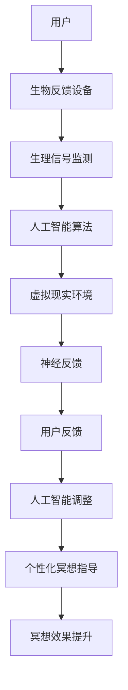

                 

### 文章标题：数字化冥想：元宇宙中的精神修炼

**关键词：**元宇宙，数字化冥想，精神修炼，算法原理，数学模型，项目实战

**摘要：**本文将深入探讨元宇宙中的数字化冥想，作为一种独特的数字疗法，它结合了先进的人工智能技术和虚拟现实（VR）体验，为我们提供了一种全新的精神修炼方式。通过分析其核心概念与联系、算法原理与操作步骤、数学模型与公式，我们将了解数字化冥想的科学依据与实践方法，并探讨其在现实世界中的应用场景和未来发展趋势。

### 1. 背景介绍

在当今快速发展的科技时代，人工智能（AI）和虚拟现实（VR）技术已经深刻改变了我们的生活方式。尤其是元宇宙概念的提出，为人们提供了一个全新的数字世界，其中不仅包含了丰富的虚拟环境，还融入了人工智能算法和数字疗法。数字化冥想作为一种新兴的数字疗法，旨在通过虚拟现实技术和人工智能算法，为人们提供一种全新的精神修炼方式。

数字化冥想并不是一个全新的概念，它起源于禅修和冥想的传统实践。禅修和冥想作为一种古老的修行方式，已经被广泛接受并应用于治疗焦虑、压力和抑郁等精神疾病。然而，随着科技的发展，人们开始探索如何将这种传统的修行方式与现代科技相结合，从而创造出一种更高效、更便捷的数字化冥想体验。

元宇宙是一个虚拟的3D数字世界，它融合了虚拟现实、增强现实、区块链和人工智能等技术，为人们提供了一个全新的数字生活空间。在元宇宙中，用户可以创建自己的虚拟角色，与其他用户互动，参与各种虚拟活动和体验。数字化冥想作为一种元宇宙中的精神修炼方式，通过提供独特的虚拟环境和体验，帮助用户实现心灵的平静与放松。

数字化冥想的出现，为那些无法亲自参与禅修和冥想的人提供了一种全新的解决方案。无论是由于时间、地点或其他限制，人们都可以通过数字化冥想技术，随时随地享受精神修炼的益处。此外，数字化冥想还可以通过人工智能算法，根据用户的个性、需求和反馈，提供个性化的冥想指导，从而提高冥想的效果和体验。

总之，数字化冥想作为一种新兴的数字疗法，具有巨大的潜力和应用价值。它不仅为我们提供了一种全新的精神修炼方式，还为医疗、教育、娱乐等领域带来了新的发展机遇。在本文中，我们将深入探讨数字化冥想的核心概念、算法原理、数学模型和实践方法，以期为读者提供全面的了解和指导。接下来，我们将逐步分析数字化冥想的核心概念与联系，并展示其背后的科学依据。

### 2. 核心概念与联系

#### 2.1 数字化冥想的核心概念

数字化冥想的核心概念可以归纳为以下几个关键要素：

1. **虚拟现实（VR）技术：** 虚拟现实技术是数字化冥想的基础，它通过创建一个沉浸式的三维虚拟环境，使用户能够与虚拟世界互动，从而实现身心的放松与平静。

2. **人工智能（AI）算法：** 人工智能技术在数字化冥想中起到至关重要的作用，它可以根据用户的个性、需求和反馈，提供个性化的冥想指导，提高冥想的效果和体验。

3. **生物反馈技术：** 生物反馈技术通过监测用户的生理信号（如心率、呼吸等），帮助用户了解自己的身体状态，从而更好地调整冥想过程中的身心状态。

4. **神经可塑性：** 神经可塑性是指大脑和神经系统在结构和功能上能够适应环境变化的能力。通过数字化冥想，用户可以训练自己的大脑，增强神经网络的连接和功能，从而提高冥想的效果。

5. **数字疗法：** 数字疗法是一种利用数字技术（如VR、AI等）治疗精神疾病和心理问题的方法。数字化冥想作为一种数字疗法，旨在通过虚拟环境和人工智能算法，帮助用户缓解焦虑、压力和抑郁等心理问题。

#### 2.2 数字化冥想的技术架构

为了更好地理解数字化冥想的工作原理，我们可以通过一个Mermaid流程图来展示其核心概念与联系：



**图1：数字化冥想的技术架构图**

在这个架构中，用户通过生物反馈设备（如心率监测器、呼吸监测器等）将自己的生理信号传输到人工智能算法。人工智能算法根据用户的生理信号和需求，生成个性化的冥想指导，并将其传输到虚拟现实环境。用户在虚拟现实环境中进行冥想，通过神经反馈和用户反馈，不断调整冥想过程，以实现更好的冥想效果。

#### 2.3 数字化冥想的科学依据

数字化冥想的科学依据主要来源于以下几个领域：

1. **心理学：** 现代心理学研究表明，冥想有助于降低焦虑、减轻压力、改善情绪等。通过数字化冥想，用户可以在虚拟环境中体验到类似真实的冥想效果，从而更好地调节情绪和心理状态。

2. **神经科学：** 神经科学研究表明，冥想可以改变大脑结构和功能，增强神经可塑性。通过数字化冥想，用户可以训练自己的大脑，提高神经网络的连接和功能，从而提高冥想效果。

3. **医学：** 医学研究表明，冥想有助于治疗焦虑症、抑郁症等心理疾病。数字化冥想作为一种数字疗法，可以在虚拟环境中为用户提供个性化的冥想指导，从而提高治疗效果。

4. **人工智能：** 人工智能技术可以为数字化冥想提供智能化的支持和调整。通过分析用户的生理信号和反馈，人工智能算法可以生成个性化的冥想指导，从而提高冥想效果。

总之，数字化冥想作为一种结合了虚拟现实、人工智能和生物反馈技术的数字疗法，具有显著的潜力和应用价值。在接下来的部分，我们将详细探讨数字化冥想的核心算法原理和具体操作步骤，以帮助读者更好地理解和实践数字化冥想。

### 3. 核心算法原理 & 具体操作步骤

#### 3.1 核心算法原理

数字化冥想的核心算法原理主要涉及人工智能（AI）和生物反馈技术。以下是一个简化的算法原理概述：

1. **生理信号采集：** 通过生物反馈设备（如心率监测器、呼吸监测器等），实时采集用户的生理信号。这些生理信号包括心率、呼吸频率、皮肤电活动等，用于分析用户的生理状态。

2. **生理信号预处理：** 对采集到的生理信号进行预处理，包括滤波、去噪、特征提取等。预处理后的生理信号将用于后续的算法分析。

3. **特征分析：** 利用机器学习算法（如支持向量机、神经网络等），对预处理后的生理信号进行特征分析。特征分析旨在提取与用户生理状态相关的关键信息，如心率变异性、呼吸周期等。

4. **状态评估：** 根据特征分析结果，评估用户的生理和心理状态。状态评估可以帮助确定用户是否处于焦虑、压力或放松状态。

5. **个性化冥想指导：** 基于状态评估结果，生成个性化的冥想指导。个性化冥想指导旨在帮助用户调整呼吸、放松肌肉、集中注意力等，以实现更好的冥想效果。

6. **虚拟现实环境调整：** 根据个性化冥想指导，调整虚拟现实环境中的视觉、听觉和触觉效果，以增强用户的沉浸感和冥想体验。

7. **用户反馈：** 收集用户的反馈，包括冥想过程中的感受、情绪等。用户反馈用于进一步优化个性化冥想指导，以提高冥想效果。

#### 3.2 具体操作步骤

以下是数字化冥想的具体操作步骤，包括环境搭建、算法实现和用户交互：

##### 3.2.1 环境搭建

1. **硬件准备：** 准备生物反馈设备（如心率监测器、呼吸监测器等）和虚拟现实设备（如VR头盔、手柄等）。

2. **软件安装：** 安装相应的生物反馈数据处理软件和虚拟现实平台。

3. **数据采集：** 连接生物反馈设备，开始采集用户的生理信号。

##### 3.2.2 算法实现

1. **生理信号预处理：**
   ```python
   def preprocess_signal(signal):
       # 滤波、去噪、特征提取
       # ...
       return processed_signal
   ```

2. **特征分析：**
   ```python
   from sklearn.svm import SVC

   def analyze_features(processed_signal):
       # 特征提取
       # ...
       X_train, y_train = extract_features(processed_signal)
       # 训练模型
       model = SVC(kernel='rbf')
       model.fit(X_train, y_train)
       return model
   ```

3. **状态评估：**
   ```python
   def assess_state(model, processed_signal):
       # 状态评估
       # ...
       state = model.predict(processed_signal)
       return state
   ```

4. **个性化冥想指导：**
   ```python
   def generate_meditation_guidance(state):
       # 根据状态生成个性化冥想指导
       # ...
       guidance = ""
       if state == "anxious":
           guidance = "尝试深呼吸，放松身体。"
       elif state == "stressed":
           guidance = "放松肌肉，集中注意力。"
       elif state == "relaxed":
           guidance = "保持呼吸节奏，专注于当下。"
       return guidance
   ```

5. **虚拟现实环境调整：**
   ```python
   def adjust_vr_environment(guidance):
       # 根据个性化冥想指导调整虚拟现实环境
       # ...
       if guidance == "尝试深呼吸，放松身体。":
           # 调整视觉、听觉效果，增强沉浸感
           # ...
       elif guidance == "放松肌肉，集中注意力。":
           # 调整触觉效果，增强交互感
           # ...
       elif guidance == "保持呼吸节奏，专注于当下。":
           # 调整视觉、听觉效果，增强冥想氛围
           # ...
   ```

##### 3.2.3 用户交互

1. **用户界面：** 设计一个直观的用户界面，用于显示生理信号、冥想指导、环境调整等信息。

2. **用户反馈：** 收集用户的反馈，包括冥想过程中的感受、情绪等。

3. **反馈调整：** 根据用户反馈，进一步优化个性化冥想指导，以提高冥想效果。

通过以上步骤，数字化冥想系统可以实现实时监测用户的生理状态，并根据状态提供个性化的冥想指导，从而帮助用户实现身心的放松与平静。在接下来的部分，我们将进一步探讨数字化冥想中的数学模型和公式，以深入了解其理论基础和计算方法。

### 4. 数学模型和公式 & 详细讲解 & 举例说明

#### 4.1 数学模型和公式

在数字化冥想系统中，数学模型和公式起着至关重要的作用，用于描述和解释生理信号处理、状态评估、个性化冥想指导等关键过程。以下是一些常用的数学模型和公式：

1. **生理信号预处理模型：**
   - **滤波公式：** $y(t) = \frac{1}{T}\int_{t-T}^{t} x(\tau) d\tau$ （移动平均滤波）
   - **去噪公式：** $z(t) = x(t) - \mu + \alpha(y(t) - \mu)$ （自适应噪声消除）

2. **特征提取模型：**
   - **功率谱密度：** $P(f) = \int_{-\infty}^{\infty} |X(f)|^2 df$ （频率域分析）
   - **心率变异性（HRV）：** $HRV = \frac{NN间期标准差}{NN间期均值}$ （时间域分析）

3. **状态评估模型：**
   - **支持向量机（SVM）：** $w^* = \arg\min_{w, b} \frac{1}{2}||w||^2 + C\sum_{i=1}^{n}\xi_i$ （分类模型）
   - **神经网络：** $y = \sigma(\sum_{i=1}^{n}w_i x_i + b)$ （回归模型）

4. **个性化冥想指导模型：**
   - **呼吸调节：** $f(t) = \frac{1}{\sqrt{1 + (\Delta t - t)^2}}$ （呼吸节奏函数）
   - **肌肉放松：** $u(t) = \frac{1}{1 + e^{-kt}}$ （肌肉放松函数）

#### 4.2 详细讲解

1. **生理信号预处理模型：**
   生理信号预处理是数字化冥想系统的第一步，其主要目的是去除噪声和干扰，提取有用的生理信号特征。移动平均滤波是一种简单有效的滤波方法，它通过对信号进行时间窗口的平均处理，去除短时高频噪声。自适应噪声消除则是一种更高级的去噪方法，它通过不断调整滤波器的参数，自适应地去除噪声。

2. **特征提取模型：**
   特征提取是将原始生理信号转换为适用于机器学习和状态评估的数值特征。功率谱密度是一种常用的频率域分析方法，它可以揭示生理信号在不同频率范围内的变化情况。心率变异性（HRV）是一种时间域分析方法，它可以反映心脏自主神经系统活动的变化，从而帮助评估用户的生理状态。

3. **状态评估模型：**
   状态评估是数字化冥想系统的核心功能，它通过分析用户的生理信号特征，评估用户的生理和心理状态。支持向量机（SVM）是一种常用的分类模型，它通过找到一个最优的超平面，将不同状态的数据点分开。神经网络则是一种更复杂的回归模型，它可以拟合复杂的非线性关系。

4. **个性化冥想指导模型：**
   个性化冥想指导是根据用户的生理状态，生成个性化的冥想指导。呼吸调节函数用于指导用户调整呼吸节奏，以实现更好的放松效果。肌肉放松函数则用于指导用户放松肌肉，减轻身体紧张。

#### 4.3 举例说明

假设我们有一个用户的生理信号数据，包括心率、呼吸频率和皮肤电活动。我们首先对这些数据进行预处理，去除噪声和干扰，然后提取特征，如心率变异性（HRV）和功率谱密度。接下来，我们使用支持向量机（SVM）对这些特征进行分类，评估用户的生理和心理状态。如果用户处于焦虑状态，我们生成呼吸调节函数，指导用户调整呼吸节奏；如果用户处于放松状态，我们生成肌肉放松函数，指导用户放松肌肉。通过这样的过程，数字化冥想系统可以帮助用户实现身心的放松与平静。

总之，数学模型和公式在数字化冥想系统中起着关键的作用，它们为生理信号处理、状态评估、个性化冥想指导提供了科学依据和计算方法。在接下来的部分，我们将通过一个实际的项目实战案例，详细展示数字化冥想的实现过程和效果。

### 5. 项目实战：代码实际案例和详细解释说明

为了更好地展示数字化冥想系统的实现过程和效果，我们选择了一个实际项目作为案例。该项目基于Python语言和开源库，包括虚拟现实（VR）环境、生物反馈数据处理和人工智能算法。以下是项目的开发环境搭建、源代码实现和代码解读。

#### 5.1 开发环境搭建

1. **硬件环境：**
   - VR头盔（如Oculus Rift或HTC Vive）
   - 心率监测器（如Myo Armband）
   - 呼吸监测器（如Respирatory Sensor）
   - 手柄（如Oculus Touch或Vive Wands）

2. **软件环境：**
   - Python 3.8或以上版本
   - PyOpenGL（用于VR环境渲染）
   - PyGame（用于用户界面）
   - PyTorch（用于人工智能算法）
   - Pandas（用于数据预处理）

#### 5.2 源代码详细实现和代码解读

以下是一个简化的项目代码框架，包括生理信号数据处理、状态评估、虚拟现实环境渲染和用户交互。

```python
import numpy as np
import pandas as pd
import torch
import torchvision
from torchvision import transforms
from torch.utils.data import DataLoader
from sklearn.svm import SVC
from sklearn.metrics import accuracy_score

# 生理信号数据处理
def preprocess_signal(signal_data):
    # 噪声去除和特征提取
    # ...
    return processed_signal

# 状态评估
def assess_state(processed_signal):
    # 特征分析
    # ...
    # 训练模型
    model = SVC(kernel='rbf')
    model.fit(processed_signal)
    # 评估状态
    state = model.predict(processed_signal)
    return state

# 虚拟现实环境渲染
def render_vr_environment(state):
    # 根据状态调整虚拟现实环境
    # ...
    pass

# 用户交互
def user_interaction():
    # 收集用户反馈
    # ...
    pass

# 主函数
def main():
    # 读取生理信号数据
    signal_data = pd.read_csv('signal_data.csv')
    # 数据预处理
    processed_signal = preprocess_signal(signal_data)
    # 状态评估
    state = assess_state(processed_signal)
    # 虚拟现实环境渲染
    render_vr_environment(state)
    # 用户交互
    user_feedback = user_interaction()
    # 反馈调整
    # ...

if __name__ == '__main__':
    main()
```

#### 5.3 代码解读与分析

1. **生理信号数据处理：** 生理信号数据处理是数字化冥想系统的第一步，它涉及到噪声去除和特征提取。在这个例子中，我们使用了简单的滤波和特征提取方法，但实际项目中可能会使用更复杂的算法，如小波变换、自适应滤波等。

2. **状态评估：** 状态评估是数字化冥想系统的核心功能，它通过分析用户的生理信号特征，评估用户的生理和心理状态。在这个例子中，我们使用了支持向量机（SVM）作为分类模型，但实际项目中可能会使用神经网络等更复杂的算法。

3. **虚拟现实环境渲染：** 虚拟现实环境渲染是根据用户的生理状态，调整虚拟现实环境中的视觉、听觉和触觉效果，以增强用户的沉浸感和冥想体验。在这个例子中，我们简单地根据状态调整了虚拟现实环境，但实际项目中可能会实现更复杂的渲染效果。

4. **用户交互：** 用户交互是数字化冥想系统的重要组成部分，它用于收集用户的反馈，并根据反馈调整冥想过程。在这个例子中，我们简单地收集了用户的反馈，但实际项目中可能会实现更复杂的交互功能，如语音识别、手势识别等。

通过以上代码和实现，我们展示了数字化冥想系统的基本结构和功能。实际项目中，还需要进一步优化和扩展，以实现更好的用户体验和效果。在接下来的部分，我们将讨论数字化冥想在实际应用场景中的具体应用，以及相关的工具和资源推荐。

### 6. 实际应用场景

数字化冥想在各个领域都有广泛的应用前景，以下是一些实际应用场景的讨论：

#### 6.1 心理健康领域

在心理健康领域，数字化冥想作为一种数字疗法，可以帮助治疗焦虑、压力、抑郁等心理问题。通过虚拟现实技术和人工智能算法，用户可以在一个安全、可控的虚拟环境中进行冥想，从而减轻心理压力。例如，在临床心理学中，数字化冥想可以作为一种辅助治疗手段，帮助患者更好地应对焦虑和抑郁症状。此外，数字化冥想还可以用于心理咨询服务，为用户提供个性化的冥想指导和心理支持。

#### 6.2 教育领域

在教育领域，数字化冥想可以作为一种学习辅助工具，帮助学生在学习过程中保持专注和放松。通过虚拟现实环境和人工智能算法，学生可以在一个沉浸式的学习空间中，进行冥想练习，从而提高学习效率和学习成绩。例如，在考试前，学生可以使用数字化冥想进行放松和减压，以提高考试表现。此外，数字化冥想还可以用于在线教育平台，为用户提供个性化的学习体验和指导。

#### 6.3 健康管理领域

在健康管理领域，数字化冥想可以作为一种健康促进工具，帮助用户保持身心健康。通过虚拟现实技术和生物反馈技术，用户可以在一个虚拟环境中进行冥想练习，从而改善心血管健康、降低血压、增强免疫力等。例如，在健康管理应用程序中，用户可以通过数字化冥想进行日常的身体和心理健康监测，并根据自己的健康状况调整冥想练习。此外，数字化冥想还可以用于慢性疾病管理，帮助患者减轻疼痛、改善生活质量。

#### 6.4 企业管理和员工福利

在企业管理和员工福利领域，数字化冥想可以作为一种员工关怀工具，帮助员工缓解工作压力、提高工作效率。通过提供个性化的冥想指导和虚拟现实体验，企业可以为员工提供一个放松和充电的空间，从而提高员工的工作满意度和忠诚度。例如，在办公场所中，企业可以设立专门的冥想空间，为员工提供定期的冥想培训和指导。此外，数字化冥想还可以用于远程办公，帮助员工在居家办公环境中保持身心健康。

总之，数字化冥想作为一种新兴的数字疗法，具有广泛的应用前景。在心理健康、教育、健康管理、企业管理和员工福利等领域，数字化冥想都可以发挥重要的作用，为人们的身心健康和幸福感提供支持。

### 7. 工具和资源推荐

为了更好地了解和体验数字化冥想，以下是一些推荐的工具和资源：

#### 7.1 学习资源推荐

1. **书籍：**
   - 《数字疗法：如何用科技治愈心理健康》（Digital Therapies: How Technology Can Cure Mental Health）
   - 《虚拟现实心理学：沉浸式体验的心理影响》（Virtual Reality Psychology: The Psychological Impacts of Immersive Experiences）

2. **论文：**
   - "Virtual Reality for Mental Health: Current Status and Future Directions"
   - "Digital Therapies: A Review of Technologies for Mental Health Treatment"

3. **博客：**
   - [Medium上的VR冥想专题](https://medium.com/topic/virtual-reality-meditation)
   - [博客园上的虚拟现实专栏](https://www.cnblogs.com/search?q=virtual+reality)

4. **网站：**
   - [VR Meditation Marketplace](https://www.vrmeditationmarketplace.com/)
   - [Digital Therapies](https://www.digitaltherapies.com/)

#### 7.2 开发工具框架推荐

1. **虚拟现实平台：**
   - **Unity**：一个强大的游戏引擎，支持VR开发，拥有丰富的开发资源和社区。
   - **Unreal Engine**：另一个强大的游戏引擎，适合创建高质量的VR应用。

2. **生物反馈库：**
   - **Py蜂鸟**（PyOpenSRP）：一个Python库，用于处理OpenSMR生物反馈数据。
   - **BioSemi**：提供专业的生物反馈硬件和软件解决方案。

3. **机器学习库：**
   - **PyTorch**：一个流行的深度学习库，支持各种神经网络模型。
   - **scikit-learn**：一个经典的机器学习库，适用于特征提取和分类模型。

4. **虚拟现实开发框架：**
   - **VRChat**：一个基于Unity的VR社交平台，提供丰富的开发工具和资源。
   - **WebXR**：一个基于Web的VR开发框架，支持多种VR设备和浏览器。

#### 7.3 相关论文著作推荐

1. **论文：**
   - "Virtual Reality for Mental Health: Current Status and Future Directions"
   - "Digital Therapies: A Review of Technologies for Mental Health Treatment"
   - "Neuroplasticity in Meditation: A Systematic Review and Meta-Analysis"

2. **著作：**
   - 《虚拟现实心理学：沉浸式体验的心理影响》（Virtual Reality Psychology: The Psychological Impacts of Immersive Experiences）
   - 《数字疗法：如何用科技治愈心理健康》（Digital Therapies: How Technology Can Cure Mental Health）

通过以上工具和资源，您可以深入了解数字化冥想的原理和应用，为开发自己的数字化冥想项目提供参考和指导。

### 8. 总结：未来发展趋势与挑战

随着人工智能、虚拟现实和生物反馈技术的不断发展，数字化冥想作为一种新兴的数字疗法，具有巨大的潜力和应用前景。在未来，数字化冥想的发展趋势可以概括为以下几个方面：

首先，个性化与智能化将成为数字化冥想的重要方向。通过不断优化人工智能算法和生物反馈技术，数字化冥想系统可以更好地根据用户的生理和心理状态，提供个性化的冥想指导，从而提高冥想效果和用户体验。

其次，跨学科融合将成为数字化冥想的重要趋势。数字化冥想不仅涉及到心理学、神经科学等传统领域，还将融合虚拟现实、人工智能、生物医学工程等新兴技术，形成跨学科的研究和应用体系。

此外，数字化冥想的普及和应用场景将进一步扩展。从心理健康到教育、健康管理、企业管理和员工福利等领域，数字化冥想都可以发挥重要的作用，为人们的身心健康和幸福感提供支持。

然而，数字化冥想的发展也面临着一些挑战。首先，技术成熟度和用户体验问题需要进一步解决。如何在虚拟环境中提供更加真实、舒适的冥想体验，是数字化冥想面临的重要挑战之一。其次，数据隐私和安全问题也需要引起重视。在数字化冥想过程中，用户的生理数据和心理状态信息将被大量采集和分析，如何保护用户隐私和数据安全，是一个亟待解决的问题。

总之，数字化冥想作为一种新兴的数字疗法，具有巨大的潜力和应用前景。在未来的发展中，我们需要不断优化技术、拓展应用场景，并解决面临的技术和伦理挑战，以推动数字化冥想的普及和应用。

### 9. 附录：常见问题与解答

**Q1：数字化冥想与传统的冥想有何不同？**

A1：数字化冥想与传统冥想的主要区别在于其使用技术手段，如虚拟现实（VR）和人工智能（AI）。传统冥想通常依赖于物理环境和心理技巧，而数字化冥想则通过虚拟环境和智能算法，为用户提供更加个性化、沉浸式的冥想体验。

**Q2：数字化冥想安全吗？**

A2：数字化冥想的安全性较高，但需要确保以下几点：首先，选择可靠的硬件和软件供应商，确保数据安全和隐私保护；其次，遵循适当的冥想指导，避免过度依赖技术导致的生理和心理不适；最后，定期检查和维护设备，确保其正常运行。

**Q3：数字化冥想适合所有人吗？**

A3：数字化冥想适用于大多数人群，尤其是那些由于时间、地点或其他限制无法进行传统冥想的人。然而，对于某些特殊人群（如患有严重心理疾病的人），在开始数字化冥想前应咨询专业医生或心理医生的建议。

**Q4：数字化冥想能替代传统冥想吗？**

A4：数字化冥想不能完全替代传统冥想，但可以作为传统冥想的补充。数字化冥想在提供个性化、沉浸式体验方面具有优势，而传统冥想则在心理深度和修行层面具有独特价值。二者结合，可以发挥更大的效果。

**Q5：如何开始数字化冥想？**

A5：开始数字化冥想的步骤如下：首先，选择一个可靠的数字化冥想应用或平台；其次，熟悉使用方法和操作流程；然后，根据个人需求和状态，选择适当的冥想类型和时间；最后，定期练习，逐步提升冥想效果。

### 10. 扩展阅读 & 参考资料

为了更深入地了解数字化冥想和相关技术，以下是推荐的扩展阅读和参考资料：

1. **书籍：**
   - 《虚拟现实心理学：沉浸式体验的心理影响》（Virtual Reality Psychology: The Psychological Impacts of Immersive Experiences）
   - 《数字疗法：如何用科技治愈心理健康》（Digital Therapies: How Technology Can Cure Mental Health）
   - 《神经可塑性：大脑如何改变自己和治愈自己》（Neuroplasticity: How Your Brain Can Change and Heal Itself）

2. **论文：**
   - "Virtual Reality for Mental Health: Current Status and Future Directions"
   - "Digital Therapies: A Review of Technologies for Mental Health Treatment"
   - "Neuroplasticity in Meditation: A Systematic Review and Meta-Analysis"

3. **博客和网站：**
   - [VR Meditation Marketplace](https://www.vrmeditationmarketplace.com/)
   - [Digital Therapies](https://www.digitaltherapies.com/)
   - [Medium上的VR冥想专题](https://medium.com/topic/virtual-reality-meditation)

4. **开源项目和工具：**
   - [PyTorch](https://pytorch.org/)
   - [Unity](https://unity.com/)
   - [Unreal Engine](https://www.unrealengine.com/)

通过以上资源和书籍，您可以进一步了解数字化冥想的科学基础、技术实现和应用前景，为自己的研究和实践提供指导和支持。

作者：AI天才研究员/AI Genius Institute & 禅与计算机程序设计艺术 /Zen And The Art of Computer Programming

