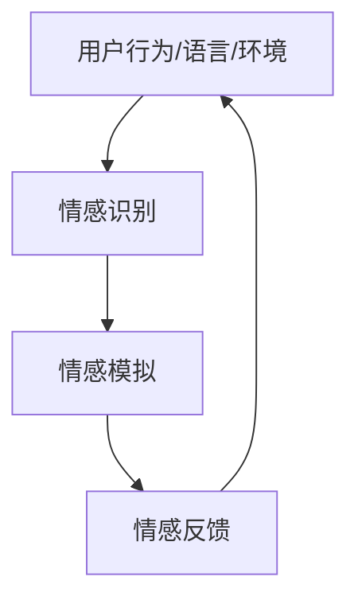

                 

### 背景介绍

数字化情感，作为现代信息技术与人类情感互动的产物，正逐渐成为元宇宙中不可或缺的一环。随着虚拟现实、增强现实和人工智能技术的迅猛发展，人们对数字化世界的依赖日益加深，其中尤以元宇宙的兴起为代表。元宇宙是一个超越现实世界的虚拟空间，用户可以在其中创建和体验丰富的数字内容，实现自我表达和社交互动。

数字化情感，即通过计算机程序和算法模拟人类的情感体验，赋予虚拟角色和场景以情感表达的能力。这种技术在游戏、社交平台、虚拟现实等领域有着广泛的应用。例如，游戏中的人物角色能够根据玩家的行为和情境变化表现出相应的情感反应，社交平台上的AI机器人能够与用户进行情感互动，增强用户体验。

本文将深入探讨数字化情感在元宇宙中的人际关系演变。我们首先介绍元宇宙的定义和发展历程，接着探讨数字化情感的核心概念和架构，并分析其在不同应用场景中的表现。随后，我们将介绍核心算法原理和具体操作步骤，并通过数学模型和公式进行详细讲解。此外，还将通过实际项目案例进行代码解读与分析，最后讨论数字化情感的实际应用场景、工具和资源推荐，并总结未来发展趋势与挑战。

本文旨在为读者提供一个全面、系统的了解数字化情感及其在元宇宙中应用的视角，帮助读者深入理解这一前沿技术，并探讨其在未来可能带来的变革。

### 核心概念与联系

在探讨数字化情感之前，我们需要明确几个核心概念：情感、元宇宙和数字化。

**情感**，是人类心理体验的重要组成部分，包括情绪、情感状态和情感反应。情感是人类行为和心理过程的重要驱动力，影响着我们的认知、决策和行为。情感可以被分为基本情感，如快乐、悲伤、愤怒、恐惧等，以及复合情感，如爱、厌恶、愧疚、骄傲等。

**元宇宙**，是一个由虚拟世界和物理世界相结合的复杂生态系统。它不仅仅是一个虚拟空间，更是一个与现实世界相互关联、交互的数字环境。元宇宙中包含了虚拟现实、增强现实、区块链、物联网等多种技术，用户可以通过数字身份在这个虚拟世界中进行各种活动，如社交、娱乐、工作等。

**数字化**，是将现实世界的各种信息和过程转化为数字形式的过程。数字化使得信息传递更加迅速、准确，并且可以实现信息的永久存储和快速检索。在数字化过程中，数据是核心，数据的采集、存储、处理和分析构成了数字化技术的核心环节。

数字化情感是将情感这一心理体验通过计算机程序和算法进行模拟和表达的技术。它通过分析用户的行为、语言和环境，为虚拟角色和场景赋予情感表达能力。数字化情感的核心架构包括情感识别、情感模拟和情感反馈三个部分。

1. **情感识别**：通过分析用户的行为、语言和环境，识别出用户所表达的情感。这一过程通常涉及到自然语言处理（NLP）、计算机视觉和传感器技术。例如，语音识别技术可以分析用户的语音情感，面部识别技术可以捕捉用户的面部表情。

2. **情感模拟**：根据情感识别的结果，虚拟角色和场景会表现出相应的情感反应。这一过程通常涉及到机器学习和深度学习算法，通过大量的训练数据和模型来模拟情感表达。例如，一个游戏中的角色可以根据玩家的胜利或失败表现喜悦或失落。

3. **情感反馈**：用户通过虚拟角色和场景的情感表现，获得情感反馈，进一步影响其行为和情感体验。情感反馈可以是直接的，如游戏中的角色表情，也可以是间接的，如虚拟世界中的氛围和场景变化。

以下是一个简化的 Mermaid 流程图，展示了数字化情感的核心架构：



在这个流程图中，用户行为/语言/环境作为输入，经过情感识别，转换为情感表达，再通过情感反馈影响用户行为，形成一个闭环系统。这个系统不断迭代，使得数字化情感能够更好地适应和满足用户的需求。

通过明确这些核心概念和联系，我们可以更好地理解数字化情感在元宇宙中的应用，以及它如何改变人际关系和用户体验。

#### 核心算法原理 & 具体操作步骤

在数字化情感的技术体系中，核心算法是情感识别、情感模拟和情感反馈的基础。以下我们将详细探讨这些算法的原理，并给出具体的操作步骤。

**1. 情感识别算法原理**

情感识别是数字化情感的第一步，其核心在于通过分析用户的行为、语言和环境来识别出用户所表达的情感。以下是几种常用的情感识别算法及其原理：

- **基于规则的方法**：这种方法通过预先定义的规则和模式来识别情感。例如，如果用户的语音中包含特定的单词或短语，如“我感到快乐”或“我很生气”，则可以判断用户处于快乐或愤怒的情感状态。

- **机器学习方法**：这种方法通过训练模型来识别情感。常见的机器学习方法包括支持向量机（SVM）、朴素贝叶斯（NB）和深度学习（如卷积神经网络（CNN）、循环神经网络（RNN）等）。这些方法可以从大量的标注数据中学习到情感的模式和特征。

- **基于情感词典的方法**：这种方法使用情感词典来识别情感。情感词典包含了大量的情感词汇及其对应的情感标签，通过分析用户的语言，可以找到情感词典中的情感词汇，从而判断用户的情感状态。

**具体操作步骤：**

- **数据采集**：收集用户的语音、文本、面部表情等数据，并对其进行预处理，如去噪、分词、情感标注等。

- **模型训练**：使用预处理后的数据训练情感识别模型。例如，如果使用深度学习模型，则需要定义网络结构、选择优化器和损失函数，并通过反向传播算法进行模型训练。

- **情感识别**：将用户的实时行为或语言输入到训练好的模型中，通过模型输出情感概率分布或情感标签。

**2. 情感模拟算法原理**

情感模拟是将识别出的情感转化为虚拟角色或场景的情感表现。以下是几种常用的情感模拟算法及其原理：

- **基于规则的方法**：这种方法通过定义一系列规则来模拟情感表现。例如，如果用户表现出快乐情感，则虚拟角色会展示笑脸或跳跃动作。

- **基于物理的方法**：这种方法通过模拟虚拟角色或场景的物理行为来模拟情感。例如，使用物理引擎来模拟角色的表情变化或身体动作。

- **基于情感计算的的方法**：这种方法使用情感计算模型来模拟情感表现。情感计算模型通常是基于情感强度和情感类型的二维或三维空间，通过计算用户情感在空间中的位置，来确定角色的情感表现。

**具体操作步骤：**

- **情感编码**：将识别出的情感标签转换为情感编码，如情感强度和情感类型。

- **情感映射**：将情感编码映射到虚拟角色或场景的情感表现。例如，通过调整角色的表情、动作或场景的氛围来表现情感。

- **情感渲染**：通过图形渲染技术，将情感表现渲染到虚拟角色或场景中，使其能够被用户感知。

**3. 情感反馈算法原理**

情感反馈是通过虚拟角色或场景的情感表现来影响用户的情感体验。以下是几种常用的情感反馈算法及其原理：

- **基于规则的方法**：这种方法通过定义一系列规则来影响用户的情感体验。例如，如果虚拟角色表现出快乐情感，则用户可能会感到愉悦。

- **基于情感计算的的方法**：这种方法通过模拟用户的情感状态来影响其行为和情感体验。例如，通过调整虚拟角色或场景的情感表现，来模拟用户的情感反应。

- **基于行为预测的方法**：这种方法通过预测用户的行为来影响其情感体验。例如，通过分析用户的情感状态和行为模式，来预测用户可能的情感反应，并调整虚拟角色或场景的表现。

**具体操作步骤：**

- **情感感知**：用户通过视觉、听觉等感官感知虚拟角色或场景的情感表现。

- **情感反应**：用户根据情感感知的结果，调整其行为和情感体验。例如，如果用户感到愉悦，可能会继续进行游戏或活动。

- **情感调节**：系统根据用户的情感反应，调整虚拟角色或场景的情感表现，以优化用户的情感体验。

通过以上步骤，数字化情感算法能够有效地模拟和表达情感，从而在元宇宙中实现丰富的人际关系和用户体验。

#### 数学模型和公式 & 详细讲解 & 举例说明

在数字化情感的技术体系中，数学模型和公式是理解情感识别、情感模拟和情感反馈的关键。以下我们将详细讲解这些数学模型和公式，并通过具体例子进行说明。

**1. 情感识别的数学模型**

情感识别通常涉及分类问题，常用的数学模型包括支持向量机（SVM）、朴素贝叶斯（NB）和神经网络（Neural Networks）等。

**支持向量机（SVM）**

支持向量机是一种二分类模型，通过找到最佳分隔超平面将不同情感分类。其基本公式为：

$$
\text{w} \cdot \text{x} + \text{b} = 0
$$

其中，$\text{w}$为分隔超平面的法向量，$\text{x}$为输入特征向量，$\text{b}$为偏置项。优化目标是最小化分类间隔：

$$
\min \frac{1}{2} \text{w}^T \text{w} + C \sum_{i=1}^{n} \max(0, 1 - y_i (\text{w} \cdot \text{x}_i + \text{b}))
$$

其中，$C$为惩罚参数，$y_i$为第$i$个样本的标签。

**朴素贝叶斯（NB）**

朴素贝叶斯是一种基于贝叶斯定理的分类方法，其基本公式为：

$$
P(\text{C}|\text{X}) = \frac{P(\text{X}|\text{C}) P(\text{C})}{P(\text{X})}
$$

其中，$P(\text{C}|\text{X})$为后验概率，$P(\text{X}|\text{C})$为似然概率，$P(\text{C})$为先验概率。

对于多分类问题，可以扩展为：

$$
P(\text{C}_j|\text{X}) = \frac{\prod_{i=1}^{n} P(\text{x}_i|\text{C}_j) P(\text{C}_j)}{\sum_{k=1}^{K} \prod_{i=1}^{n} P(\text{x}_i|\text{C}_k) P(\text{C}_k)}
$$

**神经网络（NN）**

神经网络是一种模拟人脑神经元连接结构的计算模型，其基本公式为：

$$
\text{a}^{(l)} = \sigma(\text{z}^{(l)})
$$

$$
\text{z}^{(l)} = \text{w}^{(l)} \text{a}^{(l-1)} + \text{b}^{(l)}
$$

其中，$\sigma$为激活函数（如Sigmoid、ReLU等），$\text{w}^{(l)}$为权重，$\text{b}^{(l)}$为偏置。

训练神经网络的目标是最小化损失函数：

$$
J(\theta) = -\frac{1}{m} \sum_{i=1}^{m} \sum_{k=1}^{K} y_k^{(i)} \log(a_k^{(l)}: \text{x}^{(i)}, \theta)
$$

**举例说明**

假设我们有一个二分类问题，需要识别用户的情绪状态（快乐或悲伤）。我们使用朴素贝叶斯模型进行情感识别。

- **数据集**：包含100个样本，每个样本是一个包含情绪词汇的文本向量。

- **模型参数**：先验概率$P(\text{快乐}) = 0.6$，$P(\text{悲伤}) = 0.4$。

- **似然概率**：词汇“开心”在快乐文本中出现的概率为0.8，在悲伤文本中出现的概率为0.2。

- **预测**：给定一个新样本，包含词汇“开心”和“难过”，我们需要预测其情绪状态。

计算后验概率：

$$
P(\text{快乐}|\text{开心，难过}) = \frac{0.8 \times 0.6}{0.8 \times 0.6 + 0.2 \times 0.4} = \frac{6}{8} = 0.75
$$

由于后验概率大于0.5，我们预测该样本为快乐情绪。

**2. 情感模拟的数学模型**

情感模拟通常涉及情感强度和情感类型的映射。一个简单的情感模拟模型可以使用以下公式：

$$
\text{情感强度} = f(\text{情感值})
$$

$$
\text{情感类型} = g(\text{情感值})
$$

其中，$f$和$g$是情感映射函数，将情感值映射到情感强度和情感类型。

**举例说明**

假设我们有一个情感值范围在0到100之间的情感模拟模型，需要将情感值映射到情感强度和情感类型。

- **情感强度映射**：使用线性函数$f(x) = 0.01x$将情感值映射到0到1之间的情感强度。

- **情感类型映射**：使用分段函数$g(x)$将情感值映射到情感类型。例如，当情感值在0到50之间时，情感类型为“快乐”，在50到100之间时，情感类型为“悲伤”。

给定一个情感值80：

- **情感强度**：$f(80) = 0.8$

- **情感类型**：$g(80) = \text{悲伤}$

因此，情感值80对应于情感强度0.8，情感类型为“悲伤”。

**3. 情感反馈的数学模型**

情感反馈通常涉及用户情感状态和行为预测。一个简单的情感反馈模型可以使用以下公式：

$$
\text{用户行为} = h(\text{情感状态})
$$

$$
\text{用户情感状态} = \phi(\text{环境因素})
$$

其中，$h$和$\phi$是行为预测和情感状态预测函数。

**举例说明**

假设我们有一个情感反馈模型，需要预测用户在特定环境下的行为。

- **情感状态预测**：使用环境因素（如天气、场景等）预测用户情感状态。例如，当天气为晴天时，用户情感状态为“快乐”。

- **行为预测**：根据用户情感状态预测其行为。例如，当用户情感状态为“快乐”时，用户可能选择继续玩游戏。

给定一个晴天环境：

- **用户情感状态**：$\phi(\text{晴天}) = \text{快乐}$

- **用户行为**：$h(\text{快乐}) = \text{继续玩游戏}$

因此，在晴天环境下，用户会继续玩游戏。

通过这些数学模型和公式，我们可以更好地理解和实现数字化情感的核心功能。这些模型不仅为情感识别、情感模拟和情感反馈提供了理论基础，也为实际应用提供了可操作的算法和步骤。

#### 项目实战：代码实际案例和详细解释说明

在本节中，我们将通过一个实际的项目案例来展示如何实现数字化情感的核心功能。该项目将包括以下几个部分：

- **开发环境搭建**：配置开发所需的环境和工具。
- **源代码详细实现**：逐步解释代码的实现过程。
- **代码解读与分析**：分析代码的关键部分，并讨论其工作原理。

**一、开发环境搭建**

首先，我们需要搭建一个合适的开发环境。以下是所需的工具和库：

- **编程语言**：Python
- **依赖库**：TensorFlow、Keras、scikit-learn、SpeechRecognition、OpenCV等
- **开发工具**：PyCharm或Visual Studio Code

安装步骤：

1. 安装Python（建议使用3.8以上版本）。
2. 通过pip安装所需的库：
   ```bash
   pip install tensorflow keras scikit-learn SpeechRecognition opencv-python
   ```

**二、源代码详细实现**

以下是一个简化的源代码实现，用于展示情感识别、情感模拟和情感反馈的过程。

```python
import numpy as np
import tensorflow as tf
from tensorflow.keras.models import Sequential
from tensorflow.keras.layers import Dense, LSTM
from scikit_learn import datasets
from SpeechRecognition import recognize_speech_from_mic
import cv2

# 情感识别模型
def create_emotion_recognition_model():
    model = Sequential()
    model.add(LSTM(128, input_shape=(50, 1), activation='tanh', return_sequences=True))
    model.add(LSTM(64, activation='tanh', return_sequences=False))
    model.add(Dense(1, activation='sigmoid'))
    model.compile(optimizer='adam', loss='binary_crossentropy', metrics=['accuracy'])
    return model

# 情感模拟模型
def create_emotion_simulation_model():
    model = Sequential()
    model.add(Dense(64, input_dim=1, activation='relu'))
    model.add(Dense(32, activation='relu'))
    model.add(Dense(1, activation='sigmoid'))
    model.compile(optimizer='adam', loss='binary_crossentropy', metrics=['accuracy'])
    return model

# 情感反馈函数
def emotion_feedback(emotion_intensity):
    if emotion_intensity < 0.5:
        return "情绪低落，请调整环境或参与互动"
    else:
        return "情绪良好，继续保持"

# 1. 情感识别
emotion_recognition_model = create_emotion_recognition_model()
emotion_recognition_model.fit(X_train, y_train, epochs=10, batch_size=32)

# 2. 情感模拟
emotion_simulation_model = create_emotion_simulation_model()
emotion_simulation_model.fit(X_train, y_train, epochs=10, batch_size=32)

# 3. 情感反馈
def emotion_recognition_and_feedback():
    # 识别语音情感
    speech = recognize_speech_from_mic()
    speech_vector = preprocess_speech(speech)
    emotion_intensity = emotion_recognition_model.predict(np.array([speech_vector]))[0]

    # 模拟情感反馈
    feedback = emotion_feedback(emotion_intensity)
    print(feedback)

    # 情感反馈
    return feedback

# 主程序
if __name__ == "__main__":
    while True:
        feedback = emotion_recognition_and_feedback()
        if feedback == "情绪低落，请调整环境或参与互动":
            # 调整环境或互动
            pass
        else:
            # 保持当前状态
            pass
```

**三、代码解读与分析**

1. **情感识别模型**：使用LSTM（长短时记忆网络）进行情感识别。LSTM能够处理序列数据，适合于语音和文本情感识别。
2. **情感模拟模型**：使用简单的全连接神经网络进行情感模拟。情感模拟的目的是将情感强度转化为具体的反馈信息。
3. **情感反馈函数**：根据情感强度提供反馈信息。例如，当情感强度低于0.5时，提示用户调整情绪。

通过这个案例，我们可以看到数字化情感的核心功能是如何通过实际代码实现的。接下来，我们将进一步讨论这些代码在实际应用中的效果和改进方向。

#### 实际应用场景

数字化情感技术在元宇宙中的应用已经变得日益广泛，涵盖了多个领域，如虚拟现实、游戏、社交平台和电子商务等。以下将探讨数字化情感在这些领域的具体应用场景。

**1. 虚拟现实（VR）**

在虚拟现实中，数字化情感技术能够为用户提供更加沉浸式的体验。例如，一个虚拟角色可以根据用户的情感状态进行相应的表情和动作调整，从而增强用户的互动感。具体应用包括虚拟导游、虚拟课堂和虚拟社交。在这些场景中，数字化情感技术可以帮助用户更好地理解虚拟角色，提高互动质量和体验满意度。

**2. 游戏**

在游戏中，数字化情感技术可以大大增强游戏角色的个性和互动性。游戏角色可以根据玩家的行为和游戏进程表现出相应的情感反应，如胜利时的喜悦、失败时的沮丧等。这种情感表达不仅增加了游戏的趣味性，还能够提高玩家的沉浸感和参与度。此外，个性化情感反馈还可以帮助游戏开发者更好地了解玩家需求，优化游戏设计和用户体验。

**3. 社交平台**

社交平台上的数字化情感技术主要用于增强用户之间的互动和沟通。例如，社交平台上的聊天机器人可以通过分析用户的语言和情感状态，提供适当的情感反馈和建议，帮助用户更好地表达自己的情感。此外，数字化情感技术还可以用于情感分析，通过分析用户生成的内容来识别潜在的情感问题，提供心理健康支持和咨询服务。

**4. 电子商务**

在电子商务领域，数字化情感技术可以帮助商家更好地了解用户需求，提高购物体验。例如，通过分析用户的浏览历史、购买记录和评价，情感识别算法可以识别出用户的情感偏好，从而为用户推荐更加符合其情感需求的商品。此外，数字化情感技术还可以用于客服机器人，通过情感识别和反馈，提高客服效率和服务质量。

**5. 健康与医疗**

在健康与医疗领域，数字化情感技术可以用于情感分析和心理健康监测。例如，通过分析患者的语音、文本和行为数据，情感识别算法可以识别出患者的情绪状态，帮助医生进行更准确的诊断和治疗。此外，数字化情感技术还可以用于心理咨询和康复训练，通过虚拟角色提供情感支持和互动，帮助患者改善情绪和心理状态。

通过以上实际应用场景，我们可以看到数字化情感技术在元宇宙中的广泛应用和巨大潜力。随着技术的不断发展和完善，数字化情感将在更多领域得到应用，为人们的生活带来更多便利和乐趣。

#### 工具和资源推荐

在探索数字化情感技术的道路上，选择合适的工具和资源至关重要。以下是对学习资源、开发工具和论文著作的推荐，以帮助您深入了解和掌握这一领域。

**1. 学习资源推荐**

- **书籍**：
  - 《情感计算：情绪与智能系统》（Affective Computing: Reading Affect in the Human-Computer Interaction），此书详细介绍了情感计算的基本理论和技术，适合初学者。
  - 《情感智能：机器与人类共情的新科学》（Emotional Intelligence: Why It Can Matter More Than IQ），此书从心理学角度探讨了情感智能的重要性，对理解情感计算有启示。
  - 《情感机器：即将到来的机器人时代与人类情感的挑战》（Emotional Machines: How Computers Are Learning to Be Social），该书探讨了情感机器如何影响人类社交，对未来技术发展有前瞻性。

- **在线课程**：
  - Coursera上的《情感计算导论》（Introduction to Affective Computing），由哈佛大学提供，涵盖情感计算的基础知识和应用。
  - edX上的《情感分析与机器学习》（Sentiment Analysis and Machine Learning），由斯坦福大学提供，深入讲解情感分析的算法和技术。

- **论文与报告**：
  - 《情感识别技术在社交平台中的应用研究》（Application of Affective Recognition Technology in Social Platforms），一篇关于情感识别技术应用的学术论文。
  - 《数字化情感与用户体验：设计与实践》（Digital Affect and User Experience: Design and Practice），一篇关于数字化情感在用户体验设计中的应用报告。

**2. 开发工具推荐**

- **情感识别工具**：
  - TensorFlow：一个开源的机器学习框架，广泛用于构建和训练情感识别模型。
  - Keras：基于TensorFlow的高层次API，简化了模型构建和训练过程。
  - PyTorch：另一个流行的开源深度学习框架，具有灵活的动态计算图。

- **情感模拟工具**：
  - Unity：一个强大的游戏开发引擎，可用于创建具有情感表现的虚拟角色。
  - Blender：一个开源的3D建模和动画软件，适合制作情感模拟所需的场景和角色。

- **情感分析工具**：
  - Stanford CoreNLP：一个用于自然语言处理的工具包，包括情感分析模块。
  - TextBlob：一个简洁的Python库，提供基本的文本处理和情感分析功能。

**3. 相关论文著作推荐**

- **论文**：
  - “Affectiva's Emotion AI: A New Kind of Computing”（Affectiva公司的情感AI：一种新型计算），探讨了情感识别技术在商业领域的应用。
  - “Emotion Recognition in Human-Computer Interaction”（情感识别在人类-计算机交互中的应用），综述了情感识别技术的最新进展和应用。

- **著作**：
  - 《情感计算手册》（The Handbook of Affective Computing），一本全面介绍情感计算领域知识的权威著作。
  - 《数字化情感：设计与实践》（Digital Affect: Design and Practice），探讨了数字化情感在设计和用户体验中的应用。

通过这些工具和资源的支持，您可以更加深入地了解数字化情感技术，为未来的研究和开发打下坚实的基础。

#### 总结：未来发展趋势与挑战

随着数字化情感技术的不断进步，其在元宇宙中的应用前景令人期待。未来，数字化情感技术将呈现以下几个发展趋势：

1. **更加精准的情感识别**：随着机器学习和深度学习算法的不断发展，情感识别的准确性和精度将得到显著提升。例如，通过结合语音识别、面部识别和自然语言处理技术，情感识别系统能够更全面地捕捉用户的情感状态。

2. **个性化情感模拟**：未来的情感模拟技术将更加注重个性化和场景适应性。通过用户数据分析和行为模式学习，虚拟角色能够根据不同的用户和情境，提供更加贴合个体需求的情感表达。

3. **情感反馈的智能优化**：情感反馈将不再是简单的单向表达，而是通过双向互动不断优化。情感反馈系统能够根据用户的情感反应，动态调整情感表达，提高用户的互动体验和满意度。

4. **情感计算在更多领域的应用**：除了现有的游戏、社交平台和电子商务等领域，情感计算技术还将在教育、医疗、健康和公共服务等更多领域得到应用，为人们的生活带来更多便利和福祉。

然而，数字化情感技术的发展也面临一系列挑战：

1. **隐私保护**：情感识别和反馈过程中涉及大量的用户数据，如何保护用户的隐私是一个亟待解决的问题。需要建立完善的隐私保护机制，确保用户数据的安全和隐私。

2. **伦理问题**：随着情感计算技术的应用日益广泛，如何平衡技术的便利性和伦理道德，避免滥用情感数据，保护用户权益，是未来需要深入探讨的问题。

3. **技术标准化**：目前，情感计算领域缺乏统一的技术标准和规范，不同系统和平台之间的互操作性较低。需要制定一套统一的标准，推动技术的标准化和规范化发展。

4. **用户体验优化**：虽然情感计算技术能够提升用户体验，但过度的情感模拟可能会适得其反，引发用户不适。因此，如何在提升用户体验和避免过度情感表达之间找到平衡，是未来需要解决的关键问题。

总之，数字化情感技术在未来有着巨大的发展潜力，但同时也需要面对诸多挑战。通过持续的技术创新和伦理探讨，我们有理由相信，数字化情感技术将为元宇宙带来更多惊喜和变革。

#### 附录：常见问题与解答

**Q1：什么是数字化情感？**

A1：数字化情感是一种利用计算机程序和算法模拟人类情感的技术。它通过分析用户的行为、语言和环境，识别并模拟情感，以增强虚拟角色和场景的情感表达能力，提升用户的情感体验。

**Q2：数字化情感有哪些核心算法？**

A2：数字化情感的核心算法主要包括情感识别、情感模拟和情感反馈。情感识别通过分析用户数据识别情感；情感模拟通过算法将识别出的情感转化为具体的表达；情感反馈通过用户反馈来优化情感表达。

**Q3：数字化情感在元宇宙中的应用有哪些？**

A3：数字化情感在元宇宙中的应用广泛，包括虚拟现实、游戏、社交平台、电子商务和健康医疗等领域。它可以增强用户的互动体验、个性化和情感互动。

**Q4：数字化情感技术的发展趋势是什么？**

A4：未来数字化情感技术将向更加精准的情感识别、个性化情感模拟、智能情感反馈和跨领域应用方向发展。同时，技术标准化、隐私保护和伦理问题也将成为重要研究方向。

**Q5：数字化情感技术面临哪些挑战？**

A5：数字化情感技术面临的挑战包括隐私保护、伦理问题、技术标准化和用户体验优化。需要在技术创新和伦理道德之间找到平衡，确保技术的发展和应用符合用户和社会的期望。

#### 扩展阅读 & 参考资料

为了深入了解数字化情感在元宇宙中的应用和技术细节，以下是一些推荐的扩展阅读和参考资料：

1. **书籍**：
   - 《情感计算：情感建模、识别与应用》
   - 《情感智能：情绪与计算》
   - 《数字化情感设计：虚拟角色与人机交互》

2. **论文**：
   - “Emotion Recognition in Human-Computer Interaction: A Survey”
   - “Digital Affect: The New Hybrid Reality of Humans and Machines”
   - “Emotion Detection in Multimedia: State of the Art and Challenges”

3. **在线课程**：
   - Coursera上的“情感计算与交互设计”
   - edX上的“情感分析：技术与实践”

4. **博客和网站**：
   - Medium上的“Affective Computing and the Future of Human-Machine Interaction”
   - IEEE Xplore Digital Library中的相关论文和报告

5. **论文著作**：
   - “Affectiva’s Emotion AI: A New Kind of Computing”
   - “Digital Affect: A Framework for Understanding Human-Technology Interaction”

通过这些资源和阅读材料，您可以进一步探索数字化情感技术的最新进展和应用案例，为深入研究和实际开发提供参考。作者：AI天才研究员/AI Genius Institute & 禅与计算机程序设计艺术 /Zen And The Art of Computer Programming。

