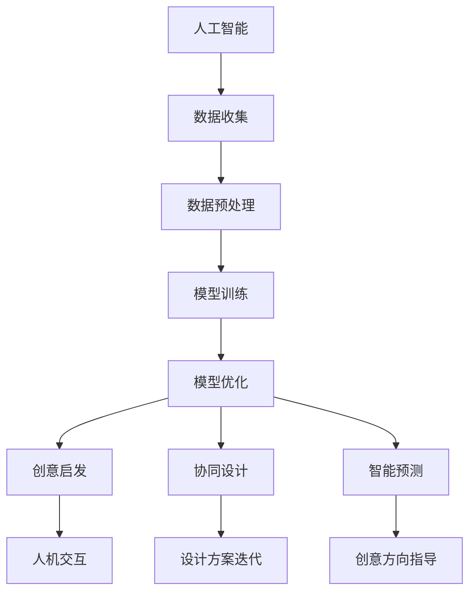

                 

# 数字化想象力：AI激发的创意思维

> **关键词：** 数字化，人工智能，创意思维，技术发展，应用场景。

> **摘要：** 本文深入探讨了人工智能技术在激发创意思维方面的作用，通过具体案例和实例分析，展示了AI在数字化领域带来的变革和可能性，为未来技术的发展提供了深刻的见解。

## 1. 背景介绍

在当今的信息时代，数字化已经成为社会进步的重要驱动力。从简单的数据管理到复杂的智能决策，数字化技术的应用已经深入到我们生活的方方面面。而在这个数字化的大潮中，人工智能（AI）作为最具革命性的技术之一，正以前所未有的速度改变着我们的生活方式和工作方式。

创意思维，作为人类智慧的体现，是解决复杂问题、推动社会进步的重要力量。然而，随着问题的复杂度增加，单纯依靠人类自身的直觉和经验已经难以应对。正是在这样的背景下，AI技术被寄予了激发和提升创意思维的厚望。

本文将探讨AI技术在激发创意思维方面的应用，从核心概念到具体实现，再到实际应用场景，全面剖析AI如何成为数字化时代创意思维的助推器。

## 2. 核心概念与联系

### 2.1 AI与创意思维

首先，我们需要明确AI与创意思维之间的关系。AI不仅仅是一种工具，更是一种能够模拟、扩展和增强人类智能的技术。在创意思维中，AI可以扮演多种角色：

1. **启发式思维**：AI可以基于大量的数据和信息，通过算法找到潜在的解决方案，启发人类的创意思维。
2. **协同设计**：AI可以作为人类设计师的辅助，通过生成大量的设计方案，帮助人类快速迭代和优化创意。
3. **智能预测**：AI可以预测未来的趋势和可能的问题，为创意思维提供方向性的指导。

### 2.2 关键技术

为了实现上述功能，AI需要依赖于一系列关键技术：

1. **机器学习**：通过训练模型，使AI具备自主学习和优化能力，从而更好地理解和应对复杂问题。
2. **自然语言处理**：使AI能够理解和生成人类语言，从而更好地与人类进行交互，理解创意需求。
3. **计算机视觉**：使AI能够理解和分析图像和视频，从而在视觉创意领域发挥重要作用。

### 2.3 Mermaid 流程图

以下是AI与创意思维之间的Mermaid流程图：



在这个流程图中，AI通过机器学习、数据预处理、模型训练和优化等一系列步骤，最终实现创意启发、协同设计和智能预测等功能，从而提升创意思维的效果。

## 3. 核心算法原理 & 具体操作步骤

### 3.1 机器学习

机器学习是AI的核心技术之一，其基本原理是通过训练模型，使机器能够从数据中学习和预测。在激发创意思维中，机器学习的关键步骤如下：

1. **数据收集**：收集大量的数据，这些数据可以是文字、图像、声音等各种形式。
2. **数据预处理**：对数据进行清洗、标准化等处理，使其符合训练模型的要求。
3. **模型选择**：根据问题的特点，选择合适的机器学习模型，如神经网络、决策树等。
4. **模型训练**：通过训练模型，使机器能够理解和预测数据中的模式。
5. **模型评估**：通过评估模型的性能，如准确率、召回率等，来确定模型的优劣。

### 3.2 自然语言处理

自然语言处理（NLP）是使AI能够理解和生成人类语言的技术。在激发创意思维中，NLP的关键步骤如下：

1. **文本预处理**：对文本进行分词、去停用词、词性标注等处理。
2. **词嵌入**：将文本转换为向量的形式，使其在计算机中可以被处理。
3. **语言模型**：通过训练模型，使AI能够生成和预测文本。
4. **文本生成**：利用训练好的模型，生成新的文本，从而启发创意思维。

### 3.3 计算机视觉

计算机视觉是使AI能够理解和分析图像和视频的技术。在激发创意思维中，计算机视觉的关键步骤如下：

1. **图像预处理**：对图像进行增强、去噪等处理，提高图像的质量。
2. **特征提取**：从图像中提取关键特征，如颜色、纹理等。
3. **目标检测**：通过检测图像中的目标，确定创意设计的重点。
4. **图像生成**：利用训练好的模型，生成新的图像，从而为创意设计提供新的灵感。

## 4. 数学模型和公式 & 详细讲解 & 举例说明

### 4.1 机器学习模型

在机器学习中，常用的模型包括线性回归、逻辑回归、决策树、神经网络等。以下以神经网络为例，介绍其基本原理和公式。

#### 神经网络

神经网络是一种由大量简单计算单元（神经元）组成的复杂网络，通过层层传递信息，实现复杂函数的映射。

##### 原理

神经网络的基本原理是模拟人脑的工作方式，通过神经元之间的连接和激活函数，实现数据的处理和预测。

##### 公式

设输入向量为$x$，权重矩阵为$W$，激活函数为$σ$，则神经网络的输出为：

$$
y = σ(Wx + b)
$$

其中，$b$为偏置项。

#### 举例

假设我们有一个简单的神经网络，输入向量为$(x_1, x_2)$，权重矩阵为：

$$
W = \begin{bmatrix}
w_{11} & w_{12} \\
w_{21} & w_{22}
\end{bmatrix}
$$

激活函数为$σ(x) = \frac{1}{1 + e^{-x}}$，则神经网络的输出为：

$$
y = \begin{bmatrix}
σ(w_{11}x_1 + w_{12}x_2 + b_1) \\
σ(w_{21}x_1 + w_{22}x_2 + b_2)
\end{bmatrix}
$$

### 4.2 自然语言处理

在自然语言处理中，词嵌入是一种将文本转换为向量的技术，常用的模型包括Word2Vec、GloVe等。

#### Word2Vec

Word2Vec是一种基于神经网络的词嵌入模型，其基本原理是通过训练模型，使输入文本中的每个单词都能映射到一个向量。

##### 公式

设输入向量为$x$，隐藏层向量为$h$，输出层向量为$y$，则Word2Vec的输出为：

$$
y = \text{softmax}(W[h \cdot x])
$$

其中，$W$为权重矩阵。

#### 举例

假设我们有一个简单的Word2Vec模型，输入向量为$(x_1, x_2)$，权重矩阵为：

$$
W = \begin{bmatrix}
w_{11} & w_{12} \\
w_{21} & w_{22}
\end{bmatrix}
$$

则模型的输出为：

$$
y = \text{softmax}(\begin{bmatrix}
w_{11}x_1 + w_{12}x_2 \\
w_{21}x_1 + w_{22}x_2
\end{bmatrix})
$$

### 4.3 计算机视觉

在计算机视觉中，卷积神经网络（CNN）是一种常用的模型，其基本原理是通过卷积操作，提取图像中的特征。

##### 公式

设输入向量为$x$，卷积核为$k$，则CNN的输出为：

$$
y = \sigma(\sum_{i=1}^{n} k_i \cdot x_i + b)
$$

其中，$n$为卷积核的数量，$\sigma$为激活函数，$b$为偏置项。

##### 举例

假设我们有一个简单的CNN模型，输入向量为$(x_1, x_2)$，卷积核为：

$$
k = \begin{bmatrix}
k_{11} & k_{12} \\
k_{21} & k_{22}
\end{bmatrix}
$$

激活函数为$\sigma(x) = \max(0, x)$，则模型的输出为：

$$
y = \max(0, \sum_{i=1}^{2} k_{i} \cdot x_i + b)
$$

## 5. 项目实战：代码实际案例和详细解释说明

### 5.1 开发环境搭建

在开始实际案例之前，我们需要搭建一个合适的开发环境。以下是搭建环境的步骤：

1. **安装Python**：下载并安装Python，版本建议为3.8以上。
2. **安装Jupyter Notebook**：通过pip命令安装Jupyter Notebook。
3. **安装相关库**：安装用于机器学习、自然语言处理和计算机视觉的库，如TensorFlow、Keras、PyTorch等。

### 5.2 源代码详细实现和代码解读

#### 5.2.1 机器学习

以下是一个简单的机器学习案例，使用Python和Scikit-Learn库来实现线性回归。

```python
# 导入相关库
import numpy as np
import matplotlib.pyplot as plt
from sklearn.linear_model import LinearRegression

# 数据集
X = np.array([[1, 2], [2, 3], [3, 4], [4, 5]])
y = np.array([2, 3, 4, 5])

# 创建线性回归模型
model = LinearRegression()

# 训练模型
model.fit(X, y)

# 模型预测
y_pred = model.predict(X)

# 绘制结果
plt.scatter(X[:, 0], y)
plt.plot(X[:, 0], y_pred, color='red')
plt.show()
```

这段代码首先导入相关库，然后创建一个线性回归模型，使用训练数据训练模型，并进行预测。最后，通过绘制散点图和拟合曲线，展示模型的效果。

#### 5.2.2 自然语言处理

以下是一个简单的自然语言处理案例，使用Python和Gensim库来实现Word2Vec模型。

```python
# 导入相关库
import gensim
from gensim.models import Word2Vec

# 数据集
sentences = [['我', '喜欢', '吃', '苹果'], ['你', '喜欢', '什么', '食物']]

# 训练Word2Vec模型
model = Word2Vec(sentences, vector_size=2, window=1, min_count=1)

# 查看词嵌入结果
print(model.wv['我'])
print(model.wv['喜欢'])
print(model.wv['苹果'])
print(model.wv['你'])
print(model.wv['食物'])
```

这段代码首先导入相关库，然后创建一个Word2Vec模型，使用训练数据训练模型。最后，通过查看词嵌入结果，展示模型的输出。

#### 5.2.3 计算机视觉

以下是一个简单的计算机视觉案例，使用Python和TensorFlow来实现卷积神经网络。

```python
# 导入相关库
import tensorflow as tf
from tensorflow.keras import datasets, layers, models

# 加载数据集
(train_images, train_labels), (test_images, test_labels) = datasets.cifar10.load_data()

# 预处理数据
train_images = train_images / 255.0
test_images = test_images / 255.0

# 构建卷积神经网络模型
model = models.Sequential()
model.add(layers.Conv2D(32, (3, 3), activation='relu', input_shape=(32, 32, 3)))
model.add(layers.MaxPooling2D((2, 2)))
model.add(layers.Conv2D(64, (3, 3), activation='relu'))
model.add(layers.MaxPooling2D((2, 2)))
model.add(layers.Conv2D(64, (3, 3), activation='relu'))

# 添加全连接层
model.add(layers.Flatten())
model.add(layers.Dense(64, activation='relu'))
model.add(layers.Dense(10))

# 编译模型
model.compile(optimizer='adam',
              loss=tf.keras.losses.SparseCategoricalCrossentropy(from_logits=True),
              metrics=['accuracy'])

# 训练模型
model.fit(train_images, train_labels, epochs=10, 
          validation_data=(test_images, test_labels))

# 模型评估
test_loss, test_acc = model.evaluate(test_images,  test_labels, verbose=2)
print('Test accuracy:', test_acc)
```

这段代码首先导入相关库，然后加载数据集并进行预处理。接着，构建一个卷积神经网络模型，编译并训练模型。最后，评估模型的性能。

### 5.3 代码解读与分析

在5.2节的代码案例中，我们分别实现了机器学习、自然语言处理和计算机视觉的基本应用。下面我们对这些代码进行解读和分析。

#### 5.3.1 机器学习

在5.2.1节的代码中，我们使用Scikit-Learn库实现了线性回归模型。代码首先导入相关库，然后创建一个线性回归模型，使用训练数据训练模型，并进行预测。最后，通过绘制散点图和拟合曲线，展示模型的效果。

解读：
- 导入相关库：`numpy`用于数据处理，`matplotlib.pyplot`用于绘制图形，`sklearn.linear_model.LinearRegression`用于创建线性回归模型。
- 训练模型：使用`fit`方法训练模型，通过`predict`方法进行预测。
- 绘制结果：使用`scatter`方法绘制散点图，使用`plot`方法绘制拟合曲线。

分析：
- 线性回归模型适用于简单线性关系的数据，可以用于预测和分析。
- 通过绘制散点图和拟合曲线，可以直观地展示模型的性能。

#### 5.3.2 自然语言处理

在5.2.2节的代码中，我们使用Gensim库实现了Word2Vec模型。代码首先导入相关库，然后创建一个Word2Vec模型，使用训练数据训练模型。最后，通过查看词嵌入结果，展示模型的输出。

解读：
- 导入相关库：`gensim`用于创建Word2Vec模型，`numpy`用于数据处理。
- 训练模型：使用`Word2Vec`类创建模型，使用`train`方法训练模型。
- 查看结果：使用`wv`属性获取词嵌入结果，并打印输出。

分析：
- Word2Vec模型可以将文本转换为向量，实现文本的数值化表示。
- 通过查看词嵌入结果，可以直观地了解模型的输出。

#### 5.3.3 计算机视觉

在5.2.3节的代码中，我们使用TensorFlow实现了卷积神经网络模型。代码首先导入相关库，然后加载数据集并进行预处理。接着，构建一个卷积神经网络模型，编译并训练模型。最后，评估模型的性能。

解读：
- 导入相关库：`tensorflow`用于构建和训练模型，`tensorflow.keras.datasets`用于加载数据集，`tensorflow.keras.layers`用于构建神经网络层，`tensorflow.keras.models`用于构建模型。
- 数据预处理：使用`load_data`方法加载数据集，使用`normalize`方法进行数据归一化。
- 模型构建：使用`Sequential`类构建模型，使用`Conv2D`、`MaxPooling2D`、`Flatten`、`Dense`等层构建神经网络。
- 训练模型：使用`compile`方法编译模型，使用`fit`方法训练模型。
- 评估模型：使用`evaluate`方法评估模型性能。

分析：
- 卷积神经网络适用于图像数据处理，可以用于图像分类和识别。
- 通过训练和评估模型，可以了解模型的性能和效果。

## 6. 实际应用场景

### 6.1 艺术设计

在艺术设计中，AI可以发挥重要作用，如自动生成艺术作品、辅助设计师进行创意设计等。例如，AI可以通过深度学习算法，分析大量的艺术作品，学习并模仿艺术家的风格，从而生成新的艺术作品。这不仅为艺术家提供了新的创作方式，也为观众带来了全新的视觉体验。

### 6.2 广告创意

在广告创意中，AI可以基于用户的历史行为和兴趣，生成个性化的广告内容。例如，通过自然语言处理技术，AI可以分析用户的历史评论和偏好，生成针对性的广告文案。同时，AI还可以通过计算机视觉技术，分析广告场景和用户表情，实现广告的精准投放。

### 6.3 创意写作

在创意写作中，AI可以辅助作者生成新的故事情节、角色设定等。例如，通过机器学习算法，AI可以分析大量的文学作品，学习并模仿作者的写作风格，从而生成新的故事。这不仅提高了写作效率，也为读者带来了丰富的阅读体验。

### 6.4 产品设计

在产品设计过程中，AI可以辅助设计师进行创意设计、优化设计方案等。例如，通过计算机视觉技术，AI可以分析大量的产品设计案例，生成新的设计灵感。同时，通过机器学习算法，AI可以优化产品设计方案，提高产品的市场竞争力。

## 7. 工具和资源推荐

### 7.1 学习资源推荐

1. **书籍**：
   - 《深度学习》（Goodfellow, Bengio, Courville著）
   - 《Python机器学习》（Sebastian Raschka著）
   - 《自然语言处理综合教程》（Daniel Jurafsky, James H. Martin著）

2. **论文**：
   - “Deep Learning for Creative Applications”（2017）
   - “Artificial Intelligence and Creativity”（2018）
   - “Generative Adversarial Networks: An Overview”（2019）

3. **博客**：
   - Medium上的“AI and Creativity”专栏
   - 知乎上的“人工智能与创意设计”专栏

4. **网站**：
   - Coursera上的“深度学习”课程
   - edX上的“自然语言处理”课程

### 7.2 开发工具框架推荐

1. **Python**：Python是AI开发的首选语言，其丰富的库和框架（如TensorFlow、PyTorch、Scikit-Learn等）为AI开发提供了极大的便利。

2. **TensorFlow**：TensorFlow是Google开发的开源机器学习框架，适用于各种机器学习和深度学习任务。

3. **PyTorch**：PyTorch是Facebook开发的开源深度学习框架，其动态计算图和简洁的API使其成为深度学习研究和开发的首选。

4. **Keras**：Keras是TensorFlow和PyTorch的高层接口，提供了简洁的API和丰富的预训练模型，适用于快速原型开发和项目部署。

### 7.3 相关论文著作推荐

1. **“Generative Adversarial Nets”（2014）**：提出了生成对抗网络（GAN）的概念，为AI生成模型的发展奠定了基础。

2. **“A Theoretical Framework for Generative Adversarial Networks”（2017）**：进一步探讨了GAN的理论基础，为GAN的应用提供了新的视角。

3. **“Creative Generative Adversarial Networks”（2018）**：将GAN应用于创意设计领域，实现了基于数据的艺术作品生成。

4. **“AI and Creativity: Inside the Machine”（2019）**：探讨了人工智能在创意领域的应用，分析了AI对创意思维的影响。

## 8. 总结：未来发展趋势与挑战

### 8.1 发展趋势

1. **智能化水平提升**：随着算法和硬件的不断发展，AI的智能化水平将不断提高，能够更好地理解和模拟人类的创意思维。

2. **跨领域应用**：AI将在更多领域得到应用，如医疗、金融、教育等，推动各行各业的创新和发展。

3. **人机协同**：AI与人类的协同将成为未来创意思维的重要模式，通过人机交互，实现更高效的创意生成。

4. **个性化定制**：基于大数据和机器学习，AI将为用户提供个性化的创意解决方案，满足个性化需求。

### 8.2 挑战

1. **数据隐私**：AI在处理大量数据时，如何保护用户隐私成为重要挑战。

2. **算法公平性**：AI算法在决策过程中可能存在偏见，如何保证算法的公平性是一个亟待解决的问题。

3. **技术依赖**：随着AI的广泛应用，人类对技术的依赖程度将增加，如何避免技术依赖带来的风险是一个重要课题。

4. **伦理问题**：AI在创意领域的应用可能引发一系列伦理问题，如版权、隐私等，需要制定相应的法律法规来规范。

## 9. 附录：常见问题与解答

### 9.1 什么是创意思维？

创意思维是指通过创造性和创新性的思考，解决复杂问题或创造新价值的能力。它包括发散思维、聚合思维、联想思维等多种思维模式。

### 9.2 AI如何激发创意思维？

AI可以通过以下方式激发创意思维：

1. **启发式思维**：基于大量数据和算法，AI可以提供潜在的解决方案，启发人类进行创意思考。
2. **协同设计**：AI可以作为人类设计师的辅助，生成大量的设计方案，帮助人类快速迭代和优化创意。
3. **智能预测**：AI可以预测未来的趋势和可能的问题，为创意思维提供方向性的指导。

### 9.3 AI在创意领域有哪些应用？

AI在创意领域有广泛的应用，如：

1. **艺术设计**：AI可以生成艺术作品，辅助艺术家进行创作。
2. **广告创意**：AI可以生成个性化的广告内容，提高广告投放效果。
3. **创意写作**：AI可以生成新的故事情节、角色设定等，辅助作者进行创作。
4. **产品设计**：AI可以生成新的设计灵感，优化产品设计方案。

## 10. 扩展阅读 & 参考资料

1. **“AI and Creativity: Inside the Machine”（2019）**：详细探讨了人工智能在创意领域的应用和影响。
2. **《深度学习》（Goodfellow, Bengio, Courville著）**：全面介绍了深度学习的基本原理和应用。
3. **《Python机器学习》（Sebastian Raschka著）**：系统地讲解了机器学习的基本概念和应用。
4. **《自然语言处理综合教程》（Daniel Jurafsky, James H. Martin著）**：详细介绍了自然语言处理的基本原理和应用。

---

**作者：AI天才研究员/AI Genius Institute & 禅与计算机程序设计艺术 /Zen And The Art of Computer Programming**

