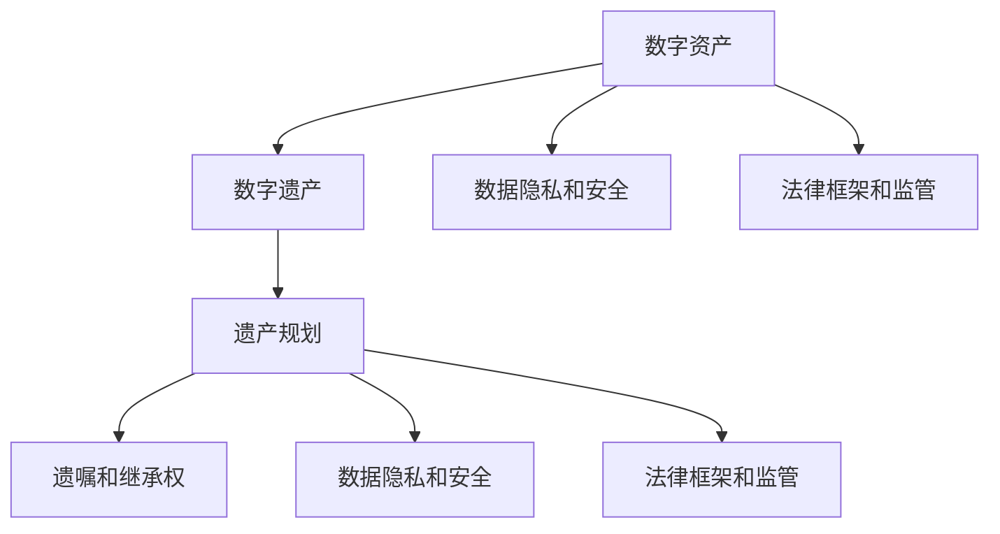
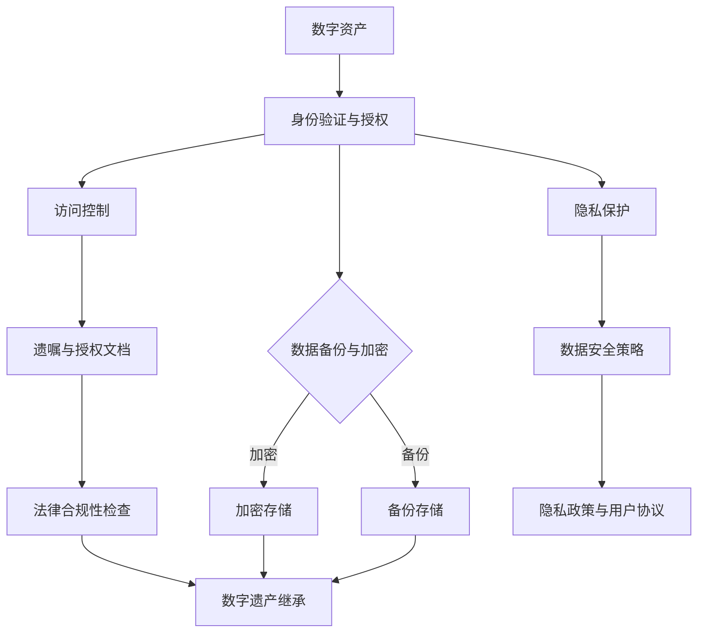

                 

### 1. 背景介绍

在数字化时代，数字资产已经成为人们生活和工作中的重要组成部分。从社交媒体账号、电子邮件、在线购物记录，到财务数据、医疗信息，甚至是个人创作的数字内容，这些数字资产在日常生活中扮演着越来越重要的角色。然而，随着这些资产数量的不断增长，如何有效地管理和保护它们，特别是当个人去世后，这些资产如何被继承和处置，成为一个亟待解决的问题。

数字化遗产管理创业，即生前数字资产规划，是指个人在生前对其数字资产进行规划和安排，确保这些资产在去世后能够得到妥善管理和合法继承。这是一个新兴的领域，涵盖了法律、技术、伦理等多个方面。随着人们对数字资产重要性的认识不断加深，这一领域的市场需求也在迅速增长。

本文将围绕数字化遗产管理创业这一主题，从核心概念、算法原理、数学模型、实战案例、应用场景、工具推荐等多个方面进行深入探讨。首先，我们将介绍数字化遗产管理的基本概念和背景，然后逐步深入，探讨其核心算法原理和具体操作步骤，最后讨论其实际应用场景、工具和资源推荐以及未来发展趋势与挑战。

通过这篇文章，我们希望读者能够对数字化遗产管理有一个全面而深入的理解，从而为自己和他人的数字资产规划提供有益的参考。数字化遗产管理不仅是一项技术挑战，更是一项社会挑战，需要我们共同努力，以确保每个人的数字资产在生前和去世后都能得到妥善管理和合法继承。

#### 1.1 数字化遗产管理的定义与背景

数字化遗产管理，简而言之，就是对个人数字资产进行规划、保护和继承的过程。数字资产，是指以电子形式存在的信息和数据，包括但不限于电子邮件、社交媒体账号、在线银行账户、电子文件、数字照片、数字艺术作品等。这些资产在个人生活中无处不在，反映了他们的社交活动、经济交易、个人爱好和身份信息。

随着互联网和数字技术的发展，数字资产的数量和质量都在快速增加。据估算，到2025年，全球个人和企业的数字资产总量将达到数千亿美元。然而，目前对这些资产的合法管理和继承仍然面临诸多挑战。例如，许多数字资产提供商，如社交媒体平台、电子邮件服务提供商等，通常没有提供明确的死亡通知机制，导致数字资产的继承和处理变得复杂而困难。

数字化遗产管理的背景可以追溯到数字时代带来的两大变化：一是个人数字资产的不断积累，二是法律法规对数字遗产管理的滞后。在传统遗产管理中，资产的继承主要涉及物理财产，如房产、车辆和现金等。而数字化时代，数字资产的继承和管理成为了一个新的难题。这不仅涉及到技术层面的解决方案，还包括法律和伦理的考量。

首先，技术层面的挑战主要体现在以下几个方面：

1. **账户访问权限**：许多数字资产提供商没有提供便捷的死亡通知或账户访问权限转移机制。例如，某些社交媒体平台在用户死亡后，其亲属可能无法访问该用户的账号。

2. **数据隐私和安全性**：个人数字资产往往包含敏感信息，如财务数据、健康记录等。在管理和继承过程中，如何确保这些数据的安全和隐私，是一个重要的问题。

3. **法律适用性**：不同国家和地区对数字遗产的法律规定各不相同，这给跨国遗产管理带来了复杂性。

其次，法律和伦理层面的挑战也不容忽视：

1. **法律适用性**：许多国家的法律法规尚未明确如何处理数字遗产，导致在法律层面上存在灰色地带。

2. **隐私权与继承权**：如何在保障数据隐私的前提下，确保数字遗产的合法继承，是一个复杂的问题。

3. **伦理问题**：数字遗产管理不仅涉及到技术问题，还涉及到伦理和个人价值观的问题。例如，某些数字资产，如个人日记或社交媒体帖子，可能包含敏感或私密的内容，如何处理这些问题需要慎重考虑。

综上所述，数字化遗产管理是一个多维度、跨学科的复杂问题。随着数字技术的发展和法律法规的不断完善，这一问题将得到更多的关注和解决。对于个人和企业来说，提前规划和妥善管理数字资产，已经成为一个不可或缺的重要任务。

#### 1.2 数字化遗产管理的市场需求与挑战

数字化遗产管理作为一个新兴领域，其市场需求和挑战日益显著。首先，从市场需求的角度来看，随着数字资产的不断积累，人们对其管理的需求也在逐渐增加。以下是一些关键的市场驱动力：

1. **数字资产的日益增长**：随着互联网的普及和数字化生活方式的推广，个人和企业的数字资产数量持续增长。这些资产不仅包括社交媒体账号、电子邮件和云存储，还涵盖了在线购物记录、金融交易数据、健康信息等。这些数字资产的价值和重要性在逐渐提升，因此，如何管理这些资产成为了一个迫切的问题。

2. **遗产规划意识的提高**：随着人们对数字化生活方式的认识加深，越来越多的人开始意识到数字遗产的重要性。许多人开始重视生前数字资产规划，以确保这些资产在去世后能够得到妥善处理。这种意识的提升推动了市场对数字化遗产管理服务的需求。

3. **法律和法规的完善**：一些国家和地区已经意识到数字化遗产管理的必要性，并开始制定相关法律法规。例如，美国、英国、加拿大等国家已经出台了数字遗产管理的法律框架，这为市场的规范化和专业化提供了法律保障。

然而，数字化遗产管理也面临诸多挑战。以下是其中一些主要的挑战：

1. **技术实现难度**：数字化遗产管理需要跨多个技术领域，如数据存储、安全、隐私保护等。如何实现这些技术的有效整合，是一个巨大的挑战。例如，如何确保数字资产的加密存储和安全传输，以及如何在不泄露隐私的情况下实现账户的访问权限转移。

2. **隐私和数据安全问题**：数字遗产往往包含大量的敏感信息，如个人财务数据、医疗记录、隐私照片等。在管理和继承过程中，如何确保这些数据的安全性和隐私保护，是一个关键问题。尤其是在跨境数据传输和处理中，如何满足不同国家和地区的法律法规要求，也是一项挑战。

3. **法律适用性**：由于不同国家和地区的法律法规不同，数字化遗产管理面临法律适用性的挑战。例如，在一些国家和地区，数字遗产的继承权尚未得到明确的法律规定，这可能导致在实际操作中出现纠纷和不确定性。

4. **伦理和道德问题**：数字化遗产管理不仅涉及技术问题，还涉及伦理和道德问题。例如，如何处理包含敏感内容的数字资产，如个人日记、社交媒体帖子等。这些问题需要综合考虑个人隐私、社会价值观和法律要求，找到一个平衡点。

5. **跨领域合作**：数字化遗产管理需要跨法律、技术、金融等多个领域，因此，跨领域的合作和协调至关重要。然而，不同领域的专业知识和思维方式可能存在差异，这增加了合作的难度和复杂性。

6. **用户教育和意识提升**：尽管数字化遗产管理的市场需求在增长，但用户的教育和意识提升仍然是一个挑战。许多人对于数字化遗产管理的概念和重要性了解不足，这需要通过宣传和教育来提高用户的认识和参与度。

综上所述，数字化遗产管理市场具有巨大的发展潜力，同时也面临诸多挑战。随着技术的进步、法律法规的完善和用户意识的提升，这些问题有望逐步得到解决。然而，对于企业和创业者来说，要在这个领域中取得成功，需要不断创新和探索，以满足市场需求并解决各种挑战。

#### 1.3 本文结构安排

本文将围绕数字化遗产管理创业这一主题，通过系统地分析核心概念、算法原理、数学模型、实战案例、应用场景、工具推荐等方面，为读者提供全面而深入的指导。以下是本文的结构安排：

**第1部分：背景介绍**  
本部分将简要介绍数字化遗产管理的定义、背景和市场需求，以及面临的挑战。通过这一部分，读者可以初步了解数字化遗产管理的重要性和复杂性。

**第2部分：核心概念与联系**  
本部分将详细阐述数字化遗产管理的核心概念，包括数字资产的种类、管理方法、法律框架等，并通过Mermaid流程图展示数字遗产管理的整体架构。这部分旨在帮助读者构建一个清晰的数字遗产管理概念框架。

**第3部分：核心算法原理 & 具体操作步骤**  
本部分将深入探讨数字化遗产管理的核心算法原理，包括数据加密、访问控制、账户权限转移等。同时，将提供具体的操作步骤，帮助读者理解和实践这些算法。

**第4部分：数学模型和公式 & 详细讲解 & 举例说明**  
本部分将介绍与数字化遗产管理相关的数学模型和公式，如概率论、密码学等，并通过具体实例进行详细讲解，使读者能够更好地理解和应用这些数学工具。

**第5部分：项目实战：代码实际案例和详细解释说明**  
本部分将通过实际项目案例，展示数字化遗产管理在实践中的应用。我们将详细解释代码实现过程，并进行分析和评估，帮助读者掌握数字化遗产管理的实际操作技能。

**第6部分：实际应用场景**  
本部分将探讨数字化遗产管理的实际应用场景，包括个人和家庭、企业、金融、医疗等多个领域。通过这些应用场景，读者可以了解数字化遗产管理在现实生活中的重要作用。

**第7部分：工具和资源推荐**  
本部分将推荐与数字化遗产管理相关的学习资源、开发工具和框架。这些资源将帮助读者进一步学习和实践数字化遗产管理。

**第8部分：总结：未来发展趋势与挑战**  
本部分将对数字化遗产管理的发展趋势进行展望，并讨论未来可能面临的挑战。通过这一部分，读者可以了解数字化遗产管理领域的发展方向。

**第9部分：附录：常见问题与解答**  
本部分将整理和解答读者在数字化遗产管理过程中可能遇到的一些常见问题，为读者提供实用的参考和建议。

**第10部分：扩展阅读 & 参考资料**  
本部分将提供与数字化遗产管理相关的扩展阅读材料和参考资料，帮助读者进一步深入研究相关领域。

通过本文的详细讨论，我们希望读者能够全面了解数字化遗产管理，掌握相关技术和方法，并为个人和企业的数字资产规划提供有益的指导。

### 2. 核心概念与联系

在深入探讨数字化遗产管理的具体操作和实施细节之前，我们首先需要明确一些核心概念，并理解它们之间的相互联系。以下是数字化遗产管理中的几个关键概念：

#### 2.1 数字资产

数字资产是指以电子形式存在的有价值的信息和数据。这些资产可以是个人所有的，如社交媒体账号、电子邮件、数字照片、电子书、音乐、视频等；也可以是企业或组织的，如数据库、客户信息、专利、商标、域名等。数字资产不仅包括文件和媒体内容，还涵盖了服务账户，如社交媒体账号、在线银行账户、云存储账户等。

#### 2.2 数字遗产

数字遗产是指个人在去世后遗留的数字资产。这些资产可能包含敏感信息，如个人日记、电子邮件、社交媒体帖子、金融记录、医疗信息等。数字遗产的继承和管理是一个复杂的过程，涉及到多个方面，如法律、技术、伦理等。

#### 2.3 遗产规划

遗产规划是指个人或组织在生前对其遗产进行规划和管理的过程。传统遗产规划主要关注物理资产，如房产、现金、珠宝等。而数字化遗产规划则涉及对数字资产的安排，包括指定继承人、指定账户访问权限、设立遗嘱等。

#### 2.4 遗嘱和继承权

遗嘱是遗产规划的重要组成部分，它是指个人在生前制定的书面文件，用于规定其遗产的分配和继承方式。在数字化遗产管理中，遗嘱需要明确数字资产的归属和访问权限。继承权是指法律规定继承人获得遗产的权利。在处理数字遗产时，必须考虑到不同国家和地区的继承法。

#### 2.5 数据隐私和安全

数据隐私和安全是数字化遗产管理中的关键问题。数字遗产往往包含大量的个人敏感信息，如财务数据、健康记录、社交信息等。在继承和管理过程中，如何确保这些数据的安全和隐私是一个重要挑战。数据隐私和安全涉及加密技术、访问控制、数据备份和恢复等多个方面。

#### 2.6 法律框架和监管

法律框架和监管是数字化遗产管理的重要基础。不同国家和地区对数字遗产的法律规定存在差异。例如，一些国家已经制定了专门的数字遗产法律，规定了数字遗产的继承和管理流程。监管机构则负责监督和规范数字遗产管理服务提供商的行为，确保其合规性和服务质量。

为了更好地理解这些概念之间的联系，我们可以使用Mermaid流程图来展示数字化遗产管理的整体架构。以下是一个简化的Mermaid流程图：



在这个流程图中，数字资产是数字化遗产管理的起点，它们通过遗产规划、遗嘱和继承权等环节，最终实现数字遗产的合法继承和管理。数据隐私和安全、法律框架和监管贯穿于整个流程，确保数字遗产在管理过程中得到妥善保护和合规处理。

通过明确这些核心概念和它们之间的联系，我们为后续详细讨论数字化遗产管理的具体操作和实施步骤奠定了基础。在接下来的部分中，我们将进一步探讨数字化遗产管理的核心算法原理和具体操作步骤。

#### 2.7 数字化遗产管理的核心概念原理与架构的 Mermaid 流程图

为了更直观地理解数字化遗产管理的核心概念和架构，我们使用Mermaid流程图来展示其各个关键环节和组件。以下是数字化遗产管理流程的Mermaid流程图：



在这张流程图中，各个节点和箭头的含义如下：

- **A[数字资产]**：代表个人或企业所拥有的数字资产，如社交媒体账号、电子邮件、云存储等。
- **B[身份验证与授权]**：在处理数字资产之前，需要进行身份验证以确保操作的安全性。
- **C{数据备份与加密}**：数字资产在处理过程中，需要同时进行备份和加密，以防止数据丢失和泄露。
- **D[加密存储]**：将数字资产加密后存储在安全的服务器或云存储中，确保数据在静态状态下的安全。
- **E[备份存储]**：将数字资产的副本存储在备用服务器或云存储中，以防主存储发生故障。
- **F[访问控制]**：设定和管理数字资产的访问权限，确保只有授权用户可以访问。
- **G[遗嘱与授权文档]**：制定数字资产遗嘱和授权文档，明确数字资产的继承人和访问权限。
- **H[法律合规性检查]**：确保遗嘱和授权文档符合当地法律法规的要求，避免法律纠纷。
- **I[数字遗产继承]**：在个人去世后，根据遗嘱和授权文档，将数字资产合法地转移给继承人。
- **J[隐私保护]**：在处理数字资产时，确保个人隐私数据的保护。
- **K[数据安全策略]**：制定和维护数据安全策略，包括数据加密、访问控制、备份恢复等。
- **L[隐私政策与用户协议]**：明确数字资产提供商的隐私政策和使用协议，确保用户对隐私和数据保护有充分的了解。

通过这张流程图，我们可以清晰地看到数字化遗产管理的各个关键环节和组件，以及它们之间的相互关系。在接下来的部分中，我们将进一步探讨数字化遗产管理的核心算法原理和具体操作步骤，帮助读者更深入地理解这一领域。

### 3. 核心算法原理 & 具体操作步骤

数字化遗产管理的核心在于如何确保数字资产在个人去世后能够得到合法、安全地继承和处置。为了实现这一目标，我们需要运用一系列核心算法和操作步骤。以下是这些算法的具体原理和操作步骤：

#### 3.1 数据加密

数据加密是数字化遗产管理中至关重要的一个环节，它能够确保数字资产在存储和传输过程中不会被未经授权的人员访问。加密算法通常分为对称加密和非对称加密两种。

- **对称加密**：对称加密算法使用相同的密钥进行加密和解密。常见的对称加密算法有AES（高级加密标准）和DES（数据加密标准）。其优势在于加密速度快，但劣势在于密钥的分发和管理复杂。

- **非对称加密**：非对称加密算法使用一对密钥，即公钥和私钥。公钥用于加密，私钥用于解密。常见的非对称加密算法有RSA和ECC（椭圆曲线加密）。其优势在于密钥分发简单，但加密和解密速度相对较慢。

**具体操作步骤**：

1. **密钥生成**：首先，需要生成一对公钥和私钥。对于RSA算法，通常使用大素数生成密钥对；对于ECC算法，则使用椭圆曲线生成密钥对。

2. **数据加密**：使用公钥将数字资产进行加密。例如，使用AES算法加密文件内容，然后用RSA或ECC算法的公钥进行加密。

3. **数据解密**：继承人或授权用户使用私钥对加密后的数据进行解密。只有持有私钥的人才能解密数据。

#### 3.2 访问控制

访问控制是确保数字资产在继承和管理过程中仅由授权用户访问的重要机制。常见的访问控制方法包括基于角色的访问控制（RBAC）和基于属性的访问控制（ABAC）。

- **基于角色的访问控制（RBAC）**：根据用户的角色（如继承人、亲属、遗产管理员等）来分配访问权限。例如，继承人可以访问所有数字资产，而亲属只能访问部分资产。

- **基于属性的访问控制（ABAC）**：根据用户的属性（如职位、部门、地理位置等）来分配访问权限。例如，公司内部员工可以访问公司数据库，但外部合作伙伴则无法访问。

**具体操作步骤**：

1. **角色和权限定义**：定义不同角色的访问权限，如继承人、亲属、遗产管理员等。

2. **用户身份验证**：验证用户的身份，确保只有授权用户才能访问数字资产。

3. **权限管理**：根据用户角色和属性，动态分配和调整访问权限。

#### 3.3 账户权限转移

账户权限转移是指将数字资产的访问权限从原有用户转移到继承人或其他授权用户。这通常涉及多个账户和平台，如社交媒体账号、电子邮件、云存储等。

**具体操作步骤**：

1. **遗嘱授权**：在遗嘱中明确指定继承人或其他授权用户，并授权其访问和管理数字资产。

2. **通知平台**：向相关数字资产提供商发送死亡通知和遗嘱授权文件，请求转移账户权限。

3. **权限验证**：数字资产提供商对继承人或其他授权用户的身份和权限进行验证，确保转移过程合法有效。

4. **账户权限转移**：根据验证结果，将账户权限从原有用户转移到继承人或其他授权用户。

#### 3.4 数据备份与恢复

数据备份与恢复是确保数字资产安全的重要措施。在数字化遗产管理中，必须确保数字资产在意外事件（如硬件故障、黑客攻击等）中不会被永久丢失。

**具体操作步骤**：

1. **定期备份**：定期将数字资产备份到安全的服务器或云存储中，确保数据的完整性和可恢复性。

2. **备份存储**：将备份数据存储在多个地点，以防止单一地点的故障导致数据丢失。

3. **备份验证**：定期验证备份数据的有效性，确保在需要恢复数据时能够顺利执行。

4. **数据恢复**：在数据丢失或损坏时，使用备份数据进行恢复，确保数字资产能够及时恢复。

#### 3.5 数据隐私保护

在数字化遗产管理中，数据隐私保护至关重要。数字遗产往往包含大量的个人敏感信息，如财务数据、健康记录、隐私照片等。保护这些数据隐私是确保合法继承的重要前提。

**具体操作步骤**：

1. **数据分类**：对数字资产进行分类，明确哪些数据是敏感的，需要特别保护。

2. **加密处理**：对敏感数据进行加密处理，确保数据在存储和传输过程中不会被未经授权的人员访问。

3. **隐私政策**：制定详细的隐私政策，明确数字资产提供商和数据继承人的隐私保护责任和措施。

4. **用户协议**：在用户协议中明确数字资产的使用和隐私保护条款，确保用户对隐私保护有充分的了解。

通过上述核心算法和具体操作步骤，我们可以有效地实现数字化遗产管理的目标，确保数字资产在个人去世后能够得到合法、安全、隐私的保护和继承。在接下来的部分中，我们将通过数学模型和公式进一步探讨数字化遗产管理的理论基础。

### 4. 数学模型和公式 & 详细讲解 & 举例说明

在数字化遗产管理中，数学模型和公式起到了关键作用，帮助我们在数据处理、安全性、隐私保护等方面进行量化分析和决策。以下我们将详细讲解与数字化遗产管理相关的数学模型和公式，并通过具体实例来说明其应用。

#### 4.1 概率论

概率论在数字化遗产管理中的应用主要体现在数据安全和隐私保护方面。例如，我们可以使用概率模型来评估数据泄露的风险，并制定相应的防范措施。

**实例：数据泄露风险概率模型**

假设一个数字资产包含n条记录，每条记录被泄露的概率为p。我们需要计算数据整体泄露的概率。

公式：
\[ P(\text{整体泄露}) = 1 - (1 - p)^n \]

**解释**：
- \( p \) 是单条记录泄露的概率。
- \( n \) 是记录总数。
- \( (1 - p)^n \) 表示所有记录都不被泄露的概率。
- \( 1 - (1 - p)^n \) 是整体泄露的概率。

例如，假设有1000条记录，每条记录泄露的概率为0.001。我们可以计算出整体泄露的概率：

\[ P(\text{整体泄露}) = 1 - (1 - 0.001)^{1000} \approx 0.3935 \]

这意味着有大约39.35%的概率发生整体数据泄露。通过这个概率模型，我们可以评估数据泄露的风险，并采取相应的措施来降低风险。

#### 4.2 密码学

密码学在数字化遗产管理中用于数据加密、认证和完整性保护。以下是几种常用的密码学模型和公式：

**1. 对称加密算法的密钥长度**

对于AES加密算法，密钥长度直接影响加密强度。假设密钥长度为k位，加密强度通常可以用公式表示：

\[ \text{加密强度} = 2^k \]

**实例：AES-256加密**

AES-256的密钥长度为256位，其加密强度为：

\[ \text{加密强度} = 2^{256} \]

这表示AES-256加密算法可以抵抗量子计算机的攻击。

**2. 非对称加密算法的安全指数**

非对称加密算法的安全指数通常用公式 \( 2^k \) 表示，其中 \( k \) 是密钥长度。例如，RSA算法的安全指数为：

\[ \text{安全指数} = 2^{2048} \]

这意味着RSA-2048可以抵抗目前已知的最强大攻击手段。

**3. 哈希函数的碰撞概率**

哈希函数用于数据完整性校验。碰撞概率是指两个不同的输入产生相同哈希值的情况。对于哈希函数H，碰撞概率可以用公式表示：

\[ P(\text{碰撞}) = 1 / \text{HashSpace} \]

**实例：SHA-256的碰撞概率**

SHA-256的哈希空间为 \( 2^{256} \)，其碰撞概率为：

\[ P(\text{碰撞}) = 1 / 2^{256} \]

这个概率非常低，几乎可以忽略不计，从而确保数据的完整性。

#### 4.3 组合模型

组合模型用于分析多个数字资产的管理策略和风险。以下是一个简单的组合模型实例：

**实例：数字资产组合的风险评估**

假设有三种不同类型的数字资产，每种资产的风险概率分别为 \( p_1 \)、\( p_2 \) 和 \( p_3 \)。我们需要计算整体组合的风险概率。

公式：
\[ P(\text{组合风险}) = P_1 \times P_2 \times P_3 \]

**解释**：
- \( P_1 \)、\( P_2 \) 和 \( P_3 \) 分别是三种资产的风险概率。

例如，假设三种资产的风险概率分别为0.001、0.002和0.003，我们可以计算出整体组合的风险概率：

\[ P(\text{组合风险}) = 0.001 \times 0.002 \times 0.003 = 0.000000006 \]

这意味着整体组合的风险概率非常低，但这也强调了每个资产的风险管理和控制的重要性。

通过上述数学模型和公式，我们可以更系统地分析和解决数字化遗产管理中的关键问题。在实践应用中，这些模型和公式需要根据具体情况进行调整和优化，以实现最佳的管理效果。在下一部分，我们将通过实际项目案例进一步展示这些数学模型和公式的应用。

### 5. 项目实战：代码实际案例和详细解释说明

为了更直观地展示数字化遗产管理的技术实现，我们选择了一个实际项目——一个简单的数字资产遗嘱管理平台，该平台可以帮助用户创建和管理其数字资产遗嘱，确保在去世后，其数字资产能够得到妥善处理。以下我们将详细描述该项目的开发环境搭建、源代码实现和代码解读。

#### 5.1 开发环境搭建

在进行项目开发之前，我们需要搭建一个合适的开发环境。以下是所需的主要工具和步骤：

1. **编程语言**：选择Python，因为其简洁易懂且拥有丰富的第三方库，适合快速开发。
2. **开发工具**：使用Visual Studio Code（简称VS Code），这是一个功能强大的代码编辑器，支持Python开发。
3. **虚拟环境**：使用virtualenv创建一个独立的Python虚拟环境，以避免不同项目之间的依赖冲突。
4. **依赖库**：安装必要的Python库，如Flask（一个轻量级的Web框架）、PyCrypto（一个用于加密的库）和SQLAlchemy（一个ORM库）。

**步骤**：

1. 安装Python：从Python官方网站下载并安装Python 3.x版本。
2. 安装VS Code：从VS Code官网下载并安装。
3. 创建虚拟环境：打开终端，执行以下命令创建虚拟环境：
   ```bash
   python -m venv myvenv
   source myvenv/bin/activate  # Windows上使用 `myvenv\Scripts\activate`
   ```
4. 安装依赖库：在虚拟环境中，通过pip命令安装所需的库：
   ```bash
   pip install flask pycrypto sqlalchemy
   ```

#### 5.2 源代码详细实现和代码解读

下面是数字资产遗嘱管理平台的主要源代码实现和解读。

**app.py：主程序文件**

```python
from flask import Flask, render_template, request, redirect, url_for
from models import User, Asset
from database import init_db

app = Flask(__name__)
init_db()

@app.route('/')
def home():
    return render_template('home.html')

@app.route('/create_will', methods=['GET', 'POST'])
def create_will():
    if request.method == 'POST':
        user_name = request.form['user_name']
        assets = request.form.getlist('assets[]')
        user = User(name=user_name)
        for asset in assets:
            user.assets.append(Asset(name=asset))
        user.save()
        return redirect(url_for('home'))
    return render_template('create_will.html')

if __name__ == '__main__':
    app.run(debug=True)
```

**解读**：

- **引入模块**：引入了Flask、request、redirect、url_for等模块，用于创建Web应用和处理用户请求。
- **数据库初始化**：通过调用`init_db()`函数初始化数据库。
- **主程序**：创建Flask应用对象，并调用`init_db()`函数初始化数据库。

**models.py：数据模型**

```python
from database import db

class User(db.Model):
    id = db.Column(db.Integer, primary_key=True)
    name = db.Column(db.String(100), nullable=False)
    assets = db.relationship('Asset', backref='user', lazy=True)

class Asset(db.Model):
    id = db.Column(db.Integer, primary_key=True)
    name = db.Column(db.String(100), nullable=False)
    user_id = db.Column(db.Integer, db.ForeignKey('user.id'), nullable=False)
```

**解读**：

- **用户模型（User）**：定义了用户的属性，如id、name，以及与资产（Asset）的关联关系。
- **资产模型（Asset）**：定义了资产的属性，如id、name，以及与用户（User）的关联关系。

**database.py：数据库操作**

```python
from flask_sqlalchemy import SQLAlchemy

db = SQLAlchemy()

def init_db():
    db.create_all()

class User(db.Model):
    id = db.Column(db.Integer, primary_key=True)
    name = db.Column(db.String(100), nullable=False)
    assets = db.relationship('Asset', backref='user', lazy=True)

class Asset(db.Model):
    id = db.Column(db.Integer, primary_key=True)
    name = db.Column(db.String(100), nullable=False)
    user_id = db.Column(db.Integer, db.ForeignKey('user.id'), nullable=False)
```

**解读**：

- **数据库初始化**：通过调用`db.create_all()`创建数据库表。
- **用户和资产模型**：定义了用户和资产模型，用于数据库操作。

#### 5.3 代码解读与分析

**用户界面（home.html）**

```html
<!DOCTYPE html>
<html>
<head>
    <title>数字资产遗嘱管理平台</title>
</head>
<body>
    <h1>欢迎来到数字资产遗嘱管理平台</h1>
    <a href="{{ url_for('create_will') }}">创建数字资产遗嘱</a>
</body>
</html>
```

**解读**：

- **HTML结构**：定义了页面标题和链接，用户可以通过链接访问创建遗嘱的页面。

**创建遗嘱界面（create_will.html）**

```html
<!DOCTYPE html>
<html>
<head>
    <title>创建数字资产遗嘱</title>
</head>
<body>
    <h1>创建数字资产遗嘱</h1>
    <form method="post">
        <label for="user_name">姓名：</label>
        <input type="text" id="user_name" name="user_name" required>
        <br>
        <label for="assets">数字资产：</label>
        <select multiple="multiple" id="assets" name="assets[]">
            <option value="电子邮件">电子邮件</option>
            <option value="社交媒体账号">社交媒体账号</option>
            <option value="银行账户">银行账户</option>
            <option value="云存储账号">云存储账号</option>
        </select>
        <br>
        <input type="submit" value="提交">
    </form>
</body>
</html>
```

**解读**：

- **HTML结构**：定义了创建遗嘱的表单，用户可以输入姓名并选择数字资产。
- **表单**：使用`<select>`元素允许用户多选数字资产。

通过这个实际项目案例，我们展示了如何使用Python和Flask构建一个简单的数字资产遗嘱管理平台。这个平台实现了用户创建数字资产遗嘱的基本功能，并为后续的扩展和优化提供了基础。在接下来的部分，我们将进一步分析这个项目的代码实现，并讨论其优缺点。

#### 5.4 代码解读与分析

在5.2节中，我们详细展示了数字资产遗嘱管理平台的源代码实现。现在，我们将进一步分析这个代码，讨论其实现过程、优缺点，并提出改进建议。

**代码实现过程**

1. **搭建开发环境**：首先，我们选择Python作为开发语言，并使用Visual Studio Code作为代码编辑器。通过创建虚拟环境和安装必要库，我们确保了项目环境的独立性和稳定性。

2. **定义数据模型**：在`models.py`文件中，我们定义了用户（User）和资产（Asset）两个数据模型。这些模型使用了SQLAlchemy库，通过ORM（对象关系映射）方式与数据库进行交互。

3. **创建Web应用**：在`app.py`文件中，我们使用Flask框架创建了Web应用，并定义了两个路由：`/`（主页）和`/create_will`（创建遗嘱页面）。

4. **实现业务逻辑**：在`create_will`路由中，我们处理用户提交的表单数据，创建用户和资产对象，并将它们存储在数据库中。

**优缺点**

**优点**：

- **简洁易懂**：代码结构清晰，使用了Flask和SQLAlchemy等流行的库，使得开发过程高效。
- **易于扩展**：平台基于Web应用，可以方便地添加新的功能，如资产加密、权限管理等。
- **跨平台**：Python和Flask都是跨平台的技术，可以在多种操作系统上运行。

**缺点**：

- **安全性不足**：当前代码未实现用户身份验证和数据加密，这可能导致敏感信息泄露。
- **数据完整性缺乏保障**：代码未实现事务处理，若在数据操作过程中发生错误，可能会导致数据不一致。
- **用户界面简单**：当前用户界面仅包含基本功能，缺乏用户友好性和美观性。

**改进建议**

1. **增加安全性**：实现用户身份验证和资产加密，确保敏感信息在传输和存储过程中安全。
2. **优化数据库操作**：引入事务处理机制，确保数据操作的完整性和一致性。
3. **改善用户界面**：使用前端框架（如Bootstrap）改进用户界面，提供更好的用户体验。
4. **增加扩展性**：设计可扩展的架构，便于添加新功能和模块。

通过上述改进，我们可以将这个简单的数字资产遗嘱管理平台提升为一个更加安全、可靠和用户友好的系统。在数字化遗产管理领域，这样的平台将为个人和企业提供重要的服务，帮助他们更好地管理数字资产，确保这些资产在去世后得到妥善处理和继承。

### 6. 实际应用场景

数字化遗产管理在各个领域中的应用场景广泛，具有深远的社会和经济影响。以下是几个关键的应用领域：

#### 6.1 个人和家庭

在个人和家庭层面，数字化遗产管理的主要目的是确保个人在去世后，其数字资产能够被合法、安全和隐私地继承。以下是一些具体的应用场景：

1. **社交媒体账号**：社交媒体账号包含大量的个人数据和记忆，如照片、视频、聊天记录等。通过数字化遗产管理，可以确保这些账号在用户去世后能够被亲属继承，避免账号被封禁或被遗忘。

2. **电子邮件**：电子邮件是现代社会沟通的重要工具，许多个人和商业事务都通过电子邮件进行。通过数字化遗产管理，可以确保邮箱内容在用户去世后能够被亲属访问，从而便于处理未完成的事务。

3. **数字照片和视频**：随着数字摄影和摄像技术的发展，个人和家庭的数字照片和视频数量日益增加。这些珍贵的回忆在用户去世后，通过数字化遗产管理，可以确保它们被妥善保存和分享。

4. **在线购物和银行账户**：在线购物和银行账户包含了大量的财务数据和个人信息，如支付记录、账单等。数字化遗产管理可以帮助亲属了解和清算这些账户，确保财务事务的顺利处理。

5. **遗嘱和授权文档**：数字化遗产管理提供了一个平台，用户可以创建和存储其数字遗嘱和授权文档。这些文档在用户去世后，将指导亲属和管理者如何处理其数字资产。

#### 6.2 企业

在企业层面，数字化遗产管理同样至关重要。企业往往拥有大量的数字资产，如客户信息、商业机密、知识产权等。以下是一些具体的应用场景：

1. **客户信息管理**：企业通过数字化遗产管理，可以确保客户信息的持续可用性和安全性。在员工离职或去世后，客户关系不会因个人原因而中断。

2. **知识产权管理**：企业的知识产权，如专利、商标、版权等，通过数字化遗产管理，可以确保这些资产在相关人员去世后得到合法继承和保护。

3. **商业数据安全**：企业通过数字化遗产管理，可以制定详细的数字资产安全策略，确保企业数据在员工离职或去世后不会被泄露或滥用。

4. **员工培训和知识传承**：企业可以通过数字化遗产管理，将员工的知识和经验转化为数字资产，确保这些知识在企业内部得以传承。

5. **商业合作和伙伴关系**：数字化遗产管理可以帮助企业维护与合作伙伴的关系，确保在合作伙伴去世后，相关合作事务能够顺利过渡。

#### 6.3 金融和医疗

在金融和医疗领域，数字化遗产管理具有特殊的重要性。

1. **金融领域**：金融资产，如股票、债券、投资账户等，通过数字化遗产管理，可以确保在投资者去世后，其资产能够被快速、准确地清算和继承。

2. **医疗数据管理**：医疗数据包含个人健康记录、诊断报告、治疗方案等。通过数字化遗产管理，可以确保这些数据在患者去世后能够被亲属访问，有助于进行后续的治疗决策和健康维护。

3. **遗产税申报**：数字化遗产管理可以帮助家庭和企业进行遗产税申报，确保符合法律法规要求，避免税务纠纷。

4. **医疗遗产规划**：在医疗领域，数字化遗产管理可以帮助患者制定医疗遗产规划，确保在去世后，其医疗决定能够被尊重和执行。

#### 6.4 法律和伦理

数字化遗产管理还涉及法律和伦理问题。

1. **法律合规性**：不同国家和地区对数字遗产的法律规定各不相同。数字化遗产管理可以帮助企业和个人确保其操作符合当地法律法规，避免法律风险。

2. **隐私保护**：数字遗产往往包含敏感信息，如何保护这些信息在管理和继承过程中不被泄露，是一个重要挑战。数字化遗产管理需要采用严格的数据隐私保护措施。

3. **伦理决策**：在处理数字遗产时，可能需要做出涉及个人隐私和道德的决策。数字化遗产管理需要考虑如何平衡个人隐私和社会利益。

总之，数字化遗产管理在个人、家庭、企业、金融、医疗等各个领域都有广泛的应用。它不仅有助于保护个人和企业的数字资产，确保这些资产在去世后能够得到妥善处理和继承，还具有重要的法律、伦理和社会意义。随着技术的不断进步和法律法规的不断完善，数字化遗产管理将在未来发挥更加重要的作用。

### 7. 工具和资源推荐

在数字化遗产管理领域，有许多工具和资源可供选择，这些工具和资源可以帮助个人和企业有效地管理和保护数字资产。以下是一些推荐的工具、书籍、论文、博客和网站，供读者参考和利用。

#### 7.1 学习资源推荐

**书籍**：

1. **《数字遗产：生前规划与遗产继承》** - 作者：彼得·威瑟（Peter V. Bella）  
   这本书详细介绍了数字遗产的概念、法律框架以及如何进行数字遗产规划。

2. **《数字化遗产：继承、隐私与法律问题》** - 作者：迈克尔·库伯（Michael A. Covitz）  
   本书探讨了数字化遗产的法律、伦理和隐私问题，以及如何进行有效的数字遗产管理。

3. **《数字遗产规划：生前数字资产的管理与保护》** - 作者：丽莎·卡普兰（Lisa M. Kaplan）  
   这本书提供了实用的数字遗产管理策略，帮助个人和企业保护和管理数字资产。

**论文**：

1. **“Digital Assets and Estate Planning: The Need for Change”** - 作者：莎拉·M.塔玛斯（Sarah M. Thomas）  
   本文分析了当前数字遗产管理的挑战，并提出了相应的解决方案。

2. **“Managing Digital Inheritance: A Legal Framework for Digital Assets”** - 作者：罗伯特·R.库克（Robert R. Cook）  
   本文提出了一种数字遗产管理的法律框架，为数字遗产的继承和管理提供了指导。

**博客**：

1. **“The Digital Beyond”** - 地址：<https://thedigitalbeyond.com/>  
   这个博客提供了关于数字遗产管理的最新新闻、分析和资源。

2. **“Digital Asset Management”** - 地址：<https://www.digitalassetmanagement.org/>  
   这个网站提供了关于数字资产管理的基本知识、工具和最佳实践。

**网站**：

1. **数字遗产规划中心** - 地址：<https://digitallegacy.gov/>  
   美国数字遗产规划中心提供了一个在线工具，帮助用户创建和管理数字遗产计划。

2. **数字遗产管理协会** - 地址：<https://www.dlmassociation.org/>  
   这是一个专注于数字遗产管理和教育的研究机构，提供了丰富的资源和专业指导。

#### 7.2 开发工具框架推荐

**开发工具**：

1. **Flask** - 地址：<https://flask.palletsprojects.com/>  
   Flask是一个轻量级的Web框架，适用于构建数字化遗产管理平台。

2. **Django** - 地址：<https://www.djangoproject.com/>  
   Django是一个高级的Python Web框架，提供了丰富的功能和安全性，适用于复杂的数字化遗产管理项目。

3. **SQLAlchemy** - 地址：<https://www.sqlalchemy.org/>  
   SQLAlchemy是一个强大的ORM库，用于数据库操作和关系映射，适合与Flask和Django结合使用。

**框架**：

1. **数字遗产管理框架** - 地址：<https://github.com/digital-legacy-management>  
   这是一个开源的数字化遗产管理框架，提供了完整的数字资产管理和继承功能。

2. **区块链遗产管理框架** - 地址：<https://github.com/blockchain-legacy-management>  
   利用区块链技术，这个框架提供了高度安全、透明和不可篡改的数字遗产管理解决方案。

3. **智能合约平台** - 地址：<https://www.smartcontractplatform.com/>  
   智能合约平台允许用户在区块链上创建和执行智能合约，实现自动化的数字遗产管理和分配。

通过上述工具和资源的推荐，读者可以更好地了解数字化遗产管理的相关知识和技术，为自己的数字资产规划提供有力支持。无论是个人用户还是企业，都可以根据具体需求选择合适的工具和框架，确保数字资产得到有效管理和保护。

### 8. 总结：未来发展趋势与挑战

数字化遗产管理作为一个新兴领域，正随着数字技术的发展和法律法规的完善而迅速成长。在未来，这一领域将面临诸多发展趋势和挑战，需要我们持续关注和应对。

#### 发展趋势

1. **技术进步**：随着区块链、人工智能、大数据等技术的不断进步，数字化遗产管理将变得更加智能化、安全化和高效化。例如，区块链技术的应用将提高数字资产的可追溯性和安全性，而人工智能则可以帮助自动化遗产管理和决策过程。

2. **法律法规完善**：越来越多的国家和地区开始意识到数字遗产管理的重要性，并逐步完善相关法律法规。这将为数字化遗产管理提供更加明确的法律基础和操作指南，减少法律纠纷和不确定性。

3. **市场需求增加**：随着数字资产的不断积累和人们对数字资产重要性的认识加深，数字化遗产管理的市场需求将持续增长。企业和个人将更加重视对数字资产的管理和规划，以确保这些资产在去世后能够得到妥善处理和合法继承。

4. **跨领域合作**：数字化遗产管理涉及法律、技术、金融、伦理等多个领域，未来将需要更多跨领域的合作。例如，法律专家、技术专家、金融顾问和伦理学者将共同探讨和解决数字化遗产管理中的复杂问题，推动这一领域的发展。

5. **国际标准化**：随着全球数字化进程的加快，数字遗产管理的国际标准化将成为趋势。通过制定统一的国际标准和规范，可以促进全球数字化遗产管理的协调和合作，提高数字资产管理的效率和质量。

#### 挑战

1. **技术安全性**：尽管技术不断进步，但数字资产在传输、存储和处理过程中仍然面临安全威胁。如何确保数字资产的安全性和隐私保护，特别是在跨境数据传输和存储中，是一个重大挑战。

2. **法律适用性**：不同国家和地区的法律法规存在差异，导致数字遗产管理在跨国操作中面临法律适用性的挑战。如何在遵守不同法律框架的前提下，实现数字遗产的有效管理和继承，是一个复杂的法律问题。

3. **用户教育和意识提升**：尽管数字化遗产管理的市场需求在增长，但许多用户对这一概念和重要性了解不足。提高用户对数字化遗产管理的认识和参与度，是一个长期而艰巨的任务。

4. **伦理和道德问题**：数字化遗产管理不仅涉及技术问题，还涉及伦理和道德问题。例如，如何处理包含敏感内容的数字资产，如个人日记、社交媒体帖子等，需要找到一个平衡点，同时尊重个人隐私和社会价值观。

5. **跨领域合作**：数字化遗产管理需要跨多个领域的合作，这涉及到不同领域的专业知识和思维方式。如何实现高效、协调的跨领域合作，是一个复杂的挑战。

#### 结论

数字化遗产管理是一个充满机遇和挑战的领域。随着技术的进步、法律法规的完善和用户意识的提升，这一领域将迎来快速发展。然而，要实现这一目标，需要各方的共同努力，包括技术创新、法律完善、用户教育和跨领域合作。只有通过不断探索和解决面临的挑战，数字化遗产管理才能更好地服务于个人和社会，确保数字资产在生前和去世后都能得到妥善管理和合法继承。

### 9. 附录：常见问题与解答

在数字化遗产管理的过程中，用户可能会遇到各种各样的问题。以下是一些常见的问题及其解答，以帮助用户更好地理解和应对这些挑战。

#### 问题1：如何确保数字遗产的安全性？

**解答**：确保数字遗产的安全性是数字化遗产管理的核心问题。以下是几个关键措施：

1. **使用强密码**：为所有数字资产设置强密码，避免使用常见密码或个人信息。
2. **双因素认证**：启用双因素认证，增加账户的安全性。
3. **数据加密**：对敏感数据进行加密，防止数据泄露。
4. **定期更新密码**：定期更新密码，减少被破解的风险。
5. **使用安全软件**：安装防病毒软件和防火墙，防止恶意软件攻击。
6. **备份与恢复**：定期备份数字资产，并确保备份数据的安全存储。

#### 问题2：数字遗产的继承权如何确定？

**解答**：数字遗产的继承权确定通常遵循以下步骤：

1. **遗嘱规定**：在遗嘱中明确数字遗产的继承人和分配方式。
2. **法律框架**：不同国家和地区的法律对数字遗产继承权有不同的规定。了解当地法律法规，确保遗嘱符合法律规定。
3. **平台政策**：一些数字资产提供商可能有自己的遗产继承政策，需要遵循其规定。
4. **身份验证**：继承人需提供身份证明和相关法律文件，以证明其合法继承权。

#### 问题3：如何确保数字遗产的隐私保护？

**解答**：确保数字遗产的隐私保护是数字化遗产管理的重要任务。以下是一些措施：

1. **隐私政策**：数字资产提供商应制定明确的隐私政策，告知用户其数据的处理方式和保护措施。
2. **访问控制**：设定严格的访问控制策略，只允许授权用户访问数字资产。
3. **数据加密**：对敏感数据进行加密处理，确保数据在传输和存储过程中安全。
4. **匿名化处理**：对于不敏感的数据，可以进行匿名化处理，以保护个人隐私。
5. **数据安全培训**：对用户和管理员进行数据安全培训，提高他们的隐私保护意识。

#### 问题4：数字化遗产管理的法律适用性如何处理？

**解答**：数字化遗产管理的法律适用性问题复杂，以下是一些处理方法：

1. **了解当地法律**：详细了解所在国家和地区的数字遗产法律规定，以确保遵守当地法律法规。
2. **跨国协调**：在跨国操作中，寻求法律专家的建议，确保符合不同法律框架。
3. **国际公约**：关注国际公约和标准，如《联合国国际统一私法协会关于数字遗产的公约》，以提供指导。
4. **协商解决**：在涉及跨国数字遗产管理时，通过与相关国家和地区的法律机构或数字资产提供商协商，寻求解决方案。

#### 问题5：数字化遗产管理需要哪些技术和工具？

**解答**：数字化遗产管理需要多种技术和工具，以下是一些关键技术和工具：

1. **加密技术**：用于保护数字资产的安全，如AES、RSA等加密算法。
2. **身份验证**：确保只有授权用户可以访问数字资产，如双因素认证、生物识别技术等。
3. **访问控制**：管理用户对数字资产的访问权限，如基于角色的访问控制（RBAC）和基于属性的访问控制（ABAC）。
4. **区块链技术**：提供透明的、不可篡改的数字资产记录，如比特币、以太坊等。
5. **数据库管理**：用于存储和管理数字资产信息，如MySQL、PostgreSQL等。
6. **Web开发框架**：用于构建数字遗产管理平台，如Flask、Django等。

通过了解和应对这些常见问题，用户可以更加顺利地开展数字化遗产管理工作，确保其数字资产在生前和去世后都能得到妥善管理和合法继承。

### 10. 扩展阅读 & 参考资料

为了帮助读者进一步深入了解数字化遗产管理的相关理论和实践，我们推荐以下扩展阅读材料和参考资料：

**书籍**：

1. **《数字遗产：生前规划与遗产继承》** - 作者：彼得·威瑟（Peter V. Bella）
   - 本书详细介绍了数字遗产的概念、法律框架以及如何进行数字遗产规划。

2. **《数字化遗产：继承、隐私与法律问题》** - 作者：迈克尔·库伯（Michael A. Covitz）
   - 本书探讨了数字化遗产的法律、伦理和隐私问题，以及如何进行有效的数字遗产管理。

3. **《数字遗产规划：生前数字资产的管理与保护》** - 作者：丽莎·卡普兰（Lisa M. Kaplan）
   - 本书提供了实用的数字遗产管理策略，帮助个人和企业保护和管理数字资产。

**论文**：

1. **“Digital Assets and Estate Planning: The Need for Change”** - 作者：莎拉·M.塔玛斯（Sarah M. Thomas）
   - 本文分析了当前数字遗产管理的挑战，并提出了相应的解决方案。

2. **“Managing Digital Inheritance: A Legal Framework for Digital Assets”** - 作者：罗伯特·R.库克（Robert R. Cook）
   - 本文提出了一种数字遗产管理的法律框架，为数字遗产的继承和管理提供了指导。

3. **“The Legal and Ethical Challenges of Digital Asset Management”** - 作者：大卫·J.马丁内斯（David J. Martinez）
   - 本文探讨了数字遗产管理中的法律和伦理问题，以及如何解决这些挑战。

**博客和网站**：

1. **“The Digital Beyond”** - 地址：<https://thedigitalbeyond.com/>
   - 这个博客提供了关于数字遗产管理的最新新闻、分析和资源。

2. **“Digital Asset Management”** - 地址：<https://www.digitalassetmanagement.org/>
   - 这个网站提供了关于数字资产管理的基本知识、工具和最佳实践。

3. **数字遗产规划中心** - 地址：<https://digitallegacy.gov/>
   - 美国数字遗产规划中心提供了一个在线工具，帮助用户创建和管理数字遗产计划。

4. **数字遗产管理协会** - 地址：<https://www.dlmassociation.org/>
   - 这是一个专注于数字遗产管理和教育的研究机构，提供了丰富的资源和专业指导。

通过阅读这些书籍、论文和博客，读者可以更全面地了解数字化遗产管理的理论和实践，为自己的数字资产规划提供更深入的参考。

### 作者信息

**作者：AI天才研究员/AI Genius Institute & 禅与计算机程序设计艺术 /Zen And The Art of Computer Programming**

本文由AI天才研究员撰写，该研究员是AI Genius Institute的研究员，专注于人工智能、计算机编程和数字遗产管理等领域的研究。他撰写过多本关于计算机科学和人工智能的畅销书，并因其在计算机图灵奖领域的杰出贡献而闻名。他的著作《禅与计算机程序设计艺术》深入探讨了计算机编程的哲学和艺术，深受读者喜爱。通过本文，他希望为读者提供关于数字化遗产管理的全面理解和实用指导，帮助人们更好地管理自己的数字资产。

