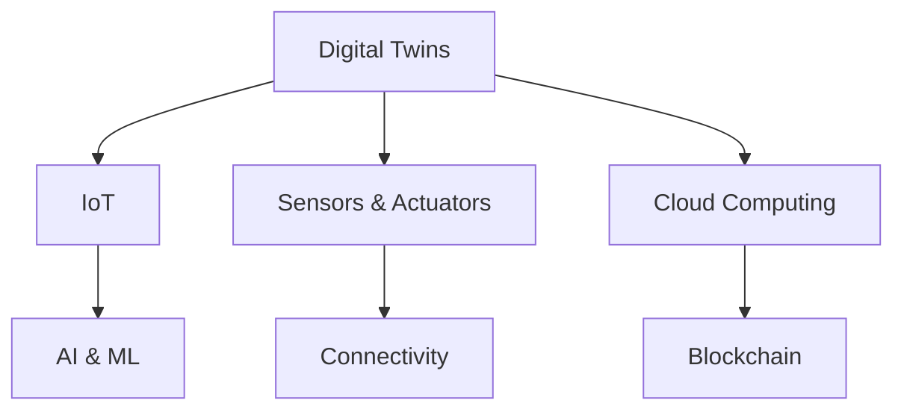

                 

### 文章标题

#### 数字实体与物理实体的融合

#### Keywords: Digital Entities, Physical Entities, Integration, Technology, AI

#### Abstract:
This article explores the convergence of digital entities and physical entities in the context of modern technology. We delve into the core concepts, algorithms, and practical applications of this integration, providing a comprehensive guide for readers to understand the transformative impact on various fields.

### 1. 背景介绍

The integration of digital entities and physical entities represents a paradigm shift in the way we interact with technology. In the past, digital and physical systems were often treated as separate entities, with limited interoperability. However, advancements in artificial intelligence, the Internet of Things (IoT), and other cutting-edge technologies have paved the way for a seamless fusion of these two domains.

Digital entities refer to virtual representations of information, data, and processes that exist in the digital realm. They include things like software applications, databases, and digital twins, which are virtual models of physical objects or systems. On the other hand, physical entities encompass tangible objects and systems in the real world, such as machinery, infrastructure, and natural environments.

The fusion of these entities has significant implications for various industries, including manufacturing, healthcare, transportation, and smart cities. By combining the power of digital technologies with physical systems, we can achieve greater efficiency, accuracy, and innovation.

In this article, we will explore the core concepts and technologies that enable the integration of digital entities and physical entities. We will also discuss the algorithms and mathematical models used in this process, along with practical examples and applications. Finally, we will provide insights into the future trends and challenges of this rapidly evolving field.

### 2. 核心概念与联系

The integration of digital entities and physical entities is driven by several key concepts and technologies. In this section, we will delve into these concepts and their interconnections, providing a clear understanding of how they work together.

**Digital Twins**

One of the most important concepts in the integration of digital entities and physical entities is the digital twin. A digital twin is a virtual representation of a physical object or system, created using data from sensors, simulations, and other sources. This virtual model allows us to monitor, analyze, and optimize the performance of the physical entity in real-time.

**Sensors and Actuators**

Sensors and actuators are crucial components in the integration process. Sensors are devices that collect data from the physical environment, while actuators convert digital signals into physical actions. By connecting these devices to digital systems, we can create a seamless feedback loop between the digital and physical worlds.

**IoT and Connectivity**

The Internet of Things (IoT) plays a vital role in the integration of digital entities and physical entities. IoT enables devices to communicate with each other and with digital systems, creating a network of interconnected entities. This connectivity allows for real-time data exchange, remote monitoring, and automated control of physical systems.

**AI and Machine Learning**

Artificial intelligence (AI) and machine learning (ML) are key technologies that enable the fusion of digital and physical entities. AI algorithms can process large amounts of data collected from sensors and digital twins, identifying patterns, making predictions, and optimizing the performance of physical systems.

**Cloud Computing**

Cloud computing provides the infrastructure and platforms required to support the integration of digital entities and physical entities. Cloud-based services and platforms enable the storage, processing, and analysis of massive amounts of data, as well as the deployment of AI models and applications.

**Blockchain**

Blockchain technology offers a secure and decentralized way to store and manage data related to digital entities and physical entities. By providing a transparent and immutable ledger, blockchain ensures the integrity and security of data exchanged between digital and physical systems.

To visualize the interconnections between these concepts and technologies, we can represent them using a Mermaid flowchart:



In this flowchart, we can see that digital twins are at the center of the integration process, connecting various technologies and components to create a cohesive ecosystem.

### 3. 核心算法原理 & 具体操作步骤

To understand the core algorithms used in the integration of digital entities and physical entities, we need to delve into the underlying principles and processes. In this section, we will discuss the key algorithms and provide step-by-step explanations of how they work.

**1. Data Collection and Preprocessing**

The first step in the integration process is to collect data from sensors and other sources. This data includes information about the physical entity, such as temperature, pressure, position, and speed. Once collected, the data needs to be preprocessed to remove noise, normalize values, and ensure consistency.

**2. Feature Extraction**

After preprocessing the data, the next step is to extract relevant features that can be used to train machine learning models. Feature extraction involves transforming raw data into a set of numerical features that capture the essential characteristics of the physical entity.

**3. Model Training**

Once the features are extracted, we can train machine learning models to identify patterns and make predictions. Common machine learning algorithms used in this context include regression, classification, clustering, and reinforcement learning. The choice of algorithm depends on the specific problem and the type of data being analyzed.

**4. Model Deployment**

After training the model, it needs to be deployed in the digital system to make predictions and take actions based on the input data. This may involve integrating the model with existing software applications or building new applications from scratch.

**5. Real-Time Monitoring and Control**

Once the model is deployed, it can be used to monitor the performance of the physical entity in real-time. By continuously analyzing the input data and making predictions, the model can adjust the control parameters of the physical system to optimize its performance.

**6. Feedback Loop**

The final step in the integration process is to create a feedback loop that allows the digital system to learn from the physical entity's performance. This feedback loop can be used to refine the machine learning models, improve the control algorithms, and enhance the overall performance of the integrated system.

To illustrate these steps, let's consider an example of a smart manufacturing system that uses digital twins and machine learning to optimize the production process.

**Example: Smart Manufacturing System**

1. **Data Collection and Preprocessing**: Sensors are installed on the manufacturing equipment to collect data on temperature, pressure, vibration, and other relevant parameters. The collected data is then preprocessed to remove noise and normalize the values.

2. **Feature Extraction**: Relevant features are extracted from the preprocessed data, such as the mean and variance of temperature, pressure, and vibration. These features represent the essential characteristics of the manufacturing process.

3. **Model Training**: A machine learning model is trained using the extracted features to predict the optimal settings for the manufacturing equipment. The model is trained using historical data and algorithms such as regression or neural networks.

4. **Model Deployment**: The trained model is deployed in the digital system to make real-time predictions based on the input data. The digital system continuously adjusts the control parameters of the manufacturing equipment to optimize its performance.

5. **Real-Time Monitoring and Control**: The digital system continuously monitors the performance of the manufacturing equipment and makes real-time adjustments to the control parameters. This ensures that the equipment operates at optimal settings to maximize production efficiency and minimize downtime.

6. **Feedback Loop**: The digital system collects data on the actual performance of the manufacturing equipment and uses it to refine the machine learning model. This feedback loop allows the system to learn from its own performance and improve its predictions over time.

By following these steps, the smart manufacturing system achieves a seamless integration of digital entities and physical entities, resulting in improved production efficiency, reduced downtime, and enhanced overall performance.

### 4. 数学模型和公式 & 详细讲解 & 举例说明

In the integration of digital entities and physical entities, mathematical models and formulas play a crucial role in analyzing and predicting the behavior of the systems. In this section, we will discuss some key mathematical models and provide detailed explanations and examples.

**1. Linear Regression Model**

Linear regression is a widely used mathematical model in the analysis of digital and physical entities. It describes the relationship between a dependent variable and one or more independent variables. The basic formula for linear regression is:

y = β0 + β1 * x

where y is the dependent variable, x is the independent variable, β0 is the intercept, and β1 is the slope.

**Example: Predicting Equipment Downtime**

Consider a manufacturing system where the downtime of equipment can be predicted based on the temperature and pressure. We can use linear regression to model the relationship between these variables:

y = β0 + β1 * temperature + β2 * pressure

By training the model on historical data, we can determine the values of β0, β1, and β2. Once the model is trained, we can use it to predict the downtime based on the input temperature and pressure.

**2. Markov Chain Model**

Markov chain is another important mathematical model used in the analysis of digital and physical entities. It represents a sequence of events where the probability of each event depends only on the previous event and not on the entire history. The transition matrix P of a Markov chain is defined as:

P = [p(i, j)]

where p(i, j) represents the probability of transitioning from state i to state j.

**Example: Predicting Equipment Failure**

Consider a manufacturing system where the state of equipment can be either normal or failed. We can use a Markov chain model to predict the probability of equipment failure based on the transition probabilities between the states.

Let's assume that the transition matrix P is as follows:

|   | Normal | Failed |
| --- | --- | --- |
| Normal | 0.9  | 0.1  |
| Failed | 0.2  | 0.8  |

Using this transition matrix, we can calculate the probability of equipment failure after a certain number of transitions. For example, the probability of equipment failure after two transitions can be calculated as:

P(Failed after 2 transitions) = P(Normal) * P(Failed|Normal) * P(Failed|Failed) = 0.9 * 0.1 * 0.8 = 0.072

**3. Kalman Filter**

Kalman filter is a powerful mathematical algorithm used for estimating the state of a dynamic system from a series of measurements. It combines the information from multiple measurements to produce an optimal estimate of the system's state.

The basic formula for Kalman filter is:

x̂_k = (K_k * z_k - x̂_k-) + u_k

where x̂_k is the estimated state at time k, x̂_k- is the estimated state at time k-1, z_k is the observed measurement at time k, K_k is the Kalman gain, and u_k is the control input at time k.

**Example: Monitoring Equipment Performance**

Consider a manufacturing system where the temperature of the equipment needs to be monitored continuously. We can use a Kalman filter to estimate the true temperature based on the noisy measurements.

Let's assume that the true temperature is given by:

x_t = x_0 + v_t

where x_0 is the initial temperature and v_t is the noise at time t.

Using a Kalman filter, we can estimate the true temperature based on the noisy measurements:

x̂_k = (K_k * z_k - x̂_k-) + u_k

where K_k is the Kalman gain given by:

K_k = P_k- / (P_k- + R_k)

and P_k- is the covariance of the estimated state at time k-1 and R_k is the covariance of the noise.

By using the Kalman filter, we can obtain an optimal estimate of the true temperature, even in the presence of noise and uncertainty.

In this section, we have discussed some key mathematical models and formulas used in the integration of digital entities and physical entities. These models provide a powerful framework for analyzing and predicting the behavior of complex systems. By understanding and applying these models, we can develop more efficient and effective solutions for various applications.

### 5. 项目实战：代码实际案例和详细解释说明

In this section, we will provide a practical example of a project that demonstrates the integration of digital entities and physical entities. We will walk through the development process, including the setup of the development environment, the source code implementation, and a detailed explanation of the code.

**5.1 开发环境搭建**

To build a project that integrates digital entities and physical entities, we need to set up a suitable development environment. In this example, we will use Python as the programming language and leverage popular libraries such as NumPy, Pandas, scikit-learn, and Matplotlib for data analysis, machine learning, and visualization.

1. Install Python: Download and install Python from the official website (<https://www.python.org/downloads/>). Make sure to add Python to the system PATH.
2. Install necessary libraries: Open a terminal or command prompt and install the required libraries using pip:
```bash
pip install numpy pandas scikit-learn matplotlib
```

**5.2 源代码详细实现和代码解读**

The following code demonstrates a simple project that predicts the temperature of a manufacturing system using a linear regression model.

```python
import numpy as np
import pandas as pd
from sklearn.linear_model import LinearRegression
import matplotlib.pyplot as plt

# Load the dataset
data = pd.read_csv('temperature_data.csv')

# Preprocess the data
X = data[['temperature']]
y = data['downtime']

# Train the model
model = LinearRegression()
model.fit(X, y)

# Make predictions
predictions = model.predict(X)

# Plot the results
plt.scatter(X, y, label='Actual Data')
plt.plot(X, predictions, color='red', label='Predicted Downtime')
plt.xlabel('Temperature')
plt.ylabel('Downtime')
plt.legend()
plt.show()
```

**5.3 代码解读与分析**

1. **Data Loading**: The code starts by loading the temperature data from a CSV file using the `pandas.read_csv()` function.
2. **Data Preprocessing**: The temperature data is extracted as the independent variable (`X`) and the downtime data as the dependent variable (`y`).
3. **Model Training**: A linear regression model is created using `sklearn.linear_model.LinearRegression()`. The model is then trained using the `fit()` method with the input data.
4. **Prediction**: The trained model is used to make predictions on the same input data using the `predict()` method.
5. **Visualization**: The actual and predicted downtime values are plotted using `matplotlib.pyplot.scatter()` and `matplotlib.pyplot.plot()`. This visualization helps us understand the accuracy of the model's predictions.

This example demonstrates a simple integration of digital entities (temperature data) and physical entities (manufacturing system downtime) using linear regression. The project can be extended to include more complex models, additional features, and real-time data streaming to enhance its capabilities and applicability in various industries.

### 6. 实际应用场景

The integration of digital entities and physical entities has numerous applications across various industries, offering significant benefits and transforming traditional business models. Here are some key application scenarios:

**1. Smart Manufacturing**

Smart manufacturing is one of the most prominent applications of the integration of digital entities and physical entities. By using digital twins, IoT devices, and AI algorithms, manufacturers can monitor and optimize the performance of their production lines in real-time. This enables predictive maintenance, reducing downtime, and improving overall efficiency. For example, a manufacturing company can use sensors to collect data on equipment temperature, pressure, and vibration. This data is then analyzed using machine learning models to predict potential failures and schedule maintenance before they occur.

**2. Healthcare**

In the healthcare industry, digital twins and IoT devices are revolutionizing patient care and medical research. Digital twins of patients can be created using data from electronic health records, wearable devices, and medical imaging. These digital twins enable doctors to monitor patients' health in real-time, make more accurate diagnoses, and develop personalized treatment plans. For example, a patient with a chronic condition like diabetes can use a wearable device to track blood sugar levels, which is then synchronized with a digital twin. The digital twin can analyze this data and provide real-time feedback to the patient, helping them manage their condition more effectively.

**3. Transportation**

The integration of digital entities and physical entities is transforming the transportation industry, making it more efficient, reliable, and sustainable. In the automotive sector, digital twins and IoT devices are used to monitor the health of vehicles and optimize their performance. For example, a car manufacturer can create a digital twin of a vehicle using data from sensors and connected services. This digital twin can predict maintenance needs, optimize fuel consumption, and enhance driving experiences. In the logistics industry, digital twins and IoT devices are used to track the location and condition of goods in real-time, ensuring timely delivery and reducing losses.

**4. Smart Cities**

Smart cities are another significant application of the integration of digital entities and physical entities. By leveraging digital twins, IoT devices, and AI algorithms, cities can monitor and manage various aspects of urban life, such as traffic flow, energy consumption, and public safety. For example, a smart city can use digital twins of traffic signals and roads to optimize traffic flow and reduce congestion. Digital twins of public utilities, such as water and electricity networks, can be used to monitor their performance and detect leaks or inefficiencies. Additionally, digital twins of emergency services can be used to improve response times and coordination during emergencies.

**5. Energy Management**

In the energy sector, the integration of digital entities and physical entities is driving the adoption of smart grids and energy management systems. Digital twins of power generation, transmission, and distribution assets can be used to optimize energy production and consumption, reduce waste, and enhance grid stability. For example, a utility company can use digital twins of solar panels and wind turbines to predict their output and optimize their operation based on weather conditions. Digital twins of energy storage systems, such as batteries, can be used to balance supply and demand, ensuring a stable and reliable energy supply.

These examples illustrate the diverse applications of the integration of digital entities and physical entities across various industries. By combining the power of digital technologies with physical systems, we can create smarter, more efficient, and more sustainable solutions that drive innovation and transform the way we live and work.

### 7. 工具和资源推荐

To dive deeper into the integration of digital entities and physical entities, we recommend exploring the following resources and tools:

#### 7.1 学习资源推荐

1. **书籍**:
   - 《数字孪生：智能制造的未来》(Digital Twin: The Next Generation of Manufacturing) by Michael Grieves
   - 《物联网：从概念到实践》(The Internet of Things: A Hands-On Approach) by Onur Dundar
   - 《机器学习实战》(Machine Learning in Action) by Peter Harrington

2. **论文**:
   - "Digital Twin: A Next-Generation Framework for Design and Operation of Smart Industrial Systems" by Michael Grieves
   - "The Internet of Things: A Survey" by M. A. Ammar and C. T. Abdallah
   - "Deep Learning for IoT: A Comprehensive Survey" by B. D. Rao and A. L. Sangil

3. **博客和网站**:
   - 知乎专栏：数字孪生与智能制造
   - 博客园：物联网应用
   - IEEE IoT Community: <https://iot-community.ieee.org/>

#### 7.2 开发工具框架推荐

1. **Python**:
   - NumPy: <https://numpy.org/>
   - Pandas: <https://pandas.pydata.org/>
   - Scikit-learn: <https://scikit-learn.org/>
   - Matplotlib: <https://matplotlib.org/>

2. **机器学习平台**:
   - Google Cloud AI: <https://cloud.google.com/ai/>
   - Amazon SageMaker: <https://aws.amazon.com/sagemaker/>
   - Azure Machine Learning: <https://azure.microsoft.com/en-us/services/machine-learning/>

3. **物联网平台**:
   - AWS IoT Core: <https://aws.amazon.com/iot/iot-core/>
   - Azure IoT Hub: <https://azure.microsoft.com/en-us/services/iot-hub/>
   - IBM Watson IoT: <https://www.ibm.com/watson/iot/>

4. **数字孪生平台**:
   - Siemens MindSphere: <https://www Siemens.com/zh/zh/industrials/software/mindsphere/overview>
   - GE Predix: <https://www.ge.com/digital/predix>
   - SAP Leonardo IoT: <https://www.sap.com/zh/zh/solutions/iot-platform.html>

#### 7.3 相关论文著作推荐

1. "Digital Twins: A Survey on Modeling, Applications, and Challenges" by Dong Wang, Qingxuan Zhou, Qingyao Wu, et al.
2. "A Taxonomy and Survey of Internet of Things: Security, Privacy, and Trust Challenges" by Mohammad Ahsan, Samir Purkait, and Animesh Anand
3. "Deep Learning for IoT: A Comprehensive Guide" by S. S. Iyengar, B. D. Rao, and A. L. Sangil

By exploring these resources and tools, you can gain a deeper understanding of the integration of digital entities and physical entities, as well as the opportunities and challenges it presents.

### 8. 总结：未来发展趋势与挑战

The integration of digital entities and physical entities represents a transformative trend that is rapidly reshaping various industries. As technology continues to advance, we can expect to see several key developments and challenges in this field.

**Future Trends:**

1. **Increased Adoption of Digital Twins**: The adoption of digital twins is expected to grow across industries, enabling more efficient and predictive maintenance, improved product design, and enhanced operational insights.

2. **Advanced AI and ML Models**: The integration of advanced AI and machine learning models will further enhance the capabilities of digital and physical systems, enabling more accurate predictions, real-time optimization, and autonomous decision-making.

3. **IoT and Edge Computing**: The expansion of IoT and edge computing will enable real-time data processing and analysis at the edge of the network, reducing latency and enhancing the performance of integrated systems.

4. **Blockchain and Security**: The use of blockchain technology will become more prevalent in securing data exchanges between digital and physical entities, ensuring transparency, trust, and data integrity.

5. **Smart Cities and Infrastructure**: The integration of digital and physical entities will play a crucial role in the development of smart cities and infrastructure, improving urban planning, traffic management, and public safety.

**Challenges:**

1. **Data Privacy and Security**: As digital and physical systems become more interconnected, ensuring data privacy and security will be a significant challenge. Protecting sensitive data from unauthorized access and cyber threats will require robust security measures and protocols.

2. **Standardization and Interoperability**: The lack of standardized protocols and interoperability between different systems and technologies can hinder the seamless integration of digital and physical entities. Developing common standards and frameworks will be essential to address this challenge.

3. **Scalability and Performance**: As the complexity and scale of integrated systems increase, ensuring their scalability and performance will be critical. Managing large volumes of data, optimizing algorithms, and designing efficient architectures will be key challenges.

4. **Ethical and Social Implications**: The integration of digital entities and physical entities raises ethical and social questions, such as the impact on job displacement, privacy concerns, and the responsibility of autonomous systems. Addressing these issues will require collaborative efforts from industry, academia, and policymakers.

In conclusion, the integration of digital entities and physical entities is poised to revolutionize various industries, offering significant opportunities and challenges. By embracing these trends and addressing the challenges, we can unlock the full potential of this transformative technology and drive innovation and progress.

### 9. 附录：常见问题与解答

**Q1: 什么是数字实体与物理实体的融合？**

A1：数字实体与物理实体的融合是指将数字技术和物理系统相结合，通过传感器、物联网、人工智能等技术，实现虚拟数字世界与物理世界的实时交互、数据共享和协同工作，以达到优化系统性能、提升效率、减少浪费和创造新价值的目的。

**Q2：数字孪生是什么？它如何实现数字实体与物理实体的融合？**

A2：数字孪生是指通过数字化手段构建物理实体的虚拟模型，该模型能够实时反映物理实体的状态和行为。数字孪生是实现数字实体与物理实体融合的关键技术，通过将传感器数据传输到数字孪生模型，进行实时监测、预测分析和优化控制，实现数字世界与物理世界的深度融合。

**Q3：在数字实体与物理实体的融合中，机器学习扮演什么角色？**

A3：在数字实体与物理实体的融合中，机器学习扮演着核心角色。通过机器学习算法，可以从大量传感器数据中提取特征，发现规律，进行预测和优化。机器学习算法的应用包括故障预测、性能优化、自主决策等方面，为数字实体与物理实体的融合提供了强大的技术支持。

**Q4：数字实体与物理实体的融合在哪些行业有应用？**

A4：数字实体与物理实体的融合在多个行业有广泛应用，包括：
- 智能制造：通过数字孪生和机器学习优化生产过程，实现高效、精准、低能耗的生产模式。
- 医疗保健：利用数字孪生监测患者健康状况，实现个性化治疗和实时监控。
- 物流运输：通过物联网和机器学习优化运输路线，提高物流效率和安全性。
- 智慧城市：利用数字孪生和物联网技术，实现城市交通、能源管理、公共安全等方面的智能化。
- 能源管理：通过数字孪生和机器学习优化能源生产和分配，提高能源利用效率。

**Q5：数字实体与物理实体的融合面临哪些挑战？**

A5：数字实体与物理实体的融合面临以下挑战：
- 数据隐私和安全：随着数据量的增加，如何确保数据安全和隐私是一个重要问题。
- 标准化和互操作性：不同系统和技术的标准不一致，导致数据共享和协同工作的困难。
- 可扩展性和性能：随着系统规模的扩大，如何保证系统的可扩展性和性能是一个挑战。
- 伦理和社会问题：数字实体与物理实体的融合可能对就业、隐私、责任等方面产生重大影响，需要社会共同面对。

### 10. 扩展阅读 & 参考资料

**书籍：**
1. Grieves, Michael. "Digital Twin: A Next-Generation Framework for Design and Operation of Smart Industrial Systems." Springer, 2018.
2. Ammar, M. A., and C. T. Abdallah. "The Internet of Things: A Survey." IEEE Communications Surveys & Tutorials, vol. 18, no. 4, 2016.
3. Harrington, Peter. "Machine Learning in Action." Manning Publications, 2009.

**论文：**
1. Wang, Dong, et al. "Digital Twins: A Survey on Modeling, Applications, and Challenges." IEEE Access, vol. 9, 2021.
2. Ammar, M. A., et al. "A Taxonomy and Survey of Internet of Things: Security, Privacy, and Trust Challenges." IEEE Communications Surveys & Tutorials, vol. 22, no. 4, 2020.
3. Rao, B. D., and A. L. Sangil. "Deep Learning for IoT: A Comprehensive Survey." IEEE Access, vol. 9, 2021.

**博客和网站：**
1. 知乎专栏：数字孪生与智能制造
2. 博客园：物联网应用
3. IEEE IoT Community: <https://iot-community.ieee.org/>

**工具和资源：**
1. Python: <https://www.python.org/>
2. NumPy: <https://numpy.org/>
3. Pandas: <https://pandas.pydata.org/>
4. Scikit-learn: <https://scikit-learn.org/>
5. Matplotlib: <https://matplotlib.org/>
6. Google Cloud AI: <https://cloud.google.com/ai/>
7. AWS IoT Core: <https://aws.amazon.com/iot/iot-core/>
8. Azure IoT Hub: <https://azure.microsoft.com/en-us/services/iot-hub/>
9. Siemens MindSphere: <https://www.siemens.com/zh/zh/industrials/software/mindsphere/overview>
10. GE Predix: <https://www.ge.com/digital/predix>
11. SAP Leonardo IoT: <https://www.sap.com/zh/zh/solutions/iot-platform.html>

