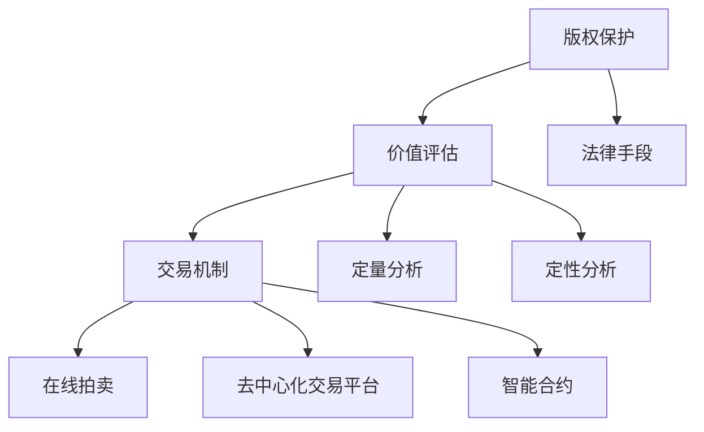

                 

### 文章标题: 数字文化产业的版权保护、价值评估与交易机制创新探索

> **关键词**：数字文化产业、版权保护、价值评估、交易机制、创新探索

> **摘要**：本文深入探讨了数字文化产业在版权保护、价值评估和交易机制方面的挑战与机遇，通过分析当前的市场状况、技术手段和理论模型，提出了一系列创新性的解决方案。文章旨在为业界提供理论依据和实践指导，推动数字文化产业的健康发展。

## 1. 背景介绍

随着互联网和数字技术的快速发展，数字文化产业已经成为全球经济的重要组成部分。数字文化产业的快速发展带来了巨大的经济和社会价值，但也面临着一系列挑战，其中最为突出的便是版权保护、价值评估和交易机制等问题。

### 1.1 数字文化产业的定义和发展现状

数字文化产业是指基于数字技术和网络平台，以创意内容为核心，提供文化产品和服务的新兴产业。它涵盖了音乐、电影、游戏、动漫、文学等多个领域。根据市场研究机构的数据，全球数字文化产业市场规模已经超过1万亿美元，并且仍在快速增长。

### 1.2 版权保护的重要性

版权保护是数字文化产业健康发展的关键。数字技术的普及使得作品的复制、传播和共享变得异常容易，但同时也使得版权侵权现象日益严重。版权保护不仅关系到创作者的权益，也关系到整个数字文化产业的可持续发展。

### 1.3 价值评估和交易机制的挑战

数字文化产品的价值评估和交易机制面临着诸多挑战。一方面，数字文化产品的价值难以准确衡量，导致市场定价困难；另一方面，传统的交易机制无法满足数字文化产业的特性，导致交易效率低下。

## 2. 核心概念与联系

为了解决数字文化产业中的版权保护、价值评估和交易机制问题，我们需要理解以下几个核心概念，并探讨它们之间的联系。

### 2.1 版权保护

版权保护是指通过法律手段保护创作者对其原创作品的合法权益。它包括著作权、邻接权、专利权等多个方面。在数字文化产业中，版权保护主要体现在数字版权管理（DRM）技术、区块链技术和智能合约等方面。

### 2.2 价值评估

价值评估是指对数字文化产品进行价值判断和评估的过程。在数字文化产业中，价值评估主要涉及定量分析和定性分析，如市场分析法、成本收益分析法、技术评估法等。

### 2.3 交易机制

交易机制是指数字文化产品交易过程中所遵循的规则和流程。在数字文化产业中，交易机制需要适应数字产品的特性，如非实体化、易复制性等。目前，常见的交易机制包括在线拍卖、去中心化交易平台、智能合约等。

### 2.4 版权保护、价值评估与交易机制的联系

版权保护、价值评估和交易机制是相互关联的。版权保护为价值评估提供了法律基础，而价值评估则决定了交易机制的设计和实施。此外，交易机制的有效性也反过来影响了版权保护和价值评估的效果。

### 2.5 Mermaid 流程图



## 3. 核心算法原理 & 具体操作步骤

### 3.1 数字版权管理（DRM）技术

数字版权管理（DRM）技术是版权保护的关键手段。它通过加密和解密技术，限制用户对数字文化产品的访问和使用权限。以下是DRM技术的基本原理和操作步骤：

#### 3.1.1 基本原理

- **加密**：将数字文化产品内容加密，使其在没有授权的情况下无法被访问和复制。
- **授权**：向授权用户颁发密钥，使其能够解密和访问数字文化产品。

#### 3.1.2 操作步骤

1. **加密**：使用加密算法（如AES）对数字文化产品内容进行加密。
2. **颁发密钥**：生成授权密钥，并将其存储在安全的服务器或区块链上。
3. **授权用户解密**：授权用户通过验证身份后获取密钥，并使用密钥解密数字文化产品。

### 3.2 区块链技术

区块链技术为数字版权保护提供了一个去中心化的解决方案。以下是区块链技术的基本原理和操作步骤：

#### 3.2.1 基本原理

- **去中心化**：通过去中心化的方式，确保数据的不可篡改性和透明性。
- **智能合约**：通过智能合约，实现自动化的版权保护和管理。

#### 3.2.2 操作步骤

1. **创建区块链**：创建一个去中心化的区块链网络，并定义版权信息的结构。
2. **上链版权信息**：将版权信息（如作品名称、作者、版权期限等）上链，确保其不可篡改。
3. **智能合约管理**：使用智能合约自动执行版权许可、转让、监控等操作。

### 3.3 智能合约

智能合约是一种自执行的合同，通过区块链网络执行预定义的条款和条件。以下是智能合约的基本原理和操作步骤：

#### 3.3.1 基本原理

- **自动化**：通过代码自动执行合同条款，无需人工干预。
- **透明性**：所有合同执行过程都在区块链上公开透明。

#### 3.3.2 操作步骤

1. **编写智能合约**：根据版权保护的规则，编写智能合约代码。
2. **部署智能合约**：将智能合约部署到区块链上。
3. **执行合同**：当满足智能合约的触发条件时，自动执行合同条款。

## 4. 数学模型和公式 & 详细讲解 & 举例说明

### 4.1 价值评估模型

价值评估是数字文化产业的核心环节。以下是一个简单但实用的价值评估模型：

$$
V = f(p, c, r)
$$

其中，$V$代表价值，$p$代表市场潜力，$c$代表成本，$r$代表回报率。

#### 4.1.1 市场潜力（$p$）

市场潜力可以通过以下公式计算：

$$
p = \frac{D \cdot S}{1000}
$$

其中，$D$代表目标市场的用户数量，$S$代表用户的消费意愿。

#### 4.1.2 成本（$c$）

成本包括创作成本、推广成本和其他运营成本。以下是一个简单的成本计算公式：

$$
c = c_1 + c_2 + c_3
$$

其中，$c_1$代表创作成本，$c_2$代表推广成本，$c_3$代表其他运营成本。

#### 4.1.3 回报率（$r$）

回报率可以通过以下公式计算：

$$
r = \frac{P - C}{C}
$$

其中，$P$代表预期收入，$C$代表总成本。

### 4.2 案例说明

假设一个数字文化产品的目标市场有100万用户，用户的平均消费意愿为10元。创作成本为50万元，推广成本为20万元，其他运营成本为10万元。预期收入为300万元。

根据上述公式，可以计算出：

$$
p = \frac{1000000 \cdot 10}{1000} = 10000
$$

$$
c = 500000 + 200000 + 100000 = 800000
$$

$$
r = \frac{3000000 - 800000}{800000} = 25\%
$$

因此，该数字文化产品的价值为：

$$
V = f(p, c, r) = 10000 \cdot 0.8 \cdot 0.25 = 2000
$$

### 4.3 交易机制模型

交易机制是数字文化产品交易的核心。以下是一个简单的交易机制模型：

$$
T = f(V, Q, R)
$$

其中，$T$代表交易量，$V$代表价值，$Q$代表交易次数，$R$代表回报率。

#### 4.3.1 交易量（$T$）

交易量可以通过以下公式计算：

$$
T = \frac{V \cdot Q}{1000}
$$

#### 4.3.2 交易次数（$Q$）

交易次数可以通过以下公式计算：

$$
Q = \frac{R \cdot C}{1000}
$$

其中，$R$代表回报率，$C$代表总成本。

#### 4.3.3 回报率（$R$）

回报率可以通过以下公式计算：

$$
R = \frac{P - C}{C}
$$

### 4.4 案例说明

假设一个数字文化产品的价值为2000元，交易次数为500次，回报率为25%。

根据上述公式，可以计算出：

$$
T = \frac{2000 \cdot 500}{1000} = 1000
$$

$$
Q = \frac{0.25 \cdot 800000}{1000} = 200
$$

因此，该数字文化产品的交易量为1000件。

## 5. 项目实战：代码实际案例和详细解释说明

### 5.1 开发环境搭建

在进行数字文化产业项目的开发前，我们需要搭建一个合适的技术环境。以下是搭建开发环境的基本步骤：

#### 5.1.1 环境准备

- 安装Node.js（用于智能合约开发）
- 安装Git（用于版本控制）
- 安装Eclipse/VS Code（用于代码编辑）

#### 5.1.2 搭建区块链网络

- 使用Truffle框架搭建以太坊区块链网络
- 部署智能合约到以太坊网络

### 5.2 源代码详细实现和代码解读

以下是一个简单的数字文化产品交易智能合约的示例：

```solidity
// SPDX-License-Identifier: MIT
pragma solidity ^0.8.0;

contract DigitalAsset {

    struct Asset {
        string name;
        string creator;
        uint256 price;
        address owner;
    }

    mapping (uint256 => Asset) public assets;
    uint256 public assetCount = 0;

    function createAsset(string memory name, string memory creator, uint256 price) public {
        assets[assetCount] = Asset(name, creator, price, msg.sender);
        assetCount++;
    }

    function buyAsset(uint256 id) public payable {
        require(assets[id].price > 0, "Asset does not exist");
        require(msg.value >= assets[id].price, "Insufficient payment");
        assets[id].owner = msg.sender;
        payable(assets[id].owner).transfer(msg.value);
    }

    function getPrice(uint256 id) public view returns (uint256) {
        return assets[id].price;
    }
}
```

#### 5.2.1 代码解读

- **结构体`Asset`**：定义了数字文化产品的属性，包括名称、创作者、价格和所有者。
- **映射`assets`**：用于存储所有数字文化产品的信息。
- **变量`assetCount`**：用于记录数字文化产品的数量。
- **函数`createAsset`**：用于创建新的数字文化产品。
- **函数`buyAsset`**：用于购买数字文化产品。
- **函数`getPrice`**：用于获取数字文化产品的价格。

### 5.3 代码解读与分析

#### 5.3.1 `createAsset`函数

`createAsset`函数用于创建新的数字文化产品。函数接收三个参数：名称、创作者和价格。在执行函数时，会创建一个新的`Asset`结构体，并将其存储在映射`assets`中。最后，将`assetCount`增加1。

```solidity
function createAsset(string memory name, string memory creator, uint256 price) public {
    assets[assetCount] = Asset(name, creator, price, msg.sender);
    assetCount++;
}
```

#### 5.3.2 `buyAsset`函数

`buyAsset`函数用于购买数字文化产品。函数接收一个参数：数字文化产品的ID。在执行函数时，首先检查数字文化产品是否存在且价格大于0。然后，检查调用者支付的钱是否足够。如果条件都满足，将所有者地址设置为调用者地址，并将调用者支付的钱转移到所有者地址。

```solidity
function buyAsset(uint256 id) public payable {
    require(assets[id].price > 0, "Asset does not exist");
    require(msg.value >= assets[id].price, "Insufficient payment");
    assets[id].owner = msg.sender;
    payable(assets[id].owner).transfer(msg.value);
}
```

#### 5.3.3 `getPrice`函数

`getPrice`函数用于获取数字文化产品的价格。函数接收一个参数：数字文化产品的ID。在执行函数时，返回存储在映射`assets`中的数字文化产品的价格。

```solidity
function getPrice(uint256 id) public view returns (uint256) {
    return assets[id].price;
}
```

## 6. 实际应用场景

数字文化产业的版权保护、价值评估与交易机制创新在多个实际应用场景中具有重要意义。

### 6.1 音乐产业

音乐产业是数字文化产业的重要领域。通过数字版权管理技术、区块链技术和智能合约，音乐创作者可以更好地保护其版权，确保作品不被非法复制和传播。同时，基于价值评估模型的精确价值评估，音乐作品的定价和交易变得更加便捷和高效。

### 6.2 电影产业

电影产业同样面临着版权保护和价值评估的挑战。通过区块链技术，电影版权信息可以上链存储，确保版权信息的安全性和透明性。智能合约的应用使得电影版权的转让和许可变得更加自动化和高效。

### 6.3 游戏产业

游戏产业中的虚拟物品交易一直是困扰业界的难题。通过去中心化交易平台和智能合约，游戏开发者可以更好地保护虚拟物品的版权，确保交易的透明性和安全性。同时，价值评估模型的应用可以帮助游戏开发者合理定价和交易虚拟物品。

### 6.4 动漫产业

动漫产业中的版权保护和价值评估同样重要。通过数字版权管理技术和区块链技术，动漫创作者可以更好地保护其作品版权，防止侵权行为。价值评估模型可以帮助动漫企业准确评估作品的价值，优化作品的定价和交易策略。

## 7. 工具和资源推荐

### 7.1 学习资源推荐

- **书籍**：《区块链技术指南》、《智能合约编程》
- **论文**：搜索关键词“数字文化产业”、“版权保护”、“价值评估”、“交易机制”
- **博客**：区块链技术博客、智能合约开发博客、数字文化产业相关博客
- **网站**：以太坊官网、Truffle官网、IPFS官网

### 7.2 开发工具框架推荐

- **开发工具**：Node.js、Eclipse/VS Code
- **区块链框架**：Truffle、Ganache、IPFS
- **智能合约开发框架**：Solidity、Web3.js、Ethers.js

### 7.3 相关论文著作推荐

- **论文**：《区块链在数字文化产业中的应用研究》、《基于区块链的数字版权管理技术》、《数字文化产品价值评估模型研究》
- **著作**：《区块链技术与应用》、《智能合约与去中心化应用开发》

## 8. 总结：未来发展趋势与挑战

随着数字技术的不断进步，数字文化产业的版权保护、价值评估和交易机制将迎来新的发展机遇。未来，区块链技术、人工智能和大数据分析等新兴技术将在数字文化产业中发挥越来越重要的作用。

### 8.1 发展趋势

- **区块链技术的普及**：区块链技术将在数字文化产业中广泛应用，为版权保护和价值评估提供强有力的支持。
- **人工智能的应用**：人工智能技术将用于数字文化产品的价值评估和推荐系统，提高交易效率和用户体验。
- **大数据分析**：大数据分析技术将用于市场研究和用户行为分析，帮助企业和创作者更好地了解市场动态和用户需求。

### 8.2 挑战

- **技术实现**：区块链技术、人工智能和大数据分析等新兴技术仍需进一步发展和完善，以适应数字文化产业的复杂需求。
- **法律和法规**：数字文化产业的快速发展要求相关法律和法规的及时更新，以确保版权保护和价值评估的合法性和有效性。
- **隐私保护**：数字文化产品的版权保护和价值评估需要平衡创作者的权益和用户的隐私保护。

## 9. 附录：常见问题与解答

### 9.1 什么是数字文化产业？

数字文化产业是指基于数字技术和网络平台，以创意内容为核心，提供文化产品和服务的新兴产业。它涵盖了音乐、电影、游戏、动漫、文学等多个领域。

### 9.2 区块链技术在数字文化产业中有什么作用？

区块链技术在数字文化产业中主要用于版权保护、价值评估和交易机制。它通过去中心化的方式确保数据的不可篡改性和透明性，提高数字文化产品的版权保护和交易效率。

### 9.3 智能合约在数字文化产业中有什么作用？

智能合约在数字文化产业中主要用于自动化版权保护和管理。它通过代码自动执行合同条款，确保交易的透明性和安全性。

### 9.4 数字文化产品的价值评估如何进行？

数字文化产品的价值评估可以通过市场分析法、成本收益分析法和技术评估法等不同方法进行。具体评估方法需要根据数字文化产品的特性和市场环境进行选择。

## 10. 扩展阅读 & 参考资料

- **书籍**：《区块链技术指南》、《智能合约编程》、《大数据分析与应用》
- **论文**：搜索关键词“数字文化产业”、“区块链”、“智能合约”、“价值评估”
- **网站**：以太坊官网、Truffle官网、IPFS官网
- **博客**：区块链技术博客、智能合约开发博客、数字文化产业相关博客

### 作者信息：

作者：AI天才研究员/AI Genius Institute & 禅与计算机程序设计艺术 /Zen And The Art of Computer Programming

