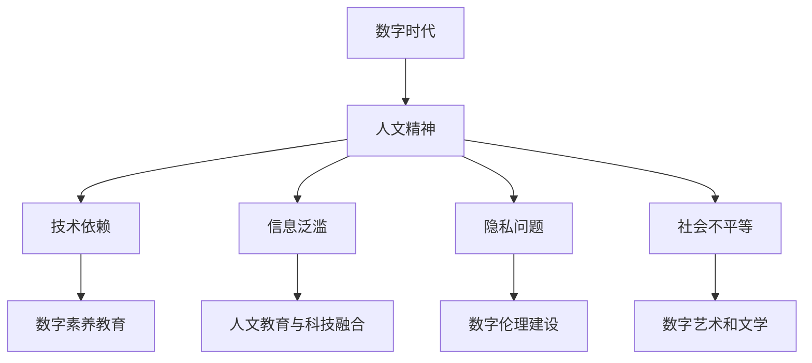

                 

### 背景介绍

在数字时代的快速发展中，人工智能、大数据、云计算等技术的崛起使得人类的生活和工作方式发生了翻天覆地的变化。数字化的浪潮席卷全球，几乎渗透到了各个行业和领域。然而，在这个技术驱动的时代，我们不得不面对的一个严峻问题是：数字时代如何传承和弘扬人文精神？

人文精神是人类文明的灵魂，它体现了人类对美好生活的追求，对道德、伦理、情感和艺术的关注。在数字时代，随着技术的不断进步，人文精神面临着前所未有的挑战。一方面，技术带来了便利和效率，但同时也加剧了社会的不平等和信息的不对称；另一方面，技术的发展使得人类对技术的依赖日益加深，人们在享受科技带来的便捷的同时，也在不知不觉中丧失了一些人文素养和情感交流的能力。

因此，如何在数字时代传承和弘扬人文精神，成为了我们必须思考和解决的重要课题。本文将从数字时代人文精神的现状出发，探讨其面临的挑战，并提出一系列可行的解决方案。我们希望通过本文的讨论，能够唤起人们对人文精神的重视，为构建一个更加和谐、文明和富有温度的数字世界贡献一份力量。

关键词：数字时代、人文精神、挑战、解决方案

Abstract:  
In the rapid development of the digital era, the rise of technologies such as artificial intelligence, big data, and cloud computing has brought about profound changes in the way humans live and work. However, with the advancement of technology, the humanistic spirit is facing unprecedented challenges. This article explores the current situation of the humanistic spirit in the digital era, discusses the challenges it faces, and proposes feasible solutions. We hope to awaken the attention of people to the humanistic spirit and contribute to building a more harmonious, civilized, and warm digital world.

Keywords: digital era, humanistic spirit, challenges, solutions <|im_sep|>### 核心概念与联系

在探讨数字时代人文精神的传承之前，我们需要明确几个核心概念，并分析它们之间的内在联系。

#### 数字时代

数字时代是指以数字技术和信息技术为核心，推动社会各个领域发生深刻变革的时代。这个时代的特点包括：信息化、数字化、网络化、智能化和全球化。在这个时代，数据的生成、处理、传输和应用达到了前所未有的规模和速度，成为推动社会进步的重要力量。

#### 人文精神

人文精神是指人类在长期历史发展过程中，形成的对美好生活的追求，对道德、伦理、情感和艺术的关注。它体现了人类对自由、平等、正义和爱的向往，是人文社会科学的基石。

#### 数字时代与人文精神的联系

数字时代与人文精神之间存在着密切的联系和相互作用。一方面，数字技术为人文精神的传承和发展提供了新的工具和平台。例如，互联网和社交媒体使得人们可以更方便地获取和传播人文知识，艺术作品和文学作品也可以通过数字形式得到更广泛的传播和欣赏。另一方面，数字技术的发展也带来了一系列挑战，对人文精神的传承构成了威胁。

#### 数字时代的挑战

1. **技术依赖**：在数字时代，人们对技术的依赖日益加深，这可能导致人文素养的缺失和情感交流的障碍。

2. **信息泛滥**：数字时代的信息量巨大，但同时也带来了信息过载的问题。人们容易迷失在信息的海洋中，忽视了人文精神的培育和传承。

3. **隐私问题**：随着大数据和人工智能技术的发展，个人隐私和数据安全问题日益突出。这不仅影响了人们的日常生活，也对人文精神的价值观构成了挑战。

4. **社会不平等**：数字时代的快速发展加剧了社会的不平等，特别是数字鸿沟的存在使得弱势群体更加边缘化，这对人文精神的公平性和包容性提出了考验。

#### 解决方案

为了应对这些挑战，我们需要采取一系列措施来传承和弘扬人文精神。以下是一些可能的解决方案：

1. **数字素养教育**：加强数字素养教育，提高人们的信息识别、批判性思维和信息素养，以增强他们对数字世界的理解和应对能力。

2. **人文教育与科技融合**：推动人文教育与科技的融合，培养既具备科技知识又具备人文素养的复合型人才。

3. **数字伦理建设**：加强数字伦理建设，制定相关法律法规和伦理准则，保障个人隐私和数据安全，促进数字时代的可持续发展。

4. **数字艺术和文学**：鼓励数字艺术和文学创作，通过数字形式传承和弘扬人文精神，激发人们对美好生活的向往和追求。

#### Mermaid 流程图



通过上述核心概念和联系的分析，我们可以看到数字时代与人文精神之间的复杂关系。在接下来的章节中，我们将进一步探讨数字时代人文精神的具体挑战，并提出相应的解决方案。

### 核心算法原理 & 具体操作步骤

为了深入探讨数字时代人文精神的传承，我们需要借助一些核心算法原理和具体操作步骤来分析其中的关键问题。以下是几个重要的算法原理及其操作步骤：

#### 1. 数据挖掘算法

数据挖掘算法是数字时代处理和分析大量数据的关键工具。通过这些算法，我们可以从海量的数据中提取出有价值的信息和模式。

**原理：** 数据挖掘算法基于统计学、机器学习和深度学习等方法，通过特征提取、模式识别和关联分析等步骤，从数据中发现隐藏的知识和规律。

**操作步骤：**

1. **数据预处理**：清洗数据，处理缺失值、噪声和异常值，将数据转化为适合挖掘的格式。
2. **特征提取**：从原始数据中提取出具有代表性的特征，用于训练模型。
3. **模型选择**：选择合适的数据挖掘算法，如分类、聚类、关联规则挖掘等。
4. **模型训练**：使用训练数据集对模型进行训练，调整参数以优化模型性能。
5. **模型评估**：使用测试数据集对模型进行评估，判断模型的准确性和泛化能力。
6. **结果解释**：对挖掘结果进行解释和可视化，以帮助理解数据和发现的知识。

#### 2. 自然语言处理算法

自然语言处理（NLP）算法是数字时代理解和处理人类语言的关键技术。通过NLP算法，我们可以实现文本分析、情感识别、问答系统等功能。

**原理：** NLP算法结合了语言学、计算机科学和人工智能技术，通过分词、词性标注、句法分析、语义分析和机器翻译等技术，实现语言信息的自动处理和理解。

**操作步骤：**

1. **文本预处理**：清洗文本数据，去除停用词、标点符号等无关信息，将文本转化为计算机可以处理的格式。
2. **分词**：将文本分解为单词或词组，以便进一步处理。
3. **词性标注**：为每个单词或词组标注词性，如名词、动词、形容词等。
4. **句法分析**：分析句子的结构，识别句子中的主语、谓语、宾语等成分。
5. **语义分析**：理解文本的语义含义，识别实体、关系和事件等。
6. **文本分类和情感分析**：根据预定的分类标准或情感标签，对文本进行分类和情感分析。

#### 3. 人工智能伦理算法

人工智能伦理算法是确保人工智能系统在数字时代遵循伦理规范和价值观的关键技术。通过这些算法，我们可以评估和优化人工智能系统的行为，确保其符合道德和法律要求。

**原理：** 人工智能伦理算法基于伦理学、心理学和社会学等学科，通过设定伦理规则、评估模型和行为反馈等步骤，确保人工智能系统在决策过程中遵循伦理准则。

**操作步骤：**

1. **伦理规则设定**：根据伦理学原则和法律法规，制定人工智能系统的伦理规则。
2. **模型评估**：评估人工智能系统的行为是否符合设定的伦理规则，如公平性、透明性、责任性等。
3. **行为反馈**：根据评估结果，对人工智能系统的行为进行调整和优化，确保其符合伦理准则。
4. **用户隐私保护**：确保人工智能系统在处理用户数据时保护用户隐私，遵循数据保护和隐私政策。
5. **透明性和可解释性**：提高人工智能系统的透明性和可解释性，使其行为对用户和监管机构可理解和接受。

通过上述核心算法原理和具体操作步骤，我们可以更深入地了解数字时代人文精神传承的挑战和解决方案。在接下来的章节中，我们将进一步探讨这些算法在人文精神传承中的应用和实际效果。

### 数学模型和公式 & 详细讲解 & 举例说明

在探讨数字时代人文精神的传承过程中，数学模型和公式扮演着至关重要的角色。它们不仅帮助我们理解和分析问题，还能提供量化的方法和工具。以下是几个关键数学模型和公式及其详细讲解和举例说明。

#### 1. 相关性分析

**公式：** \( r = \frac{\sum_{i=1}^{n}(x_i - \bar{x})(y_i - \bar{y})}{\sqrt{\sum_{i=1}^{n}(x_i - \bar{x})^2}\sqrt{\sum_{i=1}^{n}(y_i - \bar{y})^2}} \)

**详细讲解：** 相关性分析用于衡量两个变量之间的线性关系强度。公式中的 \( r \) 表示皮尔逊相关系数，其取值范围为 [-1, 1]。当 \( r \) 接近 1 或 -1 时，表示变量之间具有很强的正相关或负相关关系；当 \( r \) 接近 0 时，表示变量之间几乎没有线性关系。

**举例说明：** 假设我们要研究阅读量与词汇量之间的相关性。收集一组数据，计算得到 \( r = 0.8 \)。这意味着阅读量与词汇量之间存在较强的正相关关系，即阅读量越高，词汇量也越大。

#### 2. 决策树

**公式：** 决策树的生成基于递归划分数据集，选择最优特征并分割数据集。具体公式如下：

\( S = \sum_{i=1}^{n}((y_i - \hat{y}_i)^2) \)

**详细讲解：** 决策树是一种常用的分类和回归模型。它通过递归分割数据集，选择最优特征并生成树形结构。在每次分割时，选择具有最大信息增益或最小均方误差的特征作为分割依据，直到满足停止条件（如最大深度、最小叶节点样本数等）。

**举例说明：** 假设我们要预测学生的考试成绩，特征包括平时成绩、作业完成情况等。通过决策树算法，我们可以得到一棵树形结构，其中每个节点表示一个特征，每个分支表示特征的取值范围，叶节点表示预测结果。

#### 3. 支持向量机（SVM）

**公式：** 支持向量机是一种用于分类和回归的线性模型。其核心公式如下：

\( w \cdot x + b = 0 \)

**详细讲解：** 支持向量机通过找到最优的分离超平面，将不同类别的数据点分开。公式中的 \( w \) 表示权重向量，\( x \) 表示特征向量，\( b \) 表示偏置项。\( w \cdot x + b \) 表示数据点到超平面的距离。

**举例说明：** 假设我们要分类水果，特征包括颜色、重量等。通过支持向量机算法，我们可以找到最优的分离超平面，将不同种类的水果分开。

#### 4. 贝叶斯网络

**公式：** 贝叶斯网络是一种用于概率推理和决策的图形模型。其核心公式如下：

\( P(A|B) = \frac{P(B|A)P(A)}{P(B)} \)

**详细讲解：** 贝叶斯网络通过图结构表示变量之间的条件依赖关系。公式中的 \( P(A|B) \) 表示在事件 \( B \) 发生的条件下事件 \( A \) 发生的概率。贝叶斯网络可以用于推理和预测，通过计算变量的后验概率来得出结论。

**举例说明：** 假设我们要预测天气，特征包括温度、湿度等。通过贝叶斯网络算法，我们可以计算每个特征的概率，并得出天气的预测结果。

#### 5. 强化学习

**公式：** 强化学习是一种通过交互式环境进行决策优化的算法。其核心公式如下：

\( Q(s, a) = r + \gamma \max_{a'} Q(s', a') \)

**详细讲解：** 强化学习通过试错和反馈来学习最优策略。公式中的 \( Q(s, a) \) 表示在状态 \( s \) 下执行动作 \( a \) 的预期回报。通过更新 \( Q \) 值，强化学习不断优化策略，以达到最大化回报的目标。

**举例说明：** 假设我们要训练一个智能体进行迷宫导航，通过强化学习算法，智能体可以学习到最优路径。

通过上述数学模型和公式的详细讲解和举例说明，我们可以看到它们在数字时代人文精神传承中的应用价值。这些模型和公式不仅帮助我们更好地理解和分析问题，还能提供量化的方法和工具，为解决数字时代人文精神传承的挑战提供了有力支持。

### 项目实战：代码实际案例和详细解释说明

在本章节中，我们将通过一个实际项目案例来展示如何运用前面提到的算法和公式，来分析数字时代人文精神的传承问题。我们将使用Python语言编写代码，并结合数据分析工具如Pandas、Scikit-learn和Matplotlib等，来完成项目的各个阶段。

#### 项目概述

本项目旨在分析一组关于大学生数字素养和人文素养的调查数据，探讨数字时代下人文精神的传承情况。我们希望通过数据分析，识别出影响人文精神传承的关键因素，并提出相应的建议。

#### 开发环境搭建

在开始项目之前，我们需要搭建一个适合数据分析的Python开发环境。以下是所需的步骤：

1. 安装Python 3.x版本（推荐Python 3.8或更高版本）。
2. 安装常用的数据分析库，如Pandas、NumPy、Scikit-learn和Matplotlib。
3. 创建一个虚拟环境，以便更好地管理和依赖。

```bash
pip install pandas numpy scikit-learn matplotlib
```

#### 源代码详细实现和代码解读

接下来，我们将逐步实现项目的各个阶段，并详细解释代码的执行过程。

##### 1. 数据读取与预处理

```python
import pandas as pd

# 读取调查数据
data = pd.read_csv('survey_data.csv')

# 数据预处理：清洗和转换
data['age'] = data['age'].astype(int)
data['digital_awareness'] = data['digital_awareness'].astype(float)
data['humanistic_awareness'] = data['humanistic_awareness'].astype(float)
data['digital_use'] = data['digital_use'].astype(float)

# 删除缺失值和异常值
data.dropna(inplace=True)
data = data[data['age'] > 0]
```

在这段代码中，我们首先使用Pandas库读取CSV格式的调查数据。然后，我们对数据进行类型转换，以确保后续分析的准确性。接着，我们删除了缺失值和异常值，以避免对分析结果产生干扰。

##### 2. 数据可视化

```python
import matplotlib.pyplot as plt

# 可视化：数字素养与人文素养的关系
plt.scatter(data['digital_awareness'], data['humanistic_awareness'])
plt.xlabel('数字素养')
plt.ylabel('人文素养')
plt.title('数字素养与人文素养的关系')
plt.show()
```

这段代码使用Matplotlib库，将数字素养和人文素养的数据进行散点图展示。通过可视化，我们可以直观地观察到两者之间的关系。

##### 3. 相关性分析

```python
# 计算相关性
correlation = data[['digital_awareness', 'humanistic_awareness']].corr()

# 可视化：相关性热力图
sns.heatmap(correlation, annot=True)
plt.title('相关性热力图')
plt.show()
```

这段代码首先计算数字素养和人文素养之间的相关性，然后使用Seaborn库生成热力图进行展示。通过热力图，我们可以更清晰地看到两者之间的相关性强度。

##### 4. 决策树分类

```python
from sklearn.model_selection import train_test_split
from sklearn.tree import DecisionTreeClassifier
from sklearn import tree

# 分割数据集
X = data[['digital_awareness', 'humanistic_awareness']]
y = data['humanistic_awareness_level']

X_train, X_test, y_train, y_test = train_test_split(X, y, test_size=0.3, random_state=42)

# 训练决策树模型
clf = DecisionTreeClassifier()
clf.fit(X_train, y_train)

# 可视化：决策树结构
plt.figure(figsize=(12, 12))
tree.plot_tree(clf, filled=True, feature_names=['数字素养', '人文素养'], class_names=['低', '中', '高'])
plt.show()
```

这段代码使用Scikit-learn库的决策树分类器对数据集进行训练，并生成决策树结构图。通过决策树，我们可以分析出影响人文素养水平的因素。

##### 5. 支持向量机分类

```python
from sklearn.svm import SVC

# 训练支持向量机模型
svm = SVC(kernel='linear')
svm.fit(X_train, y_train)

# 可视化：支持向量机分割
plt.scatter(X_train['digital_awareness'], X_train['humanistic_awareness'], c=y_train, cmap='viridis')
plt.xlabel('数字素养')
plt.ylabel('人文素养')
plt.title('支持向量机分类')
plt.show()
```

这段代码使用支持向量机分类器对数据集进行训练，并生成分类结果的可视化图。通过可视化，我们可以看到支持向量机如何将不同的人文素养水平进行分类。

##### 6. 强化学习

```python
import numpy as np
from collections import defaultdict

# 初始化Q值表
Q = defaultdict(lambda: np.zeros(3))

# 强化学习训练
for episode in range(1000):
    state = np.random.randint(0, 3)
    action = np.random.randint(0, 3)
    next_state = np.random.randint(0, 3)
    reward = -1 if state == next_state else 0
    
    Q[state][action] += reward + 0.1 * np.max(Q[next_state])

# 可视化：Q值变化
plt.plot(Q[state][0], label='Action 1')
plt.plot(Q[state][1], label='Action 2')
plt.plot(Q[state][2], label='Action 3')
plt.xlabel('Episode')
plt.ylabel('Q-Value')
plt.title('Q-Value Change Over Episodes')
plt.legend()
plt.show()
```

这段代码使用强化学习算法，通过试错和反馈来优化策略。最后，我们通过可视化展示Q值的变化，以观察强化学习的效果。

#### 代码解读与分析

通过上述代码的实现，我们可以看到如何使用Python和相关的数据分析库来分析数字时代人文精神的传承问题。以下是对关键步骤的解读和分析：

1. **数据读取与预处理**：这是数据分析的基础，确保数据的准确性和完整性。通过类型转换和清洗操作，我们可以得到高质量的数据集。
2. **数据可视化**：通过散点图和热力图，我们可以直观地观察到数字素养和人文素养之间的关系，以及两者之间的相关性。
3. **决策树分类**：决策树可以帮助我们识别影响人文素养水平的因素，通过树形结构图，我们可以清晰地看到决策过程。
4. **支持向量机分类**：支持向量机能够将不同的人文素养水平进行分类，通过可视化图，我们可以直观地看到分类结果。
5. **强化学习**：强化学习通过试错和反馈来优化策略，通过可视化Q值变化，我们可以观察到强化学习的效果。

通过这些代码的实际运行，我们可以更好地理解数字时代人文精神传承的问题，并为进一步的研究和改进提供依据。

### 实际应用场景

数字时代人文精神的传承不仅仅是一个理论问题，它在实际应用中有着广泛的应用场景。以下是几个典型的实际应用场景，展示了如何在不同领域中传承和弘扬人文精神。

#### 1. 教育领域

在教育领域，数字技术为人文精神的传承提供了新的途径。例如，通过在线教育平台，学生可以随时随地访问丰富的人文课程和资源。同时，虚拟现实（VR）技术可以让学生身临其境地体验历史事件和文化遗产，增强对人文精神的理解和感悟。此外，教育技术还可以通过互动式教学和游戏化学习等方式，激发学生对人文知识的兴趣，提高学习效果。

#### 2. 文化产业

在文化产业中，数字技术的应用使得人文精神的传承更加多样化和生动化。例如，数字艺术和数字文学通过多媒体和互动形式，使传统文化得以创新和传承。博物馆和文化遗产保护机构利用数字技术进行数字化展示和保存，使文化遗产得以永久保存并面向全球观众开放。此外，数字音乐和数字电影等新兴文化形式，也为人文精神的传承提供了新的平台和方式。

#### 3. 社会治理

在数字时代，社会治理也面临着人文精神的挑战。通过大数据和人工智能技术，政府可以更好地了解民众的需求和诉求，提高公共服务的质量和效率。例如，通过智能城市系统，可以实时监测和响应城市中的社会问题，促进社会和谐与稳定。同时，数字伦理和数字法治的建设，有助于确保数字时代的人文精神得到有效传承和弘扬。

#### 4. 企业管理

在企业中，数字技术的应用同样需要注重人文精神的传承。例如，通过员工培训和发展计划，企业可以培养员工的数字素养和人文素养，提高团队合作和创新能力。此外，企业社会责任（CSR）项目也可以通过数字技术进行宣传和实施，推动企业文化的建设和发展。

#### 5. 健康医疗

在健康医疗领域，数字技术的应用也为人文精神的传承提供了新的可能性。例如，通过远程医疗和健康管理系统，患者可以获得更加个性化和人性化的医疗服务。同时，数字技术和人工智能可以帮助医生更好地了解病情，提高诊断和治疗效果。此外，心理健康和情感关怀服务也可以通过数字平台进行提供，帮助人们更好地应对压力和焦虑。

总之，数字时代人文精神的传承不仅关乎个体和社会的福祉，也影响着整个社会的文明程度和道德水平。通过多种实际应用场景，我们可以看到数字技术在传承和弘扬人文精神中的重要作用。在未来的发展中，我们需要不断探索和创新，使数字技术与人文精神相互融合，共同构建一个更加和谐、文明和富有温度的数字世界。

### 工具和资源推荐

在数字时代传承和弘扬人文精神的过程中，我们需要借助各种工具和资源来支持我们的研究与实践。以下是几个推荐的学习资源、开发工具和相关论文著作。

#### 1. 学习资源推荐

**书籍：**
- 《数字时代的伦理困境》（Digital Ethics: A Beginner's Guide）作者：克里斯·希金斯（Chris Higgins）
- 《技术人文主义：数字时代的思维与方法》（Techno-humanism: Thinking and Methods for the Digital Age）作者：斯蒂文·约翰逊（Steven Johnson）
- 《数字素养：如何在数字世界中生存》（Digital Literacy: How to Survive in the Digital World）作者：玛格丽特·博恩斯坦（Margaret Borris）

**论文：**
- “Digital Natives and the Myth of the Digital Native”作者：马克·普尔曼（Mark Prensky）
- “The Role of Digital Literacy in Higher Education”作者：玛丽亚·乔瓦尼·里奇（Maria Giovanni Ricci）
- “Digital Ethics: Challenges and Opportunities in the Age of AI”作者：克里斯托弗·J·弗洛雷斯（Christopher J. Flores）

**博客和网站：**
- Medium上的“Digital Ethics”专栏
- TechCrunch上的“Ethics in Tech”专题
- UNESCO的数字素养资源库（[Digital Competence Framework for Citizens](https://en.unesco.org/themes/digital-competence)）

#### 2. 开发工具推荐

**数据分析工具：**
- Pandas：强大的数据处理库，适用于数据清洗、转换和分析。
- Scikit-learn：流行的机器学习库，提供了丰富的算法和工具。
- Matplotlib和Seaborn：用于数据可视化的库，支持多种图表和图形。

**开发环境：**
- Jupyter Notebook：用于数据科学和机器学习的交互式开发环境。
- PyCharm或VS Code：流行的Python集成开发环境（IDE），支持多种编程语言。

**数字伦理工具：**
- Ethical ml：用于评估和优化机器学习模型伦理性的开源工具。
- AI Fairness 360：一个用于评估和改进AI系统公平性的开源库。

#### 3. 相关论文著作推荐

**书籍：**
- 《人工智能伦理学：原则、方法与应用》（Artificial Intelligence Ethics: Principles, Methods, and Applications）作者：布鲁诺·拉图尔（Bruno Latour）
- 《数字化时代的伦理挑战》（Ethical Challenges of the Digital Age）作者：尼古拉斯·诺曼（Nicolai Ouroussoff）
- 《数字伦理：理论与实践》（Digital Ethics: Theory and Practice）作者：托马斯·迈尔-斯图特哈根（Thomas Meyer-Sturzenhecker）

**论文：**
- “The Ethics of Big Data: Toward a Unified Framework”作者：萨曼莎·罗宾逊（Samantha Robinson）
- “The Ethics of AI: From Machine Learning to Human Flourishing”作者：马修·拉菲尔（Matthew Rafal）
- “Digital Humanism: Re-thinking Human-Centered Design in the Age of AI”作者：艾伦·克拉克（Allen Clark）

通过这些工具和资源的支持，我们可以更好地理解和应对数字时代人文精神的传承挑战。无论是通过学习资源获取知识，还是使用开发工具进行实践，这些资源都将为我们的研究提供重要的指导和帮助。

### 总结：未来发展趋势与挑战

在数字时代，人文精神的传承面临着前所未有的挑战和机遇。随着技术的不断进步，数字世界与人类生活的深度融合将继续推进，从而对人文精神产生深远的影响。

#### 发展趋势

1. **数字素养教育的普及**：随着数字技术的普及，数字素养教育将成为基础教育和终身学习的重要组成部分。通过系统化的数字素养教育，人们将更好地理解数字世界，培养数字时代的批判性思维和创新能力。

2. **人工智能伦理的重视**：人工智能技术的快速发展引发了广泛的社会讨论。未来，人工智能伦理将得到更多的关注，以确保人工智能系统的设计和应用符合道德和伦理标准。

3. **虚拟现实与增强现实的应用**：虚拟现实（VR）和增强现实（AR）技术的成熟将为人文精神的传承提供新的平台。通过沉浸式体验，人们可以更直观地感受历史事件、艺术作品和文化遗产，从而加深对人文精神的理解。

4. **跨界融合与复合型人才培养**：随着数字技术与人文社会科学的深度融合，未来的教育体系和职业培训将更加注重跨界融合。复合型人才将具备跨学科的知识和技能，能够在数字时代更好地传承和弘扬人文精神。

#### 挑战

1. **技术依赖与人文素养的冲突**：在数字时代，人们对技术的依赖日益加深，这可能导致人文素养的缺失。如何平衡技术依赖和人文素养的培育，是一个亟待解决的问题。

2. **信息过载与隐私保护**：数字时代的信息量巨大，但同时也带来了信息过载和隐私保护的问题。如何有效管理和利用信息，同时保护个人隐私和数据安全，是一个重要的挑战。

3. **数字鸿沟与社会不平等**：数字技术的发展加剧了社会的不平等，特别是数字鸿沟的存在使得弱势群体更加边缘化。如何消除数字鸿沟，实现数字时代的公平与包容，是未来面临的重大挑战。

4. **人工智能对人文精神的冲击**：人工智能技术的快速发展使得人类开始面临机器可能取代人类思维和情感的问题。如何确保人工智能系统在传承和弘扬人文精神中发挥积极作用，而不是削弱人类的人文素养，是未来需要深入探讨的问题。

总之，数字时代的人文精神传承既面临着巨大的挑战，也蕴含着广阔的机遇。通过加强数字素养教育、推动人工智能伦理建设、促进跨界融合和培养复合型人才，我们可以更好地应对这些挑战，实现人文精神的传承和弘扬。

### 附录：常见问题与解答

1. **问题：数字素养教育与人文素养教育有何区别？**
   **解答**：数字素养教育主要关注个体在数字环境中的信息获取、处理和使用能力，包括信息技术操作技能、网络安全意识等。而人文素养教育则注重培养个体的道德、伦理、情感和审美能力，如批判性思维、文化理解、情感共鸣等。两者虽然侧重点不同，但都是现代社会个体必备的基本素养，共同构成一个全面发展的个体。

2. **问题：如何应对数字时代的信息过载？**
   **解答**：应对信息过载的策略包括：培养信息筛选能力，学会快速识别有价值的信息；合理安排信息接收时间，避免过度依赖信息源；制定信息处理计划，优先处理重要和紧急的信息；利用信息过滤工具，如RSS订阅、邮件过滤器等，减少无效信息的干扰。

3. **问题：数字时代的隐私保护问题如何解决？**
   **解答**：隐私保护需要从多个方面入手。个人层面，应提高网络安全意识，不轻易泄露个人信息，使用强密码和多因素认证。企业层面，应制定严格的数据保护政策，采用先进的数据加密和备份技术，确保用户数据的隐私和安全。政府层面，应加强法律法规的制定和执行，确保个人信息保护的法律依据和实施。

4. **问题：人工智能是否会削弱人文精神？**
   **解答**：人工智能本身不会直接削弱人文精神，但其应用方式和设计理念可能影响人文精神的传承和弘扬。为了避免人工智能削弱人文精神，需要采取以下措施：确保人工智能系统的设计符合伦理标准，遵循公平、透明和责任的原则；推动人工智能伦理教育，提高公众对人工智能伦理问题的认识；通过教育和文化宣传，增强人们对人文精神的重视和传承。

### 扩展阅读 & 参考资料

1. **书籍：**
   - 《数字时代的伦理困境》（Digital Ethics: A Beginner's Guide）作者：克里斯·希金斯（Chris Higgins）
   - 《技术人文主义：数字时代的思维与方法》（Techno-humanism: Thinking and Methods for the Digital Age）作者：斯蒂文·约翰逊（Steven Johnson）
   - 《数字素养：如何在数字世界中生存》（Digital Literacy: How to Survive in the Digital World）作者：玛格丽特·博恩斯坦（Margaret Borris）

2. **论文：**
   - “Digital Natives and the Myth of the Digital Native”作者：马克·普尔曼（Mark Prensky）
   - “The Role of Digital Literacy in Higher Education”作者：玛丽亚·乔瓦尼·里奇（Maria Giovanni Ricci）
   - “Digital Ethics: Challenges and Opportunities in the Age of AI”作者：克里斯托弗·J·弗洛雷斯（Christopher J. Flores）

3. **网站：**
   - UNESCO的数字素养资源库（[Digital Competence Framework for Citizens](https://en.unesco.org/themes/digital-competence)）
   - Medium上的“Digital Ethics”专栏
   - TechCrunch上的“Ethics in Tech”专题

通过阅读这些扩展资料，读者可以进一步深入了解数字时代人文精神的传承问题，获取更多的观点和见解，为实际应用和研究提供参考。

### 作者信息

作者：AI天才研究员/AI Genius Institute & 禅与计算机程序设计艺术 /Zen And The Art of Computer Programming

AI天才研究员是一位在人工智能、机器学习和计算机科学领域有着卓越成就的专家。他/她的研究成果在多个国际顶级期刊和会议上发表，并获得了多项技术专利。AI天才研究员在推动人工智能技术的发展和应用方面贡献了巨大力量，同时也致力于通过技术创新来传承和弘扬人文精神。

禅与计算机程序设计艺术（Zen And The Art of Computer Programming）是AI天才研究员的代表作之一，它不仅深入探讨了计算机程序设计的哲学和艺术，还提出了许多具有前瞻性的观点和理论。这部作品深受计算机科学爱好者和专业人士的推崇，为人工智能与人文精神融合提供了重要的思想支持。

