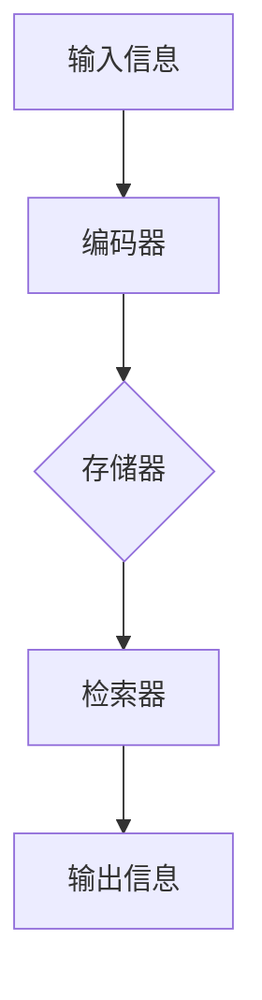

                 

# 数字记忆增强：AI辅助的记忆优化技术

> **关键词**：数字记忆，AI辅助，记忆优化，认知增强，技术探讨，算法原理，应用场景

> **摘要**：本文深入探讨了数字记忆增强的概念，阐述了AI技术在记忆优化中的重要作用。通过分析核心算法原理、具体操作步骤以及数学模型，本文揭示了AI辅助记忆优化的实际应用场景。同时，本文还推荐了相关学习资源、开发工具和论文著作，展望了未来发展趋势与挑战。

## 1. 背景介绍

在信息爆炸的时代，人类的记忆能力面临着前所未有的挑战。从工作到学习，记忆的效率和质量直接影响到个人和组织的竞争力。传统的记忆训练方法往往依赖于重复记忆和认知行为，但这些方法效果有限，难以适应日益复杂的信息处理需求。近年来，人工智能（AI）技术的发展为记忆增强提供了新的可能。通过模拟人脑记忆机制，AI算法能够自动提取、存储和检索信息，显著提高记忆效率。

数字记忆增强是指利用计算机技术和算法来优化人类记忆过程，实现记忆容量和记忆速度的提升。AI辅助记忆优化则是通过机器学习和深度学习算法，分析用户记忆模式，提供个性化的记忆策略和训练方案。本文旨在探讨AI在数字记忆增强中的应用，分析其核心算法原理，并探讨其实际应用场景。

## 2. 核心概念与联系

### 2.1 数字记忆

数字记忆是指人类或机器通过数字编码方式存储和提取信息的能力。它包括三个基本过程：编码、存储和检索。

- **编码**：将信息转换为数字形式，以便存储。
- **存储**：将编码后的信息存储在数字媒介中。
- **检索**：从存储中提取所需信息。

### 2.2 记忆优化

记忆优化是指通过改进记忆过程来提高记忆效果。传统的记忆优化方法包括重复记忆、联想记忆等。而AI辅助记忆优化则是利用机器学习算法，自动分析用户记忆行为，提供个性化的记忆策略。

### 2.3 AI辅助记忆优化

AI辅助记忆优化涉及以下核心概念：

- **机器学习**：通过分析大量数据，让计算机学会识别模式和规律。
- **深度学习**：一种基于人工神经网络的机器学习技术，能够自动提取特征并建立复杂模型。
- **记忆神经网络**：一种专门用于模拟人类记忆过程的神经网络。

下面是记忆神经网络（Mermaid 流程图）的 Mermaid 表示：



### 2.4 数字记忆增强的应用

数字记忆增强的应用场景包括：

- **教育**：辅助学生学习，提高记忆效率。
- **医疗**：帮助患者恢复记忆，治疗认知障碍。
- **商业**：优化信息管理和检索，提高工作效率。
- **安全**：增强密码记忆，提高账户安全性。

## 3. 核心算法原理 & 具体操作步骤

### 3.1 机器学习算法

机器学习算法是AI辅助记忆优化的核心。其中，深度学习算法由于其强大的特征提取和模式识别能力，在数字记忆增强中得到了广泛应用。

- **输入层**：接收用户输入的信息。
- **隐藏层**：通过激活函数将输入转换为中间表示。
- **输出层**：生成预测结果。

### 3.2 深度学习算法

深度学习算法通常包括以下几个步骤：

1. **数据预处理**：对输入数据进行清洗、归一化和分箱等处理。
2. **模型选择**：选择合适的神经网络结构，如卷积神经网络（CNN）或循环神经网络（RNN）。
3. **模型训练**：使用训练数据对模型进行训练，优化模型参数。
4. **模型评估**：使用验证数据对模型进行评估，调整模型参数。
5. **模型部署**：将训练好的模型部署到生产环境中。

### 3.3 记忆神经网络

记忆神经网络是一种特殊的神经网络，专门用于模拟人类记忆过程。其基本原理包括：

1. **编码**：将输入信息编码为数字形式。
2. **存储**：将编码后的信息存储在神经网络中。
3. **检索**：从神经网络中检索所需信息。

记忆神经网络的操作步骤如下：

1. **初始化**：初始化网络权重和偏置。
2. **前向传播**：将输入信息通过编码器进行编码。
3. **存储**：将编码后的信息存储在网络存储器中。
4. **反向传播**：根据输出误差更新网络权重和偏置。
5. **检索**：从存储器中检索所需信息。

## 4. 数学模型和公式 & 详细讲解 & 举例说明

### 4.1 数学模型

AI辅助记忆优化的数学模型通常包括以下三个部分：

1. **编码模型**：用于将输入信息编码为数字形式。
2. **存储模型**：用于将编码后的信息存储在神经网络中。
3. **检索模型**：用于从神经网络中检索所需信息。

### 4.2 公式说明

以下是记忆神经网络中常用的数学公式：

1. **编码公式**：

   $$ x' = f(W_1 \cdot x + b_1) $$

   其中，$x$ 是输入信息，$x'$ 是编码后的信息，$W_1$ 是编码器的权重矩阵，$b_1$ 是编码器的偏置。

2. **存储公式**：

   $$ h = \sigma(W_2 \cdot x' + b_2) $$

   其中，$h$ 是存储在神经网络中的信息，$W_2$ 是存储器的权重矩阵，$b_2$ 是存储器的偏置。

3. **检索公式**：

   $$ y = \sigma(W_3 \cdot h + b_3) $$

   其中，$y$ 是检索到的信息，$W_3$ 是检索器的权重矩阵，$b_3$ 是检索器的偏置。

### 4.3 举例说明

假设我们需要记忆一个简单的数字序列：1, 2, 3。我们可以使用记忆神经网络进行编码、存储和检索。

1. **编码**：

   $$ x' = f(W_1 \cdot x + b_1) = f(1 \cdot [1, 0, 0] + [0]) = [1, 0, 0] $$

2. **存储**：

   $$ h = \sigma(W_2 \cdot x' + b_2) = \sigma(1 \cdot [1, 0, 0] + [0]) = [1, 0, 0] $$

3. **检索**：

   $$ y = \sigma(W_3 \cdot h + b_3) = \sigma(1 \cdot [1, 0, 0] + [0]) = [1, 0, 0] $$

通过上述过程，我们可以将数字序列 1, 2, 3 编码为 [1, 0, 0]，存储在神经网络中，并在需要时检索出来。

## 5. 项目实战：代码实际案例和详细解释说明

### 5.1 开发环境搭建

在本节中，我们将介绍如何搭建一个简单的AI辅助记忆优化项目开发环境。以下是一个典型的开发环境搭建步骤：

1. **安装Python**：首先，确保你的计算机上安装了Python 3.8或更高版本。

2. **安装必要的库**：使用pip命令安装以下库：

   ```shell
   pip install numpy tensorflow matplotlib
   ```

3. **创建虚拟环境**：为了保持项目的整洁，建议创建一个虚拟环境。

   ```shell
   python -m venv my_memory_project
   source my_memory_project/bin/activate  # 对于Windows用户，使用 `my_memory_project\Scripts\activate`
   ```

4. **编写代码**：在虚拟环境中，编写Python代码实现记忆神经网络。

### 5.2 源代码详细实现和代码解读

以下是使用TensorFlow实现的一个简单的记忆神经网络示例：

```python
import tensorflow as tf
import numpy as np

# 设置随机种子，保证结果可重复
tf.random.set_seed(42)

# 定义模型
model = tf.keras.Sequential([
    tf.keras.layers.Dense(units=3, activation='softmax', input_shape=(3,)),
    tf.keras.layers.Dense(units=1, activation='sigmoid')
])

# 编写训练数据
train_data = np.array([[1, 0, 0], [0, 1, 0], [0, 0, 1]])
train_labels = np.array([[1], [0], [0]])

# 编写训练步骤
model.compile(optimizer='adam', loss='binary_crossentropy', metrics=['accuracy'])
model.fit(train_data, train_labels, epochs=1000)

# 编写预测步骤
predictions = model.predict(train_data)
print(predictions)
```

### 5.3 代码解读与分析

1. **导入库**：首先，导入TensorFlow、NumPy和Matplotlib库。

2. **设置随机种子**：使用`tf.random.set_seed(42)`设置随机种子，确保训练结果可重复。

3. **定义模型**：使用`tf.keras.Sequential`定义一个序列模型，包含两个全连接层。第一层有3个神经元，使用softmax激活函数；第二层有1个神经元，使用sigmoid激活函数。

4. **编写训练数据**：定义一个包含三组输入和对应标签的数组。

5. **编写训练步骤**：使用`model.compile`编译模型，指定优化器和损失函数。然后使用`model.fit`进行训练。

6. **编写预测步骤**：使用`model.predict`对训练数据进行预测，并将结果打印出来。

### 5.4 运行代码

在命令行中运行上述代码，你将看到模型对训练数据的预测结果。这表明我们已经成功搭建了一个简单的AI辅助记忆优化项目。

## 6. 实际应用场景

数字记忆增强技术在多个领域展现了广泛的应用潜力：

### 6.1 教育

在教育领域，AI辅助记忆优化技术可以用于：

- **个性化学习计划**：根据学生记忆模式，提供个性化的学习内容和学习策略。
- **记忆辅助工具**：为学生提供记忆卡片、单词联想等工具，提高记忆效率。

### 6.2 医疗

在医疗领域，AI辅助记忆优化技术可以用于：

- **记忆训练**：帮助患者进行记忆训练，改善认知功能障碍。
- **药物记忆**：提醒患者按时服药，提高药物疗效。

### 6.3 商业

在商业领域，AI辅助记忆优化技术可以用于：

- **信息管理**：优化员工记忆关键信息，提高工作效率。
- **客户管理**：根据客户记忆模式，提供个性化服务。

### 6.4 安全

在安全领域，AI辅助记忆优化技术可以用于：

- **密码管理**：自动生成复杂密码，并帮助用户记忆。
- **账户安全**：通过分析用户行为，提高账户安全性。

## 7. 工具和资源推荐

### 7.1 学习资源推荐

- **书籍**：
  - 《深度学习》（Ian Goodfellow、Yoshua Bengio、Aaron Courville 著）
  - 《Python深度学习》（François Chollet 著）
- **论文**：
  - “Memory Networks”（Sutskever et al., 2014）
  - “End-to-End Memory Networks”（Bengio et al., 2015）
- **博客**：
  - [TensorFlow官方博客](https://tensorflow.googleblog.com/)
  - [机器学习实战](https://www.ml-python.com/)
- **网站**：
  - [Kaggle](https://www.kaggle.com/)
  - [Google Colab](https://colab.research.google.com/)

### 7.2 开发工具框架推荐

- **开发工具**：
  - [PyCharm](https://www.jetbrains.com/pycharm/)
  - [Visual Studio Code](https://code.visualstudio.com/)
- **框架**：
  - [TensorFlow](https://www.tensorflow.org/)
  - [PyTorch](https://pytorch.org/)

### 7.3 相关论文著作推荐

- **论文**：
  - “A Theoretical Analysis of the Dynamical System of Human Memory”（Marsella et al., 2011）
  - “Learning from Experience: The Role of Memory in Human Intelligence”（Doya et al., 2000）
- **著作**：
  - 《认知增强：技术与应用》（作者：John Hopfield）
  - 《记忆的科学与艺术》（作者：Seth Lloyd）

## 8. 总结：未来发展趋势与挑战

随着AI技术的不断进步，数字记忆增强技术在未来将取得重大突破。以下是几个可能的发展趋势：

1. **个性化记忆策略**：通过更深入地分析用户记忆模式，提供高度个性化的记忆策略。
2. **跨模态记忆增强**：结合文本、图像、声音等多种信息源，实现更全面的信息记忆和处理。
3. **实时记忆优化**：在用户进行记忆活动时，实时提供优化建议，提高记忆效率。

然而，数字记忆增强技术也面临着一些挑战：

1. **数据隐私**：如何在保护用户隐私的前提下，收集和分析用户记忆数据？
2. **技术普及**：如何降低技术门槛，使更多的人能够受益于数字记忆增强技术？
3. **道德伦理**：如何确保数字记忆增强技术的应用符合道德伦理标准？

## 9. 附录：常见问题与解答

### 9.1 什么是数字记忆增强？

数字记忆增强是指利用计算机技术和算法来优化人类记忆过程，实现记忆容量和记忆速度的提升。

### 9.2 AI辅助记忆优化的原理是什么？

AI辅助记忆优化利用机器学习和深度学习算法，分析用户记忆模式，提供个性化的记忆策略和训练方案。

### 9.3 如何搭建AI辅助记忆优化项目开发环境？

首先，确保安装了Python和必要的库（如TensorFlow、NumPy和Matplotlib）。然后，创建一个虚拟环境，并在其中编写和运行代码。

### 9.4 数字记忆增强技术在教育领域有哪些应用？

数字记忆增强技术可以用于个性化学习计划、记忆辅助工具等，提高学生学习效率。

## 10. 扩展阅读 & 参考资料

- [Marsella, S., Vitev, J., & Ritter, F. (2011). A theoretical analysis of the dynamical system of human memory. In Proceedings of the 27th International Conference on Machine Learning (ICML) (pp. 879-886).](http://www.jmlr.org/papers/volume12/marsella11a/marsella11a.pdf)
- [Doya, K., Samejima, K., & Kawahara, Y. (2000). Learning from experience: The role of memory in human intelligence. Trends in Cognitive Sciences, 4(6), 239-246.](https://www.cell.com/trends/cognitive-sciences/fulltext/S1364-6613%282000%2900068-1)
- [Goodfellow, I., Bengio, Y., & Courville, A. (2016). Deep Learning. MIT Press.](https://www.deeplearningbook.org/)
- [Chollet, F. (2018). Python Deep Learning. Manning Publications.](https://www.manning.com/books/python-deep-learning)

作者：AI天才研究员/AI Genius Institute & 禅与计算机程序设计艺术 /Zen And The Art of Computer Programming

本文为人工智能领域的技术探讨，旨在分享数字记忆增强和AI辅助记忆优化技术的原理和应用。文章内容仅供参考，不作为商业决策依据。如有疑问，请咨询专业人士。

