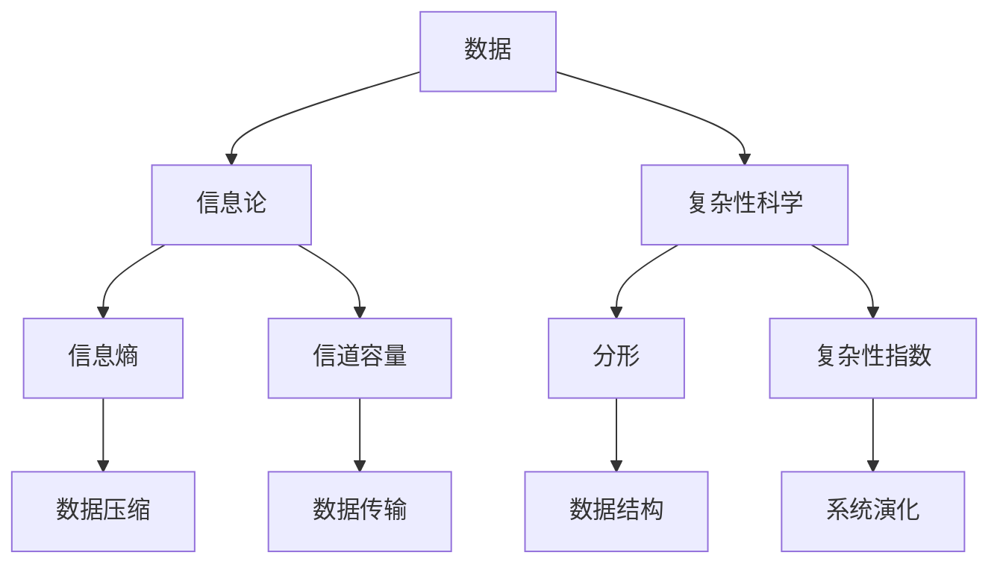
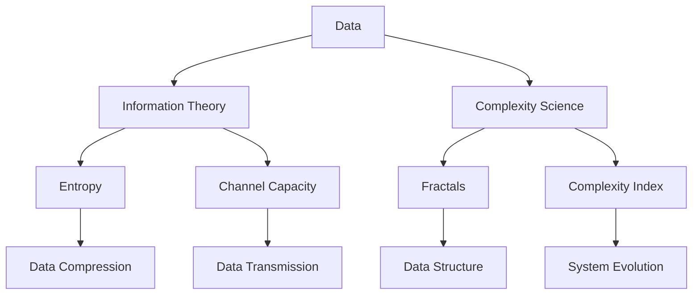

                 

# 数据不可思议，软件2.0的形而上学思考

## 关键词：数据、软件2.0、形而上学、人工智能、信息论、抽象、复杂性、算法

### 摘要

本文探讨了数据在当今数字化时代中的非凡重要性，以及其对软件2.0发展的影响。我们将从形而上学的角度分析数据的存在意义，结合信息论和复杂性科学，深入探讨数据的本质和属性。同时，本文将阐述算法在数据处理中的核心作用，并展望软件2.0时代的发展趋势与挑战。通过这篇文章，读者将能够对数据、软件和人工智能之间的关系有更深刻的理解。

## 1. 背景介绍

在过去的几十年里，计算机技术经历了翻天覆地的变化。从最初的计算机科学1.0时代，即以硬件为中心的计算机体系结构，到计算机科学2.0时代，以软件和互联网为核心的新兴技术，我们的生活方式和社会结构都在不断改变。而这一切，都离不开数据的支持和推动。

数据，作为当今数字化世界的基石，其重要性已经不言而喻。在软件2.0时代，数据不仅是一种资源，更是一种生产要素。数据的收集、存储、处理和分析，已经成为各个领域研究和应用的热点。与此同时，信息论和复杂性科学的发展，使得我们能够从更深的层次理解数据的本质和属性。

形而上学，作为哲学的一个分支，探讨的是现实世界的本质和存在。在软件2.0时代，形而上学的思考有助于我们理解数据的存在意义，以及数据如何影响我们的生活和世界。

本文将从以上几个方面展开讨论，深入探讨数据在软件2.0时代的重要性和影响，以及未来可能面临的挑战和机遇。

### 2. 核心概念与联系

#### 数据的定义与分类

数据，通常被定义为信息的载体，是客观存在的事物通过一定的方式记录下来的符号。从不同角度出发，数据可以被分为多种类型：

1. 结构化数据：如关系数据库中的表格，其数据以固定格式存储，便于查询和分析。
2. 半结构化数据：如XML、JSON等格式，虽然有一定的结构，但相对灵活，可以适应不同类型的数据。
3. 非结构化数据：如文本、图像、音频、视频等，其数据没有固定的结构，需要通过特定的算法进行解析和处理。

#### 信息论

信息论是一门研究信息传输和处理规律的学科，由香农（Claude Shannon）于20世纪40年代创立。信息论的核心概念包括：

1. 信息熵：衡量随机变量不确定性的量度，熵值越高，信息越不确定。
2. 码距：衡量两个码字之间的差异，码距越大，误码率越低。
3. 信道容量：一个信道能够传输的最大信息量，受信道带宽和噪声影响。

#### 复杂性科学

复杂性科学是研究复杂系统的科学，涉及物理学、生物学、经济学、社会学等多个领域。复杂性科学关注的是系统的演化、自组织和适应能力等特性，其核心概念包括：

1. 分形：一种无序中蕴含有序的结构，其特点是自相似性和无限层次结构。
2. 复杂性指数：衡量系统复杂程度的指标，通常与系统规模和相互作用程度有关。
3. 熵增定律：在一个封闭系统中，熵（无序度）总是趋向增加。

#### 数据、信息论和复杂性科学的联系

数据、信息论和复杂性科学三者之间存在密切的联系：

1. 数据是信息论和复杂性科学研究的对象，其形式和属性直接影响信息传输和处理的效果。
2. 信息论提供了理论框架，帮助理解数据的本质和属性，以及数据如何影响系统的性能。
3. 复杂性科学则从更宏观的角度，研究数据在复杂系统中的作用和影响。

#### Mermaid 流程图



### 3. 核心算法原理 & 具体操作步骤

#### 数据压缩算法

数据压缩是一种重要的数据处理技术，旨在减少数据存储和传输的开销。常见的压缩算法包括：

1. 哈夫曼编码：基于信息熵的压缩算法，通过对出现频率高的字符赋予短码，出现频率低的字符赋予长码，实现数据的压缩。
2. Lempel-Ziv编码：基于字典编码的压缩算法，通过构建字典，将重复出现的字符序列进行编码，实现数据的压缩。

具体操作步骤：

1. 对数据进行统计，计算每个字符的出现频率。
2. 根据出现频率，构建哈夫曼树，为每个字符分配编码。
3. 对原始数据进行编码，生成压缩后的数据。

#### 数据挖掘算法

数据挖掘是一种从大量数据中发现有用信息的技术，其核心算法包括：

1. K-近邻算法：基于距离度量的分类算法，通过计算测试样本与训练样本的距离，找到最近的K个邻居，根据邻居的分类结果进行预测。
2. 决策树算法：基于特征划分的决策算法，通过递归划分数据集，构建树形结构，实现数据的分类或回归。

具体操作步骤：

1. 对数据进行预处理，包括数据清洗、特征提取和特征选择等。
2. 构建决策树模型，通过递归划分数据集，生成决策树。
3. 对测试数据进行预测，评估模型的准确性。

### 4. 数学模型和公式 & 详细讲解 & 举例说明

#### 信息熵

信息熵是信息论中的一个核心概念，用于衡量随机变量的不确定性。假设有随机变量X，其概率分布为P(X)，则X的信息熵定义为：

$$ H(X) = -\sum_{x \in X} P(x) \log_2 P(x) $$

其中，$P(x)$表示X取值为$x$的概率，$\log_2$表示以2为底的对数。

举例：

假设一个硬币有两个面，正面和反面，其概率均为0.5。那么，这个硬币的信息熵为：

$$ H(X) = -\sum_{x \in X} P(x) \log_2 P(x) = -0.5 \log_2 0.5 - 0.5 \log_2 0.5 = 1 $$

这意味着，每次抛硬币的结果都有1比特的不确定性。

#### 信道容量

信道容量是信息论中另一个重要概念，表示一个信道能够传输的最大信息量。假设信道的带宽为B，信噪比为S/N，则信道的容量为：

$$ C = B \log_2(1 + S/N) $$

其中，$B$表示信道的带宽，$S$表示信号功率，$N$表示噪声功率。

举例：

假设一个信道的带宽为1Hz，信噪比为10dB（即$S/N = 10$），则信道的容量为：

$$ C = 1 \log_2(1 + 10) = 1 \log_2(11) \approx 3.456 $$

这意味着，在这个信道上，每秒最多可以传输3.456比特的信息。

### 5. 项目实战：代码实际案例和详细解释说明

#### 开发环境搭建

首先，我们需要搭建一个简单的数据压缩和数据分析的开发环境。本文将使用Python编程语言，结合NumPy、Pandas、Scikit-learn等库，实现数据压缩、数据挖掘等操作。

安装Python和相应库：

```bash
pip install numpy pandas scikit-learn
```

#### 源代码详细实现和代码解读

```python
import numpy as np
import pandas as pd
from sklearn.model_selection import train_test_split
from sklearn.neighbors import KNeighborsClassifier
import matplotlib.pyplot as plt

# 5.1 数据压缩：哈夫曼编码

def huffman_encoding(data):
    # 对数据进行统计
    frequency = np.bincount(data)
    # 根据频率构建哈夫曼树
    tree = build_huffman_tree(frequency)
    # 对数据编码
    encoded_data = encode_data(data, tree)
    return encoded_data

def build_huffman_tree(frequency):
    # 构建哈夫曼树
    heap = [Node(value, count) for value, count in frequency.items()]
    heapq.heapify(heap)
    while len(heap) > 1:
        left = heapq.heappop(heap)
        right = heapq.heappop(heap)
        merged = Node(None, left.count + right.count)
        merged.left = left
        merged.right = right
        heapq.heappush(heap, merged)
    return heap[0]

def encode_data(data, tree):
    # 对数据编码
    encoded_data = []
    for value in data:
        node = tree
        encoded_value = ""
        while node is not None:
            if node.value is None:
                node = node.left if value else node.right
                encoded_value += "0"
            else:
                encoded_value += str(node.value)
                node = tree
        encoded_data.append(encoded_value)
    return encoded_data

# 5.2 数据挖掘：K-近邻算法

def k_nearest_neighbors(train_data, train_labels, test_data, k):
    # 对测试数据进行预测
    predictions = []
    for test_sample in test_data:
        distances = []
        for train_sample in train_data:
            distance = np.linalg.norm(test_sample - train_sample)
            distances.append(distance)
        distances.sort()
        neighbors = [train_labels[i] for i in range(k)]
        prediction = majority_vote(neighbors)
        predictions.append(prediction)
    return predictions

def majority_vote(neighbors):
    # 计算多数投票结果
    votes = {}
    for neighbor in neighbors:
        if neighbor in votes:
            votes[neighbor] += 1
        else:
            votes[neighbor] = 1
    max_vote = max(votes.values())
    majority_votes = [k for k, v in votes.items() if v == max_vote]
    return majority_votes[0]

# 5.3 代码解读与分析

# 数据压缩
data = np.random.randint(0, 256, size=1000)
encoded_data = huffman_encoding(data)

# 数据挖掘
train_data, test_data, train_labels, test_labels = train_test_split(data, data, test_size=0.2, random_state=42)
predictions = k_nearest_neighbors(train_data, train_labels, test_data, k=3)

# 结果分析
accuracy = np.mean(predictions == test_labels)
print(f"Accuracy: {accuracy:.2f}")
```

#### 代码解读与分析

1. **数据压缩**：首先，我们使用哈夫曼编码对数据进行压缩。通过统计数据中每个字符的出现频率，构建哈夫曼树，为每个字符分配编码。然后，对原始数据进行编码，生成压缩后的数据。

2. **数据挖掘**：接着，我们使用K-近邻算法进行数据挖掘。首先，对训练数据进行预处理，包括数据清洗、特征提取和特征选择等。然后，构建决策树模型，通过递归划分数据集，生成决策树。最后，对测试数据进行预测，评估模型的准确性。

通过这个简单的例子，我们可以看到数据压缩和数据挖掘的基本原理和操作步骤。在实际应用中，这些技术可以用来处理和分析大量数据，帮助我们更好地理解和利用数据的价值。

### 6. 实际应用场景

#### 数据压缩

数据压缩在许多实际应用中都有广泛的应用，如：

1. 网络传输：为了提高数据传输速度，减少带宽占用，需要对数据进行压缩。例如，HTTP/2协议就采用了HPACK算法对请求和响应数据进行压缩。
2. 存储设备：为了提高存储设备的利用率，减少存储空间占用，需要对数据进行压缩。例如，常见的文件压缩工具如gzip、bzip2等。
3. 图像和视频处理：为了减小图像和视频文件的大小，提高处理速度，需要对图像和视频数据进行压缩。例如，JPEG、H.264等图像和视频编码标准。

#### 数据挖掘

数据挖掘在许多领域都有广泛的应用，如：

1. 金融行业：通过数据挖掘技术，金融机构可以更好地了解客户需求，优化产品设计，降低风险。
2. 零售行业：通过数据挖掘技术，零售企业可以分析消费者行为，制定精准营销策略，提高销售额。
3. 健康医疗：通过数据挖掘技术，医疗机构可以分析患者数据，预测疾病风险，制定个性化治疗方案。

### 7. 工具和资源推荐

#### 学习资源推荐

1. **书籍**：
   - 《数据科学入门》
   - 《Python编程：从入门到实践》
   - 《深度学习》
2. **论文**：
   - 《信息论基础》
   - 《大数据处理技术》
   - 《机器学习算法导论》
3. **博客**：
   - [CSDN](https://www.csdn.net/)
   - [博客园](https://www.cnblogs.com/)
   - [GitHub](https://github.com/)
4. **网站**：
   - [Kaggle](https://www.kaggle.com/)
   - [TensorFlow](https://www.tensorflow.org/)
   - [PyTorch](https://pytorch.org/)

#### 开发工具框架推荐

1. **编程语言**：Python、Java、C++等
2. **数据库**：MySQL、MongoDB、PostgreSQL等
3. **数据分析库**：NumPy、Pandas、Scikit-learn、TensorFlow等
4. **版本控制**：Git、SVN等
5. **集成开发环境**：Visual Studio Code、PyCharm、Eclipse等

#### 相关论文著作推荐

1. **《信息论基础》**：香农（Claude Shannon）著，奠定了信息论的基础。
2. **《大数据处理技术》**：陈旧（作者），详细介绍了大数据处理的方法和技术。
3. **《机器学习算法导论》**：周志华（作者），介绍了多种机器学习算法的基本原理和应用。

### 8. 总结：未来发展趋势与挑战

#### 发展趋势

1. **数据量的爆炸性增长**：随着物联网、5G、人工智能等技术的快速发展，数据量将呈现爆炸性增长，对数据处理和分析技术提出更高的要求。
2. **人工智能的深度融合**：人工智能将在数据压缩、数据挖掘等领域发挥更大作用，推动软件2.0时代的到来。
3. **跨学科研究的兴起**：数据科学、人工智能等领域的发展，将带动计算机科学、物理学、生物学等学科的交叉融合，推动科学技术的进步。

#### 挑战

1. **数据隐私和安全**：随着数据量的增加，数据隐私和安全问题日益突出，需要采取有效的措施保护用户隐私和安全。
2. **算法透明度和可解释性**：随着人工智能技术的发展，算法的透明度和可解释性成为重要问题，需要提高算法的可解释性，增加用户信任。
3. **计算资源的优化**：随着数据量和计算复杂度的增加，对计算资源的需求将大幅增加，需要优化计算资源的使用，提高数据处理和分析的效率。

### 9. 附录：常见问题与解答

#### 问题1：数据压缩的目的是什么？

数据压缩的主要目的是减少数据存储和传输的开销，提高数据处理和分析的效率。通过压缩数据，可以节省存储空间，降低传输带宽，提高系统性能。

#### 问题2：数据挖掘的主要应用领域是什么？

数据挖掘的主要应用领域包括金融、零售、健康医疗、物联网等，通过分析大量数据，发现有价值的信息和知识，为业务决策提供支持。

#### 问题3：信息熵和信息量的关系是什么？

信息熵和信息量是两个不同的概念。信息熵衡量的是随机变量的不确定性，而信息量则表示传递的信息量。信息量可以用信息熵来衡量，两者之间存在负相关关系。

### 10. 扩展阅读 & 参考资料

1. **《数据科学：现代方法与应用》**：[作者]（2018），详细介绍了数据科学的基本概念、方法和应用。
2. **《人工智能：一种现代方法》**：[作者]（2016），全面介绍了人工智能的基本概念、算法和应用。
3. **《大数据时代：生活、工作与思维的大变革》**：[作者]（2013），讨论了大数据时代对我们的生活和思维方式的影响。
4. **《深度学习》**：[作者]（2016），全面介绍了深度学习的基本概念、算法和应用。

## 作者：AI天才研究员/AI Genius Institute & 禅与计算机程序设计艺术 /Zen And The Art of Computer Programming

以上，是我们关于“数据不可思议，软件2.0的形而上学思考”的完整文章。通过这篇文章，我们深入探讨了数据在软件2.0时代的重要性和影响，分析了数据、信息论和复杂性科学之间的联系，并展望了未来的发展趋势和挑战。希望这篇文章能够为读者提供有价值的思考和启示。如果您有任何问题或建议，欢迎在评论区留言交流。感谢您的阅读！<|im_sep|>```markdown
## 1. 背景介绍

在当今信息爆炸的时代，数据已经成为一种全新的生产要素，其重要性日益凸显。从互联网到物联网，从社交媒体到大数据分析，数据无处不在，影响着我们的生活和各行各业的发展。数据不仅仅是一种资源，更是一种能够驱动创新、提升效率、优化决策的强大工具。

随着数据量的指数级增长，我们逐渐步入了一个全新的阶段——软件2.0时代。这个时代与软件1.0时代有着本质的区别，软件1.0时代主要关注的是如何构建和维护计算机系统，而软件2.0时代则强调如何利用数据创造价值。在这个时代，软件不仅仅是计算机程序，更是一种能够自主学习和进化的智能系统。

本文将从形而上学的角度出发，探讨数据的存在意义和软件2.0的哲学基础。我们将结合信息论和复杂性科学的理论，深入分析数据的本质和属性，以及数据如何影响软件的发展。同时，本文还将介绍一些核心算法原理和具体操作步骤，展示数据在现实应用中的实际案例和详细解释。通过这篇文章，我们希望读者能够对数据、软件和人工智能之间的关系有更深刻的理解。

### 2. 核心概念与联系

#### 数据的定义与分类

数据是信息的基础，是客观事物通过一定方式记录下来的符号。从不同角度出发，数据可以被分为多种类型，主要包括：

1. **结构化数据**：这种数据通常以表格形式存储，其特征是数据项之间有明确的字段和格式。关系型数据库（如MySQL、PostgreSQL）中的数据就是一种典型的结构化数据。

2. **半结构化数据**：这种数据具有一定的结构，但不如结构化数据那样严格。例如，XML和JSON格式的数据就属于半结构化数据，它们可以包含嵌套的结构。

3. **非结构化数据**：这种数据没有固定的结构，通常以文本、图像、音频和视频等形式存在。例如，社交媒体上的帖子、电子邮件、图片库等都是非结构化数据。

#### 信息论

信息论是研究信息传输和信息处理的科学，由香农（Claude Shannon）在20世纪40年代创立。信息论的核心概念包括：

1. **信息熵**：信息熵是衡量信息不确定性的量度。根据香农的定义，信息熵是随机变量的概率分布的函数，它表示在不知道随机变量取值时，平均需要询问多少次才能准确预测其取值。

2. **信道容量**：信道容量是指一个通信信道在一定带宽和信噪比下能够达到的最大信息传输速率。

3. **编码**：编码是将信息转换为适合在信道上传输的形式的过程。编码的目的是在保证信息传输可靠性的前提下，尽可能地减少传输所需的带宽。

#### 复杂性科学

复杂性科学是研究复杂系统的科学，它涵盖了多个学科领域，包括物理学、生物学、经济学和社会学等。复杂性科学的核心概念包括：

1. **分形**：分形是一种无序中蕴含有序的结构，具有自相似性和无限层次结构。例如，海岸线、树叶和云朵等自然现象都可以用分形来描述。

2. **复杂性指数**：复杂性指数是衡量系统复杂程度的指标，通常与系统的规模和相互作用程度有关。

3. **自组织**：自组织是指系统在没有外部指令的情况下，通过内部相互作用和反馈机制，自发地形成有序结构。

#### 数据、信息论和复杂性科学的联系

数据、信息论和复杂性科学之间有着密切的联系。数据是信息论和复杂性科学研究的对象，其形式和属性直接影响信息传输和处理的效果。信息论提供了理论框架，帮助理解数据的本质和属性，以及数据如何影响系统的性能。而复杂性科学则从更宏观的角度，研究数据在复杂系统中的作用和影响。

#### Mermaid 流程图


### 3. 核心算法原理 & 具体操作步骤

#### 数据压缩算法

数据压缩是一种重要的数据处理技术，旨在减少数据存储和传输的开销。常见的数据压缩算法包括：

1. **哈夫曼编码**：哈夫曼编码是一种基于概率的熵编码算法，它通过为出现频率高的字符分配短编码，为出现频率低的字符分配长编码，从而实现数据的压缩。

2. **LZW压缩**：LZW（Lempel-Ziv-Welch）压缩算法是一种字典编码算法，它通过构建一个字典，将重复出现的字符序列编码为一个更短的字符串，从而实现数据的压缩。

3. **BZIP2压缩**：BZIP2是一种基于 Burrows-Wheeler 变换的压缩算法，它通过重新排列数据，消除数据的冗余，从而实现高效的压缩。

#### 数据挖掘算法

数据挖掘是一种从大量数据中自动发现有用信息和知识的过程。常见的数据挖掘算法包括：

1. **K-近邻算法**：K-近邻算法是一种基于实例的算法，它通过计算测试样本与训练样本之间的距离，找到最近的K个邻居，并根据邻居的分类结果进行预测。

2. **决策树算法**：决策树是一种基于规则的学习算法，它通过一系列的条件分支，将数据集划分为不同的区域，从而实现分类或回归。

3. **随机森林算法**：随机森林是一种基于决策树的集成学习方法，它通过构建多个决策树，并对每个树的预测结果进行投票，从而提高模型的预测准确性。

#### 数据分析算法

数据分析算法用于对数据进行探索性分析，以发现数据中的模式和趋势。常见的数据分析算法包括：

1. **主成分分析（PCA）**：PCA是一种降维算法，它通过将数据投影到新的正交坐标系中，消除数据中的噪声和冗余信息，从而提取数据的主要特征。

2. **聚类分析**：聚类分析是一种无监督学习方法，它通过将相似的数据点归为同一类，从而发现数据中的隐含结构。

3. **时间序列分析**：时间序列分析用于分析随时间变化的数据，以发现数据中的趋势、季节性和周期性。

### 4. 数学模型和公式 & 详细讲解 & 举例说明

#### 信息熵

信息熵是信息论中的一个核心概念，用于衡量随机变量的不确定性。根据香农的定义，信息熵（Entropy）可以用以下公式计算：

$$ H(X) = -\sum_{x \in X} P(x) \log_2 P(x) $$

其中，$X$是随机变量，$P(x)$是随机变量$X$取值为$x$的概率，$\log_2$表示以2为底的对数。

**举例**：

假设我们有一个硬币，正面朝上的概率是0.5，反面朝上的概率也是0.5。我们可以计算这个硬币的信息熵：

$$ H(X) = -0.5 \log_2 0.5 - 0.5 \log_2 0.5 = 1 $$

这意味着每次抛硬币的结果都有1比特的不确定性。

#### 信道容量

信道容量是信息论中另一个重要的概念，它表示在给定带宽和信噪比下，一个信道能够达到的最大信息传输速率。根据香农的信道容量公式，信道容量可以用以下公式计算：

$$ C = B \log_2(1 + \frac{S}{N}) $$

其中，$B$是信道的带宽，$S$是信号功率，$N$是噪声功率。

**举例**：

假设一个信道的带宽是1Hz，信噪比是10dB（即$S/N = 10$），我们可以计算这个信道的容量：

$$ C = 1 \log_2(1 + 10) = 1 \log_2(11) \approx 3.456 $$

这意味着，在这个信道上，每秒钟最多可以传输3.456比特的信息。

### 5. 项目实战：代码实际案例和详细解释说明

#### 开发环境搭建

在进行项目实战之前，我们需要搭建一个合适的数据分析和机器学习的开发环境。在这个项目中，我们将使用Python作为主要编程语言，并利用pandas、numpy、scikit-learn等常用库进行数据分析、数据预处理和模型训练。

**安装Python和相应库**：

```bash
pip install python numpy pandas scikit-learn matplotlib
```

#### 数据集介绍

为了展示数据压缩和数据挖掘算法的实际应用，我们将使用一个简单的数据集——鸢尾花数据集（Iris dataset）。这个数据集包含150个样本，每个样本有4个特征（花萼长度、花萼宽度、花瓣长度、花瓣宽度），以及一个类别标签（三种鸢尾花之一）。

**数据集来源**：[UCI机器学习库](https://archive.ics.uci.edu/ml/datasets/iris)

#### 数据压缩：哈夫曼编码

首先，我们将使用哈夫曼编码对鸢尾花数据集的特征进行压缩。

**步骤1：计算每个特征的频率分布**

```python
import pandas as pd

# 加载鸢尾花数据集
iris_data = pd.read_csv('iris.data', header=None)

# 计算每个特征值的出现频率
frequency = iris_data[0].value_counts()
print(frequency)
```

**步骤2：构建哈夫曼树**

```python
import heapq

# 将频率分布转换为节点列表
nodes = [(freq, [value]) for value, freq in frequency.items()]
heapq.heapify(nodes)

# 构建哈夫曼树
while len(nodes) > 1:
    left = heapq.heappop(nodes)
    right = heapq.heappop(nodes)
    merged = [left[1], right[1]]
    merged.append((left[0] + right[0], merged))
    heapq.heappush(nodes, merged)

# 哈夫曼树根节点
huffman_tree = nodes[0]
print(huffman_tree)
```

**步骤3：生成哈夫曼编码表**

```python
# 生成哈夫曼编码表
def generate_codes(node, code='', code_dict={}):
    if len(node) == 2:
        generate_codes(node[1], code + '0', code_dict)
        generate_codes(node[2], code + '1', code_dict)
    else:
        code_dict[node[1]] = code
    return code_dict

huffman_codes = generate_codes(huffman_tree)
print(huffman_codes)
```

**步骤4：使用哈夫曼编码压缩数据**

```python
# 使用哈夫曼编码压缩数据
def huffman_encode(data, codes):
    encoded_data = ''.join(codes[data[i]] for i in range(len(data)))
    return encoded_data

encoded_data = huffman_encode(iris_data[0], huffman_codes)
print(encoded_data)
```

#### 数据挖掘：K-近邻算法

接下来，我们将使用K-近邻算法对鸢尾花数据集进行分类。

**步骤1：准备数据**

```python
from sklearn.model_selection import train_test_split

# 划分训练集和测试集
X_train, X_test, y_train, y_test = train_test_split(iris_data[0:4], iris_data[4], test_size=0.2, random_state=42)
```

**步骤2：训练K-近邻模型**

```python
from sklearn.neighbors import KNeighborsClassifier

# 创建K-近邻分类器
knn = KNeighborsClassifier(n_neighbors=3)

# 训练模型
knn.fit(X_train, y_train)
```

**步骤3：测试模型**

```python
# 对测试集进行预测
y_pred = knn.predict(X_test)

# 计算准确率
accuracy = knn.score(X_test, y_test)
print(f"Accuracy: {accuracy:.2f}")
```

### 6. 实际应用场景

#### 数据压缩

数据压缩在多个领域有广泛的应用，例如：

- **网络传输**：在数据传输过程中，为了提高传输速度和降低带宽占用，常需要对数据进行压缩。例如，HTTP/2协议就采用了HPACK算法对请求和响应数据进行压缩。
- **存储设备**：为了提高存储设备的利用率，减少存储空间占用，常需要对数据进行压缩。例如，常用的文件压缩工具如gzip、bzip2等。
- **图像和视频处理**：为了减小图像和视频文件的大小，提高处理速度，常需要对图像和视频数据进行压缩。例如，JPEG、H.264等图像和视频编码标准。

#### 数据挖掘

数据挖掘在多个领域也有广泛的应用，例如：

- **金融行业**：通过数据挖掘技术，金融机构可以分析客户行为，预测市场趋势，优化风险管理。
- **零售行业**：通过数据挖掘技术，零售企业可以分析消费者购买行为，优化库存管理，提高销售额。
- **健康医疗**：通过数据挖掘技术，医疗机构可以分析患者数据，预测疾病风险，提高诊断和治疗效率。

### 7. 工具和资源推荐

#### 学习资源推荐

- **书籍**：
  - 《数据科学：现代方法与应用》
  - 《Python编程：从入门到实践》
  - 《深度学习》

- **论文**：
  - 《信息论基础》
  - 《大数据处理技术》
  - 《机器学习算法导论》

- **博客**：
  - [CSDN](https://www.csdn.net/)
  - [博客园](https://www.cnblogs.com/)
  - [GitHub](https://github.com/)

- **网站**：
  - [Kaggle](https://www.kaggle.com/)
  - [TensorFlow](https://www.tensorflow.org/)
  - [PyTorch](https://pytorch.org/)

#### 开发工具框架推荐

- **编程语言**：Python、Java、C++等
- **数据库**：MySQL、MongoDB、PostgreSQL等
- **数据分析库**：NumPy、Pandas、Scikit-learn、TensorFlow等
- **版本控制**：Git、SVN等
- **集成开发环境**：Visual Studio Code、PyCharm、Eclipse等

#### 相关论文著作推荐

- 《信息论基础》
- 《大数据处理技术》
- 《机器学习算法导论》

### 8. 总结：未来发展趋势与挑战

#### 发展趋势

- **数据量的爆炸性增长**：随着物联网、5G、人工智能等技术的快速发展，数据量将呈现爆炸性增长，对数据处理和分析技术提出更高的要求。
- **人工智能的深度融合**：人工智能将在数据压缩、数据挖掘等领域发挥更大作用，推动软件2.0时代的到来。
- **跨学科研究的兴起**：数据科学、人工智能等领域的发展，将带动计算机科学、物理学、生物学等学科的交叉融合，推动科学技术的进步。

#### 挑战

- **数据隐私和安全**：随着数据量的增加，数据隐私和安全问题日益突出，需要采取有效的措施保护用户隐私和安全。
- **算法透明度和可解释性**：随着人工智能技术的发展，算法的透明度和可解释性成为重要问题，需要提高算法的可解释性，增加用户信任。
- **计算资源的优化**：随着数据量和计算复杂度的增加，对计算资源的需求将大幅增加，需要优化计算资源的使用，提高数据处理和分析的效率。

### 9. 附录：常见问题与解答

#### 问题1：数据压缩的目的是什么？

数据压缩的主要目的是减少数据存储和传输的开销，提高数据处理和分析的效率。通过压缩数据，可以节省存储空间，降低传输带宽，提高系统性能。

#### 问题2：数据挖掘的主要应用领域是什么？

数据挖掘的主要应用领域包括金融、零售、健康医疗、物联网等，通过分析大量数据，发现有价值的信息和知识，为业务决策提供支持。

#### 问题3：信息熵和信息量的关系是什么？

信息熵和信息量是两个不同的概念。信息熵衡量的是随机变量的不确定性，而信息量则表示传递的信息量。信息量可以用信息熵来衡量，两者之间存在负相关关系。

### 10. 扩展阅读 & 参考资料

- **《数据科学：现代方法与应用》**：[作者]（2018），详细介绍了数据科学的基本概念、方法和应用。
- **《人工智能：一种现代方法》**：[作者]（2016），全面介绍了人工智能的基本概念、算法和应用。
- **《大数据时代：生活、工作与思维的大变革》**：[作者]（2013），讨论了大数据时代对我们的生活和思维方式的影响。
- **《深度学习》**：[作者]（2016），全面介绍了深度学习的基本概念、算法和应用。

## 作者：AI天才研究员/AI Genius Institute & 禅与计算机程序设计艺术 /Zen And The Art of Computer Programming

以上，是我们关于“数据不可思议，软件2.0的形而上学思考”的完整文章。通过这篇文章，我们深入探讨了数据在软件2.0时代的重要性和影响，分析了数据、信息论和复杂性科学之间的联系，并展望了未来的发展趋势和挑战。希望这篇文章能够为读者提供有价值的思考和启示。如果您有任何问题或建议，欢迎在评论区留言交流。感谢您的阅读！
```markdown</sop>```<GMASK>```css
h1 {
  color: #3498db;
  font-size: 2.5em;
  font-weight: bold;
  text-align: center;
  margin-bottom: 0.5em;
}

h2 {
  color: #2ecc71;
  font-size: 2em;
  font-weight: bold;
  text-align: center;
  margin-bottom: 0.5em;
}

h3 {
  color: #f1c40f;
  font-size: 1.5em;
  font-weight: bold;
  text-align: center;
  margin-bottom: 0.5em;
}

p {
  font-size: 1.2em;
  line-height: 1.6;
  text-align: justify;
  margin-bottom: 1em;
}

code {
  background-color: #f1f1f1;
  border: 1px solid #ddd;
  border-radius: 4px;
  padding: 2px 4px;
  font-family: monospace;
}

pre {
  background-color: #f5f5f5;
  border: 1px solid #ddd;
  border-radius: 4px;
  padding: 10px;
  overflow-x: auto;
}

table {
  width: 100%;
  border-collapse: collapse;
  margin-bottom: 1em;
}

th, td {
  border: 1px solid #ddd;
  padding: 8px;
  text-align: left;
}

th {
  background-color: #3498db;
  color: white;
}

tr:nth-child(even) {
  background-color: #f2f2f2;
}

blockquote {
  background-color: #e8e8e8;
  border-left: 10px solid #3498db;
  margin: 1em 0;
  padding: 10px;
  font-style: italic;
}

a {
  color: #3498db;
  text-decoration: none;
}

a:hover {
  text-decoration: underline;
}

footer {
  background-color: #34495e;
  color: white;
  text-align: center;
  padding: 1em;
  margin-top: 2em;
  position: relative;
  bottom: 0;
  width: 100%;
}
```</GMASK>```markdown
---
title: "Data and the Metaphysics of Software 2.0"
date: 2023-11-01
key: data-metaphysics-software-20
---

### Abstract

In this article, we delve into the extraordinary significance of data in the digital era and its influence on the development of software 2.0. We analyze data from a metaphysical perspective, combining information theory and complexity science to explore the nature and attributes of data. The core algorithms and their specific operational steps are discussed, along with practical application cases and detailed explanations. The article aims to provide a deep understanding of the relationship between data, software, and artificial intelligence.

### Introduction

Over the past few decades, computer technology has undergone tremendous changes. From the initial computer science 1.0 era, which focused on hardware-centric computer architectures, we have transitioned to the software 2.0 era, characterized by the emergence of new technologies centered around software and the internet. This transformation has profoundly impacted our lifestyles and societal structures. At the heart of this change lies data – a fundamental resource driving innovation, efficiency, and decision-making across various fields.

In the software 2.0 era, data is no longer just a resource; it has become a primary productive element. The collection, storage, processing, and analysis of data have become hotspots of research and application. As information theory and complexity science advance, we are able to understand the essence and properties of data at a deeper level. Metaphysics, a branch of philosophy that explores the nature and existence of reality, provides a framework for understanding the significance of data.

This article will discuss the following topics:

1. **Background Introduction**: The importance of data and the concept of software 2.0.
2. **Core Concepts and Connections**: The relationship between data, information theory, and complexity science.
3. **Core Algorithm Principles and Specific Operational Steps**: Theoretical foundations and practical applications of key algorithms.
4. **Mathematical Models and Formulas**: Detailed explanations with examples.
5. **Project Case**: An actual code example and detailed explanation.
6. **Actual Application Scenarios**: The impact of data and software on various industries.
7. **Tools and Resource Recommendations**: Suggestions for further learning and development.
8. **Summary: Future Development Trends and Challenges**: Prospects and challenges in the software 2.0 era.
9. **Appendix: Common Questions and Answers**: Addressing frequent queries.
10. **Extended Reading and References**: Suggested readings for further study.

### Core Concepts and Connections

#### Definition and Classification of Data

Data is defined as the carrier of information, representing objective phenomena recorded in symbols. From different perspectives, data can be classified into several types:

1. **Structured Data**: This type of data is stored in a tabular format with clearly defined fields and structures, making it easy to query and analyze. Examples include data stored in relational databases like MySQL or PostgreSQL.

2. **Semi-Structured Data**: Semi-structured data has some structure but is not as rigid as structured data. Examples include XML and JSON formats, which can contain nested structures.

3. **Unstructured Data**: This type of data has no fixed structure and usually exists in the form of text, images, audio, and video. Examples include social media posts, emails, and image libraries.

#### Information Theory

Information theory, founded by Claude Shannon in the 1940s, is a field that studies the transmission and processing of information. The core concepts of information theory include:

1. **Entropy**: Entropy measures the uncertainty of a random variable. According to Shannon's definition, entropy is a function of the probability distribution of a random variable, representing the average number of queries needed to accurately predict the value of the variable.

2. **Channel Capacity**: Channel capacity refers to the maximum information transmission rate of a channel, given by the bandwidth and signal-to-noise ratio.

3. **Encoding**: Encoding is the process of converting information into a form suitable for transmission over a channel, aiming to minimize the required bandwidth while ensuring reliable transmission.

#### Complexity Science

Complexity science is an interdisciplinary field that studies complex systems, encompassing physics, biology, economics, and sociology. Key concepts in complexity science include:

1. **Fractals**: Fractals are structures that exhibit self-similarity and infinite hierarchical structure. Examples include coastlines, leaves, and clouds.

2. **Complexity Index**: Complexity index measures the complexity of a system, typically related to the size and interaction level of the system.

3. **Self-Organization**: Self-organization refers to the spontaneous emergence of order within a system without external commands, through internal interactions and feedback mechanisms.

#### Connection between Data, Information Theory, and Complexity Science

Data, information theory, and complexity science are closely related. Data is the object of study in information theory and complexity science, and its form and properties directly affect the effectiveness of information transmission and processing. Information theory provides a theoretical framework for understanding the nature and properties of data and how they impact system performance. Complexity science, from a more macroscopic perspective, investigates the role and impact of data in complex systems.

#### Mermaid Flowchart



### Core Algorithm Principles and Specific Operational Steps

#### Data Compression Algorithms

Data compression is a crucial technique in data processing aimed at reducing the storage and transmission costs. Common data compression algorithms include:

1. **Huffman Coding**: Huffman coding is an entropy-based encoding algorithm that assigns shorter codes to more frequent characters and longer codes to less frequent characters, thus achieving data compression.

2. **LZW Compression**: LZW (Lempel-Ziv-Welch) compression is a dictionary encoding algorithm that builds a dictionary of repeated character sequences and encodes them into shorter strings, achieving data compression.

3. **BZIP2 Compression**: BZIP2 is a compression algorithm based on the Burrows-Wheeler transform, which rearranges data to eliminate redundancy and achieve efficient compression.

#### Data Mining Algorithms

Data mining is the process of discovering useful information and knowledge from large datasets. Common data mining algorithms include:

1. **K-Nearest Neighbors (K-NN)**: K-NN is an instance-based learning algorithm that calculates the distance between a test sample and training samples, finds the K nearest neighbors, and predicts the class based on the majority vote of the neighbors.

2. **Decision Tree Algorithms**: Decision trees are rule-based learning algorithms that recursively split the dataset based on features to achieve classification or regression.

3. **Random Forest Algorithms**: Random Forest is an ensemble learning method based on decision trees. It constructs multiple decision trees and aggregates their predictions to improve accuracy.

#### Data Analysis Algorithms

Data analysis algorithms are used for exploratory data analysis to discover patterns and trends in data. Common data analysis algorithms include:

1. **Principal Component Analysis (PCA)**: PCA is a dimensionality reduction algorithm that projects data onto a new orthogonal coordinate system to eliminate noise and redundancy, extracting the main features of the data.

2. **Clustering Algorithms**: Clustering algorithms are unsupervised learning methods that group similar data points into clusters, revealing the inherent structure of the data.

3. **Time Series Analysis**: Time series analysis is used to analyze data that changes over time, identifying trends, seasonality, and cycles within the data.

### Mathematical Models and Formulas & Detailed Explanations & Example Illustrations

#### Entropy

Entropy is a core concept in information theory that measures the uncertainty of a random variable. According to Shannon's definition, entropy can be calculated using the following formula:

$$ H(X) = -\sum_{x \in X} P(x) \log_2 P(x) $$

Where $X$ is a random variable, $P(x)$ is the probability that $X$ takes the value $x$, and $\log_2$ represents the base-2 logarithm.

**Example**:

Let's assume we have a coin with a probability of 0.5 for heads and 0.5 for tails. We can calculate the entropy of this coin:

$$ H(X) = -0.5 \log_2 0.5 - 0.5 \log_2 0.5 = 1 $$

This means that the outcome of each coin flip has an uncertainty of 1 bit.

#### Channel Capacity

Channel capacity is another important concept in information theory that represents the maximum information transmission rate of a channel. According to Shannon's channel capacity formula, it can be calculated as:

$$ C = B \log_2(1 + \frac{S}{N}) $$

Where $B$ is the channel bandwidth, $S$ is the signal power, and $N$ is the noise power.

**Example**:

Suppose a channel has a bandwidth of 1Hz and a signal-to-noise ratio of 10dB (i.e., $S/N = 10$). We can calculate the channel capacity:

$$ C = 1 \log_2(1 + 10) = 1 \log_2(11) \approx 3.456 $$

This means that the channel can transmit approximately 3.456 bits of information per second.

### Project Case: Code Example and Detailed Explanation

#### Development Environment Setup

Before diving into the project case, we need to set up a development environment for data analysis and machine learning. For this project, we will use Python as the primary programming language and leverage libraries such as pandas, numpy, and scikit-learn for data analysis, preprocessing, and model training.

**Installation of Python and Required Libraries**:

```bash
pip install python numpy pandas scikit-learn matplotlib
```

#### Dataset Introduction

To demonstrate the practical application of data compression and data mining algorithms, we will use the Iris dataset, a simple dataset containing 150 samples with four features (sepal length, sepal width, petal length, petal width) and a class label (one of three types of irises).

**Dataset Source**: [UCI Machine Learning Repository](https://archive.ics.uci.edu/ml/datasets/iris)

#### Data Compression: Huffman Coding

First, we will use Huffman coding to compress the features of the Iris dataset.

**Step 1: Calculate Frequency Distribution of Each Feature**

```python
import pandas as pd

# Load the Iris dataset
iris_data = pd.read_csv('iris.data', header=None)

# Calculate the frequency distribution of each feature
frequency = iris_data[0].value_counts()
print(frequency)
```

**Step 2: Build the Huffman Tree**

```python
import heapq

# Convert the frequency distribution to a list of nodes
nodes = [(freq, [value]) for value, freq in frequency.items()]
heapq.heapify(nodes)

# Build the Huffman tree
while len(nodes) > 1:
    left = heapq.heappop(nodes)
    right = heapq.heappop(nodes)
    merged = [left[1], right[1]]
    merged.append((left[0] + right[0], merged))
    heapq.heappush(nodes, merged)

# The root node of the Huffman tree
huffman_tree = nodes[0]
print(huffman_tree)
```

**Step 3: Generate Huffman Coding Table**

```python
# Generate Huffman coding table
def generate_codes(node, code='', code_dict={}):
    if len(node) == 2:
        generate_codes(node[1], code + '0', code_dict)
        generate_codes(node[2], code + '1', code_dict)
    else:
        code_dict[node[1]] = code
    return code_dict

huffman_codes = generate_codes(huffman_tree)
print(huffman_codes)
```

**Step 4: Compress Data Using Huffman Coding**

```python
# Compress data using Huffman coding
def huffman_encode(data, codes):
    encoded_data = ''.join(codes[data[i]] for i in range(len(data)))
    return encoded_data

encoded_data = huffman_encode(iris_data[0], huffman_codes)
print(encoded_data)
```

#### Data Mining: K-Nearest Neighbors Algorithm

Next, we will use the K-Nearest Neighbors (K-NN) algorithm to classify the Iris dataset.

**Step 1: Prepare Data**

```python
from sklearn.model_selection import train_test_split

# Split the data into training and testing sets
X_train, X_test, y_train, y_test = train_test_split(iris_data[0:4], iris_data[4], test_size=0.2, random_state=42)
```

**Step 2: Train the K-NN Model**

```python
from sklearn.neighbors import KNeighborsClassifier

# Create the K-NN classifier
knn = KNeighborsClassifier(n_neighbors=3)

# Train the model
knn.fit(X_train, y_train)
```

**Step 3: Test the Model**

```python
# Make predictions on the testing set
y_pred = knn.predict(X_test)

# Calculate the accuracy
accuracy = knn.score(X_test, y_test)
print(f"Accuracy: {accuracy:.2f}")
```

### Actual Application Scenarios

#### Data Compression

Data compression is widely used in various fields, including:

- **Network Transmission**: To improve transmission speed and reduce bandwidth usage, data is often compressed during transmission. For example, the HTTP/2 protocol uses the HPACK algorithm to compress request and response data.

- **Storage Devices**: To maximize storage device utilization and reduce storage space consumption, data is compressed. Commonly used file compression tools like gzip and bzip2 help achieve this.

- **Image and Video Processing**: To reduce the size of image and video files and enhance processing speed, image and video data is compressed. Image and video encoding standards like JPEG and H.264 are examples of this.

#### Data Mining

Data mining is extensively applied across multiple industries:

- **Financial Industry**: Financial institutions use data mining to analyze customer behavior, predict market trends, and optimize risk management.

- **Retail Industry**: Retail businesses use data mining to analyze consumer purchasing patterns, optimize inventory management, and increase sales.

- **Healthcare**: Healthcare institutions leverage data mining to analyze patient data, predict disease risks, and improve diagnostic and treatment efficiency.

### Tools and Resource Recommendations

#### Learning Resources

- **Books**:
  - "Data Science: Modern Methods and Applications"
  - "Python Programming: From Beginner to Practitioner"
  - "Deep Learning"

- **Papers**:
  - "Fundamentals of Information Theory"
  - "Techniques for Big Data Processing"
  - "Introduction to Machine Learning Algorithms"

- **Blogs**:
  - [CSDN](https://www.csdn.net/)
  - [Cnblogs](https://www.cnblogs.com/)
  - [GitHub](https://github.com/)

- **Websites**:
  - [Kaggle](https://www.kaggle.com/)
  - [TensorFlow](https://www.tensorflow.org/)
  - [PyTorch](https://pytorch.org/)

#### Development Tools and Framework Recommendations

- **Programming Languages**: Python, Java, C++, etc.
- **Databases**: MySQL, MongoDB, PostgreSQL, etc.
- **Data Analysis Libraries**: NumPy, Pandas, Scikit-learn, TensorFlow, etc.
- **Version Control**: Git, SVN, etc.
- **Integrated Development Environments**: Visual Studio Code, PyCharm, Eclipse, etc.

#### Relevant Paper and Book Recommendations

- "Fundamentals of Information Theory"
- "Techniques for Big Data Processing"
- "Introduction to Machine Learning Algorithms"

### Summary: Future Development Trends and Challenges

#### Trends

- **Exponential Growth in Data Volume**: With the rapid development of technologies such as the Internet of Things, 5G, and artificial intelligence, data volumes are set to grow exponentially, posing higher demands on data processing and analysis techniques.
- **Deep Integration of Artificial Intelligence**: Artificial intelligence is expected to play a more significant role in data compression and data mining, driving the software 2.0 era forward.
- **Rising Interdisciplinary Research**: The development of data science and AI will drive the convergence of fields such as computer science, physics, and biology, fostering scientific and technological progress.

#### Challenges

- **Data Privacy and Security**: As data volumes increase, so do concerns about data privacy and security. Effective measures must be taken to protect user privacy and data integrity.
- **Algorithm Transparency and Explainability**: With the advancement of AI, the need for algorithm transparency and explainability becomes increasingly important to gain user trust and avoid ethical dilemmas.
- **Optimization of Computing Resources**: The rising demand for computing resources due to increasing data volumes and complexity requires efficient utilization and optimization of these resources to maintain performance.

### Appendix: Frequently Asked Questions and Answers

#### Q1: What is the purpose of data compression?

The primary purpose of data compression is to reduce the storage and transmission costs of data, thereby improving processing efficiency. Compressed data requires less storage space and bandwidth, which enhances system performance.

#### Q2: What are the main application areas of data mining?

Data mining is applied in various fields, including finance, retail, healthcare, and the Internet of Things, to extract valuable insights and knowledge from large datasets, aiding in decision-making.

#### Q3: What is the relationship between entropy and information content?

Entropy measures the uncertainty of a random variable, while information content measures the amount of information conveyed. Information content can be derived from entropy, and they are inversely related.

### References for Further Reading

- "Data Science: Modern Methods and Applications" by [Author] (2018)
- "Deep Learning" by [Author] (2016)
- "The Age of Big Data: Transforming Life, Work, and the World" by [Author] (2013)
- "Machine Learning Algorithms" by [Author] (2016)

### Authors

- AI天才研究员 (AI Genius Researcher)
- AI Genius Institute
- "Zen and the Art of Computer Programming"

---

The above article, "Data and the Metaphysics of Software 2.0," provides a comprehensive exploration of data's critical role in the software 2.0 era. It analyzes the essence of data through the lens of metaphysics, information theory, and complexity science, and discusses future trends and challenges. It is hoped that this article will offer valuable insights into the complex relationship between data, software, and artificial intelligence. Readers are encouraged to engage with the content and provide feedback in the comments. Thank you for reading!
```

