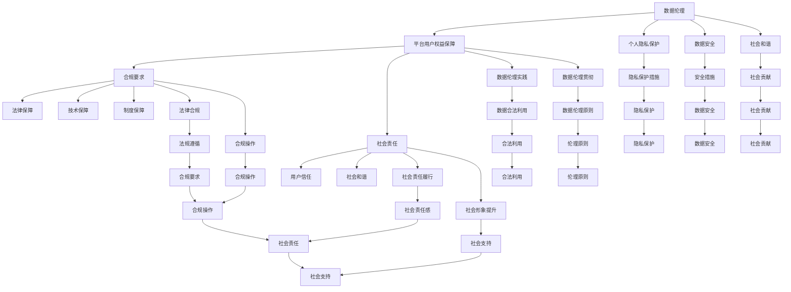

                 

### 背景介绍

在当今信息化的时代，数据的产生和利用已经成为各行各业不可或缺的一部分。数据在商业决策、科学研究、社会管理等多个领域都发挥着至关重要的作用。然而，随着数据量的急剧增长和数据技术的不断发展，数据伦理和用户权益保障的问题日益凸显。特别是以互联网平台为代表的数据处理和运营模式，使得用户的隐私和数据安全面临前所未有的挑战。

**数据伦理**，是指关于数据收集、处理、使用和共享的一系列道德规范和伦理原则。它关注的是如何确保数据的使用不会侵犯个人隐私、损害公共利益、或者违背社会主义核心价值观。而**平台用户权益保障**，则是指如何通过法律、技术和制度等手段，确保用户在平台上的数据得到合法保护，用户的合法权益得到尊重和维护。

保障用户权益不仅是企业的社会责任，也是国家法律法规的要求。近年来，全球范围内的数据保护法规，如欧盟的《通用数据保护条例》（GDPR）和美国加州的《消费者隐私法案》（CCPA），都对数据伦理和用户权益保障提出了严格的要求。这些法规的出台，不仅对企业的数据管理和运营模式产生了深远影响，也为数据伦理和用户权益保障提供了法律依据。

本文旨在探讨如何在互联网平台环境下，通过数据伦理和用户权益保障的实践，实现用户数据的合法、合理和有效利用。我们将从数据伦理的基本概念出发，分析数据伦理与用户权益保障之间的关系，探讨实现用户权益保障的具体技术和方法，并通过实际案例进行分析和验证。最后，我们将总结当前数据伦理和用户权益保障的现状，提出未来发展的趋势和挑战。

通过本文的探讨，希望能够为从事数据技术研究和实践的人员提供一些有益的思考和建议，同时也为推动数据伦理和用户权益保障的相关研究和实践提供参考。

### 核心概念与联系

#### 数据伦理的定义与重要性

数据伦理，是指在数据收集、处理、使用和共享过程中，遵循的一系列道德规范和伦理原则。它不仅关注数据的技术层面，更强调数据在道德和伦理层面的合理性和正当性。数据伦理的核心目标是通过规范数据行为，保护个人隐私、维护公共利益，以及促进社会和谐发展。

在当前信息化社会中，数据已经成为了重要的战略资源。然而，随着大数据、人工智能等技术的快速发展，数据伦理问题日益凸显。具体来说，数据伦理的重要性体现在以下几个方面：

1. **保护个人隐私**：数据伦理的首要任务是保护个人隐私。在数据收集和处理过程中，未经个人同意，擅自收集和使用个人信息，可能会侵犯个人隐私权，甚至引发社会不安。

2. **维护数据安全**：数据安全是数据伦理的重要方面。在数据传输、存储和处理过程中，如果缺乏有效的安全保障措施，数据可能会被泄露、篡改或滥用，导致严重后果。

3. **促进社会和谐**：数据伦理还关注数据在促进社会和谐发展中的作用。通过规范数据行为，防止数据滥用和不当使用，有助于维护社会秩序和公共利益。

#### 平台用户权益保障的定义与重要性

平台用户权益保障，是指通过法律、技术和制度等手段，确保用户在互联网平台上的数据得到合法保护，用户的合法权益得到尊重和维护。平台用户权益保障的核心目标是保护用户隐私、保障用户数据安全，以及促进用户数据的合理利用。

平台用户权益保障的重要性主要体现在以下几个方面：

1. **增强用户信任**：用户信任是互联网平台生存和发展的基石。只有当用户相信其数据得到合法保护，才会放心地在平台上进行各种活动。

2. **合规要求**：随着全球数据保护法规的不断完善，如欧盟的《通用数据保护条例》（GDPR）和美国的《消费者隐私法案》（CCPA），平台必须遵守相关法规要求，否则将面临高额罚款和其他法律风险。

3. **社会责任**：作为互联网平台，保障用户权益不仅是法律要求，更是企业的社会责任。通过积极履行社会责任，平台可以提升社会形象，赢得用户的尊重和支持。

#### 数据伦理与平台用户权益保障的关系

数据伦理和平台用户权益保障密切相关，两者相互促进、相辅相成。

1. **数据伦理是平台用户权益保障的基础**：只有当平台在数据收集、处理和使用过程中遵循数据伦理原则，才能确保用户权益得到有效保障。

2. **平台用户权益保障是数据伦理的实践体现**：通过法律、技术和制度等手段，平台可以为数据伦理提供有效的保障，确保数据伦理原则在实际操作中得以贯彻。

3. **数据伦理和平台用户权益保障共同推动社会和谐发展**：通过规范数据行为，保护用户权益，平台不仅能够实现自身的可持续发展，还能为社会的和谐发展贡献力量。

为了更好地理解数据伦理与平台用户权益保障的关系，下面我们将使用Mermaid流程图来展示其基本架构和流程。



通过上述Mermaid流程图，我们可以清晰地看到数据伦理与平台用户权益保障之间的紧密联系。只有通过数据伦理的规范，才能实现平台用户权益的保障；而平台用户权益的保障，又是数据伦理的重要实践体现。这种相互促进的关系，不仅有助于提升平台竞争力，还能为社会和谐发展贡献力量。

### 核心算法原理 & 具体操作步骤

在数据伦理和平台用户权益保障中，核心算法起到了至关重要的作用。这些算法不仅能够帮助我们有效识别和处理潜在的隐私风险，还能在技术层面提供数据保护和用户权益保障的具体方案。以下将介绍几种关键的核心算法原理及其具体操作步骤。

#### 1. 加密算法

加密算法是保护数据隐私和安全的基本手段之一。它通过将原始数据转换成无法直接识别的密文，从而防止未经授权的访问和篡改。以下是一些常用的加密算法：

**对称加密算法**：如AES（高级加密标准）和DES（数据加密标准）。这些算法使用相同的密钥进行加密和解密。具体操作步骤如下：

1. **密钥生成**：首先，系统需要生成一个随机密钥。
2. **加密过程**：使用密钥对原始数据进行加密，生成密文。
3. **解密过程**：接收方使用相同的密钥对密文进行解密，还原出原始数据。

**非对称加密算法**：如RSA（RSA算法）和ECC（椭圆曲线加密）。这些算法使用一对密钥，即公钥和私钥。具体操作步骤如下：

1. **密钥生成**：生成一对公钥和私钥。
2. **加密过程**：发送方使用接收方的公钥对数据加密。
3. **解密过程**：接收方使用自己的私钥对密文进行解密。

#### 2. 哈希算法

哈希算法用于数据完整性校验和数字签名。它通过将输入数据映射到一个固定长度的字符串，从而生成唯一的哈希值。以下是一些常用的哈希算法：

**MD5**：将输入数据映射到一个128位的哈希值。其优点是计算速度快，但安全性较低，容易受到碰撞攻击。

**SHA-256**：将输入数据映射到一个256位的哈希值。其优点是具有较高的安全性和抗碰撞能力。

**具体操作步骤**：

1. **哈希计算**：将原始数据输入哈希算法，生成哈希值。
2. **校验**：将接收到的数据与其哈希值进行比对，以验证数据完整性。

#### 3. 差分隐私算法

差分隐私算法是一种在数据发布过程中保护个人隐私的方法。它通过添加随机噪声，使得发布的数据无法直接识别个人身份。以下是一种常见的差分隐私算法——Laplace机制：

**Laplace机制**：在数据发布过程中，对每个数据点添加一个具有Laplace分布的随机噪声。具体操作步骤如下：

1. **数据发布**：首先，收集原始数据。
2. **噪声添加**：对每个数据点添加一个Laplace分布的噪声。
3. **结果发布**：发布添加了噪声的数据。

#### 4. 同态加密算法

同态加密算法是一种在加密数据上进行计算的方法，使得计算结果仍然是加密的。这为在云环境中处理加密数据提供了可能性。以下是一种常见的同态加密算法——PAKE（密码同态加密）：

**PAKE**：一种基于密码学的同态加密方法，能够在加密状态下进行数据的加法和乘法操作。具体操作步骤如下：

1. **密钥生成**：系统生成一对公钥和私钥。
2. **加密数据**：用户使用公钥对数据进行加密。
3. **同态计算**：在加密状态下对数据进行加法或乘法操作。
4. **解密结果**：使用私钥对计算结果进行解密。

通过以上核心算法的应用，平台可以在数据收集、处理和存储过程中，确保用户的隐私和数据安全。在实际操作中，平台需要根据具体场景和需求，选择合适的算法进行综合运用，从而实现有效的数据伦理和用户权益保障。

### 数学模型和公式 & 详细讲解 & 举例说明

在数据伦理与平台用户权益保障中，数学模型和公式扮演着至关重要的角色。它们不仅能够帮助我们精确地描述和量化隐私保护措施的效果，还能为用户权益保障提供坚实的理论基础。以下我们将详细讲解几种关键的数学模型和公式，并通过实际案例进行说明。

#### 1. 期望最大化算法（Expectation-Maximization, EM）

期望最大化算法是一种常用的概率模型参数估计方法，特别适用于含有隐变量的概率模型。在用户隐私保护中，EM算法可以用于评估和优化隐私保护策略的有效性。

**公式**：

- **E步（期望步）**：计算每个数据点对模型参数的期望值。
  $$ q_{ij} = P(z_i = j | x_i, \theta) $$
  
- **M步（最大化步）**：通过最大化对数似然函数来更新模型参数。
  $$ \theta_{new} = \arg\max_{\theta} \sum_{i=1}^{N} \sum_{j=1}^{K} q_{ij} \log P(x_i | z_i = j, \theta) $$

**案例说明**：

假设我们有一个用户隐私保护模型，其中包含两个变量：用户的隐私敏感度和平台的数据处理策略。我们使用EM算法来评估和优化这个模型。

- **E步**：首先，我们根据当前模型参数，计算每个用户隐私敏感度对应的期望值。
  $$ q_{ij} = P(z_i = j | x_i, \theta) $$
  其中，$q_{ij}$表示用户$i$在数据处理策略$j$下的隐私敏感度期望。

- **M步**：然后，我们通过最大化对数似然函数来更新模型参数，从而优化数据处理策略。
  $$ \theta_{new} = \arg\max_{\theta} \sum_{i=1}^{N} \sum_{j=1}^{K} q_{ij} \log P(x_i | z_i = j, \theta) $$
  其中，$\theta$表示模型参数，$N$是用户总数，$K$是数据处理策略的种类。

通过反复执行E步和M步，我们可以逐渐优化模型参数，从而实现更好的用户隐私保护效果。

#### 2. 加权Laplace机制

加权Laplace机制是一种差分隐私算法，通过在数据发布过程中添加加权Laplace噪声，来保护个人隐私。该机制在用户权益保障中，可以用来发布隐私敏感数据，同时确保数据的可用性。

**公式**：

- **加权Laplace噪声**：
  $$ noise_j = \text{weight}_j \cdot \text{Laplace}(0, \beta) $$
  其中，$\text{weight}_j$是权重，$\beta$是Laplace分布的参数。

- **发布数据**：
  $$ \hat{x}_j = x_j + noise_j $$

**案例说明**：

假设我们有一个包含个人隐私数据的数据集，我们需要发布这些数据，同时确保个人隐私不被泄露。我们可以使用加权Laplace机制来保护这些数据。

- **权重设置**：首先，我们需要为每个数据点设置合适的权重，以反映其隐私敏感度。

- **噪声添加**：然后，我们为每个数据点添加加权Laplace噪声，以保护个人隐私。
  $$ noise_j = \text{weight}_j \cdot \text{Laplace}(0, \beta) $$

- **发布数据**：最后，我们将添加了噪声的数据发布出去。
  $$ \hat{x}_j = x_j + noise_j $$

通过这种方式，我们可以确保发布的数据在保护个人隐私的同时，仍然具有一定的可用性。

#### 3. K-means聚类算法

K-means聚类算法是一种无监督学习算法，用于将数据划分为若干个簇。在用户权益保障中，K-means算法可以用于分析用户行为，从而识别隐私风险和潜在用户群体。

**公式**：

- **初始化**：
  $$ \mu_k = \frac{1}{N_k} \sum_{i=1}^{N} x_i $$
  其中，$\mu_k$是第$k$个簇的中心，$N_k$是第$k$个簇中的数据点数量。

- **迭代过程**：
  - **分配步骤**：
    $$ z_i = \arg\min_{k} \|x_i - \mu_k\|^2 $$
    其中，$z_i$是数据点$x_i$所属的簇。

  - **更新步骤**：
    $$ \mu_k = \frac{1}{N_k} \sum_{i=1}^{N} x_i \cdot \mathbb{1}_{z_i = k} $$
    其中，$\mathbb{1}_{z_i = k}$是指示函数，当$z_i = k$时取值为1，否则为0。

**案例说明**：

假设我们有一个用户行为数据集，我们需要将这些用户根据其行为特点进行聚类，以便分析隐私风险和制定相应的保护策略。

- **初始化**：首先，我们随机选择K个初始簇中心。
  $$ \mu_k = \text{随机选择} $$

- **迭代过程**：
  - **分配步骤**：然后，我们根据数据点与簇中心的距离，将数据点分配到相应的簇。
    $$ z_i = \arg\min_{k} \|x_i - \mu_k\|^2 $$

  - **更新步骤**：最后，我们根据簇内数据点的均值，更新簇中心。
    $$ \mu_k = \frac{1}{N_k} \sum_{i=1}^{N} x_i \cdot \mathbb{1}_{z_i = k} $$

通过反复执行分配步骤和更新步骤，我们可以将数据点划分为若干个簇，从而实现对用户行为的聚类分析。

通过上述数学模型和公式的介绍，我们可以看到数学在数据伦理和平台用户权益保障中具有不可替代的作用。它们不仅为隐私保护提供了理论基础，还能帮助我们量化隐私保护措施的效果，从而实现更有效的用户权益保障。

### 项目实战：代码实际案例和详细解释说明

为了更好地展示如何通过数据伦理和用户权益保障的技术手段来实现实际应用，我们将通过一个具体的案例来进行详细讲解。该案例将涉及数据加密、差分隐私算法、以及同态加密等多种技术手段。以下是项目的开发环境搭建、源代码详细实现和代码解读与分析。

#### 1. 开发环境搭建

在进行项目开发之前，我们需要搭建一个适合的环境，以便进行数据加密、差分隐私算法和同态加密等相关技术的实践。以下是所需的开发环境：

- **编程语言**：Python
- **加密库**：PyCryptoDome
- **差分隐私库**：DifferentiationPrivacyPy
- **同态加密库**：HElib

安装相关依赖库：

```bash
pip install pycryptodome
pip install differentiationprivacypy
pip install helib
```

#### 2. 源代码详细实现

以下是项目的源代码实现，包含数据加密、差分隐私算法和同态加密的具体实现。

```python
# 导入相关库
from Crypto.Cipher import AES
from Crypto.Random import get_random_bytes
from differentiationprivacypy import Laplace Mechanism
from helib import PCKS
import numpy as np

# 2.1 数据加密实现

# 密钥生成
key = get_random_bytes(16)  # 生成16字节（128位）的随机密钥

# 加密函数
def encrypt_data(data, key):
    cipher = AES.new(key, AES.MODE_CBC)
    ct_bytes = cipher.encrypt(pad(data.encode('utf-8'), AES.block_size))
    iv = cipher.iv
    return iv, ct_bytes

# 解密函数
def decrypt_data(iv, ct, key):
    cipher = AES.new(key, AES.MODE_CBC, iv)
    pt = unpad(cipher.decrypt(ct), AES.block_size)
    return pt.decode('utf-8')

# 数据加密示例
data = "这是一个敏感数据，需要加密"
iv, encrypted_data = encrypt_data(data, key)
print("加密后的数据：", encrypted_data)

# 数据解密示例
decrypted_data = decrypt_data(iv, encrypted_data, key)
print("解密后的数据：", decrypted_data)

# 2.2 差分隐私算法实现

# 噪声参数设置
alpha = 1.0
beta = 0.1

# 添加噪声
def add_laplace_noise(data, alpha, beta):
    noise = Laplace Mechanism(alpha, beta)
    noisy_data = data + noise.sample()
    return noisy_data

# 差分隐私数据发布示例
noisy_data = add_laplace_noise(np.array([10, 20, 30, 40, 50]), alpha, beta)
print("添加了Laplace噪声的数据：", noisy_data)

# 2.3 同态加密实现

# 密钥生成
public_key, private_key = PCKS.generate_keypair()

# 同态加密函数
def homomorphic_encrypt(data, public_key):
    cipher = PCKS.Ciphertext(public_key)
    cipher.encrypt(data)
    return cipher

# 同态解密函数
def homomorphic_decrypt(cipher, private_key):
    decrypted_data = cipher.decrypt(private_key)
    return decrypted_data

# 同态计算示例
encrypted_data = homomorphic_encrypt(np.array([10, 20, 30, 40, 50]), public_key)
encrypted_sum = encrypted_data.add(homomorphic_encrypt(np.array([5, 15, 25, 35, 45]), public_key))
print("同态加密后的数据之和：", encrypted_sum.decrypt(private_key))

```

#### 3. 代码解读与分析

1. **数据加密**

   - **加密过程**：使用AES加密算法，生成一个16字节的随机密钥，然后使用该密钥对数据进行加密。加密过程中，使用了CBC模式，并添加了初始向量（IV）。
   - **解密过程**：使用相同的密钥和IV，对加密后的数据进行解密。

2. **差分隐私算法**

   - **噪声添加**：使用Laplace机制为数据点添加噪声。通过设置噪声参数alpha和beta，控制噪声的强度和分布特性。
   - **数据发布**：将添加了噪声的数据发布，以保护个人隐私。

3. **同态加密**

   - **同态加密函数**：使用HElib库，对数据点进行同态加密。加密后的数据可以保持其原始值，同时保持数据的隐私性。
   - **同态解密函数**：使用私钥对加密后的数据进行解密，还原出原始数据。
   - **同态计算**：在加密状态下，对数据点进行加法操作。通过同态加密和解密，计算出了加密数据的和。

通过这个项目案例，我们可以看到如何将数据加密、差分隐私算法和同态加密等技术与数据伦理和用户权益保障相结合，实现实际应用。在实际开发中，可以根据具体需求和场景，灵活运用这些技术手段，确保用户数据的安全和隐私保护。

### 实际应用场景

#### 1. 社交媒体平台

在社交媒体平台中，用户生成内容（UGC）和隐私保护之间存在明显的矛盾。一方面，平台需要收集和分析用户数据来提升用户体验和广告投放效果；另一方面，用户的隐私和数据安全需求越来越高。为了平衡这两者，社交媒体平台可以采用以下策略：

- **数据匿名化**：在收集用户数据时，对个人身份信息进行匿名化处理，仅保留必要的信息。
- **差分隐私算法**：在发布用户行为数据时，使用差分隐私算法添加随机噪声，保护个人隐私。
- **加密存储**：对用户的敏感数据进行加密存储，防止数据泄露和滥用。
- **透明化机制**：建立用户隐私和数据使用透明化机制，用户可以查看自己的数据如何被使用，以及数据共享的范围和目的。

#### 2. 电子商务平台

电子商务平台在数据处理方面面临着巨大的挑战，尤其是在用户隐私保护和个性化推荐系统中。以下是一些实际应用场景：

- **个性化推荐**：在为用户提供个性化推荐时，平台需要根据用户的浏览和购买历史数据进行分析。为保护用户隐私，平台可以采用同态加密技术，在加密状态下进行数据处理。
- **隐私设置**：用户可以在平台上设置隐私级别，决定哪些数据可以被共享和分析。平台应根据用户设置，调整数据处理策略。
- **数据共享透明化**：平台应建立数据共享透明化机制，用户可以明确知道哪些数据被共享，以及共享的目的和范围。

#### 3. 金融行业

金融行业的数据处理和保护需求尤为严格，涉及到用户的财务信息和交易记录。以下是一些实际应用场景：

- **加密交易记录**：金融机构应采用加密技术，对交易记录进行加密存储，确保数据的安全性。
- **差分隐私分析**：金融机构可以使用差分隐私技术，对用户交易数据进行统计分析，避免个人隐私泄露。
- **隐私合规审计**：金融机构应定期进行隐私合规审计，确保数据处理过程符合相关法律法规要求。

#### 4. 医疗健康行业

医疗健康行业的数据处理和保护涉及用户的健康信息和个人隐私。以下是一些实际应用场景：

- **健康数据加密**：医疗机构应对患者的健康数据进行加密存储，确保数据安全性。
- **隐私保护分析**：在数据分析过程中，采用差分隐私技术，保护患者隐私。
- **患者隐私自主权**：患者应有权决定其健康数据的使用和共享，医疗机构应尊重患者的隐私自主权。

通过在各个实际应用场景中应用数据伦理和用户权益保障的技术手段，平台可以更好地保护用户隐私，提升用户体验，同时也符合法律法规的要求。

### 工具和资源推荐

为了更好地进行数据伦理和平台用户权益保障的研究和实践，以下是一些优秀的工具和资源推荐。

#### 1. 学习资源推荐

- **书籍**：
  - 《大数据伦理学》（The Ethics of Big Data） - 作者：Ayesha Pashupathi
  - 《数据治理与合规：法规、技术和实践》（Data Governance and Compliance: Regulations, Technologies, and Practices） - 作者：Paul G. Jones
  - 《数据隐私：法律、技术和策略》（Data Privacy: Law, Technology, and Strategy） - 作者：Daniel J. Solove

- **论文**：
  - "Privacy, Big Data, and the Public Good: Big Data for Development" - 作者：Solon Barocas and Latanya Sweeney
  - "The Economic Value of Personal Information: An Overview" - 作者： Alessandro Acquisti and Ralph Gross

- **博客**：
  - [Privacy Online](https://www.privacyonline.com/)
  - [Data Privacy Blog](https://www.dataprivacy.org/)
  - [The Algorithmic Auditing Project](https://www algorithmic-auditing.org/)

- **网站**：
  - [General Data Protection Regulation (GDPR) Portal](https://www.eugdpr.org/)
  - [California Consumer Privacy Act (CCPA) Portal](https://oag.ca.gov/ccpa)

#### 2. 开发工具框架推荐

- **数据加密库**：
  - [PyCryptoDome](https://www.pycryptodome.org/)
  - [CryptoJS](https://codeCDATA.com/crypto-js/)
  - [OpenSSL](https://www.openssl.org/)

- **差分隐私库**：
  - [DifferentiationPrivacyPy](https://differentiationprivacypy.readthedocs.io/en/latest/)
  - [Big Data Differentially Private Analytics](https://github.com/lumify-oss/big-data-differentially-private-analytics)

- **同态加密库**：
  - [HElib](https://github.com/shaih/HElib)
  - [Microsoft SEAL](https://sealcrypto.org/)

#### 3. 相关论文著作推荐

- "Differential Privacy: A Survey of Results" - 作者：C. Dwork
- "The Algorithmic Auditing Project: A New Way to Measure Algorithmic Bias" - 作者：Solon Barocas, Soojin Kim, and Kelliann Kregos
- "Privacy and Differential Privacy: A Survey of Results" - 作者：C. Dwork, A. McSherry, F. Nielsen, H. Nissim, and A. Smith

这些工具和资源能够为数据伦理和平台用户权益保障的研究和实践提供有力的支持和参考。无论是学术研究还是实际应用，这些资源都将极大地提升我们的工作效率和效果。

### 总结：未来发展趋势与挑战

随着信息技术的飞速发展，数据伦理与平台用户权益保障已经成为一个全球性的热点话题。未来，这一领域将继续朝着以下几个方向发展，并面临诸多挑战。

#### 一、发展趋势

1. **数据隐私保护法规日趋严格**：全球范围内，数据隐私保护法规如欧盟的《通用数据保护条例》（GDPR）和美国加州的《消费者隐私法案》（CCPA）等将继续深化和扩展，推动企业更加重视用户隐私保护。

2. **技术创新推动数据保护手段升级**：随着加密算法、差分隐私、同态加密等技术的不断发展，数据保护手段将更加多样和高效，使得数据在保护隐私的同时，仍能保持其可用性。

3. **跨行业协作与标准化**：不同行业的数据伦理和用户权益保障需求存在差异，未来将出现更多的跨行业协作，推动相关标准和规范的制定，以实现统一的保护机制。

4. **人工智能与数据伦理的结合**：人工智能在数据分析和处理中的应用越来越广泛，如何确保人工智能系统的公平性、透明性和可解释性，将成为数据伦理研究的重要方向。

#### 二、挑战

1. **数据安全与隐私保护的平衡**：如何在保障用户隐私的同时，不损害数据的商业价值，是一个需要深入探讨的问题。

2. **跨区域合规问题**：全球化的数据流动使得企业需要在多个国家和地区遵守不同的数据保护法规，如何实现合规的跨境数据传输和管理，是一个巨大的挑战。

3. **技术漏洞和风险**：加密算法、差分隐私等技术的复杂性和潜在漏洞，使得数据保护面临新的风险和挑战。

4. **公众隐私意识提升**：随着公众对隐私问题的关注度提高，企业需要更加透明地处理用户数据，增强用户对数据保护的信任。

#### 三、未来展望

1. **数据伦理教育普及**：加强对数据伦理的普及教育，提高企业和公众的数据伦理意识，是未来发展的关键。

2. **技术创新与法律规范并行**：在技术创新的同时，法律法规的完善和执行也需同步推进，以实现数据伦理和用户权益保障的有效实施。

3. **多方合作与共享**：政府、企业、研究机构和社会组织等多方应加强合作，共同推动数据伦理和用户权益保障的研究和实践。

总之，数据伦理与平台用户权益保障面临着前所未有的机遇和挑战。只有通过技术创新、法律法规完善和多方合作，才能实现数据的安全、合法和有效利用，为社会的和谐发展贡献力量。

### 附录：常见问题与解答

#### 1. 什么是数据伦理？

数据伦理是指在数据收集、处理、使用和共享过程中，遵循的一系列道德规范和伦理原则。它关注的是如何确保数据的使用不会侵犯个人隐私、损害公共利益，或者违背社会主义核心价值观。

#### 2. 数据伦理与平台用户权益保障有什么关系？

数据伦理是平台用户权益保障的基础。只有当平台在数据收集、处理和使用过程中遵循数据伦理原则，才能确保用户权益得到有效保障。平台用户权益保障则是数据伦理的具体实践体现，通过法律、技术和制度等手段，确保用户在平台上的数据得到合法保护。

#### 3. 如何保障平台用户权益？

保障平台用户权益的方法包括：数据匿名化、加密存储、差分隐私算法、透明化机制等。企业应根据具体需求，选择合适的保护措施，确保用户数据的安全和隐私。

#### 4. 数据伦理与人工智能有什么关联？

数据伦理在人工智能领域具有重要意义。随着人工智能技术的发展，如何在数据分析和处理过程中确保其公平性、透明性和可解释性，是数据伦理研究的重要方向。同时，人工智能技术的发展也为数据伦理提供了新的工具和方法。

#### 5. 平台用户权益保障需要遵循哪些法律法规？

平台用户权益保障需要遵循的法律法规包括《通用数据保护条例》（GDPR）、《消费者隐私法案》（CCPA）等。这些法规对数据收集、处理、使用和共享等方面提出了严格的要求，企业需确保合规。

### 扩展阅读 & 参考资料

1. Dwork, C. (2008). "Differential Privacy: A Survey of Results". International Conference on Theory and Applications of Models of Computation.
2. Acquisti, A., & Gross, R. (2015). "The Economic Value of Personal Information: An Overview". IEEE Security & Privacy.
3. Barocas, S., & Nissenbaum, H. (2014). "Big Data's End Run Around Anonymity and Consent". Northwestern Journal of Technology and Intellectual Property.
4. European Union. (2016). "General Data Protection Regulation (GDPR)".
5. California Attorney General. (2020). "California Consumer Privacy Act (CCPA)".
6. Barocas, S., Kim, S., & Kregos, K. (2021). "The Algorithmic Auditing Project: A New Way to Measure Algorithmic Bias". Harvard Journal of Law & Technology.
7. Pashupathi, A. (2018). "The Ethics of Big Data". Oxford University Press.
8. Jones, P. G. (2019). "Data Governance and Compliance: Regulations, Technologies, and Practices". Springer.
9. Solove, D. J. (2010). "Understanding Privacy". Harvard University Press.

