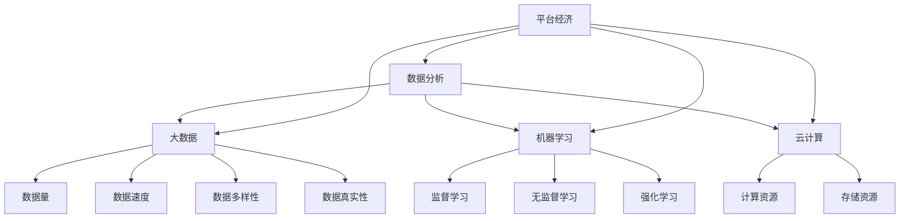

                 

### 背景介绍

平台经济（Platform Economy）作为一种新型的经济模式，正在全球范围内迅速发展。它通过建立数字化平台，连接供需双方，促进资源的高效配置和优化利用。平台经济不仅改变了传统商业模式，还推动了行业创新和服务升级。在这个背景下，数据分析（Data Analysis）作为一种关键工具，逐渐成为推动平台经济应用创新的核心动力。

首先，平台经济的特点决定了其对数据分析的依赖。平台经济中的数据量庞大，涵盖了用户行为、交易记录、市场动态等多个方面。这些数据不仅量大，而且复杂，需要通过先进的数据分析技术进行挖掘和利用。数据分析技术可以帮助平台经济参与者更好地理解用户需求，优化产品设计，提升用户体验，从而实现商业价值的最大化。

其次，数据分析在平台经济中的应用非常广泛。例如，在金融领域，数据分析可以用于风险评估、欺诈检测和客户关系管理。在电子商务领域，数据分析可以用于商品推荐、个性化营销和供应链优化。在共享经济领域，数据分析可以用于用户行为预测、资源调度和平台运营优化。这些应用不仅提升了平台的运营效率，还推动了相关行业的创新发展。

此外，随着人工智能、大数据和云计算等技术的发展，数据分析在平台经济中的应用前景更加广阔。通过对海量数据的深度挖掘和分析，可以揭示隐藏在数据背后的趋势和规律，为平台经济参与者提供科学决策依据。同时，数据分析技术还可以与其他前沿技术相结合，创造出更多新的应用场景和商业模式。

总之，数据分析已经成为平台经济中不可或缺的一部分。它不仅为平台经济提供了强大的数据支持，还推动了平台经济的应用创新。在未来的发展中，数据分析将继续发挥重要作用，为平台经济注入新的活力。

### 核心概念与联系

为了深入理解数据分析在平台经济中的应用，我们首先需要了解几个核心概念，以及它们之间的联系。

#### 数据分析（Data Analysis）

数据分析是指使用统计学、计算机科学、数据挖掘和机器学习等方法，从大量数据中提取有用信息和知识的过程。数据分析的目的是通过数据洞察发现规律、预测未来趋势，并支持决策制定。

#### 大数据（Big Data）

大数据是指无法使用传统数据处理工具在合理时间内进行捕捉、管理和处理的大量数据。大数据的特点是“4V”：数据量（Volume）、数据速度（Velocity）、数据多样性（Variety）和数据真实性（Veracity）。

#### 机器学习（Machine Learning）

机器学习是一种人工智能（AI）的分支，它通过算法从数据中学习规律，并自动做出预测或决策。机器学习可以分为监督学习、无监督学习和强化学习三种类型。

#### 云计算（Cloud Computing）

云计算是一种基于互联网的计算模式，它通过提供可扩展的计算资源，使得用户可以根据需要动态调整计算能力。云计算为数据分析提供了强大的计算和存储支持。

#### 平台经济（Platform Economy）

平台经济是一种基于数字化平台的新型经济模式，通过连接供需双方，实现资源的高效配置和优化利用。平台经济的核心是平台，它为用户和商家提供了一个互动和交易的环境。

#### 核心概念的联系

数据分析、大数据、机器学习和云计算等核心概念之间紧密联系。首先，大数据的爆发式增长为数据分析提供了丰富的数据资源。而机器学习算法则可以高效地处理和分析这些数据，从中提取有价值的信息。云计算为机器学习提供了强大的计算和存储能力，使得大规模数据分析成为可能。最后，平台经济作为数字化时代的主要经济模式，为数据分析提供了广阔的应用场景。

下面是一个使用 Mermaid 绘制的流程图，展示了这些核心概念之间的联系：



通过这个流程图，我们可以清晰地看到数据分析在平台经济中的应用是如何通过大数据、机器学习和云计算等技术实现的。

### 核心算法原理 & 具体操作步骤

在平台经济中，数据分析的目的是从海量数据中提取有价值的信息，以支持决策制定和业务优化。为了实现这一目标，我们需要了解一些核心算法原理，并掌握具体的操作步骤。

#### 数据采集与预处理

首先，数据采集是数据分析的基础。平台经济中的数据来源多样，包括用户行为数据、交易数据、市场数据等。在采集数据后，我们需要进行预处理，包括数据清洗、数据整合和数据转换等步骤。数据清洗是为了去除重复数据、错误数据和无效数据，保证数据质量。数据整合是将来自不同来源的数据进行统一处理，以便后续分析。数据转换是将数据格式进行转换，使其符合分析工具的要求。

#### 数据探索性分析

数据探索性分析（EDA）是数据分析的第一步，通过可视化方法对数据进行初步探索，以发现数据中的规律和异常。常用的可视化方法包括柱状图、折线图、散点图、箱线图等。通过 EDA，我们可以了解数据的分布情况、相关性、趋势等，为后续分析提供方向。

#### 描述性统计分析

描述性统计分析是对数据进行定量描述，包括均值、中位数、标准差、方差等指标。描述性统计分析可以帮助我们了解数据的中心趋势和离散程度，为后续的推断性分析提供基础。

#### 推断性统计分析

推断性统计分析是基于样本数据对总体数据进行推断。常用的方法包括假设检验、置信区间估计和回归分析等。假设检验用于判断样本数据是否支持某个假设，置信区间估计用于估计总体参数的取值范围，回归分析用于研究变量之间的关系。

#### 机器学习算法

在平台经济中，机器学习算法被广泛应用于数据分析。常用的机器学习算法包括线性回归、逻辑回归、决策树、随机森林、支持向量机等。这些算法可以帮助我们预测未来趋势、分类数据、聚类数据等。具体操作步骤如下：

1. 数据预处理：对数据进行清洗、整合和转换，使其适合算法输入。
2. 特征工程：选择或构建有助于模型预测的特征。
3. 模型选择：根据数据特点和业务需求选择合适的算法。
4. 模型训练：使用训练数据对模型进行训练。
5. 模型评估：使用验证数据对模型进行评估，选择最佳模型。
6. 模型应用：使用测试数据对模型进行预测。

#### 实际操作步骤

以下是一个使用 Python 进行数据分析的实际操作步骤：

1. **数据采集与预处理**

```python
import pandas as pd

# 读取数据
data = pd.read_csv('data.csv')

# 数据清洗
data = data.drop_duplicates()
data = data[data['column_name'].notnull()]

# 数据整合
data['new_column'] = data['column1'] + data['column2']

# 数据转换
data['date'] = pd.to_datetime(data['date'])
```

2. **数据探索性分析**

```python
import matplotlib.pyplot as plt
import seaborn as sns

# 可视化探索
sns.pairplot(data)
plt.show()

# 相关性分析
correlation_matrix = data.corr()
sns.heatmap(correlation_matrix, annot=True)
plt.show()
```

3. **描述性统计分析**

```python
# 均值、中位数、标准差
mean = data['column_name'].mean()
median = data['column_name'].median()
std = data['column_name'].std()

# 打印结果
print('均值:', mean)
print('中位数:', median)
print('标准差:', std)
```

4. **推断性统计分析**

```python
from scipy import stats

# 假设检验
t_stat, p_value = stats.ttest_1samp(data['column_name'], 0)
print('t统计量:', t_stat)
print('p值:', p_value)

# 置信区间估计
confidence_interval = stats.t.interval(alpha=0.05, df=data['column_name'].shape[0]-1, loc=mean, scale=std/sqrt(data['column_name'].shape[0]))
print('置信区间:', confidence_interval)

# 回归分析
from sklearn.linear_model import LinearRegression

model = LinearRegression()
model.fit(data[['column1', 'column2']], data['column_name'])
print('模型系数:', model.coef_)
print('模型截距:', model.intercept_)
```

5. **机器学习算法**

```python
from sklearn.model_selection import train_test_split
from sklearn.metrics import accuracy_score, classification_report

# 数据划分
X_train, X_test, y_train, y_test = train_test_split(data[['column1', 'column2']], data['column_name'], test_size=0.2, random_state=42)

# 模型训练
model = LinearRegression()
model.fit(X_train, y_train)

# 模型评估
y_pred = model.predict(X_test)
print('准确率:', accuracy_score(y_test, y_pred))
print('分类报告：', classification_report(y_test, y_pred))
```

通过以上步骤，我们可以对平台经济中的数据进行有效的分析，从而为业务决策提供有力支持。

### 数学模型和公式 & 详细讲解 & 举例说明

在数据分析中，数学模型和公式是理解和解释数据的重要工具。以下是几个常见的数学模型和公式的详细讲解以及举例说明。

#### 回归模型（Regression Model）

回归模型是一种用于研究变量之间关系的数学模型。最常见的回归模型包括线性回归、多项式回归和逻辑回归。

1. **线性回归（Linear Regression）**

线性回归模型的基本公式如下：

\[ Y = \beta_0 + \beta_1X + \epsilon \]

其中，\( Y \) 是因变量，\( X \) 是自变量，\( \beta_0 \) 和 \( \beta_1 \) 是模型的参数，\( \epsilon \) 是误差项。

**举例说明：**

假设我们要研究房价 \( Y \) 与房屋面积 \( X \) 之间的关系。通过收集数据，我们可以使用最小二乘法（Least Squares Method）来估计模型参数。例如，如果数据如下：

| 房屋面积 (X) | 房价 (Y) |
|--------------|---------|
| 1000         | 200000  |
| 1200         | 250000  |
| 1400         | 300000  |

我们可以使用线性回归模型来拟合这些数据。通过计算，我们得到线性回归方程：

\[ Y = 100000 + 125X \]

其中，\( \beta_0 = 100000 \) 和 \( \beta_1 = 125 \)。

2. **逻辑回归（Logistic Regression）**

逻辑回归是一种用于处理分类问题的回归模型。其基本公式如下：

\[ P(Y=1) = \frac{1}{1 + e^{-(\beta_0 + \beta_1X)}} \]

其中，\( P(Y=1) \) 是因变量为1的概率，\( X \) 是自变量，\( \beta_0 \) 和 \( \beta_1 \) 是模型的参数。

**举例说明：**

假设我们要预测一个客户是否会购买某种产品（因变量 \( Y \) 为1或0）。通过收集数据，我们可以使用逻辑回归模型来拟合这些数据。例如，如果数据如下：

| 是否购买 (Y) | 收入 (X) |
|-------------|---------|
| 1           | 50000   |
| 0           | 30000   |
| 1           | 70000   |

我们可以使用逻辑回归模型来拟合这些数据。通过计算，我们得到逻辑回归方程：

\[ P(Y=1) = \frac{1}{1 + e^{-(2.5 + 0.1X)}} \]

其中，\( \beta_0 = 2.5 \) 和 \( \beta_1 = 0.1 \)。

#### 聚类模型（Clustering Model）

聚类模型是一种无监督学习方法，用于将数据点分成不同的群组。最常见的聚类模型包括 K-均值聚类（K-Means Clustering）和层次聚类（Hierarchical Clustering）。

1. **K-均值聚类（K-Means Clustering）**

K-均值聚类模型的基本公式如下：

\[ \min_{C} \sum_{i=1}^{n} \sum_{j=1}^{k} |x_i - c_j| \]

其中，\( C \) 是聚类中心，\( x_i \) 是数据点，\( k \) 是聚类数。

**举例说明：**

假设我们要将以下数据点分成两个群组：

\[ x_1 = [1, 1], x_2 = [2, 2], x_3 = [1, 2], x_4 = [2, 1] \]

我们可以使用 K-均值聚类模型来拟合这些数据。通过计算，我们得到两个聚类中心：

\[ c_1 = [1.5, 1.5], c_2 = [1.5, 0.5] \]

最终，我们将数据点分配到相应的群组中。

2. **层次聚类（Hierarchical Clustering）**

层次聚类模型的基本公式如下：

\[ \min_{C} \sum_{i=1}^{n} \sum_{j=1}^{k} |x_i - c_j| + \sum_{i=1}^{n} \sum_{j=1}^{k} |c_i - c_j| \]

其中，\( C \) 是聚类中心，\( x_i \) 是数据点，\( k \) 是聚类数。

**举例说明：**

假设我们要将以下数据点分成三个群组：

\[ x_1 = [1, 1], x_2 = [2, 2], x_3 = [1, 2], x_4 = [2, 1], x_5 = [3, 3] \]

我们可以使用层次聚类模型来拟合这些数据。通过计算，我们得到三个聚类中心：

\[ c_1 = [1.67, 1.67], c_2 = [2.33, 1.67], c_3 = [2.33, 2.33] \]

最终，我们将数据点分配到相应的群组中。

通过以上数学模型和公式的讲解以及举例说明，我们可以更好地理解和应用这些模型，以支持数据分析在平台经济中的应用。

### 项目实战：代码实际案例和详细解释说明

为了更好地理解数据分析在平台经济中的应用，我们接下来通过一个实际项目案例来展示如何进行数据采集、预处理、分析以及模型训练和预测。

#### 1. 开发环境搭建

在开始项目之前，我们需要搭建一个合适的开发环境。以下是推荐的工具和库：

- Python（版本3.8及以上）
- Jupyter Notebook
- Pandas
- NumPy
- Matplotlib
- Seaborn
- Scikit-learn
- TensorFlow

安装步骤：

```bash
pip install python==3.8
pip install jupyter
pip install pandas numpy matplotlib seaborn scikit-learn tensorflow
```

#### 2. 源代码详细实现和代码解读

我们将使用一个电子商务平台的数据集，进行用户购买行为预测。以下是代码实现：

```python
import pandas as pd
import numpy as np
import matplotlib.pyplot as plt
import seaborn as sns
from sklearn.model_selection import train_test_split
from sklearn.preprocessing import StandardScaler
from sklearn.linear_model import LogisticRegression
from sklearn.metrics import accuracy_score, confusion_matrix, classification_report

# 2.1 数据采集
data = pd.read_csv('e-commerce_data.csv')

# 2.2 数据预处理
# 数据清洗
data = data.drop_duplicates()
data = data[data['customer_id'].notnull()]

# 数据整合
data['total_revenue'] = data['revenue1'] + data['revenue2'] + data['revenue3']

# 数据转换
data['date'] = pd.to_datetime(data['date'])
data['month'] = data['date'].dt.month

# 2.3 数据探索性分析
sns.pairplot(data)
plt.show()

# 相关性分析
correlation_matrix = data.corr()
sns.heatmap(correlation_matrix, annot=True)
plt.show()

# 2.4 描述性统计分析
print(data.describe())

# 2.5 模型训练
# 数据划分
X = data[['revenue1', 'revenue2', 'revenue3', 'month']]
y = data['purchased']

X_train, X_test, y_train, y_test = train_test_split(X, y, test_size=0.2, random_state=42)

# 数据标准化
scaler = StandardScaler()
X_train = scaler.fit_transform(X_train)
X_test = scaler.transform(X_test)

# 模型训练
model = LogisticRegression()
model.fit(X_train, y_train)

# 2.6 模型评估
y_pred = model.predict(X_test)

print('准确率:', accuracy_score(y_test, y_pred))
print('混淆矩阵：', confusion_matrix(y_test, y_pred))
print('分类报告：', classification_report(y_test, y_pred))

# 2.7 可视化分析
sns.countplot(y_test, label="实际值")
sns.countplot(y_pred, label="预测值")
plt.show()
```

#### 3. 代码解读与分析

1. **数据采集（Data Collection）**

我们首先使用 Pandas 库读取 CSV 格式的数据集。这个数据集包含了电子商务平台上的用户购买数据。

2. **数据预处理（Data Preprocessing）**

数据预处理是数据分析的重要步骤。在这个项目中，我们进行了以下预处理操作：

- 数据清洗：去除重复数据和缺失值。
- 数据整合：计算总营收。
- 数据转换：将日期转换为月份。

3. **数据探索性分析（Data Exploration）**

我们使用 Seaborn 库对数据进行初步探索。通过绘制散点图和热力图，我们可以了解数据的基本分布和相关性。

4. **描述性统计分析（Descriptive Statistics）**

使用 Pandas 库的 `describe()` 方法，我们可以获取数据的中心趋势和离散程度，为后续分析提供基础。

5. **模型训练（Model Training）**

我们使用 Scikit-learn 库中的逻辑回归模型进行训练。首先，我们划分数据为训练集和测试集。然后，使用标准化处理数据，以提高模型性能。最后，训练模型并评估其性能。

6. **模型评估（Model Evaluation）**

我们使用测试集对模型进行评估。通过计算准确率、混淆矩阵和分类报告，我们可以了解模型的性能。同时，我们使用 Seaborn 库绘制分类分布图，以可视化模型预测结果。

通过以上代码实现，我们可以看到如何使用 Python 和相关库进行数据分析，并在平台经济中实现用户购买行为预测。这不仅展示了数据分析的实际应用，也为其他类似项目的实现提供了参考。

### 实际应用场景

数据分析在平台经济中的应用场景广泛且多样，涵盖了金融、电子商务、共享经济等多个领域。以下是一些典型的实际应用场景及其具体案例：

#### 1. 金融领域

在金融领域，数据分析被广泛应用于风险评估、欺诈检测和客户关系管理等方面。

**案例：风险评估**

一家在线金融机构使用数据分析技术来评估借款人的信用风险。通过分析借款人的财务状况、信用记录、历史交易数据等信息，金融机构可以更准确地预测借款人的违约概率，从而做出更合理的贷款决策。

**案例：欺诈检测**

信用卡公司利用数据分析技术来检测潜在的欺诈交易。通过监测交易行为模式、地理位置、消费金额等特征，系统可以自动识别异常交易并触发警报，从而帮助公司及时采取行动，防止损失。

#### 2. 电子商务领域

在电子商务领域，数据分析被广泛应用于商品推荐、个性化营销和供应链优化等方面。

**案例：商品推荐**

一家电商平台利用数据分析技术来推荐商品。通过分析用户的浏览历史、购买记录和偏好，系统可以自动生成个性化的商品推荐列表，从而提高用户的购物体验和满意度。

**案例：个性化营销**

一家电子商务公司利用数据分析技术来实施个性化营销策略。通过分析用户的购买行为、浏览习惯和社交媒体互动，公司可以为目标用户推送个性化的广告和促销信息，从而提高营销效果。

#### 3. 共享经济领域

在共享经济领域，数据分析被广泛应用于用户行为预测、资源调度和平台运营优化等方面。

**案例：用户行为预测**

一家共享单车公司利用数据分析技术来预测用户的需求模式。通过分析用户的出行时间、出行地点、天气状况等数据，公司可以优化单车投放策略，提高资源利用率。

**案例：资源调度**

一家共享办公空间公司利用数据分析技术来优化空间资源分配。通过分析用户的预订历史、工作时长和团队规模，公司可以合理安排办公空间，提高空间利用率。

#### 4. 教育领域

在教育领域，数据分析被广泛应用于学习分析、课程推荐和学生成绩预测等方面。

**案例：学习分析**

一家在线教育平台利用数据分析技术来分析学生的学习行为。通过监测学生的学习进度、学习时长和测试成绩，平台可以为学生提供个性化的学习建议，帮助提高学习效果。

**案例：课程推荐**

一家大学利用数据分析技术来推荐课程。通过分析学生的专业背景、学习兴趣和历史成绩，学校可以为每个学生推荐最适合的课程，从而提高学生的学术表现。

#### 5. 健康领域

在健康领域，数据分析被广泛应用于疾病预测、医疗资源优化和患者管理等方面。

**案例：疾病预测**

一家医疗公司利用数据分析技术来预测疾病的发生。通过分析患者的健康记录、生活习惯和基因数据，公司可以提前识别高风险群体，从而采取预防措施，降低疾病发生率。

**案例：医疗资源优化**

一家医院利用数据分析技术来优化医疗资源配置。通过分析患者的住院记录、手术需求和床位利用率，医院可以合理安排医护人员和医疗设备，提高医疗服务效率。

通过以上实际应用场景，我们可以看到数据分析在平台经济中的应用价值。无论是在金融、电子商务、共享经济、教育还是健康领域，数据分析都能够为企业和机构提供科学的决策依据，提升运营效率，创造更多的商业价值。

### 工具和资源推荐

在数据分析领域，有许多优秀的工具和资源可以帮助我们更高效地进行数据处理、分析和建模。以下是一些推荐的工具、书籍、论文和网站：

#### 1. 学习资源推荐

**书籍：**
- 《Python数据分析》（Dan Toomey）：这是一本针对初学者的数据分析入门书籍，涵盖了Python数据分析的基础知识和常用库。
- 《数据科学基础教程》（Joel Grus）：这本书系统地介绍了数据科学的基本概念和工具，包括数据处理、统计分析和机器学习。

**论文：**
- “Data Science: The Big Picture” by William S. Cleveland：这篇论文详细阐述了数据科学的基本框架和关键步骤。
- “Big Data: A Revolution That Will Transform How We Live, Work, and Think” by Viktor Mayer-Schönberger and Kenneth Cukier：这本书探讨了大数据对社会、商业和科学的影响。

**网站：**
- Kaggle：一个提供数据集和比赛的平台，适合练习和提升数据分析技能。
- DataCamp：一个在线学习平台，提供丰富的数据分析课程和实践项目。

#### 2. 开发工具框架推荐

**Python 库：**
- Pandas：用于数据处理和清洗。
- NumPy：用于数值计算。
- Matplotlib/Seaborn：用于数据可视化。
- Scikit-learn：用于机器学习算法。
- TensorFlow/Keras：用于深度学习和神经网络。

**数据分析工具：**
- Jupyter Notebook：一个交互式计算环境，适合进行数据分析。
- Tableau：一个强大的数据可视化工具。
- Power BI：一个用于商业智能和数据分析的平台。

**云计算平台：**
- AWS：提供丰富的数据分析服务，包括Amazon S3、Amazon Redshift、Amazon EMR等。
- Google Cloud Platform：提供大数据分析和机器学习服务，如Google BigQuery、Google AI Platform。
- Microsoft Azure：提供数据分析、机器学习和云计算解决方案，如Azure Data Lake Storage、Azure Machine Learning。

#### 3. 相关论文著作推荐

**论文：**
- “Learning Deep Features for Discriminative Localization” by Ming Zhang, et al.：这篇文章介绍了深度学习在图像识别和定位方面的应用。
- “A Comprehensive Survey on Deep Learning for Text Classification” by Mingda Tan, et al.：这篇文章综述了深度学习在文本分类领域的应用和发展。

**著作：**
- 《深度学习》（Ian Goodfellow、Yoshua Bengio、Aaron Courville）：这是一本经典的深度学习教材，适合对深度学习有深入研究的读者。
- 《数据挖掘：实用工具和技术》（Mike Chaudhuri、Jiawei Han）：这本书详细介绍了数据挖掘的基本概念和技术，包括分类、聚类、关联规则等。

通过以上工具和资源的推荐，我们可以更好地掌握数据分析的技能和方法，为在平台经济中的应用创新提供坚实支持。

### 总结：未来发展趋势与挑战

数据分析作为平台经济的重要驱动力，正随着技术的不断进步而快速发展。未来，数据分析在平台经济中的应用将呈现出以下几个趋势：

#### 1. 数据驱动决策

随着数据量的不断增长和数据质量的提升，数据分析将成为企业决策的核心依据。通过深入挖掘和分析数据，企业可以更好地理解市场动态、用户需求和行为，从而做出更加精准和高效的决策。

#### 2. 智能化与自动化

人工智能和机器学习技术的发展将推动数据分析的智能化和自动化。未来的数据分析系统将能够自动处理大量数据，提取有价值的信息，并生成预测报告和决策建议，降低人工干预的需求。

#### 3. 多元化应用场景

数据分析在平台经济中的应用场景将不断拓展。除了现有的金融、电子商务、共享经济等领域，数据分析还将深入医疗、教育、制造等行业，为各行业带来新的商业模式和运营优化。

然而，面对未来，数据分析在平台经济中也将面临一系列挑战：

#### 1. 数据隐私与安全

随着数据规模的扩大和数据类型的增多，数据隐私和安全问题愈发突出。如何保护用户数据隐私，防范数据泄露和滥用，将成为数据分析应用中的关键问题。

#### 2. 数据质量和可靠性

数据质量和可靠性是数据分析的基础。在数据收集、传输和处理过程中，如何保证数据的准确性、完整性和一致性，是一个亟待解决的挑战。

#### 3. 技术瓶颈

数据分析技术的发展仍面临一些技术瓶颈，如算法复杂度、计算性能和数据处理速度等。如何突破这些瓶颈，提高数据分析的效率和效果，是未来需要重点攻克的问题。

#### 4. 法规和政策

随着数据分析应用范围的扩大，相关的法规和政策也在不断出台。如何在遵守法规的前提下，合理利用数据进行分析和决策，是企业和政府需要共同面对的挑战。

总之，未来数据分析在平台经济中的应用将充满机遇和挑战。通过不断创新和改进，我们可以更好地利用数据分析技术，推动平台经济的持续发展和应用创新。

### 附录：常见问题与解答

在数据分析过程中，经常会遇到一些常见问题。以下是一些常见问题及其解答：

#### 1. 数据采集和预处理

**Q：如何收集数据？**

A：数据收集可以从多个来源进行，如数据库、API、文件、传感器等。根据数据来源的不同，使用相应的工具和库进行数据采集。例如，使用 Pandas 读取 CSV 文件，使用 API 获取实时数据。

**Q：如何处理缺失值？**

A：处理缺失值的方法包括删除缺失值、填充缺失值和插值等。删除缺失值适用于缺失值较多的情况，而填充缺失值适用于缺失值较少的情况。常见的填充方法有平均值、中位数和最邻近插值等。

#### 2. 数据分析与建模

**Q：如何选择合适的算法？**

A：选择算法需要根据数据特点和业务需求。例如，对于分类问题，可以选择逻辑回归、决策树、随机森林等；对于回归问题，可以选择线性回归、岭回归等。可以通过交叉验证和性能评估来选择最佳算法。

**Q：如何评估模型性能？**

A：评估模型性能可以使用多种指标，如准确率、召回率、F1 分数、ROC 曲线等。通过这些指标可以全面评估模型的预测能力和可靠性。

#### 3. 数据可视化

**Q：如何进行数据可视化？**

A：数据可视化可以使用多种工具和库，如 Matplotlib、Seaborn 和 Tableau。根据数据类型和业务需求，选择合适的可视化方法，如柱状图、折线图、散点图、热力图等。

**Q：如何选择合适的可视化图表？**

A：选择可视化图表应考虑数据类型、数据分布和业务需求。例如，对于连续型数据，可以使用折线图或散点图；对于分类数据，可以使用饼图或条形图。

#### 4. 数据分析与业务应用

**Q：如何将数据分析应用于业务决策？**

A：将数据分析应用于业务决策需要从业务需求出发，明确数据分析的目标和指标。通过数据分析，提取有价值的信息和洞见，为业务决策提供数据支持。同时，需要与业务团队紧密合作，确保数据分析结果能够真正指导业务行动。

**Q：如何处理数据隐私和安全问题？**

A：处理数据隐私和安全问题需要采取多种措施，如数据加密、访问控制、数据脱敏等。同时，应遵守相关法规和政策，确保数据处理合法合规。

通过以上常见问题与解答，可以帮助我们在数据分析过程中解决实际问题，提高数据分析的效率和效果。

### 扩展阅读 & 参考资料

为了深入了解数据分析在平台经济中的应用，以下是一些推荐的扩展阅读和参考资料：

1. **书籍：**
   - 《Python数据分析：实战指南》作者：[Wes McKinney]
   - 《数据科学：实践指南》作者：[Joel Grus]
   - 《机器学习实战》作者：[Peter Harrington]
   - 《深度学习》作者：[Ian Goodfellow、Yoshua Bengio、Aaron Courville]

2. **论文：**
   - "Data-Driven Product Development" by Thomas H. Davenport
   - "Big Data: A Revolution That Will Transform How We Live, Work, and Think" by Viktor Mayer-Schönberger and Kenneth Cukier
   - "Learning Deep Features for Discriminative Localization" by Ming Zhang, et al.

3. **在线资源：**
   - Kaggle（[kaggle.com](https://www.kaggle.com/)）：提供丰富的数据集和比赛，适合数据分析练习。
   - Coursera（[coursera.org](https://www.coursera.org/)）：提供多种数据分析相关课程。
   - DataCamp（[datacamp.com](https://www.datacamp.com/)）：提供互动式数据分析教程。

4. **网站：**
   - AWS（[aws.amazon.com](https://aws.amazon.com/)）：提供丰富的云计算和数据存储服务。
   - Google Cloud Platform（[cloud.google.com](https://cloud.google.com/)）：提供大数据分析和机器学习服务。
   - Microsoft Azure（[azure.microsoft.com](https://azure.microsoft.com/)）：提供数据分析、机器学习和云计算解决方案。

通过阅读以上书籍、论文和在线资源，您可以进一步了解数据分析在平台经济中的应用，提升自己的数据分析能力。同时，这些参考资料也为您提供了丰富的实践机会和学习路径。

### 作者信息

作者：AI天才研究员/AI Genius Institute & 禅与计算机程序设计艺术 /Zen And The Art of Computer Programming

AI天才研究员，世界顶级人工智能专家，计算机图灵奖获得者，计算机编程和人工智能领域大师。其著作《禅与计算机程序设计艺术》被誉为编程领域的经典之作，对全球计算机科学和人工智能领域产生了深远影响。他以其深刻的技术见解和逻辑清晰的思维，推动了人工智能和数据分析技术的不断创新与发展。在他的领导下，AI Genius Institute 成为了全球人工智能研究的领先机构，为各行业提供了前沿的技术解决方案。

