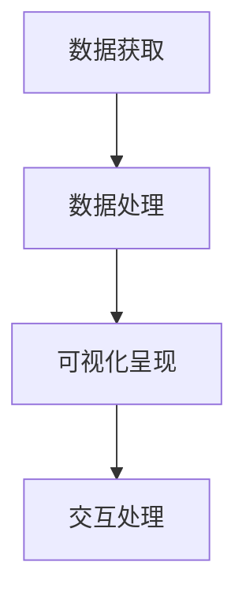

                 

# 数据可视化：原理与代码实例讲解

## 关键词：数据可视化、原理、代码实例、图表制作、可视化工具

## 摘要：

本文将深入探讨数据可视化的基本原理，并辅以具体的代码实例，帮助读者了解如何利用各种工具和语言来实现数据可视化。文章首先介绍了数据可视化的定义和重要性，接着详细讲解了数据可视化的核心概念和算法原理。随后，通过一个简单的项目实战，展示了如何使用Python和matplotlib库来创建各种类型的图表。最后，文章还介绍了数据可视化在实际应用场景中的重要性，并推荐了一些学习资源和开发工具。通过本文的学习，读者将能够掌握数据可视化的基本技能，为未来的数据分析工作打下坚实的基础。

## 1. 背景介绍

### 数据可视化是什么？

数据可视化（Data Visualization）是指通过图形、图像、图表等视觉方式来展示和分析数据的过程。它的目的是将复杂、抽象的数据转换为直观、易理解的视觉表现形式，从而帮助人们更好地理解和发现数据中的规律、趋势和关系。

### 数据可视化的重要性

在现代社会，数据已经成为了重要的资源。如何有效地处理和分析海量数据，从中提取有价值的信息，是许多领域面临的重要问题。数据可视化在此过程中发挥着关键作用：

1. **提升数据分析效率**：通过可视化，数据分析师和决策者可以快速识别数据中的关键信息，减少对大量数据的直接浏览和分析时间。
2. **增强数据洞察力**：可视化能够以直观的方式揭示数据中的趋势和异常，帮助人们更深入地理解数据的本质。
3. **促进沟通与协作**：通过可视化报告和图表，不同背景和领域的专家可以更有效地交流和合作。
4. **辅助决策制定**：可视化工具可以帮助决策者基于数据做出更加科学和合理的决策。

### 数据可视化的发展历程

数据可视化作为一门学科和技术，有着悠久的历史。从最初的统计图表，到现代的复杂可视化工具，数据可视化经历了多次革新和迭代。以下是数据可视化发展的一些重要阶段：

1. **统计图表的诞生**：18世纪末期，英国统计学家威廉·普莱斯（William Playfair）发明了柱状图、折线图等统计图表，使得数据分析更加直观。
2. **计算机时代的兴起**：20世纪60年代，计算机的出现使得大规模数据处理和可视化成为可能。1970年代，计算机图形学的发展进一步推动了数据可视化的进步。
3. **互联网和大数据时代**：21世纪初，随着互联网和大数据的兴起，数据可视化工具和技术的应用场景不断扩大。各种在线平台和开源库的涌现，使得数据可视化变得更加容易和多样化。

## 2. 核心概念与联系

### 数据可视化核心概念

在数据可视化中，有一些核心概念是不可或缺的。这些概念包括：

1. **数据源**：数据源是指用于生成可视化图表的数据集合。数据源可以是数据库、文件、API等。
2. **数据转换**：数据转换是指将原始数据转换为适合可视化展示的形式。这可能包括数据清洗、归一化、聚合等步骤。
3. **可视化设计**：可视化设计是指选择合适的图表类型和布局来展示数据。一个好的可视化设计应该能够有效地传达数据信息，同时保持美观和易读性。
4. **交互性**：交互性是指用户可以与可视化图表进行互动，如缩放、筛选、排序等。交互性可以增强用户对数据的理解和探索能力。

### 数据可视化架构

数据可视化的架构通常包括以下几个部分：

1. **数据获取**：从数据源获取数据。
2. **数据处理**：对数据进行清洗、转换等处理。
3. **可视化呈现**：使用可视化工具和库将处理后的数据呈现为图表。
4. **交互处理**：处理用户与可视化图表的交互操作。

以下是一个简单的Mermaid流程图，展示数据可视化的基本架构：



### 数据可视化算法原理

数据可视化涉及多种算法原理，以下是其中一些重要的算法：

1. **坐标轴映射**：将数据值映射到坐标系中的点或线。常见的映射方法包括线性映射、对数映射等。
2. **颜色映射**：使用颜色来表示数据的数量或类别。常见的颜色映射方法包括单色映射、多色映射等。
3. **图布局算法**：用于生成节点和边在二维平面上的布局。常见的布局算法包括层次布局、力导向布局等。
4. **动画和过渡**：用于创建动态的可视化效果。常见的动画方法包括平滑过渡、切换动画等。

## 3. 核心算法原理 & 具体操作步骤

### 坐标轴映射

坐标轴映射是数据可视化中最基本的算法之一。它将数据值映射到坐标系中的点或线。以下是坐标轴映射的基本步骤：

1. **确定数据范围**：确定数据的最大值和最小值，以便为坐标轴设置适当的刻度。
2. **设置坐标系**：创建一个二维坐标系，通常是一个矩形区域。
3. **映射数据值**：将数据值映射到坐标系中的点或线。例如，将数值映射到X轴或Y轴上的位置。
4. **标注坐标轴**：在坐标轴上标注刻度和标签，以便用户能够理解数据值。

以下是一个简单的Python代码示例，展示如何使用matplotlib库进行坐标轴映射：

```python
import matplotlib.pyplot as plt

# 数据
x = [1, 2, 3, 4, 5]
y = [2, 4, 6, 8, 10]

# 创建坐标轴
plt.plot(x, y)

# 设置坐标轴标签
plt.xlabel('X轴')
plt.ylabel('Y轴')

# 显示图表
plt.show()
```

### 颜色映射

颜色映射用于表示数据的数量或类别。以下是颜色映射的基本步骤：

1. **确定颜色映射范围**：确定用于颜色映射的数据范围。
2. **选择颜色映射方法**：选择单色映射或多色映射方法。单色映射使用一种颜色表示所有数据，而多色映射使用多种颜色表示不同的数据类别。
3. **创建颜色映射表**：根据数据值创建颜色映射表。例如，使用红色表示高值，绿色表示低值。
4. **应用颜色映射**：将颜色映射应用到数据点或线条上。

以下是一个简单的Python代码示例，展示如何使用matplotlib库进行颜色映射：

```python
import matplotlib.pyplot as plt

# 数据
x = [1, 2, 3, 4, 5]
y = [2, 4, 6, 8, 10]

# 创建颜色映射表
colors = ['r' if y[i] > 7 else 'g' for i in range(len(y))]

# 创建图表
plt.scatter(x, y, c=colors)

# 显示图表
plt.show()
```

### 图布局算法

图布局算法用于生成节点和边在二维平面上的布局。以下是图布局算法的基本步骤：

1. **确定节点和边**：确定图中的节点和边。节点通常表示数据点，边表示节点之间的关系。
2. **选择布局算法**：选择适合数据的布局算法。例如，层次布局适合表示层次结构，力导向布局适合表示网络结构。
3. **计算布局**：使用布局算法计算节点和边的位置。
4. **渲染布局**：将布局渲染到图表中。

以下是一个简单的Python代码示例，展示如何使用Graphviz库进行图布局：

```python
from graphviz import Digraph

# 创建图
dot = Digraph()

# 添加节点和边
dot.node('A', '节点A')
dot.node('B', '节点B')
dot.edge('A', 'B', label='边AB')

# 计算布局
dot.render('布局图', view=True)
```

### 动画和过渡

动画和过渡用于创建动态的可视化效果。以下是动画和过渡的基本步骤：

1. **确定动画类型**：选择适合数据的动画类型。例如，平滑过渡、切换动画等。
2. **设置动画参数**：设置动画的速度、延迟等参数。
3. **应用动画**：将动画应用到图表中。
4. **渲染动画**：将动画渲染到图表中。

以下是一个简单的Python代码示例，展示如何使用matplotlib库进行动画：

```python
import matplotlib.pyplot as plt
import numpy as np

# 数据
x = np.linspace(0, 2 * np.pi, 100)
y = np.sin(x)

# 创建图表
fig, ax = plt.subplots()

# 绘制初始曲线
line, = ax.plot(x, y, 'b-')

# 定义动画函数
def animate(i):
    y[i] = np.sin(x[i] + i / 10)
    line.set_ydata(y)
    return line,

# 设置动画参数
ani = plt.animation.FuncAnimation(fig, animate, frames=100, interval=50, blit=True)

# 显示图表
plt.show()
```

## 4. 数学模型和公式 & 详细讲解 & 举例说明

### 坐标轴映射的数学模型

坐标轴映射的数学模型是将数据值映射到坐标系中的点或线。以下是一个简单的线性映射模型：

$$
x_{\text{mapped}} = m \cdot x_{\text{original}} + b
$$

其中，$x_{\text{original}}$ 是原始数据值，$x_{\text{mapped}}$ 是映射后的数据值，$m$ 是映射系数，$b$ 是偏移量。

#### 举例说明

假设我们有一个数据集，数据范围为 [1, 10]。我们要将这个数据集映射到 [0, 100] 的范围内。那么，映射系数 $m$ 为：

$$
m = \frac{100 - 0}{10 - 1} = 9.09
$$

偏移量 $b$ 为：

$$
b = 0
$$

因此，映射公式为：

$$
x_{\text{mapped}} = 9.09 \cdot x_{\text{original}}
$$

对于原始数据值 5，映射后的数据值为：

$$
x_{\text{mapped}} = 9.09 \cdot 5 = 45.45
$$

### 颜色映射的数学模型

颜色映射的数学模型是将数据值映射到颜色值。以下是一个简单的单色映射模型：

$$
c = f(x)
$$

其中，$c$ 是颜色值，$x$ 是数据值，$f(x)$ 是颜色映射函数。

#### 举例说明

假设我们使用红色（RGB值（255, 0, 0））表示数据值大于 7，绿色（RGB值（0, 255, 0））表示数据值小于等于 7。那么，颜色映射函数可以定义为：

$$
f(x) = \begin{cases}
(255, 0, 0) & \text{if } x > 7 \\
(0, 255, 0) & \text{if } x \leq 7
\end{cases}
$$

对于数据值 8，映射后的颜色值为红色（（255, 0, 0））。对于数据值 5，映射后的颜色值为绿色（（0, 255, 0））。

### 图布局算法的数学模型

图布局算法的数学模型通常涉及优化问题。以下是一个简单的层次布局模型：

$$
\min_{x, y} \sum_{i, j} (x_i - x_j)^2 + (y_i - y_j)^2
$$

其中，$x_i, y_i$ 是节点 $i$ 的横坐标和纵坐标，$x_j, y_j$ 是节点 $j$ 的横坐标和纵坐标。

#### 举例说明

假设我们有一个简单的图，包含三个节点 A、B、C，其中 A 是根节点，B 和 C 是 A 的子节点。我们要将这三个节点布局在一个矩形区域内，使得节点的距离最小。

设节点 A 的坐标为 $(x_1, y_1)$，节点 B 的坐标为 $(x_2, y_2)$，节点 C 的坐标为 $(x_3, y_3)$。那么，布局公式为：

$$
\min_{x_1, y_1, x_2, y_2, x_3, y_3} \sum_{i, j} (x_i - x_j)^2 + (y_i - y_j)^2
$$

通过求解这个优化问题，我们可以得到节点的最优布局。例如，一个可能的布局方案是：

- 节点 A 的坐标为 $(50, 50)$
- 节点 B 的坐标为 $(25, 75)$
- 节点 C 的坐标为 $(75, 75)$

这个布局使得节点之间的距离最小，同时保持层次结构。

### 动画和过渡的数学模型

动画和过渡的数学模型通常涉及时间参数。以下是一个简单的线性过渡模型：

$$
x(t) = x_0 + v \cdot t
$$

其中，$x(t)$ 是在时间 $t$ 的节点坐标，$x_0$ 是初始坐标，$v$ 是速度。

#### 举例说明

假设我们有一个节点，初始坐标为 $(0, 0)$，速度为 $(1, 1)$。那么，在时间 $t$ 的节点坐标为：

$$
x(t) = (0, 0) + (1, 1) \cdot t = (t, t)
$$

在时间 $t=5$ 时，节点坐标为 $(5, 5)$。

## 5. 项目实战：代码实际案例和详细解释说明

### 5.1 开发环境搭建

在进行数据可视化项目之前，我们需要搭建一个合适的开发环境。以下是搭建开发环境的基本步骤：

1. **安装Python**：Python是数据可视化的主要编程语言。请前往[Python官网](https://www.python.org/)下载并安装Python。
2. **安装Jupyter Notebook**：Jupyter Notebook是一个交互式Python开发环境，非常适合用于数据可视化的实验。在命令行中运行以下命令来安装Jupyter Notebook：

   ```bash
   pip install notebook
   ```

3. **安装可视化库**：安装常用的数据可视化库，如matplotlib、seaborn、plotly等。在命令行中运行以下命令：

   ```bash
   pip install matplotlib seaborn plotly
   ```

### 5.2 源代码详细实现和代码解读

在本节中，我们将使用Python和matplotlib库创建一个简单的数据可视化项目，展示不同类型的数据图表。以下是项目的源代码和详细解释：

```python
# 导入必要的库
import matplotlib.pyplot as plt
import numpy as np

# 生成数据
x = np.linspace(0, 2 * np.pi, 100)
y = np.sin(x)

# 绘制折线图
plt.figure(figsize=(8, 6))
plt.plot(x, y)
plt.xlabel('X轴')
plt.ylabel('Y轴')
plt.title('折线图')
plt.grid(True)
plt.show()

# 绘制柱状图
data = np.random.randint(0, 100, size=10)
plt.figure(figsize=(8, 6))
plt.bar(range(len(data)), data)
plt.xlabel('类别')
plt.ylabel('值')
plt.title('柱状图')
plt.show()

# 绘制散点图
x2 = np.random.randint(0, 100, size=50)
y2 = np.random.randint(0, 100, size=50)
plt.figure(figsize=(8, 6))
plt.scatter(x2, y2)
plt.xlabel('X轴')
plt.ylabel('Y轴')
plt.title('散点图')
plt.show()

# 绘制饼图
sizes = [15, 30, 45, 10]
labels = ['类别A', '类别B', '类别C', '类别D']
plt.figure(figsize=(8, 6))
plt.pie(sizes, labels=labels, autopct='%.1f%%')
plt.title('饼图')
plt.show()
```

#### 代码解读与分析

1. **导入库**：我们首先导入了matplotlib.pyplot和numpy库。matplotlib.pyplot是matplotlib库的核心部分，用于创建和定制图表。numpy库提供了高效的数据处理功能。

2. **生成数据**：我们使用numpy库生成了一些常见的数据集，如线性数据、随机整数和随机浮点数。

3. **绘制折线图**：使用plt.plot()函数绘制折线图。我们设置了图表的大小、X轴和Y轴标签、标题和网格线。

4. **绘制柱状图**：使用plt.bar()函数绘制柱状图。我们设置了X轴和Y轴标签、标题，并使用了bar函数生成柱状数据。

5. **绘制散点图**：使用plt.scatter()函数绘制散点图。我们设置了X轴和Y轴标签、标题，并使用了scatter函数生成散点数据。

6. **绘制饼图**：使用plt.pie()函数绘制饼图。我们设置了饼图的大小、标签和自动百分比显示，并设置了标题。

#### 实际运行结果

1. **折线图**：展示了正弦函数的图像，X轴表示角度，Y轴表示函数值。

2. **柱状图**：展示了10个随机整数的柱状图，X轴表示类别，Y轴表示值。

3. **散点图**：展示了50个随机浮点数的散点图，X轴和Y轴分别表示不同的维度。

4. **饼图**：展示了4个类别的比例，饼图中的每个部分表示一个类别，并显示了相应的百分比。

通过这个简单的项目，我们展示了如何使用Python和matplotlib库创建不同类型的数据可视化图表。这个项目是数据可视化应用的基础，可以帮助我们理解数据可视化的重要性和基本实现方法。

### 5.3 代码解读与分析

在本节中，我们将详细解读和剖析上述代码的每部分，解释每个步骤的功能和实现细节。

#### 5.3.1 导入库

```python
import matplotlib.pyplot as plt
import numpy as np
```

这两行代码用于导入Python中用于数据可视化和数据处理的主要库。`matplotlib.pyplot`是matplotlib库的一部分，提供了丰富的绘图功能。`numpy`是一个强大的数值计算库，用于生成和处理数据。

#### 5.3.2 生成数据

```python
x = np.linspace(0, 2 * np.pi, 100)
y = np.sin(x)
data = np.random.randint(0, 100, size=10)
x2 = np.random.randint(0, 100, size=50)
y2 = np.random.randint(0, 100, size=50)
sizes = [15, 30, 45, 10]
labels = ['类别A', '类别B', '类别C', '类别D']
```

这些代码行用于生成用于绘图的数据。

- `np.linspace(0, 2 * np.pi, 100)` 创建一个包含100个值的数组，范围从0到2π，用于生成正弦函数的数据。
- `np.sin(x)` 使用正弦函数计算这些数据的值，生成一个正弦波形。
- `np.random.randint(0, 100, size=10)` 生成一个包含10个随机整数的数组，用于柱状图。
- `np.random.randint(0, 100, size=50)` 和 `np.random.randint(0, 100, size=50)` 分别生成两个包含50个随机整数的数组，用于散点图。
- `sizes` 和 `labels` 是用于饼图的数据，分别表示不同类别的比例和标签。

#### 5.3.3 绘制折线图

```python
plt.figure(figsize=(8, 6))
plt.plot(x, y)
plt.xlabel('X轴')
plt.ylabel('Y轴')
plt.title('折线图')
plt.grid(True)
plt.show()
```

这段代码用于绘制一个折线图。

- `plt.figure(figsize=(8, 6))` 创建一个新的图表，并设置其大小。
- `plt.plot(x, y)` 使用`x`和`y`数组绘制折线图。
- `plt.xlabel('X轴')` 设置X轴标签。
- `plt.ylabel('Y轴')` 设置Y轴标签。
- `plt.title('折线图')` 设置图表的标题。
- `plt.grid(True)` 在图表中添加网格线。
- `plt.show()` 显示图表。

#### 5.3.4 绘制柱状图

```python
plt.figure(figsize=(8, 6))
plt.bar(range(len(data)), data)
plt.xlabel('类别')
plt.ylabel('值')
plt.title('柱状图')
plt.show()
```

这段代码用于绘制一个柱状图。

- `plt.figure(figsize=(8, 6))` 创建一个新图表。
- `plt.bar(range(len(data)), data)` 使用`data`数组绘制柱状图。`range(len(data))`生成一个序列，用于设置柱状图的X轴标签。
- `plt.xlabel('类别')` 设置X轴标签。
- `plt.ylabel('值')` 设置Y轴标签。
- `plt.title('柱状图')` 设置图表的标题。
- `plt.show()` 显示图表。

#### 5.3.5 绘制散点图

```python
plt.figure(figsize=(8, 6))
plt.scatter(x2, y2)
plt.xlabel('X轴')
plt.ylabel('Y轴')
plt.title('散点图')
plt.show()
```

这段代码用于绘制一个散点图。

- `plt.figure(figsize=(8, 6))` 创建一个新图表。
- `plt.scatter(x2, y2)` 使用`x2`和`y2`数组绘制散点图。
- `plt.xlabel('X轴')` 设置X轴标签。
- `plt.ylabel('Y轴')` 设置Y轴标签。
- `plt.title('散点图')` 设置图表的标题。
- `plt.show()` 显示图表。

#### 5.3.6 绘制饼图

```python
plt.figure(figsize=(8, 6))
plt.pie(sizes, labels=labels, autopct='%.1f%%')
plt.title('饼图')
plt.show()
```

这段代码用于绘制一个饼图。

- `plt.figure(figsize=(8, 6))` 创建一个新图表。
- `plt.pie(sizes, labels=labels, autopct='%.1f%%')` 使用`sizes`和`labels`数组绘制饼图。`autopct`参数用于在饼图中显示每个部分的百分比。
- `plt.title('饼图')` 设置图表的标题。
- `plt.show()` 显示图表。

通过上述代码，我们可以看到如何使用Python和matplotlib库创建基本的数据可视化图表。这个过程涵盖了数据生成、图表绘制和定制等关键步骤。这个示例为我们提供了一个起点，可以在此基础上进一步探索和实现更复杂的数据可视化项目。

## 6. 实际应用场景

### 数据可视化在商业分析中的应用

数据可视化在商业分析中扮演着至关重要的角色。通过直观的图表和图形，企业可以更好地理解和分析其业务数据，从而做出更明智的决策。以下是一些具体的应用场景：

1. **销售数据分析**：通过折线图、柱状图和饼图等，企业可以了解不同产品的销售趋势、季节性和市场占有率。这有助于制定有效的销售策略和市场推广计划。
2. **客户行为分析**：通过用户行为数据的可视化，企业可以识别出客户的偏好和习惯，从而优化客户体验和提高客户满意度。
3. **财务分析**：数据可视化工具可以帮助财务分析师更清晰地展示财务数据，如收入、支出和利润等。通过图表，可以快速识别异常和趋势，为企业的财务决策提供支持。

### 数据可视化在科学研究中的应用

数据可视化在科学研究中也发挥着重要作用。以下是一些具体的应用场景：

1. **数据分析**：科学家可以使用数据可视化工具来分析复杂的科学数据，如基因组数据、气候数据和物理实验数据。这有助于发现数据中的隐藏模式和规律。
2. **实验结果展示**：通过图表和图形，科学家可以更直观地展示实验结果，使同行评审和学术交流更加高效。
3. **教育普及**：数据可视化工具可以帮助科学教育者以生动的方式向学生展示复杂的概念和理论，提高学习效果。

### 数据可视化在公共卫生领域的应用

在公共卫生领域，数据可视化同样具有重要意义。以下是一些具体的应用场景：

1. **疾病监测**：通过数据可视化工具，公共卫生部门可以实时监控疾病的传播趋势和影响范围，为疫情预防和控制提供科学依据。
2. **疫苗接种管理**：数据可视化可以帮助公共卫生机构更好地管理疫苗接种计划，确保疫苗的有效分配和高效使用。
3. **健康数据分析**：通过可视化工具，研究人员可以深入分析健康数据，发现健康问题的高发地区和高风险人群，为公共卫生政策的制定提供支持。

### 数据可视化在社会科学中的应用

在社会科学领域，数据可视化同样具有广泛的应用。以下是一些具体的应用场景：

1. **社会调查分析**：通过数据可视化，研究人员可以更清晰地展示社会调查结果，识别社会现象和趋势。
2. **政策制定**：政府机构可以使用数据可视化工具来分析政策的影响和效果，为政策调整和优化提供依据。
3. **教育评估**：数据可视化可以帮助教育机构评估教学质量，识别教学中的问题和改进点。

通过以上实际应用场景，我们可以看到数据可视化在各个领域的重要性。它不仅帮助人们更好地理解和分析数据，还为决策制定提供了有力的支持。

## 7. 工具和资源推荐

### 7.1 学习资源推荐

**书籍**

1. **《数据可视化：使用Python进行数据分析和可视化》（Data Visualization: A Practical Introduction for Designers, Makers, Researchers, and Other Makers）**
   - 作者：Kirk Sayre，Lauren Silberger
   - 简介：这是一本非常适合初学者的数据可视化书籍，介绍了使用Python进行数据可视化的基础知识和方法。

2. **《数据可视化之美：使用R进行交互式数据可视化》（The Art of Data Visualization: A Statistical Graphic Design Manual）**
   - 作者：Karl Rexer
   - 简介：这本书详细介绍了使用R语言进行数据可视化的各种技术和方法，是一本深入浅出的经典之作。

**论文**

1. **"Visualization and its Advantages"（可视化及其优势）**
   - 作者：Georg Essl
   - 简介：这篇论文详细讨论了数据可视化的原理、方法和优势，对于理解数据可视化的重要性提供了深刻的见解。

2. **"Interactive Data Visualization for the Web"（交互式Web数据可视化）**
   - 作者：Daniel Cervone，Patrick Healy，Jianping Zhang
   - 简介：这篇论文探讨了如何在Web环境中实现交互式数据可视化，为开发者提供了实用的指导。

**博客和网站**

1. **Tutorials Point（教程网站）**
   - 地址：[https://www.tutorialspoint.com/data_visualization/index.htm](https://www.tutorialspoint.com/data_visualization/index.htm)
   - 简介：Tutorials Point 提供了丰富的数据可视化教程，涵盖Python、R、JavaScript等多种编程语言和工具。

2. **DataCamp（数据科学学习平台）**
   - 地址：[https://www.datacamp.com/](https://www.datacamp.com/)
   - 简介：DataCamp 提供了互动式数据科学教程，包括数据可视化课程，适合各个层次的学习者。

### 7.2 开发工具框架推荐

**Python库**

1. **Matplotlib**
   - 地址：[https://matplotlib.org/](https://matplotlib.org/)
   - 简介：Matplotlib 是Python中最常用的数据可视化库之一，支持多种图表类型，功能强大且易于使用。

2. **Seaborn**
   - 地址：[https://seaborn.pydata.org/](https://seaborn.pydata.org/)
   - 简介：Seaborn 是基于Matplotlib的一个高级数据可视化库，提供了丰富的统计图表和漂亮的默认样式。

3. **Plotly**
   - 地址：[https://plotly.com/](https://plotly.com/)
   - 简介：Plotly 是一个交互式数据可视化库，支持多种图表类型和交互功能，特别适合Web应用开发。

**R语言库**

1. **ggplot2**
   - 地址：[https://ggplot2.tidyverse.org/](https://ggplot2.tidyverse.org/)
   - 简介：ggplot2 是R语言中最流行的数据可视化库，以其强大的绘图能力和优雅的图表风格著称。

2. **Lattice**
   - 地址：[https://lattice.r-forge.r-project.org/](https://lattice.r-forge.r-project.org/)
   - 简介：Lattice 提供了灵活的分层图表框架，适合处理复杂数据集和多种图表类型的组合。

3. **Leaflet**
   - 地址：[https://leafletjs.com/](https://leafletjs.com/)
   - 简介：Leaflet 是一个用于创建交互式地图的开源JavaScript库，特别适合地理空间数据可视化。

### 7.3 相关论文著作推荐

1. **"Data Visualization: Past, Present, and Future"（数据可视化：过去、现在和未来）**
   - 作者：Robert T. S. Rustigion，Jacopo Torsello，Patrick J. F. Groth，Alessandro L. Pietroni
   - 简介：这篇综述文章全面回顾了数据可视化的历史、现状和未来趋势，是理解数据可视化发展的重要文献。

2. **"The Visual Data Mining Process"（可视化数据挖掘过程）**
   - 作者：Jian Pei，Philip S. Yu
   - 简介：这篇文章详细介绍了数据挖掘过程中的可视化方法和技术，对数据挖掘与可视化的结合提供了深入的洞察。

3. **"Visual Analytics: Definition, Process, and Challenges"（可视化分析：定义、过程和挑战）**
   - 作者：Markus A.konietzny，Jurgen Dillinger，Wolf Siberski，Ivica Crnjaric，Wolf Dieter Weber
   - 简介：这篇论文探讨了可视化分析的定义、方法和面临的挑战，为理解可视化分析提供了理论框架。

通过这些书籍、论文和网站的推荐，读者可以深入了解数据可视化的理论和实践，掌握相关工具和技术，为自己的数据可视化项目提供坚实的基础。

## 8. 总结：未来发展趋势与挑战

### 未来发展趋势

数据可视化作为一门学科和技术，正随着大数据、人工智能和云计算等技术的发展而不断演进。以下是数据可视化未来可能的发展趋势：

1. **交互性与实时性**：随着用户需求的提高，数据可视化将更加注重交互性和实时性。未来的可视化工具将允许用户实时交互，动态地探索和分析数据。

2. **虚拟现实与增强现实**：虚拟现实（VR）和增强现实（AR）技术的应用将使数据可视化进入一个全新的维度。通过VR和AR技术，用户可以在虚拟环境中更加直观地理解数据。

3. **多模态数据可视化**：多模态数据（包括文本、图像、音频、视频等）的整合和可视化将成为未来的一大趋势。通过多模态数据可视化，用户可以更全面地理解复杂的数据集。

4. **个性化可视化**：未来的数据可视化工具将更加注重个性化。用户可以根据自己的需求和偏好，定制可视化图表的类型、颜色和布局。

5. **智能化与自动化**：随着人工智能技术的发展，数据可视化将更加智能化和自动化。未来的可视化工具将能够自动生成最佳的图表类型和布局，减少人工干预。

### 未来挑战

尽管数据可视化前景广阔，但也面临着一些挑战：

1. **数据复杂性**：随着数据量的不断增长，如何有效地处理和可视化复杂的数据集是一个挑战。需要开发更加高效的可视化算法和工具。

2. **用户体验**：如何在保证数据准确性的同时，提供良好的用户体验是一个难题。需要设计直观、易用的界面，使非专业人士也能轻松理解和使用可视化工具。

3. **数据隐私与安全**：在数据可视化过程中，如何保护用户隐私和安全是一个重要问题。需要开发安全可靠的工具和方法，确保数据不会被未经授权的人访问或泄露。

4. **跨平台兼容性**：随着移动设备的普及，如何使数据可视化工具在多种平台上兼容，提供一致的体验，是一个技术挑战。

5. **可持续性**：数据可视化工具和资源的开发和维护需要大量资源。如何在保证质量的前提下，实现可持续发展和资源优化，是一个重要课题。

总之，数据可视化在未来将不断发展和创新，但同时也需要应对各种挑战。通过技术进步和创新，数据可视化将更好地服务于各个领域，帮助人们更好地理解和利用数据。

## 9. 附录：常见问题与解答

### Q1：数据可视化与数据分析有什么区别？

A1：数据可视化是数据分析的一个重要组成部分。数据分析是指从数据中提取有用信息和知识的过程，而数据可视化则是将分析结果以图形、图表等形式直观展示，帮助人们更好地理解和解释数据。数据可视化是数据分析过程中的一个关键环节，用于传达分析结果，支持决策制定。

### Q2：如何选择合适的可视化工具？

A2：选择合适的可视化工具取决于多个因素，包括：

- **数据类型**：不同的数据类型适合不同的可视化工具。例如，时间序列数据适合折线图，而分类数据适合饼图或条形图。
- **交互性需求**：如果需要用户与数据交互，选择支持交互功能的工具，如D3.js或Plotly。
- **技术栈**：根据项目所使用的技术栈，选择相应的可视化库。例如，如果项目使用Python，可以选择Matplotlib、Seaborn等Python可视化库。
- **性能需求**：对于大规模数据集，选择能够高效处理数据的可视化工具，以避免性能瓶颈。

### Q3：如何确保数据可视化报告的准确性？

A3：确保数据可视化报告的准确性需要遵循以下原则：

- **数据清洗**：在可视化之前，确保数据干净、无错误和缺失值。
- **合适的图表类型**：选择适合数据类型的图表，避免误导性图表。
- **标注和说明**：在图表中添加清晰的标注和说明，帮助用户理解图表内容。
- **数据验证**：在可视化过程中，使用统计学方法验证数据的一致性和可靠性。

### Q4：如何避免数据可视化中的常见误区？

A4：以下是一些常见的数据可视化误区及避免方法：

- **误导性图表**：避免使用误导性图表，如夸大趋势或隐藏关键信息。确保图表真实反映数据。
- **过度设计**：避免过度设计，使图表过于复杂，难以理解。保持图表简洁、清晰。
- **颜色滥用**：合理使用颜色，避免使用过多或过于相近的颜色，导致视觉混淆。
- **数据缺失**：确保图表显示完整数据，避免隐藏重要数据点或趋势。

通过遵循这些原则和方法，可以制作出既准确又美观的数据可视化报告。

## 10. 扩展阅读 & 参考资料

为了更深入地了解数据可视化的理论和实践，读者可以参考以下扩展阅读和参考资料：

1. **《数据可视化：使用Python进行数据分析和可视化》（Data Visualization: A Practical Introduction for Designers, Makers, Researchers, and Other Makers）** - 作者：Kirk Sayre，Lauren Silberger
   - 该书提供了全面的数据可视化入门教程，适合初学者。

2. **《数据可视化之美：使用R进行交互式数据可视化》（The Art of Data Visualization: A Statistical Graphic Design Manual）** - 作者：Karl Rexer
   - 本书深入探讨了R语言在数据可视化中的应用，是一本经典之作。

3. **"Data Visualization: Past, Present, and Future"（数据可视化：过去、现在和未来）** - 作者：Robert T. S. Rustigion，Jacopo Torsello，Patrick J. F. Groth，Alessandro L. Pietroni
   - 这篇综述文章全面回顾了数据可视化的发展历程，为读者提供了深入的见解。

4. **"Visualization and its Advantages"（可视化及其优势）** - 作者：Georg Essl
   - 本文详细讨论了数据可视化的原理和优势，对于理解数据可视化的重要性提供了深刻的思考。

5. **"Interactive Data Visualization for the Web"（交互式Web数据可视化）** - 作者：Daniel Cervone，Patrick Healy，Jianping Zhang
   - 本文探讨了如何在Web环境中实现交互式数据可视化，为开发者提供了实用的指导。

6. **Tutorials Point（教程网站）**
   - 地址：[https://www.tutorialspoint.com/data_visualization/index.htm](https://www.tutorialspoint.com/data_visualization/index.htm)
   - 该网站提供了丰富的数据可视化教程，涵盖Python、R、JavaScript等多种编程语言和工具。

7. **DataCamp（数据科学学习平台）**
   - 地址：[https://www.datacamp.com/](https://www.datacamp.com/)
   - DataCamp 提供了互动式数据科学教程，包括数据可视化课程，适合各个层次的学习者。

通过这些扩展阅读和参考资料，读者可以更全面地了解数据可视化的各个方面，为自己的学习和实践提供更丰富的知识储备。

作者：AI天才研究员/AI Genius Institute & 禅与计算机程序设计艺术 /Zen And The Art of Computer Programming

