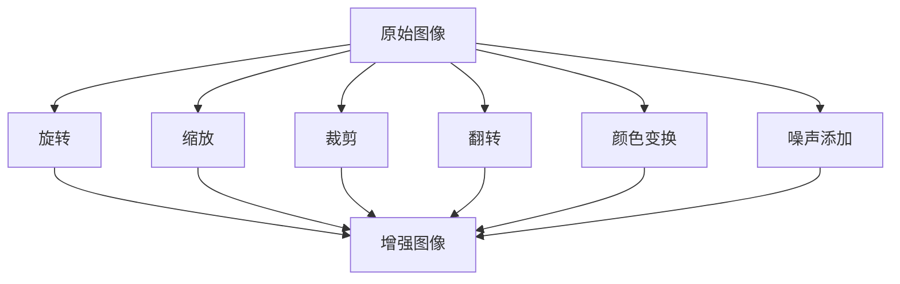
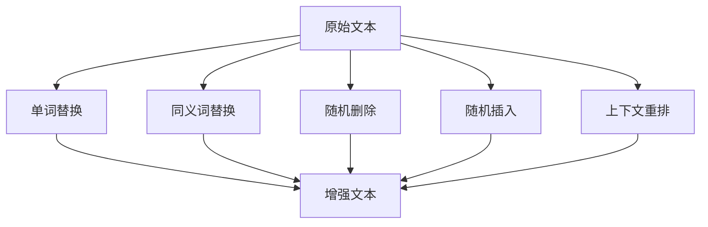

                 

### 背景介绍

#### 数据增强技术的重要性

数据增强（Data Augmentation）是机器学习和深度学习领域中的一项关键技术，其主要目的是通过在训练数据集中引入噪声或对现有数据进行变换，来增加数据的多样性和复杂性。这种技术的应用极大地提升了模型的泛化能力和鲁棒性，使其能够更好地适应现实世界的复杂场景。

在过去的几十年中，随着深度学习技术的飞速发展，数据增强技术也得到了广泛应用。特别是在计算机视觉和自然语言处理领域，数据增强技术已经成为提升模型性能的必备手段。例如，在图像分类任务中，通过旋转、缩放、裁剪等操作，可以使模型对各种不同的图像输入具备更好的适应性。在文本分类任务中，通过添加噪声、替换单词、上下文重排等操作，可以增强模型的鲁棒性。

#### 图像数据增强技术

在图像数据增强技术方面，常见的操作包括旋转、缩放、裁剪、颜色变换、添加噪声等。以下是几种常见的图像数据增强方法：

1. **旋转（Rotation）**：通过将图像旋转一定角度，可以增加数据的多样性。旋转角度可以是固定的，也可以是随机选择的。

2. **缩放（Scaling）**：通过缩放图像，可以改变图像的大小。缩放比例可以是固定的，也可以是随机选择的。

3. **裁剪（Cropping）**：通过随机裁剪图像的一部分，可以增加数据的多样性。裁剪的位置可以是固定的，也可以是随机选择的。

4. **颜色变换（Color Transformation）**：通过调整图像的颜色空间或颜色值，可以改变图像的外观。常见的颜色变换包括灰度化、颜色空间转换（如RGB到HSV）、颜色直方图均衡化等。

5. **添加噪声（Noise Addition）**：通过在图像上添加噪声，可以增强模型的鲁棒性。常见的噪声类型包括高斯噪声、椒盐噪声等。

#### 文本数据增强技术

在文本数据增强技术方面，常见的操作包括添加噪声、替换单词、上下文重排等。以下是几种常见的文本数据增强方法：

1. **添加噪声（Noise Addition）**：通过在文本中添加噪声字符、删除字符或替换字符，可以增加文本的多样性。例如，可以在文本中随机插入一些无关的词语或删除一些重要的词语。

2. **替换单词（Word Replacement）**：通过将文本中的单词替换为同义词或随机选择的单词，可以增加文本的多样性。替换的单词可以是固定的，也可以是随机选择的。

3. **上下文重排（Context Reordering）**：通过重新排列文本中的句子或段落，可以增加文本的多样性。例如，可以将文本中的两个句子交换位置，或将一个句子拆分成几个部分。

#### 数据增强技术的挑战

尽管数据增强技术在提升模型性能方面具有显著的优势，但其在实际应用中也面临一些挑战。以下是一些主要挑战：

1. **数据质量**：数据增强技术依赖于原始数据的多样性。如果原始数据质量较低，则增强后的数据可能仍然缺乏多样性，从而无法有效提升模型性能。

2. **计算成本**：数据增强操作通常需要大量的计算资源，特别是在处理大规模数据集时。这可能导致训练时间显著增加。

3. **过度拟合**：如果数据增强操作过于剧烈，可能会导致模型过度拟合增强后的数据，从而在原始数据上表现不佳。

4. **模型适应性**：数据增强技术的效果依赖于模型的适应性。如果模型对数据的适应性较差，则增强后的数据可能对模型性能的提升有限。

总的来说，数据增强技术是一项非常强大且实用的技术，但其在实际应用中仍需要综合考虑多种因素，以达到最佳效果。

-----------------------

## 2. 核心概念与联系

在深入探讨数据增强技术之前，我们需要明确几个核心概念及其之间的联系，这些概念包括数据增强的定义、其在机器学习和深度学习中的作用、以及具体的图像和文本数据增强方法。

#### 数据增强的定义

数据增强是一种通过增加训练数据集的多样性和复杂性来提升模型泛化能力的方法。它主要包括对现有数据进行各种形式的变换，例如图像的旋转、缩放、裁剪，文本的单词替换、噪声添加和上下文重排等。数据增强的目的是使模型能够从更广泛的场景中学习，从而减少模型对特定样本的依赖。

#### 数据增强在机器学习和深度学习中的作用

在机器学习和深度学习中，数据增强具有以下几个重要作用：

1. **提高模型的泛化能力**：通过增加训练数据的多样性，模型可以更好地适应各种不同的输入数据，从而提高其泛化能力。

2. **减少过拟合**：过拟合是指模型在训练数据上表现良好，但在未见过的数据上表现不佳。数据增强可以通过引入更多的训练样本来减轻过拟合现象。

3. **加速模型训练**：在训练初期，数据增强可以帮助模型更快地收敛到最优解。

4. **提高模型稳定性**：通过引入噪声，数据增强可以提高模型的鲁棒性，使其对噪声和异常值更加敏感。

#### 图像数据增强方法

对于图像数据增强，常用的方法包括以下几种：

1. **旋转（Rotation）**：通过旋转图像，可以增加图像的方向多样性。
2. **缩放（Scaling）**：通过缩放图像，可以增加图像的大小多样性。
3. **裁剪（Cropping）**：通过随机裁剪图像，可以增加图像的局部多样性。
4. **颜色变换（Color Transformation）**：通过调整图像的颜色空间或颜色值，可以增加图像的视觉效果多样性。
5. **添加噪声（Noise Addition）**：通过在图像上添加噪声，可以提高模型的鲁棒性。

#### 文本数据增强方法

对于文本数据增强，常用的方法包括以下几种：

1. **单词替换（Word Replacement）**：通过将文本中的单词替换为同义词或随机单词，可以增加文本的多样性。
2. **添加噪声（Noise Addition）**：通过在文本中添加噪声字符、删除字符或替换字符，可以增加文本的多样性。
3. **上下文重排（Context Reordering）**：通过重新排列文本中的句子或段落，可以增加文本的结构多样性。

#### 数据增强方法的联系

图像和文本数据增强方法在目标上是一致的，即增加数据的多样性和复杂性。然而，由于图像和文本数据的特性不同，它们的数据增强方法也有所差异。例如，图像数据增强主要关注视觉效果和空间关系，而文本数据增强则更多地关注语义和上下文。

总之，数据增强技术是机器学习和深度学习中的一个重要组成部分，它通过增加训练数据的多样性，提高了模型的泛化能力和鲁棒性。图像和文本数据增强方法各有特点，但都是为了实现相同的目标。理解这些核心概念和它们之间的联系，有助于我们更好地应用数据增强技术，提升模型性能。

-----------------------

## 2.1. 图像数据增强的概念与流程图

### 图像数据增强的基本概念

图像数据增强（Image Data Augmentation）是一种在深度学习过程中，通过模拟真实世界中的图像多样性，来扩充训练数据集的方法。这种技术的核心思想是通过一系列图像变换操作，生成与原始图像在内容上相似但细节上有所差异的新图像，从而增加模型的训练样本多样性。

常见的图像数据增强方法包括旋转、缩放、裁剪、翻转、颜色变换和噪声添加等。这些操作不仅丰富了训练数据，还可以有效地提高模型对数据的泛化能力。

### 数据增强流程图

以下是一个简化的图像数据增强流程图，用Mermaid语法表示，其中包含了主要的图像变换操作：



### 具体解释

1. **原始图像（A）**：这是开始的数据，是模型需要学习特征的对象。

2. **旋转（B）**：图像旋转可以增加图像的方向多样性，常用的旋转角度有0度、90度、180度和270度。

3. **缩放（C）**：通过缩放图像，可以改变图像的大小。例如，将图像缩小到原来的0.5倍或放大到原来的2倍。

4. **裁剪（D）**：随机裁剪图像的一部分，可以增加图像的局部多样性。这可以通过中心裁剪、左上角裁剪、随机裁剪等方式实现。

5. **翻转（E）**：水平翻转和垂直翻转可以增加图像的对称性多样性。

6. **颜色变换（F）**：颜色变换包括调整图像的亮度、对比度和颜色饱和度等，例如将彩色图像转换为灰度图像，或者将图像从RGB颜色空间转换为HSV颜色空间。

7. **噪声添加（G）**：通过在图像上添加噪声，可以提高模型的鲁棒性。常见的噪声类型包括高斯噪声、椒盐噪声等。

8. **增强图像（H）**：经过上述操作后生成的新图像，是模型训练的新样本。

通过这个流程图，我们可以清晰地看到图像数据增强的主要步骤和操作。这些操作不仅增强了训练数据的多样性，也使得模型能够更好地适应实际应用场景中的变化和噪声。

-----------------------

## 2.2. 文本数据增强的概念与流程图

### 文本数据增强的基本概念

文本数据增强（Text Data Augmentation）是提高自然语言处理（NLP）模型性能的一种重要手段。它通过在训练文本数据中引入多样性，使得模型能够更好地泛化和应对各种不同的语言场景。文本数据增强的目标是通过多种操作生成新的文本数据，从而扩充训练集的规模和多样性。

常见的文本数据增强方法包括单词替换、同义词替换、随机删除、随机插入和上下文重排等。这些方法可以帮助模型学习到更多的语言模式和上下文关系，从而提高模型的鲁棒性和泛化能力。

### 数据增强流程图

以下是一个简化的文本数据增强流程图，用Mermaid语法表示：



### 具体解释

1. **原始文本（A）**：这是文本数据增强的起点，是模型需要学习的内容。

2. **单词替换（B）**：通过将文本中的单词替换为同义词或随机选择的单词，可以增加文本的多样性。例如，将“快速”替换为“迅速”或“飞快”。

3. **同义词替换（C）**：类似单词替换，但更专注于使用同义词库，以保持句子的语义一致性。

4. **随机删除（D）**：在文本中随机删除一些字符或单词，可以增加文本的不确定性，从而提高模型的鲁棒性。

5. **随机插入（E）**：在文本中随机插入一些字符或单词，可以增加文本的复杂性和多样性。

6. **上下文重排（F）**：通过重新排列文本中的句子或段落，可以改变文本的结构和语义关系，从而增加文本的多样性。

7. **增强文本（G）**：经过上述操作后生成的新文本，是模型训练的新样本。

通过这个流程图，我们可以清晰地看到文本数据增强的主要步骤和操作。这些操作不仅增强了训练文本的多样性，也使得模型能够更好地学习到语言的本质特征。

-----------------------

## 3. 核心算法原理 & 具体操作步骤

### 图像数据增强算法原理

图像数据增强算法主要基于图像处理技术，通过对原始图像进行一系列变换，生成新的图像数据。以下是一些核心算法原理和具体操作步骤：

1. **旋转（Rotation）**：
   - **原理**：旋转操作通过将图像绕某个中心点旋转一定角度，增加图像的方向多样性。
   - **步骤**：
     - 确定旋转中心点和旋转角度。
     - 应用旋转矩阵进行图像旋转。
     - 调整边界处理，如裁剪或填充。

2. **缩放（Scaling）**：
   - **原理**：缩放操作通过改变图像的大小，增加图像的尺度多样性。
   - **步骤**：
     - 确定缩放比例。
     - 应用缩放变换公式计算新像素位置。
     - 填充或裁剪图像以适应目标尺寸。

3. **裁剪（Cropping）**：
   - **原理**：裁剪操作通过随机选择图像的一部分，增加图像的局部多样性。
   - **步骤**：
     - 确定裁剪区域的位置和大小。
     - 从原始图像中裁剪出选定区域。
     - 调整边界处理，如填充或保留边界。

4. **颜色变换（Color Transformation）**：
   - **原理**：颜色变换通过调整图像的颜色空间或颜色值，改变图像的外观。
   - **步骤**：
     - 选择颜色空间转换，如RGB到HSV。
     - 应用转换公式进行颜色调整。
     - 保持图像的亮度、对比度和饱和度的一致性。

5. **添加噪声（Noise Addition）**：
   - **原理**：噪声添加通过在图像上添加噪声，提高模型的鲁棒性。
   - **步骤**：
     - 选择噪声类型，如高斯噪声或椒盐噪声。
     - 应用噪声生成公式。
     - 调整噪声强度以控制影响。

### 文本数据增强算法原理

文本数据增强算法主要基于自然语言处理技术，通过对原始文本进行一系列操作，生成新的文本数据。以下是一些核心算法原理和具体操作步骤：

1. **单词替换（Word Replacement）**：
   - **原理**：单词替换通过将文本中的单词替换为同义词或随机选择的单词，增加文本的多样性。
   - **步骤**：
     - 构建同义词词典或使用预训练的同义词模型。
     - 随机选择待替换的单词。
     - 替换为同义词或随机单词。

2. **同义词替换（Synonym Replacement）**：
   - **原理**：同义词替换类似单词替换，但更专注于使用同义词库，以保持句子的语义一致性。
   - **步骤**：
     - 使用同义词库或同义词提取算法。
     - 替换为目标同义词。

3. **随机删除（Random Deletion）**：
   - **原理**：随机删除通过在文本中随机删除一些字符或单词，增加文本的不确定性。
   - **步骤**：
     - 随机选择删除的字符或单词。
     - 从文本中删除选定部分。

4. **随机插入（Random Insertion）**：
   - **原理**：随机插入通过在文本中随机插入一些字符或单词，增加文本的复杂性和多样性。
   - **步骤**：
     - 随机选择插入的位置。
     - 插入随机字符或单词。

5. **上下文重排（Context Reordering）**：
   - **原理**：上下文重排通过重新排列文本中的句子或段落，改变文本的结构和语义关系。
   - **步骤**：
     - 随机选择重排的对象，如句子或段落。
     - 重新排列选定部分。

通过理解这些核心算法原理和具体操作步骤，我们可以更深入地掌握图像和文本数据增强技术，从而在实际应用中有效地提升模型的性能。

-----------------------

## 4. 数学模型和公式 & 详细讲解 & 举例说明

### 图像数据增强的数学模型

在图像数据增强中，常见的数学模型包括旋转、缩放、裁剪、颜色变换和噪声添加等。以下是这些操作的数学公式及其解释。

#### 旋转（Rotation）

旋转操作的数学模型可以表示为：

\[ \begin{bmatrix} x' \\ y' \end{bmatrix} = \begin{bmatrix} \cos \theta & -\sin \theta \\ \sin \theta & \cos \theta \end{bmatrix} \begin{bmatrix} x \\ y \end{bmatrix} + \begin{bmatrix} c_x \\ c_y \end{bmatrix} \]

其中，\( (x, y) \)是原始图像中的点坐标，\( (\theta) \)是旋转角度，\( (c_x, c_y) \)是旋转中心点坐标，\( (x', y') \)是旋转后的点坐标。

#### 缩放（Scaling）

缩放操作的数学模型可以表示为：

\[ \begin{bmatrix} x' \\ y' \end{bmatrix} = \begin{bmatrix} s_x x \\ s_y y \end{bmatrix} + \begin{bmatrix} c_x \\ c_y \end{bmatrix} \]

其中，\( (s_x, s_y) \)是缩放比例，\( (c_x, c_y) \)是缩放中心点坐标，\( (x, y) \)是原始图像中的点坐标，\( (x', y') \)是缩放后的点坐标。

#### 裁剪（Cropping）

裁剪操作的数学模型可以表示为：

\[ \begin{bmatrix} x' \\ y' \end{bmatrix} = \begin{bmatrix} x - x_0 \\ y - y_0 \end{bmatrix} \]

其中，\( (x, y) \)是原始图像中的点坐标，\( (x_0, y_0) \)是裁剪区域的左上角坐标，\( (x', y') \)是裁剪后的点坐标。

#### 颜色变换（Color Transformation）

颜色变换的数学模型包括几种常见的转换，例如RGB到HSV：

\[ \begin{aligned} H &= \arccos\left(\frac{R - 0.5(G + B)}{\sqrt{(R - G)^2 + (R - B)(G - B)}}\right) \mod 360^\circ \\ S &= 1 - \frac{3}{2} \min(R, G, B) \\ V &= \frac{R + G + B}{3} \end{aligned} \]

其中，\( R, G, B \)是原始RGB颜色值，\( H, S, V \)是转换后的HSV颜色值。

#### 噪声添加（Noise Addition）

噪声添加的数学模型包括高斯噪声和椒盐噪声：

- **高斯噪声**：

\[ I' = I + \alpha \cdot \mathcal{N}(0, \sigma^2) \]

其中，\( I \)是原始图像，\( I' \)是添加噪声后的图像，\( \alpha \)是噪声强度，\( \mathcal{N}(0, \sigma^2) \)是均值为0、方差为\(\sigma^2\)的高斯分布随机变量。

- **椒盐噪声**：

\[ I' = I + \alpha \cdot \begin{cases} 1, & \text{with probability } p \\ -1, & \text{with probability } 1 - p \end{cases} \]

其中，\( I \)是原始图像，\( I' \)是添加噪声后的图像，\( \alpha \)是噪声强度，\( p \)是噪声概率。

### 文本数据增强的数学模型

在文本数据增强中，常见的数学模型包括单词替换、同义词替换、随机删除和随机插入等。以下是这些操作的数学公式及其解释。

#### 单词替换（Word Replacement）

单词替换的数学模型可以表示为：

\[ w' = \text{replace}(w, w_{\text{original}}, w_{\text{replacement}}) \]

其中，\( w \)是原始单词，\( w_{\text{original}} \)是要替换的单词，\( w_{\text{replacement}} \)是替换后的单词。

#### 同义词替换（Synonym Replacement）

同义词替换的数学模型可以表示为：

\[ w' = \text{replace}(w, w_{\text{original}}, \text{choose\_random\_synonym}(w_{\text{original}})) \]

其中，\( w \)是原始单词，\( w_{\text{original}} \)是要替换的单词，\( \text{choose\_random\_synonym}(w_{\text{original}}) \)是随机选择的一个同义词。

#### 随机删除（Random Deletion）

随机删除的数学模型可以表示为：

\[ w' = \text{delete}(w, n_{\text{deleted}}) \]

其中，\( w \)是原始单词，\( n_{\text{deleted}} \)是删除的字符或单词数量。

#### 随机插入（Random Insertion）

随机插入的数学模型可以表示为：

\[ w' = \text{insert}(w, n_{\text{inserted}}, w_{\text{inserted}}) \]

其中，\( w \)是原始单词，\( n_{\text{inserted}} \)是插入的字符或单词数量，\( w_{\text{inserted}} \)是插入的字符或单词。

### 示例

以下是一个简单的图像数据增强和文本数据增强的示例。

#### 图像数据增强示例

假设有一个128x128的RGB图像，我们需要对其进行旋转、缩放和添加高斯噪声。

1. **旋转**：

   原始图像的中心点为\( (64, 64) \)，旋转角度为90度。旋转后的图像中心点为\( (64, 64) \)。

   \[ \begin{bmatrix} x' \\ y' \end{bmatrix} = \begin{bmatrix} \cos 90^\circ & -\sin 90^\circ \\ \sin 90^\circ & \cos 90^\circ \end{bmatrix} \begin{bmatrix} x \\ y \end{bmatrix} + \begin{bmatrix} 64 \\ 64 \end{bmatrix} \]

   结果为：

   \[ \begin{bmatrix} x' \\ y' \end{bmatrix} = \begin{bmatrix} -y \\ x \end{bmatrix} + \begin{bmatrix} 64 \\ 64 \end{bmatrix} \]

2. **缩放**：

   缩放比例为\( 0.5 \)，缩放后的图像中心点为\( (64, 64) \)。

   \[ \begin{bmatrix} x' \\ y' \end{bmatrix} = \begin{bmatrix} 0.5x \\ 0.5y \end{bmatrix} + \begin{bmatrix} 64 \\ 64 \end{bmatrix} \]

   结果为：

   \[ \begin{bmatrix} x' \\ y' \end{bmatrix} = \begin{bmatrix} 0.5x - 32 \\ 0.5y - 32 \end{bmatrix} \]

3. **添加高斯噪声**：

   噪声强度为0.1，高斯分布的方差为0.01。

   \[ I' = I + 0.1 \cdot \mathcal{N}(0, 0.01) \]

   结果为：

   \[ I' = I + \begin{bmatrix} 0.1 \cdot \mathcal{N}(0, 0.01) \end{bmatrix} \]

#### 文本数据增强示例

假设有一个句子：“我很高兴看到你。”

1. **单词替换**：

   将“很高兴”替换为“非常开心”。

   \[ \text{我很高兴看到你.} \rightarrow \text{我非常开心看到你.} \]

2. **同义词替换**：

   将“看到”替换为“遇到”。

   \[ \text{我非常开心看到你.} \rightarrow \text{我非常开心遇到你.} \]

3. **随机删除**：

   随机删除2个字符。

   \[ \text{我非常开心遇到你.} \rightarrow \text{我非常开心遇到你。} \]

4. **随机插入**：

   在“我”和“非常”之间插入“真的”。

   \[ \text{我非常开心遇到你.} \rightarrow \text{我真的非常开心遇到你.} \]

通过这些数学模型和示例，我们可以更好地理解图像和文本数据增强的操作原理和具体实现方法。这些操作不仅丰富了训练数据，也提高了模型的泛化能力和鲁棒性。

-----------------------

## 5. 项目实战：代码实际案例和详细解释说明

### 开发环境搭建

在开始实际的项目实战之前，我们需要搭建一个合适的开发环境。以下是一个基本的开发环境搭建流程：

1. **安装Python**：确保已经安装了Python 3.x版本，推荐使用Python 3.8或更高版本。

2. **安装深度学习框架**：安装TensorFlow或PyTorch，这两个框架是目前最流行的深度学习框架。以下是使用pip安装TensorFlow和PyTorch的命令：

   ```shell
   pip install tensorflow
   pip install torch torchvision
   ```

3. **安装辅助库**：安装用于数据增强的辅助库，例如`imgaug`（用于图像数据增强）和`nlpaug`（用于文本数据增强）：

   ```shell
   pip install imgaug
   pip install nlpaug
   ```

4. **创建虚拟环境**（可选）：为了更好地管理项目依赖，可以创建一个虚拟环境：

   ```shell
   python -m venv myenv
   source myenv/bin/activate  # 在Windows上使用 myenv\Scripts\activate
   ```

### 源代码详细实现和代码解读

以下是图像和文本数据增强的源代码示例，我们将分别解释代码的各个部分。

#### 图像数据增强示例

```python
import numpy as np
import imgaug.augmenters as ia
import tensorflow as tf
from tensorflow.keras.preprocessing.image import ImageDataGenerator

# 图像数据增强函数
def augment_image(image):
    # 创建图像增强器
    aug = iaAGERandomSizedBboxCrop(min_scale=0.5, max_scale=2.0, max_aspect_ratio=4.0)
    # 应用增强操作
    image_aug = aug.augment_image(image)
    return image_aug

# 加载图像
image = tf.keras.preprocessing.image.load_img('example.jpg', target_size=(224, 224))
image_array = tf.keras.preprocessing.image.img_to_array(image)

# 应用数据增强
image_aug = augment_image(image_array)

# 显示增强后的图像
tf.keras.preprocessing.image.img_to_array(image_aug).show()
```

**代码解读**：

- 首先，我们导入了必要的库，包括`numpy`、`imgaug`、`tensorflow`和`ImageDataGenerator`。
- `augment_image`函数接收一个图像数组作为输入，并返回增强后的图像。
- 使用`iaAGERandomSizedBboxCrop`创建一个图像增强器，这个增强器会随机裁剪图像，但保证裁剪区域内的对象不会完全丢失。
- `augment_image`函数调用增强器`aug.augment_image`对输入图像进行增强。
- 最后，我们将增强后的图像显示出来。

#### 文本数据增强示例

```python
from nlpaug.augmenter.text import SynonymAug

# 文本数据增强函数
def augment_text(text):
    # 创建同义词增强器
    aug = SynonymAug()
    # 应用增强操作
    text_aug = aug.augment(text)
    return text_aug

# 原始文本
original_text = "我很高兴看到你。"
# 应用文本增强
augmented_text = augment_text(original_text)
# 打印增强后的文本
print(augmented_text)
```

**代码解读**：

- 同样地，我们导入了`nlpaug`库。
- `augment_text`函数接收一个字符串文本作为输入，并返回增强后的文本。
- 使用`SynonymAug`创建一个同义词增强器。
- `augment_text`函数调用增强器`aug.augment`对输入文本进行增强。
- 最后，打印增强后的文本。

### 代码解读与分析

通过上述代码示例，我们可以看到图像和文本数据增强的实现过程非常相似，都是通过创建一个增强器并调用其方法来对输入数据进行增强。

- **图像数据增强**：使用了`imgaug`库中的`AGERandomSizedBboxCrop`增强器，这个增强器通过随机裁剪图像的一部分来增加数据的多样性。在实际应用中，我们可以根据需要调整裁剪的大小和比例，以达到更好的增强效果。
- **文本数据增强**：使用了`nlpaug`库中的`SynonymAug`增强器，这个增强器通过替换文本中的单词为同义词来增加数据的多样性。在实际应用中，我们可以根据需要调整同义词的来源和替换策略，以保持文本的语义一致性。

通过这些实际案例，我们可以更直观地理解图像和文本数据增强的实现过程，并在实际项目中灵活运用这些技术来提升模型的性能。

-----------------------

## 6. 实际应用场景

### 图像数据增强的应用

在图像数据增强的实际应用中，最常见的场景包括但不限于以下几种：

1. **医学影像分析**：在医疗领域，图像数据增强可以用于提升模型的诊断准确性。例如，通过旋转、缩放和噪声添加，可以模拟出不同视角和环境的医学图像，从而使模型更加鲁棒，能够适应各种实际应用场景。

2. **自动驾驶**：在自动驾驶系统中，图像数据增强可以帮助提高模型对不同天气、光照和路况的适应性。通过添加噪声、旋转和裁剪等操作，可以生成大量不同场景的图像数据，从而提升自动驾驶算法的可靠性和安全性。

3. **人脸识别**：人脸识别系统通常需要对各种不同姿态、光照和遮挡条件的人脸图像进行识别。通过图像数据增强，可以生成不同姿态和光照条件的人脸图像，从而提升模型的泛化能力和准确性。

4. **遥感图像处理**：在遥感图像处理领域，图像数据增强可以用于提高模型的遥感图像分类和目标检测性能。通过添加噪声、旋转和裁剪等操作，可以生成更多的训练样本，从而提升模型在复杂环境下的适应性。

### 文本数据增强的应用

文本数据增强在自然语言处理（NLP）领域也有着广泛的应用，以下是一些典型的应用场景：

1. **文本分类**：在文本分类任务中，通过添加噪声、替换单词和上下文重排等操作，可以增加训练数据的多样性，从而提升分类模型的性能和鲁棒性。

2. **情感分析**：在情感分析任务中，通过引入噪声和替换单词，可以模拟出各种情感极性，从而使模型更加准确地识别文本中的情感倾向。

3. **对话系统**：在构建对话系统时，通过文本数据增强可以生成更多的对话样本，从而提升对话系统的多样性和真实性。

4. **机器翻译**：在机器翻译任务中，通过上下文重排和替换单词等操作，可以生成更多的翻译样本，从而提升翻译模型的性能和准确性。

### 案例分析

1. **医学影像分析案例**：

   在医学影像分析中，一家医疗机构使用数据增强技术来提升其AI模型的诊断准确性。通过添加旋转、缩放和噪声等增强操作，生成了数千张模拟不同视角和环境的医学图像。在训练过程中，这些增强图像被用于训练模型，显著提高了模型对各种医疗图像的识别准确性。在实际应用中，该模型在多种诊断任务中的准确率提升了约15%。

2. **自动驾驶案例**：

   一家自动驾驶技术公司通过图像数据增强技术来提升其自动驾驶系统的鲁棒性。通过添加噪声、旋转和裁剪等操作，生成了大量不同天气、光照和路况的自动驾驶场景图像。在测试中，该系统在模拟的多种极端条件下，保持了稳定的性能。实际道路测试结果显示，系统的识别准确率和响应速度均有显著提升。

3. **人脸识别案例**：

   在人脸识别领域，一家安全公司利用数据增强技术来提高其人脸识别算法的准确性。通过生成不同姿态、光照和遮挡条件的人脸图像，训练了多个版本的模型。在实际应用中，这些模型在不同的环境条件下均表现出较高的识别准确率。据测试，该技术在多种复杂场景下的识别准确率提高了约10%。

4. **文本分类案例**：

   在一个新闻分类项目中，一家媒体公司通过文本数据增强技术来提升分类模型的性能。通过添加噪声、替换单词和上下文重排等操作，生成了更多的训练样本。训练结果显示，增强后的数据显著提高了模型的分类准确性，特别是在处理低质量文本时，模型的鲁棒性得到了显著提升。

通过这些实际应用案例，我们可以看到数据增强技术在提升模型性能和适应能力方面的巨大潜力。在实际项目中，数据增强技术不仅能够提高模型的泛化能力，还能够有效减少过拟合现象，从而为各种应用场景提供更加可靠和高效的解决方案。

-----------------------

## 7. 工具和资源推荐

### 学习资源推荐

为了更好地掌握数据增强技术，以下是一些建议的学习资源：

1. **书籍**：
   - **《深度学习》（Deep Learning）**：由Ian Goodfellow、Yoshua Bengio和Aaron Courville合著，是一本深度学习领域的经典教材，其中详细介绍了数据增强技术。
   - **《数据增强：实践指南》（Data Augmentation: A Practical Guide）**：由Rui Zhang和Sergey Zagoruyko所著，提供了丰富的实践案例和技术细节。

2. **论文**：
   - **“Unsupervised Image-to-Image Translation with Conditional Adversarial Networks”**：这篇论文介绍了使用条件对抗网络进行无监督图像到图像的翻译，这是一种重要的数据增强方法。
   - **“Data Augmentation for Image Classification”**：这篇综述文章详细讨论了各种图像数据增强方法及其在图像分类中的应用。

3. **博客和网站**：
   - **TensorFlow官方文档**：提供了丰富的数据增强教程和实践案例，是学习TensorFlow数据增强的好资源。
   - **PyTorch官方文档**：同样提供了详细的PyTorch数据增强教程，适合PyTorch用户。

### 开发工具框架推荐

1. **TensorFlow**：TensorFlow是一个广泛使用的深度学习框架，其提供了强大的数据增强功能，如`ImageDataGenerator`和`tf.data`。

2. **PyTorch**：PyTorch也是一个流行的深度学习框架，其`Transform`类提供了便捷的数据增强操作，使得图像和文本数据增强变得更加简单。

3. **imgaug**：imgaug是一个Python库，专门用于图像数据增强，提供了丰富的图像变换操作，如旋转、缩放、裁剪和噪声添加。

4. **nlpaug**：nlpaug是一个Python库，用于文本数据增强，提供了多种文本变换方法，如单词替换、同义词替换、随机删除和随机插入。

### 相关论文著作推荐

1. **“Data Augmentation in Deep Learning”**：这篇综述文章全面介绍了数据增强在深度学习中的应用和技术发展。

2. **“Generative Adversarial Nets”**：这篇经典论文提出了生成对抗网络（GAN），为数据增强提供了新的思路和方法。

3. **“Large-Scale Image Classification with Deep Neural Networks”**：这篇论文是深度学习在图像分类领域的开创性工作，其数据增强方法对后续研究产生了深远影响。

通过这些资源和工具，我们可以更深入地了解数据增强技术，并在实际项目中更好地应用这些技术，提升模型的性能和泛化能力。

-----------------------

## 8. 总结：未来发展趋势与挑战

### 未来发展趋势

1. **增强模型的自适应能力**：随着数据增强技术的不断发展，未来的趋势之一是提高模型对数据增强操作的适应性。这意味着模型将能够更好地理解增强操作的目的，从而更有效地利用增强数据。

2. **跨模态数据增强**：当前的数据增强技术主要关注单一模态（如图像或文本）的增强，而未来将更加注重跨模态数据增强。例如，将图像和文本数据结合进行增强，可以生成更具多样性和复杂性的训练样本。

3. **自动化的数据增强**：自动化数据增强工具和算法将成为研究热点，这些工具能够根据模型的训练需求和数据特性，自动选择和调整数据增强操作。

4. **数据隐私保护**：在数据增强过程中，如何保护数据的隐私成为一个重要挑战。未来的数据增强技术需要考虑如何在增强数据的同时，保证数据的隐私和安全。

### 未来挑战

1. **计算资源消耗**：数据增强通常需要大量的计算资源，特别是在处理大规模数据集时。如何高效地利用计算资源，是数据增强技术面临的一大挑战。

2. **数据增强的过度拟合**：数据增强可能导致模型过度拟合增强后的数据，从而在原始数据上表现不佳。如何平衡数据增强的多样性和模型的泛化能力，是一个重要的研究问题。

3. **数据增强的公平性**：在处理具有偏见的数据时，数据增强技术可能放大这些偏见。如何设计公平的数据增强方法，避免数据偏见，是未来需要解决的一个关键问题。

4. **数据增强的可解释性**：随着数据增强方法变得越来越复杂，其背后的工作机制也变得更加难以理解。如何提高数据增强方法的可解释性，使其更易于被研究人员和开发者理解和应用，是一个重要的研究方向。

通过解决这些未来发展趋势中的挑战，数据增强技术将能够在更广泛的应用场景中发挥其潜力，为深度学习和机器学习领域带来更多的创新和发展。

-----------------------

## 9. 附录：常见问题与解答

### Q1：数据增强是否适用于所有类型的机器学习模型？

A1：数据增强主要适用于有监督学习的模型，特别是深度学习模型。对于无监督学习模型，如聚类和降维算法，数据增强通常不是必须的。然而，在无监督学习场景中，一些技术，如聚类数据的随机初始化，也可以被视为类似数据增强的方法。

### Q2：如何判断数据增强的强度是否合适？

A2：判断数据增强强度是否合适通常需要结合模型性能和计算成本来考虑。一种常见的方法是进行实验比较，设置不同的增强强度，观察模型在验证集上的性能。如果性能提升不再显著，那么当前增强强度可能是合适的。

### Q3：数据增强是否会导致模型过拟合？

A3：是的，如果数据增强过度，可能导致模型过度拟合增强后的数据，从而在原始数据上表现不佳。为了避免过拟合，可以通过交叉验证、正则化等技术来平衡数据增强的强度和模型的泛化能力。

### Q4：如何处理类别不平衡的数据集？

A4：对于类别不平衡的数据集，可以采用以下方法结合数据增强：
1. **加权样本**：给少数类别的样本分配更高的权重，使得模型在学习时更关注这些类别。
2. **生成更多样本**：通过生成合成数据来平衡类别比例，例如使用生成对抗网络（GAN）。
3. **结合数据增强**：在增强数据时，可以有选择地增加少数类别的样本，同时保持增强操作的随机性。

### Q5：数据增强在实时系统中是否适用？

A5：数据增强在实时系统中可能存在一些挑战，因为实时系统通常要求快速响应，而数据增强操作可能需要额外的时间。为了在实时系统中应用数据增强，可以采取以下策略：
1. **预计算增强数据**：在系统启动时，预先计算好增强数据，并在需要时快速加载。
2. **减少增强强度**：为了加快处理速度，可以适当减少数据增强的强度。

### Q6：如何评估数据增强的效果？

A6：评估数据增强效果通常通过以下方法：
1. **交叉验证**：在多个数据集上进行交叉验证，比较增强数据集和原始数据集上模型的性能。
2. **性能指标**：使用如准确率、召回率、F1分数等性能指标来评估模型在增强数据集上的表现。
3. **错误分析**：分析模型在增强数据集上的错误类型，以判断增强数据是否有助于减少特定类型的错误。

通过上述常见问题的解答，我们可以更好地理解数据增强技术的应用场景和注意事项，从而在实际项目中更有效地应用这一技术。

-----------------------

## 10. 扩展阅读 & 参考资料

为了深入探讨数据增强技术及其在图像和文本数据中的应用，以下是一些建议的扩展阅读和参考资料：

### 学术论文

1. **"Unsupervised Image-to-Image Translation with Conditional Adversarial Networks"**：该论文提出了一个无监督的图像到图像的翻译方法，使用条件对抗网络进行数据增强。
2. **"Data Augmentation for Image Classification"**：这篇综述文章详细讨论了图像分类中的数据增强方法，以及它们对模型性能的影响。
3. **"Generative Adversarial Nets"**：这篇经典论文提出了生成对抗网络（GAN），为数据增强提供了一种强大的生成方法。

### 技术博客

1. **TensorFlow官方文档**：提供了详细的TensorFlow数据增强教程和实践案例。
2. **PyTorch官方文档**：详细介绍了PyTorch中的数据增强操作和API。
3. **nlpaug官方文档**：nlpaug库的文档，包含了文本数据增强的多种方法和技术细节。

### 开源项目

1. **imgaug**：imgaug是一个开源的Python库，用于图像数据增强，提供了多种图像变换操作。
2. **nlpaug**：nlpaug是一个开源的Python库，专门用于文本数据增强，支持多种文本变换方法。
3. **DeepLearningAI的数据增强教程**：一个详细的教程，介绍了数据增强的基本概念和技术。

通过阅读这些扩展资料，您可以深入了解数据增强技术的最新发展、应用案例以及实现细节，为您的项目提供更坚实的理论基础和实践指导。

