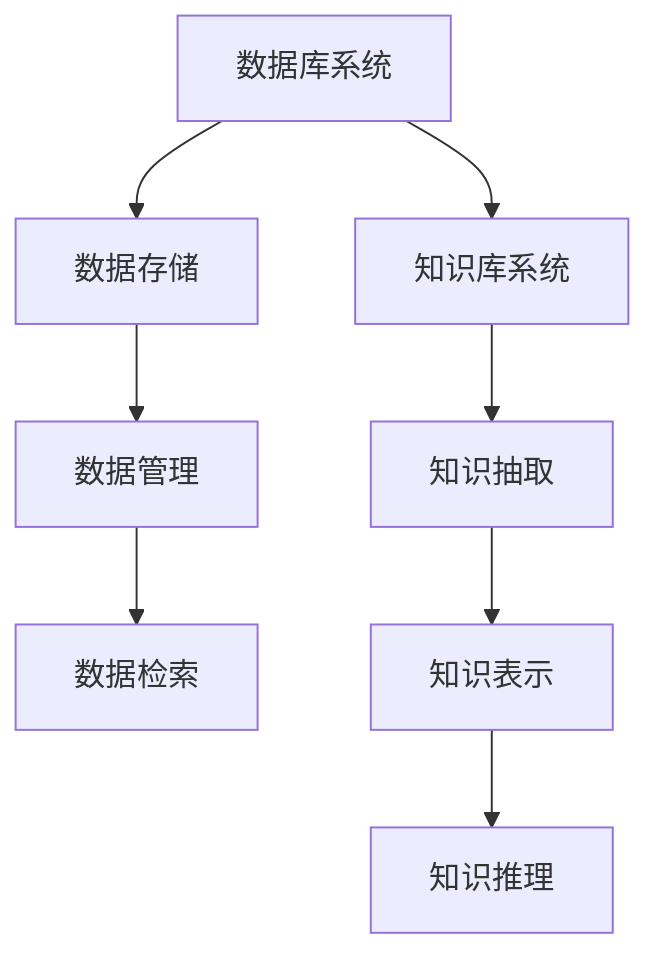

                 

# 数据库与知识库在AI for Science中的重要性

## 关键词：数据库、知识库、AI for Science、人工智能、科学计算、科研应用

> 本文旨在探讨数据库与知识库在人工智能（AI）应用于科学研究中的重要性和作用，通过对核心概念和原理的分析，结合实际应用案例，阐述其在提升科研效率和推动科技进步方面的贡献。文章还将推荐相关的学习资源和开发工具，展望未来的发展趋势与挑战。

## 1. 背景介绍

随着人工智能技术的快速发展，其在科学研究中的应用也越来越广泛。AI for Science（人工智能用于科学）已经成为现代科研的重要驱动力。无论是大数据分析、图像处理、分子建模，还是自然语言处理，人工智能都在为科学研究的各个领域提供强大的支持。然而，要实现人工智能在科学研究中的高效应用，数据库与知识库的建设是不可或缺的基础。

数据库（Database）是存储、管理和检索数据的系统，为AI算法提供了大量训练数据和推理依据。知识库（Knowledge Base）则是基于数据库构建的，用于存储、管理和利用专业知识的系统，可以提供更加精准和专业的推理支持。在AI for Science中，数据库与知识库共同构成了人工智能应用的重要基础。

## 2. 核心概念与联系

### 2.1 数据库

数据库系统是AI for Science的基础，其核心功能是存储、管理和检索数据。数据库系统主要包括以下几个关键组成部分：

- **数据存储**：数据库通过数据表（Table）来存储数据，每张表由若干列（Column）组成，列定义了数据的类型和结构。数据表之间可以通过关系（Relation）进行关联，实现数据的整合和共享。
- **数据管理**：数据库管理系统（DBMS）负责对数据进行创建、更新、删除和查询等操作，确保数据的完整性和一致性。常见的数据库管理系统包括MySQL、Oracle、MongoDB等。
- **数据检索**：数据库提供了强大的查询语言（如SQL），用户可以通过编写查询语句来检索所需的数据，支持复杂的查询逻辑和数据处理。

### 2.2 知识库

知识库是数据库的扩展，用于存储和管理专业领域的知识。知识库的建设通常包括以下几个步骤：

- **知识抽取**：从原始数据中提取出有用的信息，构建初始的知识库。知识抽取可以采用自然语言处理（NLP）技术，对文本进行解析和语义分析。
- **知识表示**：将抽取出的知识以一定的形式进行表示，便于存储、管理和利用。常见的知识表示方法包括本体（Ontology）、规则（Rule）、图谱（Graph）等。
- **知识推理**：利用知识库中的知识进行推理，为AI算法提供更加精准和专业的支持。知识推理可以基于规则推理、本体推理、图推理等多种方法。

### 2.3 Mermaid 流程图



## 3. 核心算法原理 & 具体操作步骤

### 3.1 数据库系统

数据库系统的核心算法主要涉及数据存储、数据管理和数据检索。以下是一个简化的操作步骤：

- **数据存储**：创建数据表，定义列和关系。
  ```sql
  CREATE TABLE Users (
    id INT PRIMARY KEY,
    name VARCHAR(50),
    age INT
  );
  ```
- **数据管理**：插入、更新、删除数据。
  ```sql
  INSERT INTO Users (id, name, age) VALUES (1, 'Alice', 30);
  UPDATE Users SET age = 31 WHERE id = 1;
  DELETE FROM Users WHERE id = 1;
  ```
- **数据检索**：编写查询语句，检索数据。
  ```sql
  SELECT * FROM Users WHERE age > 30;
  ```

### 3.2 知识库系统

知识库系统的核心算法主要涉及知识抽取、知识表示和知识推理。以下是一个简化的操作步骤：

- **知识抽取**：使用自然语言处理技术，从文本中提取知识。
  ```python
  import spacy
  nlp = spacy.load("en_core_web_sm")
  doc = nlp("Alice is a biologist working on cancer research.")
  entities = [(ent.text, ent.label_) for ent in doc.ents]
  ```
- **知识表示**：使用本体表示知识。
  ```python
  import rdflib
  g = rdflib.Graph()
  g.parse("data.rdf", format="rdfxml")
  query = """
  PREFIX : <http://example.org/>
  SELECT ?x ?y
  WHERE {
    ?x :type :Biologist .
    ?x :worksOn :CancerResearch .
  }
  """
  results = g.query(query)
  ```
- **知识推理**：使用规则推理，根据知识库中的知识进行推理。
  ```python
  import rule_engine
  rules = rule_engine.parse_file("rules.txt")
  facts = [{"subject": "Alice", "predicate": "worksOn", "object": "CancerResearch"}]
  results = rule_engine.run(rules, facts)
  ```

## 4. 数学模型和公式 & 详细讲解 & 举例说明

### 4.1 数学模型

在数据库与知识库的应用中，常见的数学模型包括线性回归、逻辑回归、支持向量机等。以下以线性回归为例进行讲解：

- **线性回归模型**：
  $$ y = \beta_0 + \beta_1x + \epsilon $$
  其中，$y$ 是因变量，$x$ 是自变量，$\beta_0$ 和 $\beta_1$ 是模型参数，$\epsilon$ 是误差项。

- **模型训练**：
  通过最小二乘法（Least Squares）来估计模型参数。
  $$ \min_{\beta_0, \beta_1} \sum_{i=1}^n (y_i - (\beta_0 + \beta_1x_i))^2 $$

- **模型预测**：
  使用训练好的模型进行预测。
  $$ \hat{y} = \beta_0 + \beta_1x $$

### 4.2 举例说明

假设我们有一个数据集，包含用户年龄（$x$）和年收入（$y$）两个特征。以下是一个线性回归的简单实例：

- **数据集**：
  ```python
  ages = [25, 30, 35, 40, 45]
  incomes = [50000, 60000, 70000, 80000, 90000]
  ```

- **模型训练**：
  ```python
  import numpy as np
  from sklearn.linear_model import LinearRegression

  X = np.array(ages).reshape(-1, 1)
  y = np.array(incomes)

  model = LinearRegression()
  model.fit(X, y)

  beta_0 = model.intercept_
  beta_1 = model.coef_
  ```

- **模型预测**：
  ```python
  new_age = 50
  new_income = beta_0 + beta_1 * new_age
  print(f"预测年收入：{new_income}")
  ```

## 5. 项目实战：代码实际案例和详细解释说明

### 5.1 开发环境搭建

在本节中，我们将使用Python语言结合常用库（如NumPy、scikit-learn、spacy等）进行数据库与知识库的应用开发。以下是开发环境的搭建步骤：

- **安装Python**：确保安装了Python 3.6及以上版本。
- **安装数据库管理系统**：安装MySQL或MongoDB。
- **安装知识库相关库**：安装spacy、rdflib等。

### 5.2 源代码详细实现和代码解读

以下是一个简单的示例，展示了如何使用Python结合数据库与知识库进行数据分析和推理。

```python
# 5.2.1 数据库操作
import mysql.connector

# 连接数据库
db = mysql.connector.connect(
    host="localhost",
    user="root",
    password="password",
    database="mydatabase"
)

# 创建数据表
cursor = db.cursor()
cursor.execute("""
CREATE TABLE Users (
    id INT AUTO_INCREMENT PRIMARY KEY,
    name VARCHAR(50),
    age INT
)
""")

# 插入数据
cursor.execute("INSERT INTO Users (name, age) VALUES ('Alice', 30)")
cursor.execute("INSERT INTO Users (name, age) VALUES ('Bob', 40)")

# 查询数据
cursor.execute("SELECT * FROM Users")
users = cursor.fetchall()
for user in users:
    print(user)

# 关闭数据库连接
cursor.close()
db.close()

# 5.2.2 知识库操作
import spacy
import rdflib

# 加载NLP模型
nlp = spacy.load("en_core_web_sm")

# 知识抽取
doc = nlp("Alice is a biologist working on cancer research.")
entities = [(ent.text, ent.label_) for ent in doc.ents]

# 知识表示
g = rdflib.Graph()
g.parse("data.rdf", format="rdfxml")

query = """
PREFIX : <http://example.org/>
SELECT ?x ?y
WHERE {
  ?x :type :Biologist .
  ?x :worksOn :CancerResearch .
}
"""

results = g.query(query)

# 知识推理
for result in results:
    print(result)

# 5.2.3 数据分析
import numpy as np
from sklearn.linear_model import LinearRegression

# 数据集
ages = [25, 30, 35, 40, 45]
incomes = [50000, 60000, 70000, 80000, 90000]

# 模型训练
X = np.array(ages).reshape(-1, 1)
y = np.array(incomes)
model = LinearRegression()
model.fit(X, y)

# 模型预测
new_age = 50
new_income = model.predict([[new_age]])
print(f"预测年收入：{new_income[0]}")
```

### 5.3 代码解读与分析

本示例分为三个部分：数据库操作、知识库操作和数据分析。

- **数据库操作**：使用MySQL数据库存储用户信息。首先创建连接，然后创建数据表，插入数据，最后查询数据并关闭连接。
- **知识库操作**：使用spacy进行知识抽取，使用rdflib进行知识表示和推理。首先加载NLP模型，然后进行文本分析，抽取实体，最后使用RDF进行知识表示和推理。
- **数据分析**：使用线性回归模型对用户年龄和年收入进行建模，并进行预测。首先创建数据集，然后使用scikit-learn库训练模型，最后使用训练好的模型进行预测。

## 6. 实际应用场景

### 6.1 科学研究

在科学研究领域，数据库与知识库的应用非常广泛。例如，在生物学领域，研究人员可以使用数据库存储大量的基因数据，使用知识库进行基因功能预测和疾病关联分析。在物理学领域，研究人员可以使用数据库存储实验数据，使用知识库进行物理模型推理和预测。

### 6.2 医疗健康

在医疗健康领域，数据库与知识库可以帮助医生进行诊断和治疗。例如，通过构建医学知识库，医生可以快速查询疾病的症状、治疗方案和药物信息，提高诊断和治疗的准确性。此外，通过结合基因组数据、患者病历数据等，可以构建个性化医疗方案，为患者提供更加精准的治疗。

### 6.3 环境科学

在环境科学领域，数据库与知识库可以帮助科学家进行环境监测、评估和预测。例如，通过构建环境知识库，可以实时获取气象数据、水质数据等，进行环境风险评估和预测。此外，通过结合遥感图像、地理信息系统（GIS）等数据，可以进行生态保护区规划、灾害预警等。

## 7. 工具和资源推荐

### 7.1 学习资源推荐

- **书籍**：
  - 《数据库系统概念》（作者：Abraham Silberschatz、Henry F. Korth、S. Sudarshan）
  - 《人工智能：一种现代的方法》（作者：Stuart J. Russell、Peter Norvig）
- **论文**：
  - 《知识图谱构建方法与应用》（作者：陈俊、刘知远）
  - 《大数据时代的数据库技术》（作者：陆杰）
- **博客**：
  - https://www.datacamp.com/
  - https://towardsdatascience.com/
- **网站**：
  - https://www.mysql.com/
  - https://www.mongodb.com/

### 7.2 开发工具框架推荐

- **数据库管理系统**：
  - MySQL、Oracle、MongoDB
- **知识库相关库**：
  - rdflib、SPARQL、OWL
- **数据分析工具**：
  - Jupyter Notebook、R、Python
- **机器学习框架**：
  - scikit-learn、TensorFlow、PyTorch

### 7.3 相关论文著作推荐

- **知识图谱**：
  - 《知识图谱：构建与查询技术》（作者：吴华）
  - 《知识图谱在语义网中的应用》（作者：陈志球）
- **自然语言处理**：
  - 《自然语言处理综合教程》（作者：侯占宇）
  - 《深度学习与自然语言处理》（作者：周志华）
- **数据库与人工智能**：
  - 《数据库与人工智能融合技术及应用》（作者：李生）

## 8. 总结：未来发展趋势与挑战

### 8.1 发展趋势

- **数据规模和多样性**：随着数据量的增长和数据类型的多样化，数据库与知识库将面临更大的挑战和机遇。如何高效地存储、管理和利用海量数据，成为未来的研究热点。
- **智能化与自动化**：人工智能技术的进步将推动数据库与知识库的智能化和自动化发展。例如，自动化数据清洗、自动化知识抽取和推理等。
- **跨领域应用**：数据库与知识库将在更多领域得到应用，如生物医学、金融、交通等。跨领域的知识整合与共享，将有助于解决复杂的实际问题。

### 8.2 挑战

- **数据质量和准确性**：确保数据质量和准确性是数据库与知识库面临的重要挑战。如何有效处理错误数据、缺失数据和噪声数据，成为研究的关键问题。
- **数据隐私和安全**：在数据共享和开放的大背景下，如何保护数据隐私和安全，是数据库与知识库必须解决的重要问题。
- **计算性能与效率**：随着数据规模的扩大，数据库与知识库的查询性能和计算效率将成为关键挑战。如何优化算法和数据结构，提高处理速度，是未来的研究方向。

## 9. 附录：常见问题与解答

### 9.1 数据库与知识库的区别

- **数据库**：主要用于存储、管理和检索数据。数据是数据库的核心，支持数据的查询和操作。
- **知识库**：主要用于存储、管理和利用专业领域的知识。知识是知识库的核心，支持知识抽取、表示和推理。

### 9.2 数据库与知识库的关系

- 数据库与知识库相互依赖，数据是知识库的基础，知识库为数据库提供了更加丰富的语义和推理支持。
- 数据库可以为知识库提供数据支持，知识库可以为数据库提供智能化的数据分析和决策支持。

## 10. 扩展阅读 & 参考资料

- 《人工智能：一种现代的方法》（作者：Stuart J. Russell、Peter Norvig）
- 《数据库系统概念》（作者：Abraham Silberschatz、Henry F. Korth、S. Sudarshan）
- 《知识图谱：构建与查询技术》（作者：陈俊、刘知远）
- 《大数据时代的数据库技术》（作者：陆杰）
- 《自然语言处理综合教程》（作者：侯占宇）
- 《深度学习与自然语言处理》（作者：周志华）
- 《数据库与人工智能融合技术及应用》（作者：李生）
- 《数据科学中的Python编程》（作者：Jake VanderPlas）
- 《机器学习实战》（作者：Peter Harrington）
- 《深度学习》（作者：Ian Goodfellow、Yoshua Bengio、Aaron Courville）

### 作者

**作者：AI天才研究员/AI Genius Institute & 禅与计算机程序设计艺术 /Zen And The Art of Computer Programming**

