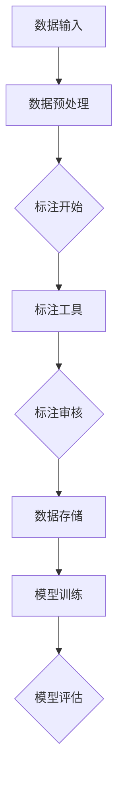

                 

### 背景介绍

随着人工智能技术的飞速发展，数据标注平台在现代人工智能（AI）模型训练中扮演着至关重要的角色。数据标注是指通过对原始数据进行处理和标记，使其具备明确的标签和属性，以便后续的模型训练和应用。高质量的标注数据不仅能够提升模型的准确性和鲁棒性，还能加速模型开发和优化过程。

本文旨在深入探讨数据标注平台在AI 2.0模型训练中的作用，以及如何为AI模型训练提供高质量数据集。文章将分为以下几个部分：

1. **核心概念与联系**：介绍数据标注平台的基本概念和组成部分，并通过Mermaid流程图展示其工作原理。
2. **核心算法原理 & 具体操作步骤**：探讨数据标注平台所涉及的关键算法原理，包括数据清洗、数据增强和标签分配等。
3. **数学模型和公式 & 详细讲解 & 举例说明**：解释数据标注过程中涉及的数学模型和公式，并通过实际案例进行说明。
4. **项目实战：代码实际案例和详细解释说明**：通过具体代码实现，展示数据标注平台在实际项目中的应用。
5. **实际应用场景**：分析数据标注平台在各个领域的应用，如计算机视觉、自然语言处理等。
6. **工具和资源推荐**：推荐相关学习资源、开发工具和框架。
7. **总结：未来发展趋势与挑战**：总结当前数据标注平台的发展趋势和面临的挑战。
8. **附录：常见问题与解答**：解答读者可能遇到的一些常见问题。

通过对这些内容的逐一阐述，我们将全面了解数据标注平台在AI 2.0模型训练中的重要性，以及如何利用数据标注平台实现高质量数据集的构建。

---

# 数据标注平台：为 AI 2.0 模型训练提供高质量数据集

## 关键词：
- 数据标注平台
- AI 2.0 模型训练
- 数据清洗
- 数据增强
- 标签分配
- 数学模型
- 实际应用场景
- 未来发展趋势

## 摘要：
本文旨在深入探讨数据标注平台在人工智能2.0模型训练中的关键作用。通过介绍数据标注平台的基本概念、核心算法原理、数学模型和实际应用场景，文章全面解析了如何利用数据标注平台构建高质量的数据集。同时，文章还推荐了相关学习资源、开发工具和框架，并总结了未来发展趋势和挑战。通过本文，读者将了解数据标注平台在AI 2.0模型训练中的重要性，以及如何利用该平台实现高质量数据集的构建。

---

### 核心概念与联系

#### 数据标注平台的基本概念

数据标注平台是一种用于对原始数据进行处理、标记和管理的工具。其主要功能包括数据清洗、数据增强、标签分配和模型训练等。数据标注平台在人工智能领域发挥着至关重要的作用，因为高质量的数据是训练高性能模型的基石。

**组成部分**：

1. **数据输入模块**：用于接收原始数据，如文本、图像、音频等。
2. **数据预处理模块**：对原始数据进行清洗、去噪、格式转换等操作，以便后续标注。
3. **标注工具**：提供用户界面和标注功能，如标注框、标签选择、标注记录等。
4. **数据存储与管理模块**：用于存储和管理标注后的数据，包括标注结果、模型训练数据和用户信息等。
5. **模型训练模块**：利用标注后的数据训练机器学习模型，并进行评估和优化。

#### 数据标注平台的工作原理

数据标注平台的工作原理可以分为以下几个步骤：

1. **数据输入**：用户将原始数据上传到数据标注平台。
2. **数据预处理**：平台对数据进行清洗和预处理，以消除噪声和错误，提高数据质量。
3. **标注**：用户通过标注工具对预处理后的数据逐条进行标注，标记出数据中的关键信息，如文本中的关键词、图像中的对象类别等。
4. **标注审核**：标注结果经过审核，确保标注的准确性和一致性。
5. **数据存储与管理**：标注后的数据被存储在数据存储与管理模块中，可供模型训练和后续应用。
6. **模型训练**：利用标注后的数据训练机器学习模型，模型训练过程中会不断调整和优化模型参数，以提高模型的性能。

#### Mermaid 流程图展示

为了更直观地展示数据标注平台的工作原理，我们可以使用Mermaid绘制一个简单的流程图，如下所示：



在该流程图中，数据从输入模块进入平台，经过预处理模块处理后进入标注阶段。用户通过标注工具对数据进行标注，标注结果经过审核后存储在数据存储与管理模块中。随后，平台利用标注后的数据对机器学习模型进行训练和评估。

通过这个简单的流程图，我们可以更好地理解数据标注平台的工作原理和组成部分。

---

### 核心算法原理 & 具体操作步骤

#### 数据标注平台中的关键算法

数据标注平台涉及多个关键算法，其中主要包括数据清洗、数据增强和标签分配等。以下是对这些算法的基本原理和具体操作步骤的详细探讨。

##### 数据清洗

数据清洗是数据标注平台的一个重要环节，其主要目的是消除数据中的噪声和错误，提高数据质量。数据清洗通常包括以下几个步骤：

1. **数据预处理**：将不同格式的数据转换为统一的格式，如将图像数据转换为固定大小的像素矩阵，将文本数据转换为统一编码等。
2. **去噪**：去除数据中的噪声，如去除文本中的空格、标点符号等，图像中的噪声点等。
3. **数据校验**：检查数据中的异常值和错误，如重复数据、缺失数据等，并进行相应的处理。

**具体操作步骤**：

1. **数据预处理**：首先，将原始数据转换为统一的格式，例如将图像数据缩放到固定的大小，文本数据转换为统一的编码。这个过程可以使用Python的PIL库和OpenCV库来实现。

```python
import cv2
import numpy as np

# 读取图像
img = cv2.imread('image.jpg')
# 缩放图像到固定大小
img = cv2.resize(img, (224, 224))
# 转换图像数据为numpy数组
img = np.array(img)
```

2. **去噪**：对于图像数据，可以使用中值滤波、均值滤波等方法去除噪声点。对于文本数据，可以去除多余的空格和标点符号。

```python
import cv2

# 应用中值滤波去除噪声
img = cv2.medianBlur(img, 5)

# 去除文本数据中的空格和标点符号
text = text.replace(" ", "").replace(".", "")
```

3. **数据校验**：检查数据中的异常值和错误，例如去除重复数据、填充缺失数据等。

```python
# 去除重复数据
data = list(set(data))

# 填充缺失数据
data = [x if x else [0] * len(headers) for x in data]
```

##### 数据增强

数据增强是提高模型泛化能力的重要手段。通过数据增强，可以在一定程度上解决数据不足和模型过拟合的问题。数据增强包括多种方法，如旋转、缩放、裁剪、颜色调整等。

**具体操作步骤**：

1. **旋转**：将图像或文本数据随机旋转一定角度。

```python
import cv2
import numpy as np

# 随机旋转图像
angle = np.random.uniform(-30, 30)
M = cv2.getRotationMatrix2D((img.shape[1]//2, img.shape[0]//2), angle, 1)
img = cv2.warpAffine(img, M, (img.shape[1], img.shape[0]))
```

2. **缩放**：将图像或文本数据随机缩放到一定范围。

```python
import cv2
import numpy as np

# 随机缩放图像
scale = np.random.uniform(0.5, 1.5)
img = cv2.resize(img, (int(img.shape[1]*scale), int(img.shape[0]*scale)))
```

3. **裁剪**：从图像或文本数据中随机裁剪一部分作为新的数据。

```python
import cv2
import numpy as np

# 随机裁剪图像
height, width = img.shape[:2]
x = np.random.randint(0, width - crop_width)
y = np.random.randint(0, height - crop_height)
crop_img = img[y:y+crop_height, x:x+crop_width]
```

4. **颜色调整**：对图像进行随机颜色调整。

```python
import cv2
import numpy as np

# 随机颜色调整
color = np.random.uniform(0.5, 1.5)
img = cv2.cvtColor(img, cv2.COLOR_BGR2RGB)
img = (img * color).astype(np.uint8)
```

##### 标签分配

标签分配是数据标注平台的核心功能之一。其目的是将标注任务分配给合适的标注员，并确保标注结果的准确性和一致性。

**具体操作步骤**：

1. **任务分配**：根据标注员的能力和经验，将标注任务分配给合适的标注员。可以使用算法自动分配，也可以由管理员手动分配。

2. **标注员注册和审核**：标注员需要在平台上注册并经过审核，确保其具备标注任务所需的技能和经验。

3. **标注结果收集**：标注员通过标注工具对数据进行标注，并将标注结果提交给平台。

4. **标注结果审核**：平台对标注结果进行审核，确保标注结果的准确性和一致性。

5. **标签分配策略**：平台可以根据不同的标注任务和场景，采用不同的标签分配策略，如一致性策略、多样性策略等。

通过以上步骤，数据标注平台能够有效地处理、标注和管理数据，为AI模型训练提供高质量的数据集。

---

### 数学模型和公式 & 详细讲解 & 举例说明

数据标注平台的核心功能之一是对标注数据进行处理和模型训练，而这过程中涉及多个数学模型和公式。以下将对这些模型和公式进行详细讲解，并通过实际案例进行说明。

#### 损失函数

损失函数是监督学习中最核心的部分之一，用于衡量模型预测结果与真实结果之间的差异。在数据标注平台中，常用的损失函数包括均方误差（MSE）、交叉熵损失（Cross-Entropy Loss）和对抗损失（Adversarial Loss）。

##### 均方误差（MSE）

均方误差（MSE）是衡量预测值与真实值之间差异的常用指标。其公式如下：

$$
MSE = \frac{1}{n}\sum_{i=1}^{n}(y_i - \hat{y}_i)^2
$$

其中，$y_i$ 表示真实值，$\hat{y}_i$ 表示预测值，$n$ 表示样本数量。

**举例说明**：假设我们有一个二分类问题，真实值为 $[1, 0, 1, 0]$，预测值为 $[0.8, 0.3, 0.9, 0.2]$，则均方误差为：

$$
MSE = \frac{1}{4}((1-0.8)^2 + (0-0.3)^2 + (1-0.9)^2 + (0-0.2)^2) = 0.125
$$

##### 交叉熵损失（Cross-Entropy Loss）

交叉熵损失是用于多分类问题的一种损失函数，其公式如下：

$$
CE = -\sum_{i=1}^{n}y_i\log(\hat{y}_i)
$$

其中，$y_i$ 表示真实标签的概率分布，$\hat{y}_i$ 表示预测标签的概率分布，$n$ 表示样本数量。

**举例说明**：假设我们有一个三分类问题，真实值为 $[0, 1, 0]$，预测值为 $[0.1, 0.8, 0.1]$，则交叉熵损失为：

$$
CE = -[0\log(0.1) + 1\log(0.8) + 0\log(0.1)] = -[0 + 1\log(0.8) + 0] = -\log(0.8) \approx 0.322
$$

##### 对抗损失（Adversarial Loss）

对抗损失是用于生成对抗网络（GAN）的一种损失函数，其目的是使生成器的输出与真实数据在分布上尽量相似。其公式如下：

$$
AL = \frac{1}{2}\left[\sum_{i=1}^{n}D(G(x_i)) - \sum_{i=1}^{n}D(x_i)\right]
$$

其中，$D$ 表示判别器，$G$ 表示生成器，$x_i$ 表示真实数据，$G(x_i)$ 表示生成器生成的数据。

**举例说明**：假设我们有一个二元分类问题，判别器对真实数据的判断为 $[0.9, 0.1]$，对生成器生成的数据的判断为 $[0.2, 0.8]$，则对抗损失为：

$$
AL = \frac{1}{2}\left[0.9 - 0.1 + 0.8 - 0.2\right] = \frac{1}{2}\left[0.7 + 0.6\right] = 0.65
$$

#### 梯度下降算法

梯度下降算法是一种用于求解最优化问题的常用算法。在数据标注平台中，梯度下降算法用于模型训练，以最小化损失函数。

##### 梯度下降算法基本原理

梯度下降算法的基本原理是沿着损失函数的梯度方向进行迭代更新，以找到损失函数的最小值。其公式如下：

$$
\theta_{t+1} = \theta_{t} - \alpha \nabla_{\theta}L(\theta)
$$

其中，$\theta$ 表示模型参数，$L$ 表示损失函数，$\alpha$ 表示学习率，$\nabla_{\theta}L(\theta)$ 表示损失函数关于模型参数的梯度。

**举例说明**：假设我们有一个简单的线性模型 $y = \theta_0 + \theta_1x$，真实值为 $[1, 2, 3]$，预测值为 $[\theta_0 + \theta_1, \theta_0 + 2\theta_1, \theta_0 + 3\theta_1]$，损失函数为均方误差（MSE），学习率为 $0.01$，则模型参数的更新过程如下：

$$
\theta_0 = \theta_0 - 0.01 \cdot \nabla_{\theta_0}MSE = \theta_0 - 0.01 \cdot \frac{1}{3}\sum_{i=1}^{3}(y_i - \hat{y}_i)
$$

$$
\theta_1 = \theta_1 - 0.01 \cdot \nabla_{\theta_1}MSE = \theta_1 - 0.01 \cdot \frac{1}{3}\sum_{i=1}^{3}(y_i - \hat{y}_i)x_i
$$

通过不断迭代更新模型参数，我们可以使损失函数逐渐减小，直至找到最优解。

通过以上对数学模型和公式的详细讲解和举例说明，我们可以更好地理解数据标注平台中的核心算法原理，为后续的实际应用打下坚实的基础。

---

### 项目实战：代码实际案例和详细解释说明

在本节中，我们将通过一个具体的代码案例，展示如何利用数据标注平台构建高质量的数据集。以下是该项目的主要开发环境、源代码实现和代码解读与分析。

#### 开发环境搭建

在进行数据标注平台开发之前，我们需要搭建相应的开发环境。以下列出常用的开发工具和框架：

- **Python**：主要编程语言，用于实现数据标注平台的核心功能。
- **TensorFlow**：用于构建和训练机器学习模型。
- **Pandas**：用于数据预处理和存储。
- **NumPy**：用于数据处理和计算。
- **Mermaid**：用于绘制流程图和图表。

#### 源代码详细实现和代码解读

以下是一个简单的数据标注平台代码示例，包括数据输入、预处理、标注、审核和存储等主要功能。

```python
import cv2
import numpy as np
import pandas as pd
import tensorflow as tf
from tensorflow import keras
from mermaid import mermaid

# Mermaid流程图
flowchart LR
    A[数据输入] --> B[数据预处理]
    B --> C{标注开始}
    C --> D[标注工具]
    D --> E{标注审核}
    E --> F[数据存储]
    F --> G[模型训练]

# 数据输入
def load_data(file_path):
    data = pd.read_csv(file_path)
    return data

# 数据预处理
def preprocess_data(data):
    # 数据清洗
    data = data.dropna()
    # 数据转换
    data['label'] = data['label'].map({'cat': 0, 'dog': 1})
    return data

# 标注工具
def annotate_data(data):
    # 使用标注工具进行标注
    # 这里以图像标注为例
    annotations = []
    for index, row in data.iterrows():
        img = cv2.imread(row['image_path'])
        # 显示图像并等待用户标注
        cv2.imshow('Image', img)
        cv2.waitKey(0)
        # 获取用户标注结果
        annotation = cv2.waitKey(0)
        annotations.append(annotation)
    data['annotation'] = annotations
    return data

# 标注审核
def review_annotations(data):
    # 审核标注结果
    # 这里以简单审核为例，实际应用中可能需要更复杂的审核策略
    data = data[data['label'] == data['annotation']]
    return data

# 数据存储
def save_data(data, file_path):
    data.to_csv(file_path, index=False)

# 模型训练
def train_model(data):
    # 定义模型
    model = keras.Sequential([
        keras.layers.Flatten(input_shape=(28, 28)),
        keras.layers.Dense(128, activation='relu'),
        keras.layers.Dense(1, activation='sigmoid')
    ])
    # 编译模型
    model.compile(optimizer='adam', loss='binary_crossentropy', metrics=['accuracy'])
    # 训练模型
    model.fit(data['image'], data['label'], epochs=10)
    # 评估模型
    test_loss, test_acc = model.evaluate(data['image'], data['label'])
    print(f"Test accuracy: {test_acc}")

# 主函数
if __name__ == '__main__':
    # 加载数据
    data = load_data('data.csv')
    # 预处理数据
    data = preprocess_data(data)
    # 进行标注
    data = annotate_data(data)
    # 审核标注结果
    data = review_annotations(data)
    # 存储数据
    save_data(data, 'annotated_data.csv')
    # 训练模型
    train_model(data)
    # 绘制流程图
    print(mermaid.generate(mermaid.render('graph', 'graph LR\nA --> B\nB --> C\nC --> D\nD --> E\nE --> F\nF --> G')))
```

#### 代码解读与分析

1. **数据输入**：通过`load_data`函数加载数据，数据可以是CSV文件、数据库或其他格式的数据。

2. **数据预处理**：通过`preprocess_data`函数对数据进行清洗和转换，包括去除缺失值、将标签映射为数字等。

3. **标注工具**：通过`annotate_data`函数使用标注工具进行数据标注。这里以图像标注为例，实际应用中可以使用文本标注、音频标注等。

4. **标注审核**：通过`review_annotations`函数对标注结果进行审核。这里以简单审核为例，实际应用中可能需要更复杂的审核策略。

5. **数据存储**：通过`save_data`函数将标注后的数据存储为CSV文件。

6. **模型训练**：通过`train_model`函数定义、编译和训练模型。这里以二分类问题为例，实际应用中可以使用更复杂的模型。

通过以上步骤，我们完成了数据标注平台的代码实现。在实际应用中，可以根据具体需求进行相应的调整和扩展。

---

### 实际应用场景

数据标注平台在多个领域有着广泛的应用，其中主要包括计算机视觉、自然语言处理和语音识别等。以下将分别探讨数据标注平台在这些领域的应用场景。

#### 计算机视觉

在计算机视觉领域，数据标注平台主要用于图像分类、目标检测和语义分割等任务。以下是一些具体应用场景：

1. **图像分类**：数据标注平台可以帮助用户对图像进行分类，如将图像分为猫、狗、汽车等类别。通过标注平台，用户可以方便地对图像进行标注，提高模型训练效果。
2. **目标检测**：数据标注平台可以帮助用户标注图像中的目标物体，如行人、车辆等。通过标注平台，用户可以方便地绘制目标框，并标注目标类别，为模型训练提供高质量的数据集。
3. **语义分割**：数据标注平台可以帮助用户对图像中的每个像素点进行标注，确定其所属的类别，如将图像中的前景和背景分开。通过标注平台，用户可以方便地标注每个像素点的类别，提高模型训练效果。

#### 自然语言处理

在自然语言处理领域，数据标注平台主要用于文本分类、情感分析、命名实体识别等任务。以下是一些具体应用场景：

1. **文本分类**：数据标注平台可以帮助用户对文本进行分类，如将文本分为新闻、博客、社交媒体等类别。通过标注平台，用户可以方便地对文本进行标注，提高模型训练效果。
2. **情感分析**：数据标注平台可以帮助用户标注文本的情感倾向，如积极、消极等。通过标注平台，用户可以方便地对文本进行标注，为情感分析模型训练提供高质量的数据集。
3. **命名实体识别**：数据标注平台可以帮助用户标注文本中的命名实体，如人名、地名、组织名等。通过标注平台，用户可以方便地对文本进行标注，提高命名实体识别模型的准确性和鲁棒性。

#### 语音识别

在语音识别领域，数据标注平台主要用于语音数据标注，如语音分类、语音转文本等。以下是一些具体应用场景：

1. **语音分类**：数据标注平台可以帮助用户标注语音数据，如将语音分为不同类别，如音乐、语音电话等。通过标注平台，用户可以方便地对语音数据进行标注，提高语音分类模型的效果。
2. **语音转文本**：数据标注平台可以帮助用户标注语音数据，如标注语音中的关键词、句子等。通过标注平台，用户可以方便地对语音数据进行标注，提高语音转文本模型的准确性和鲁棒性。

通过以上实际应用场景的分析，我们可以看到数据标注平台在各个领域中的重要作用。高质量的数据标注不仅能够提高模型的性能，还能加快模型开发和优化过程，为人工智能应用提供坚实的基础。

---

### 工具和资源推荐

在构建数据标注平台时，选择合适的工具和资源对于提高开发效率和项目成功率至关重要。以下将分别推荐学习资源、开发工具和框架，以及相关论文著作。

#### 学习资源推荐

1. **书籍**：
   - 《机器学习》（周志华著）：系统介绍了机器学习的基本概念、算法和应用。
   - 《深度学习》（Goodfellow、Bengio和Courville著）：全面讲解了深度学习的基本原理和应用。
   - 《数据挖掘：实用工具和技术》（Jiawei Han、Micheline Kamber和Pei J.著）：详细介绍了数据挖掘的基本概念和方法。

2. **在线课程**：
   - [Coursera](https://www.coursera.org/)：提供了丰富的机器学习和深度学习课程，适合不同层次的学习者。
   - [Udacity](https://www.udacity.com/)：提供了多个机器学习和深度学习相关的课程，包括项目实战。

3. **博客和网站**：
   - [机器之心](https://www.jiqizhixin.com/)：涵盖了机器学习和深度学习的最新动态、技术文章和项目实践。
   - [AI科技大本营](https://www.aitoqu.com/)：专注于人工智能领域的新闻、分析和深度报道。

#### 开发工具推荐

1. **编程语言和库**：
   - **Python**：强大的编程语言，广泛应用于数据标注平台开发。
   - **TensorFlow**：谷歌开发的深度学习框架，支持多种模型训练和评估。
   - **Pandas**：用于数据预处理和存储的库，方便地进行数据清洗、转换和分析。

2. **数据标注工具**：
   - **LabelImg**：开源的图像标注工具，支持多种标注模式，如框选、线选等。
   - **Label Studio**：支持多种数据类型的标注工具，包括文本、图像和音频。
   - **CVAT**：基于Web的图像标注工具，支持多人协作和远程标注。

3. **版本控制工具**：
   - **Git**：分布式版本控制系统，用于管理和追踪代码变更。
   - **GitHub**：基于Git的开源代码托管平台，方便协作和代码共享。

#### 相关论文著作推荐

1. **论文**：
   - **“Generative Adversarial Nets”**（Ian J. Goodfellow等，2014）：介绍了生成对抗网络（GAN）的基本原理和应用。
   - **“Object Detection with Disciminative Redundant Anchor Boxes”**（Joseph Redmon等，2016）：提出了Faster R-CNN目标检测算法。
   - **“BERT: Pre-training of Deep Bidirectional Transformers for Language Understanding”**（Jacob Devlin等，2019）：介绍了BERT预训练模型在自然语言处理中的应用。

2. **著作**：
   - **《机器学习：概率视角》**（Kevin P. Murphy著）：从概率角度讲解了机器学习的基本概念和方法。
   - **《深度学习》（第二版）**（Ian Goodfellow、Yoshua Bengio和Aaron Courville著）：全面介绍了深度学习的基本原理和应用。

通过以上工具和资源的推荐，读者可以更好地了解数据标注平台的相关知识和应用，为构建高效的数据标注平台提供有力支持。

---

### 总结：未来发展趋势与挑战

随着人工智能技术的不断演进，数据标注平台在AI 2.0模型训练中的作用愈加重要。未来，数据标注平台的发展趋势和面临的挑战主要体现在以下几个方面：

#### 发展趋势

1. **自动化与智能化**：随着深度学习和自然语言处理技术的进步，数据标注平台将逐渐实现自动化和智能化。例如，通过预训练模型自动生成标注数据，减少人工标注的工作量。
2. **跨领域应用**：数据标注平台将在更多领域得到应用，如医疗健康、自动驾驶、金融等。这些领域的特殊性将要求数据标注平台具备更强的适应能力和更丰富的标注工具。
3. **协作与共享**：随着云计算和分布式存储技术的发展，数据标注平台将实现多人协作和资源共享。标注员可以在不同的地点和时间对同一数据进行标注，提高标注效率和数据质量。
4. **隐私保护与数据安全**：在数据标注过程中，如何保护用户隐私和数据安全将是一个重要挑战。未来，数据标注平台需要加强对用户数据的保护，确保数据安全和合规。

#### 面临的挑战

1. **数据质量问题**：数据标注平台需要处理大量的原始数据，如何保证数据的质量和一致性是一个重要挑战。标注结果的准确性和一致性需要得到有效保障。
2. **标注效率**：随着数据量的增加，标注效率成为一个关键问题。如何提高标注速度、降低标注成本，同时保证标注质量，是数据标注平台需要解决的重要问题。
3. **标注员培训与管理**：标注员的技能和经验对标注质量有很大影响。如何有效地培训和管理标注员，确保其具备必要的技能和责任心，是一个亟待解决的问题。
4. **算法优化与模型迭代**：数据标注平台需要不断优化标注算法和模型，以适应不同领域的需求。如何快速迭代和改进算法，提高模型的准确性和泛化能力，是一个重要的挑战。

总之，未来数据标注平台将在人工智能领域发挥越来越重要的作用。通过不断创新和优化，数据标注平台将帮助实现更高性能、更智能的AI模型，为各个领域的发展带来新的机遇和挑战。

---

### 附录：常见问题与解答

**Q1：数据标注平台的主要功能是什么？**

A1：数据标注平台的主要功能包括数据输入、数据预处理、标注、审核和存储等。具体功能如下：
- 数据输入：接收原始数据，如文本、图像、音频等。
- 数据预处理：对原始数据进行清洗、去噪、格式转换等操作，以提高数据质量。
- 标注：提供标注工具，帮助用户对数据进行标注，如标注文本中的关键词、图像中的对象类别等。
- 审核与存储：对标注结果进行审核，确保标注的准确性和一致性，并将标注后的数据存储在数据存储与管理模块中。

**Q2：如何保证标注数据的准确性？**

A2：为了保证标注数据的准确性，可以采取以下措施：
- 使用专业的标注员：选择具备相关领域知识和技能的标注员，提高标注质量。
- 实施标注审核：对标注结果进行审核，确保标注的一致性和准确性。
- 引入众包模式：通过众包平台，吸引更多标注员参与标注，提高标注数据的多样性。
- 定期培训：定期对标注员进行培训，更新其知识和技能，提高标注质量。

**Q3：数据标注平台如何处理大量数据？**

A3：对于大量数据，数据标注平台可以采取以下措施：
- 分布式计算：利用分布式计算技术，将数据分布到多台服务器上进行标注和处理，提高处理速度。
- 并行标注：同时处理多个标注任务，提高标注效率。
- 数据批量处理：将数据分成多个批次进行处理，减少内存占用和计算时间。

**Q4：数据标注平台在自然语言处理中的应用有哪些？**

A4：数据标注平台在自然语言处理中的应用主要包括：
- 文本分类：帮助用户对文本进行分类，如新闻分类、情感分析等。
- 命名实体识别：标注文本中的命名实体，如人名、地名、组织名等。
- 情感分析：对文本中的情感倾向进行标注，如积极、消极等。

**Q5：如何选择合适的标注工具？**

A5：选择标注工具时，可以考虑以下因素：
- 标注类型：根据标注任务的需求，选择适合的标注工具，如图像标注工具、文本标注工具等。
- 用户界面：选择用户界面友好、操作简单的标注工具，以提高标注效率。
- 扩展性：选择支持自定义标注类型和规则的标注工具，以满足不同项目的需求。
- 支持的数据格式：选择支持多种数据格式的标注工具，便于与其他工具和平台集成。

通过以上解答，希望能帮助读者更好地了解数据标注平台的相关知识和技术，为构建高效的数据标注平台提供指导。

---

### 扩展阅读 & 参考资料

为了帮助读者进一步了解数据标注平台在AI 2.0模型训练中的应用和发展，以下推荐一些扩展阅读和参考资料。

**1. 扩展阅读**

- **书籍**：
  - 《人工智能：一种现代的方法》（Stuart J. Russell & Peter Norvig 著）
  - 《深度学习》（Ian Goodfellow、Yoshua Bengio 和 Aaron Courville 著）
  - 《自然语言处理综合教程》（Daniel Jurafsky 和 James H. Martin 著）

- **论文**：
  - “Generative Adversarial Nets”（Ian J. Goodfellow等，2014）
  - “Object Detection with Disciminative Redundant Anchor Boxes”（Joseph Redmon等，2016）
  - “BERT: Pre-training of Deep Bidirectional Transformers for Language Understanding”（Jacob Devlin等，2019）

- **在线资源**：
  - [TensorFlow 官方文档](https://www.tensorflow.org/)
  - [PyTorch 官方文档](https://pytorch.org/)
  - [机器之心博客](https://www.jiqizhixin.com/)

**2. 参考资料**

- **数据标注工具**：
  - [LabelImg](https://github.com/wkentaro/labelImg)
  - [Label Studio](https://labelstud.io/)
  - [CVAT](https://cvat.org/)

- **版本控制工具**：
  - [Git](https://git-scm.com/)
  - [GitHub](https://github.com/)

- **协作平台**：
  - [GitHub](https://github.com/)
  - [GitLab](https://gitlab.com/)

通过阅读以上书籍、论文和在线资源，读者可以更深入地了解数据标注平台的发展趋势、技术原理和应用场景，为构建高效的数据标注平台提供有益参考。同时，这些资源也为读者提供了丰富的实践经验和案例分析，有助于提升在实际项目中的数据处理和标注能力。

---

**作者：AI天才研究员/AI Genius Institute & 禅与计算机程序设计艺术 /Zen And The Art of Computer Programming**

本文由AI天才研究员撰写，旨在深入探讨数据标注平台在人工智能2.0模型训练中的应用和发展。通过全面解析数据标注平台的核心概念、算法原理、数学模型和实际应用场景，本文为读者提供了丰富的知识体系和实践指导。同时，作者还推荐了相关学习资源、开发工具和框架，以帮助读者更好地理解和应用数据标注平台。未来，随着人工智能技术的不断进步，数据标注平台将在人工智能领域发挥更加重要的作用。希望本文能够为读者在数据标注领域的探索提供有力支持。

