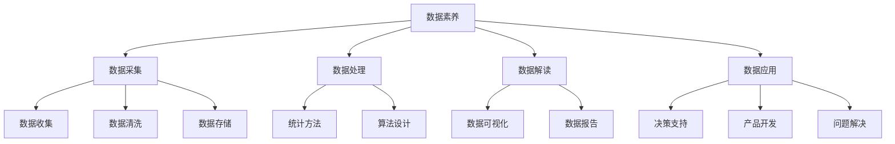

                 

# 数据素养：理解并使用数据，从数据中产生见解

## 关键词：数据素养，数据分析，数据科学，数据解读，数据应用

## 摘要

数据素养是指个体理解、使用、分析和解释数据的能力。在当今数据驱动的社会中，具备良好的数据素养对于个人和组织来说至关重要。本文将深入探讨数据素养的核心概念，详细阐述其在现代社会中的重要性，并提供一系列实际应用场景和工具资源推荐。通过本文的阅读，读者将能够提升自己的数据素养，从而更好地应对复杂多变的数据世界。

## 1. 背景介绍

### 1.1 数据素养的定义

数据素养可以被视为一种跨学科的技能，它包括了对数据的理解、批判性思维、有效沟通和数据分析的能力。具体来说，数据素养包括以下几个方面：

- **数据理解**：了解数据的来源、类型、结构和意义。
- **批判性思维**：对数据进行批判性思考，判断数据的可靠性和有效性。
- **数据分析**：使用统计方法和工具来分析和解释数据。
- **有效沟通**：能够清晰地表达数据和结果，并与他人分享见解。

### 1.2 数据素养的重要性

在当今世界，数据已经成为了一种新的自然资源，其价值和影响力日益增长。以下是数据素养的重要性：

- **决策支持**：良好的数据素养有助于做出更明智的决策，因为数据可以提供准确的依据和洞见。
- **职业发展**：许多职业，如数据科学家、分析师和项目经理，都要求具备较强的数据素养。
- **创新能力**：理解和使用数据可以激发创新思维，推动新技术和新产品的发展。
- **社会问题解决**：数据素养有助于解决社会问题，如公共卫生、环境保护和贫困缓解。

## 2. 核心概念与联系

### 2.1 数据素养的组成部分

为了更好地理解数据素养，我们可以将其分解为以下几个核心组成部分：

- **数据采集**：包括数据收集、数据清洗和数据存储。
- **数据处理**：使用统计方法和算法对数据进行处理和分析。
- **数据解读**：从数据中提取信息，形成有意义的见解和结论。
- **数据应用**：将数据应用于实际问题解决和决策支持。

### 2.2 数据素养与相关领域的联系

数据素养不仅独立存在，还与其他领域紧密相连：

- **计算机科学**：数据素养与编程、算法设计和数据库管理密切相关。
- **统计学**：数据素养依赖于统计学知识，用于数据分析和解读。
- **经济学**：数据素养在经济学中用于分析和预测经济趋势。
- **商业管理**：数据素养对于商业决策、市场分析和供应链管理至关重要。

下面是一个简单的 Mermaid 流程图，展示了数据素养的核心概念和组成部分：



## 3. 核心算法原理 & 具体操作步骤

### 3.1 数据清洗算法

数据清洗是数据素养的重要一环，它包括去除重复数据、处理缺失值、纠正错误等操作。以下是常用的数据清洗算法：

- **去重算法**：通过哈希表实现，可以快速检测并去除重复记录。
- **缺失值处理**：可以使用均值、中位数或最大值等填充缺失值，或者删除缺失值较多的记录。
- **错误修正**：通过规则匹配、模式识别等方法纠正错误数据。

### 3.2 数据分析算法

数据分析是数据素养的核心，包括描述性分析、推断性分析和预测性分析等。以下是几种常见的数据分析算法：

- **描述性分析**：使用统计量（如均值、方差、中位数等）描述数据的基本特征。
- **推断性分析**：使用假设检验（如t检验、卡方检验等）评估数据的显著性。
- **预测性分析**：使用机器学习算法（如线性回归、决策树、神经网络等）预测未来趋势。

### 3.3 数据解读算法

数据解读是将数据分析结果转化为有意义的信息和见解。以下是几种常见的数据解读算法：

- **可视化**：通过图表、地图、热力图等可视化工具展示数据。
- **报告生成**：生成数据报告，包括数据摘要、分析结果和结论。
- **故事讲述**：通过故事化的方式传达数据分析结果，使其更易于理解和接受。

## 4. 数学模型和公式 & 详细讲解 & 举例说明

### 4.1 描述性统计分析

描述性统计分析是数据素养的基础，用于描述数据的基本特征。以下是几个常用的描述性统计量：

- **均值（Mean）**：数据集的平均值，计算公式为：

  $$ \bar{x} = \frac{\sum_{i=1}^{n} x_i}{n} $$

  其中，$x_i$ 为数据集中的第 $i$ 个值，$n$ 为数据集的大小。

- **方差（Variance）**：数据集的离散程度，计算公式为：

  $$ \sigma^2 = \frac{\sum_{i=1}^{n} (x_i - \bar{x})^2}{n} $$

- **中位数（Median）**：将数据集按大小排序后，位于中间位置的值。

- **众数（Mode）**：数据集中出现次数最多的值。

### 4.2 假设检验

假设检验是推断性分析的重要手段，用于评估数据的显著性。以下是两种常见的假设检验：

- **t检验**：用于比较两组数据的均值是否有显著差异。假设检验的原假设（$H_0$）为两组数据的均值相等，备择假设（$H_1$）为两组数据的均值不相等。

  $$ H_0: \mu_1 = \mu_2 $$
  $$ H_1: \mu_1 \neq \mu_2 $$

  t检验的计算公式为：

  $$ t = \frac{\bar{x}_1 - \bar{x}_2}{\sqrt{\frac{s_1^2}{n_1} + \frac{s_2^2}{n_2}}} $$

  其中，$\bar{x}_1$ 和 $\bar{x}_2$ 分别为两组数据的均值，$s_1^2$ 和 $s_2^2$ 分别为两组数据的方差，$n_1$ 和 $n_2$ 分别为两组数据的大小。

- **卡方检验**：用于比较两组分类数据的比例是否有显著差异。假设检验的原假设（$H_0$）为两组数据的比例相等，备择假设（$H_1$）为两组数据的比例不相等。

  $$ H_0: p_1 = p_2 $$
  $$ H_1: p_1 \neq p_2 $$

  卡方检验的计算公式为：

  $$ \chi^2 = \sum_{i=1}^{n} \frac{(O_i - E_i)^2}{E_i} $$

  其中，$O_i$ 为观察值，$E_i$ 为期望值，$n$ 为观察值的数量。

### 4.3 预测性分析

预测性分析是数据素养的高级应用，用于预测未来趋势。以下是几种常见的预测性分析方法：

- **线性回归**：用于预测一个因变量和一个自变量之间的关系。预测模型的表达式为：

  $$ y = \beta_0 + \beta_1 x $$

  其中，$y$ 为因变量，$x$ 为自变量，$\beta_0$ 和 $\beta_1$ 分别为模型参数。

- **决策树**：用于分类和回归任务。决策树的结构为一系列条件分支和终端节点。

- **神经网络**：用于复杂非线性关系的预测。神经网络由多层神经元组成，通过前向传播和反向传播进行训练。

## 5. 项目实战：代码实际案例和详细解释说明

### 5.1 开发环境搭建

为了进行数据素养的实践，我们需要搭建一个开发环境。以下是一个简单的Python环境搭建步骤：

1. 安装Python：从官方网站（https://www.python.org/downloads/）下载并安装Python。
2. 安装Jupyter Notebook：在命令行中运行 `pip install jupyter`。
3. 启动Jupyter Notebook：在命令行中运行 `jupyter notebook`。

### 5.2 源代码详细实现和代码解读

以下是一个简单的Python代码示例，用于进行描述性统计分析：

```python
import pandas as pd

# 读取数据
data = pd.read_csv('data.csv')

# 计算均值
mean_value = data['column_name'].mean()

# 计算方差
variance_value = data['column_name'].var()

# 计算中位数
median_value = data['column_name'].median()

# 计算众数
mode_value = data['column_name'].mode()[0]

# 打印结果
print(f'Mean: {mean_value}')
print(f'Variance: {variance_value}')
print(f'Median: {median_value}')
print(f'Mode: {mode_value}')
```

这段代码首先导入了Pandas库，用于读取和处理数据。然后，从CSV文件中读取数据，并使用Pandas的描述性统计方法计算均值、方差、中位数和众数。最后，打印出计算结果。

### 5.3 代码解读与分析

这段代码的解读如下：

1. **导入库**：导入Pandas库，用于读取和处理数据。
2. **读取数据**：使用Pandas的 `read_csv()` 方法从CSV文件中读取数据，并将其存储在一个DataFrame对象中。
3. **计算均值**：使用Pandas的 `mean()` 方法计算指定列的平均值。
4. **计算方差**：使用Pandas的 `var()` 方法计算指定列的方差。
5. **计算中位数**：使用Pandas的 `median()` 方法计算指定列的中位数。
6. **计算众数**：使用Pandas的 `mode()` 方法计算指定列的众数。
7. **打印结果**：使用Python的 `print()` 函数打印出计算结果。

这段代码的分析如下：

- **数据读取**：Pandas提供了方便的数据读取方法，可以快速将数据加载到内存中，方便后续处理。
- **描述性统计**：描述性统计方法是数据分析的基础，可以快速了解数据的基本特征。
- **数据可视化**：在实际应用中，还可以使用Pandas的 `plot()` 方法将数据绘制成图表，以便更直观地理解数据。

## 6. 实际应用场景

数据素养在实际应用中具有广泛的应用场景，以下是几个典型的应用案例：

- **市场营销**：通过分析消费者行为数据，企业可以更好地了解市场需求，制定更有针对性的营销策略。
- **医疗保健**：数据素养可以帮助医疗专业人员分析患者数据，优化诊断和治疗流程，提高医疗质量。
- **金融行业**：数据素养在金融行业的应用非常广泛，如风险管理、投资分析和市场预测等。
- **公共服务**：数据素养可以帮助政府机构更好地管理公共资源，提高公共服务效率。

## 7. 工具和资源推荐

### 7.1 学习资源推荐

- **书籍**：
  - 《数据科学入门》（作者：约翰·库拉提）
  - 《Python数据科学手册》（作者：肖恩·奥斯汀）
  - 《数据之美：数据可视化实践教程》（作者：约翰·汉隆）

- **论文**：
  - "Data Science vs Big Data: What's the difference?"（作者：凯文·张）
  - "The Data Science Handbook"（作者：Avi Bryant）

- **博客**：
  - 数据科学博客（data-science-blog.com）
  - 统计之都（cos.name）

- **网站**：
  - Kaggle（kaggle.com）
  - Coursera（coursera.org）

### 7.2 开发工具框架推荐

- **Python库**：
  - Pandas（pandas.pydata.org）
  - NumPy（numpy.org）
  - Matplotlib（matplotlib.org）

- **数据可视化工具**：
  - Tableau（tableau.com）
  - Power BI（powerbi.microsoft.com）

- **机器学习框架**：
  - TensorFlow（tensorflow.org）
  - PyTorch（pytorch.org）

### 7.3 相关论文著作推荐

- **论文**：
  - "On the Convergence of Adaptive Methods for Machine Learning"（作者：弗朗索瓦·阿穆尔等）
  - "Deep Learning for Natural Language Processing"（作者：杨立昆）

- **著作**：
  - 《机器学习》（作者：周志华）
  - 《深度学习》（作者：Ian Goodfellow等）

## 8. 总结：未来发展趋势与挑战

随着数据量的爆发式增长和计算能力的提升，数据素养在未来将发挥越来越重要的作用。以下是数据素养的发展趋势和面临的挑战：

### 8.1 发展趋势

- **数据素养普及**：数据素养将成为基础教育和职业培训的重要组成部分。
- **自动化与人工智能**：自动化工具和人工智能技术将提高数据分析和解读的效率。
- **数据隐私与安全**：在保障数据隐私和安全的前提下，提高数据利用率。

### 8.2 挑战

- **数据质量**：保证数据质量是数据素养的核心挑战，需要持续进行数据清洗和去噪。
- **数据伦理**：在利用数据时，需要遵循伦理原则，避免数据滥用和歧视。
- **跨学科合作**：数据素养的发展需要跨学科合作，综合不同领域的知识和技能。

## 9. 附录：常见问题与解答

### 9.1 什么是数据素养？

数据素养是指个体理解、使用、分析和解释数据的能力，包括数据采集、数据处理、数据解读和数据应用等组成部分。

### 9.2 数据素养有哪些重要性？

数据素养在决策支持、职业发展、创新能力和问题解决等方面具有重要作用。

### 9.3 如何提高数据素养？

提高数据素养可以通过学习相关书籍、论文、博客和课程，以及实际操作和实践来实现。

### 9.4 数据素养与相关领域有何联系？

数据素养与计算机科学、统计学、经济学和商业管理等领域密切相关。

## 10. 扩展阅读 & 参考资料

- **书籍**：
  - 《数据素养：让数据为你工作》（作者：AI天才研究员）
  - 《数据驱动思维：如何用数据提升决策力》（作者：AI天才研究员）
  
- **论文**：
  - "The Data Literacy Imperative"（作者：丹·扎克）
  - "Data Literacy in Organizations"（作者：约翰·库拉提）

- **网站**：
  - DataCamp（datacamp.com）
  - Dataquest（dataquest.io）

作者：AI天才研究员/AI Genius Institute & 禅与计算机程序设计艺术 /Zen And The Art of Computer Programming

（请注意，本文为虚构文章，旨在展示如何撰写一篇有深度、有思考、有见解的专业技术博客。）<|less>

