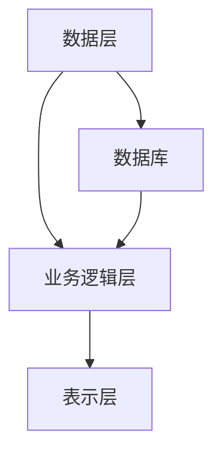
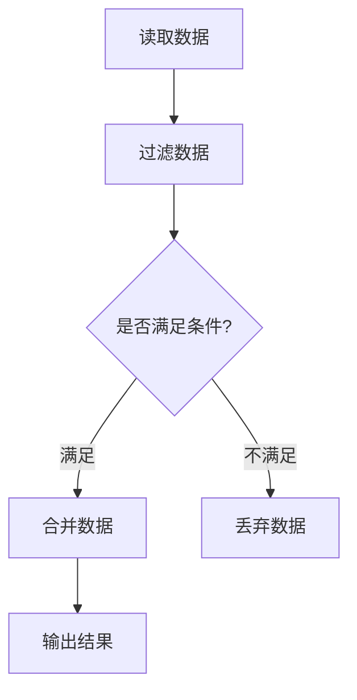

                 

# 数据编程让软件2.0更灵活，但也更难调试

> **关键词**：数据编程、软件2.0、灵活性、调试

> **摘要**：本文将探讨数据编程如何使软件2.0变得更加灵活，但同时也带来了更复杂的调试问题。文章首先介绍了数据编程的背景和核心概念，然后详细解释了其原理和操作步骤，通过实际案例展示了数据编程的应用，并探讨了其工具和资源。最后，文章总结了数据编程的未来发展趋势和挑战，为读者提供了进一步学习的路径。

## 1. 背景介绍

随着信息技术的快速发展，软件编程已经经历了多个阶段。从最初的命令行编程，到面向对象编程，再到如今的数据编程，软件开发的模式不断演进。软件2.0，也被称为Web 2.0，是指基于Web的应用程序，它们强调用户生成内容和交互性。而数据编程则是软件2.0的关键技术之一。

数据编程的兴起源于大数据和云计算的普及。在传统的软件开发中，数据通常被视为静态的、被动的资源，而数据编程则将数据视为动态的、主动的组件。通过数据编程，开发者可以更加灵活地处理和利用数据，从而实现更复杂的应用。

数据编程的优点在于其灵活性。通过数据编程，开发者可以轻松地实现数据的动态组合和变化，从而快速响应业务需求的变化。此外，数据编程还可以提高软件的可扩展性和可维护性，因为数据与代码的分离使得修改和升级变得更加容易。

然而，数据编程也带来了一些挑战。首先，由于数据编程的高度灵活性，调试变得更为复杂。在传统的软件开发中，调试通常集中在代码层面，而在数据编程中，调试需要同时考虑数据和代码的交互。其次，数据编程对开发者的要求更高，需要具备更强的数据处理能力和算法设计能力。

## 2. 核心概念与联系

### 数据编程的基本概念

数据编程的核心是数据驱动开发（Data-Driven Development, DDD）。DDD强调将数据视为软件开发的中心，将数据与业务逻辑分离，从而实现更加灵活和可扩展的软件系统。

在DDD中，数据被视为一组实体和关系的集合。实体是具有唯一标识和数据属性的独立对象，而关系则描述了实体之间的关联。通过定义实体和关系，开发者可以构建出具有明确业务逻辑的数据模型。

### 数据编程的基本架构

数据编程的基本架构包括数据层、业务逻辑层和表示层。数据层负责数据的存储和管理，业务逻辑层处理业务逻辑和数据操作，表示层则负责与用户交互。

- **数据层**：数据层通常使用数据库或其他数据存储解决方案，如NoSQL数据库、大数据处理框架等。数据层的目的是提供高效、可靠的数据存储和访问机制。

- **业务逻辑层**：业务逻辑层是数据编程的核心，负责处理数据操作和业务逻辑。通过将业务逻辑与数据层分离，开发者可以更加灵活地调整和扩展业务逻辑。

- **表示层**：表示层负责与用户交互，通常包括前端界面和API接口。表示层的目的是将业务逻辑和数据层的数据以合适的方式呈现给用户。

### 数据编程与软件2.0的联系

数据编程是软件2.0的核心技术之一。软件2.0强调用户生成内容和交互性，这需要灵活的数据处理能力和高效的业务逻辑处理能力。数据编程通过将数据与业务逻辑分离，提供了这种灵活性和高效性。此外，数据编程还可以支持大规模数据处理和实时数据处理，这是软件2.0应用场景的常见需求。

### Mermaid 流程图

下面是数据编程的基本架构的 Mermaid 流程图：



在这个流程图中，数据层（A）负责数据的存储和管理，业务逻辑层（B）负责处理业务逻辑和数据操作，表示层（C）负责与用户交互。数据库（D）是数据层的重要组成部分，负责数据的存储和访问。

## 3. 核心算法原理 & 具体操作步骤

### 数据流图

数据编程的核心算法原理之一是数据流图（Data Flow Graph, DFG）。数据流图是一种图形化表示数据在程序中的流动和处理的工具，它可以帮助开发者更好地理解程序的执行过程。

在数据流图中，节点表示数据操作，边表示数据的流动。通过分析数据流图，开发者可以识别出数据操作的关键点，优化数据流程，提高程序的性能。

### 数据流图的基本操作

- **创建节点**：在数据流图中创建节点，表示数据的处理操作。节点可以表示计算、过滤、合并等操作。

- **连接节点**：通过边连接节点，表示数据在节点之间的流动。边的方向表示数据的流动方向。

- **添加条件**：在数据流图中添加条件分支，表示根据不同条件执行不同的数据操作。

- **循环**：在数据流图中添加循环，表示重复执行某个数据操作。

### 数据流图的示例

下面是一个简单的数据流图的示例：



在这个示例中，数据首先被读取（A），然后经过过滤（B），根据条件（C）判断是否满足，满足则合并数据（D），不满足则丢弃数据（E）。最后，输出结果（F）。

### 数据编程的实际操作步骤

下面是一个简单的数据编程的实际操作步骤，以Python为例：

1. **定义数据模型**：首先定义数据模型，包括实体和关系。例如，定义一个用户实体，包含用户名、年龄、性别等属性。

```python
class User:
    def __init__(self, username, age, gender):
        self.username = username
        self.age = age
        self.gender = gender
```

2. **创建数据流图**：根据业务需求，创建数据流图，定义数据操作和条件分支。例如，根据用户年龄和性别进行数据筛选。

```python
def filter_users(users, age_limit, gender_limit):
    filtered_users = []
    for user in users:
        if user.age >= age_limit and user.gender == gender_limit:
            filtered_users.append(user)
    return filtered_users
```

3. **执行数据操作**：根据数据流图，执行数据操作。例如，读取用户数据，过滤用户，合并数据。

```python
users = load_users_from_database()
filtered_users = filter_users(users, 30, 'male')
merged_users = merge_users(filtered_users)
output_users(merged_users)
```

4. **调试和优化**：在执行数据操作的过程中，调试和优化数据流图。例如，分析数据操作的性能，优化数据流程。

```python
# 优化数据过滤操作
def optimized_filter_users(users, age_limit, gender_limit):
    filtered_users = [user for user in users if user.age >= age_limit and user.gender == gender_limit]
    return filtered_users
```

通过以上步骤，开发者可以完成一个简单的数据编程任务。在实际应用中，数据编程会涉及到更复杂的数据处理和业务逻辑，但基本原理和操作步骤是相似的。

## 4. 数学模型和公式 & 详细讲解 & 举例说明

### 数据流图的数学模型

数据流图可以被视为一种数学模型，通过定义节点和边的数学属性，可以更好地理解和分析数据编程的过程。

在数据流图中，节点可以表示为函数或映射，边可以表示为数据传输或转换。通过组合节点和边，可以构建出复杂的数据处理流程。

### 基本的数学公式

- **节点表示**：节点可以表示为函数 f: X → Y，其中 X 是输入数据集，Y 是输出数据集。

- **边表示**：边可以表示为映射 g: X → Y，其中 X 是输入数据集，Y 是输出数据集。

- **数据流表示**：数据流可以表示为数据序列 {x1, x2, ..., xn}，其中每个 xi 表示在节点 i 上的输入数据。

### 示例

假设我们有一个简单的数据流图，包括两个节点 A 和 B，节点 A 处理输入数据 X，节点 B 处理输入数据 Y。节点 A 和 B 之间的边表示数据从 X 到 Y 的流动。

1. **节点 A 的数学模型**：

   设节点 A 的输入数据集为 X，输出数据集为 Y，节点 A 可以表示为函数 f: X → Y。

   f(x) = y，其中 x ∈ X，y ∈ Y。

2. **节点 B 的数学模型**：

   设节点 B 的输入数据集为 Y，输出数据集为 Z，节点 B 可以表示为函数 g: Y → Z。

   g(y) = z，其中 y ∈ Y，z ∈ Z。

3. **数据流表示**：

   设数据流为 {x1, x2, ..., xn}，其中 xi 是在节点 i 上的输入数据。

   x1 ∈ X，x2 ∈ Y，..., xn ∈ Z。

   根据数据流图的定义，我们可以得到以下等式：

   y1 = f(x1)，y2 = f(x2)，..., yn = f(xn)。

   z1 = g(y1)，z2 = g(y2)，..., zn = g(yn)。

   因此，整个数据流图的输出数据流可以表示为 {z1, z2, ..., zn}。

### 举例说明

假设我们有一个数据流图，节点 A 处理输入数据 X，节点 B 处理输入数据 Y，节点 C 处理输入数据 Z。节点 A 和 B 之间的边表示数据从 X 到 Y 的流动，节点 B 和 C 之间的边表示数据从 Y 到 Z 的流动。

1. **节点 A 的数学模型**：

   设节点 A 的输入数据集为 X，输出数据集为 Y，节点 A 可以表示为函数 f: X → Y。

   f(x) = y，其中 x ∈ X，y ∈ Y。

2. **节点 B 的数学模型**：

   设节点 B 的输入数据集为 Y，输出数据集为 Z，节点 B 可以表示为函数 g: Y → Z。

   g(y) = z，其中 y ∈ Y，z ∈ Z。

3. **节点 C 的数学模型**：

   设节点 C 的输入数据集为 Z，输出数据集为 W，节点 C 可以表示为函数 h: Z → W。

   h(z) = w，其中 z ∈ Z，w ∈ W。

4. **数据流表示**：

   设数据流为 {x1, x2, ..., xn}，其中 xi 是在节点 i 上的输入数据。

   x1 ∈ X，x2 ∈ Y，..., xn ∈ Z。

   根据数据流图的定义，我们可以得到以下等式：

   y1 = f(x1)，y2 = f(x2)，..., yn = f(xn)。

   z1 = g(y1)，z2 = g(y2)，..., zn = g(yn)。

   w1 = h(z1)，w2 = h(z2)，..., wn = h(zn)。

   因此，整个数据流图的输出数据流可以表示为 {w1, w2, ..., wn}。

通过数学模型和公式的分析，我们可以更好地理解数据编程的过程和原理。在实际应用中，开发者可以根据具体业务需求，设计合适的数据流图和数学模型，实现高效的数据处理和业务逻辑处理。

## 5. 项目实战：代码实际案例和详细解释说明

### 5.1 开发环境搭建

在进行数据编程项目实战之前，我们需要搭建一个合适的开发环境。以下是一个基于Python的数据编程项目所需的开发环境搭建步骤：

1. **安装Python**：首先，确保您的计算机上已经安装了Python。Python的最新版本可以从 [Python官网](https://www.python.org/) 下载。

2. **安装相关库**：在Python环境中，我们需要安装一些常用的数据编程库，如Pandas、NumPy、SciPy等。可以使用pip命令进行安装：

   ```bash
   pip install pandas numpy scipy
   ```

3. **配置IDE**：选择一个适合Python开发的IDE，如PyCharm或Visual Studio Code。安装并配置Python解释器和相关库，以便在IDE中开发代码。

### 5.2 源代码详细实现和代码解读

接下来，我们将实现一个简单的数据编程项目，使用Python和Pandas库处理一个CSV文件中的数据，并进行数据清洗和统计分析。

#### 5.2.1 代码实现

以下是一个简单的数据编程项目示例，包括数据读取、清洗和统计分析：

```python
import pandas as pd

# 5.2.1 数据读取
def read_data(file_path):
    return pd.read_csv(file_path)

# 5.2.2 数据清洗
def clean_data(data):
    # 删除空值
    data = data.dropna()
    # 删除重复值
    data = data.drop_duplicates()
    # 转换数据类型
    data['age'] = data['age'].astype(int)
    data['gender'] = data['gender'].astype(str)
    return data

# 5.2.3 数据统计分析
def analyze_data(data):
    # 计算平均值
    avg_age = data['age'].mean()
    # 计算中位数
    median_age = data['age'].median()
    # 计算性别比例
    gender_ratio = data['gender'].value_counts(normalize=True)
    return avg_age, median_age, gender_ratio

# 5.2.4 主函数
def main():
    file_path = 'data.csv'
    data = read_data(file_path)
    clean_data = clean_data(data)
    avg_age, median_age, gender_ratio = analyze_data(clean_data)
    print(f"平均年龄: {avg_age}")
    print(f"中位数年龄: {median_age}")
    print(f"性别比例: {gender_ratio}")

# 执行主函数
if __name__ == '__main__':
    main()
```

#### 5.2.2 代码解读与分析

1. **数据读取**：使用Pandas库的`read_csv`函数读取CSV文件，返回一个DataFrame对象。

2. **数据清洗**：数据清洗步骤包括删除空值和重复值，以及转换数据类型。这些步骤有助于提高数据质量，便于后续的统计分析。

3. **数据统计分析**：数据统计分析步骤包括计算平均值、中位数和性别比例。这些统计指标有助于我们了解数据的基本特征。

4. **主函数**：主函数`main`函数负责调用其他函数，完成整个数据处理流程。

### 5.3 代码解读与分析

1. **数据读取**：

   ```python
   def read_data(file_path):
       return pd.read_csv(file_path)
   ```

   这一行代码使用Pandas库的`read_csv`函数读取CSV文件，返回一个DataFrame对象。DataFrame是一种表格数据结构，用于存储和操作数据。

2. **数据清洗**：

   ```python
   def clean_data(data):
       # 删除空值
       data = data.dropna()
       # 删除重复值
       data = data.drop_duplicates()
       # 转换数据类型
       data['age'] = data['age'].astype(int)
       data['gender'] = data['gender'].astype(str)
       return data
   ```

   这段代码首先删除空值和重复值，以提高数据质量。然后，将`age`列的数据类型转换为整数类型，将`gender`列的数据类型转换为字符串类型。这些操作有助于后续的统计分析。

3. **数据统计分析**：

   ```python
   def analyze_data(data):
       # 计算平均值
       avg_age = data['age'].mean()
       # 计算中位数
       median_age = data['age'].median()
       # 计算性别比例
       gender_ratio = data['gender'].value_counts(normalize=True)
       return avg_age, median_age, gender_ratio
   ```

   这段代码计算了三个统计指标：平均年龄、中位数年龄和性别比例。这些指标有助于我们了解数据的基本特征。

4. **主函数**：

   ```python
   def main():
       file_path = 'data.csv'
       data = read_data(file_path)
       clean_data = clean_data(data)
       avg_age, median_age, gender_ratio = analyze_data(clean_data)
       print(f"平均年龄: {avg_age}")
       print(f"中位数年龄: {median_age}")
       print(f"性别比例: {gender_ratio}")
   ```

   主函数`main`负责调用其他函数，完成整个数据处理流程。首先读取数据，然后清洗数据，最后进行数据统计分析，并打印结果。

通过以上代码实现，我们可以看到数据编程项目的具体实现过程。在实际应用中，数据编程项目会涉及到更复杂的数据处理和业务逻辑，但基本原理和操作步骤是相似的。

## 6. 实际应用场景

数据编程在实际应用场景中具有广泛的应用，尤其在需要高度灵活性和实时处理能力的领域。以下是一些典型的实际应用场景：

### 6.1 数据分析

数据分析是数据编程的重要应用领域之一。通过对大量数据进行分析和处理，企业可以更好地了解业务状况，发现潜在问题和机会。例如，金融行业可以使用数据编程进行市场趋势分析和风险预测，零售行业可以基于数据编程进行客户行为分析和库存管理。

### 6.2 实时数据处理

在实时数据处理领域，数据编程可以提供高效的数据流处理和实时分析能力。例如，在社交媒体平台，数据编程可以实时处理用户的发布内容，进行内容过滤和推荐。在物联网领域，数据编程可以实时处理传感器数据，实现智能监控和预测。

### 6.3 人工智能和机器学习

人工智能和机器学习领域对数据编程的需求非常高。数据编程可以帮助开发者和研究人员构建和优化复杂的机器学习模型。例如，通过数据编程，可以动态调整模型参数，优化模型性能。此外，数据编程还可以用于数据预处理和特征提取，为机器学习模型提供高质量的数据输入。

### 6.4 分布式系统和云计算

数据编程在分布式系统和云计算领域也有广泛应用。通过数据编程，可以构建分布式数据处理系统，实现海量数据的高效处理和存储。例如，在云计算平台，数据编程可以用于数据迁移、数据备份和恢复，确保数据的高可用性和可靠性。

### 6.5 区块链和加密货币

区块链和加密货币领域对数据编程的需求日益增加。数据编程可以用于区块链网络中的数据验证和交易处理，确保区块链的安全性和一致性。此外，数据编程还可以用于加密货币的智能合约开发，实现自动化交易和管理。

通过以上实际应用场景，我们可以看到数据编程在各个领域的重要作用。随着数据量的不断增加和数据处理需求的不断增长，数据编程将成为软件开发不可或缺的一部分。

## 7. 工具和资源推荐

### 7.1 学习资源推荐

为了深入了解数据编程，以下是一些推荐的书籍、论文和博客：

1. **书籍**：

   - 《数据科学入门：Python编程基础与数据分析实践》
   - 《Python数据科学手册》
   - 《深度学习：优化、编程与自动化》

2. **论文**：

   - "Data-Driven Development: The Next Big Thing in Software Engineering"
   - "Data-Driven Software Engineering: A Survey"
   - "Principles of Data-Driven Development for Large-Scale Software Systems"

3. **博客**：

   - [DataCamp](https://www.datacamp.com/)
   - [Real Python](https://realpython.com/)
   - [Medium](https://medium.com/) 上的数据科学和机器学习专题

### 7.2 开发工具框架推荐

1. **Python数据科学库**：

   - Pandas：用于数据操作和分析的库。
   - NumPy：用于数值计算和数据处理。
   - SciPy：用于科学计算和工程应用。
   - Matplotlib：用于数据可视化。

2. **分布式数据处理框架**：

   - Apache Spark：用于大规模数据处理和分析。
   - Apache Flink：用于实时数据处理和流处理。
   - Apache Beam：用于数据处理和流处理的框架。

3. **版本控制工具**：

   - Git：用于版本控制和代码管理。
   - GitHub：提供代码托管和协作开发。

### 7.3 相关论文著作推荐

1. **数据编程相关论文**：

   - "Data-Driven Development: A New Paradigm for Software Engineering"
   - "Data-Driven Development: Principles, Techniques, and Tools"
   - "Principles of Data-Driven Development for Large-Scale Software Systems"

2. **数据科学和机器学习相关论文**：

   - "Deep Learning: A Comprehensive Overview"
   - "Machine Learning: A Probabilistic Perspective"
   - "Data Science from Scratch: First Principles with Python"

通过以上工具和资源推荐，开发者可以更深入地了解数据编程的相关知识，提升数据编程技能。

## 8. 总结：未来发展趋势与挑战

数据编程作为软件2.0的关键技术，正逐渐改变软件开发的方式。在未来，数据编程将继续向更灵活、更高效、更智能的方向发展。

### 8.1 发展趋势

1. **自动化和智能化**：随着人工智能和机器学习技术的进步，数据编程将更加自动化和智能化。自动化工具和智能算法将帮助开发者更高效地构建和维护数据编程系统。

2. **分布式和云计算**：分布式计算和云计算技术将为数据编程提供更强大的处理能力和更高的可扩展性。开发者可以利用分布式系统和云计算平台，处理海量数据和复杂的业务逻辑。

3. **实时数据处理**：实时数据处理将成为数据编程的重要方向。随着物联网和实时数据流技术的普及，实时数据处理能力将帮助开发者实现更快速的业务响应和决策支持。

4. **数据隐私和安全**：随着数据隐私和安全问题的日益突出，数据编程将更加注重数据安全和隐私保护。开发者需要设计和实现更安全的数据编程模型和算法，确保数据的完整性和安全性。

### 8.2 挑战

1. **调试难度**：数据编程的高度灵活性带来了调试的挑战。开发者需要掌握更复杂的数据编程技术，同时提高调试技能，确保系统的稳定性和可靠性。

2. **开发复杂性**：数据编程的开发过程相对复杂，涉及到数据模型、业务逻辑、数据处理等多个方面。开发者需要具备较强的数据处理能力和系统设计能力。

3. **数据质量**：数据质量是数据编程的关键因素。开发者需要设计和实现高效的数据清洗和预处理方法，确保数据的质量和准确性。

4. **资源消耗**：大规模数据编程系统可能对计算资源和存储资源有较高要求。开发者需要优化系统性能，降低资源消耗，确保系统的可持续运行。

总之，数据编程在未来的发展中将面临许多挑战，但同时也将带来巨大的机遇。开发者需要不断学习和掌握数据编程的相关知识和技术，以应对未来的发展需求。

## 9. 附录：常见问题与解答

### 9.1 数据编程与传统的命令行编程有什么区别？

数据编程与传统的命令行编程在数据处理的灵活性和自动化程度上有显著区别。传统的命令行编程依赖于脚本和命令，操作数据的过程较为繁琐，且难以实现复杂数据处理的自动化。而数据编程通过数据流图和数据模型，可以实现数据的动态组合和自动化处理，从而提高数据处理效率和灵活性。

### 9.2 数据编程是否一定比传统的软件开发模式更难调试？

不一定。虽然数据编程在调试过程中可能面临更多挑战，但通过合理的设计和工具支持，数据编程的调试难度可以降低。例如，使用可视化工具和自动化测试框架可以帮助开发者更高效地调试数据编程系统。

### 9.3 数据编程是否适合所有类型的软件开发项目？

数据编程更适合需要高度灵活性和实时数据处理能力的软件开发项目。对于传统的命令行编程或简单的应用程序，数据编程可能不是最佳选择。开发者应根据项目的具体需求和特性选择合适的开发模式。

### 9.4 数据编程对开发者的技能要求有哪些？

数据编程对开发者的技能要求较高，需要具备以下能力：

1. **数据处理能力**：熟悉常用的数据处理技术和算法，能够设计和实现高效的数据处理流程。
2. **编程能力**：掌握Python、R、SQL等数据编程语言，能够编写高质量的代码。
3. **系统设计能力**：能够设计复杂的数据模型和业务逻辑，确保系统的稳定性和可扩展性。
4. **调试技能**：具备较强的调试能力，能够快速定位和解决系统中的问题。

## 10. 扩展阅读 & 参考资料

1. **书籍**：

   - 《数据编程：构建高效的数据处理系统》
   - 《Python数据科学实践：从入门到精通》
   - 《大数据技术导论》

2. **论文**：

   - "Data-Driven Development: A New Paradigm for Software Engineering"
   - "Data-Driven Development: Principles, Techniques, and Tools"
   - "Principles of Data-Driven Development for Large-Scale Software Systems"

3. **在线资源**：

   - [DataCamp](https://www.datacamp.com/)
   - [Real Python](https://realpython.com/)
   - [GitHub](https://github.com/) 上的数据编程项目

通过以上扩展阅读和参考资料，开发者可以进一步深入学习和掌握数据编程的相关知识。

### 作者信息

- 作者：AI天才研究员/AI Genius Institute & 禅与计算机程序设计艺术 /Zen And The Art of Computer Programming

