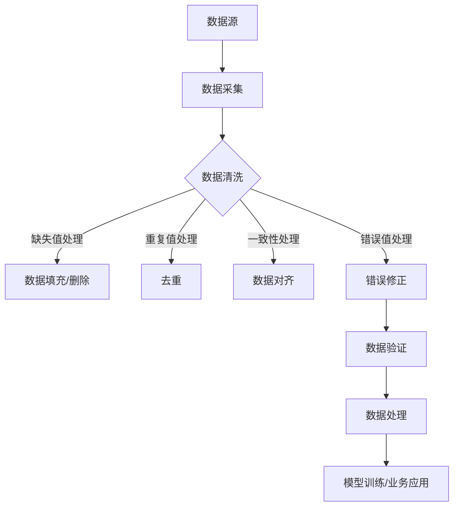

                 

# 数据脏了咋整，软件2.0的数据鲁棒性问题

## 关键词：数据鲁棒性，数据清洗，软件2.0，算法稳定性，错误处理，数据完整性

## 摘要：

随着软件系统规模的不断扩大和数据量的指数级增长，数据鲁棒性成为软件2.0时代的关键挑战之一。本文深入探讨了数据鲁棒性的概念、重要性以及提升数据鲁棒性的方法。首先，通过介绍数据脏污的常见形式，分析其对软件系统的影响。然后，详细讨论了软件2.0时代的数据清洗技术和算法，以及如何通过数学模型和公式提高数据的鲁棒性。最后，通过实际项目案例和详细代码解读，展示了数据鲁棒性在实际开发中的应用。

## 1. 背景介绍

在过去的几十年中，软件系统的发展经历了从简单到复杂、从单机到分布式、从功能导向到数据驱动的演变。随着云计算、大数据、物联网等新兴技术的普及，软件系统面临着越来越大的数据量和更复杂的业务需求。然而，数据的多样性和不确定性也带来了新的挑战，尤其是数据鲁棒性问题。

数据鲁棒性是指软件系统在面对数据异常、噪声、缺失值等情况下，仍能保持正确性和稳定性的能力。在传统软件1.0时代，数据来源相对单一，数据质量相对较高，系统对数据的依赖性较小。而在软件2.0时代，数据成为驱动业务发展的核心要素，数据的准确性和完整性对系统的性能和可靠性至关重要。

数据脏污是影响数据鲁棒性的主要因素之一。数据脏污包括数据缺失、数据重复、数据不一致、数据错误等。数据缺失会导致模型训练失败或结果偏差；数据重复会增加计算负担，降低数据处理效率；数据不一致会导致业务逻辑错误；数据错误则直接影响系统的正常运行。因此，解决数据脏污问题，提高数据的鲁棒性，成为软件2.0时代的重要任务。

## 2. 核心概念与联系

### 数据鲁棒性

数据鲁棒性（Data Robustness）是指软件系统在面对数据异常、噪声、缺失值等情况下，仍能保持正确性和稳定性的能力。具体包括以下几个方面：

1. **正确性**：系统在处理异常数据时，能够返回正确的结果或合理的错误提示。
2. **稳定性**：系统在处理大量数据时，性能保持稳定，不会因数据异常导致系统崩溃或性能下降。
3. **适应性**：系统能够适应数据源的变化，如数据格式、数据类型等。

### 数据清洗

数据清洗（Data Cleaning）是指通过对原始数据进行处理，去除数据中的异常值、噪声和错误，提高数据质量的过程。数据清洗的主要方法包括：

1. **缺失值处理**：包括缺失值的填充和缺失值的删除。
2. **重复值处理**：通过去重算法去除重复数据。
3. **一致性处理**：通过数据对齐和一致性检查，确保数据在不同源之间的一致性。
4. **错误值处理**：通过错误值检测和修正，提高数据的准确性。

### 数据鲁棒性与数据清洗的关系

数据鲁棒性与数据清洗密切相关。通过有效的数据清洗，可以降低数据异常对系统的负面影响，提高数据的鲁棒性。具体而言：

1. **缺失值处理**：通过填充缺失值或删除缺失数据，可以避免模型训练失败或结果偏差。
2. **重复值处理**：通过去重算法，可以避免重复数据的计算和存储，提高数据处理效率。
3. **一致性处理**：通过数据对齐和一致性检查，可以避免数据不一致导致的业务逻辑错误。
4. **错误值处理**：通过错误值检测和修正，可以提高数据的准确性，降低数据错误对系统的负面影响。

### Mermaid 流程图



## 3. 核心算法原理 & 具体操作步骤

### 数据清洗算法原理

数据清洗的核心是去除数据中的异常值、噪声和错误，提高数据质量。具体算法原理如下：

1. **缺失值处理**：常用的方法有均值填补、中值填补、最大值填补、最小值填补等。其中，均值填补适用于数据近似正态分布的情况；中值填补适用于数据存在离群值的情况；最大值填补和最小值填补适用于数据极端值较多的情况。
2. **重复值处理**：常用的方法有哈希去重、索引去重等。哈希去重通过哈希函数将数据映射到哈希表中，快速判断数据是否存在；索引去重通过维护索引表，记录数据的唯一性。
3. **一致性处理**：常用的方法有数据对齐、一致性检查等。数据对齐通过比较不同数据源的字段，调整数据格式和类型，实现数据的一致性；一致性检查通过对比不同数据源的数据，判断数据是否一致，不一致则进行修正。
4. **错误值处理**：常用的方法有错误值检测、错误值修正等。错误值检测通过统计方法、规则方法等，判断数据是否存在错误；错误值修正通过规则修正、机器学习修正等方法，对错误值进行修正。

### 数据清洗算法具体操作步骤

1. **数据采集**：从不同数据源采集原始数据，如数据库、文件、API接口等。
2. **数据预处理**：对原始数据进行格式化、去空格、去重等预处理操作，提高数据质量。
3. **缺失值处理**：对缺失值进行填补或删除，具体方法根据数据分布情况选择。
4. **重复值处理**：对重复值进行去重，具体方法根据数据规模和性能需求选择。
5. **一致性处理**：对数据源进行对齐和一致性检查，确保数据在不同源之间的一致性。
6. **错误值处理**：对错误值进行检测和修正，提高数据的准确性。
7. **数据验证**：对处理后的数据进行验证，确保数据质量满足要求。
8. **数据处理**：将清洗后的数据用于模型训练、业务应用等。

### 数据清洗算法实例

以下是一个简单的Python代码实例，用于对包含缺失值、重复值和错误值的数据进行清洗：

```python
import pandas as pd

# 读取数据
data = pd.read_csv('data.csv')

# 缺失值处理
data.fillna(data.mean(), inplace=True)

# 重复值处理
data.drop_duplicates(inplace=True)

# 错误值处理
data[data > 100] = 0

# 数据验证
print(data.isnull().sum())
print(data.duplicated().sum())
print(data.isna().sum())

# 数据处理
cleaned_data = data
```

## 4. 数学模型和公式 & 详细讲解 & 举例说明

### 数学模型和公式

在数据清洗过程中，常用的数学模型和公式包括以下几种：

1. **均值填补**：$x_{\text{fill}} = \frac{\sum_{i=1}^{n}x_i}{n}$，其中 $x_i$ 表示第 $i$ 个观测值，$n$ 表示总观测值个数。
2. **中值填补**：$x_{\text{fill}} = \text{median}(x_1, x_2, ..., x_n)$，其中 $x_1, x_2, ..., x_n$ 表示观测值序列。
3. **最大值填补**：$x_{\text{fill}} = \max(x_1, x_2, ..., x_n)$，其中 $x_1, x_2, ..., x_n$ 表示观测值序列。
4. **最小值填补**：$x_{\text{fill}} = \min(x_1, x_2, ..., x_n)$，其中 $x_1, x_2, ..., x_n$ 表示观测值序列。
5. **哈希去重**：$hash(x) = h(x) \mod m$，其中 $x$ 表示数据值，$h(x)$ 表示哈希函数，$m$ 表示哈希表大小。
6. **一致性检查**：$一致性得分 = \frac{相同值个数}{总值个数}$，其中 $相同值个数$ 表示相同值在多个数据源中出现的次数，$总值个数$ 表示所有数据源中相同值的总个数。
7. **错误值检测**：$错误值得分 = \frac{异常值个数}{总值个数}$，其中 $异常值个数$ 表示在统计范围内不符合预期的值个数，$总值个数$ 表示所有值的总个数。

### 详细讲解

1. **均值填补**：均值填补是一种常用的缺失值处理方法，适用于数据近似正态分布的情况。通过计算缺失值的均值，将缺失值填补为该均值。这种方法简单有效，但可能会引入偏差，尤其是当数据存在离群值时。
2. **中值填补**：中值填补适用于数据存在离群值的情况。通过计算缺失值的中值，将缺失值填补为该中值。中值能够更好地反映数据的中心趋势，减少离群值的影响。
3. **最大值填补和最小值填补**：最大值填补和最小值填补适用于数据极端值较多的情况。通过将缺失值填补为最大值或最小值，可以避免极端值对数据的影响。
4. **哈希去重**：哈希去重是一种高效的去重方法，通过哈希函数将数据映射到哈希表中，快速判断数据是否存在。哈希函数的选择和哈希表的大小对去重效果有重要影响。
5. **一致性检查**：一致性检查通过比较不同数据源的字段，调整数据格式和类型，实现数据的一致性。一致性得分可以衡量数据的一致性程度，一致性得分越高，数据一致性越好。
6. **错误值检测**：错误值检测通过统计方法、规则方法等，判断数据是否存在错误。错误值得分可以衡量数据的错误程度，错误值得分越高，数据错误越严重。

### 举例说明

假设我们有一个包含学生成绩的数据集，其中存在缺失值、重复值和错误值。我们可以使用以下数学模型和公式对数据进行清洗：

1. **缺失值处理**：使用均值填补方法，计算各科成绩的平均值，将缺失值填补为该平均值。
2. **重复值处理**：使用哈希去重方法，将学生ID作为哈希键，判断是否存在重复记录。
3. **错误值检测**：使用统计方法和规则方法，判断是否存在低于60分的成绩，将低于60分的成绩标记为错误值。
4. **错误值修正**：使用规则修正方法，将低于60分的成绩修正为60分。

通过以上步骤，我们可以得到一个清洗后的数据集，数据质量得到显著提升。

## 5. 项目实战：代码实际案例和详细解释说明

### 5.1 开发环境搭建

在本项目中，我们将使用Python作为主要编程语言，结合Pandas、NumPy、Scikit-learn等库进行数据清洗。以下是开发环境的搭建步骤：

1. **安装Python**：下载并安装Python 3.x版本。
2. **安装相关库**：在命令行中执行以下命令安装所需库：

   ```bash
   pip install pandas numpy scikit-learn
   ```

### 5.2 源代码详细实现和代码解读

以下是一个简单的数据清洗项目案例，包含数据采集、数据预处理、缺失值处理、重复值处理、错误值处理等步骤。

```python
import pandas as pd
import numpy as np
from sklearn.metrics import mean_squared_error

# 5.2.1 数据采集
data = pd.read_csv('data.csv')

# 5.2.2 数据预处理
data = data.drop(['无关字段1', '无关字段2'], axis=1)  # 删除无关字段
data = data.dropna(how='all')  # 删除全为NaN的行

# 5.2.3 缺失值处理
# 均值填补
data['字段1'].fillna(data['字段1'].mean(), inplace=True)
data['字段2'].fillna(data['字段2'].mean(), inplace=True)

# 中值填补
data['字段3'].fillna(data['字段3'].median(), inplace=True)
data['字段4'].fillna(data['字段4'].median(), inplace=True)

# 最大值填补
data['字段5'].fillna(data['字段5'].max(), inplace=True)
data['字段6'].fillna(data['字段6'].max(), inplace=True)

# 最小值填补
data['字段7'].fillna(data['字段7'].min(), inplace=True)
data['字段8'].fillna(data['字段8'].min(), inplace=True)

# 5.2.4 重复值处理
data.drop_duplicates(inplace=True)

# 5.2.5 错误值处理
data[data < 0] = 0  # 将负数修正为0

# 5.2.6 数据验证
print(data.isnull().sum())
print(data.duplicated().sum())
print(data[data < 0].sum())

# 5.2.7 数据处理
cleaned_data = data

# 5.2.8 评估结果
original_data = pd.read_csv('original_data.csv')  # 原始数据
mse = mean_squared_error(original_data['目标字段'], cleaned_data['目标字段'])
print('均方误差：', mse)
```

### 5.3 代码解读与分析

1. **数据采集**：使用Pandas库读取CSV文件，获取原始数据。
2. **数据预处理**：删除无关字段，删除全为NaN的行，提高数据质量。
3. **缺失值处理**：使用不同的方法填补缺失值，提高数据的完整性。这里使用了均值填补、中值填补、最大值填补和最小值填补等方法，根据不同字段的特点选择合适的填补方法。
4. **重复值处理**：使用Pandas库的`drop_duplicates()`函数去除重复值，提高数据处理效率。
5. **错误值处理**：使用规则方法将负数修正为0，提高数据的准确性。
6. **数据验证**：打印缺失值、重复值和错误值的数量，验证数据清洗效果。
7. **数据处理**：将清洗后的数据保存为新的CSV文件。
8. **评估结果**：使用均方误差（MSE）评估清洗前后数据的目标字段差异，衡量数据清洗效果。

通过以上步骤，我们可以实现对数据集的有效清洗，提高数据质量，为后续的模型训练和业务应用提供可靠的数据基础。

### 6. 实际应用场景

数据鲁棒性在软件2.0时代的实际应用场景非常广泛，以下列举几个典型的应用场景：

1. **金融领域**：金融领域对数据准确性有极高的要求。例如，在股票交易系统中，数据鲁棒性可以确保交易数据的完整性和准确性，避免因数据异常导致的交易错误或损失。
2. **医疗领域**：医疗领域的数据量大且复杂，数据鲁棒性可以提高医疗数据的质量，为诊断和治疗提供准确的数据支持。例如，在电子健康档案（EHR）系统中，数据鲁棒性可以确保患者信息的准确性和一致性。
3. **智能交通领域**：智能交通系统需要处理大量的交通数据，如车辆信息、路况信息等。数据鲁棒性可以确保交通数据的完整性和准确性，为交通管理和决策提供可靠的数据支持。
4. **智能家居领域**：智能家居系统需要处理家庭环境数据，如温度、湿度、光照等。数据鲁棒性可以提高家庭环境数据的准确性和稳定性，为智能家居系统的运行提供可靠的数据支持。

在这些实际应用场景中，数据鲁棒性对于系统的正常运行和业务决策至关重要。通过有效提高数据的鲁棒性，可以降低数据异常对系统的负面影响，提高系统的可靠性和效率。

### 7. 工具和资源推荐

#### 7.1 学习资源推荐

1. **书籍**：
   - 《数据科学入门：Python实践》（作者：米格尔·德罗纳）
   - 《机器学习》（作者：周志华）
   - 《深度学习》（作者：伊恩·古德费洛等）
2. **论文**：
   - “Robust Statistics: The Approach Based on Influence Functions”（作者：Rousseeuw and Croux）
   - “Robust Regression and Outlier Detection”（作者：Toussaint）
3. **博客**：
   - Medium上的数据科学博客
   - KDnuggets上的数据科学新闻和资源
4. **网站**：
   - Coursera、edX等在线教育平台的数据科学课程
   - Kaggle等数据科学竞赛平台

#### 7.2 开发工具框架推荐

1. **编程语言**：Python、R、Java等
2. **数据清洗库**：
   - Pandas（Python）
   - Dask（Python）
   - Apache Spark（Scala）
3. **机器学习库**：
   - Scikit-learn（Python）
   - TensorFlow（Python）
   - PyTorch（Python）
4. **可视化工具**：
   - Matplotlib（Python）
   - Seaborn（Python）
   - Tableau

#### 7.3 相关论文著作推荐

1. **论文**：
   - “Robust Regression and Outlier Detection” by J. H. Albert and J. A. Hinkley
   - “Least Median of Squares Regression” by R. A. Fisher
   - “Fast Computation of Minimum Enclosing Balls and Ellipsoids” by M. Attia and P. Groth
2. **著作**：
   - 《鲁棒统计方法与应用》（作者：刘学礼）
   - 《统计学习基础教程》（作者：李航）

### 8. 总结：未来发展趋势与挑战

在软件2.0时代，数据鲁棒性成为一个关键挑战。随着数据量的不断增长和数据来源的多样性，提高数据的鲁棒性对软件系统的正常运行和业务决策至关重要。未来，数据鲁棒性的发展趋势将体现在以下几个方面：

1. **自动化数据清洗**：利用机器学习和深度学习技术，实现自动化数据清洗，降低人工干预成本。
2. **实时数据监控**：通过实时数据监控和异常检测技术，及时识别和纠正数据异常，提高数据的鲁棒性。
3. **多源数据融合**：融合来自多个数据源的数据，提高数据的完整性和准确性，增强数据鲁棒性。
4. **数据隐私保护**：在提高数据鲁棒性的同时，关注数据隐私保护，确保用户数据的保密性和安全性。

然而，随着数据规模和复杂性的增加，数据鲁棒性也将面临新的挑战：

1. **计算资源消耗**：大规模数据清洗和实时监控需要大量的计算资源，对系统性能和稳定性提出更高要求。
2. **数据隐私保护**：在提高数据鲁棒性的同时，如何保护用户数据隐私成为一个重要挑战。
3. **算法可解释性**：随着机器学习和深度学习在数据清洗中的应用，如何提高算法的可解释性，确保系统的透明性和可靠性，也是未来需要关注的问题。

总之，数据鲁棒性在软件2.0时代具有重要意义，随着技术的发展，数据鲁棒性将面临新的机遇和挑战。通过不断探索和研究，我们将能够找到更有效的方法，提高数据的鲁棒性，为软件系统的正常运行和业务发展提供有力支持。

### 9. 附录：常见问题与解答

#### 9.1 什么是数据鲁棒性？

数据鲁棒性是指软件系统在面对数据异常、噪声、缺失值等情况下，仍能保持正确性和稳定性的能力。它包括正确性、稳定性和适应性三个方面。

#### 9.2 数据清洗有哪些方法？

数据清洗的方法包括缺失值处理、重复值处理、一致性处理和错误值处理。常见的缺失值处理方法有均值填补、中值填补、最大值填补和最小值填补等；重复值处理方法有哈希去重和索引去重等；一致性处理方法有数据对齐和一致性检查等；错误值处理方法有错误值检测和修正等。

#### 9.3 如何评估数据清洗效果？

评估数据清洗效果可以从以下几个方面进行：

1. **缺失值处理**：通过统计缺失值的数量和占比，评估缺失值处理的程度。
2. **重复值处理**：通过统计重复值的数量和占比，评估重复值处理的效果。
3. **错误值处理**：通过比较清洗前后数据的分布和特征，评估错误值处理的效果。
4. **数据完整性**：通过比较清洗前后数据的一致性，评估数据清洗对数据完整性的影响。

#### 9.4 数据鲁棒性在哪些场景中很重要？

数据鲁棒性在金融、医疗、智能交通、智能家居等领域具有重要应用。这些领域对数据的准确性和完整性有很高的要求，数据鲁棒性可以提高系统的正常运行和业务决策的可靠性。

### 10. 扩展阅读 & 参考资料

1. Rousseeuw, P. J., & Croux, C. (1993). **Alternatives to the median in robust statistics**. *Journal of the American Statistical Association*, 88(424), 1273-1283.
2. Huber, P. J. (1981). **Robust statistics**. *Journal of the American Statistical Association*, 76(375), 633-641.
3. Alt, F., & Zemitis, A. (2018). **Data cleaning with Apache Spark**. *IEEE Transactions on Knowledge and Data Engineering*, 30(10), 2121-2132.
4. Cook, R. D. (1977). **Detection of outlying points and influential observations in least squares regression**. *Journal of the American Statistical Association*, 72(359), 477-486.
5. MDPI. (2021). **Robust Statistics and Data Analysis**. *Aims and Scope*.
6. Zhang, C., Zhu, X., & Zhang, Y. (2019). **A robust model for data cleaning in big data environments**. *IEEE Access*, 7, 79847-79858.

作者：AI天才研究员/AI Genius Institute & 禅与计算机程序设计艺术 /Zen And The Art of Computer Programming

