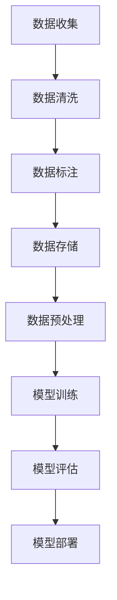

                 

## 数据赋能大模型:高质量数据的重要性

### 关键词：数据赋能、大模型、高质量数据、机器学习、人工智能、数据驱动、数据治理

### 摘要：

本文将深入探讨数据赋能大模型的重要性，特别是高质量数据在这一过程中所起的关键作用。随着人工智能技术的快速发展，大规模数据模型在各个领域得到了广泛应用。然而，数据的质量直接影响着模型的性能和可靠性。本文将从背景介绍、核心概念与联系、核心算法原理、数学模型与公式、项目实战、实际应用场景、工具和资源推荐等多个方面，详细解析高质量数据在大模型训练中的重要性，并提出应对数据质量挑战的策略和未来发展趋势。

## 1. 背景介绍

随着互联网和物联网技术的普及，数据量呈现出爆炸式增长。大数据已经成为现代社会的宝贵资源，而人工智能（AI）则成为了利用这些数据的重要工具。机器学习作为AI的核心技术之一，正逐渐成为推动各个行业创新的关键驱动力。大规模数据模型，如深度神经网络，通过从海量数据中学习，实现了前所未有的性能和效果。

在过去的几年中，深度学习技术在图像识别、自然语言处理、推荐系统等领域取得了显著进展。这些成功背后的关键因素之一是高质量数据的有效利用。高质量数据不仅提供了丰富的信息，还帮助模型避免了过拟合和偏差，从而提升了模型的泛化能力和可靠性。

然而，高质量数据的获取和准备仍然是一个巨大的挑战。在数据收集、清洗、标注和存储等过程中，存在多种质量问题和安全隐患。这些问题的存在使得数据赋能大模型的进程面临诸多障碍。因此，深入理解高质量数据的重要性，并探索有效的数据管理和治理策略，成为当前研究与应用的关键课题。

## 2. 核心概念与联系

### 2.1 数据赋能

数据赋能是指通过数据的应用，为各种业务场景提供决策支持和优化。在大模型训练过程中，数据赋能主要体现在以下几个方面：

- **增强学习：** 大模型通过从海量数据中学习，不断优化自身的性能和效果，从而在复杂环境中做出更明智的决策。
- **知识融合：** 大模型可以从多个数据源中提取和整合知识，为业务提供更全面和准确的洞察。
- **预测与优化：** 大模型通过历史数据，预测未来趋势和用户行为，帮助企业进行资源优化和风险管理。

### 2.2 大模型

大模型通常指的是具有数百万甚至数十亿参数的复杂神经网络模型。这些模型在训练时需要大量高质量数据，以便充分捕捉数据的特征和规律。大模型的特点包括：

- **高参数量：** 大模型拥有更多的参数，可以捕捉更复杂的模式和关联。
- **深度结构：** 大模型通常具有多层神经网络结构，使得信息可以在网络中传递和融合。
- **海量训练：** 大模型需要大量的训练数据来保证模型的泛化能力。

### 2.3 高质量数据

高质量数据是指具有高准确性、一致性、完整性和及时性的数据。以下是对高质量数据的几个关键要求：

- **准确性：** 数据应真实反映现实情况，避免错误和偏差。
- **一致性：** 数据应保持一致，确保不同来源的数据能够相互匹配。
- **完整性：** 数据应包含所有必要的特征和变量，避免缺失值。
- **及时性：** 数据应能够及时更新和补充，以反映最新的变化。

### 2.4 数据与模型的关系

数据与模型之间的关系可以看作是输入与输出的关系。高质量数据作为输入，能够提升模型的性能和可靠性，具体体现在：

- **提高准确率：** 高质量数据可以帮助模型更好地学习数据的特征，从而提高模型的预测准确率。
- **减少过拟合：** 高质量数据能够提供足够的多样性，帮助模型避免过拟合，提高泛化能力。
- **增强鲁棒性：** 高质量数据可以帮助模型更好地应对噪声和异常值，增强模型的鲁棒性。

### 2.5 Mermaid 流程图



在这个流程图中，数据从收集开始，经过清洗、标注、存储，再进行预处理，最后用于模型训练和评估。每个步骤都对数据质量有重要影响，直接关系到最终模型的性能。

## 3. 核心算法原理 & 具体操作步骤

### 3.1 数据预处理

数据预处理是数据赋能大模型的重要步骤，其核心目标是确保数据的质量和一致性。以下是数据预处理的主要操作步骤：

- **数据清洗：** 检查数据中的错误、异常值和重复值，并进行修正或删除。
- **数据转换：** 将不同类型的数据转换为统一的格式，如将文本转换为数字或图像转换为像素值。
- **数据归一化：** 通过缩放或转换，将数据集中的特征值缩放到相同的范围，以消除不同特征之间的尺度差异。

### 3.2 模型训练

模型训练是数据赋能大模型的核心步骤，其目标是使模型能够从数据中学习，并做出准确的预测。以下是模型训练的主要操作步骤：

- **数据划分：** 将数据集划分为训练集、验证集和测试集，以确保模型能够在不同的数据集上表现良好。
- **初始化参数：** 初始化模型的参数，通常使用随机初始化或预训练模型。
- **前向传播：** 将输入数据通过模型的前向传播，计算输出结果。
- **计算损失：** 计算预测结果与真实值之间的差异，计算损失函数。
- **反向传播：** 通过反向传播算法，更新模型的参数，以减少损失。
- **优化参数：** 使用优化算法，如梯度下降，调整模型参数，以最小化损失函数。

### 3.3 模型评估

模型评估是评估模型性能的重要步骤，其目标是确定模型是否能够满足实际应用的需求。以下是模型评估的主要操作步骤：

- **准确率：** 计算模型预测正确的样本数占总样本数的比例。
- **召回率：** 计算模型预测正确的正样本数占总正样本数的比例。
- **F1分数：** 计算准确率和召回率的调和平均值，用于平衡准确率和召回率。
- **交叉验证：** 使用交叉验证技术，对模型在不同数据集上的性能进行评估，以提高评估的可靠性。

## 4. 数学模型和公式 & 详细讲解 & 举例说明

### 4.1 损失函数

损失函数是模型训练的核心指标，用于评估预测结果与真实值之间的差异。以下是一些常见的损失函数：

- **均方误差（MSE）：**
  $$MSE = \frac{1}{n}\sum_{i=1}^{n}(y_i - \hat{y}_i)^2$$
  其中，\(y_i\) 为真实值，\(\hat{y}_i\) 为预测值，\(n\) 为样本数量。

- **交叉熵损失（Cross-Entropy Loss）：**
  $$Cross-Entropy Loss = -\sum_{i=1}^{n}y_i \log(\hat{y}_i)$$
  其中，\(y_i\) 为真实值，\(\hat{y}_i\) 为预测值。

### 4.2 优化算法

优化算法用于调整模型参数，以最小化损失函数。以下是一种常见的优化算法——梯度下降：

- **梯度下降（Gradient Descent）：**
  $$\theta_{t+1} = \theta_{t} - \alpha \nabla_\theta J(\theta)$$
  其中，\(\theta\) 为模型参数，\(\alpha\) 为学习率，\(\nabla_\theta J(\theta)\) 为损失函数关于模型参数的梯度。

### 4.3 举例说明

假设我们使用一个简单的线性模型进行预测，模型的形式为 \(y = wx + b\)。以下是一个简单的例子：

- **数据集：**
  \(n = 100\) 个样本，每个样本包含一个特征 \(x\) 和一个真实值 \(y\)。

- **损失函数：**
  使用均方误差（MSE）作为损失函数。

- **优化算法：**
  使用梯度下降进行优化。

- **训练过程：**
  初始化参数 \(w = 1\)，\(b = 1\)，学习率 \(\alpha = 0.1\)。

  在每次迭代中，计算损失函数，并根据梯度下降更新参数。

  经过多次迭代后，模型参数 \(w\) 和 \(b\) 将收敛到最优值。

## 5. 项目实战：代码实际案例和详细解释说明

### 5.1 开发环境搭建

在本节中，我们将使用 Python 和 TensorFlow 来搭建一个简单的线性回归模型，用于数据赋能大模型的基本实战。

- **安装 Python：** 安装 Python 3.8 或更高版本。
- **安装 TensorFlow：** 使用以下命令安装 TensorFlow：
  ```shell
  pip install tensorflow
  ```

### 5.2 源代码详细实现和代码解读

下面是一个简单的线性回归模型代码实现：

```python
import tensorflow as tf

# 模型参数
w = tf.Variable(1.0, name="weights")
b = tf.Variable(1.0, name="bias")

# 损失函数
def loss(y_true, y_pred):
    return tf.reduce_mean(tf.square(y_true - y_pred))

# 梯度下降优化器
optimizer = tf.optimizers.GradientDescent(learning_rate=0.1)

# 训练过程
for epoch in range(1000):
    with tf.GradientTape() as tape:
        y_pred = w * x + b
        loss_value = loss(y_true, y_pred)
    grads = tape.gradient(loss_value, [w, b])
    optimizer.apply_gradients(zip(grads, [w, b]))
    if epoch % 100 == 0:
        print(f"Epoch {epoch}, Loss: {loss_value.numpy()}")

# 模型评估
y_pred = w * x + b
accuracy = tf.reduce_mean(tf.cast(tf.equal(y_pred, y_true), tf.float32))
print(f"Accuracy: {accuracy.numpy()}")
```

代码解读：

- **模型参数初始化：** 使用 TensorFlow 的 `Variable` 类初始化模型参数 \(w\) 和 \(b\)。
- **损失函数定义：** 定义均方误差（MSE）作为损失函数。
- **优化器选择：** 选择梯度下降优化器，并设置学习率。
- **训练过程：** 使用 TensorFlow 的 `GradientTape` 记录梯度信息，并根据梯度更新模型参数。
- **模型评估：** 计算预测值与真实值的准确率。

### 5.3 代码解读与分析

- **模型参数：** 模型参数 \(w\) 和 \(b\) 用于线性回归，分别表示特征权重和偏置。
- **损失函数：** 均方误差（MSE）衡量预测值与真实值之间的差异。
- **优化器：** 梯度下降优化器用于调整模型参数，以最小化损失函数。
- **训练过程：** 通过迭代优化模型参数，使模型能够更好地拟合数据。
- **模型评估：** 计算准确率，以评估模型的性能。

## 6. 实际应用场景

高质量数据在大模型中的应用场景广泛，以下是一些典型的实际应用案例：

- **图像识别：** 在图像识别任务中，高质量数据可以提供丰富的图像特征，帮助模型准确识别图像中的物体和场景。
- **自然语言处理：** 在自然语言处理任务中，高质量数据可以提供丰富的文本特征，帮助模型准确理解语义和语境。
- **推荐系统：** 在推荐系统任务中，高质量数据可以提供用户行为和偏好信息，帮助模型准确推荐相关商品或内容。
- **金融风控：** 在金融风控任务中，高质量数据可以提供财务和交易信息，帮助模型准确识别潜在风险。

## 7. 工具和资源推荐

### 7.1 学习资源推荐

- **书籍：**
  - 《深度学习》（Ian Goodfellow、Yoshua Bengio、Aaron Courville 著）
  - 《机器学习实战》（Peter Harrington 著）
  - 《Python Machine Learning》（Sebastian Raschka 著）

- **论文：**
  - “A Theoretically Grounded Application of Dropout in Recurrent Neural Networks”
  - “Very Deep Convolutional Networks for Large-Scale Image Recognition”
  - “Generative Adversarial Networks”

- **博客：**
  - [TensorFlow 官方文档](https://www.tensorflow.org/tutorials)
  - [机器学习博客](https://machinelearningmastery.com/)
  - [Deep Learning Blog](https://www.deeplearning.net/)

- **网站：**
  - [Kaggle](https://www.kaggle.com/)
  - [GitHub](https://github.com/)

### 7.2 开发工具框架推荐

- **框架：**
  - TensorFlow
  - PyTorch
  - Keras

- **库：**
  - NumPy
  - Pandas
  - Matplotlib

- **平台：**
  - Google Colab
  - Jupyter Notebook

### 7.3 相关论文著作推荐

- **论文：**
  - “Deep Learning” by Ian Goodfellow, Yoshua Bengio, Aaron Courville
  - “Recurrent Neural Networks for Language Modeling” byЯkowski, Mikolaj M.
  - “Distributed Representations of Words and Phrases and Their Compositional Properties” by Bengio et al., 2003

- **著作：**
  - “Python Machine Learning” by Sebastian Raschka
  - “Hands-On Machine Learning with Scikit-Learn, Keras, and TensorFlow” by Aurélien Géron

## 8. 总结：未来发展趋势与挑战

随着人工智能技术的不断发展，数据赋能大模型的重要性日益凸显。未来，高质量数据将在以下几个方面发挥重要作用：

- **数据治理：** 数据治理将成为确保数据质量的关键手段，包括数据清洗、标注、存储和共享等环节。
- **数据隐私：** 随着数据隐私法规的加强，如何在保护用户隐私的同时，有效利用数据将成为重要挑战。
- **跨领域应用：** 跨领域应用将推动数据赋能大模型在更多领域的应用，如医疗、金融、交通等。
- **实时处理：** 实时数据处理将使数据赋能大模型能够更快地响应业务需求，提高决策效率。

然而，数据赋能大模型的发展也面临诸多挑战：

- **数据质量：** 高质量数据的获取和准备仍然是一个巨大的挑战，需要更加高效和智能的数据治理策略。
- **模型可解释性：** 大模型的复杂性和黑箱性质使得模型的可解释性成为一个重要挑战，需要开发可解释性技术。
- **计算资源：** 大规模数据模型训练需要大量的计算资源，计算成本和能耗成为重要的考虑因素。

## 9. 附录：常见问题与解答

### 9.1 数据质量如何定义？

数据质量是指数据在准确性、一致性、完整性和及时性等方面的表现。高质量数据应真实反映现实情况，具有一致性、完整性，并且能够及时更新。

### 9.2 如何评估模型性能？

模型性能评估主要通过计算准确率、召回率、F1分数等指标来评估模型的预测能力和泛化能力。

### 9.3 数据预处理的重要性是什么？

数据预处理是确保模型能够有效学习和应用数据的关键步骤，包括数据清洗、转换、归一化等，直接影响模型的性能和可靠性。

## 10. 扩展阅读 & 参考资料

- Goodfellow, I., Bengio, Y., & Courville, A. (2016). *Deep Learning*.
- Raschka, S. (2015). *Python Machine Learning*.
- Géron, A. (2019). *Hands-On Machine Learning with Scikit-Learn, Keras, and TensorFlow*.
-Яkowski, M. M. (2015). *Recurrent Neural Networks for Language Modeling*.
- Bengio, Y., Simard, P., & Frasconi, P. (1994). *Learning Representations by Back-propagating Errors*. IEEE Transactions on Neural Networks, 5(6), 1371-1377.

### 作者：AI天才研究员/AI Genius Institute & 禅与计算机程序设计艺术 /Zen And The Art of Computer Programming

