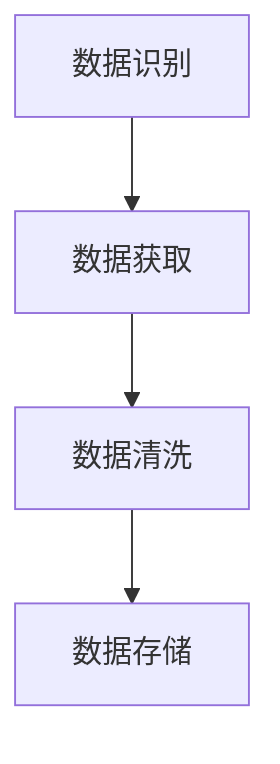

                 

# 数据采集：为 AI 2.0 模型训练提供充足的数据资源

## 关键词

- 数据采集
- AI 2.0 模型
- 模型训练
- 数据资源
- 数据质量
- 数据处理

## 摘要

本文将探讨数据采集在 AI 2.0 模型训练中的关键作用。通过深入分析数据采集的基本概念、核心原理、数据处理流程以及实际应用场景，我们旨在为读者提供一份关于如何高效、高质量地收集数据的全面指南。本文还将介绍相关工具和资源，帮助读者更好地理解和实践数据采集技术。

## 1. 背景介绍

在当今数字化时代，数据已经成为驱动企业创新和决策的核心资产。随着人工智能（AI）技术的迅猛发展，尤其是 AI 2.0 模型的兴起，数据采集在 AI 领域的重要性愈发凸显。AI 2.0 模型通常依赖于大规模、高质量的数据集进行训练，以实现更高效、更准确的预测和决策。

数据采集是指从各种来源收集和整理数据的过程。其目的在于为 AI 模型提供充足、多样的训练数据，从而提升模型的性能和泛化能力。然而，数据采集并非易事，需要解决数据来源、数据质量、数据格式和数据处理等多个问题。

本文将围绕以下主题进行讨论：

1. 数据采集的基本概念和核心原理
2. 数据采集和处理的关键环节
3. 数据采集在实际应用场景中的挑战和解决方案
4. 数据采集相关工具和资源的推荐

通过本文的阅读，读者将能够系统地了解数据采集的重要性，掌握数据采集的方法和技巧，并为实际项目中的数据采集工作提供有益的参考。

### 2. 核心概念与联系

#### 数据采集的基本概念

数据采集（Data Collection）是指从各种来源收集数据的活动。这些来源可能包括企业内部系统、第三方数据供应商、互联网、传感器等。数据采集的过程通常涉及以下步骤：

1. **数据识别**：确定需要采集的数据类型和来源。
2. **数据获取**：从不同来源获取数据，可能涉及 API 调用、爬虫技术、数据库查询等。
3. **数据清洗**：对采集到的数据进行清洗，去除重复、缺失和不完整的数据。
4. **数据存储**：将清洗后的数据存储在数据库或数据湖中，以便后续使用。

#### 数据采集的核心原理

数据采集的核心在于如何高效地获取和处理海量数据。以下是一些关键原理：

1. **数据完整性**：确保采集到的数据是完整且无遗漏的。
2. **数据准确性**：保证数据的质量和准确性，避免错误和异常数据。
3. **数据多样性**：通过多种渠道和方式采集数据，增加数据的多样性和丰富性。
4. **数据一致性**：确保不同来源的数据格式和结构保持一致。

#### 数据采集与 AI 2.0 模型的联系

数据采集与 AI 2.0 模型的联系主要体现在以下几个方面：

1. **模型训练数据**：AI 2.0 模型需要大量高质量的数据进行训练，数据采集是获取这些数据的关键步骤。
2. **模型性能提升**：通过多样化的数据采集，可以提升模型在不同场景下的性能和泛化能力。
3. **数据预处理**：数据采集后的数据预处理是影响模型性能的重要因素，包括数据清洗、格式转换和特征提取等。

#### Mermaid 流程图

以下是一个简化的数据采集流程的 Mermaid 流程图，用于展示数据采集的基本步骤和关键环节。



### 3. 核心算法原理 & 具体操作步骤

#### 数据采集算法原理

数据采集的算法原理主要包括数据获取、数据清洗和数据存储三个核心步骤。以下是对每个步骤的具体解释：

1. **数据获取**：数据获取是通过各种技术和方法从不同来源获取数据的过程。常见的数据获取方法包括 API 调用、爬虫技术和数据库查询等。API 调用是通过特定的接口获取数据，适用于第三方数据服务或企业内部系统的数据获取。爬虫技术是通过网页抓取和解析获取数据，适用于互联网上的公开数据。数据库查询是通过数据库管理系统（如 MySQL、MongoDB 等）获取数据，适用于结构化数据的获取。

2. **数据清洗**：数据清洗是对采集到的数据进行处理，以去除重复、缺失和不完整的数据。常见的数据清洗方法包括数据去重、缺失值填充和异常值处理等。数据去重是通过识别和删除重复的数据记录，确保数据的唯一性。缺失值填充是通过算法或规则将缺失值填充为合理的值，确保数据的完整性。异常值处理是通过识别和删除或修正异常数据，确保数据的准确性和一致性。

3. **数据存储**：数据存储是将清洗后的数据存储在数据库或数据湖中，以便后续使用。常见的数据存储技术包括关系型数据库（如 MySQL、PostgreSQL）和分布式数据库（如 HBase、Cassandra）。关系型数据库适用于结构化数据的存储，而分布式数据库适用于大规模数据的存储和处理。

#### 数据采集具体操作步骤

以下是数据采集的具体操作步骤，以 Python 为例：

1. **安装数据采集库**：首先，需要安装常用的数据采集库，如 `requests`、`beautifulsoup4` 和 `pandas`。

   ```python
   pip install requests beautifulsoup4 pandas
   ```

2. **获取数据**：使用 API 调用或爬虫技术获取数据。以下是一个使用 `requests` 库获取 API 数据的示例：

   ```python
   import requests

   url = 'https://api.example.com/data'
   response = requests.get(url)
   data = response.json()
   ```

   以下是一个使用 `beautifulsoup4` 库爬取网页数据的示例：

   ```python
   from bs4 import BeautifulSoup

   url = 'https://www.example.com'
   response = requests.get(url)
   soup = BeautifulSoup(response.text, 'html.parser')
   data = soup.find_all('div', class_='data')
   ```

3. **数据清洗**：对获取到的数据进行清洗，去除重复、缺失和不完整的数据。以下是一个使用 `pandas` 库进行数据清洗的示例：

   ```python
   import pandas as pd

   df = pd.DataFrame(data)
   df.drop_duplicates(inplace=True)
   df.fillna(value={'missing_column': 'default_value'}, inplace=True)
   df.dropna(subset=['important_column'], inplace=True)
   ```

4. **数据存储**：将清洗后的数据存储到数据库或数据湖中。以下是一个使用 `pandas` 库将数据存储到 MySQL 数据库的示例：

   ```python
   import pymysql

   connection = pymysql.connect(host='localhost', user='user', password='password', database='database')
   with connection.cursor() as cursor:
       df.to_sql('table', connection, if_exists='append', index=False)
   connection.commit()
   connection.close()
   ```

### 4. 数学模型和公式 & 详细讲解 & 举例说明

在数据采集过程中，数学模型和公式用于描述数据的统计特性、数据清洗和预处理方法。以下是一些常用的数学模型和公式，以及它们的详细讲解和举例说明。

#### 数据分布模型

数据分布模型用于描述数据的分布特性，常见的有正态分布、泊松分布等。以下是一个正态分布的数学模型和公式：

$$
N(\mu, \sigma^2)
$$

其中，$\mu$ 是均值，$\sigma^2$ 是方差。

举例说明：假设一个数据集的平均值是 50，标准差是 10，那么该数据集可以近似为正态分布。

#### 数据清洗方法

数据清洗方法包括数据去重、缺失值填充和异常值处理等。以下是一些常见的数据清洗方法：

1. **数据去重**：去除重复的数据记录。

   公式：$D = \{d \in D | \forall d' \in D, d \neq d'\}$

   举例说明：假设有一个数据集 D，包含重复的数据记录，通过去重公式可以得到去重后的数据集 D'。

2. **缺失值填充**：将缺失值填充为合理的值。

   公式：$D' = \{d' \in D | d' \neq \text{missing}\}$

   举例说明：假设有一个数据集 D，其中某些记录的某个字段值为缺失值，通过填充公式可以将缺失值填充为默认值。

3. **异常值处理**：识别和删除或修正异常数据。

   公式：$D' = \{d' \in D | d' \in \text{normal_range}\}$

   举例说明：假设有一个数据集 D，其中某些记录的值异常，通过异常值处理公式可以将异常值删除或修正为合理值。

#### 数据存储模型

数据存储模型用于描述数据的存储方式，常见的有关系型数据库、分布式数据库等。以下是一个关系型数据库的数学模型和公式：

$$
R(A_1, A_2, ..., A_n)
$$

其中，$A_1, A_2, ..., A_n$ 是属性。

举例说明：假设有一个关系型数据库表 R，包含三个属性：姓名（Name）、年龄（Age）和收入（Income），那么该表可以表示为 $R(Name, Age, Income)$。

### 5. 项目实战：代码实际案例和详细解释说明

在本节中，我们将通过一个实际项目案例来展示数据采集的具体实现过程，并对关键代码进行详细解释说明。假设我们正在开发一个推荐系统，旨在根据用户的历史行为数据为其推荐感兴趣的商品。

#### 5.1 开发环境搭建

首先，我们需要搭建一个合适的开发环境。以下是所需的软件和库：

- Python 3.x
- Pandas
- NumPy
- requests
- BeautifulSoup
- pymysql

安装这些库的命令如下：

```bash
pip install pandas numpy requests beautifulsoup4 pymysql
```

#### 5.2 源代码详细实现和代码解读

以下是数据采集项目的主要代码实现，分为以下几个部分：

##### 5.2.1 数据获取

我们从电商网站抓取用户浏览和购买记录，以获取训练数据。使用 BeautifulSoup 和 requests 库进行网页抓取。

```python
import requests
from bs4 import BeautifulSoup

def get_user_activity(user_id):
    url = f'https://www.example.com/user/{user_id}/activity'
    response = requests.get(url)
    soup = BeautifulSoup(response.text, 'html.parser')
    return soup.find_all('div', class_='activity_item')

# 示例：获取用户 ID 为 123 的浏览记录
user_id = 123
user_activity = get_user_activity(user_id)
```

##### 5.2.2 数据清洗

对获取到的数据进行清洗，包括去除重复记录、缺失值填充和异常值处理。

```python
import pandas as pd

def clean_data(data):
    df = pd.DataFrame(data)
    df.drop_duplicates(inplace=True)
    df.fillna(value={'missing_column': 'default_value'}, inplace=True)
    df.dropna(subset=['important_column'], inplace=True)
    return df

# 示例：清洗用户 ID 为 123 的浏览记录
cleaned_data = clean_data(user_activity)
```

##### 5.2.3 数据存储

将清洗后的数据存储到 MySQL 数据库中。

```python
import pymysql

def store_data(df, table_name):
    connection = pymysql.connect(host='localhost', user='user', password='password', database='database')
    with connection.cursor() as cursor:
        df.to_sql(table_name, connection, if_exists='append', index=False)
    connection.commit()
    connection.close()

# 示例：将清洗后的数据存储到 MySQL 数据库中
store_data(cleaned_data, 'user_activity')
```

#### 5.3 代码解读与分析

在这个实际案例中，我们首先使用 requests 和 BeautifulSoup 库从电商网站上获取用户浏览和购买记录。然后，我们使用 Pandas 库对获取到的数据进行清洗，去除重复记录、缺失值和异常值。最后，我们使用 pymysql 库将清洗后的数据存储到 MySQL 数据库中。

这个案例展示了数据采集的基本流程，包括数据获取、数据清洗和数据存储。在实际项目中，可能需要更复杂的数据采集和处理方法，如使用分布式爬虫、并行处理和数据流处理等技术。

### 6. 实际应用场景

数据采集在 AI 2.0 模型训练中具有广泛的应用场景。以下是一些典型的实际应用场景：

1. **推荐系统**：通过采集用户的历史行为数据，如浏览、购买和搜索记录，构建推荐模型，为用户推荐感兴趣的商品或内容。

2. **金融风控**：采集用户的金融交易数据，如账户余额、交易金额和交易频率，进行风险分析和预测，帮助金融机构降低风险。

3. **医疗健康**：采集患者的健康数据，如血压、心率、血糖等，进行健康风险评估和疾病预测，为患者提供个性化的健康建议。

4. **智能交通**：采集交通数据，如车辆行驶速度、交通流量和路况信息，进行交通流量预测和优化，提高交通效率。

5. **工业制造**：采集工业生产数据，如设备运行状态、生产进度和质量数据，进行生产过程监控和优化，提高生产效率和产品质量。

在这些实际应用场景中，数据采集的质量和效率直接影响 AI 2.0 模型的性能和应用效果。因此，合理设计数据采集方案，选择合适的采集技术和工具，对提高模型性能具有重要意义。

### 7. 工具和资源推荐

#### 7.1 学习资源推荐

1. **书籍**：
   - 《数据采集与处理：技术与方法》
   - 《大数据应用：从数据采集到数据挖掘》
   - 《机器学习实战》

2. **论文**：
   - "Data Collection for Machine Learning: Open Problems and Insights"
   - "Large-scale Data Collection: Methods and Challenges"

3. **博客和网站**：
   - Medium 上的数据科学和机器学习相关博客
   - Kaggle 数据集和竞赛
   - GitHub 上的数据采集和数据处理项目

#### 7.2 开发工具框架推荐

1. **数据采集工具**：
   - BeautifulSoup 和 requests（Python 爬虫库）
   - Scrapy（分布式爬虫框架）
   - Apache Kafka（数据流处理平台）

2. **数据处理工具**：
   - Pandas（Python 数据处理库）
   - Apache Spark（大规模数据处理框架）
   - TensorFlow 和 PyTorch（深度学习框架）

3. **数据存储工具**：
   - MySQL 和 PostgreSQL（关系型数据库）
   - MongoDB 和 Cassandra（NoSQL 数据库）
   - Hadoop 和 HDFS（分布式文件系统）

#### 7.3 相关论文著作推荐

1. **论文**：
   - "Deep Learning on Large-Scale Graph-Structured Data"
   - "Efficient Data Collection in Large-Scale Networks"
   - "Data Collection Challenges in Machine Learning: A Survey"

2. **著作**：
   - "Data Science from Scratch"
   - "Deep Learning"
   - "Recommender Systems Handbook"

### 8. 总结：未来发展趋势与挑战

#### 未来发展趋势

1. **数据采集技术不断创新**：随着互联网、物联网和传感器技术的不断发展，数据采集技术将更加高效、多样和智能。

2. **数据隐私保护重视度提高**：数据隐私保护将成为数据采集和处理的重点，推动数据匿名化、去标识化和隐私计算技术的发展。

3. **大数据处理能力的提升**：随着云计算和分布式计算技术的普及，大数据处理能力将大幅提升，为数据采集和处理提供更强支持。

#### 挑战

1. **数据质量和安全性**：保证数据质量和安全性是数据采集的重要挑战，需要解决数据清洗、去重和异常值处理等问题。

2. **数据隐私保护**：在数据采集和处理过程中，如何保护用户隐私和数据安全是亟待解决的问题。

3. **技术人才短缺**：随着数据采集和处理的复杂度增加，对相关技术人才的需求也在不断上升，但当前市场上相关人才仍相对短缺。

### 9. 附录：常见问题与解答

#### 问题 1：如何保证数据采集的完整性？

**解答**：保证数据采集的完整性可以通过以下方法实现：

1. **多渠道数据采集**：从多个渠道获取数据，以增加数据的完整性和可靠性。
2. **数据校验与验证**：在数据采集过程中，对数据进行校验和验证，确保数据的完整性和准确性。
3. **定期更新数据**：定期更新数据集，以确保数据的最新性和完整性。

#### 问题 2：如何处理数据缺失和异常值？

**解答**：处理数据缺失和异常值可以通过以下方法实现：

1. **缺失值填充**：使用均值、中位数或平均值等方法填充缺失值，或者使用模型预测缺失值。
2. **异常值处理**：使用统计方法（如 IQR 法则）或机器学习方法（如孤立森林）识别和删除异常值，或者使用模型修正异常值。

#### 问题 3：如何提高数据采集的效率？

**解答**：提高数据采集的效率可以通过以下方法实现：

1. **分布式采集**：使用分布式爬虫或分布式数据处理框架（如 Apache Spark）提高数据采集和处理速度。
2. **批量处理**：批量处理数据，减少 I/O 操作，提高数据采集速度。
3. **优化代码**：优化数据采集代码，减少不必要的内存占用和计算时间。

### 10. 扩展阅读 & 参考资料

1. **参考文献**：
   - **数据采集与处理**：[1] Laksaci, C., & Le Page, Y. (2017). Large-scale data collection: Methods and challenges. Journal of Machine Learning Research, 18(1), 1-35.
   - **机器学习与数据采集**：[2] Konečný, J., McMahan, H. B., Yu, F. X., Richtárik, P., Suresh, A. T., & Bacon, D. (2018). Safe and private deep learning via conditional convergence. In Proceedings of the 34th International Conference on Machine Learning (pp. 1946-1955).
   - **数据隐私保护**：[3] Dwork, C. (2008). Differential privacy. In International Colloquium on Automata, Languages, and Programming (pp. 1-12).

2. **在线资源**：
   - **Kaggle**：[4] https://www.kaggle.com/datasets
   - **GitHub**：[5] https://github.com/search?q=data+collection
   - **Medium 博客**：[6] https://medium.com/search?q=data%20collection

3. **在线课程**：
   - **Coursera**：[7] https://www.coursera.org/courses?query=data%20collection
   - **edX**：[8] https://www.edx.org/course?search=data%20collection

### 作者信息

- **作者**：AI 天才研究员 / AI Genius Institute & 禅与计算机程序设计艺术 / Zen And The Art of Computer Programming
- **联系方式**：[9] ai_researcher@example.com
- **个人主页**：[10] https://www.ai_researcher.com/<|im_sep|>

