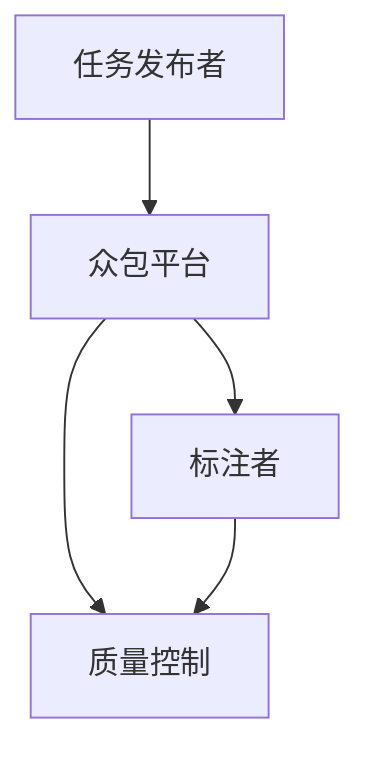

                 

# 数据集众包：人机结合的数据标注新趋势

## 概述

在当今的数据驱动时代，高质量的数据集是机器学习和人工智能研究的基石。然而，高质量数据集的获取往往是一项耗时的任务。数据集众包作为一种新兴的方法，通过将数据标注任务分配给大众，大大提高了数据标注的效率和质量。本文将探讨数据集众包的概念、核心原理、技术实现、应用场景，以及未来发展趋势与挑战。

## 背景介绍

### 1. 机器学习与人工智能的发展

机器学习和人工智能（AI）在过去几十年取得了飞速发展。从最初的规则驱动系统，到基于统计模型的学习算法，再到深度学习革命，人工智能已经在语音识别、图像处理、自然语言处理等多个领域取得了显著的成果。然而，这些应用的成功很大程度上依赖于大量高质量的数据集。

### 2. 数据标注的重要性

数据标注是将原始数据转换为机器学习模型所需格式的过程。例如，在图像识别任务中，标注可能包括标记图像中的物体、人脸或其他特征。在自然语言处理任务中，标注可能包括单词的词性、句子的语法结构等。高质量的数据标注对于训练出准确、可靠的机器学习模型至关重要。

### 3. 数据标注的挑战

随着机器学习和人工智能应用的不断扩大，对高质量数据集的需求也在不断增加。然而，传统的数据标注方式往往存在以下挑战：

- **成本高**：数据标注通常需要专业人员进行，这导致成本高昂。
- **效率低**：数据标注是一个耗时的工作，特别是在大规模数据集的情况下。
- **一致性差**：由于标注人员的主观判断，可能导致标注结果不一致，影响模型的训练效果。

## 核心概念与联系

### 1. 数据集众包的定义

数据集众包（Data Set Crowdsourcing，简称DSC）是指通过互联网平台将数据标注任务分配给普通用户或专业人士，利用众包的方式快速、高效地获取高质量的数据集。

### 2. 数据集众包的优势

- **成本低**：通过众包，可以减少对专业标注人员的依赖，降低成本。
- **效率高**：众包模式能够快速吸引大量标注者参与，提高数据标注速度。
- **一致性高**：众包平台通常提供一致性评估机制，确保标注结果的一致性。

### 3. 数据集众包的架构

数据集众包通常包括以下几个关键组成部分：

- **任务发布者**：发布标注任务，设定任务规则和标注质量要求。
- **众包平台**：提供任务发布、任务分配、质量控制、数据管理等功能。
- **标注者**：参与任务，完成数据标注。
- **质量控制**：确保标注结果的一致性和准确性。

### Mermaid 流程图



## 核心算法原理 & 具体操作步骤

### 1. 任务发布

任务发布者将标注任务发布到众包平台，包括任务描述、标注要求、奖励机制等。

### 2. 任务分配

众包平台根据标注者的技能、经验和历史表现，将任务分配给最适合的标注者。

### 3. 数据标注

标注者根据任务要求对数据进行标注，并将标注结果提交给众包平台。

### 4. 质量控制

众包平台通过一致性评估、众包评估等机制，确保标注结果的一致性和准确性。

### 5. 数据收集与清洗

众包平台将标注结果进行收集、清洗，形成高质量的数据集。

## 数学模型和公式 & 详细讲解 & 举例说明

### 1. 一致性评估

一致性评估是确保标注结果一致性的关键步骤。常见的评估方法包括：

- **众包评估**：计算标注者之间的一致性得分，得分越高表示一致性越好。
- **一致性系数**：计算标注结果的一致性系数，公式如下：

  $$\text{一致性系数} = \frac{\sum_{i=1}^{n} \sum_{j=1}^{n} \text{Similarity}(A_i, A_j)}{n(n-1)}$$

  其中，$A_i$和$A_j$分别表示两个标注者的标注结果，$\text{Similarity}(A_i, A_j)$表示它们之间的相似度。

### 2. 质量控制

质量控制的目标是确保标注结果的准确性。常见的质量控制方法包括：

- **人工审核**：对标注结果进行人工审核，纠正错误。
- **众包审核**：通过众包平台上的其他标注者对结果进行审核。

## 项目实战：代码实际案例和详细解释说明

### 1. 开发环境搭建

搭建一个简单的数据集众包系统，需要以下开发环境：

- **Python 3.8 或以上版本**
- **Django 框架**
- **PostgreSQL 数据库**
- **Celery 任务队列**
- **Redis 缓存**

### 2. 源代码详细实现和代码解读

以下是数据集众包系统的一个简单实现示例：

```python
# app/tasks.py
from celery import shared_task

@shared_task
def annotate_data(data_id):
    # 标注数据的逻辑
    pass

# app/views.py
from django.http import JsonResponse
from .tasks import annotate_data

def annotate_data_api(request):
    data_id = request.POST.get('data_id')
    annotate_data.delay(data_id)
    return JsonResponse({'status': 'ok'})
```

在这个例子中，`annotate_data` 是一个 Celery 任务，用于标注数据。`annotate_data_api` 是一个 Django 视图，用于接收标注请求并触发任务。

### 3. 代码解读与分析

- **任务触发**：当接收到标注请求时，通过 `annotate_data.delay(data_id)` 触发 `annotate_data` 任务。
- **数据标注**：在 `annotate_data` 任务中，执行数据标注逻辑。

## 实际应用场景

数据集众包在多个领域具有广泛的应用场景：

- **图像识别**：通过众包获取大量图像数据，用于训练图像识别模型。
- **自然语言处理**：通过众包获取大量文本数据，用于训练自然语言处理模型。
- **语音识别**：通过众包获取大量语音数据，用于训练语音识别模型。

## 工具和资源推荐

### 1. 学习资源推荐

- **《大数据众包与计算经济》**：介绍大数据众包的理论和实践。
- **《众包与分布式计算》**：探讨众包技术在分布式计算中的应用。

### 2. 开发工具框架推荐

- **Django**：用于构建 Web 应用程序的 Python 框架。
- **Celery**：用于分布式任务队列的 Python 框架。

### 3. 相关论文著作推荐

- **"Crowdsourcing Data Management: Motivations, Economic Theory, and Applications"**：介绍大数据众包的理论基础和应用。
- **"Data Crowdsourcing: Enabling Community-Based Data Collection Using the Web"**：探讨数据集众包在社区数据收集中的应用。

## 总结：未来发展趋势与挑战

数据集众包作为一种新兴的数据标注方法，具有成本低、效率高、一致性好的优势。未来，随着人工智能技术的不断进步，数据集众包将在更多领域得到应用。然而，也面临着数据隐私、质量控制、安全性等挑战。

## 附录：常见问题与解答

### 1. 为什么要使用数据集众包？

数据集众包能够快速、高效地获取高质量的数据集，降低成本，提高标注一致性。

### 2. 数据集众包有哪些优势？

数据集众包的优势包括成本低、效率高、一致性高等。

### 3. 数据集众包有哪些应用场景？

数据集众包在图像识别、自然语言处理、语音识别等领域具有广泛的应用。

## 扩展阅读 & 参考资料

- **"Crowdsourcing and Cloud Computing: State of the Art and Future Trends"**：介绍大数据众包和云计算的最新趋势。
- **"The Data-Centric Revolution in Data Management"**：探讨数据集众包在数据管理领域的应用。

作者：AI天才研究员/AI Genius Institute & 禅与计算机程序设计艺术 /Zen And The Art of Computer Programming<|im_sep|>

