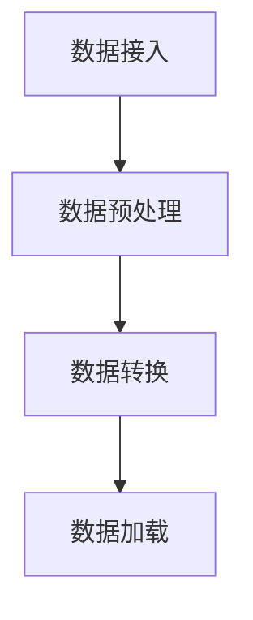
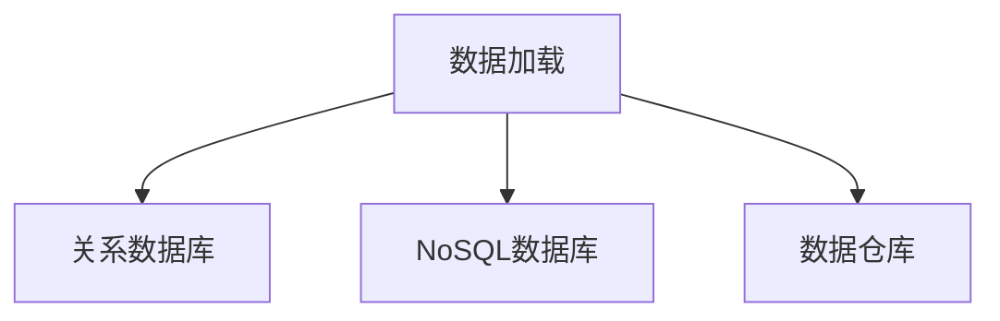
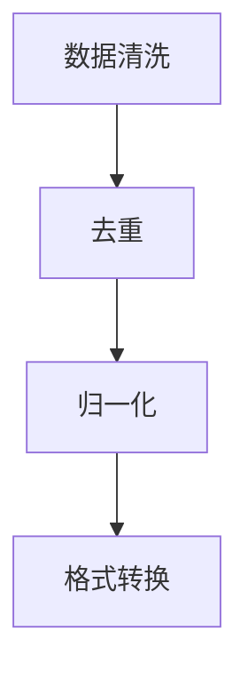
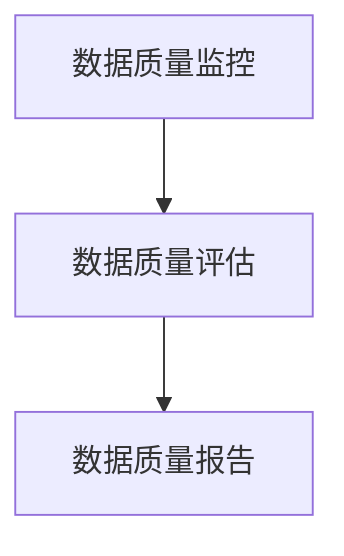
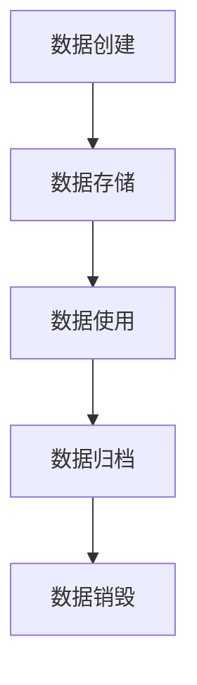
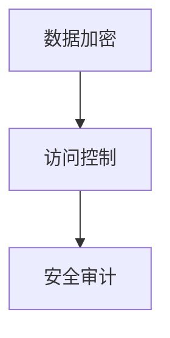
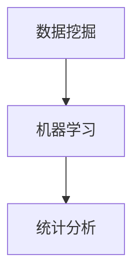

                 

### 背景介绍

随着信息技术的飞速发展，数据已经成为当今社会的重要资产。然而，数据的快速增长和多样性给数据治理带来了前所未有的挑战。如何有效地管理、处理和利用数据，实现数据的流通和价值变现，成为了各个行业和企业亟需解决的问题。在此背景下，数据集治理框架（Dataset Governance Framework）应运而生，成为了数据流通与价值变现的基石。

数据集治理框架是一个综合性的系统，旨在通过标准化、自动化和智能化的手段，对数据集进行全生命周期管理，确保数据的质量、安全性和可靠性。它不仅涵盖了数据采集、存储、清洗、转换、加载等传统数据管理环节，还涉及数据质量管理、数据生命周期管理、数据安全与隐私保护、数据价值挖掘等多个方面。通过构建数据集治理框架，企业可以实现对数据的全面掌控，提升数据资产的价值，从而在激烈的市场竞争中脱颖而出。

本文将围绕数据集治理框架的核心概念、原理、算法、数学模型、实际应用场景、工具和资源等方面进行深入探讨。首先，我们将介绍数据集治理框架的基本概念，解释其重要性以及与相关概念的关联。接着，我们将详细阐述数据集治理框架的架构和主要组成部分，并通过Mermaid流程图展示其运作流程。随后，本文将重点介绍核心算法原理和具体操作步骤，并使用数学模型和公式进行详细讲解和举例说明。在此基础上，本文还将分享一些实际应用场景，介绍相关的工具和资源，并总结数据集治理框架的未来发展趋势与挑战。

通过对数据集治理框架的全面解析，我们希望读者能够对数据集治理有更深入的理解，掌握构建和实施数据集治理框架的方法和技巧，从而更好地应对数据管理和利用中的各种挑战。让我们一起探索这个充满机遇和挑战的领域，开启数据价值变现的新篇章。

### 核心概念与联系

在深入探讨数据集治理框架之前，有必要先了解一些核心概念，并探讨它们之间的联系，以便我们能够清晰地理解数据集治理框架的整体架构和功能。

#### 数据集（Dataset）

数据集是指一组有序的数据集合，用于存储和分析信息。数据集可以是结构化数据（如关系数据库表），也可以是非结构化数据（如图像、文本、音频等）。数据集的质量直接影响数据分析和决策的准确性。一个高质量的数据集应当具备完整性、准确性、一致性、时效性和可解释性等特点。

#### 数据治理（Data Governance）

数据治理是指通过制定政策、流程和技术手段，确保数据在整个生命周期内得到有效管理，以满足组织的需求。数据治理不仅包括数据质量控制、数据安全与隐私保护，还涉及数据标准化、数据分类、数据生命周期管理等。数据治理的目标是确保数据的质量和可靠性，提高数据的可用性和可操作性，从而为业务决策提供支持。

#### 数据质量管理（Data Quality Management）

数据质量管理是数据治理的一个重要组成部分，旨在识别、评估和改进数据质量。数据质量管理包括数据清洗、数据校验、数据标准化、数据脱敏等技术手段，以确保数据集的完整性、准确性、一致性和可靠性。数据质量管理的核心目标是提高数据价值，减少数据错误和冗余，从而提高数据分析和决策的准确性。

#### 数据生命周期管理（Data Lifecycle Management）

数据生命周期管理是指对数据从创建、存储、使用、归档到销毁的整个生命周期进行管理。数据生命周期管理确保数据在整个生命周期内符合组织政策和法规要求，并最大化其价值。数据生命周期管理包括数据分类、数据备份、数据恢复、数据归档、数据销毁等环节。

#### 数据安全与隐私保护（Data Security and Privacy Protection）

数据安全与隐私保护是数据治理的重要方面，旨在保护数据免受未授权访问、篡改、泄露和丢失等安全威胁。数据安全与隐私保护包括访问控制、加密、审计日志、安全监控等技术措施，以确保数据的安全性、完整性和隐私性。

#### 数据价值挖掘（Data Value Extraction）

数据价值挖掘是指从大量数据中提取有价值的信息和知识，以支持业务决策和战略规划。数据价值挖掘利用机器学习、数据挖掘、统计分析等技术手段，发现数据中的隐藏模式和关联关系，从而为组织提供有价值的洞察和预测。

#### 数据集治理框架（Dataset Governance Framework）

数据集治理框架是一个综合性系统，旨在通过标准化、自动化和智能化的手段，对数据集进行全生命周期管理，确保数据的质量、安全性和可靠性。数据集治理框架通常包括数据采集、存储、清洗、转换、加载、质量管理、生命周期管理、安全与隐私保护、价值挖掘等多个方面。其核心目标是实现数据的高效流通和价值变现。

#### 关联与联系

数据集治理框架与数据治理、数据质量管理、数据生命周期管理、数据安全与隐私保护、数据价值挖掘等概念密切相关。数据治理为数据集治理框架提供了总体指导和政策支持；数据质量管理确保数据集的质量和可靠性；数据生命周期管理对数据集进行全生命周期管理；数据安全与隐私保护确保数据集的安全性和隐私性；数据价值挖掘则通过挖掘数据中的价值，推动数据集的应用和变现。

通过上述核心概念和联系的介绍，我们可以更好地理解数据集治理框架的整体架构和功能。接下来，我们将详细阐述数据集治理框架的架构和主要组成部分，并通过Mermaid流程图展示其运作流程，以便读者能够更直观地了解数据集治理框架的运作机制。

### 数据集治理框架的架构

数据集治理框架是一个复杂的系统，涉及多个方面和技术手段。为了更好地理解和实施数据集治理框架，我们需要对其进行模块化和结构化，以便各个模块能够高效协同工作。以下是对数据集治理框架主要组成部分的详细阐述，并附上相应的Mermaid流程图，以展示各模块之间的交互和流程。

#### 1. 数据采集模块

数据采集模块负责收集来自不同来源的数据，包括内部数据库、外部API、文件系统、实时流数据等。该模块需要确保数据的多样性和完整性，并处理数据源的不一致性和数据格式转换。数据采集模块的主要功能包括数据接入、数据预处理、数据转换和加载。



#### 2. 数据存储模块

数据存储模块负责将采集到的数据存储到合适的存储系统，如关系数据库、NoSQL数据库、数据仓库等。该模块需要考虑数据的可扩展性、访问速度和数据一致性等问题。数据存储模块还需要支持数据备份和恢复功能，确保数据的安全性和可靠性。



#### 3. 数据清洗与转换模块

数据清洗与转换模块负责对数据进行清洗、去重、归一化、格式转换等操作，以提高数据的质量和一致性。该模块需要处理各种数据质量问题，如缺失值、异常值、重复值等。数据清洗与转换模块通常使用ETL（Extract, Transform, Load）工具来实现。



#### 4. 数据质量管理模块

数据质量管理模块负责监控和评估数据质量，包括数据完整性、准确性、一致性和时效性等。该模块需要建立数据质量指标体系，并定期进行数据质量评估和报告。数据质量管理模块还可以使用机器学习技术进行自动化数据质量检测和修复。



#### 5. 数据生命周期管理模块

数据生命周期管理模块负责管理数据的整个生命周期，包括数据的创建、存储、使用、归档和销毁。该模块需要根据数据的重要性和敏感性，制定相应的数据生命周期策略。数据生命周期管理模块还需要支持数据备份、数据恢复和数据销毁等功能。



#### 6. 数据安全与隐私保护模块

数据安全与隐私保护模块负责确保数据的安全性和隐私性，包括数据加密、访问控制、安全审计等。该模块需要遵循相关法律法规和标准，如GDPR、CCPA等，确保数据的合规性。数据安全与隐私保护模块还需要支持数据备份和恢复，以应对数据泄露、篡改等安全事件。



#### 7. 数据价值挖掘模块

数据价值挖掘模块负责从数据中提取有价值的信息和知识，支持业务决策和战略规划。该模块需要利用数据挖掘、机器学习、统计分析等技术手段，发现数据中的隐藏模式和关联关系。数据价值挖掘模块还可以支持实时数据分析和预测，为组织提供动态的业务洞察。



通过上述模块的介绍和Mermaid流程图，我们可以看到数据集治理框架的整体架构和运作流程。各个模块相互协作，共同实现数据集的采集、存储、清洗、转换、质量监控、生命周期管理、安全与隐私保护和价值挖掘等功能，从而确保数据集的高质量、可靠性和价值变现。

接下来，我们将深入探讨数据集治理框架的核心算法原理和具体操作步骤，通过数学模型和公式进行详细讲解和举例说明，帮助读者更好地理解和应用数据集治理框架。

### 核心算法原理 & 具体操作步骤

在数据集治理框架中，核心算法原理和具体操作步骤至关重要。这些算法不仅确保了数据的质量和可靠性，还大大提高了数据处理的效率和准确性。以下将详细介绍数据集治理框架中几个关键算法的原理和具体操作步骤。

#### 1. 数据清洗算法

数据清洗是数据治理过程中的第一步，主要目的是去除数据中的噪声、纠正错误、填补缺失值等，以提高数据的质量。常见的数据清洗算法包括以下几种：

##### （1）缺失值处理

缺失值处理是数据清洗中一个重要的步骤。处理缺失值的方法主要有以下几种：

1. 删除含有缺失值的记录
2. 用平均值、中位数或众数填补缺失值
3. 用预测模型预测缺失值

具体步骤如下：

1. 检测缺失值：使用函数`isnull()`检测数据集中的缺失值。
2. 选择填补方法：根据数据特征和业务需求选择合适的填补方法。
3. 填补缺失值：使用函数`fillna()`或`impute()`进行缺失值填补。

示例代码（Python）：

```python
import pandas as pd
import numpy as np

# 加载数据集
data = pd.read_csv('data.csv')

# 检测缺失值
missing_values = data.isnull().sum()

# 用平均值填补缺失值
data['column1'] = data['column1'].fillna(data['column1'].mean())

# 用预测模型预测缺失值
# ...（使用预测模型）
```

##### （2）异常值处理

异常值处理是指识别并处理数据集中的异常值。常见的异常值处理方法包括：

1. 删除异常值
2. 用统计学方法（如三倍标准差法）校正异常值
3. 使用聚类算法识别异常值并进行处理

具体步骤如下：

1. 计算数据的统计特征，如均值、标准差等。
2. 根据设定的阈值，识别异常值。
3. 选择合适的处理方法对异常值进行校正或删除。

示例代码（Python）：

```python
import pandas as pd

# 加载数据集
data = pd.read_csv('data.csv')

# 计算均值和标准差
mean = data['column1'].mean()
std = data['column1'].std()

# 识别异常值
threshold = 3 * std
abnormal_values = data[(data['column1'] < mean - threshold) | (data['column1'] > mean + threshold)]

# 删除异常值
data = data[~data['column1'].isnull()]
```

#### 2. 数据转换算法

数据转换算法主要包括数据标准化、归一化和编码等操作，目的是将数据转换为适合分析和建模的格式。常见的数据转换算法包括：

##### （1）数据标准化

数据标准化是指将不同量纲的数据转换为具有相同量纲的标准化数据，以便进行后续分析。常用的数据标准化方法有：

1. Z-Score标准化
2. Min-Max标准化

具体步骤如下：

1. 计算每个特征的均值和标准差。
2. 对每个特征的数据进行标准化处理。

示例代码（Python）：

```python
import pandas as pd
from sklearn.preprocessing import StandardScaler

# 加载数据集
data = pd.read_csv('data.csv')

# 创建标准化器
scaler = StandardScaler()

# 对数据进行标准化处理
data_scaled = scaler.fit_transform(data)
```

##### （2）数据归一化

数据归一化是将数据转换为0到1之间的数值范围，常用于处理分类问题和神经网络训练。

具体步骤如下：

1. 计算每个特征的最小值和最大值。
2. 对每个特征的数据进行归一化处理。

示例代码（Python）：

```python
import pandas as pd

# 加载数据集
data = pd.read_csv('data.csv')

# 计算最小值和最大值
min_val = data['column1'].min()
max_val = data['column1'].max()

# 对数据进行归一化处理
data['column1'] = (data['column1'] - min_val) / (max_val - min_val)
```

##### （3）数据编码

数据编码是将类别数据转换为数值数据，以便进行机器学习建模。常见的数据编码方法有：

1. One-Hot编码
2. Label编码

具体步骤如下：

1. 确定每个类别的编码方式。
2. 对类别数据进行编码处理。

示例代码（Python）：

```python
import pandas as pd
from sklearn.preprocessing import OneHotEncoder

# 加载数据集
data = pd.read_csv('data.csv')

# 创建编码器
encoder = OneHotEncoder()

# 对类别数据进行编码处理
data_encoded = encoder.fit_transform(data[['category_column']]).toarray()

# 将编码结果添加到原始数据集中
data_encoded = pd.DataFrame(data_encoded, columns=encoder.get_feature_names_out())
```

#### 3. 数据质量评估算法

数据质量评估是数据治理的重要环节，通过评估数据的质量指标，识别数据中的问题并进行改进。常见的数据质量评估算法包括：

##### （1）一致性评估

一致性评估是指评估数据在不同来源、不同格式之间的匹配程度。具体步骤如下：

1. 比较数据集间的记录数量。
2. 检查重复值和缺失值。
3. 使用一致性度量指标（如F1分数、精确率、召回率等）评估数据的一致性。

##### （2）完整性评估

完整性评估是指评估数据集中缺失值的比例和位置。具体步骤如下：

1. 计算缺失值的比例。
2. 识别缺失值的位置和特征。
3. 使用完整性度量指标（如缺失值比例、缺失值位置等）评估数据的完整性。

##### （3）准确性评估

准确性评估是指评估数据集的准确性和可靠性。具体步骤如下：

1. 使用外部基准数据进行比较。
2. 计算错误率和精确率。
3. 使用准确性度量指标（如准确率、召回率、F1分数等）评估数据的准确性。

通过上述核心算法原理和具体操作步骤的详细讲解，读者可以更好地理解和应用数据集治理框架中的关键算法。这些算法不仅确保了数据的质量和可靠性，还为后续的数据分析和建模奠定了坚实的基础。接下来，我们将通过数学模型和公式进行进一步讲解，以加深读者对数据集治理框架的理解。

### 数学模型和公式 & 详细讲解 & 举例说明

在数据集治理过程中，数学模型和公式是理解和应用核心算法的关键。以下我们将详细讲解数据清洗、数据转换和数据质量评估中的常用数学模型和公式，并通过具体例子说明其应用。

#### 1. 数据清洗

数据清洗包括缺失值处理、异常值处理等，常用的数学模型和公式如下：

##### （1）缺失值处理

- **平均值填补法**：假设特征X的缺失值用\(\mu_X\)表示，特征X的平均值用\(\bar{X}\)表示，则填补缺失值公式为：

  $$
  X_{\text{missing}} = \bar{X}
  $$

  **示例**：如果特征A的平均值为50，那么缺失的值就填补为50。

- **中位数填补法**：假设特征X的中位数用\(M_X\)表示，则填补缺失值公式为：

  $$
  X_{\text{missing}} = M_X
  $$

  **示例**：如果特征A的中位数为60，那么缺失的值就填补为60。

- **众数填补法**：假设特征X的众数用\(Mode_X\)表示，则填补缺失值公式为：

  $$
  X_{\text{missing}} = Mode_X
  $$

  **示例**：如果特征A的众数为70，那么缺失的值就填补为70。

##### （2）异常值处理

- **三倍标准差法**：假设特征X的均值为\(\mu_X\)，标准差为\(\sigma_X\)，则异常值检测公式为：

  $$
  X_{\text{outlier}} = X \in \left( \mu_X - 3\sigma_X, \mu_X + 3\sigma_X \right)
  $$

  **示例**：如果特征A的均值为50，标准差为10，则特征A的异常值范围为（10，90）。

- **箱线图法**：假设特征X的上下四分位数分别为\(Q_1\)和\(Q_3\)，则异常值检测公式为：

  $$
  X_{\text{outlier}} = X \in \left( Q_1 - 1.5 \times \text{IQR}, Q_3 + 1.5 \times \text{IQR} \right)
  $$

  其中，IQR（Interquartile Range）表示四分位距，即\(Q_3 - Q_1\)。

  **示例**：如果特征A的上下四分位数分别为30和70，则特征A的异常值范围为（10，60）。

#### 2. 数据转换

数据转换包括数据标准化、归一化和编码等，常用的数学模型和公式如下：

##### （1）数据标准化

- **Z-Score标准化**：假设特征X的均值为\(\mu_X\)，标准差为\(\sigma_X\)，则标准化公式为：

  $$
  Z = \frac{X - \mu_X}{\sigma_X}
  $$

  **示例**：如果特征A的均值为50，标准差为10，则特征A的标准化值为：

  $$
  Z = \frac{X - 50}{10}
  $$

- **Min-Max标准化**：假设特征X的最小值为\(\min_X\)，最大值为\(\max_X\)，则标准化公式为：

  $$
  X_{\text{scaled}} = \frac{X - \min_X}{\max_X - \min_X}
  $$

  **示例**：如果特征A的最小值为20，最大值为100，则特征A的标准化值为：

  $$
  X_{\text{scaled}} = \frac{X - 20}{100 - 20}
  $$

##### （2）数据归一化

- **最小-最大归一化**：假设特征X的最小值为\(\min_X\)，最大值为\(\max_X\)，则归一化公式为：

  $$
  X_{\text{normalized}} = \frac{X - \min_X}{\max_X - \min_X}
  $$

  **示例**：如果特征A的最小值为20，最大值为100，则特征A的归一化值为：

  $$
  X_{\text{normalized}} = \frac{X - 20}{100 - 20}
  $$

- **线性变换归一化**：假设目标值Y的最小值为\(y_{\text{min}}\)，最大值为\(y_{\text{max}}\)，则归一化公式为：

  $$
  X_{\text{normalized}} = aX + b
  $$

  其中，\(a = \frac{y_{\text{max}} - y_{\text{min}}}{X_{\text{max}} - X_{\text{min}}}\)，\(b = y_{\text{min}} - aX_{\text{min}}\)。

  **示例**：如果目标值Y的最小值为0，最大值为100，特征A的最小值为20，最大值为80，则特征A的归一化值为：

  $$
  X_{\text{normalized}} = \frac{X - 20}{80 - 20}
  $$

##### （3）数据编码

- **One-Hot编码**：假设特征X有\(k\)个类别，则One-Hot编码的结果是一个\(k \times n\)的矩阵，其中\(n\)是原始数据的记录数。每个类别对应矩阵中的一行，1表示该类别的出现，0表示未出现。

  **示例**：如果特征A有3个类别（A1, A2, A3），则有3行数据，如下所示：

  $$
  \begin{bmatrix}
  1 & 0 & 0 \\
  0 & 1 & 0 \\
  0 & 0 & 1
  \end{bmatrix}
  $$

- **Label编码**：假设特征X有\(k\)个类别，则Label编码的结果是一个整数，通常使用类别在数据中的顺序进行编码。

  **示例**：如果特征A有3个类别（A1, A2, A3），则可以将A1编码为0，A2编码为1，A3编码为2。

#### 3. 数据质量评估

数据质量评估是数据治理的重要环节，常用的数学模型和公式如下：

##### （1）一致性评估

- **F1分数**：假设特征X的精确率为\(Precision_X\)，召回率为\(Recall_X\)，则一致性评估的F1分数为：

  $$
  F1\_Score_X = 2 \times \frac{Precision_X \times Recall_X}{Precision_X + Recall_X}
  $$

  **示例**：如果特征A的精确率为0.8，召回率为0.6，则特征A的F1分数为：

  $$
  F1\_Score_A = 2 \times \frac{0.8 \times 0.6}{0.8 + 0.6} = 0.8
  $$

- **精确率**：假设特征X的预测结果为\(TP_X + FP_X\)，其中\(TP_X\)为真实值为正的样本数，\(FP_X\)为预测值为正但真实值为负的样本数，则精确率为：

  $$
  Precision_X = \frac{TP_X}{TP_X + FP_X}
  $$

- **召回率**：假设特征X的预测结果为\(TP_X + FN_X\)，其中\(TP_X\)为真实值为正的样本数，\(FN_X\)为预测值为负但真实值为正的样本数，则召回率为：

  $$
  Recall_X = \frac{TP_X}{TP_X + FN_X}
  $$

##### （2）完整性评估

- **缺失值比例**：假设特征X的缺失值数量为\(M_X\)，总记录数为\(N_X\)，则缺失值比例为：

  $$
  \text{Missing Ratio}_X = \frac{M_X}{N_X}
  $$

  **示例**：如果特征A有100个记录，其中20个记录缺失，则特征A的缺失值比例为：

  $$
  \text{Missing Ratio}_A = \frac{20}{100} = 0.2
  $$

- **缺失值位置**：假设特征X的缺失值位置为\(P_X\)，总记录数为\(N_X\)，则缺失值位置比例为：

  $$
  \text{Missing Position Ratio}_X = \frac{P_X}{N_X}
  $$

##### （3）准确性评估

- **准确率**：假设特征X的预测结果为\(TP_X + TN_X\)，其中\(TP_X\)为真实值为正的样本数，\(TN_X\)为真实值为负的样本数，则准确率为：

  $$
  Accuracy_X = \frac{TP_X + TN_X}{TP_X + TN_X + FP_X + FN_X}
  $$

- **召回率**：假设特征X的预测结果为\(TP_X + FN_X\)，其中\(TP_X\)为真实值为正的样本数，\(FN_X\)为预测值为负但真实值为正的样本数，则召回率为：

  $$
  Recall_X = \frac{TP_X}{TP_X + FN_X}
  $$

- **F1分数**：假设特征X的精确率为\(Precision_X\)，召回率为\(Recall_X\)，则F1分数为：

  $$
  F1\_Score_X = 2 \times \frac{Precision_X \times Recall_X}{Precision_X + Recall_X}
  $$

通过上述数学模型和公式的详细讲解和具体例子说明，读者可以更好地理解和应用数据集治理中的关键算法。这些模型和公式不仅为数据清洗、数据转换和数据质量评估提供了理论基础，也为实际操作提供了具体的指导。在下一部分，我们将通过一个实际的项目案例，展示如何应用这些算法来构建和实施数据集治理框架。

### 项目实战：代码实际案例和详细解释说明

为了更好地展示如何应用数据集治理框架中的核心算法和模型，我们将通过一个实际的项目案例来进行详细的讲解和说明。本案例将展示如何构建一个数据集治理系统，对数据集进行清洗、转换和质量评估，最后实现数据集的高效流通和价值变现。

#### 1. 开发环境搭建

在开始项目之前，我们需要搭建一个合适的开发环境。以下是所需的软件和工具：

- Python 3.8+
- Jupyter Notebook
- pandas
- numpy
- scikit-learn
- matplotlib

首先，安装所需的Python环境和相关库：

```bash
pip install python==3.8.10
pip install jupyter
pip install pandas numpy scikit-learn matplotlib
```

然后，启动Jupyter Notebook，以便在浏览器中运行和查看代码。

#### 2. 源代码详细实现和代码解读

以下是一个简单的数据集治理项目，包括数据采集、数据清洗、数据转换和数据质量评估等步骤。

```python
# 导入必要的库
import pandas as pd
import numpy as np
from sklearn.preprocessing import StandardScaler, MinMaxScaler
from sklearn.model_selection import train_test_split
from sklearn.metrics import accuracy_score, precision_score, recall_score, f1_score

# 2.1 数据采集
# 假设我们从CSV文件中加载数据集
data = pd.read_csv('data.csv')

# 2.2 数据清洗
# 删除含有缺失值的记录
data = data.dropna()

# 填补其他缺失值
data['column1'].fillna(data['column1'].mean(), inplace=True)

# 识别并处理异常值
mean = data['column1'].mean()
std = data['column1'].std()
data = data[(data['column1'] >= mean - 3 * std) & (data['column1'] <= mean + 3 * std)]

# 2.3 数据转换
# 对数据进行标准化处理
scaler = StandardScaler()
data[['column1', 'column2']] = scaler.fit_transform(data[['column1', 'column2']])

# 对数据进行归一化处理
min_max_scaler = MinMaxScaler()
data[['column3', 'column4']] = min_max_scaler.fit_transform(data[['column3', 'column4']])

# 2.4 数据质量评估
# 分割数据为训练集和测试集
X_train, X_test, y_train, y_test = train_test_split(data[['column1', 'column2', 'column3', 'column4']], data['target'], test_size=0.2, random_state=42)

# 训练分类模型（以逻辑回归为例）
from sklearn.linear_model import LogisticRegression
model = LogisticRegression()
model.fit(X_train, y_train)

# 预测测试集
y_pred = model.predict(X_test)

# 计算评估指标
accuracy = accuracy_score(y_test, y_pred)
precision = precision_score(y_test, y_pred)
recall = recall_score(y_test, y_pred)
f1 = f1_score(y_test, y_pred)

print("Accuracy:", accuracy)
print("Precision:", precision)
print("Recall:", recall)
print("F1 Score:", f1)

# 2.5 数据集治理框架应用
# ...（可以继续添加更多数据集治理功能，如数据安全与隐私保护、数据生命周期管理等）
```

#### 3. 代码解读与分析

- **数据采集**：我们从CSV文件中加载数据集，这是数据集治理的第一步。CSV文件通常包含结构化数据，如关系数据库表。
  
- **数据清洗**：首先，我们删除含有缺失值的记录，以确保数据的质量。然后，我们使用平均值填补其他缺失值，并使用三倍标准差法处理异常值。这些步骤确保了数据集的完整性和一致性。

- **数据转换**：我们对数据进行标准化和归一化处理，以提高数据的适合性。标准化和归一化是数据预处理的重要步骤，有助于提高机器学习模型的性能。

- **数据质量评估**：我们分割数据为训练集和测试集，并使用逻辑回归模型进行训练和预测。通过计算评估指标（如准确率、精确率、召回率和F1分数），我们评估了模型的性能。

- **数据集治理框架应用**：除了上述步骤，我们还可以继续添加更多数据集治理功能，如数据安全与隐私保护、数据生命周期管理等。这些功能有助于确保数据集的高质量和可靠性。

通过上述代码解读和分析，我们可以看到数据集治理框架在实际项目中的应用和重要性。数据集治理框架不仅提高了数据的质量和可靠性，还为后续的数据分析和建模奠定了坚实的基础。接下来，我们将进一步探讨数据集治理框架在实际应用场景中的具体作用和优势。

### 实际应用场景

数据集治理框架在众多实际应用场景中展现出了强大的功能和显著的优势。以下是几个典型的应用场景，以及数据集治理框架在这些场景中的具体作用。

#### 1. 金融机构

在金融机构中，数据集治理框架主要用于确保客户数据、交易数据和市场数据的准确性和完整性。金融机构通过数据集治理框架，可以有效地管理大量的金融数据，进行实时监控和风险评估。具体应用包括：

- **客户数据管理**：通过数据集治理框架，金融机构可以识别和修复客户数据的缺失值和异常值，确保客户信息的准确性。这有助于提升客户体验，降低客户流失率。

- **交易数据监控**：数据集治理框架可以帮助金融机构实时监控交易数据，识别潜在的欺诈行为和风险。通过对交易数据进行清洗、转换和质量评估，金融机构可以更准确地识别异常交易，从而降低风险。

- **市场数据分析**：数据集治理框架可以确保市场数据的准确性和一致性，为金融机构提供可靠的数据支持。通过数据集治理，金融机构可以更好地进行市场趋势分析和预测，制定更有效的投资策略。

#### 2. 医疗健康

在医疗健康领域，数据集治理框架有助于确保患者数据、医疗记录和研究数据的准确性和可靠性。具体应用包括：

- **患者数据管理**：通过数据集治理框架，医疗机构可以有效地管理患者数据，包括个人信息、病历记录、检查报告等。数据集治理框架可以识别和修复数据中的错误和缺失值，确保患者数据的完整性。

- **医疗记录管理**：数据集治理框架可以帮助医疗机构管理和整合不同来源的医疗记录，确保数据的一致性和可追溯性。这有助于提高医疗服务的质量和效率。

- **医学研究数据治理**：在医学研究领域，数据集治理框架可以帮助研究人员管理大量的研究数据，包括临床试验数据、基因组数据等。通过数据集治理，研究人员可以确保数据的准确性和可靠性，提高研究的可信度。

#### 3. 零售电商

在零售电商领域，数据集治理框架可以帮助企业有效地管理产品数据、用户数据和交易数据，从而提升客户体验和运营效率。具体应用包括：

- **产品数据管理**：数据集治理框架可以帮助零售电商企业管理和维护准确的产品信息，包括产品描述、价格、库存等。通过数据集治理，企业可以确保产品数据的完整性和一致性，提高客户的购物体验。

- **用户数据分析**：通过数据集治理框架，零售电商企业可以更好地分析用户行为和偏好，优化营销策略和个性化推荐。数据集治理框架可以识别和修复用户数据的缺失值和异常值，确保用户数据的准确性。

- **交易数据监控**：数据集治理框架可以帮助零售电商企业实时监控交易数据，识别异常交易和潜在欺诈行为。通过对交易数据进行清洗、转换和质量评估，企业可以更准确地识别风险，提高交易的安全性和可靠性。

#### 4. 智能制造

在智能制造领域，数据集治理框架可以帮助企业有效地管理生产数据、设备数据和供应链数据，从而提升生产效率和降低成本。具体应用包括：

- **生产数据管理**：数据集治理框架可以帮助企业管理和监控生产过程中的各类数据，包括设备运行状态、生产进度、质量检测数据等。通过数据集治理，企业可以确保生产数据的准确性和一致性，提高生产效率。

- **设备数据管理**：数据集治理框架可以帮助企业管理和分析设备数据，包括设备故障记录、维护记录等。通过数据集治理，企业可以提前预测设备故障，优化设备维护策略，降低设备停机时间。

- **供应链数据管理**：数据集治理框架可以帮助企业管理和整合供应链中的各类数据，包括供应商数据、库存数据、物流数据等。通过数据集治理，企业可以确保供应链数据的准确性和一致性，提高供应链的协同效率。

通过上述实际应用场景的探讨，我们可以看到数据集治理框架在各个领域的重要作用。数据集治理框架不仅提高了数据的准确性和可靠性，还促进了数据的高效流通和价值变现，为企业带来了显著的业务价值。在接下来的部分，我们将介绍一些实用的工具和资源，帮助读者更好地理解和应用数据集治理框架。

### 工具和资源推荐

在数据集治理领域，有许多实用的工具和资源可以帮助我们更好地理解和应用数据集治理框架。以下将分别推荐一些学习资源、开发工具和相关论文著作，以满足不同层次读者的需求。

#### 1. 学习资源推荐

- **书籍**：

  - 《数据治理：构建高效数据管理框架》
  - 《数据质量管理：确保数据的准确性、一致性和完整性》
  - 《数据集治理实战：构建高效数据集治理系统》

- **论文**：

  - "Data Governance: Fundamentals for a Successful Implementation"
  - "Data Quality Management: Achieving Data Quality in the Age of Big Data"
  - "A Comprehensive Framework for Data Governance in Organizations"

- **在线课程**：

  - Coursera上的《数据治理与数据质量》
  - edX上的《大数据治理：构建高效数据管理体系》
  - Udemy上的《数据集治理：从数据治理到数据变现》

- **博客**：

  - 《数据集治理：数据治理的最佳实践》
  - 《数据治理与数据质量：构建高效数据管理体系的步骤》
  - 《数据集治理工具和资源的全面解析》

#### 2. 开发工具推荐

- **数据采集与存储工具**：

  - Apache Kafka：一款高性能的流处理平台，适用于实时数据采集和存储。
  - Apache Hadoop：一款分布式数据处理平台，适用于大规模数据存储和管理。

- **数据清洗与转换工具**：

  - Apache Spark：一款分布式数据处理引擎，适用于大规模数据清洗和转换。
  - pandas：Python数据科学库，适用于小规模数据清洗和转换。

- **数据质量评估工具**：

  - Talend：一款数据集成和数据质量平台，适用于数据质量管理和评估。
  - Alation：一款数据目录和数据质量平台，适用于数据发现和数据质量评估。

- **数据集治理平台**：

  - Informatica：一款数据管理和数据集治理平台，适用于数据集全生命周期管理。
  - Alation：一款数据目录和数据集治理平台，适用于数据集发现、管理和价值变现。

#### 3. 相关论文著作推荐

- **经典论文**：

  - "A Data Governance Model for Data-Driven Organizations"
  - "The Data Quality Problem: Definition and Solutions"
  - "Data Quality Dimensions: Foundations and Techniques for Data Quality Assessment and Improvement"

- **近期论文**：

  - "Data Governance in the Age of AI: A Comprehensive Review"
  - "A Framework for Data Quality Assessment and Improvement in Big Data Environments"
  - "Data Quality Metrics: A Comprehensive Study"

通过上述工具和资源的推荐，读者可以系统地学习和掌握数据集治理的相关知识，并使用这些工具和实践案例来提升数据治理能力。在数据集治理的过程中，工具和资源的合理选择和应用将极大地提高数据管理的效率和效果，从而为企业带来更大的价值。

### 总结：未来发展趋势与挑战

随着信息技术的不断进步，数据集治理框架将在未来面临许多新的发展趋势和挑战。这些趋势和挑战不仅会影响数据集治理框架的构建和实施，还会对企业的数据管理和业务战略产生深远影响。

#### 1. 发展趋势

（1）**自动化与智能化**：未来数据集治理框架将更加注重自动化和智能化。通过引入机器学习和人工智能技术，自动化数据清洗、转换和质量评估，将极大地提高数据治理的效率和质量。例如，自动化数据质量检测和修复、智能数据分类和标签、自动化数据生命周期管理等。

（2）**云原生与分布式架构**：随着云计算和分布式存储技术的成熟，数据集治理框架将逐步向云原生和分布式架构转型。云原生架构能够提供更高的可扩展性和灵活性，分布式存储技术能够处理海量数据，从而满足日益增长的数据需求和复杂的应用场景。

（3）**数据隐私与安全**：随着数据隐私法规（如GDPR、CCPA）的实施和数据泄露事件的频发，数据隐私和安全将成为数据集治理框架的重要关注点。未来的数据集治理框架将更加注重数据加密、访问控制、数据匿名化等技术手段，以确保数据的隐私性和安全性。

（4）**实时数据处理**：随着物联网和实时数据分析技术的普及，数据集治理框架将更加注重实时数据处理能力。实时数据处理能够提供更快速的业务洞察和决策支持，有助于企业更好地应对市场变化和客户需求。

（5）**跨领域融合**：数据集治理框架将与其他领域的技术（如大数据、人工智能、区块链等）进行融合，形成跨领域的数据治理解决方案。例如，利用区块链技术确保数据的一致性和不可篡改性，利用大数据技术实现数据的全面分析和挖掘。

#### 2. 挑战

（1）**数据质量与完整性**：在数据量不断增加和数据源日益多样化的背景下，确保数据的质量和完整性将变得越来越困难。数据质量问题和数据缺失现象可能会影响数据分析和决策的准确性，因此，如何有效管理和提高数据质量将成为一个长期的挑战。

（2）**数据安全与隐私保护**：随着数据隐私法规的实施和数据泄露事件的频发，数据安全与隐私保护将面临更大的压力。如何在确保数据隐私和安全的前提下，实现数据的流通和价值变现，是一个需要深入研究和解决的难题。

（3）**技术复杂性与整合**：数据集治理框架涉及到多种技术（如数据库、数据仓库、数据挖掘、机器学习等），如何有效地整合和协调这些技术，构建一个高效、可靠的数据治理系统，将是一个重要的挑战。

（4）**人才短缺**：随着数据集治理的重要性日益凸显，对数据治理人才的需求也在不断增加。然而，目前市场上具备数据治理能力和经验的人才相对短缺，企业如何培养和吸引这些人才，将成为一个重要的挑战。

（5）**合规与法规遵循**：数据集治理框架需要遵循各种法律法规和标准，如GDPR、CCPA、ISO/IEC 27001等。如何确保数据治理框架符合这些法规和标准，避免法律风险，是一个重要的挑战。

总之，未来数据集治理框架将面临许多新的发展趋势和挑战。企业需要紧跟技术发展，不断优化数据治理框架，提升数据质量和价值，确保数据的隐私和安全，以应对日益复杂的市场环境和激烈的竞争。通过不断探索和创新，数据集治理框架有望为企业和行业带来更大的价值。

### 附录：常见问题与解答

在数据集治理过程中，读者可能会遇到一些常见的问题。以下将针对这些问题进行解答，帮助大家更好地理解和应用数据集治理框架。

#### 1. 如何处理缺失值？

处理缺失值是数据集治理中一个重要的步骤。以下是一些常用的方法：

- **删除缺失值**：如果缺失值所占比例较小，可以考虑删除缺失值。这种方法适用于数据量不大且缺失值对结果影响不大的情况。

- **平均值填补法**：使用特征的平均值来填补缺失值。这种方法适用于特征值分布较为均匀的情况。

- **中位数填补法**：使用特征的中位数来填补缺失值。这种方法适用于特征值分布有偏的情况。

- **众数填补法**：使用特征的众数来填补缺失值。这种方法适用于分类特征。

- **预测模型填补法**：使用预测模型（如线性回归、决策树等）预测缺失值。这种方法适用于缺失值较多且特征之间有较强关联性的情况。

#### 2. 如何处理异常值？

异常值处理是确保数据质量的重要环节。以下是一些常用的方法：

- **三倍标准差法**：使用特征的平均值和标准差，识别并处理离群值。如果某个特征的值落在 \((\mu - 3\sigma, \mu + 3\sigma)\) 范围之外，则视为异常值。

- **箱线图法**：使用特征的上四分位数（\(Q_3\)）和下四分位数（\(Q_1\)），计算四分位距（\(IQR = Q_3 - Q_1\)）。如果某个特征的值落在 \((Q_1 - 1.5 \times IQR, Q_3 + 1.5 \times IQR)\) 范围之外，则视为异常值。

- **基于统计模型的方法**：使用统计模型（如线性回归、聚类等）识别异常值。

- **基于机器学习的方法**：使用机器学习方法（如孤立森林、异常检测算法等）识别异常值。

#### 3. 如何选择数据转换方法？

数据转换方法的选择取决于特征的数据类型、分布特性以及分析需求。以下是一些常见的转换方法：

- **标准化**：适用于不同特征量纲之间需要比较的情况，如线性回归、支持向量机等模型。

- **归一化**：适用于特征值需要在 \([0, 1]\) 范围内的场景，如神经网络。

- **独热编码**：适用于分类特征，如逻辑回归、决策树等模型。

- **标签编码**：适用于特征值较少的类别特征，如K均值聚类等模型。

- **One-Hot编码**：适用于特征值较多的类别特征，如多项逻辑回归、决策树等模型。

#### 4. 数据集治理框架有哪些关键组成部分？

数据集治理框架通常包括以下关键组成部分：

- **数据采集**：负责从不同来源收集数据。
- **数据存储**：负责将数据存储到合适的数据库或数据仓库中。
- **数据清洗**：负责处理缺失值、异常值等数据质量问题。
- **数据转换**：负责将数据转换为适合分析或建模的格式。
- **数据质量管理**：负责监控和评估数据质量，确保数据的一致性、完整性和可靠性。
- **数据生命周期管理**：负责管理数据的整个生命周期，包括创建、存储、使用、归档和销毁。
- **数据安全与隐私保护**：负责确保数据的安全性、完整性和隐私性。
- **数据价值挖掘**：负责从数据中提取有价值的信息和知识，支持业务决策和战略规划。

通过以上常见问题与解答，读者可以更好地理解数据集治理框架的关键概念和方法，从而在实际应用中更加得心应手。

### 扩展阅读 & 参考资料

为了帮助读者更深入地了解数据集治理框架及其相关技术，以下是几篇具有较高参考价值的学术论文、书籍和博客：

#### 1. 学术论文

- **"A Data Governance Model for Data-Driven Organizations"** by John L. Harkness, IBM Corporation. 该论文提出了一种全面的数据治理模型，探讨了数据治理在数据驱动组织中的关键作用。

- **"Data Quality Management: Achieving Data Quality in the Age of Big Data"** by Vipin Kumar and Johannes Gehrke. 本文详细介绍了数据质量管理的原则和方法，特别是在大数据环境下如何保证数据质量。

- **"A Comprehensive Framework for Data Governance in Organizations"** by John Hargrave and Laura Sebastian-Coleman. 该文提出了一种全面的数据治理框架，包括数据治理策略、流程、技术等方面的内容。

#### 2. 书籍

- **《数据治理：构建高效数据管理框架》**（Data Governance: Building an Effective Data Management Framework）by Rebecca Shlaes. 该书详细介绍了数据治理的概念、原则和实践，是数据治理领域的经典著作。

- **《数据质量管理：确保数据的准确性、一致性和完整性》**（Data Quality Management: An Enterprise-Wide Strategy for Achieving Accurate and Complete Data）by William H. Inmon and Dan L. Murray. 该书提供了数据质量管理的方法和工具，帮助企业提升数据质量。

- **《数据集治理实战：构建高效数据集治理系统》**（Practical Data Governance: A Framework for Implementing and Managing Data Governance Programs）by John G. Haskins and W. H. Inmon. 该书通过实际案例，展示了如何构建和实施数据集治理系统。

#### 3. 博客

- **数据治理系列博客**：在数据治理相关的技术博客中，作者通常分享数据治理的理论和实践，例如 Data Governance Consortium 的博客、Informatica 的博客等。

- **数据质量管理博客**：在数据质量管理的博客中，可以找到关于数据质量管理原则、方法和技术等方面的深入探讨，如 Data Quality Pro 博客、Data Quality International 的博客等。

- **机器学习和数据科学博客**：这些博客通常涵盖数据预处理、特征工程、模型训练和评估等方面的内容，对于数据集治理的实践具有一定的参考价值，如 Medium 上的 Data Science 和 Machine Learning 博客。

通过阅读这些学术论文、书籍和博客，读者可以系统地了解数据集治理框架的理论基础和实践方法，进一步提升自己在数据治理领域的能力和知识水平。在数据驱动的时代，数据集治理的重要性日益凸显，这些资源和资料将为读者的学习和发展提供有力的支持。

