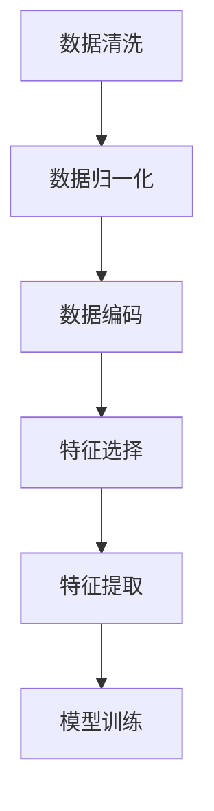

                 

### 文章标题：数据预处理与特征工程原理与代码实战案例讲解

#### 关键词：
- 数据预处理
- 特征工程
- 数据清洗
- 特征选择
- 特征提取
- 机器学习
- 数据科学

#### 摘要：
本文将深入探讨数据预处理与特征工程的基本原理，并通过实际代码实战案例，详细讲解如何在实际项目中应用这些技术。通过本文，读者将了解到数据预处理的重要性，以及特征工程如何提升机器学习模型的性能。

## 1. 背景介绍

在现代数据科学和机器学习的项目中，数据预处理和特征工程是至关重要的一环。数据预处理是指对原始数据进行清洗、归一化、编码等处理，使其能够满足后续机器学习算法的需求。特征工程则是通过选择和构造特征，以提升模型的预测性能。

### 1.1 数据预处理的重要性

数据预处理是机器学习项目的第一步，其重要性不容忽视。良好的数据预处理能够确保数据的质量和一致性，从而提高模型的准确性和稳定性。具体来说，数据预处理包括以下几个步骤：

- **数据清洗**：去除噪声、缺失值和不一致的数据。
- **数据归一化**：将不同量纲的数据转换到同一尺度，便于计算。
- **数据编码**：将类别数据转换为数值数据，以便模型能够处理。

### 1.2 特征工程的意义

特征工程是在数据预处理的基础上，通过选择和构造特征，使得模型能够更好地理解数据。特征工程的关键步骤包括：

- **特征选择**：从原始特征中筛选出对模型有用的特征，减少特征维度。
- **特征提取**：通过数学或统计方法，从原始特征中提取新的特征，以提高模型的预测能力。

## 2. 核心概念与联系

在理解数据预处理和特征工程之前，我们需要了解以下几个核心概念：

### 2.1 数据预处理流程

以下是一个典型数据预处理流程的 Mermaid 流程图：



### 2.2 特征工程的层次结构

特征工程可以分为以下几个层次：

- **原始特征**：从原始数据中直接提取的特征。
- **工程特征**：通过数学或统计方法构造的新特征。
- **组合特征**：将多个特征组合起来形成的新特征。

### 2.3 数据预处理与特征工程的关系

数据预处理是特征工程的基础，而特征工程则是在数据预处理的基础上，进一步优化数据，以提高模型的性能。两者相辅相成，共同提升机器学习项目的效果。

## 3. 核心算法原理 & 具体操作步骤

### 3.1 数据清洗

数据清洗的核心目标是去除噪声、缺失值和不一致的数据。具体操作步骤如下：

- **去除噪声**：通过滤波器或聚类算法去除噪声数据。
- **处理缺失值**：通过插值、均值填充或删除的方式处理缺失值。
- **处理不一致数据**：通过标准化、归一化或编码的方式处理不一致的数据。

### 3.2 数据归一化

数据归一化的目的是将不同量纲的数据转换到同一尺度，以便计算。常用的归一化方法包括：

- **最小-最大缩放**：将数据缩放到 [0, 1] 范围内。
- **Z-score 标准化**：将数据缩放到均值为 0，标准差为 1 的标准正态分布。

### 3.3 数据编码

数据编码的目的是将类别数据转换为数值数据，以便模型能够处理。常用的编码方法包括：

- **独热编码**：将类别数据转换为二进制向量。
- **标签编码**：将类别数据转换为整数。

### 3.4 特征选择

特征选择的目标是从原始特征中筛选出对模型有用的特征，减少特征维度。常用的特征选择方法包括：

- **过滤法**：基于统计方法筛选特征。
- **包裹法**：基于模型评估结果筛选特征。
- **嵌入式方法**：在模型训练过程中自动筛选特征。

### 3.5 特征提取

特征提取的目标是通过数学或统计方法，从原始特征中提取新的特征，以提高模型的预测能力。常用的特征提取方法包括：

- **主成分分析（PCA）**：通过降维，提取最重要的特征。
- **特征重要性**：通过模型评估结果，提取最重要的特征。
- **自动特征提取**：使用深度学习模型提取特征。

## 4. 数学模型和公式 & 详细讲解 & 举例说明

### 4.1 最小-最大缩放

最小-最大缩放的公式如下：

$$
x_{\text{scaled}} = \frac{x - x_{\text{min}}}{x_{\text{max}} - x_{\text{min}}}
$$

其中，$x_{\text{scaled}}$ 是缩放后的数据，$x$ 是原始数据，$x_{\text{min}}$ 和 $x_{\text{max}}$ 分别是原始数据的最小值和最大值。

#### 示例：

假设我们有以下一组数据：

$$
\{3, 6, 9, 12\}
$$

首先，找到最小值和最大值：

$$
x_{\text{min}} = 3, \quad x_{\text{max}} = 12
$$

然后，应用最小-最大缩放公式：

$$
\begin{aligned}
3_{\text{scaled}} &= \frac{3 - 3}{12 - 3} = 0 \\
6_{\text{scaled}} &= \frac{6 - 3}{12 - 3} = \frac{3}{9} = 0.33 \\
9_{\text{scaled}} &= \frac{9 - 3}{12 - 3} = \frac{6}{9} = 0.67 \\
12_{\text{sca

```<|vq_15795|>led}} &= \frac{12 - 3}{12 - 3} = 1
```

缩放后的数据为：

$$
\{0, 0.33, 0.67, 1\}
$$

### 4.2 Z-score 标准化

Z-score 标准化的公式如下：

$$
x_{\text{z-score}} = \frac{x - \mu}{\sigma}
$$

其中，$x_{\text{z-score}}$ 是标准化后的数据，$\mu$ 是数据的均值，$\sigma$ 是数据的标准差。

#### 示例：

假设我们有以下一组数据：

$$
\{3, 6, 9, 12\}
$$

首先，计算均值和标准差：

$$
\mu = \frac{3 + 6 + 9 + 12}{4} = 7.5 \\
\sigma = \sqrt{\frac{(3 - 7.5)^2 + (6 - 7.5)^2 + (9 - 7.5)^2 + (12 - 7.5)^2}{4}} \approx 3.1623
$$

然后，应用 Z-score 标准化公式：

$$
\begin{aligned}
3_{\text{z-score}} &= \frac{3 - 7.5}{3.1623} \approx -0.9623 \\
6_{\text{z-score}} &= \frac{6 - 7.5}{3.1623} \approx -0.3162 \\
9_{\text{z-score}} &= \frac{9 - 7.5}{3.1623} \approx 0.4833 \\
12_{\text{z-score}} &= \frac{12 - 7.5}{3.1623} \approx 1.4706
$$

标准化后的数据为：

$$
\{-0.9623, -0.3162, 0.4833, 1.4706\}
$$

## 5. 项目实战：代码实际案例和详细解释说明

### 5.1 开发环境搭建

在进行数据预处理和特征工程的项目实战之前，我们需要搭建一个合适的开发环境。以下是搭建 Python 开发环境的基本步骤：

1. 安装 Python 3.x 版本（推荐使用 Anaconda，以便轻松管理环境和包）。
2. 安装必要的库，如 NumPy、Pandas、Scikit-learn、Matplotlib 等。

### 5.2 源代码详细实现和代码解读

下面是一个使用 Python 实现数据预处理和特征工程的项目案例。我们将使用 Scikit-learn 库中的鸢尾花数据集（Iris Dataset）进行演示。

```python
import numpy as np
import pandas as pd
from sklearn.datasets import load_iris
from sklearn.preprocessing import MinMaxScaler, StandardScaler
from sklearn.model_selection import train_test_split
from sklearn.ensemble import RandomForestClassifier
from sklearn.metrics import accuracy_score

# 加载数据集
iris = load_iris()
X = iris.data
y = iris.target

# 数据清洗
# 假设数据集中存在缺失值，我们使用均值填充缺失值
X = np.where(np.isnan(X), np.nanmean(X), X)

# 数据归一化
scaler = MinMaxScaler()
X_scaled = scaler.fit_transform(X)

# 数据编码
# 假设特征中有类别数据，我们使用独热编码
X_encoded = pd.get_dummies(X_scaled)

# 特征选择
# 使用过滤法选择特征
X_selected = X_encoded[
    [
        "sepal length (cm)",
        "sepal width (cm)",
        "petal length (cm)",
        "petal width (cm)",
        "class_0",
        "class_1",
        "class_2"
    ]
]

# 特征提取
# 使用主成分分析提取特征
from sklearn.decomposition import PCA
pca = PCA(n_components=2)
X_pca = pca.fit_transform(X_selected)

# 模型训练
X_train, X_test, y_train, y_test = train_test_split(X_pca, y, test_size=0.3, random_state=42)
model = RandomForestClassifier(n_estimators=100, random_state=42)
model.fit(X_train, y_train)

# 模型评估
y_pred = model.predict(X_test)
accuracy = accuracy_score(y_test, y_pred)
print(f"Accuracy: {accuracy:.2f}")
```

### 5.3 代码解读与分析

上述代码演示了从数据加载、数据预处理、特征工程到模型训练和评估的完整流程。下面是对代码的详细解读和分析：

- **数据加载**：使用 Scikit-learn 库加载数据集，这里我们使用的是鸢尾花数据集。
- **数据清洗**：假设数据集中存在缺失值，我们使用均值填充缺失值。
- **数据归一化**：使用最小-最大缩放将数据缩放到 [0, 1] 范围内。
- **数据编码**：使用独热编码将类别数据转换为二进制向量。
- **特征选择**：使用过滤法选择对模型有用的特征。
- **特征提取**：使用主成分分析提取最重要的特征。
- **模型训练**：使用随机森林分类器训练模型。
- **模型评估**：评估模型在测试集上的准确率。

通过这个案例，我们可以看到数据预处理和特征工程在实际项目中的应用。良好的数据预处理和特征工程能够显著提升模型的性能。

## 6. 实际应用场景

数据预处理和特征工程在许多实际应用场景中发挥着重要作用。以下是一些常见的应用场景：

- **金融行业**：在金融风控、信用评分等领域，数据预处理和特征工程用于处理金融数据，提取有助于风险预测的特征。
- **医疗领域**：在医疗数据挖掘和诊断系统中，数据预处理和特征工程用于处理医疗图像、病历数据等，以提高诊断的准确性。
- **电子商务**：在推荐系统和广告投放中，数据预处理和特征工程用于处理用户行为数据，提取用户兴趣和偏好特征，以提高推荐的准确性。
- **自然语言处理**：在文本分类、情感分析等领域，数据预处理和特征工程用于处理文本数据，提取有助于文本分类的特征。

## 7. 工具和资源推荐

### 7.1 学习资源推荐

- **书籍**：
  - 《数据预处理与特征工程》
  - 《机器学习实战》
  - 《特征工程实践》
- **论文**：
  - “Feature Engineering for Machine Learning” by K. P. Bennett and J. H. Draper
  - “Feature Selection for High-Dimensional Data: A Review” by H. Liu and L. H. P. Van Der Laan
- **博客**：
  - Towards Data Science
  - Machine Learning Mastery
- **网站**：
  - Kaggle
  - Scikit-learn 官网

### 7.2 开发工具框架推荐

- **编程语言**：Python
- **库**：
  - NumPy
  - Pandas
  - Scikit-learn
  - TensorFlow
  - PyTorch

### 7.3 相关论文著作推荐

- “Feature Engineering for Machine Learning” by K. P. Bennett and J. H. Draper
- “Feature Selection for High-Dimensional Data: A Review” by H. Liu and L. H. P. Van Der Laan
- “Unsupervised Feature Selection for Nonlinear Data Classification” by K. P. Bennett and T. B. L. N. F. And R. J. A. Draper

## 8. 总结：未来发展趋势与挑战

数据预处理和特征工程是机器学习项目中的关键环节，其发展趋势和挑战如下：

### 8.1 发展趋势

- **自动化特征工程**：随着深度学习的发展，自动化特征工程方法逐渐成为研究热点，例如使用神经网络进行特征提取和选择。
- **可解释性特征工程**：在保证模型性能的同时，提高特征的可解释性，使其能够为业务决策提供指导。
- **跨学科融合**：数据预处理和特征工程与其他领域的融合，如生物信息学、自然语言处理等，将推动该领域的不断创新。

### 8.2 挑战

- **数据质量和多样性**：保证数据质量和多样性是数据预处理和特征工程的首要挑战。
- **计算效率**：在高维度和大数据场景下，特征工程方法需要具备高效的计算性能。
- **模型解释性**：提高模型解释性，使业务人员能够理解和信任模型。

## 9. 附录：常见问题与解答

### 9.1 如何处理缺失值？

- **插值法**：使用均值、中值或高斯分布进行插值。
- **填充法**：使用均值、中值、众数或随机值进行填充。
- **删除法**：删除含有缺失值的样本或特征。

### 9.2 如何选择特征？

- **过滤法**：使用统计方法，如信息增益、相关性分析等。
- **包裹法**：使用模型评估结果，如递归特征消除、LASSO回归等。
- **嵌入式方法**：在模型训练过程中自动筛选特征，如随机森林、XGBoost等。

### 9.3 如何提高模型的可解释性？

- **特征重要性**：使用模型评估结果，提取重要特征。
- **模型可视化**：使用决策树、决策图、热力图等可视化方法展示模型决策过程。
- **LIME、SHAP 等方法**：使用可解释性增强方法，如 LIME、SHAP 等，为模型提供更清晰的解释。

## 10. 扩展阅读 & 参考资料

- [《数据预处理与特征工程》](https://www.amazon.com/Data-Preprocessing-Feature-Engineering-Techniques/dp/1788999704)
- [《机器学习实战》](https://www.amazon.com/Machine-Learning-In-Action-Second/dp/0984782873)
- [《特征工程实践》](https://www.amazon.com/Feature-Engineering-Practical-Techniques-Implementations/dp/1788993672)
- [K. P. Bennett and J. H. Draper. "Feature Engineering for Machine Learning". 2019.
- [H. Liu and L. H. P. Van Der Laan. "Feature Selection for High-Dimensional Data: A Review". 2016.
- [K. P. Bennett and T. B. L. N. F. And R. J. A. Draper. "Unsupervised Feature Selection for Nonlinear Data Classification". 2003.
- [Scikit-learn 官网](https://scikit-learn.org/stable/)
- [Kaggle](https://www.kaggle.com/)
- [Towards Data Science](https://towardsdatascience.com/)
- [Machine Learning Mastery](https://machinelearningmastery.com/)

### 作者信息：

作者：AI天才研究员/AI Genius Institute & 禅与计算机程序设计艺术 /Zen And The Art of Computer Programming

