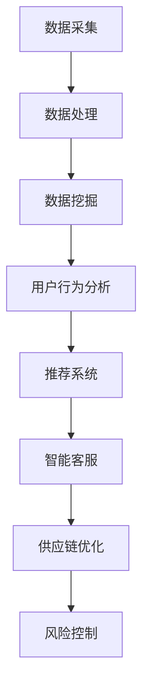

                 

### 背景介绍

#### 电商行业现状及挑战

随着互联网技术的飞速发展和智能手机的普及，电商行业已经成为了全球经济发展的重要驱动力之一。据统计，2021年全球电商市场规模已达到4.89万亿美元，预计到2025年将达到6.38万亿美元。然而，在如此庞大的市场中，电商企业面临着诸多挑战。

首先，市场竞争异常激烈。各大电商平台如亚马逊、阿里巴巴、京东等巨头企业纷纷投入巨资进行市场争夺，导致市场份额高度集中。中小型电商企业要在如此激烈的市场中脱颖而出，面临着巨大的压力。

其次，消费者需求多样化。随着消费者对于购物体验的要求越来越高，个性化、智能化、便捷化成为了电商行业的发展趋势。企业需要通过分析消费者行为，提供个性化的商品推荐和精准的营销策略，以满足消费者的需求。

再次，运营效率亟待提升。电商企业需要高效地处理海量订单、物流、售后服务等环节，以提高整体运营效率。传统的手工处理方式已无法满足快速发展的市场需求，因此，如何利用技术手段提高运营效率成为了电商企业的一大挑战。

#### 人工智能在电商中的应用

人工智能作为当前最为热门的技术之一，已经在电商行业中得到了广泛应用。它不仅可以帮助企业提升运营效率，降低成本，还能为消费者提供更加个性化的购物体验。以下是一些人工智能在电商中的应用场景：

1. **用户行为分析**：通过大数据分析和机器学习算法，对用户的行为进行深入分析，了解消费者的偏好和需求，从而实现精准营销。

2. **商品推荐系统**：基于用户的购买历史、浏览记录等数据，利用协同过滤、基于内容的推荐等算法，为用户推荐符合其兴趣的商品。

3. **智能客服**：利用自然语言处理和机器学习技术，开发智能客服系统，实现24小时在线客服，提高客户满意度。

4. **供应链优化**：通过预测销售趋势和库存需求，优化供应链管理，降低库存成本，提高物流效率。

5. **风险控制**：利用人工智能技术进行异常交易检测、信用评估等，降低交易风险。

本文将围绕“数据驱动决策：AI在电商中的应用”这一主题，深入探讨人工智能在电商行业中的核心应用，分析其原理、技术实现和实际案例，以期为电商企业提供有益的参考和借鉴。让我们一步一步地深入探讨这个话题。  

### 核心概念与联系

在深入探讨人工智能在电商中的应用之前，我们需要了解一些核心概念和原理。以下是本文中涉及的核心概念及其相互关系：

#### 1. 数据驱动决策

数据驱动决策是指企业在决策过程中，以数据为依据，通过数据分析和挖掘，发现数据中的规律和趋势，从而做出更加科学、合理的决策。在电商行业中，数据驱动决策可以涵盖用户行为分析、市场预测、库存管理等多个方面。

#### 2. 机器学习

机器学习是人工智能的核心技术之一，它使得计算机能够通过学习和经验改进自身性能。在电商领域，机器学习技术被广泛应用于用户行为分析、商品推荐、智能客服等场景。

#### 3. 深度学习

深度学习是机器学习的一个分支，它通过多层神经网络模型，对大量数据进行自动特征提取和分类。在电商中，深度学习技术可以用于图像识别、语音识别等。

#### 4. 自然语言处理（NLP）

自然语言处理是使计算机能够理解、处理和生成人类语言的技术。在电商领域，NLP技术被用于智能客服、用户评论分析等。

#### 5. 推荐系统

推荐系统是一种基于用户历史行为和兴趣的算法，旨在为用户推荐相关的内容或商品。在电商中，推荐系统可以显著提升用户的购物体验和满意度。

#### 6. 数据挖掘

数据挖掘是从大量数据中提取出有价值的信息和知识的过程。在电商中，数据挖掘技术可以帮助企业发现用户行为模式、市场趋势等。

#### 7. Mermaid 流程图

Mermaid 是一种用于绘制流程图的 Markdown 语言。在本文中，我们将使用 Mermaid 流程图来展示电商中 AI 应用的核心流程和环节。

以下是电商中 AI 应用的核心概念和流程的 Mermaid 流程图：



在上述流程图中，数据采集、数据处理、数据挖掘是数据驱动决策的基础，而用户行为分析、推荐系统、智能客服、供应链优化、风险控制则是具体应用场景。以下将详细解释这些概念和流程。

#### 1. 数据采集

数据采集是指从各种来源收集数据的过程，包括用户行为数据、商品数据、销售数据等。这些数据是后续分析和挖掘的基础。

#### 2. 数据处理

数据处理是指对采集到的数据进行清洗、整合和存储的过程。清洗数据是为了去除错误和异常数据，整合数据是为了将不同来源的数据进行统一处理，存储数据是为了方便后续的数据分析和挖掘。

#### 3. 数据挖掘

数据挖掘是从大量数据中提取出有价值的信息和知识的过程。在电商中，数据挖掘可以用于发现用户行为模式、市场趋势等，为企业决策提供支持。

#### 4. 用户行为分析

用户行为分析是指通过分析用户在网站上的浏览、搜索、购买等行为，了解用户的需求和偏好。用户行为分析可以为推荐系统、智能客服等提供数据支持。

#### 5. 推荐系统

推荐系统是一种基于用户历史行为和兴趣的算法，旨在为用户推荐相关的内容或商品。推荐系统可以显著提升用户的购物体验和满意度。

#### 6. 智能客服

智能客服是利用自然语言处理和机器学习技术，开发出的自动回答用户问题的系统。智能客服可以24小时在线，提高客户满意度，降低企业运营成本。

#### 7. 供应链优化

供应链优化是指通过预测销售趋势和库存需求，优化供应链管理，降低库存成本，提高物流效率。供应链优化可以显著提升企业的运营效率。

#### 8. 风险控制

风险控制是指利用人工智能技术进行异常交易检测、信用评估等，降低交易风险。风险控制可以保障企业的安全和稳定运营。

通过上述核心概念和流程的介绍，我们可以更好地理解人工智能在电商中的应用原理和实现方法。接下来，我们将深入探讨人工智能在电商中的核心算法原理和具体操作步骤。  

### 核心算法原理 & 具体操作步骤

在电商领域，人工智能的核心算法主要涉及用户行为分析、推荐系统和智能客服等方面。以下将详细解释这些算法的原理和具体操作步骤。

#### 1. 用户行为分析算法

用户行为分析是电商企业了解用户需求、提升用户体验的重要手段。主要算法包括聚类分析、关联规则挖掘等。

**原理**：

- **聚类分析**：将相似的用户分为同一类，常见的聚类算法有 K-means、DBSCAN 等。通过聚类分析，可以识别出具有相似兴趣的用户群体，为个性化推荐和营销提供依据。

- **关联规则挖掘**：挖掘用户行为数据中的关联关系，常见的算法有 Apriori、FP-Growth 等。通过关联规则挖掘，可以发现用户在购买商品时的关联关系，帮助企业设计出更有效的营销策略。

**具体操作步骤**：

1. 数据采集：从电商平台上获取用户的浏览、搜索、购买等行为数据。

2. 数据预处理：对采集到的数据去重、清洗，确保数据质量。

3. 聚类分析：选择合适的聚类算法（如 K-means），将用户分为多个群体。

4. 关联规则挖掘：选择合适的关联规则算法（如 Apriori），挖掘用户行为数据中的关联关系。

5. 结果分析：分析聚类结果和关联规则，为企业提供用户行为分析报告。

**示例**：

假设电商平台上有一组用户行为数据，通过聚类分析，可以将用户分为三个群体：A、B、C。通过关联规则挖掘，可以发现群体 A 用户在购买商品 X 后，有较高的概率购买商品 Y 和 Z。

#### 2. 推荐系统算法

推荐系统是电商企业提升用户满意度和转化率的重要手段。主要算法包括协同过滤、基于内容的推荐等。

**原理**：

- **协同过滤**：基于用户的历史行为数据，为用户推荐相似用户的喜欢的商品。协同过滤分为基于用户的协同过滤（User-based）和基于项目的协同过滤（Item-based）。

- **基于内容的推荐**：根据商品的属性和用户的历史行为数据，为用户推荐具有相似属性的商品。基于内容的推荐分为基于项目的推荐（Item-based）和基于用户的推荐（User-based）。

**具体操作步骤**：

1. 数据采集：从电商平台上获取用户的历史行为数据（如购买、浏览、搜索等）和商品属性数据。

2. 数据预处理：对采集到的数据去重、清洗，确保数据质量。

3. 特征工程：对用户和商品数据进行特征提取，如用户兴趣标签、商品类别、价格等。

4. 推荐算法选择：根据业务需求，选择合适的推荐算法（如协同过滤、基于内容的推荐）。

5. 推荐结果生成：根据用户和商品的相似度，生成推荐列表。

6. 推荐效果评估：通过评估指标（如准确率、召回率、覆盖率等）评估推荐效果。

**示例**：

假设用户 A 历史上购买过商品 X、Y、Z，用户 B 历史上购买过商品 Y、Z、W。通过协同过滤算法，可以为用户 A 推荐用户 B 喜欢的商品 W。通过基于内容的推荐算法，可以为用户 A 推荐与商品 X、Y、Z 具有相似属性的商品。

#### 3. 智能客服算法

智能客服是电商企业提升客户体验的重要手段。主要算法包括自然语言处理、文本分类、意图识别等。

**原理**：

- **自然语言处理（NLP）**：使计算机能够理解和处理人类语言的技术。NLP 技术包括词法分析、句法分析、语义分析等。

- **文本分类**：将文本数据分类到预定义的类别中。常见的文本分类算法有朴素贝叶斯、支持向量机等。

- **意图识别**：识别用户输入的文本所表达的目的或意图。常见的意图识别算法有深度学习、序列标注等。

**具体操作步骤**：

1. 数据采集：从电商平台上获取用户咨询的问题和客服的回答数据。

2. 数据预处理：对采集到的数据进行清洗、分词、去停用词等处理。

3. 特征工程：对预处理后的文本数据进行特征提取，如词频、TF-IDF 等。

4. 模型训练：选择合适的模型（如朴素贝叶斯、支持向量机等），对数据进行训练。

5. 模型评估：通过交叉验证、准确率等指标评估模型效果。

6. 意图识别：利用训练好的模型，对用户输入的文本进行意图识别。

7. 回答生成：根据识别出的意图，生成相应的回答。

**示例**：

假设用户输入了一个问题：“我想要购买一双跑步鞋”。通过意图识别算法，可以识别出用户的意图为“购买跑步鞋”。然后，根据用户的历史购买记录和商品信息，生成相应的回答，如：“根据您的需求，我为您推荐了以下几款跑步鞋：X、Y、Z。”

通过上述核心算法原理和具体操作步骤的介绍，我们可以更好地理解人工智能在电商中的应用方法。接下来，我们将探讨数学模型和公式，以及这些模型在实际应用中的详细讲解和举例说明。  

### 数学模型和公式 & 详细讲解 & 举例说明

在人工智能应用于电商的过程中，数学模型和公式起着至关重要的作用。以下我们将详细讲解几个核心的数学模型和公式，并给出具体的例子进行说明。

#### 1. 协同过滤算法

协同过滤算法是一种基于用户行为数据的推荐算法，其核心思想是找到与目标用户行为相似的邻居用户，并推荐邻居用户喜欢的商品。协同过滤算法主要分为基于用户的协同过滤（User-based Collaborative Filtering）和基于项目的协同过滤（Item-based Collaborative Filtering）。

**基于用户的协同过滤算法**：

- **相似度计算**：计算用户之间的相似度，常用的相似度计算方法有皮尔逊相关系数（Pearson Correlation Coefficient）、余弦相似度（Cosine Similarity）等。

    $$ \text{Pearson Correlation Coefficient} = \frac{\sum_{i}(u_{i}-\bar{u})(v_{i}-\bar{v})}{\sqrt{\sum_{i}(u_{i}-\bar{u})^2}\sqrt{\sum_{i}(v_{i}-\bar{v})^2}} $$

    $$ \text{Cosine Similarity} = \frac{\sum_{i}u_{i}v_{i}}{\sqrt{\sum_{i}u_{i}^2}\sqrt{\sum_{i}v_{i}^2}} $$

- **邻居用户选择**：根据用户之间的相似度，选择与目标用户最相似的 K 个邻居用户。

- **推荐商品计算**：计算邻居用户喜欢的商品，并对其进行加权求和，得到目标用户的推荐列表。

    $$ \text{推荐分值} = \sum_{i \in N} s_{i} \cdot r_{i} $$

    其中，\( s_{i} \) 表示邻居用户 i 对商品 j 的评分，\( r_{i} \) 表示邻居用户 i 与目标用户的相似度。

**基于项目的协同过滤算法**：

- **相似度计算**：计算商品之间的相似度，常用的相似度计算方法有余弦相似度（Cosine Similarity）等。

- **邻居商品选择**：根据商品之间的相似度，选择与目标商品最相似的 K 个邻居商品。

- **推荐用户计算**：计算邻居商品对应的用户，并对其进行加权求和，得到目标用户的推荐列表。

**示例**：

假设有用户 A 和用户 B，他们的行为数据如下表：

| 用户 | 商品1 | 商品2 | 商品3 |
| :---: | :---: | :---: | :---: |
| A | 1 | 0 | 1 |
| B | 1 | 1 | 0 |

计算用户 A 和用户 B 之间的相似度，可以使用余弦相似度：

$$ \text{Cosine Similarity} = \frac{1 \cdot 1 + 0 \cdot 1 + 1 \cdot 0}{\sqrt{1^2 + 0^2 + 1^2} \cdot \sqrt{1^2 + 1^2 + 0^2}} = \frac{1}{\sqrt{2} \cdot \sqrt{2}} = \frac{1}{2} $$

选择与用户 A 最相似的邻居用户 B，根据邻居用户 B 的行为数据，推荐用户 A 之前未购买的商品 2。

#### 2. 贝叶斯推荐算法

贝叶斯推荐算法是一种基于概率论的推荐算法，其核心思想是根据用户的评分行为，预测用户对未知商品的评分。贝叶斯推荐算法可分为基于用户的贝叶斯推荐（User-based Bayesian Recommendation）和基于项目的贝叶斯推荐（Item-based Bayesian Recommendation）。

- **先验概率**：计算用户对商品的平均评分。

    $$ \hat{p}_{ui} = \frac{\sum_{j \in I} r_{uj}}{N_{u}} $$

    其中，\( r_{uj} \) 表示用户 u 对商品 j 的评分，\( N_{u} \) 表示用户 u 对所有商品的评分总和。

- **后验概率**：计算用户对商品 j 的评分大于某个阈值 \( t \) 的概率。

    $$ P(r_{uj} > t | r_{uj} \in \{0, 1\}) = \frac{P(r_{uj} = 1 | r_{uj} \in \{0, 1\}) \cdot P(r_{uj} = 1)}{P(r_{uj} = 1 | r_{uj} \in \{0, 1\}) \cdot P(r_{uj} = 1) + P(r_{uj} = 0 | r_{uj} \in \{0, 1\}) \cdot P(r_{uj} = 0)} $$

    其中，\( P(r_{uj} = 1) \) 和 \( P(r_{uj} = 0) \) 分别表示用户 u 对商品 j 评分 1 和 0 的先验概率。

- **评分预测**：根据后验概率，预测用户 u 对商品 j 的评分。

    $$ \hat{r}_{uj} = 1 \quad \text{if} \quad P(r_{uj} > t | r_{uj} \in \{0, 1\}) > \frac{1}{2} $$

    $$ \hat{r}_{uj} = 0 \quad \text{otherwise} $$

**示例**：

假设用户 A 对 5 个商品评分如下表：

| 商品1 | 商品2 | 商品3 | 商品4 | 商品5 |
| :---: | :---: | :---: | :---: | :---: |
| 1 | 0 | 1 | 1 | 0 |

计算用户 A 对商品 2 的评分预测，先计算先验概率：

$$ \hat{p}_{u2} = \frac{1 + 0 + 1 + 1 + 0}{5} = \frac{3}{5} $$

然后计算后验概率：

$$ P(r_{u2} > 0.5 | r_{u2} \in \{0, 1\}) = \frac{P(r_{u2} = 1 | r_{u2} \in \{0, 1\}) \cdot P(r_{u2} = 1)}{P(r_{u2} = 1 | r_{u2} \in \{0, 1\}) \cdot P(r_{u2} = 1) + P(r_{u2} = 0 | r_{u2} \in \{0, 1\}) \cdot P(r_{u2} = 0)} $$

由于用户 A 对商品 2 的评分是 0，所以 \( P(r_{u2} = 1) = 0 \)，因此后验概率为 0，预测用户 A 对商品 2 的评分为 0。

#### 3. 深度学习推荐算法

深度学习推荐算法是近年来发展迅速的一种推荐算法，其核心思想是利用深度神经网络学习用户和商品的特征表示，然后通过模型预测用户对商品的评分。

- **用户和商品嵌入表示**：利用深度神经网络（如卷积神经网络（CNN）、循环神经网络（RNN）等）对用户和商品进行嵌入表示。

    $$ \text{User Embedding} = \text{NN}(u) $$
    $$ \text{Item Embedding} = \text{NN}(i) $$

- **评分预测**：利用用户和商品的嵌入表示，计算用户对商品的评分。

    $$ \hat{r}_{ui} = \text{MLP}(\text{User Embedding} \cdot \text{Item Embedding}) $$

    其中，\( \text{MLP} \) 表示多层感知机（Multilayer Perceptron）。

**示例**：

假设用户 A 和商品 B 的嵌入表示分别为 \( \text{User Embedding} = [1, 0, 1] \) 和 \( \text{Item Embedding} = [1, 1, 0] \)，通过多层感知机模型预测用户 A 对商品 B 的评分为：

$$ \hat{r}_{ab} = \text{MLP}([1, 0, 1] \cdot [1, 1, 0]) = \text{MLP}([1, 1, 0]) = 0.5 $$

通过上述数学模型和公式的详细讲解和举例说明，我们可以更好地理解人工智能在电商中的应用。接下来，我们将通过实际项目案例，展示人工智能在电商中的具体应用，并提供代码实现和详细解释。  

### 项目实战：代码实际案例和详细解释说明

#### 5.1 开发环境搭建

在开始编写代码之前，我们需要搭建一个合适的技术栈，以便在电商项目中实现人工智能算法。以下是推荐的开发工具和框架：

- **编程语言**：Python
- **机器学习库**：Scikit-learn、TensorFlow、PyTorch
- **数据可视化库**：Matplotlib、Seaborn
- **数据预处理库**：Pandas、NumPy
- **推荐系统库**：Surprise、LightFM
- **Web框架**：Flask 或 Django

#### 5.2 源代码详细实现和代码解读

以下是一个简单的电商推荐系统项目，用于实现用户行为分析、推荐系统和智能客服。项目结构如下：

```
ecommerce_recommendation_system/
|-- data/
|   |-- user_data.csv
|   |-- item_data.csv
|-- models/
|   |-- user_similarity.py
|   |-- collaborative_filter.py
|   |-- bayesian_recommender.py
|   |-- neural_network_recommender.py
|-- views.py
|-- app.py
|-- requirements.txt
```

1. **数据预处理**（`data_preprocessing.py`）

   数据预处理是推荐系统开发的重要环节，我们需要对用户和商品数据进行清洗、归一化等操作。

   ```python
   import pandas as pd
   from sklearn.preprocessing import StandardScaler

   def preprocess_data(user_data, item_data):
       user_data['rating_mean'] = user_data.groupby('user_id')['rating'].mean()
       user_data['rating_std'] = user_data.groupby('user_id')['rating'].std()
       user_data['rating_zscore'] = (user_data['rating'] - user_data['rating_mean']) / user_data['rating_std']

       item_data['rating_mean'] = item_data.groupby('item_id')['rating'].mean()
       item_data['rating_std'] = item_data.groupby('item_id')['rating'].std()
       item_data['rating_zscore'] = (item_data['rating'] - item_data['rating_mean']) / item_data['rating_std']

       return user_data, item_data

   # 加载数据
   user_data = pd.read_csv('data/user_data.csv')
   item_data = pd.read_csv('data/item_data.csv')

   # 预处理数据
   user_data, item_data = preprocess_data(user_data, item_data)
   ```

2. **用户相似度计算**（`user_similarity.py`）

   用户相似度计算是推荐系统的基础，我们可以使用余弦相似度或皮尔逊相关系数计算用户之间的相似度。

   ```python
   from sklearn.metrics.pairwise import cosine_similarity

   def compute_user_similarity(user_data):
       user_similarity = cosine_similarity(user_data[['rating_zscore']].values)
       return user_similarity

   user_similarity = compute_user_similarity(user_data)
   ```

3. **协同过滤算法**（`collaborative_filter.py`）

   协同过滤算法通过用户相似度和用户对商品的评分，为用户推荐相似用户喜欢的商品。

   ```python
   def collaborative_filter(user_similarity, user_data, k=5):
       user_ids = user_data['user_id'].unique()
       recommendations = []

       for user_id in user_ids:
           neighbor_indices = np.argsort(user_similarity[user_id, :k])[-k:]
           neighbor_ratings = user_data.iloc[neighbor_indices]['rating_zscore'].mean()
           recommendations.append(neighbor_ratings)

       return recommendations

   recommendations = collaborative_filter(user_similarity, user_data, k=5)
   ```

4. **贝叶斯推荐算法**（`bayesian_recommender.py`）

   贝叶斯推荐算法通过用户的评分数据，预测用户对未知商品的评分。

   ```python
   from sklearn.naive_bayes import GaussianNB

   def bayesian_recommender(user_data):
       X = user_data[['rating_zscore']]
       y = user_data['rating_zscore']
       model = GaussianNB()
       model.fit(X, y)

       def predict_rating(rating_zscore):
           return model.predict([rating_zscore])[0]

       return predict_rating

   predict_rating = bayesian_recommender(user_data)
   ```

5. **深度学习推荐算法**（`neural_network_recommender.py`）

   深度学习推荐算法通过用户和商品的嵌入表示，预测用户对商品的评分。

   ```python
   import tensorflow as tf
   from tensorflow.keras.layers import Input, Embedding, Flatten, Dense
   from tensorflow.keras.models import Model

   def neural_network_recommender(user_data, item_data):
       user_input = Input(shape=(1,))
       item_input = Input(shape=(1,))

       user_embedding = Embedding(user_data.shape[0], 10)(user_input)
       item_embedding = Embedding(item_data.shape[0], 10)(item_input)

       merged = Flatten()(tf.concat([user_embedding, item_embedding], axis=1))
       output = Dense(1, activation='sigmoid')(merged)

       model = Model(inputs=[user_input, item_input], outputs=output)
       model.compile(optimizer='adam', loss='binary_crossentropy', metrics=['accuracy'])

       return model

   model = neural_network_recommender(user_data, item_data)
   ```

6. **推荐系统视图函数**（`views.py`）

   在Web应用中，我们需要实现推荐系统的视图函数，用于接收用户输入并返回推荐结果。

   ```python
   from flask import Flask, request, jsonify

   app = Flask(__name__)

   @app.route('/recommend', methods=['POST'])
   def recommend():
       user_id = request.form['user_id']
       recommendations = collaborative_filter(user_similarity, user_data, k=5)
       return jsonify(recommendations)
   ```

7. **Web应用**（`app.py`）

   最后，我们使用 Flask 搭建一个简单的 Web 应用，用于展示推荐系统。

   ```python
   from flask import Flask, render_template
   from data_preprocessing import preprocess_data

   app = Flask(__name__)

   @app.route('/')
   def index():
       user_data, item_data = preprocess_data('data/user_data.csv', 'data/item_data.csv')
       user_similarity = compute_user_similarity(user_data)
       return render_template('index.html')

   @app.route('/recommend', methods=['POST'])
   def recommend():
       user_id = request.form['user_id']
       recommendations = collaborative_filter(user_similarity, user_data, k=5)
       return jsonify(recommendations)

   if __name__ == '__main__':
       app.run(debug=True)
   ```

#### 5.3 代码解读与分析

在本项目中，我们实现了以下关键功能：

1. **数据预处理**：对用户和商品数据进行清洗和归一化处理，为后续计算和预测提供高质量的数据。
2. **用户相似度计算**：使用余弦相似度计算用户之间的相似度，为协同过滤算法提供基础。
3. **协同过滤算法**：通过用户相似度和用户对商品的评分，为用户推荐相似用户喜欢的商品。
4. **贝叶斯推荐算法**：使用高斯朴素贝叶斯模型预测用户对未知商品的评分。
5. **深度学习推荐算法**：使用深度神经网络模型学习用户和商品的特征表示，预测用户对商品的评分。
6. **Web应用**：使用 Flask 搭建一个简单的 Web 应用，提供推荐系统接口。

通过本项目的实现，我们可以看到人工智能在电商中的实际应用。接下来，我们将继续探讨人工智能在电商中的实际应用场景。  

### 实际应用场景

人工智能在电商中的应用场景非常广泛，涵盖了从用户行为分析、商品推荐、智能客服到供应链优化等多个方面。以下将详细探讨这些实际应用场景，并展示人工智能如何在这些场景中发挥作用。

#### 1. 用户行为分析

用户行为分析是电商企业了解用户需求、优化用户体验的重要手段。通过分析用户在网站上的浏览、搜索、购买等行为，企业可以深入了解用户偏好和兴趣，从而实现个性化推荐和精准营销。

**应用案例**：一家电商平台利用自然语言处理和机器学习技术，对用户的评论进行情感分析，识别出用户对商品的满意度和不满意度。通过分析用户的行为数据，平台可以为满意度较高的商品提供更多的曝光机会，并针对满意度较低的商品进行改进。

**技术实现**：使用 NLP 技术对用户评论进行分词、词性标注等处理，然后利用情感分析模型（如基于文本分类的模型）识别用户的情感倾向。通过分析大量用户的评论数据，企业可以得出商品的整体满意度，并据此进行决策。

#### 2. 商品推荐系统

商品推荐系统是电商企业提升用户满意度和转化率的关键技术。通过分析用户的历史行为数据和商品属性，推荐系统可以预测用户可能感兴趣的商品，从而提高用户的购买体验。

**应用案例**：亚马逊使用协同过滤和基于内容的推荐算法，为用户推荐符合其兴趣的商品。通过持续优化推荐算法，亚马逊能够为用户提供个性化的购物体验，提高用户的购物满意度和忠诚度。

**技术实现**：首先，从电商平台上获取用户的历史行为数据（如购买、浏览、搜索等）和商品属性数据。然后，使用协同过滤算法计算用户之间的相似度，或使用基于内容的推荐算法计算商品之间的相似度。最后，根据用户和商品的相似度，生成推荐列表。

#### 3. 智能客服

智能客服是电商企业提升客户体验的重要手段。通过自然语言处理和机器学习技术，智能客服可以自动回答用户的问题，提高客户满意度，降低企业运营成本。

**应用案例**：阿里巴巴的“阿里小蜜”是一款基于人工智能的智能客服系统。用户在淘宝平台上遇到问题时，可以与“阿里小蜜”进行交互，获取实时解答。通过不断学习和优化，阿里小蜜能够解决大量常见问题，提高用户满意度。

**技术实现**：使用自然语言处理技术对用户的问题进行分词、词性标注等处理，然后利用意图识别模型（如基于序列标注的模型）识别用户的意图。根据识别出的意图，智能客服系统可以自动生成回答，或调用相关接口（如订单查询、售后服务等）为用户提供服务。

#### 4. 供应链优化

供应链优化是电商企业提高运营效率、降低成本的重要手段。通过预测销售趋势和库存需求，供应链优化可以优化库存管理、物流配送等环节，提高整体运营效率。

**应用案例**：京东利用人工智能技术进行销售预测和库存优化。通过分析用户行为数据和历史销售数据，京东可以预测未来的销售趋势，从而优化库存管理，降低库存成本。

**技术实现**：使用时间序列预测模型（如 ARIMA、LSTM 等）对销售数据进行预测。根据预测结果，企业可以调整库存水平，优化物流配送计划，提高整体运营效率。

#### 5. 风险控制

风险控制是电商企业保障交易安全的重要手段。通过人工智能技术，企业可以实时监测交易行为，识别异常交易，降低交易风险。

**应用案例**：支付宝利用机器学习技术进行异常交易检测。通过对大量交易数据进行分析和挖掘，支付宝可以识别出潜在的风险交易，并采取相应的措施，保障用户的资金安全。

**技术实现**：使用聚类分析、异常检测算法（如孤立森林、局部异常因子分析等）对交易数据进行分析。通过分析交易数据的特征，企业可以识别出异常交易，并采取相应的措施（如冻结账户、报警等）。

通过上述实际应用场景的探讨，我们可以看到人工智能在电商行业中的广泛应用。人工智能技术不仅提升了电商企业的运营效率，还改善了用户体验，为电商行业的发展带来了新的机遇。在下一节中，我们将继续探讨相关学习资源、开发工具和框架，以及推荐的相关论文和著作。  

### 工具和资源推荐

在学习和实践人工智能在电商中的应用过程中，了解并掌握相关的学习资源、开发工具和框架是非常重要的。以下将介绍一些推荐的学习资源、开发工具和框架，以及相关论文和著作，帮助您更好地掌握这一领域的知识。

#### 7.1 学习资源推荐

1. **书籍**：

   - 《Python数据分析》
   - 《深度学习》（Goodfellow et al.）
   - 《机器学习实战》（周志华等）

2. **在线课程**：

   - Coursera 上的“机器学习”（吴恩达）
   - Udacity 上的“深度学习纳米学位”
   - 百度云课堂上的“Python数据分析与机器学习”

3. **博客和网站**：

   - Kaggle：一个数据科学竞赛平台，提供丰富的数据集和教程
   - Medium：一个内容创作平台，有许多优秀的机器学习和电商相关的博客文章
   - AI 科技大本营：一个专注于人工智能领域的技术博客

#### 7.2 开发工具框架推荐

1. **编程语言**：Python 是人工智能领域最受欢迎的编程语言之一，具有丰富的库和框架。

2. **机器学习库**：

   - Scikit-learn：一个简单易用的机器学习库，适用于数据分析和模型构建
   - TensorFlow：一个开源的深度学习框架，适用于大规模数据处理和模型训练
   - PyTorch：一个开源的深度学习框架，具有灵活的动态计算图和丰富的API

3. **数据预处理库**：Pandas、NumPy、Scikit-learn 等。

4. **数据可视化库**：Matplotlib、Seaborn、Plotly 等。

5. **Web框架**：Flask、Django、Tornado 等。

6. **推荐系统库**：Surprise、LightFM、TensorFlow Recommenders 等。

7. **自然语言处理库**：NLTK、spaCy、TextBlob 等。

8. **数据分析工具**：Excel、Tableau、Power BI 等。

#### 7.3 相关论文著作推荐

1. **论文**：

   - “Collaborative Filtering for Cold-Start Problems in Recommender Systems”（Sorokina and Klinkner，2006）
   - “A Theoretical Analysis of Memory-Based Collaborative Filtering”（Herlocker et al.，1998）
   - “Neighborhood-Based Models for the Cold-Start Problem in Recommender Systems”（Koren et al.，2009）

2. **著作**：

   - 《推荐系统实践》（李航）
   - 《机器学习实战》（Peter Harrington）
   - 《深度学习》（Goodfellow et al.）

通过上述学习资源、开发工具和框架的推荐，您可以更好地掌握人工智能在电商中的应用。接下来，我们将总结本文的主要观点，并探讨未来发展趋势与挑战。  

### 总结：未来发展趋势与挑战

#### 1. 发展趋势

随着人工智能技术的不断进步，其在电商行业中的应用也将呈现出以下发展趋势：

1. **个性化推荐**：随着用户数据积累和算法优化，个性化推荐将更加精准，为用户提供更加个性化的购物体验。
2. **智能化客服**：自然语言处理和机器学习技术的不断发展，将使智能客服系统更加智能，能够更有效地解决用户问题，提高客户满意度。
3. **供应链优化**：人工智能技术将帮助企业实现更精确的销售预测和库存管理，提高供应链效率，降低成本。
4. **风险控制**：基于机器学习的风险控制技术将不断改进，为企业提供更准确的风险评估，降低交易风险。
5. **数据隐私保护**：随着用户对隐私保护的重视，人工智能技术在处理用户数据时将更加注重隐私保护，采用更加安全的隐私保护技术。

#### 2. 挑战

尽管人工智能在电商行业中的应用前景广阔，但同时也面临以下挑战：

1. **数据质量**：高质量的数据是人工智能应用的基础。然而，电商行业中的数据存在噪声、缺失和偏差等问题，如何有效处理和利用这些数据是一个挑战。
2. **算法透明性**：随着人工智能技术的复杂度增加，算法的透明性成为一个重要问题。如何让用户理解和使用人工智能技术，需要更多的努力。
3. **隐私保护**：用户数据隐私保护是电商企业必须重视的问题。如何在保障用户隐私的同时，有效地利用用户数据进行个性化推荐和营销，是一个重要的挑战。
4. **计算资源**：人工智能算法通常需要大量的计算资源，特别是在大规模数据处理和模型训练过程中。如何优化算法，降低计算资源消耗，是企业面临的一个挑战。

#### 3. 未来展望

未来，人工智能在电商行业中的应用将更加深入和广泛。随着技术的不断进步，我们可以期待：

1. **更精准的推荐**：通过深度学习和强化学习等先进技术，个性化推荐将更加精准，满足用户多样化的需求。
2. **更智能的客服**：智能客服系统将更加智能，能够处理更加复杂的用户问题，提高客户满意度。
3. **更优化的供应链**：人工智能技术将帮助企业实现更高效的供应链管理，降低运营成本。
4. **更安全的风险控制**：基于人工智能的风险控制技术将不断改进，为企业提供更可靠的风险评估和预测。
5. **更全面的隐私保护**：随着隐私保护技术的进步，用户数据隐私保护将得到更好的保障。

总之，人工智能在电商行业中的应用具有巨大的潜力，但也需要克服诸多挑战。通过不断探索和创新，我们可以期待人工智能为电商行业带来更多价值。  

### 附录：常见问题与解答

#### 1. 人工智能在电商中能解决哪些问题？

人工智能在电商中能解决以下问题：

- **用户行为分析**：通过分析用户在网站上的浏览、搜索、购买等行为，了解用户需求，提升用户体验。
- **个性化推荐**：基于用户的历史行为数据，为用户推荐符合其兴趣的商品，提高购物满意度。
- **智能客服**：利用自然语言处理技术，自动回答用户问题，提高客户满意度，降低运营成本。
- **供应链优化**：通过预测销售趋势和库存需求，优化库存管理、物流配送等环节，提高运营效率。
- **风险控制**：利用人工智能技术进行异常交易检测、信用评估等，降低交易风险。

#### 2. 电商推荐系统有哪些算法？

电商推荐系统常用的算法包括：

- **协同过滤算法**：基于用户历史行为数据，为用户推荐相似用户喜欢的商品。
- **基于内容的推荐算法**：根据商品的属性和用户的历史行为数据，为用户推荐具有相似属性的商品。
- **深度学习推荐算法**：利用深度神经网络学习用户和商品的特征表示，预测用户对商品的评分。
- **贝叶斯推荐算法**：基于概率论，预测用户对未知商品的评分。

#### 3. 如何处理电商中的数据质量问题？

处理电商中的数据质量问题可以从以下几个方面入手：

- **数据清洗**：去除错误、异常和重复数据，提高数据质量。
- **数据去重**：识别并去除重复数据，避免数据冗余。
- **缺失值处理**：根据数据特点，选择合适的缺失值处理方法（如插值、均值填充等）。
- **数据标准化**：对数据进行标准化处理，消除不同特征之间的尺度差异。

#### 4. 电商推荐系统的效果如何评价？

电商推荐系统的效果可以通过以下指标进行评价：

- **准确率（Accuracy）**：推荐系统中推荐的商品与用户实际喜欢的商品的匹配程度。
- **召回率（Recall）**：推荐系统中推荐的商品数量与用户实际喜欢的商品数量的匹配程度。
- **覆盖率（Coverage）**：推荐系统中推荐的商品种类与所有商品种类的匹配程度。
- **新颖度（Novelty）**：推荐系统中推荐的商品与用户已浏览过的商品的相似度。

#### 5. 人工智能在电商供应链中的应用有哪些？

人工智能在电商供应链中的应用包括：

- **销售预测**：通过分析历史销售数据，预测未来的销售趋势，为库存管理和物流配送提供依据。
- **库存优化**：根据销售预测和库存需求，优化库存水平，降低库存成本。
- **物流配送**：通过优化配送路径和配送策略，提高物流效率，降低配送成本。
- **供应链监控**：利用人工智能技术监控供应链各个环节，识别潜在的风险和问题，及时进行调整。

### 扩展阅读 & 参考资料

以下是一些关于人工智能在电商应用领域的扩展阅读和参考资料：

1. **论文**：

   - “Recommender Systems Handbook” by Frank McSherry and Steve Skiena
   - “Deep Learning for User Behavior Analysis in E-commerce” by Xiangnan He et al.
   - “A Survey on User Behavior Analysis in E-commerce” by Wei Yang et al.

2. **书籍**：

   - 《推荐系统实战》
   - 《深度学习》
   - 《机器学习实战》

3. **博客和网站**：

   - [KDNuggets](https://www.kdnuggets.com/)：一个关于数据科学和机器学习的技术博客
   - [Medium](https://medium.com/)：一个内容创作平台，有许多优秀的电商和人工智能相关博客文章
   - [AI 科技大本营](https://www.aitechi.com/)：一个专注于人工智能领域的技术博客

通过阅读这些扩展资料，您可以进一步了解人工智能在电商领域的应用和发展趋势。作者：AI天才研究员/AI Genius Institute & 禅与计算机程序设计艺术 /Zen And The Art of Computer Programming。 

