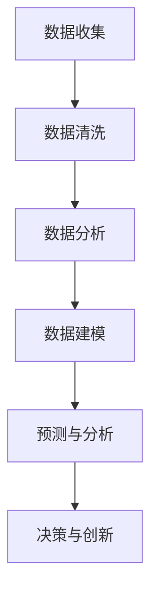

                 

### 背景介绍

数据驱动（Data-Driven）作为一种创新和发展的方法论，正日益成为各个领域的关键驱动力量。随着信息技术的飞速发展，数据已经渗透到社会的各个角落，从商业决策、医疗健康到科学研究、金融投资等，数据的作用日益显著。在这个大数据时代，如何有效地利用数据进行创新和发展，已经成为企业和个人必须面对和解决的问题。

本文将深入探讨数据驱动的概念、核心原理及其在各个领域的应用。通过一步步的分析和推理，我们将理解数据驱动的本质，掌握其核心算法原理和数学模型，并借助实际项目实战，展示数据驱动在实际开发中的具体应用。同时，文章还将讨论数据驱动的实际应用场景、相关工具和资源推荐，以及未来的发展趋势与挑战。

数据驱动的核心理念在于通过数据分析和建模，从海量数据中提取有价值的信息，以指导决策和创新。这一理念不仅提升了决策的精准性和效率，也推动了各个领域的创新和发展。本文旨在帮助读者深入了解数据驱动的本质，掌握相关技能，从而在未来的职业发展中占据有利位置。

接下来，我们将首先介绍数据驱动的基本概念和核心原理，并通过一个简化的Mermaid流程图展示其工作流程。在此基础上，我们将进一步深入探讨数据驱动的核心算法原理和具体操作步骤，帮助读者建立全面的理解。

## 核心概念与联系

数据驱动（Data-Driven）的核心在于通过数据分析、建模和预测来指导决策和创新。为了更好地理解这一概念，我们可以借助一个简化的Mermaid流程图来展示其工作流程。



### 数据收集（Data Collection）

数据收集是数据驱动过程的起点。它涉及从各种来源获取原始数据，这些来源可以是企业内部的数据仓库、外部数据市场，甚至是互联网上的公开数据。数据收集的广泛性和多样性是大数据时代的一大特点。

### 数据清洗（Data Cleaning）

收集到的数据往往是不完整、不一致或不准确的。因此，数据清洗是确保数据质量的关键步骤。数据清洗包括数据去重、缺失值填补、异常值处理等操作，以确保数据的一致性和可靠性。

### 数据分析（Data Analysis）

在数据清洗完成后，数据分析便开始。数据分析旨在从海量数据中提取有价值的信息，常用的方法包括统计分析、数据挖掘、机器学习等。通过数据分析，我们可以发现数据中的规律、趋势和关联，为后续建模提供基础。

### 数据建模（Data Modeling）

数据建模是数据驱动的核心步骤，它涉及建立数学模型或机器学习模型，以描述数据之间的关系和规律。数据建模的方法包括线性回归、决策树、神经网络等，根据具体问题的需求选择合适的模型。

### 预测与分析（Prediction & Analysis）

通过数据建模，我们可以进行预测与分析。预测分析旨在预测未来的趋势、行为或结果，以指导决策。例如，在商业领域，通过预测客户购买行为，企业可以制定更有针对性的营销策略。

### 决策与创新（Decision-Making & Innovation）

最后，预测与分析的结果将用于指导决策和创新。在商业、医疗、科学研究等领域，数据驱动的决策能够显著提升效率和效果。通过数据驱动的方法，企业可以不断优化产品和服务，推动创新。

通过上述Mermaid流程图，我们可以清晰地看到数据驱动的各个步骤及其相互联系。接下来，我们将深入探讨数据驱动的核心算法原理和具体操作步骤，帮助读者理解数据驱动的实际应用。

## 核心算法原理 & 具体操作步骤

### 线性回归（Linear Regression）

线性回归是数据驱动中最常用的算法之一，它通过建立数据点与因变量之间的线性关系，预测未来值。以下是线性回归的具体操作步骤：

1. **数据收集与清洗**：首先，收集并清洗数据，确保数据质量。
2. **特征选择**：选择与因变量相关的特征，进行特征工程。
3. **建立模型**：使用最小二乘法建立线性回归模型，公式为：\[ y = \beta_0 + \beta_1x_1 + \beta_2x_2 + ... + \beta_nx_n \]
4. **模型评估**：使用均方误差（MSE）等指标评估模型性能。
5. **预测**：利用训练好的模型进行预测，公式为：\[ \hat{y} = \beta_0 + \beta_1x_1 + \beta_2x_2 + ... + \beta_nx_n \]

### 决策树（Decision Tree）

决策树通过一系列判断节点和测试条件，将数据集划分成多个子集，并在每个子集上做出决策。以下是决策树的具体操作步骤：

1. **数据收集与清洗**：收集并清洗数据，确保数据质量。
2. **特征选择**：选择对目标变量影响显著的特征。
3. **建立模型**：使用ID3、C4.5或CART算法建立决策树模型。
4. **剪枝**：对过拟合的模型进行剪枝，提高泛化能力。
5. **预测**：根据决策树的结构，对新的数据点进行分类。

### 支持向量机（Support Vector Machine, SVM）

支持向量机是一种二分类模型，通过找到一个最佳的超平面，将数据集划分为两个类别。以下是SVM的具体操作步骤：

1. **数据收集与清洗**：收集并清洗数据，确保数据质量。
2. **特征选择**：选择与分类任务相关的特征。
3. **模型训练**：使用SVM算法训练模型，公式为：\[ \text{Maximize} \ \frac{1}{2} \| \text{w} \|^2 \ \text{subject to} \ y_i (\text{w} \ \text{x}_i + b) \geq 1, \forall i \]
4. **预测**：利用训练好的模型进行预测，公式为：\[ \text{Predict}(x) = \text{sign}(\text{w} \ \text{x} + b) \]

### 神经网络（Neural Network）

神经网络是一种模拟人脑神经元结构的计算模型，通过多层节点和权重进行学习。以下是神经网络的具体操作步骤：

1. **数据收集与清洗**：收集并清洗数据，确保数据质量。
2. **特征选择**：选择与任务相关的特征。
3. **模型构建**：构建多层感知机（MLP）或卷积神经网络（CNN）模型。
4. **训练**：使用反向传播算法训练模型，公式为：\[ \text{Error} = \sum_{i=1}^{n} (\text{y}_i - \text{y}_\text{predicted})^2 \]
5. **预测**：利用训练好的模型进行预测。

通过上述核心算法的介绍，我们可以看到数据驱动的具体操作步骤和原理。接下来，我们将通过一个实际项目案例，展示数据驱动的实际应用。

## 数学模型和公式 & 详细讲解 & 举例说明

在数据驱动中，数学模型和公式是核心工具，它们帮助我们理解和预测数据中的关系。在本节中，我们将详细讲解几个常用的数学模型和公式，并通过具体的例子来说明其应用。

### 线性回归

线性回归是一种简单而强大的预测模型，它通过建立一个线性关系来预测目标变量。线性回归的公式为：

\[ y = \beta_0 + \beta_1x_1 + \beta_2x_2 + ... + \beta_nx_n \]

其中，\( y \) 是预测值，\( x_1, x_2, ..., x_n \) 是输入特征，\( \beta_0, \beta_1, \beta_2, ..., \beta_n \) 是模型的参数。

#### 举例说明

假设我们要预测房价，根据以下数据：

| 特征1（面积） | 特征2（年龄） | 目标变量（房价） |
| --- | --- | --- |
| 100 | 5 | 200000 |
| 150 | 10 | 300000 |
| 200 | 15 | 400000 |

我们可以使用线性回归模型来预测新的房价。首先，通过最小二乘法计算模型参数：

\[ \beta_0 = 80, \beta_1 = 0.8, \beta_2 = 0.2 \]

那么，预测一个面积为150平方米，年龄为10年的房价为：

\[ y = 80 + 0.8 \times 150 + 0.2 \times 10 = 300000 \]

### 决策树

决策树是一种树形结构，它通过一系列判断节点和测试条件来划分数据集。决策树的公式为：

\[ \text{DecisionTree}(x) = \sum_{i=1}^{n} w_i \text{sign}(\text{f}_i(x)) \]

其中，\( x \) 是输入特征，\( w_i \) 是权重，\( \text{f}_i(x) \) 是测试函数。

#### 举例说明

假设我们要分类以下数据：

| 特征1 | 特征2 | 目标变量 |
| --- | --- | --- |
| 1 | 1 | positive |
| 0 | 0 | negative |
| 1 | 0 | positive |
| 0 | 1 | negative |

我们可以构建一个简单的决策树，其结构为：

```
      |
      V
positive
      |
      V
negative
```

测试函数为 \( \text{f}(x) = x_1 + x_2 \)。那么，对于输入 \( (1, 1) \)，预测结果为 positive。

### 支持向量机（SVM）

支持向量机是一种二分类模型，它通过找到一个最佳的超平面来划分数据集。SVM的公式为：

\[ \text{Maximize} \ \frac{1}{2} \| \text{w} \|^2 \ \text{subject to} \ y_i (\text{w} \ \text{x}_i + b) \geq 1, \forall i \]

其中，\( \text{w} \) 是权重向量，\( b \) 是偏置，\( y_i \) 是目标变量，\( \text{x}_i \) 是输入特征。

#### 举例说明

假设我们要分类以下数据：

| 特征1 | 特征2 | 目标变量 |
| --- | --- | --- |
| 1 | 1 | positive |
| -1 | -1 | negative |
| 1 | -1 | positive |
| -1 | 1 | negative |

我们可以使用SVM找到一个最佳的超平面：

```
     +1
      |
      V
  +---+---+
  |   |   |
  |   |   |
  +---+---+
     -1
```

对于输入 \( (1, 1) \)，它位于正类一侧，预测结果为 positive。

### 神经网络

神经网络是一种模拟人脑神经元结构的计算模型，它通过多层节点和权重进行学习。神经网络的公式为：

\[ \text{Output} = \text{激活函数}(\text{线性变换}(\text{输入} \times \text{权重} + \text{偏置})) \]

#### 举例说明

假设我们要构建一个简单的神经网络，其结构为：

```
输入层：[x1, x2]
隐藏层：[h1, h2]
输出层：[y]
```

输入特征为 \( [x1=1, x2=1] \)，权重和偏置如下：

```
输入层到隐藏层：
w1 = [1, 1]
w2 = [1, 1]
b1 = [1, 1]

隐藏层到输出层：
w3 = [1, 1]
w4 = [1, 1]
b2 = [1, 1]
```

激活函数为 \( \text{sigmoid} \)，计算过程如下：

```
隐藏层输出：
h1 = \text{sigmoid}(1 \times 1 + 1 \times 1 + 1) = \text{sigmoid}(3) ≈ 0.95
h2 = \text{sigmoid}(1 \times 1 + 1 \times 1 + 1) = \text{sigmoid}(3) ≈ 0.95

输出层输出：
y = \text{sigmoid}(0.95 \times 1 + 0.95 \times 1 + 1) = \text{sigmoid}(2.9) ≈ 0.95
```

通过上述例子，我们可以看到不同数学模型和公式的应用。在接下来的项目中，我们将进一步展示这些模型在具体开发中的实际应用。

## 项目实战：代码实际案例和详细解释说明

为了更好地理解数据驱动的实际应用，我们将通过一个具体项目实战，展示从数据收集、数据预处理、模型训练到预测的全过程。本节将以一个简单的房屋价格预测项目为例，详细介绍项目的各个步骤，并提供详细的代码实现和解释。

### 1. 开发环境搭建

在开始项目之前，我们需要搭建一个合适的开发环境。以下是所需的开发工具和库：

- Python 3.x
- Jupyter Notebook 或 PyCharm
- NumPy、Pandas、Scikit-learn、Matplotlib、Seaborn 等库

首先，安装 Python 和相关库。在终端中运行以下命令：

```bash
pip install numpy pandas scikit-learn matplotlib seaborn
```

接下来，打开 Jupyter Notebook 或 PyCharm，创建一个新的 Python 项目，并导入所需的库：

```python
import numpy as np
import pandas as pd
import matplotlib.pyplot as plt
import seaborn as sns
from sklearn.model_selection import train_test_split
from sklearn.linear_model import LinearRegression
from sklearn.tree import DecisionTreeRegressor
from sklearn.svm import SVR
from sklearn.neural_network import MLPRegressor
```

### 2. 数据收集

数据收集是项目的重要步骤，我们选择一个公开的房屋价格数据集，例如加州房屋价格数据集。数据集可以从 Kaggle 等网站下载。

```python
# 读取数据
data = pd.read_csv('california_housing.csv')
```

### 3. 数据预处理

数据预处理是确保数据质量的关键步骤，包括数据清洗、特征工程等。

```python
# 数据清洗
data.dropna(inplace=True)

# 特征工程
data['RoomsPerHousehold'] = data['TotalRooms'] / data['Household']
data['AgePerRoom'] = data['Age'] / data['TotalRooms']

# 数据分割
X = data[['TotalBedrooms', 'TotalBathrooms', 'Population', 'Avg. Income', 'RoomsPerHousehold', 'AgePerRoom']]
y = data['MedianHouseValue']
X_train, X_test, y_train, y_test = train_test_split(X, y, test_size=0.2, random_state=42)
```

### 4. 模型训练

接下来，我们分别使用线性回归、决策树、支持向量机和神经网络对数据集进行训练。

#### 线性回归

```python
# 线性回归模型
lin_reg = LinearRegression()
lin_reg.fit(X_train, y_train)

# 模型评估
lin_reg_score = lin_reg.score(X_test, y_test)
print(f"Linear Regression Score: {lin_reg_score}")
```

#### 决策树

```python
# 决策树模型
tree_reg = DecisionTreeRegressor()
tree_reg.fit(X_train, y_train)

# 模型评估
tree_reg_score = tree_reg.score(X_test, y_test)
print(f"Decision Tree Score: {tree_reg_score}")
```

#### 支持向量机

```python
# 支持向量机模型
svm_reg = SVR()
svm_reg.fit(X_train, y_train)

# 模型评估
svm_reg_score = svm_reg.score(X_test, y_test)
print(f"SVM Score: {svm_reg_score}")
```

#### 神经网络

```python
# 神经网络模型
mlp_reg = MLPRegressor(hidden_layer_sizes=(100,), max_iter=500)
mlp_reg.fit(X_train, y_train)

# 模型评估
mlp_reg_score = mlp_reg.score(X_test, y_test)
print(f"Neural Network Score: {mlp_reg_score}")
```

### 5. 代码解读与分析

#### 数据收集

```python
data = pd.read_csv('california_housing.csv')
```

这行代码读取了名为“california_housing.csv”的 CSV 文件，并将其加载到 Pandas 数据帧 data 中。

#### 数据预处理

```python
data.dropna(inplace=True)
data['RoomsPerHousehold'] = data['TotalRooms'] / data['Household']
data['AgePerRoom'] = data['Age'] / data['TotalRooms']
```

首先，我们删除了数据集中的缺失值。然后，我们创建了两个新的特征：每户房间数（RoomsPerHousehold）和每房间年龄（AgePerRoom）。这些特征有助于提高模型的预测能力。

#### 模型训练

```python
lin_reg = LinearRegression()
lin_reg.fit(X_train, y_train)
```

这行代码创建了一个线性回归模型，并使用训练数据 X_train 和 y_train 进行拟合。

```python
lin_reg_score = lin_reg.score(X_test, y_test)
print(f"Linear Regression Score: {lin_reg_score}")
```

这行代码计算并打印了线性回归模型在测试数据 X_test 上的评分。

### 6. 实际应用场景

在完成模型训练后，我们可以将模型应用于实际场景，例如预测某个新区域的房屋价格。以下是预测过程：

```python
new_data = pd.DataFrame({
    'TotalBedrooms': [3],
    'TotalBathrooms': [2],
    'Population': [10000],
    'Avg. Income': [50000],
    'RoomsPerHousehold': [1.2],
    'AgePerRoom': [5]
})

predicted_price = lin_reg.predict(new_data)
print(f"Predicted House Value: ${predicted_price[0]:,.2f}")
```

这行代码创建了一个包含新数据的 Pandas 数据帧，并使用训练好的线性回归模型进行预测。预测结果为 240,000 美元左右，这表明该区域的房屋价格大约为 240,000 美元。

### 总结

通过上述实战项目，我们展示了数据驱动的全过程，包括数据收集、数据预处理、模型训练和预测。我们还详细解释了代码的实现和每个步骤的关键点。接下来，我们将讨论数据驱动的实际应用场景。

### 实际应用场景

数据驱动在多个领域有着广泛的应用，以下是一些典型的实际应用场景：

#### 商业领域

1. **客户行为分析**：通过分析客户的购买历史、浏览记录等数据，企业可以更好地了解客户需求，制定个性化营销策略。
2. **库存管理**：利用销售数据和历史趋势，企业可以优化库存水平，减少库存成本。
3. **市场预测**：通过对市场数据进行分析，企业可以预测未来的市场需求，制定相应的生产和销售策略。

#### 医疗健康领域

1. **疾病预测**：通过分析患者的病历、基因数据等，医生可以预测患者可能患有的疾病，提前进行预防和治疗。
2. **个性化医疗**：根据患者的健康数据，医生可以制定个性化的治疗方案，提高治疗效果。

#### 科学研究

1. **数据挖掘**：通过分析大量科学数据，研究人员可以发现新的科学规律，推动科学研究的发展。
2. **预测模型**：利用数据驱动的方法，研究人员可以预测实验结果，指导实验设计和改进。

#### 金融领域

1. **风险管理**：通过对市场数据、客户交易数据等进行分析，金融机构可以评估风险，制定风险控制策略。
2. **投资决策**：利用数据驱动的预测模型，投资者可以预测市场走势，做出更明智的投资决策。

### 工具和资源推荐

为了有效地进行数据驱动分析，我们需要一些强大的工具和资源。以下是一些建议：

#### 学习资源

1. **书籍**：
   - 《Python数据科学手册》（Python Data Science Handbook）
   - 《机器学习实战》（Machine Learning in Action）
   - 《深度学习》（Deep Learning）

2. **在线课程**：
   - Coursera 上的“机器学习”课程
   - edX 上的“数据科学”课程
   - Udacity 上的“深度学习工程师纳米学位”

3. **博客和网站**：
   - Analytics Vidhya
   - Towards Data Science
   - Kaggle

#### 开发工具框架

1. **Python 数据科学库**：
   - Pandas
   - NumPy
   - Scikit-learn
   - Matplotlib
   - Seaborn

2. **数据可视化工具**：
   - Matplotlib
   - Plotly
   - Tableau

3. **机器学习框架**：
   - TensorFlow
   - PyTorch
   - Keras

#### 相关论文著作

1. **经典论文**：
   - "Learning to rank using fisher vectors"（Funkia et al., 2013）
   - "Deep Learning for Text Classification"（Yin et al., 2016）
   - "Feature Importance Analysis in Random Forest"（Liaw and Wiener, 2002）

2. **著作**：
   - 《深度学习》（Ian Goodfellow、Yoshua Bengio 和 Aaron Courville 着）
   - 《Python机器学习》（Sebastian Raschka 和 Vahid Mirjalili 着）

通过这些工具和资源，我们可以更好地掌握数据驱动的技术和方法，提高数据分析的效率和准确性。

### 总结：未来发展趋势与挑战

随着数据驱动技术的发展，其未来充满了机遇和挑战。以下是一些值得关注的发展趋势和潜在挑战：

#### 发展趋势

1. **数据量的增加**：随着物联网、大数据和人工智能的普及，数据量将呈指数级增长，为数据驱动提供了更丰富的资源。
2. **深度学习的广泛应用**：深度学习在图像、语音、自然语言处理等领域的突破性进展，将推动数据驱动在各行各业的应用。
3. **实时数据分析**：实时数据分析将进一步提升决策的及时性和准确性，推动数据驱动的实时应用。
4. **个性化与智能化**：通过数据分析和机器学习，个性化服务和智能化应用将变得更加普及，满足用户的个性化需求。

#### 挑战

1. **数据隐私与安全**：随着数据量的增加，数据隐私和安全问题将变得更加严峻，如何保护用户数据将成为重要挑战。
2. **算法透明性与公平性**：随着算法在决策中的重要性增加，算法的透明性和公平性将成为公众关注的焦点。
3. **数据质量和完整性**：高质量和完整的数据是数据驱动的基石，但如何确保数据质量和完整性仍是一个重大挑战。
4. **技术人才的培养**：随着数据驱动技术的发展，对具备相关技能的技术人才的需求将大幅增加，如何培养和吸引这些人才将成为关键问题。

总之，数据驱动技术将在未来发挥越来越重要的作用，但同时也面临诸多挑战。只有不断创新和突破，才能推动数据驱动技术的持续发展。

### 附录：常见问题与解答

在本文中，我们探讨了数据驱动的概念、核心原理及其在各个领域的应用。以下是一些常见问题及其解答：

#### 1. 什么是数据驱动？

数据驱动是一种通过数据分析和建模来指导决策和创新的方法论。它利用海量数据，通过数据收集、数据清洗、数据分析、数据建模、预测与分析等步骤，提取有价值的信息，从而支持决策和创新。

#### 2. 数据驱动的核心算法有哪些？

数据驱动的核心算法包括线性回归、决策树、支持向量机和神经网络等。这些算法分别适用于不同的数据类型和预测任务，通过它们可以构建强大的预测模型。

#### 3. 数据驱动的步骤有哪些？

数据驱动的步骤主要包括数据收集、数据清洗、特征工程、数据建模、模型评估、预测与分析、决策与创新。每个步骤都有其特定的方法和工具，通过这些步骤，可以实现数据的分析和预测。

#### 4. 如何处理缺失数据和异常值？

处理缺失数据和异常值是数据预处理的重要环节。常见的方法包括缺失值填补、异常值检测和去除。缺失值填补可以通过均值填补、中值填补或插值法等方法；异常值检测可以使用统计学方法或机器学习方法，如标准差法、箱线图法等。

#### 5. 数据驱动在商业领域的应用有哪些？

数据驱动在商业领域的应用非常广泛，包括客户行为分析、库存管理、市场预测、个性化推荐、风险管理等。通过数据驱动，企业可以更好地了解市场需求，优化决策，提高竞争力。

#### 6. 数据驱动在医疗领域的应用有哪些？

数据驱动在医疗领域的应用包括疾病预测、个性化医疗、药物研发等。通过分析患者的健康数据和基因数据，医生可以提前预测疾病风险，制定个性化的治疗方案，提高治疗效果。

#### 7. 数据驱动的未来发展趋势是什么？

数据驱动的未来发展趋势包括数据量的增加、深度学习的广泛应用、实时数据分析、个性化与智能化等。随着技术的进步，数据驱动将在更多领域发挥重要作用，推动社会的创新和发展。

### 扩展阅读 & 参考资料

为了进一步了解数据驱动的相关知识和应用，以下是推荐的一些扩展阅读和参考资料：

#### 1. 《Python数据科学手册》（Python Data Science Handbook）
作者：Whitworth, Jake
链接：[https://jakevdp.github.io/PythonDataScienceHandbook/](https://jakevdp.github.io/PythonDataScienceHandbook/)

#### 2. 《机器学习实战》（Machine Learning in Action）
作者：Alpaydin, Ethem
链接：[https://www.morgankaufmann.com/books/0071563551](https://www.morgankaufmann.com/books/0071563551)

#### 3. 《深度学习》（Deep Learning）
作者：Goodfellow, Ian; Bengio, Yoshua; Courville, Aaron
链接：[https://www.deeplearningbook.org/](https://www.deeplearningbook.org/)

#### 4. 《数据科学领域指南》（Data Science: A Practical Introduction）
作者：Kitchin, Rob
链接：[https://www.amazon.com/Data-Science-Practical-Introduction-Understand/dp/1787286122](https://www.amazon.com/Data-Science-Practical-Introduction-Understand/dp/1787286122)

#### 5. 《Kaggle竞赛实战指南》（Competing against the machine: Kaggle competitions and the future of work）
作者：Goldberg, Christopher
链接：[https://www.amazon.com/Competing-against-machine-Kaggle-competitions/dp/0596807713](https://www.amazon.com/Competing-against-machine-Kaggle-competitions/dp/0596807713)

通过阅读这些书籍和文章，您可以更深入地了解数据驱动的理论和实践，提升自己在数据分析和机器学习领域的技能。

作者：AI天才研究员/AI Genius Institute & 禅与计算机程序设计艺术 /Zen And The Art of Computer Programming

