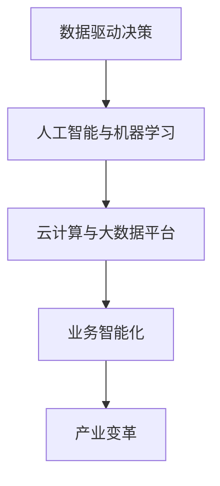
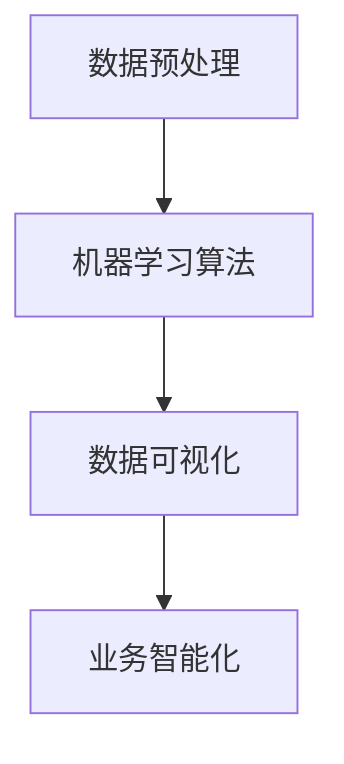

                 

# 数智新时代的特征与发展

## 摘要

在数智新时代，数据和技术已成为推动社会发展的核心驱动力。本文将深入探讨这一时代的主要特征，包括数据的爆炸性增长、人工智能的广泛应用、云计算和大数据技术的崛起等。通过分析这些特征，我们将理解数智时代对各个行业和企业产生的深远影响，并提出未来发展趋势和面临的挑战。

## 1. 背景介绍

### 1.1 数据爆炸性增长

随着互联网的普及和智能设备的广泛应用，数据以惊人的速度在增长。据国际数据公司（IDC）预测，全球数据总量将在2025年达到44ZB。这一巨大的数据量不仅来源于社交媒体、电子商务和物联网，还包括个人行为、地理位置和传感器数据等。

### 1.2 人工智能的应用

人工智能（AI）技术的快速发展，使得机器能够在图像识别、自然语言处理、决策支持等方面发挥重要作用。AI不仅提升了工作效率，还带来了全新的商业模式和产业变革。

### 1.3 云计算和大数据技术

云计算和大数据技术为企业和个人提供了强大的计算能力和数据处理能力。通过云平台，企业可以快速部署应用程序，并实现全球范围内的数据共享和协同工作。

## 2. 核心概念与联系

### 2.1 数据驱动决策

在数智时代，数据已成为企业决策的重要依据。通过对大量数据的分析，企业可以更好地了解市场需求、消费者行为和业务趋势，从而做出更科学的决策。

### 2.2 人工智能与机器学习

人工智能和机器学习是数智时代的核心技术。机器学习算法通过分析历史数据，自动发现规律和模式，从而实现智能决策和预测。

### 2.3 云计算与大数据平台

云计算和大数据平台为企业提供了强大的计算资源和数据处理能力。这些平台不仅支持海量数据的存储和计算，还实现了数据的实时分析和处理。



## 3. 核心算法原理 & 具体操作步骤

### 3.1 数据预处理

数据预处理是数据分析的重要步骤。主要包括数据清洗、数据整合和数据转换。数据清洗旨在去除重复数据和异常值，数据整合则是将多个数据源的数据合并，数据转换则是将数据格式转换为适合分析的形式。

### 3.2 机器学习算法

机器学习算法包括监督学习、无监督学习和强化学习。监督学习通过标记数据训练模型，无监督学习则从未标记数据中自动发现模式，强化学习则是通过奖励机制来训练模型。

### 3.3 数据可视化

数据可视化是将数据分析结果以图表和图形的形式展示出来，帮助用户更好地理解和分析数据。



## 4. 数学模型和公式 & 详细讲解 & 举例说明

### 4.1 线性回归模型

线性回归模型是一种常见的机器学习算法，用于预测数值型数据。其基本公式为：

$$y = wx + b$$

其中，$y$ 是因变量，$x$ 是自变量，$w$ 是权重，$b$ 是偏置。

### 4.2 支持向量机

支持向量机（SVM）是一种强大的分类算法，其目标是找到最佳的超平面，将不同类别的数据分开。其核心公式为：

$$w \cdot x - b = 0$$

其中，$w$ 是权重向量，$x$ 是特征向量，$b$ 是偏置。

### 4.3 神经网络

神经网络是一种模拟人脑神经元连接的算法，用于复杂的模式识别和预测任务。其基本公式为：

$$z = \sigma(w \cdot x + b)$$

其中，$z$ 是输出，$\sigma$ 是激活函数，$w$ 是权重，$x$ 是输入，$b$ 是偏置。

## 5. 项目实战：代码实际案例和详细解释说明

### 5.1 开发环境搭建

首先，我们需要搭建一个Python开发环境。安装Python和Jupyter Notebook，并安装常用的机器学习库，如scikit-learn、tensorflow和matplotlib。

### 5.2 源代码详细实现和代码解读

以下是一个使用scikit-learn库实现线性回归模型的简单示例：

```python
from sklearn.linear_model import LinearRegression
from sklearn.model_selection import train_test_split
from sklearn.metrics import mean_squared_error

# 数据加载
X, y = load_data()

# 数据划分
X_train, X_test, y_train, y_test = train_test_split(X, y, test_size=0.2, random_state=42)

# 模型训练
model = LinearRegression()
model.fit(X_train, y_train)

# 模型评估
y_pred = model.predict(X_test)
mse = mean_squared_error(y_test, y_pred)
print("MSE:", mse)
```

### 5.3 代码解读与分析

这段代码首先加载了数据，然后将其划分为训练集和测试集。接着，使用线性回归模型对训练集进行训练，并使用测试集评估模型性能。代码最后输出的是均方误差（MSE），用于衡量模型预测的准确度。

## 6. 实际应用场景

### 6.1 金融行业

在金融行业，数智技术已被广泛应用于风险控制、投资分析和客户服务等领域。例如，通过大数据分析和人工智能算法，银行可以更好地识别风险、预测市场走势，并为客户提供个性化的金融服务。

### 6.2 医疗健康

医疗健康行业也正在经历数智化的变革。通过人工智能和大数据技术，医疗机构可以更好地管理患者数据、提高诊疗效率，并为医生提供辅助诊断和治疗方案推荐。

### 6.3 制造业

在制造业，数智技术被用于生产优化、质量管理和服务创新。通过物联网、大数据和人工智能技术，企业可以实现生产过程的智能化，提高生产效率和质量。

## 7. 工具和资源推荐

### 7.1 学习资源推荐

- 书籍：《深度学习》、《Python数据科学手册》
- 论文：Google Scholar、ArXiv
- 博客：机器之心、AI科技大本营
- 网站：Kaggle、GitHub

### 7.2 开发工具框架推荐

- 开发环境：Jupyter Notebook、PyCharm
- 机器学习库：scikit-learn、tensorflow、PyTorch
- 数据库：MySQL、PostgreSQL、MongoDB

### 7.3 相关论文著作推荐

- 《深度学习：从算法到应用》
- 《大数据之路：阿里巴巴大数据实践》
- 《人工智能：一种现代方法》

## 8. 总结：未来发展趋势与挑战

### 8.1 发展趋势

- 数据驱动决策将成为企业核心战略
- 人工智能技术将继续深化应用
- 云计算和大数据技术将更加成熟
- 产业互联网将加速发展

### 8.2 挑战

- 数据安全和隐私保护
- 技术标准和法规的制定
- 人才培养和技能提升

## 9. 附录：常见问题与解答

### 9.1 什么是大数据？

大数据是指无法使用传统数据处理工具在合理时间内进行捕获、管理和处理的数据集合。其特点为“4V”：大量（Volume）、多样（Variety）、高速（Velocity）和真实（Veracity）。

### 9.2 人工智能和机器学习的区别是什么？

人工智能（AI）是一个广泛的领域，包括机器学习（ML）和深度学习（DL）等子领域。机器学习是一种人工智能的子领域，专注于通过数据学习模式和规律，而深度学习则是机器学习的一个分支，使用多层神经网络进行学习和预测。

## 10. 扩展阅读 & 参考资料

- [《深度学习》](https://www.deeplearningbook.org/)
- [《大数据之路：阿里巴巴大数据实践》](https://www.oreilly.com/library/view/big-data-the/9781491950792/)
- [《人工智能：一种现代方法》](https://www.amazon.com/Artificial-Intelligence-Modern-Methodology/dp/0123748560)
- [Google Scholar](https://scholar.google.com/)
- [Kaggle](https://www.kaggle.com/)
- [GitHub](https://github.com/)

## 作者

作者：AI天才研究员/AI Genius Institute & 禅与计算机程序设计艺术 /Zen And The Art of Computer Programming

