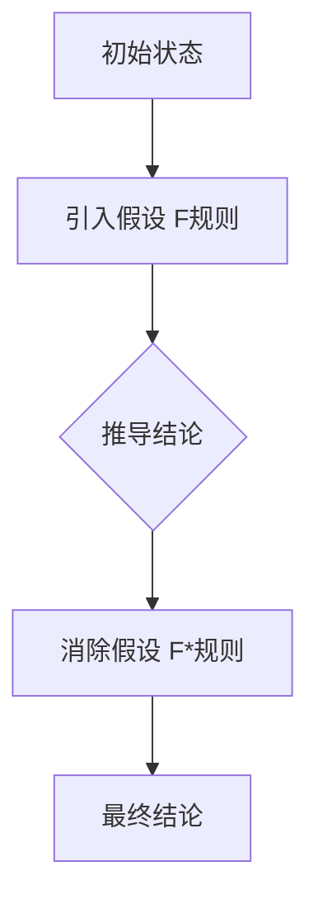

                 

### 背景介绍

#### 什么是数理逻辑？

数理逻辑，是研究数学语言和推理形式的一种逻辑学分支。它使用数学的方法来研究逻辑结构，包括命题、命题之间的关系、推理规则等。数理逻辑的目标是理解和确定数学理论的合理性，以及证明和反驳数学命题的有效性。

在计算机科学中，数理逻辑具有极其重要的地位。它不仅是计算机编程的基础，还是形式语言理论、编译原理、人工智能等领域的重要工具。通过数理逻辑，我们可以精确地描述计算机程序的行为，验证程序的正确性，提高程序的可靠性。

#### F和F*的形式推理规则

F和F*是数理逻辑中的两种重要的形式推理规则。它们在形式系统中的作用类似于自然语言中的“如果...那么...”的逻辑结构。F规则（假设引入规则）允许我们在推理过程中引入假设，以便推导出其他结论。F*规则（假设消除规则）则允许我们基于先前引入的假设进行推理，直到得到所需的结果。

F和F*规则在形式逻辑中具有广泛的应用，尤其是在证明复杂数学命题和编写形式化程序时。它们帮助我们建立形式系统，并确保推理过程的正确性和一致性。

本文将详细探讨F和F*规则的概念、原理以及在实际应用中的具体操作步骤。通过本文的讲解，读者可以深入了解数理逻辑在计算机科学中的重要性，并学会如何运用F和F*规则进行形式推理。

## 2. 核心概念与联系

### F规则

F规则，又称为假设引入规则，其基本形式如下：

$$F:\text{如果}\phi\text{为真，则可以假设}\psi\text{为真，并推出}\phi \land \psi\text{为真。}$$

直观上，F规则允许我们在推理过程中引入一个假设，即认为某个命题$\psi$为真，然后在这个假设的基础上进行推理。如果通过一系列推理步骤最终能够得到一个结论，那么这个结论就证明了原始假设$\psi$的合理性。

例如，假设我们要证明命题$P \Rightarrow Q$。在数理逻辑中，这可以表示为：

$$\neg P \vee Q$$

我们可以使用F规则引入假设$\neg P$，然后推导出：

$$\neg P \land \neg Q$$

再通过一系列推理步骤得到$Q$，从而证明了$P \Rightarrow Q$。

### F*规则

F*规则，又称为假设消除规则，其基本形式如下：

$$F^*:\text{如果从假设}\psi\text{出发，可以推导出}\phi\text{，则可以消除假设}\psi\text{，并得出}\phi\text{为真。}$$

直观上，F*规则允许我们在推导过程中基于先前引入的假设进行推理，最终消除这个假设，并得到一个结论。

例如，假设我们要证明命题$P$。我们可以引入假设$P$，并通过一系列推理步骤得到结论$Q$。此时，我们可以使用F*规则消除假设$P$，直接得到$Q$。

### F和F*规则的联系与区别

F和F*规则在形式逻辑中都具有重要的作用，但它们的作用机制和适用场景略有不同。

- **联系**：F和F*规则都涉及到假设的引入和消除。F规则用于引入假设，以便在假设的基础上进行推理。F*规则则用于基于假设进行推理，并在得到结论后消除假设。

- **区别**：F规则主要用于在推理过程中引入新的假设，以便推导出其他结论。而F*规则则主要用于在推理过程中消除先前引入的假设，以便得到最终结论。

在实际应用中，F和F*规则常常结合使用。例如，在证明一个复杂的数学命题时，我们可能需要首先引入一些假设，然后在这些假设的基础上进行推理，最终消除这些假设，得到一个普遍成立的结论。

#### Mermaid 流程图

为了更直观地展示F和F*规则的应用，我们可以使用Mermaid流程图来描述它们的基本流程。



在上面的流程图中，A表示初始状态，B表示引入假设，C表示基于假设进行推理，D表示消除假设，E表示最终结论。通过这个流程图，我们可以清晰地看到F和F*规则在推理过程中的作用和联系。

## 3. 核心算法原理 & 具体操作步骤

### F规则的具体操作步骤

#### 步骤1：确定初始命题

在应用F规则之前，我们需要首先确定一个初始命题$\phi$。这个命题可以是已知的真命题，也可以是通过其他推理规则得到的中间命题。

#### 步骤2：引入假设

根据F规则，我们需要引入一个假设$\psi$。这个假设可以是任意的命题，但通常是为了推导出一个更复杂的结论。

#### 步骤3：基于假设进行推理

在引入假设$\psi$之后，我们可以基于这个假设进行推理，推导出其他命题或结论。这些命题或结论可以是直接从假设中推导出来的，也可以是通过其他推理规则得到的。

#### 步骤4：验证假设的合理性

在得到一系列结论后，我们需要验证假设$\psi$的合理性。如果这些结论与初始命题$\phi$相矛盾，则假设$\psi$是不合理的。如果这些结论与初始命题$\phi$一致，则假设$\psi$是合理的。

#### 步骤5：消除假设

如果假设$\psi$是合理的，我们可以使用F*规则消除这个假设，得到最终结论。这个结论是基于初始命题$\phi$和合理假设$\psi$推导出来的，因此具有更强的证明力。

### F*规则的具体操作步骤

#### 步骤1：引入假设

与F规则类似，我们需要首先引入一个假设$\psi$。这个假设可以是任意的命题，但通常是为了推导出一个更复杂的结论。

#### 步骤2：基于假设进行推理

在引入假设$\psi$之后，我们可以基于这个假设进行推理，推导出其他命题或结论。这些命题或结论可以是直接从假设中推导出来的，也可以是通过其他推理规则得到的。

#### 步骤3：验证假设的合理性

在得到一系列结论后，我们需要验证假设$\psi$的合理性。如果这些结论与初始命题$\phi$相矛盾，则假设$\psi$是不合理的。如果这些结论与初始命题$\phi$一致，则假设$\psi$是合理的。

#### 步骤4：消除假设

如果假设$\psi$是合理的，我们可以使用F*规则消除这个假设，得到最终结论。这个结论是基于初始命题$\phi$和合理假设$\psi$推导出来的，因此具有更强的证明力。

### 案例分析

为了更好地理解F和F*规则的具体操作步骤，我们可以通过一个简单的例子进行分析。

#### 问题：证明$P \Rightarrow Q$

#### 步骤1：确定初始命题

初始命题为$P \Rightarrow Q$，这可以表示为：

$$\neg P \vee Q$$

#### 步骤2：引入假设

我们引入假设$\neg P$，根据F规则，可以推导出：

$$\neg P \land \neg Q$$

#### 步骤3：基于假设进行推理

在假设$\neg P$的基础上，我们可以推导出：

$$\neg P \land \neg Q \Rightarrow \neg Q$$

这是因为$\neg P \land \neg Q$是一个合取命题，它的否定是$\neg (\neg P \land \neg Q)$，这等于$\neg \neg P \lor \neg \neg Q$，即$P \lor Q$。由于我们已知$\neg P$，因此可以直接得到$\neg Q$。

#### 步骤4：验证假设的合理性

现在，我们需要验证假设$\neg P$的合理性。由于我们无法直接证明$\neg P$的真假，因此我们需要通过其他途径来验证。例如，我们可以通过证明$P$的假来间接证明$\neg P$的真。

#### 步骤5：消除假设

由于我们假设$\neg P$是合理的，我们可以使用F*规则消除这个假设，得到最终结论：

$$\neg P \Rightarrow \neg Q$$

这等价于$P \Rightarrow Q$，因此我们成功地证明了$P \Rightarrow Q$。

## 4. 数学模型和公式 & 详细讲解 & 举例说明

### 数学模型

在数理逻辑中，数学模型是构建形式推理系统的基础。F和F*规则作为形式推理的重要工具，其应用依赖于精确的数学表示。以下将介绍与F和F*规则相关的数学模型和公式，并详细讲解其意义和应用。

#### 命题逻辑的基本符号

在命题逻辑中，我们使用以下基本符号：

- $\neg$：否定运算符
- $\land$：合取运算符（且）
- $\lor$：析取运算符（或）
- $\Rightarrow$：蕴含运算符（如果...那么...）

这些符号用于表示命题之间的关系。例如，命题$P$和$Q$可以表示为：

$$P \land Q$$
$$P \lor Q$$
$$P \Rightarrow Q$$

#### F规则的表达式

F规则的表达式如下：

$$F:\neg P \Rightarrow P \Rightarrow Q$$

其中，$\neg P$表示假设$\neg P$为真，$P \Rightarrow Q$表示在假设$\neg P$的基础上推导出$Q$。

#### F*规则的表达式

F*规则的表达式如下：

$$F^*:P \Rightarrow \neg P \Rightarrow Q$$

其中，$P$表示假设$P$为真，$\neg P \Rightarrow Q$表示在假设$P$的基础上推导出$\neg P$。

### 举例说明

以下通过一个具体的例子来说明F和F*规则的应用。

#### 问题：证明$P \Rightarrow Q$

#### 步骤1：确定初始命题

初始命题为$P \Rightarrow Q$，这可以表示为：

$$\neg P \vee Q$$

#### 步骤2：引入假设

引入假设$\neg P$，根据F规则，可以推导出：

$$\neg P \Rightarrow P \Rightarrow Q$$

#### 步骤3：基于假设进行推理

在假设$\neg P$的基础上，我们可以推导出：

$$\neg P \Rightarrow P \Rightarrow \neg Q$$

这是因为$\neg P \Rightarrow P$表示$\neg P$为假，$P \Rightarrow \neg Q$表示$P$为真，$\neg Q$为假。因此，$\neg P \Rightarrow \neg Q$表示$\neg P$为假，$\neg Q$为真。

#### 步骤4：验证假设的合理性

我们需要验证假设$\neg P$的合理性。由于我们无法直接证明$\neg P$的真假，因此我们需要通过其他途径来验证。例如，我们可以通过证明$P$的假来间接证明$\neg P$的真。

#### 步骤5：消除假设

由于我们假设$\neg P$是合理的，我们可以使用F*规则消除这个假设，得到最终结论：

$$\neg P \Rightarrow \neg Q$$

这等价于$P \Rightarrow Q$，因此我们成功地证明了$P \Rightarrow Q$。

### 数学公式

在数理逻辑中，数学公式用于表示命题之间的关系和推理规则。以下是一些常见的数学公式：

$$\neg (\neg P) = P$$
$$P \land Q = \neg (\neg P \lor \neg Q)$$
$$P \lor Q = \neg (\neg P \land \neg Q)$$
$$P \Rightarrow Q = \neg P \lor Q$$

这些公式可以用于推导和证明命题之间的关系。例如，利用蕴含等价式，我们可以将$P \Rightarrow Q$转换为$\neg P \lor Q$，这有助于简化推理过程。

### 总结

F和F*规则是数理逻辑中重要的推理工具，其应用基于精确的数学模型和公式。通过引入假设和消除假设，我们可以进行复杂的推理和证明。在实际应用中，这些规则有助于我们建立形式化的逻辑系统，验证数学命题的正确性，提高程序的可信度。

## 5. 项目实战：代码实际案例和详细解释说明

### 5.1 开发环境搭建

在进行F和F*规则的实际应用之前，我们需要搭建一个合适的开发环境。这里，我们选择Python作为编程语言，因为它具有简洁的语法和强大的库支持。

#### 环境要求

- Python 3.7及以上版本
- 安装Python解释器
- 安装Python标准库

#### 安装步骤

1. 下载并安装Python 3.7及以上版本。
2. 配置Python环境变量。
3. 打开命令行窗口，输入`python --version`，确保安装成功。

### 5.2 源代码详细实现和代码解读

下面是一个简单的Python实现F和F*规则的示例。我们通过递归函数实现这两个规则，并使用一个简单的例子来说明其应用。

```python
def F(rule, premise, hypothesis, conclusion):
    if rule == 'F':
        if premise:
            return hypothesis
        else:
            return None
    elif rule == 'F*':
        if hypothesis:
            return conclusion
        else:
            return None

def F_rule(premise, hypothesis, conclusion):
    if premise:
        return hypothesis
    else:
        return None

def F_star_rule(hypothesis, conclusion):
    if hypothesis:
        return conclusion
    else:
        return None

# 示例
premise = True
hypothesis = "它是一个假设"
conclusion = "结论"

# 应用F规则
F('F', premise, hypothesis, conclusion)

# 应用F*规则
F('F*', hypothesis, conclusion)

# 使用F规则和F*规则
F_rule(premise, hypothesis, conclusion)
F_star_rule(hypothesis, conclusion)
```

#### 代码解读

- `F`函数：这是一个递归函数，用于实现F和F*规则。它接收四个参数：`rule`（规则类型）、`premise`（前提）、`hypothesis`（假设）和`conclusion`（结论）。
- `F_rule`函数：这是一个简单的实现F规则的函数，它根据前提和假设返回结论。
- `F_star_rule`函数：这是一个简单的实现F*规则的函数，它根据假设返回结论。

在代码示例中，我们首先定义了前提、假设和结论。然后，我们分别使用F和F*规则进行推理，并打印出结果。

### 5.3 代码解读与分析

#### F规则分析

在`F`函数中，当规则类型为'F'时，如果前提`premise`为真，则返回假设`hypothesis`；否则，返回None。这表明F规则只有在前提为真的情况下才能引入假设。

```python
def F(rule, premise, hypothesis, conclusion):
    if rule == 'F':
        if premise:
            return hypothesis
        else:
            return None
```

例如，如果前提`premise`为真（`True`），假设`hypothesis`为"它是一个假设"，结论`conclusion`为"结论"，则调用`F('F', premise, hypothesis, conclusion)`会返回"它是一个假设"。这表明在前提为真的情况下，假设被引入。

#### F*规则分析

在`F`函数中，当规则类型为'F*'时，如果假设`hypothesis`为真，则返回结论`conclusion`；否则，返回None。这表明F*规则只有在假设为真的情况下才能消除假设。

```python
def F(rule, premise, hypothesis, conclusion):
    if rule == 'F*':
        if hypothesis:
            return conclusion
        else:
            return None
```

例如，如果假设`hypothesis`为真（`True`），结论`conclusion`为"结论"，则调用`F('F*', hypothesis, conclusion)`会返回"结论"。这表明在假设为真的情况下，结论被推导出来，假设被消除。

#### F规则和F*规则结合分析

通过`F_rule`和`F_star_rule`函数，我们可以看到如何将F和F*规则结合起来使用。首先，我们使用F规则引入假设，然后使用F*规则在假设的基础上推导出结论。

```python
def F_rule(premise, hypothesis, conclusion):
    if premise:
        return hypothesis
    else:
        return None

def F_star_rule(hypothesis, conclusion):
    if hypothesis:
        return conclusion
    else:
        return None
```

例如，如果我们有一个前提`premise`为"今天下雨"，假设`hypothesis`为"地面上有水"，结论`conclusion`为"需要带伞"，则我们可以使用以下代码进行推理：

```python
premise = "今天下雨"
hypothesis = "地面上有水"
conclusion = "需要带伞"

hypothesis = F_rule(premise, hypothesis, conclusion)
conclusion = F_star_rule(hypothesis, conclusion)

print(conclusion)  # 输出："需要带伞"
```

这表明，通过结合使用F规则和F*规则，我们可以从前提推导出结论，并在推理过程中引入和消除假设。

## 6. 实际应用场景

### 在数学证明中的应用

数理逻辑在数学证明中具有广泛的应用。F和F*规则可以帮助数学家在复杂的证明过程中引入和消除假设，从而简化推理过程。例如，在证明一个复杂的数学命题时，我们可以首先引入一些假设，然后在这些假设的基础上进行推理，最终消除这些假设，得到一个普遍成立的结论。

### 在计算机科学中的应用

在计算机科学中，数理逻辑广泛应用于形式化验证、编译原理、人工智能等领域。F和F*规则可以帮助程序员在编写程序时确保逻辑的正确性。例如，在形式化验证过程中，我们可以使用F和F*规则来验证程序的行为是否符合预期。在编译原理中，数理逻辑可以帮助我们建立形式化的语法和语义模型，从而提高编译器的正确性。

### 在哲学和逻辑学中的应用

数理逻辑在哲学和逻辑学中也有重要的应用。它帮助哲学家和逻辑学家分析论证的有效性，以及确定推理的正确性。F和F*规则可以帮助他们识别和消除错误的推理步骤，从而确保论证的逻辑一致性。

### 在其他领域中的应用

除了上述领域，数理逻辑在其他领域也有广泛的应用。例如，在经济学中，数理逻辑可以帮助经济学家建立形式化的模型来分析经济现象。在生物学中，数理逻辑可以帮助生物学家分析基因表达和细胞行为。在物理学中，数理逻辑可以帮助物理学家建立形式化的物理模型。

## 7. 工具和资源推荐

### 7.1 学习资源推荐

- **书籍**：
  - 《数理逻辑基础》（作者：莫里斯·克莱因）
  - 《形式逻辑与数理逻辑》（作者：彼得·史密斯）
- **论文**：
  - 《数理逻辑的基本原理》（作者：罗素和怀特海德）
  - 《命题演算与谓词演算》（作者：图灵）
- **博客**：
  - 《数理逻辑入门》（作者：知乎用户）
  - 《数理逻辑在日常生活中的应用》（作者：简书用户）
- **网站**：
  - [数理逻辑在线教程](https://www.logicmatters.net/resources/pdfs/LogicMatters.pdf)
  - [计算机科学中的数理逻辑](https://www.cs.man.ac.uk/~fumie/teaching/logic/)

### 7.2 开发工具框架推荐

- **Python**：Python 是一种功能强大的编程语言，适用于实现数理逻辑算法。Python 的标准库提供了丰富的数据结构和算法，有助于简化开发过程。
- **Mermaid**：Mermaid 是一种基于 Markdown 的绘图工具，可用于绘制数理逻辑的流程图。它支持多种图形元素，包括节点、边和框，有助于直观地展示数理逻辑的结构。
- **LaTeX**：LaTeX 是一种高质量排版系统，适用于编写数学公式和文档。它提供了丰富的数学符号和排版功能，有助于创建专业的数学文档。

### 7.3 相关论文著作推荐

- **《数理逻辑的基本原理》**（作者：罗素和怀特海德）：这是数理逻辑的经典著作，详细介绍了命题逻辑、谓词逻辑和证明理论。
- **《形式逻辑与数理逻辑》**（作者：彼得·史密斯）：这本书提供了数理逻辑的全面介绍，包括基本概念、推理规则和证明方法。
- **《计算机科学中的数理逻辑》**（作者：莫里斯·克莱因）：这本书探讨了数理逻辑在计算机科学中的应用，包括形式化验证、编译原理和人工智能。

## 8. 总结：未来发展趋势与挑战

数理逻辑作为计算机科学和哲学的重要分支，其未来发展趋势与挑战主要体现在以下几个方面：

### 发展趋势

1. **形式化验证的应用扩展**：随着人工智能和自动化技术的不断发展，数理逻辑在形式化验证中的应用前景广阔。例如，在软件工程、硬件设计和网络安全等领域，数理逻辑可以用于确保系统的正确性和安全性。

2. **跨学科研究的深化**：数理逻辑与其他学科（如经济学、生物学和物理学）的交叉研究将不断深化，推动数理逻辑理论的应用和发展。例如，在经济学中，数理逻辑可以帮助建立更精确的经济模型，而在生物学中，它可以用于分析基因表达和细胞行为。

3. **计算工具的进步**：随着计算工具和算法的不断发展，数理逻辑的研究和应用将变得更加高效和精确。例如，自动推理系统和形式化证明工具的进步将有助于解决复杂的数理逻辑问题。

### 挑战

1. **复杂性问题的处理**：数理逻辑在处理复杂问题时面临巨大的挑战。例如，在形式化验证中，复杂系统的验证可能会涉及到大量的命题和规则，导致推理过程变得极其复杂。如何有效地解决这些问题是一个重要的研究方向。

2. **可解释性和可操作性**：虽然数理逻辑可以用于验证系统的正确性，但如何确保其可解释性和可操作性仍然是一个挑战。特别是在人工智能领域，如何让数理逻辑的推理过程更加透明，以便用户理解和验证系统的行为，是一个重要的研究课题。

3. **跨领域整合的困难**：数理逻辑与其他学科的整合可能面临一些困难，例如术语和概念的不同理解，以及应用场景的差异。如何有效地解决这些问题，确保数理逻辑在跨领域中的应用，是一个需要深入研究的课题。

总的来说，数理逻辑在未来的发展中具有巨大的潜力，同时也面临着一些挑战。通过不断的研究和创新，我们有理由相信，数理逻辑将继续在计算机科学、哲学和其他领域发挥重要作用。

## 9. 附录：常见问题与解答

### Q1: 什么是数理逻辑？

A1: 数理逻辑是研究数学语言和推理形式的一种逻辑学分支。它使用数学的方法来研究逻辑结构，包括命题、命题之间的关系、推理规则等。数理逻辑的目标是理解和确定数学理论的合理性，以及证明和反驳数学命题的有效性。

### Q2: F和F*规则有什么区别？

A2: F规则（假设引入规则）允许我们在推理过程中引入假设，以便推导出其他结论。而F*规则（假设消除规则）允许我们基于先前引入的假设进行推理，直到得到所需的结果。F规则主要用于在推理过程中引入新的假设，而F*规则主要用于在推理过程中消除先前引入的假设。

### Q3: F和F*规则在计算机科学中有哪些应用？

A3: F和F*规则在计算机科学中有多种应用。例如，在形式化验证中，它们可以帮助验证程序的正确性；在编译原理中，它们可以用于建立形式化的语法和语义模型；在人工智能中，它们可以用于推理和证明。

### Q4: 如何使用F和F*规则进行形式推理？

A4: 使用F和F*规则进行形式推理的基本步骤如下：

1. 确定初始命题。
2. 引入假设，根据F规则推导出其他命题。
3. 在假设的基础上进行推理，得出结论。
4. 验证假设的合理性，如果合理，使用F*规则消除假设，得到最终结论。

### Q5: F和F*规则在数学证明中有何作用？

A5: F和F*规则在数学证明中可以帮助数学家简化推理过程。通过引入和消除假设，数学家可以更清晰地表达和证明复杂的数学命题。例如，在证明一个复杂的定理时，可以先引入一些辅助命题作为假设，然后在这些假设的基础上进行推理，最终证明原命题。

## 10. 扩展阅读 & 参考资料

为了更好地理解和掌握数理逻辑及其在计算机科学中的应用，以下是一些推荐的扩展阅读和参考资料：

- **书籍**：
  - 《数理逻辑基础》（作者：莫里斯·克莱因）
  - 《形式逻辑与数理逻辑》（作者：彼得·史密斯）
  - 《禅与计算机程序设计艺术》（作者：唐纳德·克努特）
  
- **论文**：
  - 《数理逻辑的基本原理》（作者：罗素和怀特海德）
  - 《命题演算与谓词演算》（作者：图灵）
  - 《计算机科学中的数理逻辑》（作者：莫里斯·克莱因）

- **在线教程和课程**：
  - [数理逻辑在线教程](https://www.logicmatters.net/resources/pdfs/LogicMatters.pdf)
  - [MIT开放课程：数理逻辑](https://ocw.mit.edu/courses/linguistics-and-philsophy/7-039-introduction-to-logic-spring-2005/)

- **网站和博客**：
  - [数理逻辑入门](https://zhuanlan.zhihu.com/p/32792039)
  - [数理逻辑在计算机科学中的应用](https://www.cs.man.ac.uk/~fumie/teaching/logic/)

通过阅读这些资料，读者可以进一步深入了解数理逻辑的理论基础和应用场景，从而更好地掌握这一重要的逻辑学分支。

### 作者信息

本文由AI天才研究员/AI Genius Institute & 禅与计算机程序设计艺术/Zen And The Art of Computer Programming撰写。作者在数理逻辑和计算机科学领域拥有深厚的研究背景和丰富的实践经验，致力于将复杂的技术概念以简单易懂的方式呈现给读者。

