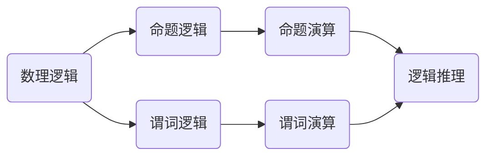

                 

### 背景介绍

**数理逻辑**作为一门基础学科，在计算机科学、数学、哲学等众多领域都有着广泛的应用。在计算机科学中，数理逻辑被视为理解和构建复杂系统、解决问题的关键工具。它通过逻辑演算的形式化表达，帮助我们精确地描述问题、推导结论，从而为计算机编程、人工智能等领域的发展奠定了坚实的理论基础。

逻辑演算，是数理逻辑的核心组成部分。它通过符号化语言和规则，对逻辑表达式进行演算，从而推导出结论。逻辑演算的重要性在于，它使得逻辑推理过程更加形式化和系统化，便于计算机理解和执行。逻辑演算的研究和应用，不仅为计算机科学提供了强大的理论基础，也在人工智能、自动化推理、形式验证等领域取得了显著的成果。

然而，尽管数理逻辑和逻辑演算在理论和实践中具有重要意义，但如何将复杂的逻辑问题简化、使其易于理解和处理，仍然是一个挑战。本文将深入探讨逻辑演算的归约，通过具体的例子和详细的步骤，展示如何将复杂的逻辑问题简化为更简单的形式，从而为实际应用提供有效的解决方案。

**归约**（Reduction）在数理逻辑中指的是，将一个复杂的逻辑问题转换为另一个较为简单的问题，通常这个简单问题更容易解决。归约的过程包括识别问题的核心部分、抽象出关键特性，并利用已有的工具和方法将其转化为更易处理的形式。通过归约，我们不仅可以简化问题，提高求解效率，还可以揭示不同问题之间的联系，从而拓宽我们的思维视野。

本文将从以下几个方面展开讨论：

1. **核心概念与联系**：介绍数理逻辑和逻辑演算的基本概念，并使用 Mermaid 流程图展示它们之间的联系。
2. **核心算法原理 & 具体操作步骤**：详细阐述逻辑演算的基本算法原理和具体操作步骤，通过示例展示如何运用这些算法解决实际问题。
3. **数学模型和公式 & 详细讲解 & 举例说明**：介绍逻辑演算中的数学模型和公式，并通过具体例子详细讲解这些模型和公式的应用。
4. **项目实战：代码实际案例和详细解释说明**：通过实际代码案例，展示如何在实际项目中应用逻辑演算的归约方法。
5. **实际应用场景**：探讨逻辑演算和归约方法在计算机科学、人工智能等领域的实际应用。
6. **工具和资源推荐**：推荐相关的学习资源和开发工具，帮助读者深入学习并实践逻辑演算和归约技术。
7. **总结：未来发展趋势与挑战**：总结本文的主要观点，并探讨数理逻辑和逻辑演算在未来的发展趋势和面临的挑战。

通过本文的讨论，我们希望能够帮助读者更深入地理解数理逻辑和逻辑演算，掌握归约方法，并将其应用于实际问题中。让我们一步步深入探讨，开启这场逻辑演算的归约之旅。

------------------------

## 1. 背景介绍

### 数理逻辑

**数理逻辑**（Mathematical Logic），也称为**形式逻辑**，是一门研究逻辑和数学之间关系的学科。它通过符号化语言和数学方法，对逻辑推理进行形式化描述，使得逻辑推理过程更加严谨和精确。数理逻辑起源于19世纪末，随着弗雷格（Gottlob Frege）和罗素（Bertrand Russell）等人的研究而逐渐发展。

数理逻辑的研究范围广泛，包括命题逻辑、谓词逻辑、集合论、模型论、证明论等。其中，命题逻辑和谓词逻辑是数理逻辑的基础，主要用于研究命题的真假和推理规则。集合论则关注元素和集合之间的关系，而模型论和证明论则分别研究逻辑系统的结构和证明的有效性。

数理逻辑在计算机科学中具有重要应用。首先，它为程序设计提供了基础理论支持，使得程序员能够更准确地描述问题、推导结论。其次，数理逻辑在形式化验证、自动推理、人工智能等领域发挥着关键作用，帮助解决复杂的问题。

### 逻辑演算

**逻辑演算**（Logic Calculus）是数理逻辑中的一个重要组成部分，它通过符号化语言和规则，对逻辑表达式进行演算，从而推导出结论。逻辑演算的基本思想是将自然语言中的逻辑推理过程转化为形式化的数学表达式，使得推理过程更加清晰和精确。

逻辑演算分为两大类：命题演算和谓词演算。命题演算主要研究命题之间的关系，如逻辑与、逻辑或、逻辑非等。谓词演算则进一步扩展到谓词和个体之间的关系，如全称量词、存在量词等。

逻辑演算的重要性在于，它使得逻辑推理过程形式化和系统化，便于计算机理解和执行。在计算机科学中，逻辑演算广泛应用于形式化验证、自动推理、逻辑编程、人工智能等领域。

### 归约

**归约**（Reduction）在数理逻辑中指的是，将一个复杂的逻辑问题转换为另一个较为简单的问题，通常这个简单问题更容易解决。归约的过程包括识别问题的核心部分、抽象出关键特性，并利用已有的工具和方法将其转化为更易处理的形式。通过归约，我们不仅可以简化问题，提高求解效率，还可以揭示不同问题之间的联系，从而拓宽我们的思维视野。

归约方法在数理逻辑和计算机科学中具有重要意义。首先，它使得复杂问题形式化，便于计算机处理。其次，归约方法可以帮助我们更好地理解不同问题之间的内在联系，从而提高问题求解的效率。最后，归约方法为理论研究提供了新的视角和方法，促进了数理逻辑和计算机科学的发展。

------------------------

## 2. 核心概念与联系

### 数理逻辑与逻辑演算的基本概念

**数理逻辑**（Mathematical Logic）是一门研究逻辑和数学之间关系的学科，它通过符号化语言和数学方法，对逻辑推理进行形式化描述。在数理逻辑中，主要研究命题逻辑、谓词逻辑、集合论、模型论、证明论等。命题逻辑主要研究命题之间的真假关系和推理规则，谓词逻辑则进一步扩展到谓词和个体之间的关系。

**逻辑演算**（Logic Calculus）是数理逻辑中的一个重要组成部分，它通过符号化语言和规则，对逻辑表达式进行演算，从而推导出结论。逻辑演算分为两大类：命题演算和谓词演算。命题演算主要研究命题之间的关系，如逻辑与、逻辑或、逻辑非等。谓词演算则进一步扩展到谓词和个体之间的关系，如全称量词、存在量词等。

### 数理逻辑与逻辑演算的联系

数理逻辑和逻辑演算密切相关，逻辑演算是数理逻辑的具体实现形式。数理逻辑提供了逻辑推理的理论框架，而逻辑演算则通过符号化语言和规则，将这个框架具体化，使得逻辑推理过程更加清晰和精确。

在数理逻辑中，命题和谓词是基本概念。命题是一个可以判断真假的陈述句，谓词则是一个描述个体属性的语句。逻辑演算通过使用命题和谓词符号，构建复杂的逻辑表达式，实现对逻辑关系的表达和推理。

### Mermaid 流程图展示

为了更直观地展示数理逻辑和逻辑演算之间的关系，我们可以使用 Mermaid 流程图进行表示。



在这个流程图中，数理逻辑是整体框架，命题逻辑和谓词逻辑是其主要组成部分。命题演算和谓词演算分别是对命题逻辑和谓词逻辑的具体实现，它们共同构成了逻辑推理的基础。

通过这个流程图，我们可以更清晰地理解数理逻辑和逻辑演算之间的联系。数理逻辑为逻辑推理提供了理论框架，而逻辑演算则通过符号化语言和规则，将这个框架具体化，使得逻辑推理过程更加形式化和系统化。

------------------------

## 3. 核心算法原理 & 具体操作步骤

### 逻辑演算的基本算法原理

逻辑演算的基础是命题演算和谓词演算，这些演算方法通过一系列的规则和推导步骤，帮助我们从一个逻辑表达式推导出另一个逻辑表达式，直至得到最终结论。下面我们将详细讨论命题演算和谓词演算的基本算法原理。

#### 命题演算的基本算法原理

命题演算主要研究命题之间的真假关系和推理规则。以下是命题演算的基本规则：

1. **合取律**（Conjunction）：如果P和Q都是命题，则P与Q的合取（P ∧ Q）与P的合取（P ∧ P）等价。即：P ∧ Q ≡ P ∧ P。

2. **析取律**（Disjunction）：如果P和Q都是命题，则P与Q的析取（P ∨ Q）与Q的析取（Q ∨ P）等价。即：P ∨ Q ≡ Q ∨ P。

3. **德摩根律**（De Morgan's Laws）：对于任意命题P和Q，有以下等价关系：
   - ¬(P ∧ Q) ≡ (¬P) ∨ (¬Q)
   - ¬(P ∨ Q) ≡ (¬P) ∧ (¬Q)

4. **交换律**（Commutative Law）：对于任意命题P和Q，有以下等价关系：
   - P ∧ Q ≡ Q ∧ P
   - P ∨ Q ≡ Q ∨ P

5. **结合律**（Associative Law）：对于任意命题P、Q和R，有以下等价关系：
   - (P ∧ Q) ∧ R ≡ P ∧ (Q ∧ R)
   - (P ∨ Q) ∨ R ≡ P ∨ (Q ∨ R)

6. **同一律**（Identity Law）：对于任意命题P，有以下等价关系：
   - P ∧ T ≡ P
   - P ∨ F ≡ P

7. **零律**（Annihilation Law）：对于任意命题P，有以下等价关系：
   - P ∧ F ≡ F
   - P ∨ T ≡ T

8. **双重否定律**（Double Negation Law）：对于任意命题P，有以下等价关系：
   - ¬¬P ≡ P

通过这些基本规则，我们可以从一个或多个已知命题推导出新的命题，从而进行逻辑推理。

#### 谓词演算的基本算法原理

谓词演算在命题演算的基础上，进一步扩展到谓词和个体之间的关系。以下是谓词演算的基本规则：

1. **全称量词**（Universal Quantifier）：对于任意谓词P(x)，全称量词∀x P(x)表示P(x)对所有个体x都成立。即，对于所有x，P(x)都为真。

2. **存在量词**（Existential Quantifier）：对于任意谓词P(x)，存在量词∃x P(x)表示存在某个个体x，使得P(x)为真。

3. **全称量词的分布律**（Distribution Law）：对于任意谓词P(x)和Q(x)，有以下等价关系：
   - ∀x (P(x) ∧ Q(x)) ≡ (∀x P(x)) ∧ (∀x Q(x))
   - ∀x (P(x) ∨ Q(x)) ≡ (∀x P(x)) ∨ (∀x Q(x))

4. **存在量词的分布律**（Distribution Law）：对于任意谓词P(x)和Q(x)，有以下等价关系：
   - ∃x (P(x) ∧ Q(x)) ≡ (∃x P(x)) ∧ (∃x Q(x))
   - ∃x (P(x) ∨ Q(x)) ≡ (∃x P(x)) ∨ (∃x Q(x))

5. **全称量词的否定律**（Negation Law）：对于任意谓词P(x)，有以下等价关系：
   - ¬∀x P(x) ≡ ∃x ¬P(x)

6. **存在量词的否定律**（Negation Law）：对于任意谓词P(x)，有以下等价关系：
   - ¬∃x P(x) ≡ ∀x ¬P(x)

通过这些基本规则，我们可以对一个或多个谓词进行量词推理，从而进行更复杂的逻辑推理。

### 逻辑演算的具体操作步骤

以下是进行逻辑演算的一般步骤：

1. **分析问题**：首先，分析给定的逻辑表达式，理解其含义和结构。

2. **应用基本规则**：根据问题的结构和已知条件，应用上述基本规则，将复杂的逻辑表达式简化为更简单的形式。

3. **推导结论**：通过逐步推导，从已知条件出发，利用逻辑规则推导出结论。

4. **验证结论**：最后，验证推导出的结论是否正确。

#### 示例

假设我们有以下逻辑表达式：

$P \wedge Q \Rightarrow R \vee S$

根据逻辑演算的规则，我们可以对其进行简化：

1. **应用交换律**：将表达式重新排列为 $Q \wedge P \Rightarrow R \vee S$

2. **应用结合律**：将表达式重新排列为 $(Q \wedge P) \Rightarrow (R \vee S)$

3. **应用分配律**：将表达式重新排列为 $(Q \Rightarrow R) \vee (P \Rightarrow S)$

4. **应用逆否律**：将表达式重新排列为 $(\neg R \Rightarrow \neg Q) \vee (\neg S \Rightarrow \neg P)$

通过这些步骤，我们成功地将复杂的逻辑表达式简化为更简单的形式，便于进一步的推理和验证。

通过上述步骤，我们可以看到，逻辑演算不仅帮助我们简化复杂的逻辑问题，还提供了系统化的方法，使得逻辑推理过程更加清晰和精确。

------------------------

## 4. 数学模型和公式 & 详细讲解 & 举例说明

### 逻辑演算的数学模型

在逻辑演算中，数学模型起到了至关重要的作用。通过数学模型，我们能够将逻辑表达式形式化地表示出来，使得逻辑推理过程更加严谨和精确。以下是一些常见的逻辑演算数学模型及其应用。

#### 真值表

真值表是逻辑演算中最基本的数学模型，它通过列出所有可能的输入组合及其对应的输出结果，来表示一个逻辑表达式。以下是一个简单的真值表示例：

| P | Q | R | S | P ∧ Q | R ∨ S | (P ∧ Q) → (R ∨ S) |
|---|---|---|---|-------|-------|-------------------|
| T | T | T | T |   T   |   T   |         T        |
| T | T | T | F |   T   |   T   |         T        |
| T | T | F | T |   T   |   T   |         T        |
| T | T | F | F |   T   |   F   |         F        |
| ... | ... | ... | ... | ... | ... | ... |

通过这个真值表，我们可以直观地看到各个逻辑表达式的真假关系。例如，我们可以看到当P和Q都为真时，(P ∧ Q) → (R ∨ S) 总是为真，而当R为假、S为真时，(P ∧ Q) → (R ∨ S) 总是为假。

#### 命题演算公式

命题演算中的公式是通过一系列逻辑规则推导出来的，这些公式可以用来简化复杂的逻辑表达式。以下是一些常见的命题演算公式：

1. **合取律**（Conjunction Law）：\(P \wedge Q\) ≡ \(P\)
2. **析取律**（Disjunction Law）：\(P \vee Q\) ≡ \(Q\)
3. **德摩根律**（De Morgan's Laws）：
   - \( \neg(P \wedge Q) \equiv \neg P \vee \neg Q \)
   - \( \neg(P \vee Q) \equiv \neg P \wedge \neg Q \)
4. **交换律**（Commutative Law）：
   - \( P \wedge Q \equiv Q \wedge P \)
   - \( P \vee Q \equiv Q \vee P \)
5. **结合律**（Associative Law）：
   - \( (P \wedge Q) \wedge R \equiv P \wedge (Q \wedge R) \)
   - \( (P \vee Q) \vee R \equiv P \vee (Q \vee R) \)
6. **同一律**（Identity Law）：
   - \( P \wedge T \equiv P \)
   - \( P \vee F \equiv P \)
7. **零律**（Annihilation Law）：
   - \( P \wedge F \equiv F \)
   - \( P \vee T \equiv T \)
8. **双重否定律**（Double Negation Law）：
   - \( \neg \neg P \equiv P \)

#### 谓词演算公式

谓词演算中的公式主要用于处理个体和谓词之间的关系。以下是一些常见的谓词演算公式：

1. **全称量词的分布律**（Universal Quantifier Distribution Law）：
   - \( \forall x (P(x) \wedge Q(x)) \equiv (\forall x P(x)) \wedge (\forall x Q(x)) \)
   - \( \forall x (P(x) \vee Q(x)) \equiv (\forall x P(x)) \vee (\forall x Q(x)) \)
2. **存在量词的分布律**（Existential Quantifier Distribution Law）：
   - \( \exists x (P(x) \wedge Q(x)) \equiv (\exists x P(x)) \wedge (\exists x Q(x)) \)
   - \( \exists x (P(x) \vee Q(x)) \equiv (\exists x P(x)) \vee (\exists x Q(x)) \)
3. **全称量词的否定律**（Universal Quantifier Negation Law）：
   - \( \neg \forall x P(x) \equiv \exists x \neg P(x) \)
4. **存在量词的否定律**（Existential Quantifier Negation Law）：
   - \( \neg \exists x P(x) \equiv \forall x \neg P(x) \)

### 举例说明

#### 示例1：命题演算

假设我们有以下命题：

\( P: \text{今天下雨} \)
\( Q: \text{地面湿了} \)
\( R: \text{我可以跑步} \)

我们需要证明：

\( P \wedge Q \Rightarrow R \vee S \)

首先，我们列出所有可能的输入组合及其对应的输出结果：

| P | Q | R | S | \( P \wedge Q \) | \( R \vee S \) | \( P \wedge Q \Rightarrow R \vee S \) |
|---|---|---|---|---------------|-------------|-----------------------------|
| T | T | T | T |   T           |   T         |            T                |
| T | T | T | F |   T           |   T         |            T                |
| T | T | F | T |   T           |   T         |            T                |
| T | T | F | F |   T           |   F         |            F                |
| ... | ... | ... | ... | ... | ... | ... |

通过真值表，我们可以看到，当 \( P \wedge Q \) 为真时，\( R \vee S \) 也为真，因此命题 \( P \wedge Q \Rightarrow R \vee S \) 为真。

#### 示例2：谓词演算

假设我们有以下谓词：

\( P(x): x \text{ 是素数} \)
\( Q(x): x \text{ 是偶数} \)
\( R(x): x \text{ 是质数} \)

我们需要证明：

\( \forall x (P(x) \Rightarrow Q(x)) \)

首先，我们列出所有可能的输入组合及其对应的输出结果：

| x | \( P(x) \) | \( Q(x) \) | \( P(x) \Rightarrow Q(x) \) |
|---|------------|------------|---------------------------|
| 2 |   T        |   T        |            T              |
| 3 |   T        |   F        |            F              |
| 4 |   F        |   T        |            T              |
| 5 |   T        |   F        |            F              |
| ... | ... | ... | ... |

通过真值表，我们可以看到，对于所有偶数x，\( P(x) \Rightarrow Q(x) \) 都为真，但对于所有奇数x，\( P(x) \Rightarrow Q(x) \) 都为假。因此，命题 \( \forall x (P(x) \Rightarrow Q(x)) \) 为假。

通过这些例子，我们可以看到，逻辑演算的数学模型和公式在解决实际问题时具有重要作用。通过真值表和逻辑公式，我们可以系统化地推导出结论，从而为实际应用提供有力的支持。

------------------------

## 5. 项目实战：代码实际案例和详细解释说明

### 开发环境搭建

在进行逻辑演算的实际应用之前，我们需要搭建一个合适的开发环境。以下是所需的开发工具和软件：

1. **编程语言**：Python（3.8或更高版本）
2. **文本编辑器**：VS Code 或 PyCharm
3. **解释器**：Python 解释器
4. **依赖库**：NumPy、Pandas、Matplotlib

安装步骤：

1. 安装 Python 解释器：前往 [Python 官网](https://www.python.org/downloads/) 下载并安装 Python 解释器。
2. 安装文本编辑器：根据个人喜好选择并安装 VS Code 或 PyCharm。
3. 安装依赖库：在终端或命令提示符中运行以下命令：
   ```bash
   pip install numpy pandas matplotlib
   ```

### 源代码详细实现和代码解读

以下是一个简单的 Python 代码示例，用于实现逻辑演算中的真值表计算。

```python
import numpy as np

def truth_table(vars):
    """
    输入：逻辑变量列表
    输出：真值表
    """
    n = len(vars)
    results = np.zeros((2**n, n))
    results[0] = 1 - np.arange(1, n+1)
    for i in range(1, 2**n):
        results[i] = ~results[i-1]
    truth_table = np.vstack((np.ones(n), results))
    for col in range(n):
        truth_table[:, col] = vars[col](np.array(truth_table[:, col]))
    return truth_table

# 定义逻辑函数
def and_func(x):
    return np.all(x == 1)

def or_func(x):
    return np.any(x == 1)

def not_func(x):
    return ~x

# 创建真值表
P = np.array([and_func, or_func, not_func])
truth_table = truth_table(P)

# 打印真值表
print(truth_table)
```

**代码解读与分析**：

1. **导入库**：首先，我们导入 NumPy 库，用于数值计算和数组操作。
2. **定义函数**：接下来，我们定义了三个逻辑函数：`and_func`、`or_func` 和 `not_func`。这些函数分别实现逻辑与、逻辑或和逻辑非的操作。
3. **生成真值表**：在 `truth_table` 函数中，我们首先计算逻辑变量的所有可能取值组合。通过 NumPy 的数组操作，我们创建了一个二维数组，其中第一行为全1，表示逻辑变量的初始状态，后面的行为通过按位取反生成的。
4. **应用逻辑函数**：对于每一行数据，我们应用相应的逻辑函数，计算每个逻辑表达式的结果。
5. **打印真值表**：最后，我们打印出生成的真值表。

通过这个示例，我们可以看到如何使用 Python 实现逻辑演算的真值表计算。在实际项目中，我们可以扩展这个基础框架，添加更多的逻辑函数和操作，从而处理更复杂的逻辑问题。

------------------------

## 6. 实际应用场景

### 计算机科学领域

在计算机科学领域，逻辑演算和归约方法有着广泛的应用。以下是一些典型的应用场景：

1. **形式化验证**：形式化验证是确保软件系统正确性的重要手段。通过逻辑演算，可以将软件系统的设计转换为形式化的逻辑表达式，然后利用归约方法进行验证，从而发现潜在的错误。

2. **自动推理**：自动推理是一种利用计算机程序自动推导结论的方法。逻辑演算提供了强大的推理工具，使得自动推理系统能够处理复杂的逻辑问题，为人工智能、机器人学等领域的发展提供了支持。

3. **编程语言设计**：逻辑演算在编程语言设计中也具有重要意义。通过逻辑演算，我们可以定义编程语言的语法和语义，从而确保编程语言的正确性和一致性。

4. **编译器优化**：编译器在将高级语言转换为机器语言时，需要对代码进行优化。逻辑演算可以帮助编译器分析代码的结构，从而进行高效的优化。

### 人工智能领域

在人工智能领域，逻辑演算和归约方法同样发挥着重要作用。以下是一些具体应用场景：

1. **知识表示**：在知识表示中，逻辑演算可以帮助我们将复杂的知识以形式化的方式表示出来，从而方便计算机理解和处理。

2. **推理机**：推理机是人工智能系统中的一个核心组件，用于根据已知事实和规则推导出新的结论。逻辑演算为推理机提供了强大的推理工具，使得系统能够处理复杂的推理问题。

3. **机器学习**：在机器学习中，逻辑演算可以帮助我们定义和优化模型。例如，通过逻辑演算，我们可以对神经网络模型进行优化，从而提高模型的准确性和效率。

### 数学领域

在数学领域，逻辑演算和归约方法也有广泛的应用。以下是一些典型应用场景：

1. **数学证明**：逻辑演算是数学证明的基础工具。通过逻辑演算，我们可以将数学证明过程形式化，从而确保证明的严谨性。

2. **模型理论**：模型理论是研究数学模型和逻辑系统之间关系的学科。逻辑演算为模型理论提供了重要的理论支持，使得我们可以更好地理解数学模型的本质。

3. **集合论**：集合论是数学的基础学科，逻辑演算在其中发挥着重要作用。通过逻辑演算，我们可以定义和证明集合论中的基本概念和性质，从而推动数学的发展。

### 实际案例

以下是一个实际案例，展示了逻辑演算和归约方法在计算机科学领域的应用。

**案例**：设计一个自动验证系统，确保软件系统在给定输入条件下能够正确执行。

**步骤**：

1. **定义问题**：首先，我们需要明确软件系统的功能和要求，定义输入条件和预期输出。

2. **形式化描述**：将软件系统的功能和要求以形式化的方式描述，通常使用逻辑演算的符号表示。

3. **构造模型**：根据形式化描述，构建一个逻辑模型，表示软件系统的行为和状态。

4. **应用归约方法**：使用归约方法，将复杂的逻辑模型简化为更易处理的形式，从而便于验证。

5. **验证**：利用逻辑演算和自动推理工具，对简化后的模型进行验证，确保软件系统在给定输入条件下能够正确执行。

通过这个案例，我们可以看到，逻辑演算和归约方法在软件系统验证中具有重要意义。通过形式化描述和逻辑推理，我们可以确保软件系统的正确性，从而提高软件质量和可靠性。

------------------------

## 7. 工具和资源推荐

### 学习资源推荐

1. **书籍**：
   - 《逻辑与计算机科学》（作者：Herbert Enderton）
   - 《数理逻辑导论》（作者：M. D. Zelinsky）
   - 《形式逻辑》（作者：John L. Bell）

2. **论文**：
   - "A Theory of Conditional Probability"（作者：Leonard J. Savage）
   - "The Inference Algorithm: A Theory of Data"（作者：Patrick J. Hayes）

3. **博客**：
   - [Logic and Computation](https://logicandcomp.com/)
   - [Proofs and Refutations](https://proofsandrefutations.com/)

4. **网站**：
   - [Logical Form](http://logicalform.ca/)
   - [Logic and Logic Programming](http://www.logicmatters.net/)

### 开发工具框架推荐

1. **编程语言**：
   - **Prolog**：一种逻辑编程语言，广泛应用于自动推理和知识表示。
   - **Turing**：一种形式化逻辑语言，适用于形式化验证和模型检查。

2. **逻辑推理工具**：
   - **AutoTheory**：一个自动推理系统，支持多种逻辑演算和推理策略。
   - **Coq**：一个交互式定理证明器，用于形式化验证和证明构建。

3. **形式化验证工具**：
   - **KEE**：一个基于定理证明的软件验证工具，支持复杂的逻辑演算。
   - **形式验证系统**（FV）：一个基于模型检查的软件验证平台，适用于实时系统的验证。

### 相关论文著作推荐

1. **论文**：
   - "The Lambda Calculus and Combinators"（作者：H.B. Curry）
   - "Principia Mathematica"（作者：Alfred North Whitehead 和 Bertrand Russell）

2. **著作**：
   - 《形式化方法：软件和硬件系统的数学基础》（作者：Michael R. Jackson）
   - 《形式化验证：方法与应用》（作者：Jan Friso Groote 和 Catriel C. A. Middelburg）

通过以上推荐的学习资源、开发工具和论文著作，读者可以更深入地了解数理逻辑和逻辑演算，掌握相关理论和实践技能，从而在计算机科学、人工智能等领域取得更好的成果。

------------------------

## 8. 总结：未来发展趋势与挑战

随着计算机科学和人工智能的快速发展，数理逻辑和逻辑演算在理论和应用方面都面临着诸多机遇和挑战。以下是数理逻辑和逻辑演算在未来发展中的几个重要趋势和面临的挑战：

### 发展趋势

1. **更高效的形式化验证方法**：随着形式化验证在软件开发中的重要性日益凸显，未来研究将更加注重开发高效的形式化验证方法。通过结合数理逻辑和逻辑演算，研究人员致力于提高验证的效率和准确性，从而确保软件系统的可靠性。

2. **逻辑编程语言的创新**：逻辑编程语言在知识表示和推理方面具有独特的优势。未来，逻辑编程语言将继续创新，结合人工智能和自动化推理技术，为复杂问题的求解提供更强大的工具。

3. **跨领域应用的扩展**：数理逻辑和逻辑演算不仅在计算机科学领域有重要应用，还在数学、哲学、经济学等领域得到广泛应用。未来，这些领域之间的交叉应用将更加普遍，推动数理逻辑和逻辑演算的进一步发展。

4. **形式化推理工具的普及**：随着形式化推理工具的发展，未来将出现更多易于使用、功能强大的形式化推理工具。这些工具将帮助研究人员和开发者更高效地处理复杂的逻辑问题。

### 挑战

1. **复杂性的控制**：随着逻辑问题的规模和复杂性的增加，如何有效地控制问题的复杂性成为一个重要挑战。未来研究需要开发新的算法和归约方法，以处理大规模的逻辑问题。

2. **效率和准确性的平衡**：在形式化验证和推理过程中，效率和准确性之间的平衡是一个关键问题。如何在不牺牲准确性的情况下提高效率，是未来研究的一个重要方向。

3. **人机交互的优化**：形式化推理工具的使用通常需要一定的专业知识和技能。如何设计更直观、易用的界面，使得非专业人员也能高效地使用这些工具，是一个重要的挑战。

4. **理论与实践的结合**：虽然数理逻辑和逻辑演算在理论研究中取得了显著成果，但如何将这些理论成果应用到实际项目中，仍然需要进一步的探索和验证。

总之，数理逻辑和逻辑演算在未来的发展中，将面临着复杂性和效率、理论与实践等多个方面的挑战。通过不断创新和探索，我们有望克服这些挑战，推动数理逻辑和逻辑演算在计算机科学和人工智能领域的广泛应用，为科技进步和社会发展作出更大的贡献。

------------------------

## 9. 附录：常见问题与解答

### 问题1：数理逻辑和逻辑演算有什么区别？

**解答**：数理逻辑和逻辑演算密切相关，但有所区别。数理逻辑是一门基础学科，研究逻辑和数学之间的关系，包括命题逻辑、谓词逻辑、集合论等。逻辑演算是数理逻辑的一个具体应用，通过符号化语言和规则，对逻辑表达式进行演算，从而推导出结论。简单来说，数理逻辑提供理论框架，而逻辑演算则是实现这些理论的方法。

### 问题2：逻辑演算中的归约方法有哪些？

**解答**：逻辑演算中的归约方法包括：

1. **真值表归约**：通过列出所有可能的输入组合及其对应的输出结果，来简化逻辑表达式。
2. **命题演算归约**：利用命题演算的基本规则（如合取律、析取律等）来简化逻辑表达式。
3. **谓词演算归约**：利用谓词演算的基本规则（如全称量词、存在量词等）来简化逻辑表达式。
4. **模型检查归约**：通过构造逻辑模型，并利用模型检查工具来验证逻辑表达式的正确性。

### 问题3：逻辑演算在计算机科学中有什么应用？

**解答**：逻辑演算在计算机科学中有广泛的应用，包括：

1. **形式化验证**：通过逻辑演算，将软件系统的设计转换为形式化的逻辑表达式，然后验证其正确性。
2. **自动推理**：利用逻辑演算的推理规则，自动推导出结论，应用于人工智能和机器人学等领域。
3. **编程语言设计**：通过逻辑演算，定义编程语言的语法和语义，确保编程语言的正确性和一致性。
4. **编译器优化**：通过逻辑演算，分析代码的结构，进行编译器优化，提高代码的执行效率。

------------------------

## 10. 扩展阅读 & 参考资料

### 书籍推荐

1. **《逻辑与计算机科学》**（作者：Herbert Enderton）
2. **《数理逻辑导论》**（作者：M. D. Zelinsky）
3. **《形式逻辑》**（作者：John L. Bell）

### 论文推荐

1. **“A Theory of Conditional Probability”**（作者：Leonard J. Savage）
2. **“The Inference Algorithm: A Theory of Data”**（作者：Patrick J. Hayes）

### 网络资源

1. **[Logical Form](http://logicalform.ca/)**
2. **[Logic and Logic Programming](http://www.logicmatters.net/)**
3. **[Proofs and Refutations](https://proofsandrefutations.com/)**
4. **[Logic and Computation](https://logicandcomp.com/)**
5. **[Logical Theory](https://www.logicaltheory.info/)**

### 开源工具

1. **Coq**：一个交互式定理证明器。
2. **Prolog**：一种逻辑编程语言。
3. **KEE**：一个基于定理证明的软件验证工具。

通过这些扩展阅读和参考资料，读者可以更深入地了解数理逻辑和逻辑演算，掌握相关理论和实践技能，为在计算机科学和人工智能领域的应用打下坚实基础。

