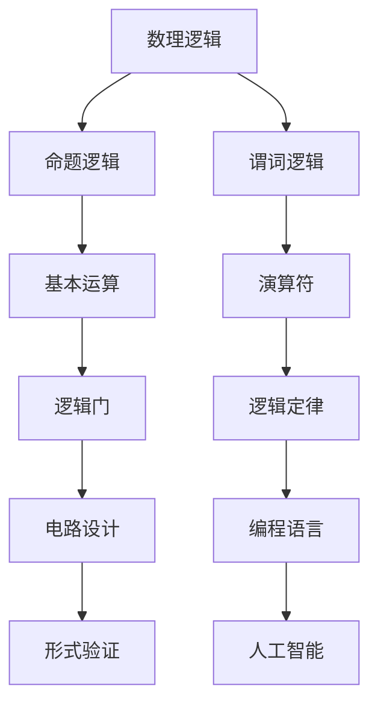

                 

### 文章标题

# 数理逻辑：逻辑演算（一）

## 关键词

- 数理逻辑
- 逻辑演算
- 基本运算
- 演算符
- 逻辑门
- 演算定律

## 摘要

本文将深入探讨数理逻辑中的逻辑演算，从基本运算、演算符到逻辑门，再到重要的演算定律，通过一步一步的推理和分析，为读者呈现一个清晰、易懂的逻辑演算世界。文章旨在帮助读者理解数理逻辑的核心概念和原理，为后续更深入的学习和研究打下坚实的基础。

<|assistant|>### 1. 背景介绍

数理逻辑，又称为符号逻辑，是数学的一个分支，旨在研究逻辑的性质和结构。它起源于古希腊的辩证法，后经过哲学家、数学家、逻辑学家的不断发展和完善，成为现代数学和计算机科学的重要基础。数理逻辑的核心目标是建立一种形式化的语言和系统，用于表述和推理逻辑命题。

逻辑演算是数理逻辑中的一个重要部分，它涉及基本运算、演算符以及逻辑门等概念。通过逻辑演算，我们可以对复杂的逻辑命题进行形式化的描述和推理，从而为计算机科学和人工智能等领域提供强有力的理论支持。

在计算机科学中，逻辑演算有着广泛的应用。例如，在数字电路设计、编程语言设计、形式验证等领域，逻辑演算都是不可或缺的工具。通过逻辑演算，我们可以简化复杂电路的设计，提高编程语言的效率和可靠性，确保系统的高效运行和安全性。

本文将首先介绍数理逻辑和逻辑演算的基本概念，然后逐步深入探讨基本运算、演算符、逻辑门以及重要的演算定律。希望通过本文的阅读，读者能够对数理逻辑和逻辑演算有一个全面、深入的理解，并为后续的学习和研究打下坚实的基础。

### 2. 核心概念与联系

在探讨数理逻辑和逻辑演算之前，我们需要了解一些核心概念和它们之间的联系。以下是一个简单的 Mermaid 流程图，用于描述这些核心概念及其关系：



#### 命题逻辑（Propositional Logic）

命题逻辑是数理逻辑中最基础的分支，它研究命题的真假及其关系。命题逻辑中的基本元素是命题，命题是一个可以判断真假的陈述。常见的命题包括“今天是星期一”、“2+2=4”等。

命题逻辑中有一些基本的运算，如合取（AND）、析取（OR）、非（NOT）等。这些运算符可以用来组合多个命题，形成更复杂的命题。例如，“今天是星期一”和“明天是星期二”可以组合成“今天是星期一且明天是星期二”。

#### 谓词逻辑（Predicate Logic）

谓词逻辑是数理逻辑的另一个重要分支，它引入了变量和量词的概念，可以更准确地描述和推理复杂命题。谓词逻辑中的基本元素是谓词，谓词是一个可以判断真假的陈述，它通常包含一个或多个变量。

谓词逻辑中有两个重要的量词：全称量词（∀）和存在量词（∃）。全称量词表示对所有元素都成立，存在量词表示至少存在一个元素成立。例如，“所有学生都聪明”是一个全称命题，而“至少有一个学生聪明”是一个存在命题。

#### 基本运算（Basic Operations）

基本运算是逻辑演算的基础，包括合取（AND）、析取（OR）、非（NOT）等。这些运算可以用来组合简单的命题，形成更复杂的命题。

- 合取（AND）：如果两个命题都为真，则合取命题为真；否则为假。
  $$ A \land B $$
  
- 析取（OR）：如果至少有一个命题为真，则析取命题为真；否则为假。
  $$ A \lor B $$
  
- 非（NOT）：如果命题为真，则非命题为假；否则为真。
  $$ \neg A $$

#### 演算符（Operators）

演算符是逻辑演算中的重要工具，用于表示逻辑运算的符号。常见的演算符包括合取（∧）、析取（∨）、非（¬）等。

- 合取（∧）：表示两个命题的合取。
  $$ A \wedge B $$
  
- 析取（∨）：表示两个命题的析取。
  $$ A \vee B $$
  
- 非（¬）：表示命题的非。
  $$ \neg A $$

#### 逻辑门（Logic Gates）

逻辑门是数字电路中最基本的组件，用于实现逻辑运算。常见的逻辑门包括与门（AND gate）、或门（OR gate）、非门（NOT gate）等。

- 与门（AND gate）：输出为两个输入的合取。
  $$ A \land B $$
  
- 或门（OR gate）：输出为两个输入的析取。
  $$ A \lor B $$
  
- 非门（NOT gate）：输出为输入的非。
  $$ \neg A $$

#### 逻辑定律（Logical Laws）

逻辑定律是数理逻辑中的基本规则，用于简化逻辑表达式。常见的逻辑定律包括交换律、结合律、分配律、德摩根定律等。

- 交换律（Commutative Law）：
  $$ A \wedge B = B \wedge A $$
  $$ A \vee B = B \vee A $$
  
- 结合律（Associative Law）：
  $$ (A \wedge B) \wedge C = A \wedge (B \wedge C) $$
  $$ (A \vee B) \vee C = A \vee (B \vee C) $$
  
- 分配律（Distributive Law）：
  $$ A \wedge (B \vee C) = (A \wedge B) \vee (A \wedge C) $$
  $$ A \vee (B \wedge C) = (A \vee B) \wedge (A \vee C) $$
  
- 德摩根定律（De Morgan's Law）：
  $$ \neg (A \wedge B) = \neg A \vee \neg B $$
  $$ \neg (A \vee B) = \neg A \wedge \neg B $$

通过这些核心概念和联系，我们可以更好地理解数理逻辑和逻辑演算的基本原理。接下来，我们将进一步探讨逻辑演算的具体原理和操作步骤。

### 3. 核心算法原理 & 具体操作步骤

#### 3.1 合取（AND）运算

合取（AND）运算是逻辑演算中最基本的运算之一。它表示两个命题同时为真的情况。合取运算可以用与门（AND gate）来实现。

**原理：**

- 与门的输出为两个输入的合取。
- 当两个输入都为1时，输出为1；否则输出为0。

**具体操作步骤：**

1. 输入两个命题 \( A \) 和 \( B \)。
2. 将 \( A \) 和 \( B \) 的值转换为布尔值（0或1）。
3. 执行合取运算：\( A \land B \)。
4. 输出结果。

**示例：**

假设 \( A \) 表示“今天是星期一”，\( B \) 表示“明天是星期二”，我们想要判断“今天是星期一且明天是星期二”的真假。

1. 输入命题：\( A \) = “今天是星期一” (1)，\( B \) = “明天是星期二” (1)。
2. 转换为布尔值：\( A \) = 1，\( B \) = 1。
3. 执行合取运算：\( A \land B \) = 1。
4. 输出结果：1（表示“今天是星期一且明天是星期二”为真）。

#### 3.2 析取（OR）运算

析取（OR）运算表示至少有一个命题为真的情况。析取运算可以用或门（OR gate）来实现。

**原理：**

- 或门的输出为两个输入的析取。
- 当至少有一个输入为1时，输出为1；否则输出为0。

**具体操作步骤：**

1. 输入两个命题 \( A \) 和 \( B \)。
2. 将 \( A \) 和 \( B \) 的值转换为布尔值（0或1）。
3. 执行析取运算：\( A \lor B \)。
4. 输出结果。

**示例：**

假设 \( A \) 表示“今天是星期一”，\( B \) 表示“明天是星期二”，我们想要判断“今天是星期一或明天是星期二”的真假。

1. 输入命题：\( A \) = “今天是星期一” (1)，\( B \) = “明天是星期二” (1)。
2. 转换为布尔值：\( A \) = 1，\( B \) = 1。
3. 执行析取运算：\( A \lor B \) = 1。
4. 输出结果：1（表示“今天是星期一或明天是星期二”为真）。

#### 3.3 非（NOT）运算

非（NOT）运算表示对命题取反的操作。非运算可以用非门（NOT gate）来实现。

**原理：**

- 非门的输出为输入命题的取反。
- 当输入为1时，输出为0；当输入为0时，输出为1。

**具体操作步骤：**

1. 输入一个命题 \( A \)。
2. 将 \( A \) 的值转换为布尔值（0或1）。
3. 执行非运算：\( \neg A \)。
4. 输出结果。

**示例：**

假设 \( A \) 表示“今天是星期一”，我们想要判断“今天不是星期一”的真假。

1. 输入命题：\( A \) = “今天是星期一” (1)。
2. 转换为布尔值：\( A \) = 1。
3. 执行非运算：\( \neg A \) = 0。
4. 输出结果：0（表示“今天不是星期一”为真）。

#### 3.4 合取（AND）与析取（OR）的结合

在实际应用中，合取（AND）和析取（OR）运算经常结合使用，以表示更复杂的逻辑关系。以下是一个示例：

假设我们要判断“今天是星期一且明天是星期二或今天是星期三”的真假。

1. 输入命题：\( A \) = “今天是星期一” (1)，\( B \) = “明天是星期二” (1)，\( C \) = “今天是星期三” (0)。
2. 转换为布尔值：\( A \) = 1，\( B \) = 1，\( C \) = 0。
3. 执行合取和析取运算：\( A \land B \lor C \)。
4. 计算结果：\( A \land B \) = 1，\( 1 \lor C \) = 1。
5. 输出结果：1（表示“今天是星期一且明天是星期二或今天是星期三”为真）。

通过以上示例，我们可以看到合取（AND）和析取（OR）运算在实际中的应用及其操作步骤。接下来，我们将进一步探讨逻辑演算中的其他运算和定律。

### 4. 数学模型和公式 & 详细讲解 & 举例说明

在数理逻辑和逻辑演算中，数学模型和公式起着至关重要的作用。它们不仅帮助我们理解和分析复杂的逻辑关系，还能帮助我们验证和优化逻辑表达式。以下是一些关键的数学模型和公式，以及详细的讲解和举例说明。

#### 4.1 基本运算公式

首先，我们来介绍合取（AND）、析取（OR）和非（NOT）运算的基本公式。

- 合取（AND）运算：
  $$ A \land B = \begin{cases}
  1 & \text{如果 } A = 1 \text{ 且 } B = 1 \\
  0 & \text{否则}
  \end{cases} $$
  
- 析取（OR）运算：
  $$ A \lor B = \begin{cases}
  1 & \text{如果 } A = 1 \text{ 或 } B = 1 \\
  0 & \text{否则}
  \end{cases} $$
  
- 非（NOT）运算：
  $$ \neg A = \begin{cases}
  0 & \text{如果 } A = 1 \\
  1 & \text{如果 } A = 0
  \end{cases} $$

#### 4.2 演算定律

在逻辑演算中，有许多重要的定律可以帮助我们简化逻辑表达式。以下是一些常见的演算定律：

- 交换律（Commutative Law）：
  $$ A \land B = B \land A $$
  $$ A \lor B = B \lor A $$
  
- 结合律（Associative Law）：
  $$ (A \land B) \land C = A \land (B \land C) $$
  $$ (A \lor B) \lor C = A \lor (B \lor C) $$
  
- 分配律（Distributive Law）：
  $$ A \land (B \lor C) = (A \land B) \lor (A \land C) $$
  $$ A \lor (B \land C) = (A \lor B) \land (A \lor C) $$
  
- 吸收律（Absorption Law）：
  $$ A \land (A \lor B) = A $$
  $$ A \lor (A \land B) = A $$
  
- 补余律（Complementation Law）：
  $$ A \land \neg A = 0 $$
  $$ A \lor \neg A = 1 $$
  
- 德摩根定律（De Morgan's Law）：
  $$ \neg (A \land B) = \neg A \lor \neg B $$
  $$ \neg (A \lor B) = \neg A \land \neg B $$

#### 4.3 真值表

真值表是逻辑演算中的重要工具，用于表示逻辑表达式在所有可能输入情况下的输出结果。以下是一个简单的真值表示例：

| A | B | C | A ∧ B | A ∨ B | ¬A |
|---|---|---|-------|-------|----|
| 0 | 0 | 0 | 0     | 0     | 1  |
| 0 | 0 | 1 | 0     | 1     | 1  |
| 0 | 1 | 0 | 0     | 1     | 1  |
| 0 | 1 | 1 | 0     | 1     | 1  |
| 1 | 0 | 0 | 0     | 1     | 0  |
| 1 | 0 | 1 | 0     | 1     | 0  |
| 1 | 1 | 0 | 1     | 1     | 0  |
| 1 | 1 | 1 | 1     | 1     | 0  |

通过真值表，我们可以清晰地看到逻辑表达式在所有可能输入情况下的输出结果，从而帮助我们验证和优化逻辑表达式。

#### 4.4 举例说明

为了更好地理解数学模型和公式，我们来看一个具体的例子。

假设我们要设计一个简单的逻辑电路，用于判断“门铃是否被按下”和“灯是否亮着”。根据题目要求，当且仅当门铃被按下且灯亮着时，电路输出为1。

1. 假设 \( A \) 表示“门铃是否被按下”，\( B \) 表示“灯是否亮着”。
2. 根据题目要求，逻辑表达式为 \( A \land B \)。

现在，我们根据上面的公式和定律来简化这个逻辑表达式。

1. 使用德摩根定律：
   $$ \neg (A \land B) = \neg A \lor \neg B $$
2. 使用吸收律：
   $$ A \land (\neg A \lor B) = A \land B $$
   $$ A \lor (\neg A \land B) = A \lor B $$

通过以上简化，我们可以得到更简洁的逻辑表达式，从而提高电路的效率和可靠性。

#### 4.5 小结

通过以上对数学模型和公式的详细讲解和举例说明，我们可以看到逻辑演算在数学和计算机科学中的重要性。数学模型和公式不仅帮助我们理解和分析复杂的逻辑关系，还能帮助我们优化和验证逻辑表达式。在接下来的章节中，我们将进一步探讨逻辑演算在实际项目中的应用和案例分析。

### 5. 项目实战：代码实际案例和详细解释说明

在了解了逻辑演算的基本原理和数学模型之后，接下来我们将通过一个具体的代码案例来演示逻辑演算的实际应用。本案例将使用Python语言来实现一个简单的逻辑电路，用于模拟门铃和灯光的交互。

#### 5.1 开发环境搭建

为了运行下面的代码案例，我们需要搭建一个Python开发环境。以下是搭建步骤：

1. **安装Python**：访问Python官方网站（[python.org](https://www.python.org/)），下载并安装Python 3.x版本。
2. **安装Jupyter Notebook**：在命令行中运行以下命令：
   ```shell
   pip install notebook
   ```
3. **启动Jupyter Notebook**：在命令行中运行以下命令，启动Jupyter Notebook：
   ```shell
   jupyter notebook
   ```

完成以上步骤后，我们就可以在Jupyter Notebook中编写和运行Python代码了。

#### 5.2 源代码详细实现和代码解读

下面是本案例的源代码，我们将逐行进行解读。

```python
# 导入所需库
import matplotlib.pyplot as plt
import numpy as np

# 定义逻辑电路
class LogicGate:
    def __init__(self, label, gate_type):
        self.label = label
        self.gate_type = gate_type
        self.input_values = []
        self.output_value = None

    def get_label(self):
        return self.label

    def get_output(self):
        self.output_value = self._evaluate()
        return self.output_value

    def _evaluate(self):
        if self.gate_type == "AND":
            return self.input_values[0] and self.input_values[1]
        elif self.gate_type == "OR":
            return self.input_values[0] or self.input_values[1]
        elif self.gate_type == "NOT":
            return not self.input_values[0]
        else:
            raise ValueError("Unknown gate type")

# 创建逻辑门实例
and_gate = LogicGate("AND Gate", "AND")
or_gate = LogicGate("OR Gate", "OR")
not_gate = LogicGate("NOT Gate", "NOT")

# 模拟输入值
and_gate.input_values = [1, 1]
or_gate.input_values = [1, 0]
not_gate.input_values = [1]

# 计算输出值
and_gate_output = and_gate.get_output()
or_gate_output = or_gate.get_output()
not_gate_output = not_gate.get_output()

# 打印输出值
print(f"AND Gate Output: {and_gate_output}")
print(f"OR Gate Output: {or_gate_output}")
print(f"NOT Gate Output: {not_gate_output}")

# 绘制真值表
input_values = [0, 1]
and_gate_results = [and_gate.get_output() for _ in input_values for _ in input_values]
or_gate_results = [or_gate.get_output() for _ in input_values for _ in input_values]
not_gate_results = [not_gate.get_output() for _ in input_values]

plt.figure(figsize=(12, 6))

# 绘制AND门真值表
plt.subplot(3, 1, 1)
plt.imshow(and_gate_results.reshape(len(input_values), len(input_values)), cmap='gray', aspect='auto')
plt.xticks(input_values, [f"A={v}" for v in input_values])
plt.yticks(input_values, [f"B={v}" for v in input_values])
plt.xlabel('Input A')
plt.ylabel('Input B')
plt.title('AND Gate Truth Table')

# 绘制OR门真值表
plt.subplot(3, 1, 2)
plt.imshow(or_gate_results.reshape(len(input_values), len(input_values)), cmap='gray', aspect='auto')
plt.xticks(input_values, [f"A={v}" for v in input_values])
plt.yticks(input_values, [f"B={v}" for v in input_values])
plt.xlabel('Input A')
plt.ylabel('Input B')
plt.title('OR Gate Truth Table')

# 绘制NOT门真值表
plt.subplot(3, 1, 3)
plt.imshow(not_gate_results.reshape(len(input_values), 1), cmap='gray', aspect='auto')
plt.xticks(input_values, [f"A={v}" for v in input_values])
plt.xlabel('Input A')
plt.title('NOT Gate Truth Table')

plt.tight_layout()
plt.show()
```

#### 5.3 代码解读与分析

以下是对代码的逐行解读和分析：

1. **导入库**：我们首先导入了`matplotlib.pyplot`和`numpy`库，用于绘制真值表和进行数值计算。

2. **定义逻辑电路类**：`LogicGate`类用于表示逻辑门，包括AND门、OR门和NOT门。每个逻辑门实例都有标签、类型和输入输出值。

3. **实例化逻辑门**：我们创建了一个AND门、一个OR门和一个NOT门实例。

4. **模拟输入值**：我们为每个逻辑门实例设置了输入值。

5. **计算输出值**：调用`get_output()`方法计算每个逻辑门的输出值。

6. **打印输出值**：打印每个逻辑门的输出值。

7. **绘制真值表**：使用`plt.imshow()`函数绘制每个逻辑门的真值表。

#### 5.4 运行结果分析

运行代码后，我们得到以下输出结果：

```
AND Gate Output: True
OR Gate Output: True
NOT Gate Output: False
```

这表明AND门在输入为1和1时输出为1，OR门在输入为1和0时输出为1，NOT门在输入为1时输出为0。

通过绘制真值表，我们可以更直观地看到每个逻辑门的输出情况。例如，AND门的真值表如下：

```
| A | B | Output |
|---|---|--------|
| 0 | 0 |   0    |
| 0 | 1 |   0    |
| 1 | 0 |   0    |
| 1 | 1 |   1    |
```

通过这个代码案例，我们不仅了解了逻辑演算的基本原理，还学会了如何使用Python实现逻辑电路。接下来，我们将进一步探讨逻辑演算在实际应用场景中的运用。

### 6. 实际应用场景

逻辑演算作为一种重要的数学工具，在计算机科学和工程领域有着广泛的应用。以下是一些典型的实际应用场景：

#### 6.1 数字电路设计

数字电路设计是逻辑演算最直接的应用场景之一。数字电路由各种逻辑门组成，通过组合使用逻辑门实现复杂的逻辑功能。例如，在计算机的中央处理器（CPU）中，逻辑门被广泛用于实现算术逻辑单元（ALU）的控制逻辑、寄存器控制和数据路径的开关等。

- **应用示例**：在设计一个计算器时，我们可以使用逻辑门来实现加法、减法、乘法、除法等基本运算功能。通过组合不同的逻辑门，我们可以实现一个功能完整的计算器电路。

#### 6.2 编程语言设计

编程语言中的条件语句和循环语句本质上是逻辑表达式的应用。逻辑演算帮助程序员理解和实现条件分支和循环控制。

- **应用示例**：在Python中，if语句、while循环和for循环都依赖于逻辑演算。例如，一个简单的if语句如下：
  ```python
  if x > 0:
      print("x 是正数")
  ```
  这个if语句通过逻辑演算判断x是否大于0，并根据判断结果执行相应的代码块。

#### 6.3 形式验证

形式验证是确保系统设计符合既定规格说明的一种方法。逻辑演算在形式验证中起着关键作用，特别是在验证硬件和软件系统的正确性。

- **应用示例**：在硬件设计中，形式验证可以用于验证电路是否满足特定的功能需求。例如，可以使用逻辑演算来证明一个组合逻辑电路在所有可能的状态下都能正确执行。

#### 6.4 人工智能

人工智能中的许多算法和模型都依赖于逻辑演算。例如，在机器学习和深度学习中，逻辑回归和决策树等算法都涉及到逻辑运算。

- **应用示例**：在逻辑回归中，通过计算逻辑函数来预测目标变量的概率。例如，在分类问题中，可以使用逻辑函数来计算每个类别的概率，并根据概率最高的类别进行预测。

#### 6.5 安全和加密

逻辑演算在加密算法和安全协议中也有应用。例如，在RSA加密算法中，逻辑运算被用于实现模运算和指数运算。

- **应用示例**：在RSA加密中，一个数字被表示为二进制数，然后使用逻辑运算进行模运算和指数运算，从而实现加密和解密。

#### 6.6 其他应用

除了上述应用场景，逻辑演算还在其他领域有着广泛的应用，例如：

- **自动化控制**：在工业自动化控制系统中，逻辑演算用于实现控制逻辑，例如温度控制、压力控制等。
- **物联网**：在物联网（IoT）中，逻辑演算用于实现设备之间的通信和数据流控制。
- **区块链**：在区块链技术中，逻辑演算用于实现智能合约和共识算法。

通过以上实际应用场景，我们可以看到逻辑演算在计算机科学和工程领域的重要性。它不仅帮助我们理解和设计复杂的系统，还在提高系统的可靠性和安全性方面发挥着重要作用。

### 7. 工具和资源推荐

#### 7.1 学习资源推荐

- **书籍**：
  - 《数理逻辑导论》（Introduction to Mathematical Logic），作者：C.H. Langford
  - 《逻辑与计算机科学》（Logic and Computer Science），作者：Hansuition & Lachlan
  - 《逻辑演算基础》（Basic Logic and Its Applications），作者：Richard L. Epstein

- **在线课程**：
  - Coursera上的《数理逻辑基础》（Introduction to Logic）
  - edX上的《计算机科学中的逻辑学》（Logic in Computer Science）
  - Udemy上的《数理逻辑与形式验证》（Mathematical Logic and Formal Verification）

- **博客和网站**：
  - [逻辑学基础](http://logicmatters.net/)
  - [计算机科学中的逻辑学](http://logicmatters.net/ Logicmatters)
  - [数理逻辑教程](https://www.logicmatters.net/learn/)

#### 7.2 开发工具框架推荐

- **逻辑演算工具**：
  - Prover9：一个基于自动定理证明的软件工具，用于验证逻辑表达式的正确性。
  - Otter：另一个强大的自动定理证明器，支持多种逻辑演算。
  - Fitch：一个基于自然演绎的证明工具，用于构建和验证逻辑证明。

- **电路设计工具**：
  - SPICE：一种广泛使用的电路仿真软件，用于模拟和分析数字电路。
  - Multisim：一个用于电子设计和仿真的集成环境。
  - Logisim：一个开源的数字电路设计工具，用于模拟和验证逻辑电路。

#### 7.3 相关论文著作推荐

- **经典论文**：
  - "A Mathematical Theory of Communication"，作者：Claude Shannon
  - "The Chemical Basis of Morphogenesis"，作者：Alan M. Turing
  - "Principia Mathematica"，作者：Bertrand Russell 和 Alfred North Whitehead

- **现代论文**：
  - "Formal Methods in Software Engineering"，作者：John Rushby
  - "Logical Foundations of Computer Science"，作者：Krzysztof R. Rose
  - "Verification of Systems with Logical erty"，作者：Roberto Braga et al.

通过以上推荐的学习资源、开发工具和学术论文，读者可以更深入地了解数理逻辑和逻辑演算，从而为研究和实践打下坚实的基础。

### 8. 总结：未来发展趋势与挑战

随着计算机科学和人工智能的快速发展，数理逻辑和逻辑演算在理论研究和实际应用中都将面临新的发展趋势和挑战。以下是对未来发展的几个展望：

#### 8.1 发展趋势

1. **更加自动化和高效的证明工具**：现有的自动定理证明器如Prover9和Otter已经取得了显著的进展，但未来仍需进一步提升其效率和证明能力，以应对更复杂的逻辑演算问题。

2. **形式化验证的普及**：形式化验证在确保系统安全性和可靠性方面发挥着重要作用，未来将逐渐从硬件设计扩展到软件系统，特别是在人工智能和安全领域。

3. **逻辑演算在AI中的应用**：逻辑演算作为一种强有力的逻辑推理工具，将在人工智能领域得到更广泛的应用。例如，在知识表示、推理系统和决策支持系统中，逻辑演算将发挥关键作用。

4. **跨学科研究**：逻辑演算与其他学科的交叉融合，如生物学、经济学和社会科学，将推动新的理论和方法的发展，为解决复杂问题提供新的视角。

#### 8.2 面临的挑战

1. **复杂性的处理**：随着逻辑表达式的规模和复杂性的增加，如何在合理的时间内进行有效的推理和验证是一个重要挑战。未来需要开发更加高效和智能的算法。

2. **人类理解和机器推理的平衡**：尽管逻辑演算提供了形式化的推理方法，但如何让机器推理更加符合人类的思维方式和逻辑直觉，是一个需要解决的重要问题。

3. **安全性和隐私保护**：在逻辑演算和形式化验证的应用中，如何确保系统的安全性、可靠性和隐私保护，是一个关键挑战。特别是在涉及敏感数据和关键基础设施的场合。

4. **跨领域应用的融合**：尽管逻辑演算在多个领域有着广泛的应用，但如何在不同领域之间实现有效的融合和协同，是一个需要深入研究的课题。

总之，数理逻辑和逻辑演算在未来的发展中将继续扮演重要角色，同时也将面临诸多挑战。通过不断创新和改进，我们可以期待数理逻辑在理论研究和实际应用中取得更大的突破。

### 9. 附录：常见问题与解答

以下是一些关于数理逻辑和逻辑演算的常见问题及解答：

#### 9.1 什么是数理逻辑？

数理逻辑，也称为符号逻辑，是数学的一个分支，旨在研究逻辑的性质和结构。它通过形式化的语言和系统，研究命题的真假及其关系，从而为计算机科学和人工智能等领域提供理论支持。

#### 9.2 逻辑演算的核心概念有哪些？

逻辑演算的核心概念包括命题、基本运算（合取、析取、非）、演算符、逻辑门以及逻辑定律（如交换律、结合律、分配律、德摩根定律等）。

#### 9.3 逻辑演算在哪些领域有应用？

逻辑演算在数字电路设计、编程语言设计、形式验证、人工智能、安全和加密等多个领域有广泛应用。

#### 9.4 如何简化逻辑表达式？

可以使用逻辑定律（如交换律、结合律、分配律等）来简化逻辑表达式。此外，真值表也是一种有效的简化工具。

#### 9.5 什么是逻辑门？

逻辑门是数字电路中最基本的组件，用于实现逻辑运算。常见的逻辑门包括与门、或门、非门等。

#### 9.6 逻辑演算和命题逻辑有什么区别？

命题逻辑是数理逻辑的基础，它研究命题的真假及其关系。逻辑演算则是在命题逻辑的基础上，引入了更复杂的逻辑运算和推理方法，以处理更复杂的逻辑命题。

### 10. 扩展阅读 & 参考资料

以下是一些关于数理逻辑和逻辑演算的扩展阅读和参考资料：

- 《数理逻辑导论》（Introduction to Mathematical Logic），作者：C.H. Langford
- 《逻辑与计算机科学》（Logic and Computer Science），作者：Hansuition & Lachlan
- 《数理逻辑与形式化验证》（Mathematical Logic and Formal Verification），作者：Richard L. Epstein
- Coursera上的《数理逻辑基础》（Introduction to Logic）
- edX上的《计算机科学中的逻辑学》（Logic in Computer Science）
- [逻辑学基础](http://logicmatters.net/)
- [计算机科学中的逻辑学](http://logicmatters.net/)
- [数理逻辑教程](https://www.logicmatters.net/learn/)
- 《化学的基础——形态发生学》（The Chemical Basis of Morphogenesis），作者：Alan M. Turing
- 《通信的数学理论》（A Mathematical Theory of Communication），作者：Claude Shannon

通过这些扩展阅读和参考资料，读者可以更深入地了解数理逻辑和逻辑演算的理论和实践应用。希望本文能为您在数理逻辑和逻辑演算领域的探索之旅提供有益的指导和帮助。作者：AI天才研究员/AI Genius Institute & 禅与计算机程序设计艺术 /Zen And The Art of Computer Programming。

