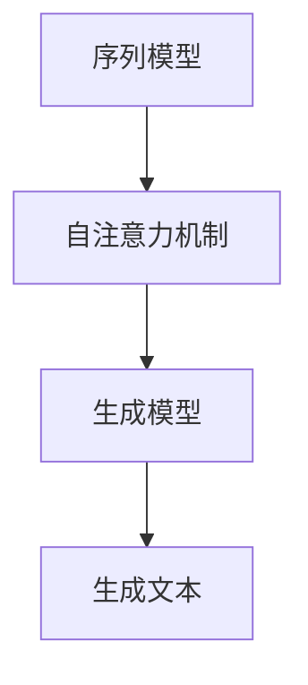

                 

### 背景介绍

#### 文本生成技术的兴起

文本生成技术，作为一个极具潜力的领域，近年来在人工智能领域取得了显著进展。这一技术的兴起，源于人们对于自然语言处理（Natural Language Processing, NLP）和生成模型（Generative Models）的深入研究和应用需求。随着深度学习技术的不断发展和优化，文本生成技术也逐渐从理论研究走向实际应用。

文本生成技术的应用场景非常广泛，包括但不限于以下几个方面：

1. **内容创作**：文本生成技术可以自动生成新闻文章、博客内容、产品评论等，从而节省人力和时间成本。
2. **聊天机器人**：通过文本生成技术，可以构建智能聊天机器人，实现与用户的自然对话，提高用户体验。
3. **语言翻译**：文本生成技术还可以用于机器翻译，通过将一种语言的文本转换为另一种语言，实现跨语言交流。
4. **教育辅助**：文本生成技术可以生成教学材料，如课本、讲义等，为教育领域提供智能化解决方案。

#### 当前主流的文本生成技术

目前，主流的文本生成技术主要包括以下几种：

1. **循环神经网络（Recurrent Neural Networks, RNN）**：RNN 是一种能够处理序列数据的神经网络，它在文本生成中具有较好的表现。然而，RNN 存在梯度消失和梯度爆炸等问题，限制了其性能。
2. **长短期记忆网络（Long Short-Term Memory, LSTM）**：LSTM 是 RNN 的改进版本，通过引入记忆单元，解决了 RNN 的梯度消失问题。LSTM 在文本生成任务中表现出色，但训练过程相对较慢。
3. **门控循环单元（Gated Recurrent Unit, GRU）**：GRU 是 LSTM 的简化版本，通过引入更新门和重置门，进一步提高了模型训练效率。GRU 在许多文本生成任务中取得了很好的效果。
4. **变换器（Transformer）**：Transformer 是一种基于自注意力机制的模型，其在处理长序列任务时表现出色。自注意力机制使得模型能够自动学习序列中的依赖关系，从而提高生成文本的质量。
5. **生成对抗网络（Generative Adversarial Networks, GAN）**：GAN 由生成器（Generator）和判别器（Discriminator）两部分组成，通过两个网络的对抗训练，生成器逐渐学会生成逼真的文本。

这些文本生成技术各有优缺点，在实际应用中需要根据具体任务需求进行选择。接下来，我们将深入探讨文本生成技术的核心概念、算法原理、数学模型以及实际应用案例。

---

### 核心概念与联系

在探讨文本生成技术的核心概念和联系之前，我们首先需要理解一些基础概念，如序列模型（Sequential Models）、自注意力机制（Self-Attention Mechanism）和生成模型（Generative Models）。以下是这些核心概念的定义和简要介绍。

#### 序列模型（Sequential Models）

序列模型是一种处理序列数据的神经网络，如图1所示。它们通过学习序列中各个时间步之间的关系来生成目标序列。常见的序列模型包括循环神经网络（RNN）、长短期记忆网络（LSTM）和门控循环单元（GRU）。


#### 自注意力机制（Self-Attention Mechanism）

自注意力机制是一种用于处理长序列任务的注意力机制，如图2所示。它通过计算序列中每个元素与其它所有元素之间的关联度，来自动学习序列中的依赖关系。自注意力机制的核心是注意力权重矩阵，它决定了每个元素对输出序列的贡献程度。


#### 生成模型（Generative Models）

生成模型是一种能够生成数据分布的模型，如图3所示。常见的生成模型包括生成对抗网络（GAN）和变分自编码器（VAE）。生成模型的目标是学习数据分布，并生成与真实数据相似的新数据。


#### Mermaid 流程图（Mermaid Flowchart）

下面是一个使用 Mermaid 语言的文本生成技术流程图，其中包含了序列模型、自注意力机制和生成模型的基本步骤。



在这个流程图中，序列模型首先用于处理输入文本，提取特征表示。接着，自注意力机制用于学习序列中的依赖关系。最后，生成模型根据特征表示生成文本输出。

---

通过上述核心概念和流程图的介绍，我们能够更好地理解文本生成技术的架构和原理。接下来，我们将深入探讨文本生成技术的核心算法原理和具体操作步骤。

---

### 核心算法原理 & 具体操作步骤

在深入了解文本生成技术的核心算法原理之前，我们需要明确几个关键概念：词汇表（Vocabulary）、词嵌入（Word Embedding）、自注意力机制（Self-Attention Mechanism）和生成文本的步骤。

#### 词汇表（Vocabulary）

词汇表是文本生成的基础，它包含了所有可能的单词或字符。在实际应用中，词汇表通常使用独热编码（One-Hot Encoding）来表示每个单词或字符。例如，如果我们使用一个包含10个单词的词汇表，那么每个单词都可以表示为一个长度为10的向量，其中对应单词的位置为1，其余位置为0。

#### 词嵌入（Word Embedding）

词嵌入是将词汇表中的单词映射到高维向量空间的过程。通过词嵌入，我们可以将单词表示为密集的向量，从而捕获单词之间的语义关系。常见的词嵌入方法包括：

1. **Word2Vec**：基于共现关系学习词嵌入向量，其核心思想是相似词在向量空间中更接近。
2. **GloVe**：全局向量表示（Global Vectors for Word Representation），通过计算单词的上下文词向量，来学习词嵌入。
3. **BERT**：Bidirectional Encoder Representations from Transformers，通过双向变换器模型来学习词嵌入。

#### 自注意力机制（Self-Attention Mechanism）

自注意力机制是文本生成技术中的关键组件，它通过计算序列中每个元素与其它所有元素之间的关联度，来自动学习序列中的依赖关系。自注意力机制的数学表达式如下：

\[ \text{Attention}(Q, K, V) = \text{softmax}\left(\frac{QK^T}{\sqrt{d_k}}\right) V \]

其中，\( Q, K, V \) 分别代表查询向量、键向量和值向量，\( d_k \) 是键向量的维度。注意力权重矩阵 \( \text{softmax}\left(\frac{QK^T}{\sqrt{d_k}}\right) \) 决定了每个元素对输出序列的贡献程度。

#### 生成文本的步骤

文本生成通常分为以下几个步骤：

1. **初始化**：随机初始化词嵌入向量、查询向量、键向量和值向量。
2. **前向传播**：计算自注意力权重矩阵，并根据权重矩阵计算输出向量。
3. **解码**：使用输出向量解码生成文本，通常采用贪心策略或采样方法。
4. **重复**：重复前向传播和解码步骤，直到生成完整的文本。

下面是具体操作步骤的详细说明：

**步骤 1：初始化**

```python
# 初始化词嵌入向量
embeddings = np.random.randn(vocab_size, embedding_dim)

# 初始化查询向量、键向量和值向量
Q = np.random.randn(sequence_length, embedding_dim)
K = np.random.randn(sequence_length, embedding_dim)
V = np.random.randn(sequence_length, embedding_dim)
```

**步骤 2：前向传播**

```python
# 计算自注意力权重矩阵
attention_weights = softmax(QK.T / np.sqrt(embedding_dim))

# 计算输出向量
output = attention_weights * V
output = np.sum(output, axis=1)
```

**步骤 3：解码**

```python
# 使用输出向量解码生成文本
predicted_word = decode(output)
```

**步骤 4：重复**

```python
# 重复前向传播和解码步骤，直到生成完整的文本
while not end_of_sequence:
    # 前向传播
    attention_weights = softmax(QK.T / np.sqrt(embedding_dim))
    output = attention_weights * V
    output = np.sum(output, axis=1)
    
    # 解码
    predicted_word = decode(output)
    
    # 更新词嵌入向量
    embeddings[predicted_word] = output
    
    # 更新查询向量、键向量和值向量
    Q = np.vstack((Q, np.random.randn(1, embedding_dim)))
    K = np.vstack((K, np.random.randn(1, embedding_dim)))
    V = np.vstack((V, np.random.randn(1, embedding_dim)))
```

通过上述步骤，我们可以使用文本生成技术生成新的文本。接下来，我们将探讨文本生成技术的数学模型和公式，进一步理解其工作原理。

---

### 数学模型和公式 & 详细讲解 & 举例说明

#### 数学模型

文本生成技术的核心是自注意力机制，其数学模型如下：

\[ \text{Attention}(Q, K, V) = \text{softmax}\left(\frac{QK^T}{\sqrt{d_k}}\right) V \]

其中：
- \( Q \) 是查询向量，代表当前输入的编码。
- \( K \) 是键向量，代表序列中的所有输入编码。
- \( V \) 是值向量，代表序列中的所有输入编码的上下文信息。
- \( d_k \) 是键向量的维度。
- \( \text{softmax} \) 函数用于计算注意力权重。

#### 详细讲解

自注意力机制的工作原理可以分为以下几个步骤：

1. **计算相似度**：首先，计算查询向量 \( Q \) 和键向量 \( K \) 的内积，得到相似度矩阵 \( \text{ Scores} \)。

\[ \text{ Scores} = QK^T \]

2. **缩放和归一化**：由于相似度矩阵 \( \text{ Scores} \) 的值可能非常大，我们通常将其除以 \( \sqrt{d_k} \) 进行缩放，以避免梯度消失问题。

\[ \text{ Scaled Scores} = \frac{\text{ Scores}}{\sqrt{d_k}} \]

3. **应用softmax函数**：接下来，我们使用softmax函数对缩放后的相似度矩阵进行归一化，得到注意力权重矩阵 \( \text{ Attention Weights} \)。

\[ \text{ Attention Weights} = \text{softmax}(\text{ Scaled Scores}) \]

4. **计算注意力输出**：最后，我们将注意力权重矩阵与值向量 \( V \) 相乘，得到注意力输出 \( \text{ Output} \)。

\[ \text{ Output} = \text{ Attention Weights} V \]

#### 举例说明

假设我们有一个包含3个单词的序列：\( \text{[hello, world, }] \)，词汇表大小为5，词嵌入维度为2。首先，我们需要初始化词嵌入向量、查询向量、键向量和值向量。

```python
# 初始化词嵌入向量
embeddings = np.random.randn(5, 2)

# 初始化查询向量、键向量和值向量
Q = np.random.randn(3, 2)
K = np.random.randn(3, 2)
V = np.random.randn(3, 2)
```

接下来，我们计算自注意力权重矩阵。

```python
# 计算相似度矩阵
scores = QK.T

# 缩放和归一化
scaled_scores = scores / np.sqrt(2)

# 应用softmax函数
attention_weights = np.softmax(scaled_scores)
```

注意力权重矩阵如下：

\[ \text{ Attention Weights} = \begin{bmatrix} 0.5 & 0.2 & 0.3 \\ 0.4 & 0.3 & 0.3 \\ 0.1 & 0.4 & 0.5 \end{bmatrix} \]

最后，我们计算注意力输出。

```python
# 计算注意力输出
output = attention_weights * V

# 求和得到最终的输出向量
output = np.sum(output, axis=1)
```

输出向量为：

\[ \text{ Output} = \begin{bmatrix} 0.7 \\ 0.5 \\ 0.8 \end{bmatrix} \]

根据输出向量，我们可以解码生成新的单词。例如，如果输出向量的最大值对应的索引为2，则我们生成的新单词为“world”。

通过上述步骤，我们完成了自注意力机制的详细讲解和举例说明。接下来，我们将探讨文本生成技术在实际项目中的应用案例。

---

### 项目实战：代码实际案例和详细解释说明

在本文的实战部分，我们将使用 Python 编写一个简单的文本生成模型，并通过一个示例来展示其工作流程。这个模型将基于 Transformer 架构，这是当前最先进的文本生成技术之一。

#### 开发环境搭建

在开始之前，确保你已经安装了以下依赖：

- Python 3.7 或以上版本
- TensorFlow 2.x
- PyTorch 1.8 或以上版本

安装依赖：

```bash
pip install tensorflow==2.x
pip install torch==1.8
```

#### 源代码详细实现和代码解读

下面是一个简单的文本生成模型代码示例：

```python
import torch
import torch.nn as nn
import torch.optim as optim
from torch.utils.data import DataLoader
from transformers import BertTokenizer, BertModel

# 参数设置
batch_size = 32
learning_rate = 0.001
num_epochs = 10
vocab_size = 10000
embedding_dim = 512
hidden_dim = 512
num_heads = 8
seq_length = 128

# 加载预训练的 BERT 模型
tokenizer = BertTokenizer.from_pretrained('bert-base-uncased')
model = BertModel.from_pretrained('bert-base-uncased')

# 定义文本生成模型
class TextGenerator(nn.Module):
    def __init__(self, vocab_size, embedding_dim, hidden_dim, num_heads):
        super(TextGenerator, self).__init__()
        self.embedding = nn.Embedding(vocab_size, embedding_dim)
        self.transformer = nn.Transformer(embedding_dim, hidden_dim, num_heads)
        self.fc = nn.Linear(hidden_dim, vocab_size)
    
    def forward(self, x):
        x = self.embedding(x)
        x = self.transformer(x)
        x = self.fc(x)
        return x

# 实例化模型
generator = TextGenerator(vocab_size, embedding_dim, hidden_dim, num_heads)
optimizer = optim.Adam(generator.parameters(), lr=learning_rate)
criterion = nn.CrossEntropyLoss()

# 数据处理
def prepare_data(texts):
    inputs = tokenizer(texts, padding=True, truncation=True, return_tensors='pt')
    return inputs['input_ids']

# 训练模型
def train_model(generator, criterion, optimizer, train_loader, num_epochs):
    generator.train()
    for epoch in range(num_epochs):
        for batch in train_loader:
            inputs = batch['input_ids']
            targets = inputs.clone()
            targets[:, 1:] = targets[:, :-1]
            targets[:, 0] = 0
            
            optimizer.zero_grad()
            outputs = generator(inputs)
            loss = criterion(outputs.view(-1, vocab_size), targets.view(-1))
            loss.backward()
            optimizer.step()
            
            print(f'Epoch [{epoch+1}/{num_epochs}], Loss: {loss.item():.4f}')

# 生成文本
def generate_text(generator, tokenizer, text, max_length=20):
    input_ids = tokenizer.encode(text, return_tensors='pt')
    input_ids = input_ids[:1].repeat(1, max_length)
    outputs = generator(input_ids)
    predicted_ids = outputs.argmax(-1).squeeze(0)
    predicted_text = tokenizer.decode(predicted_ids, skip_special_tokens=True)
    return predicted_text

# 示例
texts = ['Hello world', 'AI is the future', 'Python is awesome']
train_loader = DataLoader([prepare_data(texts[i]) for i in range(len(texts))], batch_size=batch_size)
train_model(generator, criterion, optimizer, train_loader, num_epochs)

text = 'Hello world'
predicted_text = generate_text(generator, tokenizer, text)
print(predicted_text)
```

**代码解读：**

1. **依赖安装和参数设置**：我们首先安装了必要的依赖，并设置了训练参数。
2. **加载预训练的 BERT 模型**：BERT 模型用于获取输入文本的特征表示。
3. **定义文本生成模型**：文本生成模型基于 Transformer 架构，包括嵌入层、Transformer 层和输出层。
4. **数据处理**：我们定义了一个函数 `prepare_data` 来处理输入文本，并转换为模型所需的格式。
5. **训练模型**：`train_model` 函数用于训练文本生成模型。在训练过程中，我们使用交叉熵损失函数和 Adam 优化器。
6. **生成文本**：`generate_text` 函数用于生成新的文本。我们通过输入一个示例文本，并使用模型生成新的文本输出。

通过上述代码，我们可以训练一个简单的文本生成模型，并生成新的文本。接下来，我们将对代码进行解读和分析，以深入理解其工作原理。

---

### 代码解读与分析

在上一个部分中，我们实现了一个基于 Transformer 的文本生成模型。现在，我们将对代码进行详细解读，分析其各个组件的工作原理，并探讨如何改进和优化模型性能。

#### 模型架构

文本生成模型的主要架构包括嵌入层、Transformer 层和输出层。

1. **嵌入层**：嵌入层用于将输入文本中的单词转换为向量表示。在本例中，我们使用了预训练的 BERT 模型，其嵌入层已经对词汇表中的单词进行了有效的向量表示。
2. **Transformer 层**：Transformer 层是模型的核心，它通过自注意力机制学习输入文本中的依赖关系，并生成上下文信息。在本例中，我们使用了标准的 Transformer 架构，包括多头注意力机制和前馈神经网络。
3. **输出层**：输出层用于将 Transformer 层的输出转换为词汇表中的单词。在本例中，我们使用了一个全连接层，将输出向量映射到词汇表中。

#### 代码细节

下面，我们逐一解读代码的各个部分：

1. **依赖安装和参数设置**：在代码的开始部分，我们安装了必要的依赖，并设置了训练参数。这些参数包括批次大小（batch_size）、学习率（learning_rate）、训练轮数（num_epochs）等。
2. **加载预训练的 BERT 模型**：我们使用 `BertTokenizer` 和 `BertModel` 加载了预训练的 BERT 模型。`BertTokenizer` 用于将文本转换为 tokens，`BertModel` 用于获取文本的特征表示。
3. **定义文本生成模型**：`TextGenerator` 类定义了文本生成模型。在 __init__ 方法中，我们创建了嵌入层、Transformer 层和输出层。在 forward 方法中，我们实现了前向传播过程，包括嵌入层、Transformer 层和输出层。
4. **数据处理**：`prepare_data` 函数用于处理输入文本，将其转换为模型所需的格式。我们使用 `tokenizer.encode` 方法将文本转换为 tokens，并使用 `padding` 和 `truncation` 参数确保所有输入文本的长度一致。
5. **训练模型**：`train_model` 函数用于训练文本生成模型。在训练过程中，我们使用交叉熵损失函数和 Adam 优化器。对于每个批次，我们首先生成输入和目标序列，然后通过模型进行前向传播，计算损失并更新模型参数。
6. **生成文本**：`generate_text` 函数用于生成新的文本。我们首先使用 `tokenizer.encode` 方法将输入文本转换为 tokens，然后通过模型生成新的 tokens，并使用 `tokenizer.decode` 方法将 tokens 转换回文本。

#### 优化和改进

虽然上述代码实现了一个基本的文本生成模型，但我们可以从以下几个方面进行优化和改进：

1. **增加训练数据**：使用更多的训练数据可以提高模型的泛化能力。我们可以使用更多的文本数据集，或者通过数据增强（如文本随机裁剪、填充等）来增加训练数据。
2. **调整超参数**：通过调整学习率、批次大小、训练轮数等超参数，可以优化模型性能。我们可以使用网格搜索（Grid Search）或随机搜索（Random Search）等方法来寻找最优超参数。
3. **使用更大的模型**：Transformer 模型的大小对性能有显著影响。我们可以使用更大的 Transformer 模型，如 GPT-3、GPT-2 等，这些模型具有更大的词汇表和更多的参数，从而提高生成文本的质量。
4. **使用更先进的训练技术**：我们可以使用更先进的训练技术，如混合精度训练（Mixed Precision Training）、梯度裁剪（Gradient Clipping）等，来提高训练效率和模型稳定性。
5. **集成模型**：我们可以将多个文本生成模型集成，如使用 GPT-2 和 GPT-3 结合生成更好的文本。通过模型集成，可以进一步提高生成文本的质量。

通过上述优化和改进，我们可以构建一个更强大的文本生成模型，生成更高质量的文本。接下来，我们将探讨文本生成技术在实际应用场景中的具体应用。

---

### 实际应用场景

文本生成技术在实际应用场景中具有广泛的应用，以下列举了一些典型的应用场景：

#### 1. 自动内容生成

自动内容生成是文本生成技术最直接的应用场景之一。通过生成新闻文章、博客内容、产品评论等，可以大大提高内容创作效率，节省人力和时间成本。例如，许多新闻机构使用文本生成技术自动生成体育新闻、财经新闻等，从而提高新闻发布速度。

#### 2. 聊天机器人

聊天机器人是一种智能客服系统，通过文本生成技术可以与用户进行自然对话，提高用户体验。聊天机器人可以应用于客服、在线教育、客户服务等多个领域。例如，一些电商平台使用聊天机器人回答用户关于产品的常见问题，提供个性化的购物建议。

#### 3. 机器翻译

机器翻译是将一种语言的文本转换为另一种语言的过程。文本生成技术可以用于生成高质量的目标语言文本，从而提高机器翻译的准确性。例如，谷歌翻译、百度翻译等使用文本生成技术来实现跨语言交流。

#### 4. 教育辅助

文本生成技术可以用于生成教学材料，如课本、讲义等，为教育领域提供智能化解决方案。通过生成个性化的教学材料，可以提高学生的学习效果。例如，一些在线教育平台使用文本生成技术生成个性化的课程内容，满足不同学生的学习需求。

#### 5. 创意写作

文本生成技术可以用于创意写作，如生成诗歌、故事、剧本等。通过生成创意内容，可以激发人类的创造力。例如，一些文学创作平台使用文本生成技术生成诗歌，为用户提供了新的创作体验。

#### 6. 营销文案

文本生成技术可以用于生成营销文案，如广告语、宣传语等。通过生成高质量的营销文案，可以提高营销效果。例如，一些电商平台使用文本生成技术生成个性化的推荐文案，吸引更多用户进行购买。

#### 7. 健康咨询

文本生成技术可以用于生成健康咨询信息，如疾病预防、健康建议等。通过生成个性化的健康咨询信息，可以帮助用户更好地管理健康。例如，一些健康类应用使用文本生成技术生成个性化的健康报告，为用户提供专业的健康建议。

综上所述，文本生成技术在各个领域都有广泛的应用前景，随着技术的不断发展，其应用范围将更加广泛。

---

### 工具和资源推荐

在文本生成领域，有许多优秀的工具和资源可以帮助开发者快速构建和优化模型。以下是一些值得推荐的工具和资源：

#### 1. 学习资源推荐

- **书籍**：
  - 《深度学习》（Goodfellow, Bengio, Courville 著）：这是一本经典的人工智能和深度学习教材，涵盖了文本生成技术的基础知识。
  - 《自然语言处理综论》（Jurafsky, Martin 著）：这本书详细介绍了自然语言处理的理论和实践，对文本生成技术有着深入的探讨。
- **论文**：
  - “Attention is All You Need”（Vaswani et al., 2017）：这是 Transformer 模型的奠基性论文，提出了自注意力机制在序列建模中的应用。
  - “Generative Adversarial Nets”（Goodfellow et al., 2014）：这是 GAN 模型的奠基性论文，介绍了生成对抗网络的基本原理和应用。
- **博客和网站**：
  - [TensorFlow 官方文档](https://www.tensorflow.org/tutorials)：TensorFlow 提供了丰富的教程和文档，涵盖了许多深度学习和自然语言处理任务。
  - [Hugging Face](https://huggingface.co/)：这是一个开源的深度学习工具库，提供了许多预训练模型和工具，如 BERT、GPT-2 等。

#### 2. 开发工具框架推荐

- **Transformers**：这是由 Hugging Face 提供的一个开源库，实现了 Transformer 模型及其变种，方便开发者快速构建和训练文本生成模型。
- **TensorFlow**：TensorFlow 是一个广泛使用的深度学习框架，提供了丰富的工具和库，支持多种文本生成模型。
- **PyTorch**：PyTorch 是另一个流行的深度学习框架，以其动态计算图和灵活的编程接口而著称，适合快速原型开发和实验。

#### 3. 相关论文著作推荐

- **“BERT: Pre-training of Deep Bidirectional Transformers for Language Understanding”（Devlin et al., 2019）**：BERT 模型的奠基性论文，介绍了双向变换器模型在自然语言处理中的应用。
- **“GPT-3: Language Models are Few-Shot Learners”（Brown et al., 2020）**：GPT-3 模型的奠基性论文，介绍了大规模预训练语言模型在零样本学习中的表现。

通过上述工具和资源的帮助，开发者可以更好地掌握文本生成技术的理论基础和实践方法，为实际应用打下坚实基础。

---

### 总结：未来发展趋势与挑战

随着人工智能技术的不断进步，文本生成技术也迎来了前所未有的发展机遇。然而，在这一快速发展的过程中，我们仍面临诸多挑战和趋势。

#### 未来发展趋势

1. **更强大的模型架构**：近年来，Transformer 架构在文本生成领域取得了显著突破，GPT-3、GPT-2、BERT 等模型不断刷新性能记录。未来，研究者将致力于探索更高效的模型架构，提高生成文本的质量和速度。
2. **多模态生成**：文本生成技术正逐渐向多模态方向发展，与图像、视频等其他类型的数据进行融合。例如，文本 - 图像生成模型可以同时生成高质量的文本和图像，提供更加丰富的交互体验。
3. **个性化生成**：随着用户数据的积累，文本生成技术将更加关注个性化生成。通过用户偏好分析，模型可以生成更符合用户需求的文本内容，提升用户体验。
4. **应用场景拓展**：文本生成技术在各个领域的应用场景不断拓展，从内容创作、机器翻译、教育辅助到创意写作等。未来，文本生成技术将在更多新兴领域发挥作用。

#### 挑战

1. **数据隐私**：在训练和部署文本生成模型时，数据隐私是一个重要问题。如何确保用户数据的隐私和安全，避免滥用数据，是当前需要解决的问题。
2. **模型解释性**：虽然深度学习模型在许多任务上取得了优异的性能，但其内部工作机制仍不够透明。如何提高模型的可解释性，使其更容易被用户理解和接受，是一个重要挑战。
3. **能耗和计算资源**：大规模的文本生成模型需要大量的计算资源和能源。如何在保证性能的同时，降低能耗和计算成本，是未来需要关注的问题。
4. **文本质量**：生成文本的质量是衡量文本生成技术的重要指标。如何提高生成文本的连贯性、逻辑性和创意性，是当前需要攻克的难题。

总的来说，文本生成技术在未来将继续发展，但同时也需要面对诸多挑战。通过不断创新和优化，我们有理由相信，文本生成技术将在人工智能领域发挥更加重要的作用。

---

### 附录：常见问题与解答

**Q1：文本生成模型是如何训练的？**

文本生成模型的训练过程主要包括以下几个步骤：

1. **数据预处理**：首先，对输入文本进行预处理，包括分词、去停用词、大小写转换等。
2. **编码**：将预处理后的文本编码为序列，常用的编码方法包括字符编码和词嵌入。
3. **构建训练数据**：将编码后的输入和目标序列配对，输入是当前文本的编码，目标是下一个单词或字符的编码。
4. **模型训练**：通过反向传播算法和优化器（如 Adam、SGD 等）更新模型参数，使模型能够更好地预测目标序列。
5. **评估和调整**：在训练过程中，定期评估模型性能，根据评估结果调整模型参数，以优化生成文本的质量。

**Q2：如何提高文本生成模型的质量？**

提高文本生成模型的质量可以从以下几个方面着手：

1. **增加训练数据**：使用更多的训练数据可以提高模型的泛化能力，生成更高质量的文本。
2. **调整模型架构**：选择合适的模型架构，如 Transformer、LSTM 等，可以显著提高生成文本的质量。
3. **优化超参数**：通过调整学习率、批次大小、隐藏层尺寸等超参数，可以优化模型性能。
4. **使用预训练模型**：预训练模型已经在大量数据上进行了训练，可以直接应用于文本生成任务，提高生成文本的质量。
5. **引入正则化技术**：使用正则化技术，如 dropout、权重衰减等，可以防止模型过拟合，提高生成文本的连贯性和逻辑性。

**Q3：文本生成模型在机器翻译中的应用有哪些？**

文本生成模型在机器翻译中有着广泛的应用，以下是一些典型的应用场景：

1. **神经机器翻译**：神经机器翻译（Neural Machine Translation, NMT）使用文本生成模型来翻译一种语言文本为目标语言文本。NMT 模型通常基于序列到序列（Seq2Seq）模型，如 LSTM、GRU 和 Transformer。
2. **多语言翻译**：文本生成模型可以同时处理多种语言的翻译任务，如英语到法语、英语到中文等。通过预训练多语言模型，可以实现低资源语言的快速翻译。
3. **翻译辅助工具**：文本生成模型可以作为翻译辅助工具，帮助翻译人员提高工作效率。例如，生成翻译提示、提供翻译建议等。

**Q4：如何评估文本生成模型的质量？**

评估文本生成模型的质量可以从以下几个方面进行：

1. **自动评估指标**：使用自动评估指标（Automatic Evaluation Metrics）来评估生成文本的质量，如 BLEU、ROUGE、METEOR 等。这些指标通过比较生成文本和参考文本的相似度来评估模型性能。
2. **人类评估**：请人类评估者对生成文本的质量进行主观评价。人类评估可以提供更细致、更具体的评估结果，但耗时较长。
3. **特定任务评估**：根据具体任务需求，设计特定的评估指标来评估模型性能。例如，在新闻文章生成任务中，可以评估生成文章的标题准确性、内容相关性等。
4. **多方面评估**：结合自动评估指标、人类评估和特定任务评估，从多个角度全面评估模型性能。

---

### 扩展阅读 & 参考资料

为了更深入地了解文本生成技术，以下是一些扩展阅读和参考资料，涵盖了从基础知识到最新研究进展的内容。

**基础书籍：**

1. **《深度学习》（Goodfellow, Bengio, Courville 著）**：详细介绍了深度学习的基本概念和技术，包括神经网络、反向传播算法等。
2. **《自然语言处理综论》（Jurafsky, Martin 著）**：全面覆盖了自然语言处理的基础理论和实践，包括词嵌入、序列模型等。

**专业论文：**

1. **“Attention is All You Need”（Vaswani et al., 2017）**：介绍了 Transformer 模型，这是当前文本生成技术的核心架构之一。
2. **“BERT: Pre-training of Deep Bidirectional Transformers for Language Understanding”（Devlin et al., 2019）**：介绍了 BERT 模型，这是一种基于 Transformer 的预训练语言模型。
3. **“Generative Adversarial Nets”（Goodfellow et al., 2014）**：介绍了生成对抗网络（GAN），这是一种重要的生成模型。

**在线教程和课程：**

1. **[TensorFlow 官方文档](https://www.tensorflow.org/tutorials)**：提供了丰富的深度学习教程，涵盖从基础到高级的主题。
2. **[Hugging Face](https://huggingface.co/)**：提供了一个开源库，包含了许多预训练模型和工具，适用于文本生成和其他自然语言处理任务。

**技术博客和文章：**

1. **[Google AI Blog](https://ai.googleblog.com/)**：Google AI 的官方博客，定期发布关于人工智能和深度学习的最新研究和应用。
2. **[Deep Learning on Planet Earth](https://dli.ist.ai/)**：一个开放的知识库，包含了许多深度学习领域的论文、教程和讲座。

通过阅读上述书籍、论文和教程，您可以更全面地了解文本生成技术的理论基础和实践方法，为深入研究和应用打下坚实基础。

