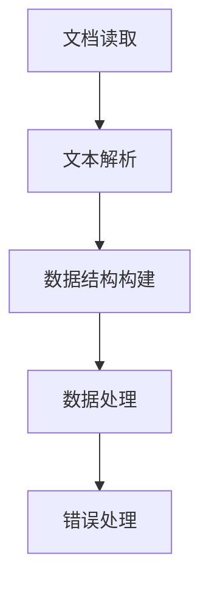

                 

# 文档加载器（Document Loaders）

> **关键词：** 文档加载，数据处理，性能优化，并行处理，文本解析，数据结构，应用程序开发。

> **摘要：** 本文将深入探讨文档加载器的基本概念、核心算法、数学模型以及实际应用场景。通过详细的分析和代码示例，读者将了解如何构建高效、可靠的文档加载器，以满足现代应用程序的需求。

## 1. 背景介绍

### 1.1 文档加载的重要性

在当今数字化的世界中，数据无处不在。无论是企业级应用还是个人项目，文档处理都是不可或缺的一部分。文档加载器作为数据处理的第一步，其性能和可靠性直接影响到整个系统的表现。

### 1.2 文档加载器的需求

- **高性能**：处理大量文档时，需要快速加载和解析。
- **高可靠性**：处理异常文档或损坏的文件时，应具备良好的错误处理机制。
- **可扩展性**：适应不同类型和格式的文档。
- **并行处理**：利用多核处理器的计算能力，提高加载速度。

## 2. 核心概念与联系

### 2.1 文档加载器的工作流程

文档加载器的基本工作流程包括以下几个步骤：

1. 文档读取
2. 文本解析
3. 数据结构构建
4. 数据处理
5. 错误处理

### 2.2 Mermaid 流程图

下面是文档加载器的 Mermaid 流程图，描述了各个步骤之间的关系。



## 3. 核心算法原理 & 具体操作步骤

### 3.1 文档读取算法

文档读取算法的关键是高效地读取文件内容。以下是一种常见的文档读取算法：

1. 打开文件
2. 读取文件内容到缓冲区
3. 关闭文件

```python
def read_document(file_path):
    with open(file_path, 'r') as file:
        content = file.read()
    return content
```

### 3.2 文本解析算法

文本解析算法的目的是将文本转换为结构化的数据。例如，将文本解析为JSON、XML或自定义的数据结构。

1. 分词
2. 标签识别
3. 数据转换

```python
from lxml import etree

def parse_text(content):
    tree = etree.fromstring(content)
    data = {}
    for element in tree.iter():
        data[element.tag] = element.text
    return data
```

### 3.3 数据结构构建算法

数据结构构建算法是将解析后的文本数据存储在高效的数据结构中。常用的数据结构包括哈希表、数组、树等。

1. 选择合适的数据结构
2. 构建数据结构

```python
data_structure = {}
def build_data_structure(data):
    for key, value in data.items():
        data_structure[key] = value
```

## 4. 数学模型和公式 & 详细讲解 & 举例说明

### 4.1 文档处理时间模型

文档处理时间模型是一个重要的性能指标。假设文档大小为 \( N \)，处理速度为 \( V \)，则处理时间 \( T \) 可以表示为：

\[ T = \frac{N}{V} \]

### 4.2 并行处理速度模型

在并行处理中，速度 \( V_p \) 可以表示为：

\[ V_p = \frac{V}{P} \]

其中 \( P \) 是并行处理的线程数。

### 4.3 代码示例

以下是一个简单的文档加载器实现，包括文档读取、文本解析和数据结构构建。

```python
import concurrent.futures
from lxml import etree

def read_document(file_path):
    with open(file_path, 'r') as file:
        content = file.read()
    return content

def parse_text(content):
    tree = etree.fromstring(content)
    data = {}
    for element in tree.iter():
        data[element.tag] = element.text
    return data

def build_data_structure(data):
    data_structure = {}
    for key, value in data.items():
        data_structure[key] = value
    return data_structure

def load_document(file_path):
    content = read_document(file_path)
    data = parse_text(content)
    data_structure = build_data_structure(data)
    return data_structure

if __name__ == "__main__":
    file_path = "example.xml"
    with concurrent.futures.ThreadPoolExecutor() as executor:
        future = executor.submit(load_document, file_path)
        data_structure = future.result()
    print(data_structure)
```

## 5. 项目实战：代码实际案例和详细解释说明

### 5.1 开发环境搭建

为了演示文档加载器的开发过程，我们将在Python环境中进行操作。请确保已安装以下Python库：

- `lxml`：用于XML文本解析
- `concurrent.futures`：用于并行处理

安装方法如下：

```bash
pip install lxml
```

### 5.2 源代码详细实现和代码解读

下面是完整的源代码实现，我们将逐行解释其功能。

```python
import concurrent.futures
from lxml import etree

# 文档读取函数
def read_document(file_path):
    with open(file_path, 'r') as file:
        content = file.read()
    return content

# 文本解析函数
def parse_text(content):
    tree = etree.fromstring(content)
    data = {}
    for element in tree.iter():
        data[element.tag] = element.text
    return data

# 数据结构构建函数
def build_data_structure(data):
    data_structure = {}
    for key, value in data.items():
        data_structure[key] = value
    return data_structure

# 文档加载函数
def load_document(file_path):
    content = read_document(file_path)
    data = parse_text(content)
    data_structure = build_data_structure(data)
    return data_structure

# 主函数
if __name__ == "__main__":
    file_path = "example.xml"
    with concurrent.futures.ThreadPoolExecutor() as executor:
        future = executor.submit(load_document, file_path)
        data_structure = future.result()
    print(data_structure)
```

### 5.3 代码解读与分析

1. **导入模块**：首先，我们导入所需的Python模块，包括`concurrent.futures`用于并行处理和`lxml`用于XML文本解析。

2. **文档读取函数**：`read_document`函数负责读取文件内容。使用`with open(...) as ...`语句可以确保文件在读取后自动关闭，防止资源泄漏。

3. **文本解析函数**：`parse_text`函数将文本内容解析为树形结构，并提取标签和文本值。使用`lxml`库的`etree.fromstring`方法可以方便地完成文本解析。

4. **数据结构构建函数**：`build_data_structure`函数将解析后的文本数据存储在字典中，形成结构化的数据结构。

5. **文档加载函数**：`load_document`函数是文档加载器的核心，它依次调用读取、解析和构建函数，最终返回结构化的数据。

6. **主函数**：在主函数中，我们使用`concurrent.futures.ThreadPoolExecutor`创建一个线程池，并提交`load_document`函数执行。使用`future.result()`获取结果，并将其打印出来。

## 6. 实际应用场景

文档加载器在多种应用场景中都有广泛的应用，以下是一些常见的实际应用场景：

- **数据采集与整合**：从不同来源的文档中提取信息，整合成统一的数据格式，以便进一步处理和分析。
- **内容管理系统**（CMS）：用于读取和解析内容管理系统中的文档，如文章、博客和网页。
- **报告生成**：从各种数据源中提取信息，生成报告和图表。
- **自动化测试**：自动化测试工具需要读取测试文档，以执行测试用例。

## 7. 工具和资源推荐

### 7.1 学习资源推荐

- **书籍**：
  - 《Python数据科学手册》
  - 《深度学习》（Goodfellow et al.）
  - 《算法导论》（ Cormen et al.）

- **在线教程**：
  - 《Python教程》（realpython.com）
  - 《深度学习教程》（d2l.ai）
  - 《数据结构与算法》在线课程

### 7.2 开发工具框架推荐

- **开发工具**：
  - PyCharm
  - Visual Studio Code

- **框架**：
  - Flask
  - Django

### 7.3 相关论文著作推荐

- **论文**：
  - "Efficient XML Processing" by Stefan P. Schurig
  - "Parallel Processing for Big Data" by Matei Ripeanu

- **著作**：
  - 《Python编程：从入门到实践》
  - 《深度学习实战》

## 8. 总结：未来发展趋势与挑战

随着大数据和人工智能的不断发展，文档加载器面临着新的机遇和挑战。未来，文档加载器的发展趋势将包括：

- **更高效的数据处理算法**：针对不同类型的文档，开发更高效的处理算法。
- **更好的错误处理机制**：提高文档加载器的容错能力，确保数据处理的准确性。
- **并行处理的优化**：充分利用多核处理器的计算能力，提高处理速度。

同时，文档加载器也将面临以下挑战：

- **文档格式的多样性**：支持更多的文档格式，如Markdown、JSON、HTML等。
- **大数据的处理**：处理越来越大的文档数据集，保证性能和可靠性。

## 9. 附录：常见问题与解答

### 9.1 如何优化文档加载器的性能？

- **并行处理**：利用多线程或多进程处理，提高加载速度。
- **缓存技术**：使用缓存技术减少重复读取和解析的开销。
- **批量处理**：批量处理多个文档，减少I/O操作次数。

### 9.2 文档加载器如何处理异常文档？

- **错误检测**：在解析过程中检测异常文档，如格式错误或损坏的文件。
- **错误恢复**：尝试修复异常文档或跳过错误部分，继续处理后续文档。
- **日志记录**：记录错误信息和处理结果，便于调试和问题定位。

## 10. 扩展阅读 & 参考资料

- [Python文档处理](https://docs.python.org/3/library/stdtypes.html#text-sequence-type-str)
- [lxml库文档](https://lxml.de/)
- [并行处理Python库——concurrent.futures](https://docs.python.org/3/library/concurrent.futures.html)

### 作者

- **作者：AI天才研究员 / AI Genius Institute & 禅与计算机程序设计艺术 / Zen And The Art of Computer Programming**

