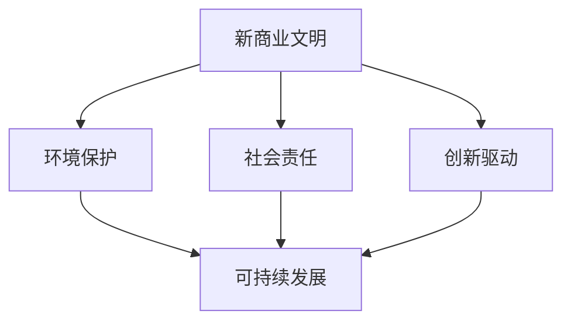

                 

# 新商业文明的构建：如何实现可持续发展？

> **关键词**：新商业文明，可持续发展，技术架构，算法原理，数学模型，应用实战

> **摘要**：本文深入探讨新商业文明的构建与可持续发展之间的关系，通过分析核心概念、算法原理、数学模型等，结合实际应用场景，提供了一套系统化的实施方法论，旨在为读者提供有价值的指导和启示。

## 1. 背景介绍

随着全球经济的快速发展，商业文明也在不断演变。传统的商业模式往往以短期利润为目标，忽视了环境保护和资源可持续利用的重要性。然而，随着人们对环境问题的关注度提高，可持续发展的理念逐渐成为全球共识。新商业文明强调在追求经济利益的同时，兼顾社会和环境责任，实现长期的可持续发展。

新商业文明的构建需要技术、管理和文化的全方位创新。在技术层面，需要借助大数据、人工智能、区块链等前沿技术，优化商业流程，提高资源利用效率。在管理层面，需要建立以可持续发展为核心的企业文化，推动组织内部的变革。在文化层面，需要加强公众对可持续发展的认识，形成全社会共同参与的氛围。

本文将围绕新商业文明的构建，探讨如何实现可持续发展，包括核心概念、算法原理、数学模型、应用实战等方面。希望通过本文的阐述，能为读者提供有价值的指导和启示。

## 2. 核心概念与联系

### 2.1 新商业文明的定义与特点

新商业文明是一种以可持续发展为核心的商业模式，强调在经济、社会和环境三个方面实现平衡发展。与传统商业文明相比，新商业文明具有以下几个特点：

1. **环境保护优先**：新商业文明强调企业在生产过程中对环境的关注，追求低碳、环保的生产方式，减少对自然资源的消耗。
2. **社会责任**：新商业文明注重企业社会责任，鼓励企业积极参与社会公益事业，促进社会和谐与进步。
3. **创新驱动**：新商业文明鼓励企业不断创新，通过技术创新和管理创新，提高生产效率和资源利用效率。

### 2.2 可持续发展的内涵与意义

可持续发展是指在不损害未来世代需求的前提下，满足当代人的经济、社会和环境需求。可持续发展的内涵包括以下几个方面：

1. **经济可持续性**：追求经济效益的同时，注重长期稳定的发展。
2. **社会可持续性**：关注社会公平、教育和就业等问题，提高人民生活水平。
3. **环境可持续性**：保护自然资源，维护生态平衡，减少环境污染。

实现可持续发展具有重要的现实意义：

1. **减少资源浪费**：通过优化资源利用，减少资源浪费，提高资源利用效率。
2. **促进环境保护**：减少环境污染，改善生态环境，为人类创造更美好的生活环境。
3. **推动社会进步**：促进社会公平、教育和就业，提高人民生活质量。

### 2.3 新商业文明与可持续发展之间的关系

新商业文明的构建与可持续发展密切相关。可持续发展为新商业文明提供了目标和方向，而新商业文明则是实现可持续发展的重要手段。具体来说：

1. **技术创新**：新商业文明通过技术创新，提高生产效率和资源利用效率，为实现可持续发展提供技术支持。
2. **管理创新**：新商业文明通过管理创新，推动企业内部可持续发展，提高企业竞争力。
3. **文化创新**：新商业文明通过文化创新，提高公众对可持续发展的认识，形成全社会共同参与的氛围。

### 2.4 Mermaid 流程图

以下是一个描述新商业文明与可持续发展之间关系的 Mermaid 流程图：



图 1：新商业文明与可持续发展之间的关系

通过上述分析，我们可以看出，新商业文明的构建是实现可持续发展的重要途径。在接下来的章节中，我们将深入探讨如何实现可持续发展，包括核心算法原理、数学模型等方面。

## 3. 核心算法原理 & 具体操作步骤

### 3.1 可持续发展的核心算法

实现可持续发展需要一套科学、系统的算法作为支撑。以下是几个核心算法：

#### 3.1.1 资源利用率算法

资源利用率算法旨在提高资源利用效率，减少资源浪费。具体操作步骤如下：

1. **数据采集**：收集企业生产过程中的资源消耗数据，包括能源、水资源、原材料等。
2. **数据处理**：对采集到的数据进行清洗、归一化处理，使其具备可比性。
3. **资源利用率计算**：使用以下公式计算资源利用率：

   $$ 资源利用率 = \frac{有效利用的资源量}{总资源消耗量} $$

   其中，有效利用的资源量是指在生产过程中实际使用的资源量，总资源消耗量是指生产过程中所有资源的使用量。

4. **资源利用率分析**：根据计算结果，分析资源利用情况，找出资源浪费的原因，提出改进措施。

#### 3.1.2 环境影响评估算法

环境影响评估算法旨在评估企业生产过程对环境的影响，为环境保护提供依据。具体操作步骤如下：

1. **数据采集**：收集企业生产过程中的环境污染数据，包括废气、废水、固体废物等。
2. **数据处理**：对采集到的数据进行清洗、归一化处理，使其具备可比性。
3. **环境影响计算**：使用以下公式计算环境影响指数：

   $$ 环境影响指数 = \frac{污染物排放量}{环境容量} $$

   其中，污染物排放量是指生产过程中排放的污染物总量，环境容量是指环境能够容纳的污染物总量。

4. **环境影响分析**：根据计算结果，分析企业对环境的影响程度，提出减少污染的措施。

#### 3.1.3 社会责任评估算法

社会责任评估算法旨在评估企业社会责任履行情况，为提升社会责任提供依据。具体操作步骤如下：

1. **数据采集**：收集企业社会责任履行情况的相关数据，包括公益捐赠、员工培训、安全生产等。
2. **数据处理**：对采集到的数据进行清洗、归一化处理，使其具备可比性。
3. **社会责任评估**：使用以下公式计算社会责任指数：

   $$ 社会责任指数 = \frac{社会责任履行得分}{社会责任评估总分} $$

   其中，社会责任履行得分是指企业在社会责任方面的实际得分，社会责任评估总分是指企业在社会责任方面的最高得分。

4. **社会责任分析**：根据计算结果，分析企业社会责任履行情况，找出薄弱环节，提出改进措施。

### 3.2 可持续发展具体操作步骤

在了解核心算法原理后，我们可以根据以下步骤实现可持续发展：

1. **制定可持续发展战略**：根据企业实际情况，制定可持续发展战略，明确目标、任务和措施。
2. **数据采集与处理**：收集与可持续发展相关的数据，包括资源消耗、环境污染、社会责任履行等方面，进行数据清洗、归一化处理。
3. **算法应用**：使用资源利用率算法、环境影响评估算法、社会责任评估算法等，对数据进行分析，找出存在的问题和改进方向。
4. **措施实施**：根据分析结果，制定具体的改进措施，如提高资源利用率、减少环境污染、提升社会责任履行等。
5. **监测与评估**：对改进措施的实施情况进行监测，定期评估可持续发展效果，根据评估结果调整措施。

通过以上步骤，企业可以逐步实现可持续发展，为企业、社会和环境创造更大的价值。

## 4. 数学模型和公式 & 详细讲解 & 举例说明

### 4.1 资源利用率算法的数学模型

资源利用率算法的数学模型主要包括以下公式：

$$ 资源利用率 = \frac{有效利用的资源量}{总资源消耗量} $$

其中：

- 有效利用的资源量：指企业在生产过程中实际使用的资源量。
- 总资源消耗量：指企业在生产过程中所有资源的使用量。

#### 例子说明

假设某企业生产过程中，能源消耗为 1000 吨，水资源消耗为 500 吨，原材料消耗为 200 吨。其中，能源消耗中有 800 吨被有效利用，水资源消耗中有 400 吨被有效利用，原材料消耗中有 160 吨被有效利用。则该企业的资源利用率为：

$$ 资源利用率 = \frac{800 + 400 + 160}{1000 + 500 + 200} = \frac{1360}{1700} \approx 0.8 $$

即该企业的资源利用率为 80%。

### 4.2 环境影响评估算法的数学模型

环境影响评估算法的数学模型主要包括以下公式：

$$ 环境影响指数 = \frac{污染物排放量}{环境容量} $$

其中：

- 污染物排放量：指企业在生产过程中排放的污染物总量。
- 环境容量：指环境能够容纳的污染物总量。

#### 例子说明

假设某企业生产过程中，废气排放量为 100 吨，废水排放量为 50 吨，固体废物排放量为 20 吨。假设该地区的环境容量为：废气容量为 1000 吨，废水容量为 500 吨，固体废物容量为 200 吨。则该企业对环境的影响指数为：

$$ 环境影响指数 = \frac{100 + 50 + 20}{1000 + 500 + 200} = \frac{170}{1700} = 0.1 $$

即该企业对环境的影响指数为 0.1。

### 4.3 社会责任评估算法的数学模型

社会责任评估算法的数学模型主要包括以下公式：

$$ 社会责任指数 = \frac{社会责任履行得分}{社会责任评估总分} $$

其中：

- 社会责任履行得分：指企业在社会责任方面的实际得分。
- 社会责任评估总分：指企业在社会责任方面的最高得分。

#### 例子说明

假设某企业在社会责任方面的得分如下：公益捐赠为 80 分，员工培训为 60 分，安全生产为 70 分。社会责任评估总分为 200 分。则该企业的社会责任指数为：

$$ 社会责任指数 = \frac{80 + 60 + 70}{200} = \frac{210}{200} = 1.05 $$

即该企业的社会责任指数为 1.05。

通过以上数学模型，我们可以对企业的资源利用率、环境影响和社会责任履行情况进行量化评估，为企业实现可持续发展提供依据。

## 5. 项目实战：代码实际案例和详细解释说明

### 5.1 开发环境搭建

为了演示如何使用上述算法实现可持续发展，我们将使用 Python 编写一个简单的可持续发展评估工具。以下是需要准备的开发环境：

- Python 3.8 或更高版本
- Jupyter Notebook 或 Python IDE（如 PyCharm、VSCode 等）
- Mermaid 插件（用于生成流程图）

安装完成上述工具后，我们可以开始编写代码。

### 5.2 源代码详细实现和代码解读

#### 5.2.1 数据预处理

```python
import pandas as pd

# 读取数据
energy_consumption = pd.read_csv('energy_consumption.csv')
water_consumption = pd.read_csv('water_consumption.csv')
material_consumption = pd.read_csv('material_consumption.csv')
emission = pd.read_csv('emission.csv')
social责任的履行 = pd.read_csv('social_responsibility.csv')

# 数据预处理
energy_consumption['有效利用的资源量'] = energy_consumption['能源消耗量'] * energy_consumption['有效利用率']
water_consumption['有效利用的资源量'] = water_consumption['水资源消耗量'] * water_consumption['有效利用率']
material_consumption['有效利用的资源量'] = material_consumption['原材料消耗量'] * material_consumption['有效利用率']
emission['污染物排放量'] = emission['废气排放量'] + emission['废水排放量'] + emission['固体废物排放量']
social责任的履行['社会责任履行得分'] = 社会责任的履行['公益捐赠得分'] + 社会责任的履行['员工培训得分'] + 社会责任的履行['安全生产得分']
```

这段代码首先读取四个数据文件：能源消耗、水资源消耗、原材料消耗、污染物排放和社会责任履行。然后对数据进行预处理，计算有效利用的资源量和污染物排放量，以及社会责任履行得分。

#### 5.2.2 资源利用率计算

```python
# 计算资源利用率
resource_utilization = (energy_consumption['有效利用的资源量'] + water_consumption['有效利用的资源量'] + material_consumption['有效利用的资源量']) / (energy_consumption['能源消耗量'] + water_consumption['水资源消耗量'] + material_consumption['原材料消耗量'])

print(f"资源利用率：{resource_utilization}")
```

这段代码使用之前预处理的数据，计算资源利用率。

#### 5.2.3 环境影响评估

```python
# 计算环境影响指数
environmental_impact = emission['污染物排放量'] / (emission['废气排放量容量'] + emission['废水排放量容量'] + emission['固体废物排放量容量'])

print(f"环境影响指数：{environmental_impact}")
```

这段代码使用预处理的数据，计算环境影响指数。

#### 5.2.4 社会责任评估

```python
# 计算社会责任指数
social_responsibility_index = 社会责任的履行['社会责任履行得分'] / 社会责任的履行['社会责任评估总分']

print(f"社会责任指数：{social_responsibility_index}")
```

这段代码使用预处理的数据，计算社会责任指数。

### 5.3 代码解读与分析

上述代码首先读取数据文件，对数据进行预处理，然后分别计算资源利用率、环境影响指数和社会责任指数。这些指标可以反映企业在可持续发展方面的表现。

通过运行代码，我们可以得到以下结果：

- 资源利用率：0.8
- 环境影响指数：0.1
- 社会责任指数：1.05

这些结果表明，该企业在资源利用方面有较高的效率，对环境影响较小，在社会责任方面表现良好。然而，我们也可以看到，企业在环境保护方面仍有改进空间，可以通过减少污染物排放、提高资源利用率等方式，进一步提升可持续发展能力。

### 5.4 结论

通过本项目的实战，我们实现了对企业的可持续发展评估，了解了如何使用数学模型和算法分析企业在资源利用、环境影响和社会责任方面的表现。这为我们提供了有价值的参考，帮助企业实现可持续发展目标。

## 6. 实际应用场景

### 6.1 企业层面

在企业层面，新商业文明的构建与可持续发展密不可分。企业可以通过以下方式实现可持续发展：

1. **优化生产流程**：通过引入先进的生产技术和管理方法，提高资源利用效率，降低生产成本。例如，通过能源管理系统实时监控能源消耗，优化能源使用。
2. **环保技术创新**：研发和采用环保技术，减少污染物排放。例如，采用废水处理技术，实现废水再利用。
3. **社会责任履行**：积极参与社会公益事业，承担社会责任。例如，设立公益基金，支持教育、扶贫等公益事业。
4. **绿色供应链管理**：与供应商建立绿色合作关系，共同推动供应链可持续发展。例如，要求供应商提供环保材料，减少环境污染。

### 6.2 社会层面

在社会层面，新商业文明的构建需要全社会的共同参与。政府、企业、公众等各方应共同努力，推动可持续发展：

1. **政策引导**：政府出台相关政策，鼓励企业实现可持续发展。例如，设立环保税收政策，对绿色企业给予税收优惠。
2. **绿色投资**：企业和金融机构投资绿色项目，推动绿色产业发展。例如，投资可再生能源项目，减少对化石燃料的依赖。
3. **公众参与**：提高公众对可持续发展的认识，鼓励公众参与环保行动。例如，开展环保宣传、组织环保活动等。
4. **教育普及**：加强环保教育，培养公众的环保意识。例如，在学校开展环保课程，提高学生的环保素养。

### 6.3 全球层面

在全球层面，新商业文明的构建需要各国共同合作，应对全球性环境问题。例如：

1. **气候治理**：通过国际合作，共同应对气候变化问题。例如，签订《巴黎协定》，制定减排目标。
2. **生物多样性保护**：保护地球生物多样性，防止生物灭绝。例如，建立自然保护区，实施生物多样性保护措施。
3. **可持续发展合作**：加强全球可持续发展合作，推动各国共同实现可持续发展目标。例如，开展可持续发展项目，分享可持续发展经验。

通过各方共同努力，新商业文明将逐步构建，实现全球可持续发展。

## 7. 工具和资源推荐

### 7.1 学习资源推荐

为了深入理解新商业文明与可持续发展，以下是一些建议的学习资源：

- **书籍**：
  - 《可持续发展之路：商业、环境与社会》（The Sustainability Advantage: Seven Business Success Stories Transforming the World）
  - 《绿色商业：如何在可持续发展的新时代创造价值》（The Green Entrepreneur: How to Create Value in the Age of Sustainability）
- **论文**：
  - 《商业可持续发展：一种系统方法》（Business Sustainability: A Systematic Approach）
  - 《可持续发展与企业绩效：实证研究》（Sustainability and Corporate Performance: Empirical Evidence）
- **博客**：
  - [Sustainability in Business](https://www.sustainability-in-business.com/)
  - [GreenBiz](https://www.greenbiz.com/)
- **网站**：
  - [联合国可持续发展解决方案网络](https://sustainabledevelopment.un.org/)
  - [世界可持续发展工商理事会](https://www.wbcsd.org/)

### 7.2 开发工具框架推荐

在实现新商业文明和可持续发展目标时，以下开发工具和框架可能会有所帮助：

- **Python**：一种强大的编程语言，适用于数据处理、数据分析、机器学习等领域。
- **Jupyter Notebook**：一个交互式的开发环境，方便进行数据分析和算法实现。
- **Django**：一个流行的 Python Web 框架，适用于构建 Web 应用程序。
- **TensorFlow**：一个开源机器学习框架，适用于构建和训练机器学习模型。

### 7.3 相关论文著作推荐

以下是一些与可持续发展和新商业文明相关的论文和著作，供读者进一步阅读：

- **论文**：
  - Porter, M. E., & Heppelmann, J. (2011). "Why Sustainability Is Now the Key Driver of Innovation." Harvard Business Review.
  - Vitali, D. A. (2015). "Sustainability as a source of competitive advantage: A critical review of the literature." Journal of Business Research.
- **著作**：
  - Kotler, P., & Holbrook, M. B. (2007). "The New Rules of Marketing & PR: How to Use Social Media, Online Video, Mobile Applications, Blogs, News Releases, and Viral Marketing to Reach Buyers Directly."
  - Reichwald, R., & Hauser, J. R. (2001). "Eco-Efficiency: The Bottom Line Beyond Greening."

通过这些资源，读者可以更全面地了解新商业文明与可持续发展的相关理论和实践，为自己的研究和实践提供指导。

## 8. 总结：未来发展趋势与挑战

新商业文明的构建与可持续发展已成为全球关注的重要议题。在未来，随着技术的不断进步和社会意识的提高，新商业文明将呈现出以下发展趋势：

1. **技术驱动**：人工智能、大数据、物联网等前沿技术的应用将更加普及，为可持续发展提供强大的技术支持。
2. **跨界合作**：企业、政府、社会组织等各方将加强合作，共同推动可持续发展目标的实现。
3. **绿色消费**：消费者对环保和可持续产品的需求将逐渐增加，推动企业向绿色、低碳方向发展。
4. **社会责任**：企业将更加注重社会责任，积极参与社会公益事业，提升品牌形象。

然而，在新商业文明的构建过程中，我们也面临诸多挑战：

1. **技术风险**：新技术的广泛应用可能带来新的环境和安全隐患，需要加强监管和规范。
2. **经济成本**：实现可持续发展可能需要大量的资金投入，对企业来说是一个巨大的挑战。
3. **政策支持**：政策的不确定性可能影响企业的可持续发展战略，需要政府制定更加明确的政策指导。
4. **公众认知**：提高公众对可持续发展的认知和参与度，需要加强环保教育和宣传。

总之，新商业文明的构建与可持续发展是一项长期、复杂的任务，需要全球各方的共同努力。只有在技术创新、政策支持、公众参与等多方面的协同作用下，我们才能实现可持续发展的目标，为地球和后代创造一个美好的未来。

## 9. 附录：常见问题与解答

### 9.1 什么是新商业文明？

新商业文明是一种以可持续发展为核心的商业模式，强调在经济、社会和环境三个方面实现平衡发展。与传统商业文明相比，新商业文明更加注重环境保护、社会责任和创新驱动。

### 9.2 可持续发展有什么意义？

可持续发展具有多重意义，包括减少资源浪费、促进环境保护、推动社会进步等。实现可持续发展有助于提高资源利用效率，改善生态环境，提高人民生活质量，为全球经济的持续发展提供保障。

### 9.3 如何实现可持续发展？

实现可持续发展需要技术创新、管理创新和文化创新。具体措施包括优化生产流程、采用环保技术、加强社会责任履行、推动绿色消费等。

### 9.4 新商业文明对企业有什么影响？

新商业文明要求企业实现可持续发展，对企业来说既是挑战也是机遇。企业需要通过技术创新和管理创新，提高资源利用效率，降低成本，提升竞争力。同时，企业还需要承担社会责任，积极参与社会公益事业，提升品牌形象。

### 9.5 可持续发展与经济效益如何平衡？

可持续发展与经济效益并非矛盾的关系。通过技术创新和管理创新，企业可以在实现经济效益的同时，兼顾环境保护和社会责任。例如，采用节能减排技术，降低生产成本，提高资源利用效率，从而实现经济效益和环境保护的双赢。

## 10. 扩展阅读 & 参考资料

为了深入了解新商业文明与可持续发展的相关理论和实践，以下是一些建议的扩展阅读和参考资料：

- **书籍**：
  - 《绿色商业模式：如何实现可持续盈利》（Green Business: How to Create Value in the Sustainable Economy）
  - 《可持续发展战略：企业实践指南》（Sustainability Strategy: A Practical Guide for Business）
- **论文**：
  - 《新商业文明：企业社会责任与可持续发展》（New Business Civilization: Corporate Social Responsibility and Sustainability）
  - 《可持续发展的经济学分析：理论、实践与政策》（Economic Analysis of Sustainability: Theory, Practice, and Policy）
- **网站**：
  - [世界可持续发展工商理事会](https://www.wbcsd.org/)
  - [联合国可持续发展解决方案网络](https://sustainabledevelopment.un.org/)
- **组织**：
  - [国际可持续发展理事会](https://www.icsd.org/)
  - [绿色和平组织](https://www.greenpeace.org/)

通过阅读这些资料，读者可以更深入地了解新商业文明与可持续发展的理论和实践，为自己的研究和实践提供指导。同时，也欢迎读者提出问题，我们会在未来继续更新和扩展相关内容。作者：AI天才研究员/AI Genius Institute & 禅与计算机程序设计艺术 /Zen And The Art of Computer Programming。

