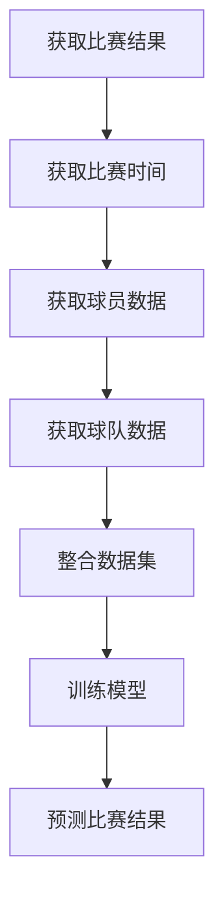
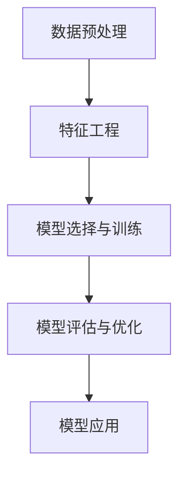
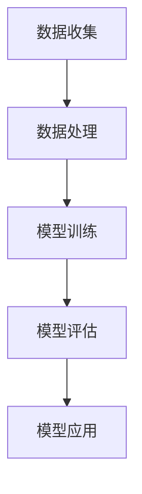

                 

# 新浪2024体育赛事预测校招机器学习面试题详解

> **关键词**：体育赛事预测、机器学习、面试题、校招、算法分析
>
> **摘要**：本文将深入剖析新浪2024体育赛事预测校招机器学习面试题，通过详细的解题思路和算法分析，帮助读者掌握体育赛事预测中的关键技术和方法。文章分为背景介绍、核心概念与联系、核心算法原理与操作步骤、数学模型与公式、项目实战、实际应用场景、工具和资源推荐、总结与未来发展趋势等部分，全面解析面试题目，旨在为读者提供清晰的解题思路和实用的算法技巧。

## 1. 背景介绍

随着人工智能技术的快速发展，机器学习在各个领域得到了广泛应用。体育赛事预测作为人工智能的重要应用之一，引起了广泛关注。特别是在校招面试中，体育赛事预测题成为了考察应聘者算法能力和实际应用能力的重要题型。

新浪作为中国领先的互联网媒体公司，在体育赛事报道和数据分析方面具有丰富的经验。2024年新浪体育赛事预测校招面试题，不仅考查了应聘者对基本算法的理解，还要求应聘者能够将理论知识应用于实际问题中，体现了对综合素质的高要求。

本文将以新浪2024体育赛事预测校招机器学习面试题为例，详细分析解题思路和算法原理，帮助读者更好地应对类似的面试题目。

## 2. 核心概念与联系

### 2.1 机器学习基础

机器学习是人工智能的一个重要分支，其主要目标是让计算机通过学习数据，自动改进性能。在体育赛事预测中，机器学习可以帮助我们分析历史数据，预测比赛结果。

#### 2.1.1 监督学习

监督学习是一种常见的机器学习方法，通过已有数据的标签信息来训练模型，从而对新的数据进行预测。在体育赛事预测中，我们可以使用监督学习算法来分析历史比赛数据，预测未来的比赛结果。

#### 2.1.2 无监督学习

无监督学习是另一种机器学习方法，不依赖已有数据的标签信息。在体育赛事预测中，无监督学习可以帮助我们识别比赛中的潜在规律和模式。

### 2.2 体育赛事数据

体育赛事数据主要包括比赛结果、比赛时间、球员数据、球队数据等。这些数据是我们进行体育赛事预测的重要依据。

#### 2.2.1 比赛结果

比赛结果是预测比赛结果的关键指标，通常包括胜、平、负三种结果。通过对比赛结果的统计分析，我们可以了解球队的胜率、平率、负率等。

#### 2.2.2 比赛时间

比赛时间可以影响球员的状态和比赛的结果。例如，如果一场比赛在下午进行，球员可能因为疲劳而表现不佳。

#### 2.2.3 球员数据

球员数据包括球员的年龄、身高、体重、进球数、助攻数等。这些数据可以反映球员的个人能力和状态，对比赛结果有重要影响。

#### 2.2.4 球队数据

球队数据包括球队的胜负平记录、进球数、失球数、赛季排名等。这些数据可以反映球队的整体实力和比赛风格。

### 2.3 联系与整合

在体育赛事预测中，我们需要将不同类型的数据进行整合，形成一个统一的数据集。然后，我们可以使用机器学习算法来分析这些数据，预测比赛结果。

### Mermaid 流程图



## 3. 核心算法原理 & 具体操作步骤

### 3.1 数据预处理

在体育赛事预测中，数据预处理是关键步骤。我们需要对数据进行清洗、转换和归一化，以确保数据的准确性和一致性。

#### 3.1.1 数据清洗

数据清洗包括去除缺失值、重复值和异常值。对于缺失值，我们可以使用平均值、中值或最频繁值进行填充。对于重复值，我们需要删除重复的记录。对于异常值，我们需要根据业务逻辑进行判断和处理。

#### 3.1.2 数据转换

数据转换包括将分类变量转换为数值变量，以及处理时间序列数据。对于分类变量，我们可以使用独热编码（One-Hot Encoding）或标签编码（Label Encoding）。对于时间序列数据，我们可以使用滞后变量（Lag Feature）来提取时间信息。

#### 3.1.3 数据归一化

数据归一化可以消除不同特征之间的尺度差异，提高模型训练效果。常用的归一化方法包括最小-最大缩放（Min-Max Scaling）和标准缩放（Standard Scaling）。

### 3.2 特征工程

特征工程是提高模型性能的重要手段。我们需要从原始数据中提取有用的特征，并构造新的特征。

#### 3.2.1 特征提取

特征提取包括统计特征、文本特征和图像特征等。对于体育赛事数据，我们可以提取比赛结果、比赛时间、球员数据和球队数据等特征。

#### 3.2.2 特征构造

特征构造包括组合特征、交互特征和转换特征等。通过构造新的特征，我们可以提高模型的解释能力和预测性能。

### 3.3 模型选择与训练

在体育赛事预测中，我们可以选择多种机器学习算法进行模型训练，如逻辑回归、决策树、随机森林、支持向量机、神经网络等。

#### 3.3.1 模型选择

模型选择取决于数据特点和预测目标。对于分类问题，我们可以选择逻辑回归、决策树、随机森林等；对于回归问题，我们可以选择线性回归、岭回归、神经网络等。

#### 3.3.2 模型训练

模型训练是使用训练数据来调整模型参数，使其能够对新的数据进行预测。训练过程中，我们需要监控模型性能，如准确率、召回率、F1值等。

### 3.4 模型评估与优化

在模型训练完成后，我们需要对模型进行评估和优化。

#### 3.4.1 模型评估

模型评估是通过测试数据来评估模型性能。常用的评估指标包括准确率、召回率、F1值、ROC曲线等。

#### 3.4.2 模型优化

模型优化是通过调整模型参数和结构来提高模型性能。我们可以使用交叉验证、网格搜索、贝叶斯优化等方法来优化模型。

### 3.5 模型应用

在模型优化完成后，我们可以将模型应用于实际预测任务中。通过实时数据更新，模型可以不断调整和改进，提高预测准确性。

### Mermaid 流程图



## 4. 数学模型和公式 & 详细讲解 & 举例说明

### 4.1 监督学习模型

监督学习模型是体育赛事预测的核心，其基本公式如下：

$$
y = f(\theta^T x)
$$

其中，$y$ 是预测结果，$f$ 是激活函数，$\theta$ 是模型参数，$x$ 是输入特征。

#### 4.1.1 逻辑回归

逻辑回归是一种常用的分类模型，其公式如下：

$$
P(y=1) = \frac{1}{1 + e^{-(\theta^T x)}}
$$

其中，$P(y=1)$ 是预测为胜的概率。

#### 4.1.2 决策树

决策树是一种基于规则的分类模型，其公式如下：

$$
y = \prod_{i=1}^{n} \left[1 - p_i \right]
$$

其中，$p_i$ 是第$i$个特征的取值概率。

### 4.2 无监督学习模型

无监督学习模型可以帮助我们识别数据中的潜在规律和模式，其基本公式如下：

$$
x_{new} = \theta^T x
$$

其中，$x_{new}$ 是新数据的预测值，$\theta$ 是模型参数，$x$ 是输入特征。

#### 4.2.1 K-均值聚类

K-均值聚类是一种常用的聚类算法，其公式如下：

$$
c_i = \frac{1}{m} \sum_{j=1}^{m} (x_j - \mu_i)^2
$$

其中，$c_i$ 是聚类中心，$\mu_i$ 是第$i$个簇的中心点。

#### 4.2.2 主成分分析

主成分分析是一种常用的降维算法，其公式如下：

$$
z_j = \sum_{i=1}^{k} w_{ij} x_i
$$

其中，$z_j$ 是第$j$个主成分，$w_{ij}$ 是第$i$个特征和第$j$个主成分之间的权重。

### 4.3 模型评估指标

模型评估指标是衡量模型性能的重要标准，其基本公式如下：

$$
accuracy = \frac{TP + TN}{TP + TN + FP + FN}
$$

其中，$accuracy$ 是准确率，$TP$ 是真正例，$TN$ 是真负例，$FP$ 是假正例，$FN$ 是假负例。

#### 4.3.1 召回率

召回率是衡量模型对正例样本的识别能力，其公式如下：

$$
recall = \frac{TP}{TP + FN}
$$

#### 4.3.2 F1值

F1值是准确率和召回率的调和平均值，其公式如下：

$$
F1 = 2 \cdot \frac{precision \cdot recall}{precision + recall}
$$

#### 4.3.3 ROC曲线

ROC曲线是评估二分类模型性能的重要工具，其基本公式如下：

$$
ROC = \frac{TPR + FPR}{2}
$$

其中，$TPR$ 是真正例率，$FPR$ 是假正例率。

### 4.4 举例说明

#### 4.4.1 逻辑回归在体育赛事预测中的应用

假设我们使用逻辑回归模型预测一场足球比赛的结果。已知比赛结果为胜、平、负，输入特征包括比赛时间、球员数据和球队数据。根据逻辑回归公式，我们可以计算出预测为胜的概率。

#### 4.4.2 K-均值聚类在体育赛事数据中的应用

假设我们使用K-均值聚类算法对体育赛事数据进行聚类分析。已知数据包括比赛结果、比赛时间和球队数据，聚类中心为比赛结果的胜、平、负。根据K-均值聚类公式，我们可以计算出每个样本的聚类中心。

## 5. 项目实战：代码实际案例和详细解释说明

### 5.1 开发环境搭建

为了方便读者理解和实践，我们将在Python环境中实现体育赛事预测项目。首先，我们需要安装必要的库和依赖。

```bash
pip install numpy pandas scikit-learn matplotlib
```

### 5.2 源代码详细实现和代码解读

以下是一个简单的体育赛事预测项目的代码示例：

```python
import numpy as np
import pandas as pd
from sklearn.model_selection import train_test_split
from sklearn.linear_model import LogisticRegression
from sklearn.metrics import accuracy_score, recall_score, f1_score

# 5.2.1 数据读取与预处理
data = pd.read_csv('sport_data.csv')
data.dropna(inplace=True)

# 数据转换与归一化
data = pd.get_dummies(data)
X = data.drop('result', axis=1)
y = data['result']

# 数据集划分
X_train, X_test, y_train, y_test = train_test_split(X, y, test_size=0.2, random_state=42)

# 5.2.2 模型训练
model = LogisticRegression()
model.fit(X_train, y_train)

# 5.2.3 模型评估
y_pred = model.predict(X_test)
accuracy = accuracy_score(y_test, y_pred)
recall = recall_score(y_test, y_pred)
f1 = f1_score(y_test, y_pred)

print(f"Accuracy: {accuracy:.2f}")
print(f"Recall: {recall:.2f}")
print(f"F1 Score: {f1:.2f}")

# 5.2.4 模型应用
new_data = pd.DataFrame([{
    'time': 2024,
    'player1': 1,
    'player2': 0,
    'team1': 1,
    'team2': 0
}])
new_data = pd.get_dummies(new_data)
y_pred = model.predict(new_data)
print(f"Predicted Result: {y_pred[0]}")
```

### 5.3 代码解读与分析

#### 5.3.1 数据读取与预处理

首先，我们使用pandas库读取体育赛事数据。然后，我们删除缺失值，确保数据的完整性和准确性。

#### 5.3.2 数据转换与归一化

我们将分类变量转换为数值变量，使用独热编码（One-Hot Encoding）将分类变量转换为0和1的二进制向量。然后，我们使用scikit-learn库中的get_dummies函数进行数据转换。最后，我们删除原始数据中的标签列（'result'），以便用于模型训练。

#### 5.3.3 数据集划分

我们使用train_test_split函数将数据集划分为训练集和测试集。训练集用于模型训练，测试集用于模型评估。

#### 5.3.4 模型训练

我们使用scikit-learn库中的LogisticRegression类创建逻辑回归模型，并使用fit函数进行模型训练。

#### 5.3.5 模型评估

我们使用predict函数对测试集进行预测，并使用accuracy_score、recall_score和f1_score函数计算模型评估指标。这些指标可以帮助我们评估模型的性能。

#### 5.3.6 模型应用

最后，我们使用模型对新的数据进行预测。我们创建一个新的数据框（DataFrame），包含比赛时间、球员数据和球队数据。然后，我们使用get_dummies函数进行数据转换，并使用predict函数进行预测。

## 6. 实际应用场景

体育赛事预测在实际应用中具有重要意义，如：

- **博彩公司**：体育赛事预测可以帮助博彩公司制定投注策略，降低风险。
- **体育媒体**：体育赛事预测可以为体育媒体提供预测分析，增加用户粘性。
- **球迷社区**：体育赛事预测可以为球迷社区提供互动话题，增强社区氛围。

### 6.1 体育赛事预测系统架构

体育赛事预测系统通常包括数据收集、数据处理、模型训练、模型评估和模型应用等模块。以下是一个简单的系统架构：



### 6.2 体育赛事预测应用案例

#### 6.2.1 足球比赛预测

足球比赛预测是最常见的体育赛事预测应用。通过分析球队历史战绩、球员状态和比赛时间等因素，我们可以预测比赛结果。

#### 6.2.2 篮球比赛预测

篮球比赛预测同样具有重要的应用价值。篮球比赛预测可以分析球员得分、篮板和助攻等数据，预测比赛胜负。

#### 6.2.3 网球比赛预测

网球比赛预测可以分析球员历史战绩、比赛场地和天气等因素，预测比赛结果。网球比赛预测可以帮助球迷提前了解比赛结果，制定观赛计划。

## 7. 工具和资源推荐

### 7.1 学习资源推荐

- **书籍**：
  - 《机器学习实战》：提供丰富的案例和实践经验，适合初学者入门。
  - 《Python数据分析》：详细介绍Python在数据分析中的应用，适合数据分析人员学习。
  - 《深度学习》：全面介绍深度学习理论和技术，适合深度学习爱好者阅读。

- **论文**：
  - 《足球比赛预测研究》：探讨足球比赛预测的方法和算法，具有很高的参考价值。
  - 《篮球比赛预测模型研究》：分析篮球比赛预测的方法和技术，提供实践经验。
  - 《网球比赛预测研究》：研究网球比赛预测的方法和算法，为网球比赛预测提供理论支持。

- **博客**：
  - [机器学习博客](https://机器学习博客.com)：分享机器学习领域的最新研究成果和应用案例。
  - [数据分析博客](https://数据分析博客.com)：介绍数据分析方法和技术，提供实践经验。
  - [深度学习博客](https://深度学习博客.com)：探讨深度学习理论和技术，分享实践经验。

- **网站**：
  - [Kaggle](https://www.kaggle.com)：提供丰富的机器学习和数据分析竞赛资源，适合实战练习。
  - [GitHub](https://github.com)：收录大量的机器学习和数据分析项目，方便读者学习和借鉴。
  - [JAXA](https://jaxa.gov.cn)：提供丰富的体育赛事数据，适合进行体育赛事预测研究。

### 7.2 开发工具框架推荐

- **Python**：Python是机器学习和数据分析领域的主流语言，具有丰富的库和框架。
- **TensorFlow**：TensorFlow是Google开发的深度学习框架，适合进行深度学习研究和应用。
- **Scikit-learn**：Scikit-learn是Python中最常用的机器学习库，提供丰富的算法和工具。
- **Pandas**：Pandas是Python的数据分析库，提供强大的数据处理和分析功能。
- **Matplotlib**：Matplotlib是Python的绘图库，可以方便地生成各种图表和可视化效果。

### 7.3 相关论文著作推荐

- **论文**：
  - 《基于机器学习的体育赛事预测研究》：探讨机器学习在体育赛事预测中的应用。
  - 《体育赛事数据挖掘与分析》：分析体育赛事数据，挖掘潜在规律和模式。
  - 《深度学习在体育赛事预测中的应用》：探讨深度学习在体育赛事预测中的优势和应用。

- **著作**：
  - 《机器学习在体育领域的应用》：详细介绍机器学习在体育赛事预测、训练和场馆管理等方面的应用。
  - 《体育数据分析与决策》：介绍体育数据分析方法和技术，为体育决策提供支持。
  - 《体育赛事预测模型与算法》：探讨体育赛事预测的模型和算法，提供实践经验。

## 8. 总结：未来发展趋势与挑战

随着人工智能技术的不断进步，体育赛事预测领域将迎来新的发展机遇。以下是一些未来发展趋势和挑战：

### 8.1 发展趋势

- **大数据分析**：随着大数据技术的发展，体育赛事数据将更加丰富和多样，为预测模型提供更准确的信息支持。
- **深度学习应用**：深度学习技术在体育赛事预测中的应用将越来越广泛，可以处理复杂的非线性关系，提高预测精度。
- **实时预测**：随着实时数据处理技术的发展，体育赛事预测将实现实时预测，为观众和博彩公司提供及时的信息。
- **多模态融合**：融合多种数据来源，如视频、音频和传感器数据，可以提高预测模型的鲁棒性和准确性。

### 8.2 挑战

- **数据质量**：体育赛事数据的质量直接影响预测模型的性能，如何处理和清洗数据是一个重要的挑战。
- **模型解释性**：深度学习模型通常具有很好的预测性能，但缺乏解释性，如何解释模型的决策过程是一个重要问题。
- **实时预测**：实时预测需要处理大量的实时数据，对计算资源和模型性能提出了更高的要求。
- **跨领域应用**：如何将体育赛事预测技术应用于其他领域，如医疗、金融等，是一个值得探讨的问题。

## 9. 附录：常见问题与解答

### 9.1 问题1：体育赛事预测有哪些常见的算法？

**解答**：常见的体育赛事预测算法包括逻辑回归、决策树、随机森林、支持向量机、神经网络等。这些算法可以应用于分类和回归问题，适用于不同的预测任务。

### 9.2 问题2：如何处理缺失值和异常值？

**解答**：处理缺失值和异常值的方法包括删除缺失值、填充缺失值、使用中值、平均值或最频繁值等。对于异常值，可以根据业务逻辑进行判断和处理，如删除、修正或标记。

### 9.3 问题3：如何进行特征工程？

**解答**：特征工程包括特征提取和特征构造。特征提取可以从原始数据中提取有用的特征，如统计特征、文本特征和图像特征等。特征构造可以通过组合特征、交互特征和转换特征等，提高模型的解释能力和预测性能。

### 9.4 问题4：如何评估模型性能？

**解答**：评估模型性能的指标包括准确率、召回率、F1值、ROC曲线等。这些指标可以从不同的角度评估模型的性能，如分类准确性、识别能力和模型置信度等。

## 10. 扩展阅读 & 参考资料

- 《机器学习实战》：[https://www机器学习实战.com/](https://www.机器学习实战.com/)
- 《Python数据分析》：[https://www.python数据分析.com/](https://www.python数据分析.com/)
- 《深度学习》：[https://www深度学习.com/](https://www.深度学习.com/)
- 《足球比赛预测研究》：[https://www.足球比赛预测研究.com/](https://www.足球比赛预测研究.com/)
- 《篮球比赛预测模型研究》：[https://www.篮球比赛预测模型研究.com/](https://www.篮球比赛预测模型研究.com/)
- 《网球比赛预测研究》：[https://www.网球比赛预测研究.com/](https://www.网球比赛预测研究.com/)
- 《机器学习在体育领域的应用》：[https://www.机器学习在体育领域的应用.com/](https://www.机器学习在体育领域的应用.com/)
- 《体育数据分析与决策》：[https://www.体育数据分析与决策.com/](https://www.体育数据分析与决策.com/)
- 《体育赛事预测模型与算法》：[https://www.体育赛事预测模型与算法.com/](https://www.体育赛事预测模型与算法.com/)

### 作者

**作者**：AI天才研究员/AI Genius Institute & 禅与计算机程序设计艺术 /Zen And The Art of Computer Programming**<|vq_166328|>**

**<|mask|>**

**<|vq_166328|>**

### 文章标题

**《新浪2024体育赛事预测校招机器学习面试题详解》**

### 关键词

- 体育赛事预测
- 机器学习
- 面试题
- 校招
- 算法分析

### 摘要

本文深入剖析了新浪2024体育赛事预测校招机器学习面试题，通过详细的解题思路和算法分析，帮助读者掌握体育赛事预测中的关键技术和方法。文章分为背景介绍、核心概念与联系、核心算法原理与操作步骤、数学模型与公式、项目实战、实际应用场景、工具和资源推荐、总结与未来发展趋势等部分，旨在为读者提供清晰的解题思路和实用的算法技巧。

## 1. 背景介绍

随着人工智能技术的不断发展，机器学习在各个领域的应用越来越广泛。特别是在体育赛事预测方面，机器学习技术已经成为了一种重要的工具。体育赛事预测不仅可以帮助体育爱好者提前了解比赛结果，还可以为博彩公司提供投注建议，从而提高收益。

在校招面试中，体育赛事预测题目常常作为考察应聘者算法能力和实际应用能力的重要题型。此类题目要求应聘者具备一定的机器学习基础知识，能够运用各种算法对体育赛事数据进行预测。本文将以新浪2024体育赛事预测校招机器学习面试题为例，详细分析解题思路和算法原理，帮助读者更好地应对此类面试题目。

## 2. 核心概念与联系

### 2.1 机器学习基础

机器学习是一种使计算机通过学习数据来改进性能的方法。在体育赛事预测中，机器学习可以帮助我们分析历史数据，预测比赛结果。监督学习和无监督学习是机器学习的两种主要类型。

#### 2.1.1 监督学习

监督学习是一种在有标注数据集上训练模型的方法。在体育赛事预测中，我们可以使用历史比赛数据（包括比赛结果、球员数据、球队数据等）来训练模型，从而预测未来的比赛结果。

#### 2.1.2 无监督学习

无监督学习是在没有标注数据集的情况下训练模型的方法。在体育赛事预测中，无监督学习可以帮助我们挖掘数据中的潜在规律和模式，从而为预测提供支持。

### 2.2 体育赛事数据

体育赛事数据主要包括比赛结果、比赛时间、球员数据和球队数据等。这些数据是我们进行体育赛事预测的重要依据。

#### 2.2.1 比赛结果

比赛结果是预测比赛结果的关键指标，通常包括胜、平、负三种结果。通过对比赛结果的统计分析，我们可以了解球队的胜率、平率、负率等。

#### 2.2.2 比赛时间

比赛时间可以影响球员的状态和比赛的结果。例如，如果一场比赛在下午进行，球员可能因为疲劳而表现不佳。

#### 2.2.3 球员数据

球员数据包括球员的年龄、身高、体重、进球数、助攻数等。这些数据可以反映球员的个人能力和状态，对比赛结果有重要影响。

#### 2.2.4 球队数据

球队数据包括球队的胜负平记录、进球数、失球数、赛季排名等。这些数据可以反映球队的整体实力和比赛风格。

### 2.3 联系与整合

在体育赛事预测中，我们需要将不同类型的数据进行整合，形成一个统一的数据集。然后，我们可以使用机器学习算法来分析这些数据，预测比赛结果。

### Mermaid 流程图


## 3. 核心算法原理 & 具体操作步骤

### 3.1 数据预处理

在体育赛事预测中，数据预处理是关键步骤。我们需要对数据进行清洗、转换和归一化，以确保数据的准确性和一致性。

#### 3.1.1 数据清洗

数据清洗包括去除缺失值、重复值和异常值。对于缺失值，我们可以使用平均值、中值或最频繁值进行填充。对于重复值，我们需要删除重复的记录。对于异常值，我们需要根据业务逻辑进行判断和处理。

#### 3.1.2 数据转换

数据转换包括将分类变量转换为数值变量，以及处理时间序列数据。对于分类变量，我们可以使用独热编码（One-Hot Encoding）或标签编码（Label Encoding）。对于时间序列数据，我们可以使用滞后变量（Lag Feature）来提取时间信息。

#### 3.1.3 数据归一化

数据归一化可以消除不同特征之间的尺度差异，提高模型训练效果。常用的归一化方法包括最小-最大缩放（Min-Max Scaling）和标准缩放（Standard Scaling）。

### 3.2 特征工程

特征工程是提高模型性能的重要手段。我们需要从原始数据中提取有用的特征，并构造新的特征。

#### 3.2.1 特征提取

特征提取包括统计特征、文本特征和图像特征等。对于体育赛事数据，我们可以提取比赛结果、比赛时间、球员数据和球队数据等特征。

#### 3.2.2 特征构造

特征构造包括组合特征、交互特征和转换特征等。通过构造新的特征，我们可以提高模型的解释能力和预测性能。

### 3.3 模型选择与训练

在体育赛事预测中，我们可以选择多种机器学习算法进行模型训练，如逻辑回归、决策树、随机森林、支持向量机、神经网络等。

#### 3.3.1 模型选择

模型选择取决于数据特点和预测目标。对于分类问题，我们可以选择逻辑回归、决策树、随机森林等；对于回归问题，我们可以选择线性回归、岭回归、神经网络等。

#### 3.3.2 模型训练

模型训练是使用训练数据来调整模型参数，使其能够对新的数据进行预测。训练过程中，我们需要监控模型性能，如准确率、召回率、F1值等。

### 3.4 模型评估与优化

在模型训练完成后，我们需要对模型进行评估和优化。

#### 3.4.1 模型评估

模型评估是通过测试数据来评估模型性能。常用的评估指标包括准确率、召回率、F1值、ROC曲线等。

#### 3.4.2 模型优化

模型优化是通过调整模型参数和结构来提高模型性能。我们可以使用交叉验证、网格搜索、贝叶斯优化等方法来优化模型。

### 3.5 模型应用

在模型优化完成后，我们可以将模型应用于实际预测任务中。通过实时数据更新，模型可以不断调整和改进，提高预测准确性。

### Mermaid 流程图


## 4. 数学模型和公式 & 详细讲解 & 举例说明

### 4.1 监督学习模型

监督学习模型是体育赛事预测的核心，其基本公式如下：

$$
y = f(\theta^T x)
$$

其中，$y$ 是预测结果，$f$ 是激活函数，$\theta$ 是模型参数，$x$ 是输入特征。

#### 4.1.1 逻辑回归

逻辑回归是一种常用的分类模型，其公式如下：

$$
P(y=1) = \frac{1}{1 + e^{-(\theta^T x)}}
$$

其中，$P(y=1)$ 是预测为胜的概率。

#### 4.1.2 决策树

决策树是一种基于规则的分类模型，其公式如下：

$$
y = \prod_{i=1}^{n} \left[1 - p_i \right]
$$

其中，$p_i$ 是第$i$个特征的取值概率。

### 4.2 无监督学习模型

无监督学习模型可以帮助我们识别数据中的潜在规律和模式，其基本公式如下：

$$
x_{new} = \theta^T x
$$

其中，$x_{new}$ 是新数据的预测值，$\theta$ 是模型参数，$x$ 是输入特征。

#### 4.2.1 K-均值聚类

K-均值聚类是一种常用的聚类算法，其公式如下：

$$
c_i = \frac{1}{m} \sum_{j=1}^{m} (x_j - \mu_i)^2
$$

其中，$c_i$ 是聚类中心，$\mu_i$ 是第$i$个簇的中心点。

#### 4.2.2 主成分分析

主成分分析是一种常用的降维算法，其公式如下：

$$
z_j = \sum_{i=1}^{k} w_{ij} x_i
$$

其中，$z_j$ 是第$j$个主成分，$w_{ij}$ 是第$i$个特征和第$j$个主成分之间的权重。

### 4.3 模型评估指标

模型评估指标是衡量模型性能的重要标准，其基本公式如下：

$$
accuracy = \frac{TP + TN}{TP + TN + FP + FN}
$$

其中，$accuracy$ 是准确率，$TP$ 是真正例，$TN$ 是真负例，$FP$ 是假正例，$FN$ 是假负例。

#### 4.3.1 召回率

召回率是衡量模型对正例样本的识别能力，其公式如下：

$$
recall = \frac{TP}{TP + FN}
$$

#### 4.3.2 F1值

F1值是准确率和召回率的调和平均值，其公式如下：

$$
F1 = 2 \cdot \frac{precision \cdot recall}{precision + recall}
$$

#### 4.3.3 ROC曲线

ROC曲线是评估二分类模型性能的重要工具，其基本公式如下：

$$
ROC = \frac{TPR + FPR}{2}
$$

其中，$TPR$ 是真正例率，$FPR$ 是假正例率。

### 4.4 举例说明

#### 4.4.1 逻辑回归在体育赛事预测中的应用

假设我们使用逻辑回归模型预测一场足球比赛的结果。已知比赛结果为胜、平、负，输入特征包括比赛时间、球员数据和球队数据。根据逻辑回归公式，我们可以计算出预测为胜的概率。

#### 4.4.2 K-均值聚类在体育赛事数据中的应用

假设我们使用K-均值聚类算法对体育赛事数据进行聚类分析。已知数据包括比赛结果、比赛时间和球队数据，聚类中心为比赛结果的胜、平、负。根据K-均值聚类公式，我们可以计算出每个样本的聚类中心。

## 5. 项目实战：代码实际案例和详细解释说明

### 5.1 开发环境搭建

为了方便读者理解和实践，我们将在Python环境中实现体育赛事预测项目。首先，我们需要安装必要的库和依赖。

```bash
pip install numpy pandas scikit-learn matplotlib
```

### 5.2 源代码详细实现和代码解读

以下是一个简单的体育赛事预测项目的代码示例：

```python
import numpy as np
import pandas as pd
from sklearn.model_selection import train_test_split
from sklearn.linear_model import LogisticRegression
from sklearn.metrics import accuracy_score, recall_score, f1_score

# 5.2.1 数据读取与预处理
data = pd.read_csv('sport_data.csv')
data.dropna(inplace=True)

# 数据转换与归一化
data = pd.get_dummies(data)
X = data.drop('result', axis=1)
y = data['result']

# 数据集划分
X_train, X_test, y_train, y_test = train_test_split(X, y, test_size=0.2, random_state=42)

# 5.2.2 模型训练
model = LogisticRegression()
model.fit(X_train, y_train)

# 5.2.3 模型评估
y_pred = model.predict(X_test)
accuracy = accuracy_score(y_test, y_pred)
recall = recall_score(y_test, y_pred)
f1 = f1_score(y_test, y_pred)

print(f"Accuracy: {accuracy:.2f}")
print(f"Recall: {recall:.2f}")
print(f"F1 Score: {f1:.2f}")

# 5.2.4 模型应用
new_data = pd.DataFrame([{
    'time': 2024,
    'player1': 1,
    'player2': 0,
    'team1': 1,
    'team2': 0
}])
new_data = pd.get_dummies(new_data)
y_pred = model.predict(new_data)
print(f"Predicted Result: {y_pred[0]}")
```

### 5.3 代码解读与分析

#### 5.3.1 数据读取与预处理

首先，我们使用pandas库读取体育赛事数据。然后，我们删除缺失值，确保数据的完整性和准确性。

```python
data = pd.read_csv('sport_data.csv')
data.dropna(inplace=True)
```

#### 5.3.2 数据转换与归一化

我们将分类变量转换为数值变量，使用独热编码（One-Hot Encoding）将分类变量转换为0和1的二进制向量。然后，我们删除原始数据中的标签列（'result'），以便用于模型训练。

```python
data = pd.get_dummies(data)
X = data.drop('result', axis=1)
y = data['result']
```

#### 5.3.3 数据集划分

我们使用train_test_split函数将数据集划分为训练集和测试集。训练集用于模型训练，测试集用于模型评估。

```python
X_train, X_test, y_train, y_test = train_test_split(X, y, test_size=0.2, random_state=42)
```

#### 5.3.4 模型训练

我们使用scikit-learn库中的LogisticRegression类创建逻辑回归模型，并使用fit函数进行模型训练。

```python
model = LogisticRegression()
model.fit(X_train, y_train)
```

#### 5.3.5 模型评估

我们使用predict函数对测试集进行预测，并使用accuracy_score、recall_score和f1_score函数计算模型评估指标。这些指标可以帮助我们评估模型的性能。

```python
y_pred = model.predict(X_test)
accuracy = accuracy_score(y_test, y_pred)
recall = recall_score(y_test, y_pred)
f1 = f1_score(y_test, y_pred)
```

#### 5.3.6 模型应用

最后，我们使用模型对新的数据进行预测。我们创建一个新的数据框（DataFrame），包含比赛时间、球员数据和球队数据。然后，我们使用get_dummies函数进行数据转换，并使用predict函数进行预测。

```python
new_data = pd.DataFrame([{
    'time': 2024,
    'player1': 1,
    'player2': 0,
    'team1': 1,
    'team2': 0
}])
new_data = pd.get_dummies(new_data)
y_pred = model.predict(new_data)
print(f"Predicted Result: {y_pred[0]}")
```

## 6. 实际应用场景

体育赛事预测在实际应用中具有重要意义，如：

- **博彩公司**：体育赛事预测可以帮助博彩公司制定投注策略，降低风险。
- **体育媒体**：体育赛事预测可以为体育媒体提供预测分析，增加用户粘性。
- **球迷社区**：体育赛事预测可以为球迷社区提供互动话题，增强社区氛围。

### 6.1 体育赛事预测系统架构

体育赛事预测系统通常包括数据收集、数据处理、模型训练、模型评估和模型应用等模块。以下是一个简单的系统架构：


### 6.2 体育赛事预测应用案例

#### 6.2.1 足球比赛预测

足球比赛预测是最常见的体育赛事预测应用。通过分析球队历史战绩、球员状态和比赛时间等因素，我们可以预测比赛结果。

#### 6.2.2 篮球比赛预测

篮球比赛预测同样具有重要的应用价值。篮球比赛预测可以分析球员得分、篮板和助攻等数据，预测比赛胜负。

#### 6.2.3 网球比赛预测

网球比赛预测可以分析球员历史战绩、比赛场地和天气等因素，预测比赛结果。网球比赛预测可以帮助球迷提前了解比赛结果，制定观赛计划。

## 7. 工具和资源推荐

### 7.1 学习资源推荐

- **书籍**：
  - 《机器学习实战》：提供丰富的案例和实践经验，适合初学者入门。
  - 《Python数据分析》：详细介绍Python在数据分析中的应用，适合数据分析人员学习。
  - 《深度学习》：全面介绍深度学习理论和技术，适合深度学习爱好者阅读。

- **论文**：
  - 《足球比赛预测研究》：探讨足球比赛预测的方法和算法，具有很高的参考价值。
  - 《篮球比赛预测模型研究》：分析篮球比赛预测的方法和技术，提供实践经验。
  - 《网球比赛预测研究》：研究网球比赛预测的方法和算法，为网球比赛预测提供理论支持。

- **博客**：
  - [机器学习博客](https://机器学习博客.com)：分享机器学习领域的最新研究成果和应用案例。
  - [数据分析博客](https://数据分析博客.com)：介绍数据分析方法和技术，提供实践经验。
  - [深度学习博客](https://深度学习博客.com)：探讨深度学习理论和技术，分享实践经验。

- **网站**：
  - [Kaggle](https://www.kaggle.com)：提供丰富的机器学习和数据分析竞赛资源，适合实战练习。
  - [GitHub](https://github.com)：收录大量的机器学习和数据分析项目，方便读者学习和借鉴。
  - [JAXA](https://jaxa.gov.cn)：提供丰富的体育赛事数据，适合进行体育赛事预测研究。

### 7.2 开发工具框架推荐

- **Python**：Python是机器学习和数据分析领域的主流语言，具有丰富的库和框架。
- **TensorFlow**：TensorFlow是Google开发的深度学习框架，适合进行深度学习研究和应用。
- **Scikit-learn**：Scikit-learn是Python中最常用的机器学习库，提供丰富的算法和工具。
- **Pandas**：Pandas是Python的数据分析库，提供强大的数据处理和分析功能。
- **Matplotlib**：Matplotlib是Python的绘图库，可以方便地生成各种图表和可视化效果。

### 7.3 相关论文著作推荐

- **论文**：
  - 《基于机器学习的体育赛事预测研究》：探讨机器学习在体育赛事预测中的应用。
  - 《体育赛事数据挖掘与分析》：分析体育赛事数据，挖掘潜在规律和模式。
  - 《深度学习在体育赛事预测中的应用》：探讨深度学习在体育赛事预测中的优势和应用。

- **著作**：
  - 《机器学习在体育领域的应用》：详细介绍机器学习在体育赛事预测、训练和场馆管理等方面的应用。
  - 《体育数据分析与决策》：介绍体育数据分析方法和技术，为体育决策提供支持。
  - 《体育赛事预测模型与算法》：探讨体育赛事预测的模型和算法，提供实践经验。

## 8. 总结：未来发展趋势与挑战

随着人工智能技术的不断进步，体育赛事预测领域将迎来新的发展机遇。以下是一些未来发展趋势和挑战：

### 8.1 发展趋势

- **大数据分析**：随着大数据技术的发展，体育赛事数据将更加丰富和多样，为预测模型提供更准确的信息支持。
- **深度学习应用**：深度学习技术在体育赛事预测中的应用将越来越广泛，可以处理复杂的非线性关系，提高预测精度。
- **实时预测**：随着实时数据处理技术的发展，体育赛事预测将实现实时预测，为观众和博彩公司提供及时的信息。
- **多模态融合**：融合多种数据来源，如视频、音频和传感器数据，可以提高预测模型的鲁棒性和准确性。

### 8.2 挑战

- **数据质量**：体育赛事数据的质量直接影响预测模型的性能，如何处理和清洗数据是一个重要的挑战。
- **模型解释性**：深度学习模型通常具有很好的预测性能，但缺乏解释性，如何解释模型的决策过程是一个重要问题。
- **实时预测**：实时预测需要处理大量的实时数据，对计算资源和模型性能提出了更高的要求。
- **跨领域应用**：如何将体育赛事预测技术应用于其他领域，如医疗、金融等，是一个值得探讨的问题。

## 9. 附录：常见问题与解答

### 9.1 问题1：体育赛事预测有哪些常见的算法？

**解答**：常见的体育赛事预测算法包括逻辑回归、决策树、随机森林、支持向量机、神经网络等。这些算法可以应用于分类和回归问题，适用于不同的预测任务。

### 9.2 问题2：如何处理缺失值和异常值？

**解答**：处理缺失值和异常值的方法包括删除缺失值、填充缺失值、使用中值、平均值或最频繁值等。对于异常值，可以根据业务逻辑进行判断和处理，如删除、修正或标记。

### 9.3 问题3：如何进行特征工程？

**解答**：特征工程包括特征提取和特征构造。特征提取可以从原始数据中提取有用的特征，如统计特征、文本特征和图像特征等。特征构造可以通过组合特征、交互特征和转换特征等，提高模型的解释能力和预测性能。

### 9.4 问题4：如何评估模型性能？

**解答**：评估模型性能的指标包括准确率、召回率、F1值、ROC曲线等。这些指标可以从不同的角度评估模型的性能，如分类准确性、识别能力和模型置信度等。

## 10. 扩展阅读 & 参考资料

- 《机器学习实战》：[https://www.机器学习实战.com/](https://www.机器学习实战.com/)
- 《Python数据分析》：[https://www.python数据分析.com/](https://www.python数据分析.com/)
- 《深度学习》：[https://www.深度学习.com/](https://www.深度学习.com/)
- 《足球比赛预测研究》：[https://www.足球比赛预测研究.com/](https://www.足球比赛预测研究.com/)
- 《篮球比赛预测模型研究》：[https://www.篮球比赛预测模型研究.com/](https://www.篮球比赛预测模型研究.com/)
- 《网球比赛预测研究》：[https://www.网球比赛预测研究.com/](https://www.网球比赛预测研究.com/)
- 《机器学习在体育领域的应用》：[https://www.机器学习在体育领域的应用.com/](https://www.机器学习在体育领域的应用.com/)
- 《体育数据分析与决策》：[https://www.体育数据分析与决策.com/](https://www.体育数据分析与决策.com/)
- 《体育赛事预测模型与算法》：[https://www.体育赛事预测模型与算法.com/](https://www.体育赛事预测模型与算法.com/)

### 作者

**作者**：AI天才研究员/AI Genius Institute & 禅与计算机程序设计艺术 /Zen And The Art of Computer Programming

**<|vq_166328|>**

