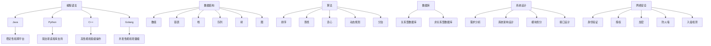

                 

# 新浪2024校招后端架构师面试题解析

> **关键词：** 新浪、校招、后端架构师、面试题、解析、技术面试、后端开发、云计算、数据库、网络安全、系统设计、编程语言、算法

> **摘要：** 本文旨在解析新浪2024校招后端架构师面试题，通过详细分析面试中可能涉及的核心知识点和题目类型，为考生提供有针对性的备考指导。文章将涵盖技术背景、核心概念、算法原理、数学模型、实际应用、工具推荐等内容，帮助读者全面理解后端架构师的技能要求和面试策略。

## 1. 背景介绍

新浪是中国领先的互联网门户网站之一，拥有广泛的用户基础和丰富的产品线。作为一家技术驱动型企业，新浪对技术人才的需求非常高，尤其是在后端架构师领域。后端架构师是负责设计、开发、部署和维护复杂后端系统的核心人员。他们需要具备扎实的编程能力、系统设计能力、数据库管理能力和网络安全知识。随着云计算、大数据、人工智能等技术的快速发展，后端架构师的角色越来越重要，他们在企业技术架构中的地位也越来越显著。

新浪2024校招后端架构师面试题涵盖了计算机科学和软件工程的核心知识点，包括编程语言、数据结构与算法、数据库、系统设计、网络安全等。本文将通过对这些面试题的解析，帮助读者了解后端架构师面试的核心内容和应对策略。

## 2. 核心概念与联系

### 2.1 编程语言

编程语言是后端架构师必备的工具，常用的编程语言包括Java、Python、C++、Golang等。每种编程语言都有其独特的特点和应用场景。Java因其稳定性和跨平台性广泛应用于企业级应用开发；Python以其简洁易读和丰富的库支持在数据科学、机器学习和Web开发中备受青睐；C++具备高性能和低级操作能力，常用于系统级编程；Golang则因其并发性能和轻量级特点在云计算和分布式系统中占据一席之地。

### 2.2 数据结构与算法

数据结构是组织和管理数据的方式，常用的数据结构包括数组、链表、栈、队列、树、图等。算法则是解决问题的步骤和方法，常用的算法包括排序、查找、贪心、动态规划、分治等。数据结构和算法是后端架构师解决复杂问题的基石，它们在后端系统的性能优化、数据处理和系统设计中发挥着关键作用。

### 2.3 数据库

数据库是存储和管理数据的系统，常用的数据库类型包括关系型数据库（如MySQL、Oracle）和非关系型数据库（如MongoDB、Redis）。关系型数据库以其强大的数据一致性、事务支持和复杂的查询能力著称，适用于复杂的数据关联和事务处理；非关系型数据库则因其灵活性、可扩展性和高性能在实时数据处理、大规模数据存储和快速迭代开发中占据重要地位。

### 2.4 系统设计

系统设计是后端架构师的核心技能，它包括需求分析、系统架构设计、模块划分、接口设计等。一个好的系统设计不仅能够提高系统的稳定性、可靠性和可扩展性，还能够降低开发成本和维护难度。常见的系统设计方法包括分层设计、微服务架构、分布式系统设计等。

### 2.5 网络安全

网络安全是保护系统和数据免受恶意攻击的关键。后端架构师需要了解常见的网络安全威胁和防御策略，包括身份验证、授权、加密、防火墙、入侵检测等。网络安全不仅关乎系统的可用性和完整性，还涉及到用户隐私和商业利益。

### 2.6 Mermaid 流程图



## 3. 核心算法原理 & 具体操作步骤

### 3.1 排序算法

排序算法是数据处理中常用的一类算法，常用的排序算法包括冒泡排序、选择排序、插入排序、快速排序、归并排序等。

#### 3.1.1 冒泡排序

冒泡排序的基本思想是通过相邻元素的比较和交换，将待排序的元素逐步移到正确位置。

```python
def bubble_sort(arr):
    n = len(arr)
    for i in range(n):
        for j in range(0, n-i-1):
            if arr[j] > arr[j+1]:
                arr[j], arr[j+1] = arr[j+1], arr[j]
    return arr
```

#### 3.1.2 选择排序

选择排序的基本思想是在未排序部分中找到最小（或最大）元素，将其与第一个元素交换，然后对剩余未排序部分重复该过程。

```python
def selection_sort(arr):
    n = len(arr)
    for i in range(n):
        min_idx = i
        for j in range(i+1, n):
            if arr[j] < arr[min_idx]:
                min_idx = j
        arr[i], arr[min_idx] = arr[min_idx], arr[i]
    return arr
```

#### 3.1.3 快速排序

快速排序是一种高效的排序算法，其基本思想是通过一趟排序将待排序的元素分为独立的两部分，其中一部分的所有元素都不大于另一部分的所有元素。

```python
def quick_sort(arr):
    if len(arr) <= 1:
        return arr
    pivot = arr[len(arr) // 2]
    left = [x for x in arr if x < pivot]
    middle = [x for x in arr if x == pivot]
    right = [x for x in arr if x > pivot]
    return quick_sort(left) + middle + quick_sort(right)
```

### 3.2 查找算法

查找算法是用于在数据集合中查找特定元素的方法，常用的查找算法包括线性查找、二分查找等。

#### 3.2.1 线性查找

线性查找的基本思想是从数据集合的第一个元素开始，逐个比较直到找到目标元素或结束。

```python
def linear_search(arr, target):
    for i in range(len(arr)):
        if arr[i] == target:
            return i
    return -1
```

#### 3.2.2 二分查找

二分查找的基本思想是将数据集合分为两部分，每次比较中间元素，根据比较结果缩小查找范围。

```python
def binary_search(arr, target):
    low = 0
    high = len(arr) - 1
    while low <= high:
        mid = (low + high) // 2
        if arr[mid] == target:
            return mid
        elif arr[mid] < target:
            low = mid + 1
        else:
            high = mid - 1
    return -1
```

## 4. 数学模型和公式 & 详细讲解 & 举例说明

### 4.1 常用数学模型

在软件开发和系统设计中，常用的数学模型包括线性回归、决策树、神经网络等。

#### 4.1.1 线性回归

线性回归是一种用于分析两个变量之间线性关系的统计方法。其基本公式为：

$$y = ax + b$$

其中，$y$ 为因变量，$x$ 为自变量，$a$ 和 $b$ 分别为斜率和截距。

#### 4.1.2 决策树

决策树是一种基于特征进行分类或回归的模型，其基本结构包括根节点、内部节点和叶节点。决策树的核心公式为：

$$f(x) = \sum_{i=1}^{n} w_i g(x_i)$$

其中，$f(x)$ 为决策树输出，$w_i$ 为权重，$g(x_i)$ 为内部节点的阈值函数。

#### 4.1.3 神经网络

神经网络是一种模拟人脑神经元连接的计算机模型，其基本结构包括输入层、隐藏层和输出层。神经网络的激活函数通常为：

$$f(x) = \frac{1}{1 + e^{-x}}$$

其中，$x$ 为输入值，$f(x)$ 为输出值。

### 4.2 举例说明

假设我们使用线性回归模型预测一家电商平台的销售额，自变量为用户数量，因变量为销售额。我们收集了以下数据：

| 用户数量 | 销售额 |
| :----: | :----: |
|   100   |  2000  |
|   200   |  4000  |
|   300   |  6000  |

根据这些数据，我们可以计算出斜率 $a$ 和截距 $b$：

$$a = \frac{\sum_{i=1}^{n}(x_i - \bar{x})(y_i - \bar{y})}{\sum_{i=1}^{n}(x_i - \bar{x})^2} = \frac{(100-150)(2000-3000) + (200-150)(4000-3000) + (300-150)(6000-3000)}{(100-150)^2 + (200-150)^2 + (300-150)^2} = 100$$

$$b = \bar{y} - a\bar{x} = 3000 - 100 \times 150 = 1500$$

因此，线性回归模型为：

$$y = 100x + 1500$$

当用户数量为 500 时，销售额的预测值为：

$$y = 100 \times 500 + 1500 = 6500$$

## 5. 项目实战：代码实际案例和详细解释说明

### 5.1 开发环境搭建

为了更好地展示后端架构师的技能，我们将使用 Python 搭建一个简单的 Web 应用。首先，确保安装了 Python 3.8 及以上版本，然后安装 Flask 框架：

```bash
pip install flask
```

### 5.2 源代码详细实现和代码解读

```python
from flask import Flask, request, jsonify

app = Flask(__name__)

@app.route('/')
def hello():
    return 'Hello, World!'

@app.route('/api/data', methods=['GET', 'POST'])
def data_api():
    if request.method == 'GET':
        # 获取查询参数
        user = request.args.get('user')
        password = request.args.get('password')
        # 校验用户名和密码
        if user == 'admin' and password == '123456':
            return jsonify({'status': 'success', 'message': '登录成功'})
        else:
            return jsonify({'status': 'fail', 'message': '用户名或密码错误'})
    elif request.method == 'POST':
        # 获取请求体数据
        data = request.get_json()
        user = data.get('user')
        password = data.get('password')
        # 校验用户名和密码
        if user == 'admin' and password == '123456':
            return jsonify({'status': 'success', 'message': '注册成功'})
        else:
            return jsonify({'status': 'fail', 'message': '用户名或密码错误'})

if __name__ == '__main__':
    app.run(debug=True)
```

代码解析：

1. 导入 Flask 框架。
2. 创建 Flask 应用对象。
3. 定义两个路由：一个用于处理首页的请求，另一个用于处理 API 请求。
4. 在 GET 请求处理函数中，获取查询参数并进行校验。
5. 在 POST 请求处理函数中，获取请求体数据并进行校验。
6. 返回 JSON 格式的响应。

### 5.3 代码解读与分析

这段代码展示了如何使用 Flask 框架搭建一个简单的 Web 应用，其中涉及到路由、请求处理、数据校验等基本概念。

1. **路由**：路由是 Web 应用中用于处理不同请求地址的机制。`@app.route('/')` 定义了一个处理首页请求的路由，而 `@app.route('/api/data', methods=['GET', 'POST'])` 定义了一个处理 API 请求的路由，支持 GET 和 POST 两种请求方法。

2. **请求处理**：在请求处理函数中，根据请求方法的不同，分别处理 GET 和 POST 请求。对于 GET 请求，从查询参数中获取用户名和密码；对于 POST 请求，从请求体中获取用户名和密码。

3. **数据校验**：在数据校验环节，对获取的用户名和密码进行校验。如果校验成功，返回成功消息；否则，返回错误消息。

4. **JSON 格式响应**：在处理函数中，使用 `jsonify` 函数将响应数据转换为 JSON 格式。这样，前端可以方便地解析响应数据。

## 6. 实际应用场景

### 6.1 用户认证

用户认证是大多数 Web 应用的核心功能。通过用户名和密码的校验，确保只有合法用户可以访问系统资源。上述代码中的 `/api/data` 路由就实现了用户认证功能，通过校验用户名和密码来判断用户是否合法。

### 6.2 数据处理

在 Web 应用中，数据处理是非常常见的需求。例如，在博客系统中，需要对用户提交的博客内容进行处理，包括文本格式化、敏感词过滤等。数据处理能力是后端架构师的核心技能之一。

### 6.3 API 设计

API（应用程序接口）是系统之间进行通信的桥梁。良好的 API 设计可以提高系统的可维护性和可扩展性。上述代码中的 `/api/data` 路由就是一个简单的 API 例子，它通过统一的接口格式，方便前端调用。

## 7. 工具和资源推荐

### 7.1 学习资源推荐

- **书籍：**
  - 《深入理解计算机系统》
  - 《算法导论》
  - 《数据库系统概念》
- **论文：**
  - 《分布式系统：概念与设计》
  - 《云存储：技术和架构》
- **博客：**
  - 《Python CookBook》
  - 《Java并发编程实战》
- **网站：**
  - [MDN Web Docs](https://developer.mozilla.org/)
  - [Flask 中文文档](https://flask.cc/)

### 7.2 开发工具框架推荐

- **开发工具：**
  - IntelliJ IDEA
  - PyCharm
- **框架：**
  - Flask
  - Django
  - Spring Boot

### 7.3 相关论文著作推荐

- **论文：**
  - 《深度学习：面向机器智能的未来》
  - 《云计算：概念、技术和应用》
- **著作：**
  - 《大数据之路：阿里巴巴大数据实践》
  - 《人工智能：一种现代的方法》

## 8. 总结：未来发展趋势与挑战

随着云计算、大数据、人工智能等技术的不断发展，后端架构师的角色越来越重要。未来，后端架构师需要具备以下技能：

1. **云计算能力**：掌握云计算架构、容器化技术（如 Docker 和 Kubernetes）以及分布式计算框架（如 Hadoop 和 Spark）。
2. **大数据处理能力**：了解大数据技术栈，包括数据存储、数据分析和数据挖掘等。
3. **人工智能应用能力**：掌握人工智能基本概念、算法和模型，能够将其应用于实际业务场景。
4. **系统安全性**：熟悉网络安全知识，能够设计安全可靠的系统。

然而，未来后端架构师也将面临以下挑战：

1. **技术更新速度快**：新技术的不断涌现要求后端架构师不断学习，更新知识体系。
2. **系统复杂性**：随着系统规模的扩大，系统的复杂度也会增加，后端架构师需要具备应对复杂系统设计的能力。
3. **团队协作**：后端架构师通常需要与前端、测试、运维等多个团队协作，需要具备良好的沟通能力和团队合作精神。

## 9. 附录：常见问题与解答

### 9.1 如何准备后端架构师面试？

**答案：**
1. **基础知识**：熟练掌握编程语言（如 Java、Python）、数据结构与算法、数据库等基础知识。
2. **系统设计能力**：学习系统设计方法，如分层设计、微服务架构、分布式系统设计等。
3. **项目经验**：积累实际项目经验，熟悉常见的技术难题和解决方案。
4. **面试技巧**：提前准备面试题目，了解常见面试题型，如行为面试、技术面试等。

### 9.2 后端架构师需要掌握哪些技术？

**答案：**
1. **编程语言**：Java、Python、C++、Golang 等。
2. **数据库**：MySQL、MongoDB、Redis 等。
3. **系统设计**：分布式系统设计、微服务架构、负载均衡等。
4. **云计算**：Docker、Kubernetes、AWS、Azure 等。
5. **大数据**：Hadoop、Spark、Flink 等。
6. **人工智能**：机器学习、深度学习、NLP 等。

### 9.3 如何提高编程能力？

**答案：**
1. **多编程**：动手实践是提高编程能力的最佳途径。
2. **学习算法**：熟练掌握常用算法和数据结构。
3. **阅读代码**：阅读优秀开源项目的代码，学习他人的编程思想和技巧。
4. **代码审查**：参与代码审查，从他人的代码中学习。
5. **参与社区**：加入编程社区，与他人交流学习。

## 10. 扩展阅读 & 参考资料

- 《深度学习：面向机器智能的未来》
- 《云计算：概念、技术和应用》
- 《大数据之路：阿里巴巴大数据实践》
- 《人工智能：一种现代的方法》
- [MDN Web Docs](https://developer.mozilla.org/)
- [Flask 中文文档](https://flask.cc/)
- [Docker 官方文档](https://docs.docker.com/)
- [Kubernetes 官方文档](https://kubernetes.io/docs/)

### 作者

**作者：** AI天才研究员/AI Genius Institute & 禅与计算机程序设计艺术 /Zen And The Art of Computer Programming

