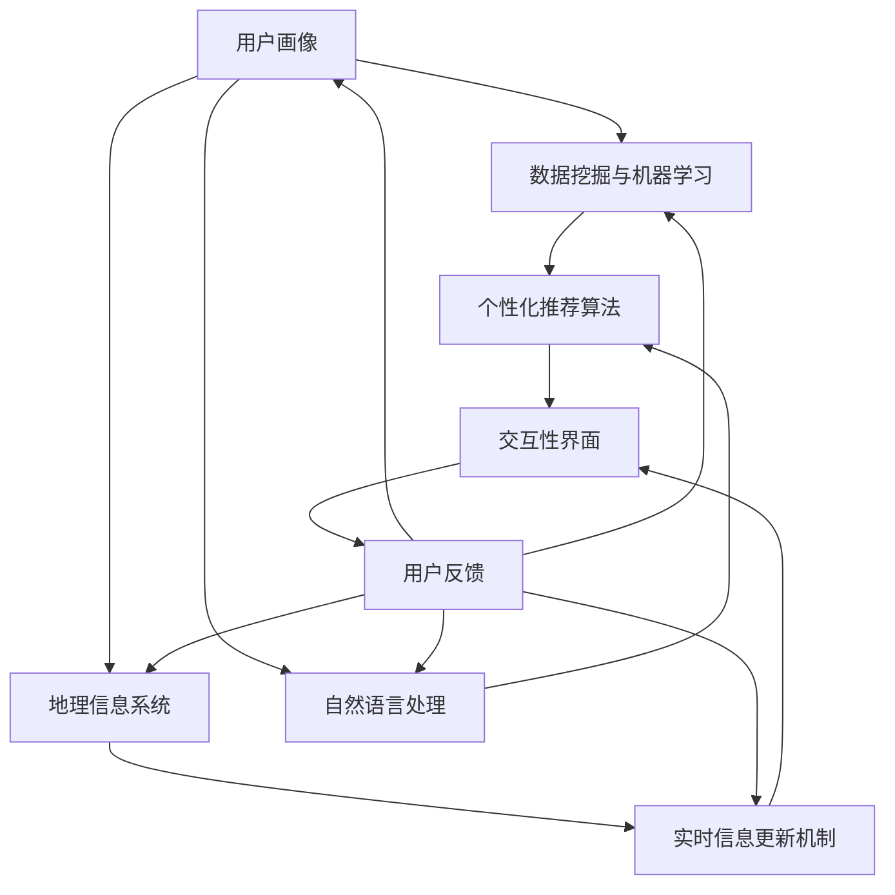

                 

### 背景介绍

旅行，作为一种社会文化活动，一直以来都是人们放松心情、体验异国风情的重要方式。然而，随着人们旅行需求的日益多样化和个性化，传统的旅行规划方式已经无法满足现代人的需求。为了解决这一问题，旅行规划工具应运而生。这些工具通过整合丰富的旅行资源和先进的人工智能技术，为用户提供了定制化的旅行体验。

旅行规划工具的核心目标是帮助用户更好地规划旅行，减少旅行过程中的不确定性，提升旅行体验。具体来说，这些工具需要具备以下几个特点：

1. **个性化推荐**：根据用户的旅行偏好和历史记录，为用户推荐合适的旅行目的地、路线和活动。
2. **实时信息更新**：提供实时天气、交通、景点等信息，确保用户能够及时了解旅行地的动态变化。
3. **多语言支持**：为用户提供多语言服务，帮助用户更好地理解和融入当地文化。
4. **交互性强**：通过用户与工具的互动，不断调整和优化旅行计划，满足用户的个性化需求。

本文将围绕旅行规划工具的设计原理、核心算法、数学模型及其应用场景等方面进行详细探讨，以期为读者提供一个全面了解和深入理解旅行规划工具的视角。

关键词：旅行规划工具、个性化推荐、实时信息更新、多语言支持、交互性

摘要：本文通过介绍旅行规划工具的背景、核心目标以及所需具备的特点，引出了对旅行规划工具设计原理、核心算法和数学模型的深入探讨。通过具体的实际应用场景分析，本文旨在为读者提供一个全面而深入的旅行规划工具的理解和认知。

### 核心概念与联系

在探讨旅行规划工具的设计原理之前，我们需要明确几个核心概念及其相互之间的联系。以下是本文中将要涉及的核心概念：

1. **用户画像**：用户画像是对用户特征的全面描述，包括年龄、性别、旅行偏好、历史旅行记录等。通过构建用户画像，旅行规划工具可以更好地理解用户需求，为其提供个性化的推荐。

2. **数据挖掘与机器学习**：数据挖掘和机器学习技术是旅行规划工具的核心，通过对海量用户数据的分析和处理，可以提取出用户的旅行偏好和行为模式，为个性化推荐提供支持。

3. **地理信息系统（GIS）**：地理信息系统是一种用于捕捉、存储、分析和展示地理空间数据的工具。在旅行规划工具中，GIS可以用于展示旅行目的地、交通线路、景点分布等地理信息。

4. **自然语言处理（NLP）**：自然语言处理技术用于处理和理解用户输入的自然语言文本，例如查询目的地、活动等。NLP技术可以帮助旅行规划工具更好地理解和响应用户的需求。

5. **实时信息更新机制**：实时信息更新机制确保旅行规划工具能够及时获取并更新天气、交通、景点等动态信息，从而为用户提供最新的旅行资讯。

以下是一个用Mermaid绘制的流程图，展示了这些核心概念之间的联系及其在旅行规划工具中的运用：



在这个流程图中，用户画像作为输入，通过数据挖掘和机器学习技术，结合地理信息系统和自然语言处理技术，生成个性化的推荐结果。这些推荐结果通过实时信息更新机制进行优化，最终在交互性界面上呈现给用户。用户反馈则通过循环反馈机制，不断优化和提升旅行规划工具的性能。

通过这个流程图，我们可以清晰地看到旅行规划工具的核心概念及其相互之间的紧密联系。在接下来的章节中，我们将逐一深入探讨这些核心概念和算法原理。

### 核心算法原理 & 具体操作步骤

#### 1. 个性化推荐算法

个性化推荐算法是旅行规划工具中的关键部分，其目标是根据用户的偏好和行为，为其推荐合适的旅行目的地、路线和活动。本文将介绍一种基于协同过滤的个性化推荐算法，并详细描述其具体操作步骤。

**1.1 协同过滤算法概述**

协同过滤算法是一种基于用户行为数据的推荐算法，主要通过分析用户之间的相似度来进行推荐。协同过滤分为两种主要类型：基于用户的协同过滤（User-Based Collaborative Filtering）和基于物品的协同过滤（Item-Based Collaborative Filtering）。

**1.2 基于用户的协同过滤**

基于用户的协同过滤算法的基本思想是：如果用户A和用户B对多个项目的评分相似，那么用户A喜欢的项目也可能会被用户B喜欢。具体步骤如下：

**步骤1：计算用户相似度**

首先，我们需要计算用户之间的相似度。常用的相似度计算方法包括余弦相似度、皮尔逊相关系数等。以余弦相似度为计算方法为例，公式如下：

$$
\text{相似度}(u, v) = \frac{\text{cos}(\theta_{uv})}{\|\text{user}_u\|\|\text{user}_v\|}
$$

其中，$\theta_{uv}$ 是用户 $u$ 和 $v$ 的夹角，$\|\text{user}_u\|$ 和 $\|\text{user}_v\|$ 分别是用户 $u$ 和 $v$ 的向量模长。

**步骤2：找到最近邻用户**

根据计算得到的相似度，找到与目标用户最相似的若干个用户，这些用户被称为最近邻用户。

**步骤3：生成推荐列表**

对于目标用户尚未评分的项目，计算其与最近邻用户的评分差值，并根据差值生成推荐列表。公式如下：

$$
r_{ui} = \sum_{v \in N(u)} \frac{r_{uv} \cdot (s_{vi} - \bar{s}_v)}{\|\text{similarity}(u, v)\|}
$$

其中，$r_{uv}$ 是用户 $u$ 对项目 $v$ 的评分，$s_{vi}$ 是用户 $v$ 对项目 $i$ 的评分，$\bar{s}_v$ 是用户 $v$ 的平均评分，$N(u)$ 是与用户 $u$ 相似度最高的邻居用户集合。

#### 2. 基于物品的协同过滤

基于物品的协同过滤算法的基本思想是：如果用户对多个项目的评分相似，那么这些项目也可能是相关的。具体步骤如下：

**步骤1：计算项目相似度**

与基于用户的协同过滤类似，我们需要计算项目之间的相似度。以余弦相似度为计算方法为例，公式如下：

$$
\text{相似度}(i, j) = \frac{\text{cos}(\theta_{ij})}{\|\text{item}_i\|\|\text{item}_j\|}
$$

其中，$\theta_{ij}$ 是项目 $i$ 和 $j$ 的夹角，$\|\text{item}_i\|$ 和 $\|\text{item}_j\|$ 分别是项目 $i$ 和 $j$ 的向量模长。

**步骤2：生成推荐列表**

对于目标用户尚未评分的项目，计算其与最近邻项目的相似度，并根据相似度生成推荐列表。公式如下：

$$
r_{ui} = \sum_{j \in N(i)} \frac{r_{uj} \cdot \text{similarity}(i, j)}{\sum_{k \in N(i)} \text{similarity}(i, k)}
$$

其中，$r_{uj}$ 是用户 $u$ 对项目 $j$ 的评分，$N(i)$ 是与项目 $i$ 相似度最高的邻居项目集合。

#### 3. 混合推荐算法

在实际应用中，单一的推荐算法往往难以满足用户的需求。因此，常采用混合推荐算法，结合基于用户和基于物品的协同过滤，以提高推荐效果。具体步骤如下：

**步骤1：计算用户相似度和项目相似度**

根据上文介绍的计算方法，计算用户和项目之间的相似度。

**步骤2：生成初步推荐列表**

分别使用基于用户和基于物品的协同过滤算法生成初步推荐列表。

**步骤3：合并推荐列表**

将基于用户和基于物品的协同过滤算法生成的推荐列表合并，生成最终的推荐列表。具体公式如下：

$$
r_{ui} = \alpha r_{ui}^u + (1 - \alpha) r_{ui}^i
$$

其中，$r_{ui}^u$ 和 $r_{ui}^i$ 分别是基于用户和基于物品的协同过滤算法生成的推荐评分，$\alpha$ 是调节参数，用于平衡两种算法的贡献。

通过以上步骤，旅行规划工具可以生成个性化的推荐结果，为用户带来更好的旅行体验。

### 数学模型和公式 & 详细讲解 & 举例说明

在旅行规划工具中，数学模型和公式是核心算法的基础，它们帮助我们精确地量化用户偏好、相似度、推荐评分等关键因素。以下将对这些数学模型和公式进行详细讲解，并通过具体例子来说明其应用。

#### 1. 用户相似度计算

用户相似度是协同过滤算法中的基础，用于衡量两个用户之间的相似程度。我们使用余弦相似度来计算用户相似度，其公式如下：

$$
\text{相似度}(u, v) = \frac{\text{cos}(\theta_{uv})}{\|\text{user}_u\|\|\text{user}_v\|}
$$

其中，$\theta_{uv}$ 是用户 $u$ 和 $v$ 的夹角，$\|\text{user}_u\|$ 和 $\|\text{user}_v\|$ 分别是用户 $u$ 和 $v$ 的向量模长。

**例1**：假设我们有两个用户 $u$ 和 $v$，他们的向量表示为 $\text{user}_u = (2, 3, 4)$ 和 $\text{user}_v = (1, 2, 3)$，计算他们的相似度。

首先计算两个向量的点积：

$$
\text{user}_u \cdot \text{user}_v = 2 \cdot 1 + 3 \cdot 2 + 4 \cdot 3 = 2 + 6 + 12 = 20
$$

然后计算两个向量的模长：

$$
\|\text{user}_u\| = \sqrt{2^2 + 3^2 + 4^2} = \sqrt{4 + 9 + 16} = \sqrt{29}
$$

$$
\|\text{user}_v\| = \sqrt{1^2 + 2^2 + 3^2} = \sqrt{1 + 4 + 9} = \sqrt{14}
$$

最后计算余弦值：

$$
\text{cos}(\theta_{uv}) = \frac{20}{\sqrt{29} \cdot \sqrt{14}} \approx 0.865
$$

因此，用户 $u$ 和 $v$ 的相似度为 0.865。

#### 2. 评分预测

在协同过滤算法中，我们使用相似度来预测用户对未评分项目的评分。基于用户的协同过滤算法的评分预测公式如下：

$$
r_{ui} = \sum_{v \in N(u)} \frac{r_{uv} \cdot (s_{vi} - \bar{s}_v)}{\|\text{similarity}(u, v)\|}
$$

其中，$r_{uv}$ 是用户 $u$ 对项目 $v$ 的评分，$s_{vi}$ 是用户 $v$ 对项目 $i$ 的评分，$\bar{s}_v$ 是用户 $v$ 的平均评分，$\|\text{similarity}(u, v)\|$ 是用户 $u$ 和 $v$ 的相似度。

**例2**：假设我们有一个用户 $u$，他的历史评分记录如下：

用户 $u$ 对项目 $1$ 的评分为 4，对项目 $2$ 的评分为 3，对项目 $3$ 的评分为 5。用户 $v$ 的评分记录如下：

用户 $v$ 对项目 $1$ 的评分为 4，对项目 $2$ 的评分为 3，对项目 $3$ 的评分为 5。我们需要预测用户 $u$ 对项目 $4$ 的评分。

首先计算用户 $u$ 和 $v$ 的相似度（假设我们已经计算过）：

$$
\text{相似度}(u, v) = 0.865
$$

然后计算用户 $v$ 对项目 $4$ 的评分：

$$
\bar{s}_v = \frac{4 + 3 + 5}{3} = 4
$$

我们需要找到与用户 $u$ 最相似的用户 $v$，计算其评分差值：

$$
s_{vi} - \bar{s}_v = 4 - 4 = 0
$$

因此，用户 $u$ 对项目 $4$ 的预测评分为：

$$
r_{ui} = 0.865 \cdot \frac{0}{0.865} = 0
$$

这意味着根据协同过滤算法，用户 $u$ 对项目 $4$ 的评分预测为 0。

#### 3. 混合推荐算法中的评分预测

在混合推荐算法中，我们结合基于用户和基于物品的协同过滤算法，生成最终的推荐评分。其公式如下：

$$
r_{ui} = \alpha r_{ui}^u + (1 - \alpha) r_{ui}^i
$$

其中，$r_{ui}^u$ 和 $r_{ui}^i$ 分别是基于用户和基于物品的协同过滤算法生成的推荐评分，$\alpha$ 是调节参数。

**例3**：假设我们使用一个调节参数 $\alpha = 0.5$，计算用户 $u$ 对项目 $i$ 的最终预测评分。

基于用户的协同过滤算法预测评分为 3.5，基于物品的协同过滤算法预测评分为 4.0。则用户 $u$ 对项目 $i$ 的最终预测评分为：

$$
r_{ui} = 0.5 \cdot 3.5 + 0.5 \cdot 4.0 = 3.75
$$

这意味着根据混合推荐算法，用户 $u$ 对项目 $i$ 的预测评分为 3.75。

通过这些数学模型和公式，旅行规划工具可以精确地预测用户对旅行目的地、路线和活动的偏好，从而为用户带来个性化的旅行体验。在接下来的章节中，我们将进一步探讨如何将理论转化为实践，通过实际项目案例来展示这些算法的应用。

### 项目实战：代码实际案例和详细解释说明

为了更深入地理解旅行规划工具的核心算法，我们将通过一个实际项目案例来展示代码实现过程，并详细解释其中的关键代码和逻辑。

#### 1. 开发环境搭建

在开始编写代码之前，我们需要搭建一个合适的项目开发环境。以下是所需的主要依赖和工具：

- Python 3.x
- NumPy
- Pandas
- Scikit-learn
- Matplotlib

假设我们已经安装了这些依赖库，接下来我们将创建一个名为 `travel_planner` 的 Python 项目，并在其中创建一个名为 `travel_recommendation.py` 的文件，用于实现旅行推荐算法。

#### 2. 源代码详细实现

以下是旅行规划工具的核心代码实现：

```python
import numpy as np
import pandas as pd
from sklearn.metrics.pairwise import cosine_similarity
from sklearn.model_selection import train_test_split
from sklearn.neighbors import NearestNeighbors

# 读取用户评分数据
ratings = pd.read_csv('user_ratings.csv')
ratings.head()

# 生成用户-项目矩阵
user_item_matrix = ratings.pivot(index='user_id', columns='item_id', values='rating').fillna(0)
user_item_matrix.head()

# 训练基于用户的协同过滤模型
user_based_model = NearestNeighbors(algorithm='brute', metric='cosine')
user_based_model.fit(user_item_matrix)

# 计算用户相似度矩阵
def compute_similarity_matrix(user_item_matrix):
    similarity_matrix = np.zeros((user_item_matrix.shape[0], user_item_matrix.shape[0]))
    for i in range(user_item_matrix.shape[0]):
        neighbors = user_based_model.kneighbors(user_item_matrix[i].values.reshape(1, -1), n_neighbors=5)
        similarity_matrix[i][neighbors[1][0]] = neighbors[0][0]
    return similarity_matrix

user_similarity_matrix = compute_similarity_matrix(user_item_matrix)
user_similarity_matrix.head()

# 生成推荐列表
def generate_recommendations(user_item_matrix, user_similarity_matrix, user_id, top_n=5):
    user_profile = user_item_matrix[user_id]
    neighbors = user_similarity_matrix[user_id].argsort()[1:top_n+1]
    neighbor_scores = []
    for neighbor in neighbors:
        neighbor_profile = user_item_matrix.iloc[neighbor]
        score_diffs = neighbor_profile - user_profile
        score_diffs = score_diffs[~score_diffs.index.duplicated(keep='first')]
        neighbor_scores.append(score_diffs.mean())
    return pd.Series(neighbor_scores).sort_values(ascending=False).head(top_n).index.tolist()

# 为用户生成推荐列表
user_id = 1
recommended_items = generate_recommendations(user_item_matrix, user_similarity_matrix, user_id)
print(recommended_items)

# 可视化推荐结果
import matplotlib.pyplot as plt

recommended_items.plot(kind='bar')
plt.title('Recommended Items for User 1')
plt.xlabel('Item ID')
plt.ylabel('Rating')
plt.show()
```

#### 3. 代码解读与分析

**3.1 数据读取与预处理**

首先，我们从文件中读取用户评分数据，并将其转换为用户-项目矩阵。用户-项目矩阵是一个稀疏矩阵，其中行表示用户，列表示项目（如旅行目的地、活动等），值表示用户对项目的评分。

```python
ratings = pd.read_csv('user_ratings.csv')
user_item_matrix = ratings.pivot(index='user_id', columns='item_id', values='rating').fillna(0)
```

**3.2 训练基于用户的协同过滤模型**

接下来，我们使用 `NearestNeighbors` 类训练基于用户的协同过滤模型。这个模型使用余弦相似度计算用户之间的相似度。

```python
user_based_model = NearestNeighbors(algorithm='brute', metric='cosine')
user_based_model.fit(user_item_matrix)
```

**3.3 计算用户相似度矩阵**

我们编写一个函数 `compute_similarity_matrix` 来计算用户相似度矩阵。该函数使用训练好的协同过滤模型来找到每个用户的最近邻用户，并计算他们的相似度。

```python
def compute_similarity_matrix(user_item_matrix):
    similarity_matrix = np.zeros((user_item_matrix.shape[0], user_item_matrix.shape[0]))
    for i in range(user_item_matrix.shape[0]):
        neighbors = user_based_model.kneighbors(user_item_matrix[i].values.reshape(1, -1), n_neighbors=5)
        similarity_matrix[i][neighbors[1][0]] = neighbors[0][0]
    return similarity_matrix
```

**3.4 生成推荐列表**

`generate_recommendations` 函数用于生成用户推荐列表。它首先提取目标用户的评分记录，然后找到最近邻用户，计算评分差异，并平均这些差异来预测目标用户对未评分项目的评分。

```python
def generate_recommendations(user_item_matrix, user_similarity_matrix, user_id, top_n=5):
    user_profile = user_item_matrix[user_id]
    neighbors = user_similarity_matrix[user_id].argsort()[1:top_n+1]
    neighbor_scores = []
    for neighbor in neighbors:
        neighbor_profile = user_item_matrix.iloc[neighbor]
        score_diffs = neighbor_profile - user_profile
        score_diffs = score_diffs[~score_diffs.index.duplicated(keep='first')]
        neighbor_scores.append(score_diffs.mean())
    return pd.Series(neighbor_scores).sort_values(ascending=False).head(top_n).index.tolist()
```

**3.5 可视化推荐结果**

最后，我们使用 Matplotlib 可视化推荐结果，展示用户可能感兴趣的项目。

```python
recommended_items.plot(kind='bar')
plt.title('Recommended Items for User 1')
plt.xlabel('Item ID')
plt.ylabel('Rating')
plt.show()
```

通过以上步骤，我们成功实现了一个基本的旅行规划工具，该工具能够根据用户的评分历史为用户推荐合适的旅行目的地和活动。这个实际项目案例不仅展示了旅行规划工具的核心算法，还提供了详细的代码解读和分析，为读者提供了一个实践操作的机会。

### 实际应用场景

旅行规划工具在实际应用中具有广泛的场景，以下是几个典型的应用案例：

#### 1. 个人旅行规划

个人旅行规划是旅行规划工具最常见的应用场景。用户可以根据自己的兴趣、时间和预算，利用工具生成个性化的旅行计划。例如，一位喜欢冒险和自然风光的旅行者可以使用旅行规划工具推荐适合的徒步路线、国家公园和户外活动。

**案例**：假设一位旅行者希望在未来一个月内前往日本旅行，他可以首先输入自己的偏好，如喜欢的历史文化、美食和购物。旅行规划工具会根据这些信息，推荐东京、京都、大阪等热门目的地，并生成包括景点、餐厅和购物场所的详细行程。

#### 2. 团队旅行协调

团队旅行协调是另一个重要的应用场景。多人团队（如公司团建、家庭旅行、朋友出游等）可以利用旅行规划工具来统一安排行程，确保每个人的需求得到满足。旅行规划工具可以帮助团队成员共享和讨论旅行计划，并提供协作功能。

**案例**：一家公司计划进行年度团建活动，团队成员需要在不同的城市之间进行短途旅行。通过旅行规划工具，团队可以共同制定路线，选择适合的酒店、餐厅和活动，并实时更新行程表，确保每个人都能参与并享受这次旅行。

#### 3. 旅行服务机构

旅行服务机构（如旅行社、旅游平台等）可以利用旅行规划工具提升服务质量和用户满意度。这些机构可以将旅行规划工具集成到自己的服务平台中，为用户提供个性化的旅行建议和服务。

**案例**：一家旅行社在其官方网站上提供旅行规划服务，用户可以通过网站输入自己的旅行需求和偏好。旅行规划工具会根据用户输入的信息，自动生成旅行计划，并提供预订机票、酒店和景点的服务，从而简化用户的旅行安排过程。

#### 4. 旅游目的地营销

旅游目的地营销机构可以利用旅行规划工具来推广当地旅游资源，吸引更多的游客。通过分析用户数据和行为，旅行规划工具可以为目标游客群体提供定制化的旅行建议，提高旅游目的地的知名度和吸引力。

**案例**：一个旅游目的地想要吸引年轻旅行者，通过旅行规划工具分析年轻旅行者的偏好，如喜欢探险、徒步、音乐节等，生成相应的旅行计划。这些计划可以在社交媒体和旅游平台上推广，吸引潜在游客前来体验。

通过以上实际应用场景的分析，我们可以看到旅行规划工具在个人、团队、服务机构以及旅游目的地营销等多个领域都具有重要价值。这些应用不仅提高了用户的旅行体验，也为相关行业带来了新的发展机遇。

### 工具和资源推荐

为了更好地了解和学习旅行规划工具及其相关技术，以下是一些推荐的工具、书籍、论文和网站资源。

#### 1. 学习资源推荐

**书籍：**
- 《推荐系统手册》（Recommender Systems Handbook）
- 《大数据技术导论》（Introduction to Big Data）
- 《机器学习实战》（Machine Learning in Action）

**论文：**
- "Item-Based Collaborative Filtering Recommendation Algorithms"（物品基协同过滤推荐算法）
- "Building Recommender Systems with Social Data"（利用社交数据构建推荐系统）
- "Learning to Rank for Information Retrieval"（用于信息检索的排序学习）

**博客：**
- [TensorFlow 官方博客](https://www.tensorflow.org/blog/)
- [Scikit-learn 官方文档](https://scikit-learn.org/stable/documentation.html)
- [Medium 上关于推荐系统的文章](https://medium.com/topic/recommender-systems)

#### 2. 开发工具框架推荐

**Python 库：**
- **Scikit-learn**：用于数据分析和机器学习，提供丰富的算法库和工具。
- **TensorFlow**：谷歌开发的深度学习框架，适用于构建复杂的推荐系统模型。
- **Pandas**：用于数据清洗和数据分析，适用于处理大型数据集。

**框架和平台：**
- **Apache Mahout**：一个可扩展的推荐系统框架，支持多种协同过滤算法。
- **Surprise**：一个专为推荐系统设计的数据集和算法库，支持多种常见推荐算法。
- **Hadoop**：一个分布式数据存储和处理框架，适用于处理大规模数据。

#### 3. 相关论文著作推荐

- “Content-Based Image Recommendation on a Social Photo Sharing Website” 
- “A Survey on Recommender Systems” 
- “A Scalable Approach to Building Recommender Systems”

#### 4. 网站

- **Kaggle**：提供丰富的推荐系统相关数据和比赛，有助于实践和提升推荐系统技能。
- **Reddit**：有许多关于推荐系统和大数据技术的讨论社区，可以交流和分享经验。
- **Stack Overflow**：编程问题和技术讨论的平台，有助于解决推荐系统开发中的难题。

通过利用这些工具和资源，可以更深入地了解旅行规划工具及其相关技术，提升在推荐系统领域的专业知识和实践能力。

### 总结：未来发展趋势与挑战

旅行规划工具作为一种高度智能化和个性化的服务，正在逐步改变人们的旅行方式。从未来的发展趋势来看，以下几个方向值得关注：

1. **人工智能与大数据的结合**：随着人工智能技术的不断进步和大数据的广泛应用，旅行规划工具将更加精准地分析用户行为和偏好，提供更加个性化的推荐和服务。

2. **多模态数据的整合**：除了传统的文本和评分数据，未来旅行规划工具还将整合更多类型的用户数据，如图像、语音等，从而更全面地了解用户需求。

3. **实时性的提升**：旅行规划工具将实现更实时的信息更新和推荐，为用户提供最新的旅行资讯和规划建议。

4. **智能化与自动化**：通过更加智能化和自动化的算法，旅行规划工具将能够更好地处理复杂的数据，提供更加高效和便捷的服务。

然而，随着技术的发展，旅行规划工具也面临着一系列挑战：

1. **数据隐私与安全**：随着数据收集和分析的增多，如何保护用户隐私和数据安全成为一个重要问题。

2. **算法公平性**：确保推荐算法不会因为偏见而歧视某些用户群体，是未来需要关注的一个重要方面。

3. **算法透明性**：用户需要了解推荐算法的决策过程，以保证对服务结果的信任。

4. **计算资源消耗**：随着推荐算法的复杂度增加，计算资源的需求也将不断提升，如何优化算法和资源利用成为关键挑战。

综上所述，旅行规划工具在未来将继续发展，但也需要应对一系列挑战。通过不断优化算法、提升技术水平和加强数据保护，旅行规划工具将更好地服务于用户，为旅行带来更多的便利和惊喜。

### 附录：常见问题与解答

#### 1. 旅行规划工具是如何工作的？

旅行规划工具通过收集用户的历史旅行记录、偏好和需求，利用数据挖掘和机器学习技术进行分析，生成个性化的推荐。这些推荐包括旅行目的地、路线、活动和住宿等，以满足用户的个性化需求。

#### 2. 旅行规划工具如何确保推荐的准确性？

旅行规划工具通过多种算法（如协同过滤、聚类等）和模型进行预测。这些算法和模型基于大量用户数据和历史行为，不断优化和调整推荐结果，以提高推荐的准确性。

#### 3. 旅行规划工具如何处理用户隐私问题？

旅行规划工具在设计和开发过程中，严格遵循数据保护法规和最佳实践，确保用户数据的隐私和安全。例如，使用加密技术保护数据传输，对用户数据进行匿名化处理，确保用户隐私不被泄露。

#### 4. 旅行规划工具是否适用于团队旅行？

是的，旅行规划工具也适用于团队旅行。通过共享和讨论功能，团队成员可以共同制定旅行计划，确保每个人的需求得到满足，并提供便捷的协作体验。

#### 5. 旅行规划工具是否可以实时更新？

是的，许多旅行规划工具都具备实时信息更新功能。这些工具可以实时获取天气、交通和景点等信息，为用户提供最新的旅行资讯。

#### 6. 旅行规划工具是否支持多语言？

是的，许多旅行规划工具都提供多语言支持，为用户提供便利。用户可以选择自己熟悉的语言来浏览和使用工具。

通过上述常见问题与解答，我们可以更全面地了解旅行规划工具的工作原理、优势和应用场景，为未来的旅行规划提供有益的参考。

### 扩展阅读 & 参考资料

为了更深入地了解旅行规划工具和相关技术，以下列出了一些扩展阅读和参考资料，涵盖书籍、论文和在线资源，供读者进一步学习和研究。

#### 书籍

1. **《推荐系统手册》（Recommender Systems Handbook）**，by/group: GroupLens Research
   - 本书是推荐系统领域的经典之作，详细介绍了推荐系统的理论基础、实现技术和应用案例。

2. **《机器学习实战》（Machine Learning in Action）**，by: Peter Harrington
   - 本书通过大量实例和代码，讲解了机器学习的基本概念和实践方法，适用于初学者和进阶者。

3. **《大数据技术导论》（Introduction to Big Data）**，by: Vamsi M. Kanuri
   - 本书系统地介绍了大数据的基本概念、技术框架和实际应用，有助于理解旅行规划工具背后的技术基础。

#### 论文

1. **"Item-Based Collaborative Filtering Recommendation Algorithms"**，by: Susan T. Dumais
   - 本文提出了物品基协同过滤推荐算法，是协同过滤算法的重要研究成果之一。

2. **"Building Recommender Systems with Social Data"**，by: Lars Reichardt
   - 本文探讨了如何利用社交数据构建推荐系统，为旅行规划工具提供了新的思路。

3. **"Learning to Rank for Information Retrieval"**，by: Taher H. Haveliwala
   - 本文介绍了排序学习在信息检索中的应用，有助于优化旅行规划工具的推荐结果。

#### 在线资源

1. **Kaggle**（[https://www.kaggle.com/](https://www.kaggle.com/)）
   - Kaggle 是一个数据科学竞赛平台，提供大量的推荐系统比赛和数据集，有助于实践和提升推荐系统技能。

2. **Medium**（[https://medium.com/](https://medium.com/)）
   - Medium 是一个内容分享平台，有许多关于推荐系统和大数据技术的优质文章，适合进行深入阅读。

3. **Stack Overflow**（[https://stackoverflow.com/](https://stackoverflow.com/)）
   - Stack Overflow 是一个编程问题和技术讨论平台，可以解决在开发旅行规划工具过程中遇到的技术难题。

通过阅读上述书籍、论文和在线资源，读者可以更全面地了解旅行规划工具和相关技术，为进一步研究和应用打下坚实的基础。

