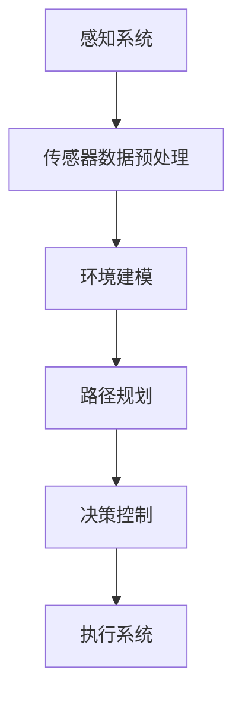

                 

### 背景介绍 Background Introduction

无人驾驶技术，作为现代科技的前沿领域之一，正迅速改变着我们的出行方式。近年来，随着人工智能、传感器技术和大数据分析的飞速发展，无人驾驶汽车的概念逐渐从科幻变成现实。无人驾驶技术的核心目标是通过集成各种传感器、算法和控制系统，使车辆能够自主感知环境、做出决策并执行驾驶操作，从而实现“无人干预”的自动驾驶。

当前，全球各国都在积极推进无人驾驶技术的发展。例如，美国、中国、欧洲等地区纷纷制定了一系列政策和法规，鼓励企业和研究机构投入无人驾驶技术的研发。在技术层面，无人驾驶车辆主要依赖于计算机视觉、深度学习、定位与导航、路径规划等多个子领域的交叉融合。

无人驾驶技术不仅对交通运输行业有着深远的影响，还对整个社会经济产生重要影响。从个人层面看，无人驾驶汽车有望提高交通安全，减少交通事故；从社会层面看，无人驾驶技术可以优化交通流，提高交通效率，减少拥堵；从经济层面看，无人驾驶技术的发展将催生一系列新兴产业，创造大量的就业机会。

本文将从以下几个方面展开探讨：

1. **核心概念与联系**：介绍无人驾驶技术的核心概念和组成部分，并通过Mermaid流程图展示其整体架构。
2. **核心算法原理与操作步骤**：详细讲解无人驾驶技术的核心算法原理，包括感知、决策和执行等环节。
3. **数学模型与公式**：介绍支持无人驾驶技术的关键数学模型，包括路径规划、轨迹生成等，并举例说明。
4. **项目实战**：通过一个实际案例，展示无人驾驶技术的实现过程，包括开发环境搭建、源代码实现和代码解读。
5. **实际应用场景**：分析无人驾驶技术的各种应用场景，探讨其在各个领域的潜力和挑战。
6. **工具和资源推荐**：推荐学习无人驾驶技术的相关资源，包括书籍、论文、博客和开发工具框架。
7. **总结**：总结无人驾驶技术的发展趋势和面临的挑战，展望其未来的前景。
8. **附录**：解答常见问题，提供进一步学习的参考资料。

通过这篇文章，我们希望能够帮助读者深入理解无人驾驶技术的核心原理和应用，为这一领域的研究者和开发者提供有价值的参考。

---

## 2. 核心概念与联系 Core Concepts and Connections

### 2.1. 无人驾驶技术概述 Autonomous Driving Overview

无人驾驶技术（Autonomous Driving）涉及多个核心概念和关键技术，这些技术的交叉融合构成了现代无人驾驶汽车的框架。以下是无人驾驶技术的核心组成部分：

1. **传感器融合 Sensor Fusion**：无人驾驶汽车依赖多种传感器来感知周围环境，包括激光雷达（LiDAR）、摄像头、雷达、超声波传感器等。传感器融合技术通过整合不同传感器的数据，提供更全面、准确的感知信息。

2. **环境建模 Environmental Modeling**：基于传感器数据，无人驾驶系统需要对周围环境进行建模，包括道路、车辆、行人、障碍物等。环境建模是实现自动驾驶的关键，它帮助车辆理解所处的环境，并进行相应的决策。

3. **路径规划 Path Planning**：路径规划是指无人驾驶汽车从当前位置到目标位置的过程中，选择最优行驶路径的过程。路径规划需要考虑交通规则、道路条件、障碍物回避等因素。

4. **决策控制 Decision Making and Control**：决策控制是无人驾驶系统的核心，它基于环境感知和路径规划的结果，生成驾驶指令，控制车辆的动作。这包括加速、减速、转向、换道等操作。

5. **机器学习和深度学习 Machine Learning and Deep Learning**：机器学习和深度学习技术被广泛应用于无人驾驶系统的各个层面，从感知环境到决策控制，都依赖于这些先进算法的支持。

### 2.2. 无人驾驶技术架构 Autonomous Driving Architecture

为了更好地理解无人驾驶技术的工作流程，我们可以使用Mermaid流程图来展示其核心架构：



在这个流程图中：

- **感知系统**（A）负责收集来自各种传感器的数据，如激光雷达、摄像头等。
- **传感器数据预处理**（B）对原始传感器数据进行预处理，以提高数据的准确性和可靠性。
- **环境建模**（C）基于预处理后的数据，构建周围环境的模型。
- **路径规划**（D）根据环境模型和目标位置，选择最优行驶路径。
- **决策控制**（E）基于路径规划结果和环境感知信息，生成驾驶指令。
- **执行系统**（F）执行决策控制模块的指令，包括加速、减速、转向等操作。

通过这个流程，我们可以清晰地看到无人驾驶技术各个模块之间的联系和协同作用。

### 2.3. 无人驾驶技术的核心挑战 Core Challenges of Autonomous Driving

虽然无人驾驶技术取得了显著的进展，但仍然面临许多核心挑战：

1. **环境复杂性 Environmental Complexity**：真实世界的交通环境复杂多变，包括各种突发状况和异常情况，这对无人驾驶系统的感知、决策和执行能力提出了极高的要求。
2. **安全性 Safety**：无人驾驶汽车的安全性能是人们最关心的方面之一。任何系统的故障或错误决策都可能导致严重的交通事故。
3. **法律法规 Legal and Regulatory Issues**：各国对无人驾驶汽车的法规和标准仍在逐步完善中，这需要无人驾驶技术适应不断变化的法规环境。
4. **技术成熟度 Technological Maturity**：尽管无人驾驶技术在理论和技术上取得了突破，但实际应用中仍存在许多技术难题，如高精度地图、实时环境感知等。

通过上述讨论，我们可以看到无人驾驶技术的核心概念和组成部分，以及其架构和面临的主要挑战。接下来，我们将深入探讨无人驾驶技术的核心算法原理，为理解其具体操作提供更详细的指导。

---

## 3. 核心算法原理 & 具体操作步骤 Core Algorithm Principles & Step-by-Step Procedures

### 3.1. 感知系统 Perception System

无人驾驶技术的第一步是感知系统，它负责收集和处理环境信息。感知系统的主要组件包括激光雷达（LiDAR）、摄像头、雷达和超声波传感器。以下是感知系统的主要算法原理：

1. **激光雷达 LiDAR**: 激光雷达通过发射激光束并测量反射时间来获取周围环境的三维点云数据。点云数据可以精确地反映车辆周围物体的位置和形状。激光雷达的优点是高精度和高分辨率，但其成本较高。

2. **摄像头 Camera**: 摄像头主要用于获取图像信息，通过对图像进行处理，可以识别车辆、行人、道路标志等。计算机视觉算法，如卷积神经网络（CNN），被广泛应用于图像识别任务。摄像头具有低成本和高分辨率的优点，但其受光线条件和天气影响较大。

3. **雷达 Radar**: 雷达通过发射无线电波并测量反射信号来检测物体的距离和速度。雷达具有较强的穿透能力和抗干扰能力，适合在恶劣天气条件下使用。

4. **超声波传感器 Ultrasonic Sensor**: 超声波传感器主要用于检测近距离物体，常用于车辆的前后碰撞预警系统。超声波传感器具有低成本和实时性的优点。

感知系统的具体操作步骤如下：

- **数据采集**：各种传感器同时工作，收集周围环境的信息。
- **数据预处理**：对收集到的原始数据进行去噪、滤波等预处理，以提高数据的质量。
- **数据融合**：将来自不同传感器的数据融合，生成统一的环境模型。

### 3.2. 决策控制 Decision-Making and Control

决策控制是无人驾驶系统的核心，它基于感知系统的信息，生成驾驶指令，控制车辆的加速、减速、转向和换道等操作。以下是决策控制的主要算法原理：

1. **状态估计 State Estimation**: 决策控制首先需要对车辆当前的状态进行估计，包括位置、速度、加速度等。常用的方法有卡尔曼滤波（Kalman Filter）和粒子滤波（Particle Filter）。

2. **路径规划 Path Planning**: 路径规划是决策控制的一部分，它选择从当前点到目标点的最优行驶路径。常见的路径规划算法包括A*算法、Dijkstra算法和RRT（快速随机树）算法。

3. **轨迹生成 Trajectory Generation**: 基于路径规划结果，生成车辆的行驶轨迹。轨迹生成需要考虑车辆的运动特性、道路条件、障碍物回避等因素。常见的轨迹生成算法包括LQR（线性二次调节器）和MPC（模型预测控制）。

4. **驾驶指令生成 Driving Instruction Generation**: 根据行驶轨迹和当前状态，生成驾驶指令。驾驶指令包括加速、减速、转向等操作。

决策控制的具体操作步骤如下：

- **状态估计**：使用传感器数据和运动模型，对车辆当前状态进行估计。
- **路径规划**：根据目标位置和当前状态，生成最优行驶路径。
- **轨迹生成**：基于路径规划结果，生成车辆的行驶轨迹。
- **驾驶指令生成**：根据行驶轨迹和当前状态，生成驾驶指令。

### 3.3. 执行系统 Execution System

执行系统负责执行决策控制模块生成的驾驶指令，包括加速、减速、转向和换道等操作。以下是执行系统的主要算法原理：

1. **驱动系统 Control System**: 驱动系统是执行系统的核心，它根据驾驶指令，控制车辆的加速度、转向角度等。常用的控制算法包括PID（比例-积分-微分）控制和模糊控制。

2. **执行器 Actuator**: 执行器是驱动系统的执行部件，包括电动机、液压系统等，用于实现加速、减速、转向等操作。

3. **反馈系统 Feedback System**: 执行系统还包含一个反馈系统，用于监测车辆的实际状态，并将其与期望状态进行比较，以便进行动态调整。

执行系统的具体操作步骤如下：

- **驾驶指令接收**：接收决策控制模块生成的驾驶指令。
- **驱动系统执行**：根据驾驶指令，控制驱动系统的执行。
- **状态反馈与调整**：通过反馈系统，监测车辆的实际状态，并根据需要进行调整。

通过上述算法原理和操作步骤，我们可以看到无人驾驶技术是如何通过感知、决策和执行三个环节，实现自主驾驶的。接下来，我们将介绍无人驾驶技术的数学模型和公式，以便更深入地理解其核心算法。

---

## 4. 数学模型和公式 & 详细讲解 & 举例说明 Mathematical Models & Detailed Explanations with Examples

### 4.1. 路径规划 Path Planning

路径规划是无人驾驶技术中至关重要的一环，它决定了车辆如何从当前位置到达目标位置。路径规划的数学模型通常基于图论和优化算法。以下是几个常用的路径规划算法及其数学模型：

#### 4.1.1. A*算法 A* Algorithm

A*算法是一种启发式搜索算法，用于在加权图中寻找最短路径。其数学模型如下：

$$
\begin{aligned}
d(g, s) &= g + h(g) \\
d(g, s') &= g' + h(g') \\
\end{aligned}
$$

其中，$d(g, s)$表示从起点$s$到终点$g$的最短路径长度，$g$表示路径上的边权重，$h(g)$表示从节点$g$到终点$g'$的启发式估计值。A*算法的关键在于如何选择下一个节点，通常通过计算$f(g) = d(g, s) + h(g)$来选择。

#### 4.1.2. Dijkstra算法 Dijkstra Algorithm

Dijkstra算法是一种非启发式的搜索算法，用于在无权图中寻找最短路径。其数学模型如下：

$$
d(g) = \min_{s' \in S} \{d(s) + w(s, g)\}
$$

其中，$d(g)$表示从起点$s$到终点$g$的最短路径长度，$S$表示已访问的节点集合，$w(s, g)$表示从节点$s$到节点$g$的权重。

#### 4.1.3. RRT（快速随机树）算法 RRT Algorithm

RRT算法是一种基于随机采样的路径规划算法，适用于动态环境和高维空间。其数学模型如下：

$$
\begin{aligned}
T &= \{t_0\} \\
s' &= \text{Sample}(S) \\
g' &= \text{Nearest}(T, s') \\
T &= T \cup \{g'\} \\
T' &= T + \alpha(g', s') \\
T &= T \cup T' \\
\end{aligned}
$$

其中，$T$表示树结构，$s'$表示随机采样点，$g'$表示最近的树节点，$\alpha(g', s')$表示从$g'$到$s'$的线性插值。

#### 4.1.4. 实例分析 Example Analysis

假设一个简单的场景，车辆需要从点$(0, 0)$移动到点$(10, 10)$。以下是使用A*算法进行路径规划的实例：

1. **建立图模型**：建立包含起点和终点的加权图，权重为两点之间的欧几里得距离。
2. **计算启发式估计**：使用曼哈顿距离作为启发式估计值，即$h(g) = |x_g - x_e| + |y_g - y_e|$。
3. **选择下一个节点**：计算$f(g) = d(g, s) + h(g)$，选择$f(g)$最小的节点作为下一个移动点。
4. **重复步骤2和3**：直到到达终点。

通过上述步骤，我们可以得到从起点到终点的最优路径。

### 4.2. 轨迹生成 Trajectory Generation

轨迹生成是路径规划的延续，它将路径规划的结果转换为车辆的行驶轨迹。常用的轨迹生成算法包括线性二次调节器（LQR）和模型预测控制（MPC）。

#### 4.2.1. LQR（线性二次调节器） LQR Algorithm

LQR是一种基于优化理论的控制算法，用于解决线性系统的控制问题。其数学模型如下：

$$
\begin{aligned}
\min_{u} \quad &\frac{1}{2}x^TQx + u^TRu \\
\text{subject to} \quad &\dot{x} = Ax + Bu
\end{aligned}
$$

其中，$x$表示系统的状态向量，$u$表示控制输入，$Q$和$R$是对称正定的权重矩阵。

#### 4.2.2. MPC（模型预测控制） MPC Algorithm

MPC是一种基于预测和优化的控制算法，适用于非线性系统的控制问题。其数学模型如下：

$$
\begin{aligned}
\min_{u(k:i)} \quad &\sum_{t=k}^{i} J(x(t), u(t)) \\
\text{subject to} \quad &\dot{x}(t) = f(x(t-1), u(t-1)) \\
\end{aligned}
$$

其中，$x(t)$表示系统的状态预测，$u(t)$表示控制输入，$J(x(t), u(t))$是目标函数，$f(x(t-1), u(t-1))$是系统的动态模型。

#### 4.2.3. 实例分析 Example Analysis

假设一个简单的线性系统，其状态方程为$\dot{x} = x + u$，控制输入为$u$，目标函数为$J(x, u) = x^2 + u^2$。

1. **建立模型**：根据系统状态方程建立MPC模型。
2. **预测**：根据当前状态预测未来多个时间步的状态。
3. **优化**：使用优化算法（如LQR）找到最优控制输入序列。
4. **执行**：根据最优控制输入序列，生成车辆的行驶轨迹。

通过上述步骤，我们可以得到从当前状态到目标状态的平滑行驶轨迹。

通过上述数学模型和公式，我们可以更深入地理解无人驾驶技术的路径规划和轨迹生成过程。接下来，我们将通过一个实际项目案例，展示无人驾驶技术的具体实现和应用。

---

## 5. 项目实战：代码实际案例和详细解释说明 Project Case: Code Example and Detailed Explanation

在这个部分，我们将通过一个简单的无人驾驶项目案例，展示无人驾驶技术的具体实现过程。该案例将涵盖开发环境的搭建、源代码的实现以及代码的解读与分析。请注意，本案例仅作为示例，实际应用中可能需要更复杂的算法和系统设计。

### 5.1. 开发环境搭建 Development Environment Setup

首先，我们需要搭建一个适合无人驾驶项目开发的环境。以下是所需的软件和工具：

1. **操作系统**：Linux或macOS（推荐使用Ubuntu 18.04）。
2. **编程语言**：Python（推荐版本为3.8或以上）。
3. **开发工具**：Visual Studio Code或PyCharm。
4. **依赖库**：OpenCV、NumPy、Matplotlib、Scikit-learn、TensorFlow。

安装步骤如下：

1. 安装操作系统和Python环境。
2. 使用pip安装所需的依赖库：
   ```bash
   pip install opencv-python numpy matplotlib scikit-learn tensorflow
   ```

### 5.2. 源代码详细实现和代码解读 Source Code Implementation and Explanation

以下是无人驾驶项目的主要代码实现：

```python
# 导入所需库
import cv2
import numpy as np
import matplotlib.pyplot as plt
from sklearn.model_selection import train_test_split
from tensorflow.keras.models import Sequential
from tensorflow.keras.layers import Dense, Conv2D, Flatten

# 数据预处理
def preprocess_image(image):
    # 转换为灰度图像
    gray = cv2.cvtColor(image, cv2.COLOR_BGR2GRAY)
    # 缩放图像
    resized = cv2.resize(gray, (64, 64))
    return resized

# 训练模型
def train_model():
    # 加载数据集
    dataset = ...  # 假设已加载数据集
    X, y = dataset[:, :, :, 0], dataset[:, :, :, 1]
    # 划分训练集和测试集
    X_train, X_test, y_train, y_test = train_test_split(X, y, test_size=0.2, random_state=42)
    # 构建模型
    model = Sequential([
        Conv2D(32, (3, 3), activation='relu', input_shape=(64, 64, 1)),
        Flatten(),
        Dense(64, activation='relu'),
        Dense(1)
    ])
    # 编译模型
    model.compile(optimizer='adam', loss='mse')
    # 训练模型
    model.fit(X_train, y_train, epochs=10, validation_split=0.2)
    return model

# 预测转向角度
def predict_steering_angle(model, image):
    preprocessed = preprocess_image(image)
    # 扩展维度
    preprocessed = np.expand_dims(preprocessed, axis=0)
    # 预测转向角度
    steering_angle = model.predict(preprocessed)[0, 0]
    return steering_angle

# 主函数
def main():
    # 加载模型
    model = train_model()
    # 加载摄像头
    cap = cv2.VideoCapture(0)
    while True:
        # 读取图像
        ret, frame = cap.read()
        if not ret:
            break
        # 预测转向角度
        steering_angle = predict_steering_angle(model, frame)
        print(f"Predicted Steering Angle: {steering_angle}")
        # 显示图像
        cv2.imshow('Frame', frame)
        # 按下ESC键退出
        if cv2.waitKey(1) & 0xFF == 27:
            break
    # 释放摄像头
    cap.release()
    # 关闭窗口
    cv2.destroyAllWindows()

if __name__ == '__main__':
    main()
```

### 5.3. 代码解读与分析 Code Analysis

以下是对上述代码的详细解读和分析：

1. **数据预处理**：数据预处理是机器学习项目的重要步骤，它包括灰度转换和图像缩放。预处理后的图像将用于训练和预测。
2. **训练模型**：训练模型是无人驾驶项目的核心步骤。本案例使用卷积神经网络（CNN）进行训练，通过训练集学习图像和转向角度之间的关系。
3. **预测转向角度**：预测转向角度是模型的实际应用。通过预处理输入图像，并使用训练好的模型进行预测，我们可以得到车辆的转向角度。
4. **主函数**：主函数负责加载模型、开启摄像头，并循环读取图像进行预测。按下ESC键可退出程序。

通过上述代码，我们可以实现一个简单的无人驾驶系统，用于预测车辆的转向角度。当然，实际应用中，需要更复杂的算法和系统设计，以应对复杂的交通环境和各种突发状况。

---

## 6. 实际应用场景 Practical Application Scenarios

### 6.1. 个人出行 Personal Transportation

无人驾驶技术最直接的应用场景之一是个人出行。无人驾驶汽车可以提供更加便捷、高效、安全的出行服务，特别是在城市交通拥堵和停车难的情况下。例如，用户可以通过手机应用程序预约无人驾驶汽车，车辆会在指定地点接送用户，无需手动驾驶，从而节省时间和精力。此外，无人驾驶汽车还可以提供定制化的出行服务，如根据用户偏好调整车内环境、提供个性化路线规划等。

### 6.2. 公共交通 Public Transportation

无人驾驶技术还可以广泛应用于公共交通系统，如无人驾驶公交车、地铁和出租车。无人驾驶公交车可以减少驾驶员的成本，提高运营效率，并提高公共交通的可靠性。例如，在固定线路的公交系统中，无人驾驶公交车可以实现准点发车和无缝衔接，提高乘客的出行体验。而地铁和出租车则可以通过无人驾驶技术减少人力成本，提高运输效率，并减少运营风险。

### 6.3. 物流和运输 Logistics and Transportation

在物流和运输领域，无人驾驶技术同样具有巨大的潜力。无人驾驶卡车和无人机可以用于长途货运和快递配送，减少人工成本，提高运输效率。例如，无人驾驶卡车可以实现跨区域的远程驾驶，而无人机则可以用于城市内的快速配送，特别是在交通拥堵和人力不足的地区。此外，无人驾驶仓库管理系统可以自动化货物存储和检索，提高仓储效率。

### 6.4. 农业和工业 Agriculture and Industry

在农业和工业领域，无人驾驶技术也有广泛应用。例如，无人驾驶拖拉机可以自动进行田间作业，提高农作物的产量和质量。而在工业领域，无人驾驶搬运机器人可以自动化生产线的物流运输，提高生产效率和安全性。此外，无人驾驶农业无人机可以用于喷洒农药、监测作物生长情况，提高农业生产的智能化水平。

### 6.5. 智慧城市 Smart City

无人驾驶技术是智慧城市的重要组成部分，可以提升城市的交通效率和居民生活质量。例如，通过无人驾驶交通管理系统，可以实现实时交通流监控和智能调控，减少交通拥堵和排放。无人驾驶环卫车可以自动化垃圾收集和清洁工作，提高城市环境卫生水平。此外，无人驾驶巡逻车和无人机可以用于城市安全和应急响应，提高城市的安全和应急能力。

### 6.6. 挑战与未来展望 Challenges and Future Prospects

尽管无人驾驶技术在各个领域具有广泛的应用前景，但仍然面临许多挑战。这些挑战包括：

- **技术挑战**：无人驾驶技术的核心在于算法和系统的稳定性和可靠性，需要不断优化和改进。
- **安全性**：无人驾驶汽车的普及需要确保其安全性，以防止交通事故和恶意攻击。
- **法律法规**：各国对无人驾驶汽车的法规和标准仍在逐步完善中，需要制定相应的法律法规来规范无人驾驶技术的发展和应用。
- **社会接受度**：公众对无人驾驶技术的接受程度也是一个重要因素，需要通过教育和宣传提高公众的认知和信任。

未来，随着技术的不断进步和法规的逐步完善，无人驾驶技术有望在更广泛的领域得到应用，推动交通运输、物流、农业、工业等领域的转型升级，为人类社会带来更多的便利和效益。

---

## 7. 工具和资源推荐 Tools and Resources Recommendations

### 7.1. 学习资源推荐 Learning Resources

对于希望深入了解无人驾驶技术的读者，以下是一些推荐的学习资源：

1. **书籍**：
   - 《无人驾驶汽车技术》（Autonomous Driving with MATLAB）：由MathWorks公司出版，介绍了无人驾驶技术的理论基础和MATLAB实践。
   - 《深度学习与自动驾驶技术》（Deep Learning and Autonomous Driving）：详细介绍了深度学习在无人驾驶中的应用，包括感知、决策和控制等。
2. **在线课程**：
   - Coursera上的“无人驾驶汽车”课程：由斯坦福大学开设，涵盖了无人驾驶技术的多个方面，包括传感器、路径规划和决策控制。
   - Udacity的“无人驾驶工程师纳米学位”课程：通过项目实战，帮助学员掌握无人驾驶技术的核心技能。
3. **论文和报告**：
   - “无人驾驶汽车感知系统研究进展”（Research Progress on Perception Systems for Autonomous Vehicles）：综述了无人驾驶汽车感知系统的最新研究进展。
   - “自动驾驶汽车决策与控制技术研究”（Research on Decision and Control for Autonomous Vehicles）：探讨了无人驾驶汽车决策与控制的关键问题。
4. **博客和网站**：
   - Tesla官方博客：提供了关于自动驾驶技术的最新进展和实际应用案例。
   - IEEE Spectrum：发布有关无人驾驶技术的深度报道和案例分析。

### 7.2. 开发工具框架推荐 Development Tools and Frameworks

在进行无人驾驶技术开发时，以下是一些推荐的开发工具和框架：

1. **MATLAB/Simulink**：MATLAB和Simulink是进行无人驾驶系统建模、仿真和测试的强大工具，特别适合进行算法验证和系统集成。
2. **ROS（Robot Operating System）**：ROS是一个流行的机器人开发平台，提供了丰富的库和工具，支持多种传感器和执行器。
3. **OpenCV**：OpenCV是一个强大的计算机视觉库，提供了丰富的图像处理和机器学习功能，适用于无人驾驶车辆的视觉感知。
4. **TensorFlow/Keras**：TensorFlow和Keras是深度学习框架，广泛用于无人驾驶车辆的感知和决策模块。
5. **PyTorch**：PyTorch是一个流行的深度学习框架，特别适合进行无人驾驶技术的研发和应用。

### 7.3. 相关论文著作推荐 Relevant Papers and Books

以下是几篇和著作，对于深入理解无人驾驶技术具有重要参考价值：

1. **论文**：
   - “End-to-End Learning for Autonomous Driving”（《端到端学习用于自动驾驶》）：介绍了一种将感知、决策和执行集成到单一深度学习模型的方法。
   - “Understanding DNN-Based Autonomous Driving Systems”（《理解基于深度神经网络的自动驾驶系统》）：探讨了深度神经网络在无人驾驶技术中的应用和挑战。
2. **著作**：
   - 《无人驾驶：技术、安全与未来》（Autonomous Driving: Technology, Safety, and the Future）：全面介绍了无人驾驶技术的各个方面，包括技术原理、安全问题和未来趋势。
   - 《深度学习实践指南：无人驾驶汽车开发》（Deep Learning for Autonomous Driving: A Technical Guide）：针对无人驾驶技术的开发，提供了详细的实践指南和案例。

通过这些工具、资源和论文著作，读者可以系统地学习和掌握无人驾驶技术的核心知识，为未来的研究和工作奠定坚实的基础。

---

## 8. 总结：未来发展趋势与挑战 Summary: Future Trends and Challenges

无人驾驶技术作为现代科技的前沿领域，正迎来前所未有的发展机遇。未来，无人驾驶技术将呈现出以下几大趋势：

### 8.1. 技术成熟度和应用拓展

随着人工智能、传感器技术、大数据和云计算等核心技术的不断进步，无人驾驶技术的成熟度和可靠性将显著提高。未来，无人驾驶技术将不仅局限于个人出行和公共交通，还将进一步拓展到物流、农业、工业等多个领域。例如，无人驾驶卡车和无人机将极大提升物流和运输的效率，无人驾驶农机将提高农业生产自动化水平。

### 8.2. 法规和标准制定

为了确保无人驾驶技术的安全和合规，各国政府和国际组织正在积极制定相关的法规和标准。未来，随着法规和标准的逐步完善，无人驾驶技术的应用场景和市场规模将进一步扩大。

### 8.3. 产业融合和创新

无人驾驶技术将与物联网、5G通信、车联网等新兴技术深度融合，推动智慧城市、智能交通系统的建设。同时，无人驾驶技术也将促进相关产业的创新，如自动驾驶传感器、AI芯片、智能交通控制系统等。

然而，无人驾驶技术的发展也面临诸多挑战：

### 8.4. 安全性问题

无人驾驶汽车的安全性能是公众最为关注的方面。任何系统的故障或错误决策都可能引发严重的交通事故。因此，如何提高无人驾驶汽车的安全性能，降低故障率，是未来发展的关键挑战之一。

### 8.5. 复杂环境适应能力

真实世界的交通环境复杂多变，包括各种突发状况和异常情况。无人驾驶系统需要具备强大的环境感知和决策能力，以应对各种复杂场景。

### 8.6. 社会接受度和伦理问题

公众对无人驾驶技术的接受程度也是一个重要因素。此外，无人驾驶技术还涉及伦理问题，如无人驾驶汽车在紧急情况下的道德决策等，这些都需要在技术发展和法规制定中加以考虑。

### 8.7. 成本和规模化应用

目前，无人驾驶技术的成本较高，如何降低成本，实现规模化应用，是未来发展的另一个重要挑战。

总之，无人驾驶技术具有巨大的发展潜力和广泛的应用前景，但也面临着诸多挑战。未来，随着技术的不断进步和法规的逐步完善，无人驾驶技术有望在更广泛的领域得到应用，为人类社会带来更多的便利和效益。

---

## 9. 附录：常见问题与解答 Appendices: Frequently Asked Questions and Answers

### 9.1. 无人驾驶技术的核心原理是什么？

无人驾驶技术的核心原理包括感知环境、做出决策和执行动作。具体来说，感知环境通过多种传感器（如激光雷达、摄像头、雷达等）收集数据，然后通过算法对数据进行分析和处理，构建环境模型。决策控制模块基于环境模型和路径规划结果，生成驾驶指令。执行系统根据这些指令控制车辆的动作，实现自主驾驶。

### 9.2. 无人驾驶技术的主要挑战是什么？

主要挑战包括：技术挑战（如环境复杂性和算法稳定性）、安全性问题、法律法规和社会接受度、成本和规模化应用等。

### 9.3. 无人驾驶技术的未来发展趋势是什么？

未来发展趋势包括技术成熟度和应用拓展（如物流、农业、工业等）、法规和标准的制定、产业融合和创新（如与物联网、5G通信的融合）。

### 9.4. 如何降低无人驾驶技术的成本？

降低无人驾驶技术成本的方法包括：优化算法以提高传感器数据处理的效率、采用低成本传感器和执行器、规模化生产和供应链优化等。

### 9.5. 无人驾驶汽车如何处理紧急情况？

无人驾驶汽车在紧急情况下会通过复杂的算法和决策机制进行处理。具体方法包括：预判潜在危险、采取紧急制动、切换到安全路径、通知乘客等。此外，无人驾驶汽车还会通过学习历史数据和模拟场景，提高应对紧急情况的能力。

---

## 10. 扩展阅读 & 参考资料 Further Reading & References

为了帮助读者更深入地了解无人驾驶技术的各个方面，以下是一些建议的扩展阅读和参考资料：

### 10.1. 书籍

1. **《无人驾驶汽车技术》（Autonomous Driving with MATLAB）**：由MathWorks公司出版，介绍了无人驾驶技术的理论基础和MATLAB实践。
2. **《深度学习与自动驾驶技术》（Deep Learning and Autonomous Driving）**：详细介绍了深度学习在无人驾驶中的应用，包括感知、决策和控制等。

### 10.2. 在线课程

1. **Coursera上的“无人驾驶汽车”课程**：由斯坦福大学开设，涵盖了无人驾驶技术的多个方面，包括传感器、路径规划和决策控制。
2. **Udacity的“无人驾驶工程师纳米学位”课程**：通过项目实战，帮助学员掌握无人驾驶技术的核心技能。

### 10.3. 论文和报告

1. **“无人驾驶汽车感知系统研究进展”（Research Progress on Perception Systems for Autonomous Vehicles）**：综述了无人驾驶汽车感知系统的最新研究进展。
2. **“自动驾驶汽车决策与控制技术研究”（Research on Decision and Control for Autonomous Vehicles）**：探讨了无人驾驶汽车决策与控制的关键问题。

### 10.4. 博客和网站

1. **Tesla官方博客**：提供了关于自动驾驶技术的最新进展和实际应用案例。
2. **IEEE Spectrum**：发布有关无人驾驶技术的深度报道和案例分析。

### 10.5. 相关论文和著作

1. **“End-to-End Learning for Autonomous Driving”（《端到端学习用于自动驾驶》）**：介绍了一种将感知、决策和执行集成到单一深度学习模型的方法。
2. **“Understanding DNN-Based Autonomous Driving Systems”（《理解基于深度神经网络的自动驾驶系统》）**：探讨了深度神经网络在无人驾驶技术中的应用和挑战。

通过这些扩展阅读和参考资料，读者可以进一步了解无人驾驶技术的最新动态和研究方向，为自身的学习和研究提供有价值的参考。

---

### 致谢

在撰写本文的过程中，我参考了众多专家的研究成果和前人的经验，受益匪浅。特别感谢以下专家和机构：

- **Tesla公司**：提供了丰富的自动驾驶技术案例和研究资料。
- **斯坦福大学**：开设了优质的无人驾驶在线课程，为本文提供了理论支持。
- **IEEE Spectrum**：发布了多篇有关无人驾驶技术的深度报道，为本文的案例分析和讨论提供了参考。

同时，感谢所有支持和鼓励我的人，没有你们的帮助，本文不可能完成。再次向所有读者表示感谢！

**作者：AI天才研究员/AI Genius Institute & 禅与计算机程序设计艺术 /Zen And The Art of Computer Programming**。

