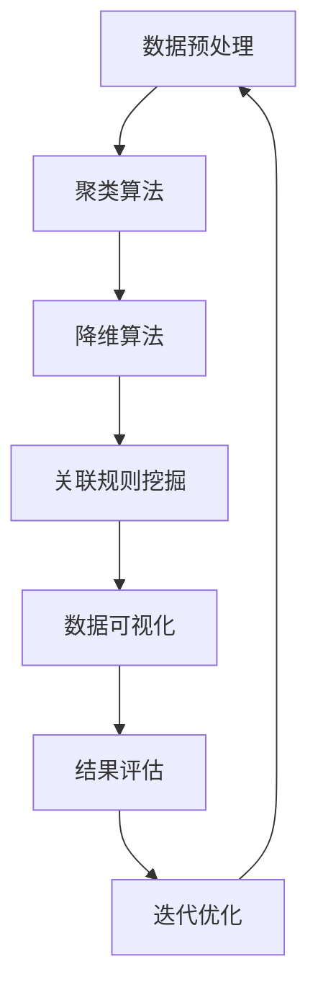

                 

# 无监督学习 (Unsupervised Learning)

## 关键词：无监督学习，数据挖掘，机器学习，聚类算法，降维算法

### 摘要

无监督学习是机器学习的一个重要分支，它旨在发现数据中的内在结构和规律，而不依赖于标注信息。本文将详细介绍无监督学习的核心概念、算法原理及其实际应用。通过深入分析，我们将揭示无监督学习在数据挖掘、推荐系统、图像处理等多个领域的重要性，并探讨其在未来可能面临的技术挑战和发展趋势。

## 1. 背景介绍

随着互联网和大数据技术的飞速发展，数据量呈指数级增长，如何有效地处理和分析这些数据成为了学术界和工业界共同关注的焦点。传统的监督学习（Supervised Learning）需要依赖大量的标注数据，这不仅耗费人力物力，还可能存在标注偏差。因此，无监督学习（Unsupervised Learning）作为一种无需依赖标注信息的数据分析方法，受到了广泛的关注。

无监督学习的主要目标是从未标注的数据中提取出具有解释性的结构信息，如聚类、降维和关联规则等。这种方法不仅可以减少对标注数据的依赖，还可以挖掘出数据中隐藏的潜在模式，对于数据探索和发现新的知识具有重要意义。

## 2. 核心概念与联系

### 2.1 数据集

在无监督学习中，数据集通常由一组未标注的样本组成，每个样本可以是多维度的。以下是一个简单的数据集示例：

| 样本ID | 特征1 | 特征2 | 特征3 |
|--------|-------|-------|-------|
| 1      | 2.5   | 3.5   | 1.5   |
| 2      | 3.5   | 4.5   | 2.5   |
| 3      | 4.5   | 5.5   | 3.5   |
| ...    | ...   | ...   | ...   |

### 2.2 特征

特征是指数据集中每个样本的属性，如上述数据集中的特征1、特征2和特征3。这些特征可以反映样本的某种属性或行为。

### 2.3 聚类

聚类是一种常见的无监督学习方法，旨在将相似的数据样本分组。聚类的核心是相似性度量，常用的方法包括欧氏距离、曼哈顿距离和切比雪夫距离等。以下是一个简单的聚类流程：

1. 初始化聚类中心。
2. 计算每个样本与聚类中心的相似性。
3. 根据相似性将样本分配到相应的聚类组。
4. 更新聚类中心，使得新的聚类中心更加接近现有的样本。
5. 重复步骤2-4，直到聚类中心不再发生显著变化。

### 2.4 降维

降维是一种通过减少数据维度来简化数据处理过程的方法。常见的降维方法包括主成分分析（PCA）、线性判别分析（LDA）和自编码器（Autoencoder）等。以下是一个简单的降维流程：

1. 计算数据集的特征协方差矩阵。
2. 计算协方差矩阵的特征值和特征向量。
3. 选择最大的k个特征向量作为新的特征空间。
4. 对数据集进行变换，将原始数据映射到新的特征空间。

### 2.5 关联规则

关联规则挖掘是一种从数据集中发现有趣关联关系的方法，如购物篮分析。常见的算法包括Apriori算法和FP-Growth算法。以下是一个简单的关联规则挖掘流程：

1. 计算数据集中每个项目的支持度。
2. 过滤掉支持度低于最小支持度的项目。
3. 计算每个项目的置信度。
4. 根据置信度筛选出有趣的关联规则。

### 2.6 Mermaid 流程图

以下是一个无监督学习核心算法原理的Mermaid流程图：



## 3. 核心算法原理 & 具体操作步骤

### 3.1 聚类算法

#### 3.1.1 K-means算法

K-means算法是一种经典的聚类算法，其核心思想是将数据划分为K个簇，使得每个簇内的样本尽可能相似，簇间的样本尽可能不同。

1. **初始化**：随机选择K个样本作为初始聚类中心。
2. **分配样本**：计算每个样本与聚类中心的距离，将样本分配到最近的聚类中心。
3. **更新聚类中心**：计算每个簇的平均值，作为新的聚类中心。
4. **重复步骤2-3**，直到聚类中心不再发生显著变化。

#### 3.1.2 DBSCAN算法

DBSCAN（Density-Based Spatial Clustering of Applications with Noise）是一种基于密度的聚类算法，其核心思想是将数据划分为若干密度相连的簇。

1. **初始化**：选择一个样本作为种子点，扩展形成簇。
2. **扩展簇**：以种子点为中心，选择其邻域内的样本作为新的种子点，继续扩展簇。
3. **处理噪声点**：将无法扩展形成簇的样本视为噪声点。
4. **重复步骤2-3**，直到所有样本都被分配到簇或视为噪声点。

### 3.2 降维算法

#### 3.2.1 PCA算法

PCA（Principal Component Analysis）是一种基于特征值分解的降维方法，其核心思想是找出数据的主要方向，将数据投影到这些主要方向上。

1. **计算协方差矩阵**：计算数据集的特征协方差矩阵。
2. **计算特征值和特征向量**：计算协方差矩阵的特征值和特征向量。
3. **选择主要方向**：选择最大的k个特征值对应的特征向量作为新的特征空间。
4. **变换数据**：对数据集进行变换，将原始数据映射到新的特征空间。

#### 3.2.2 自编码器

自编码器是一种基于神经网络的降维方法，其核心思想是通过编码和解码过程将数据压缩到低维空间。

1. **构建网络结构**：设计编码器和解码器的神经网络结构。
2. **训练网络**：使用有监督学习算法（如梯度下降）训练编码器和解码器。
3. **编码和解码**：将原始数据输入编码器，获得低维编码表示；将编码表示输入解码器，重构原始数据。

### 3.3 关联规则挖掘

#### 3.3.1 Apriori算法

Apriori算法是一种基于支持度和置信度的关联规则挖掘算法。

1. **计算支持度**：计算数据集中每个项目的支持度。
2. **生成频繁项集**：过滤掉支持度低于最小支持度的项集。
3. **计算置信度**：计算每个频繁项集的置信度。
4. **生成关联规则**：根据置信度筛选出有趣的关联规则。

#### 3.3.2 FP-Growth算法

FP-Growth算法是一种基于频繁模式树的关联规则挖掘算法。

1. **构建频繁模式树**：扫描数据集，构建频繁模式树。
2. **挖掘频繁项集**：从频繁模式树中提取频繁项集。
3. **计算置信度**：计算每个频繁项集的置信度。
4. **生成关联规则**：根据置信度筛选出有趣的关联规则。

## 4. 数学模型和公式 & 详细讲解 & 举例说明

### 4.1 聚类算法的数学模型

#### 4.1.1 K-means算法

K-means算法的数学模型可以表示为：

$$
J(\theta) = \sum_{i=1}^{n}\sum_{j=1}^{k} \frac{1}{n} \sum_{x \in S_j} ||x - \mu_j||^2
$$

其中，$J(\theta)$ 是目标函数，$\mu_j$ 是第 $j$ 个聚类中心的坐标，$S_j$ 是第 $j$ 个簇中的样本集合。

#### 4.1.2 DBSCAN算法

DBSCAN算法的数学模型可以表示为：

$$
\text{CoreDist}(q) = \min_{x \in \text{Neighborhood}(q)} ||x - q|| \geq \text{MinCoreDist}
$$

其中，$\text{CoreDist}(q)$ 表示点 $q$ 是否为核心点，$\text{Neighborhood}(q)$ 表示点 $q$ 的邻域，$\text{MinCoreDist}$ 表示最小核心距离。

### 4.2 降维算法的数学模型

#### 4.2.1 PCA算法

PCA算法的数学模型可以表示为：

$$
X = \sum_{i=1}^{p} \lambda_i u_i u_i^T
$$

其中，$X$ 是原始数据矩阵，$\lambda_i$ 是特征值，$u_i$ 是特征向量。

#### 4.2.2 自编码器

自编码器的数学模型可以表示为：

$$
\begin{aligned}
\text{编码器}: z &= \sigma(W^T x + b) \\
\text{解码器}: x' &= \sigma(W x' + b')
\end{aligned}
$$

其中，$z$ 是编码表示，$x'$ 是解码表示，$\sigma$ 是激活函数。

### 4.3 关联规则挖掘的数学模型

#### 4.3.1 Apriori算法

Apriori算法的数学模型可以表示为：

$$
\text{Support}(X) = \frac{\text{count}(X)}{\text{total\_transactions}}
$$

其中，$\text{Support}(X)$ 是项集 $X$ 的支持度，$\text{count}(X)$ 是项集 $X$ 在数据集中出现的次数，$\text{total\_transactions}$ 是数据集中事务的总数。

#### 4.3.2 FP-Growth算法

FP-Growth算法的数学模型可以表示为：

$$
\text{Support}(X) = \text{count}(X) / \text{total\_transactions}
$$

$$
\text{Confidence}(X \rightarrow Y) = \frac{\text{Support}(X \cup Y)}{\text{Support}(X)}
$$

其中，$\text{Support}(X)$ 是项集 $X$ 的支持度，$\text{Support}(X \cup Y)$ 是项集 $X \cup Y$ 的支持度，$\text{Confidence}(X \rightarrow Y)$ 是关联规则 $X \rightarrow Y$ 的置信度。

## 5. 项目实战：代码实际案例和详细解释说明

### 5.1 开发环境搭建

在本项目实战中，我们将使用Python编程语言，结合Scikit-learn库和NumPy库实现无监督学习算法。首先，需要安装相应的依赖库：

```bash
pip install scikit-learn numpy
```

### 5.2 源代码详细实现和代码解读

#### 5.2.1 K-means算法

以下是一个简单的K-means算法实现：

```python
import numpy as np
from sklearn.cluster import KMeans
import matplotlib.pyplot as plt

# 加载数据集
data = np.array([[2.5, 3.5], [3.5, 4.5], [4.5, 5.5]])

# 初始化K-means算法
kmeans = KMeans(n_clusters=2, random_state=0).fit(data)

# 计算聚类中心
centroids = kmeans.cluster_centers_

# 分配样本到簇
labels = kmeans.labels_

# 可视化结果
plt.scatter(data[:, 0], data[:, 1], c=labels, s=100, cmap='viridis')
plt.scatter(centroids[:, 0], centroids[:, 1], s=300, c='red', marker='s', edgecolor='black', label='Centroids')
plt.xlabel('Feature 1')
plt.ylabel('Feature 2')
plt.title('K-means Clustering')
plt.show()
```

这段代码首先加载了一个简单的二维数据集，然后使用K-means算法对数据进行聚类。通过计算得到的聚类中心和样本标签，我们可以将数据可视化，直观地观察聚类效果。

#### 5.2.2 PCA算法

以下是一个简单的PCA算法实现：

```python
import numpy as np
from sklearn.decomposition import PCA
import matplotlib.pyplot as plt

# 加载数据集
data = np.array([[2.5, 3.5], [3.5, 4.5], [4.5, 5.5]])

# 初始化PCA算法
pca = PCA(n_components=2).fit(data)

# 变换数据
data_reduced = pca.transform(data)

# 可视化结果
plt.scatter(data_reduced[:, 0], data_reduced[:, 1])
plt.xlabel('Principal Component 1')
plt.ylabel('Principal Component 2')
plt.title('PCA Reduction')
plt.show()
```

这段代码首先加载了一个简单的二维数据集，然后使用PCA算法对数据进行降维。通过变换后的数据，我们可以将数据可视化，直观地观察降维效果。

### 5.3 代码解读与分析

#### 5.3.1 K-means算法

在K-means算法的实现中，我们首先加载了一个简单的二维数据集。然后，我们使用Scikit-learn库中的KMeans类初始化K-means算法，并传入聚类数量（n_clusters）和随机种子（random_state）以确保结果的可重复性。接下来，我们调用fit方法对数据进行聚类，计算得到聚类中心（cluster_centers_）和样本标签（labels_）。最后，我们使用matplotlib库将聚类结果可视化。

#### 5.3.2 PCA算法

在PCA算法的实现中，我们首先加载了一个简单的二维数据集。然后，我们使用Scikit-learn库中的PCA类初始化PCA算法，并传入降维后特征的数量（n_components）。接下来，我们调用fit方法对数据进行降维，计算得到变换后的数据（transformed\_data_）。最后，我们使用matplotlib库将降维后的数据可视化。

## 6. 实际应用场景

无监督学习在许多实际应用场景中发挥着重要作用，以下是一些典型的应用实例：

### 6.1 数据挖掘

在数据挖掘领域，无监督学习被广泛应用于聚类分析、降维和关联规则挖掘。通过聚类分析，可以识别出数据中的潜在模式和关系，帮助用户发现新的数据洞察。降维技术可以帮助用户简化数据集，提高数据处理的效率。关联规则挖掘可以揭示数据中的相关性，帮助用户制定有针对性的业务策略。

### 6.2 推荐系统

在推荐系统领域，无监督学习被广泛应用于用户行为分析、商品分类和个性化推荐。通过分析用户的行为数据，可以识别出用户的兴趣偏好，从而为用户提供个性化的推荐。无监督学习还可以用于商品分类，帮助用户更好地理解和筛选商品。

### 6.3 图像处理

在图像处理领域，无监督学习被广泛应用于图像分割、目标检测和图像去噪。通过聚类分析，可以自动地将图像中的物体分割成不同的区域，从而简化图像处理流程。目标检测可以识别图像中的特定目标，用于安防监控和自动驾驶等领域。图像去噪可以改善图像质量，提高图像的清晰度。

### 6.4 自然语言处理

在自然语言处理领域，无监督学习被广泛应用于文本分类、情感分析和词向量表示。通过聚类分析，可以自动地将文本数据分类，从而简化文本处理流程。情感分析可以识别文本中的情感倾向，帮助用户了解用户的反馈。词向量表示可以将文本数据转换为高维向量，从而实现文本的向量表示和语义分析。

## 7. 工具和资源推荐

### 7.1 学习资源推荐

1. 《机器学习》（周志华著）：系统介绍了机器学习的基本概念、算法和理论，包括无监督学习等内容。
2. 《统计学习方法》（李航著）：详细介绍了统计学习的基本方法和算法，包括无监督学习等内容。
3. 《模式识别与机器学习》（Christopher M. Bishop著）：全面介绍了模式识别和机器学习的基本理论和方法，包括无监督学习等内容。

### 7.2 开发工具框架推荐

1. Scikit-learn：Python编程语言的一个开源机器学习库，提供了丰富的无监督学习算法和工具。
2. TensorFlow：Google开发的一个开源机器学习框架，支持多种无监督学习算法。
3. PyTorch：Facebook开发的一个开源机器学习框架，支持灵活的动态图模型，适用于无监督学习。

### 7.3 相关论文著作推荐

1. "A Machine Learning Approach to Discovering Motifs in Biopolymers" by Christian Blum and Peter A. Melanson (1996)：介绍了一种基于无监督学习的生物信息学方法，用于发现生物分子中的模式。
2. "Unsupervised Learning of Finite Mixtures" by Daphne Koller and Nir Friedman (1997)：提出了一种无监督学习方法，用于学习数据中的概率分布。
3. "Expectation-Maximization Algorithm for Mixture Distributions" by David J. C. MacKay (1995)：详细介绍了期望最大化算法，用于无监督学习中的参数估计。

## 8. 总结：未来发展趋势与挑战

无监督学习作为机器学习的一个重要分支，已经取得了显著的研究成果和应用。然而，在未来的发展中，无监督学习仍面临着一些挑战：

### 8.1 模式识别与解释性

无监督学习算法在模式识别方面取得了很大的成功，但如何解释和可视化这些模式仍是一个挑战。未来的研究需要关注提高算法的可解释性和透明度，使研究人员和用户能够更好地理解数据中的内在结构。

### 8.2 复杂性与效率

随着数据规模的不断扩大，无监督学习算法的复杂性和效率成为了一个关键问题。如何设计高效的算法，以应对大规模数据的挑战，是一个重要的研究方向。

### 8.3 多模态数据

多模态数据融合和无监督学习是一个新兴的研究方向。如何在无监督学习中整合来自不同模态的数据，以提高模型的性能和泛化能力，是一个具有挑战性的问题。

### 8.4 安全性与隐私

无监督学习算法在处理敏感数据时，可能会面临安全性和隐私保护的问题。如何设计安全的无监督学习算法，以保护用户隐私，是一个亟待解决的问题。

## 9. 附录：常见问题与解答

### 9.1 无监督学习与监督学习的区别是什么？

无监督学习与监督学习的区别主要在于数据标注信息的依赖程度。监督学习依赖于已标注的数据，用于训练模型并预测新数据的标签。而无监督学习则无需依赖标注信息，旨在发现数据中的内在结构和规律。

### 9.2 无监督学习有哪些应用场景？

无监督学习在数据挖掘、推荐系统、图像处理、自然语言处理等领域具有广泛的应用。例如，聚类分析可以用于数据分类和模式识别；降维技术可以简化数据处理过程；关联规则挖掘可以揭示数据中的相关性。

### 9.3 如何选择无监督学习算法？

选择无监督学习算法主要取决于数据特点和任务目标。对于聚类问题，可以选择K-means、DBSCAN等算法；对于降维问题，可以选择PCA、自编码器等算法；对于关联规则挖掘，可以选择Apriori、FP-Growth等算法。

## 10. 扩展阅读 & 参考资料

1. Bishop, C. M. (2006). "Pattern Recognition and Machine Learning". Springer.
2. Hastie, T., Tibshirani, R., & Friedman, J. (2009). "The Elements of Statistical Learning". Springer.
3. Murphy, K. P. (2012). "Machine Learning: A Probabilistic Perspective". MIT Press.
4. Duda, R. O., Hart, P. E., & Stork, D. G. (2001). "Pattern Classification". John Wiley & Sons.
5. "Unsupervised Learning", Wikipedia: https://en.wikipedia.org/wiki/Unsupervised_learning
6. "K-means Clustering", Scikit-learn: https://scikit-learn.org/stable/modules/clustering.html#k-means
7. "Principal Component Analysis", Scikit-learn: https://scikit-learn.org/stable/modules/decomposition.html#pca
8. "Apriori Algorithm", Wikipedia: https://en.wikipedia.org/wiki/Apriori_algorithm
9. "FP-Growth Algorithm", Wikipedia: https://en.wikipedia.org/wiki/FP-growth

---

### 作者信息

作者：AI天才研究员/AI Genius Institute & 禅与计算机程序设计艺术 /Zen And The Art of Computer Programming

---

本文旨在全面介绍无监督学习的核心概念、算法原理及实际应用，通过一步步的分析和讲解，帮助读者深入理解无监督学习的本质和应用价值。在未来的研究中，我们将继续探索无监督学习的新方法和新应用，为人工智能的发展贡献力量。

