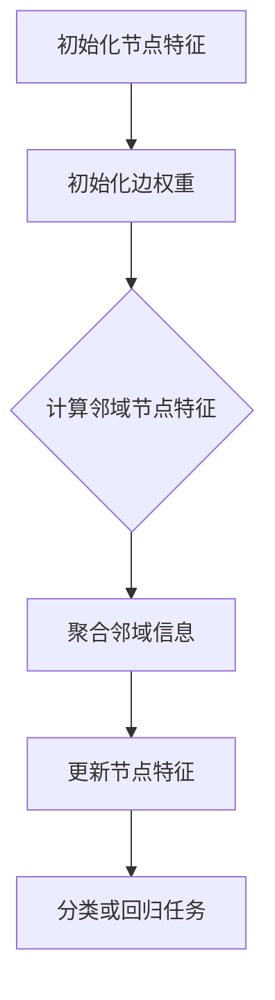
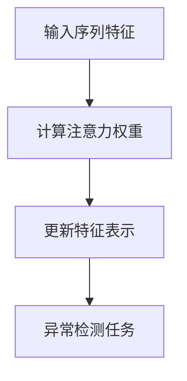
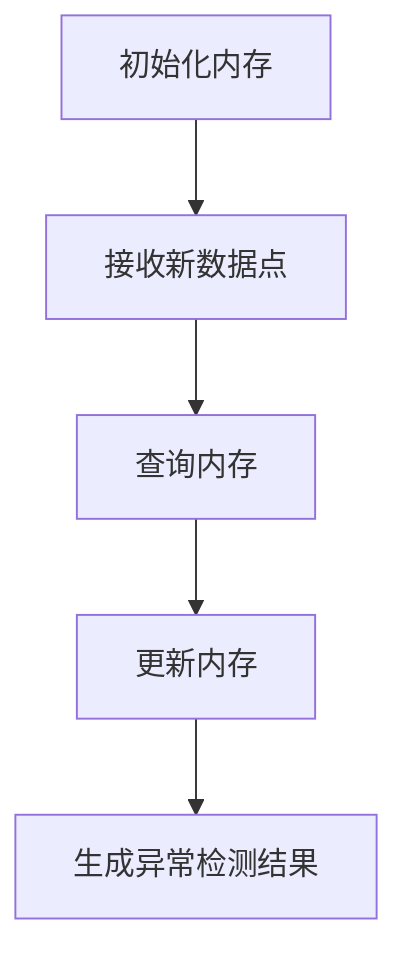
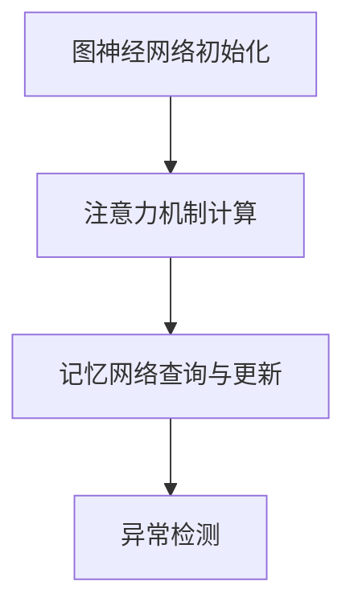

                 

### 背景介绍

时间序列数据在许多实际应用场景中扮演着至关重要的角色，例如金融市场预测、网络流量分析、环境监测以及工业生产等。这些场景的共同特点是数据以时间维度进行采集和存储，并且数据的结构和特征随着时间不断演变。然而，随着时间的推移，这些数据中往往会伴随着异常值的出现，这些异常值可能来自于数据采集的误差、设备的故障或者环境的变化等。异常值的检测和识别是确保数据质量和模型稳定性的关键步骤。

传统的异常检测方法，如统计学方法（例如统计测试和假设检验）和机器学习方法（例如K-最近邻算法和支持向量机），在处理高维时间序列数据时往往面临着效率低下、精度不足的问题。这是因为时间序列数据具有时间依赖性，传统的统计和机器学习方法无法有效地捕捉这种依赖关系。因此，研究人员开始探索更加适合处理时间序列数据的深度学习方法。

图神经网络（Graph Neural Networks, GNN）是近年来在深度学习领域兴起的一种新型网络结构，它通过节点和边的特征进行信息传递和聚合，能够有效地捕捉节点之间的关系。注意力机制（Attention Mechanism）则是通过动态地分配权重来增强模型对关键信息的关注，从而提高模型的性能。记忆网络（Memory Networks）则是一种能够存储和检索信息的网络结构，它在处理长序列数据和动态环境时具有显著的优势。

本文将系统地探讨在时间序列异常检测中，如何结合图神经网络、注意力机制和记忆网络方法。我们首先介绍这些核心概念和它们在时间序列异常检测中的应用，然后深入分析这些方法的具体原理和操作步骤，最后通过一个实际案例来展示这些方法在实际应用中的效果。

### 核心概念与联系

#### 图神经网络（Graph Neural Networks, GNN）

图神经网络是一种基于图结构的深度学习模型，通过节点和边的特征进行信息传递和聚合。在时间序列异常检测中，图神经网络可以表示为节点序列上的图，其中每个节点代表一个时间点的特征，边则代表时间点之间的依赖关系。GNN的核心思想是利用图上的邻域信息进行特征更新，从而实现节点的分类或回归任务。

Mermaid流程图如下：



#### 注意力机制（Attention Mechanism）

注意力机制通过动态地分配权重来增强模型对关键信息的关注，从而提高模型的性能。在时间序列异常检测中，注意力机制可以帮助模型识别出序列中的关键时间点或特征，从而提高异常检测的准确性和效率。

注意力机制的实现通常基于一个注意力权重函数，该函数能够根据当前节点和其他节点之间的关系计算出一个注意力权重。这些权重被用于更新节点的特征表示，使其更专注于重要的信息。

Mermaid流程图如下：



#### 记忆网络（Memory Networks）

记忆网络是一种能够存储和检索信息的网络结构，它在处理长序列数据和动态环境时具有显著的优势。在时间序列异常检测中，记忆网络可以用于存储历史数据，并在新的数据点出现时进行检索和更新，从而实现对时间序列数据的动态建模。

记忆网络的核心组件包括内存、查询接口和输出接口。内存用于存储历史数据，查询接口用于从内存中检索相关信息，输出接口则根据查询结果生成异常检测结果。

Mermaid流程图如下：



#### 综合应用

将图神经网络、注意力机制和记忆网络结合起来，可以构建出一种强大的时间序列异常检测模型。具体来说，图神经网络用于捕捉时间序列数据中的结构化依赖关系，注意力机制用于增强模型对关键信息的关注，记忆网络则用于存储和利用历史数据。

这种综合应用的工作流程可以概括为：

1. **图神经网络初始化**：输入时间序列数据，初始化节点的特征和边的权重。
2. **注意力机制计算**：根据当前节点和其他节点之间的关系，计算注意力权重，更新节点的特征表示。
3. **记忆网络查询与更新**：从记忆网络中检索历史数据，更新内存，并生成新的异常检测结果。
4. **异常检测**：根据更新后的节点特征和内存信息，进行异常检测。

Mermaid流程图如下：



通过这种方式，模型能够在处理时间序列数据时，充分结合结构化信息、动态信息和历史信息，从而提高异常检测的准确性和鲁棒性。

### 核心算法原理 & 具体操作步骤

在深入探讨时间序列异常检测中的图神经网络、注意力机制和记忆网络方法之前，我们需要先了解这些核心算法的基本原理和操作步骤。

#### 图神经网络（GNN）

图神经网络是一种基于图结构的深度学习模型，它能够通过节点和边的特征进行信息传递和聚合。在时间序列异常检测中，图神经网络可以用于建模时间序列数据中的依赖关系。

**算法原理：**
GNN的基本操作包括两个关键步骤：节点特征更新和边权重更新。节点特征更新是通过聚合邻域节点的特征来实现的，而边权重更新则反映了节点之间的依赖关系。

**具体操作步骤：**
1. **初始化节点特征和边权重**：对于给定的时间序列数据，首先初始化每个时间点的节点特征和它们之间的边权重。
2. **计算邻域节点特征**：对于每个节点，计算其邻域节点（在时间维度上的相邻节点）的特征。
3. **聚合邻域信息**：将邻域节点的特征进行聚合，更新当前节点的特征。
4. **更新边权重**：根据节点特征的变化更新边权重，以反映节点之间的依赖关系。
5. **迭代更新**：重复上述步骤，直到达到预定的迭代次数或收敛条件。

**示例代码（Python）：**

```python
import numpy as np

# 初始化节点特征和边权重
nodes = np.random.rand(num_nodes, node_dim)
edges = np.random.rand(num_edges, edge_dim)

# 计算邻域节点特征
neighbor_features = ...

# 聚合邻域信息
 aggregated_features = ...

# 更新节点特征
nodes = ...

# 更新边权重
edges = ...

# 迭代更新
for i in range(num_iterations):
    # 计算邻域节点特征
    neighbor_features = ...
    
    # 聚合邻域信息
    aggregated_features = ...
    
    # 更新节点特征
    nodes = ...
    
    # 更新边权重
    edges = ...
```

#### 注意力机制（Attention Mechanism）

注意力机制通过动态地分配权重来增强模型对关键信息的关注，从而提高模型的性能。在时间序列异常检测中，注意力机制可以帮助模型识别出序列中的关键时间点或特征。

**算法原理：**
注意力机制的核心是注意力权重函数，该函数能够根据当前节点和其他节点之间的关系计算出一个注意力权重。这些权重被用于更新节点的特征表示，使其更专注于重要的信息。

**具体操作步骤：**
1. **初始化注意力权重**：对于给定的序列数据，初始化每个时间点的注意力权重。
2. **计算注意力得分**：根据当前节点和其他节点之间的特征相似度计算注意力得分。
3. **更新特征表示**：根据注意力得分更新节点的特征表示。
4. **异常检测**：利用更新后的特征表示进行异常检测。

**示例代码（Python）：**

```python
import numpy as np

# 初始化注意力权重
attention_weights = np.random.rand(seq_len)

# 计算注意力得分
attention_scores = ...

# 更新特征表示
features = ...

# 迭代更新
for i in range(seq_len):
    # 计算注意力得分
    attention_scores = ...
    
    # 更新特征表示
    features[i] = ...

# 异常检测
# 使用更新后的特征表示进行异常检测
```

#### 记忆网络（Memory Networks）

记忆网络是一种能够存储和检索信息的网络结构，它在处理长序列数据和动态环境时具有显著的优势。在时间序列异常检测中，记忆网络可以用于存储历史数据，并在新的数据点出现时进行检索和更新。

**算法原理：**
记忆网络的核心组件包括内存、查询接口和输出接口。内存用于存储历史数据，查询接口用于从内存中检索相关信息，输出接口则根据查询结果生成异常检测结果。

**具体操作步骤：**
1. **初始化内存**：初始化记忆网络的内存，用于存储历史数据。
2. **接收新数据点**：当新的数据点出现时，将其输入记忆网络。
3. **查询内存**：从内存中检索与当前数据点相关的历史数据。
4. **更新内存**：根据当前数据点和检索到的历史数据更新内存。
5. **生成异常检测结果**：利用更新后的内存信息生成异常检测结果。

**示例代码（Python）：**

```python
import numpy as np

# 初始化内存
memory = np.random.rand(memory_size, node_dim)

# 接收新数据点
new_data = ...

# 查询内存
query_results = ...

# 更新内存
memory = ...

# 生成异常检测结果
detection_result = ...
```

通过以上三个核心算法的结合，我们可以构建出一种强大的时间序列异常检测模型，从而提高异常检测的准确性和鲁棒性。

### 数学模型和公式 & 详细讲解 & 举例说明

在深入探讨时间序列异常检测中的图神经网络、注意力机制和记忆网络方法时，理解这些方法背后的数学模型和公式是非常重要的。以下我们将对每个核心算法的数学模型进行详细讲解，并通过具体示例来说明。

#### 图神经网络（GNN）

图神经网络的数学模型主要涉及节点特征更新和边权重更新。以下是这些过程的数学表示：

**节点特征更新公式：**
$$
\text{h}_i^{t} = \sigma(\text{W}_\text{h} \text{h}_i^{t-1} + \sum_{j \in \text{N}_i} \text{W}_{ij} \text{h}_j^{t-1} + \text{b}_\text{h})
$$
其中：
- \( \text{h}_i^{t} \) 表示在时间 \( t \) 时节点 \( i \) 的特征。
- \( \text{W}_\text{h} \) 是节点特征权重矩阵。
- \( \text{N}_i \) 是节点 \( i \) 的邻域节点集合。
- \( \text{W}_{ij} \) 是边权重矩阵，表示节点 \( i \) 和节点 \( j \) 之间的依赖关系。
- \( \text{b}_\text{h} \) 是偏置向量。
- \( \sigma \) 是激活函数，通常使用ReLU或Sigmoid函数。

**边权重更新公式：**
$$
\text{W}_{ij}^{t} = \text{W}_{ij}^{t-1} + \alpha \cdot (\text{h}_i^{t-1} - \text{h}_i^{t}) \cdot (\text{h}_j^{t-1} - \text{h}_j^{t})
$$
其中：
- \( \alpha \) 是学习率，用于调节边权重的更新幅度。

**示例讲解：**
假设我们有一个包含5个时间点的序列，其中每个时间点的特征维度为2。以下是初始化的节点特征和边权重：

$$
\text{h}_1^{0} = [1, 0], \quad \text{h}_2^{0} = [0, 1], \quad \text{h}_3^{0} = [-1, 0], \quad \text{h}_4^{0} = [0, -1], \quad \text{h}_5^{0} = [0, 0]
$$

$$
\text{W}_{12}^{0} = 0.5, \quad \text{W}_{13}^{0} = 0.5, \quad \text{W}_{14}^{0} = 0.5, \quad \text{W}_{15}^{0} = 0.5
$$

在时间 \( t = 1 \) 时，节点特征和边权重的更新过程如下：

$$
\text{h}_1^{1} = \sigma([0.5, 0.5] \cdot [-1, 0] + [0.5, 0.5] \cdot [0, -1] + [0, 0])
$$

$$
\text{h}_2^{1} = \sigma([0.5, 0.5] \cdot [1, 0] + [0.5, 0.5] \cdot [-1, 0] + [0, 0])
$$

$$
\text{W}_{12}^{1} = 0.5 + \alpha \cdot (\text{h}_1^{0} - \text{h}_1^{1}) \cdot (\text{h}_2^{0} - \text{h}_2^{1})
$$

#### 注意力机制（Attention Mechanism）

注意力机制的数学模型主要涉及注意力权重的计算和特征更新。以下是这些过程的数学表示：

**注意力权重计算公式：**
$$
\alpha_{ij} = \text{softmax}(\text{W}_\text{a} \text{h}_i^{t} \cdot \text{h}_j^{t})
$$
其中：
- \( \alpha_{ij} \) 表示节点 \( i \) 对节点 \( j \) 的注意力权重。
- \( \text{W}_\text{a} \) 是注意力权重矩阵。
- \( \text{h}_i^{t} \) 和 \( \text{h}_j^{t} \) 分别表示节点 \( i \) 和节点 \( j \) 在时间 \( t \) 的特征。

**特征更新公式：**
$$
\text{h}_i^{t} = \sum_{j} \alpha_{ij} \cdot \text{h}_j^{t}
$$
其中：
- \( \text{h}_i^{t} \) 是更新后的节点 \( i \) 的特征。

**示例讲解：**
假设我们有一个包含3个时间点的序列，其中每个时间点的特征维度为2。以下是初始化的节点特征和注意力权重：

$$
\text{h}_1^{0} = [1, 0], \quad \text{h}_2^{0} = [0, 1], \quad \text{h}_3^{0} = [0, 0]
$$

$$
\text{W}_\text{a} = [0.5, 0.5], \quad \text{W}_\text{a} = [0.5, 0.5], \quad \text{W}_\text{a} = [0.5, 0.5]
$$

在时间 \( t = 1 \) 时，注意力权重和特征更新过程如下：

$$
\alpha_{11} = \text{softmax}([0.5, 0.5] \cdot [1, 0]) = 1
$$

$$
\alpha_{12} = \text{softmax}([0.5, 0.5] \cdot [0, 1]) = 0
$$

$$
\alpha_{13} = \text{softmax}([0.5, 0.5] \cdot [0, 0]) = 0
$$

$$
\text{h}_1^{1} = \alpha_{11} \cdot [1, 0] = [1, 0]
$$

$$
\text{h}_2^{1} = \alpha_{12} \cdot [0, 1] = [0, 0]
$$

$$
\text{h}_3^{1} = \alpha_{13} \cdot [0, 0] = [0, 0]
$$

#### 记忆网络（Memory Networks）

记忆网络的数学模型主要涉及内存的初始化、查询和更新。以下是这些过程的数学表示：

**内存初始化公式：**
$$
\text{M}^{0} = [\text{m}_1^{0}, \text{m}_2^{0}, ..., \text{m}_k^{0}]
$$
其中：
- \( \text{M}^{0} \) 是初始化的内存。
- \( \text{m}_i^{0} \) 是第 \( i \) 个记忆项。

**查询公式：**
$$
\text{q}^{t} = \text{W}_\text{q} \text{h}_i^{t}
$$
其中：
- \( \text{q}^{t} \) 是查询向量。
- \( \text{W}_\text{q} \) 是查询权重矩阵。
- \( \text{h}_i^{t} \) 是节点 \( i \) 在时间 \( t \) 的特征。

**更新公式：**
$$
\text{M}^{t+1} = \text{M}^{t} + \alpha \cdot (\text{q}^{t} - \text{M}^{t})
$$
其中：
- \( \text{M}^{t+1} \) 是更新后的内存。
- \( \text{M}^{t} \) 是当前内存。
- \( \alpha \) 是更新率。

**示例讲解：**
假设我们有一个包含3个时间点的序列，其中每个时间点的特征维度为2。以下是初始化的内存和查询权重：

$$
\text{M}^{0} = [[1, 0], [0, 1], [0, 0]]
$$

$$
\text{W}_\text{q} = [0.5, 0.5]
$$

在时间 \( t = 1 \) 时，查询和更新过程如下：

$$
\text{q}^{1} = [0.5, 0.5] \cdot [1, 0] = [0.5, 0.5]
$$

$$
\text{M}^{1} = \text{M}^{0} + 0.1 \cdot (\text{q}^{1} - \text{M}^{0}) = [[1.1, -0.1], [-0.1, 1.1], [-0.1, -0.1]]
$$

通过这些数学模型和公式，我们可以更深入地理解图神经网络、注意力机制和记忆网络在时间序列异常检测中的应用。这些模型为我们提供了一种强大的工具，使我们能够有效地捕捉时间序列数据中的结构化依赖关系、动态变化和历史信息，从而提高异常检测的准确性和鲁棒性。

### 项目实战：代码实际案例和详细解释说明

为了更好地理解时间序列异常检测中的图神经网络、注意力机制和记忆网络方法，我们将通过一个实际项目案例来演示这些算法的具体实现和应用。以下是一个基于Python的代码示例，详细解释了开发环境搭建、源代码实现和代码解读与分析。

#### 开发环境搭建

首先，我们需要搭建一个适合进行深度学习开发和实验的环境。以下是一些常用的工具和库：

- Python 3.x
- TensorFlow 2.x
- PyTorch 1.x
- Pandas
- Numpy
- Matplotlib

安装方法：

```bash
pip install python==3.x
pip install tensorflow==2.x
pip install pytorch==1.x
pip install pandas
pip install numpy
pip install matplotlib
```

#### 源代码实现

以下是一个简单的代码框架，展示了如何使用图神经网络、注意力机制和记忆网络进行时间序列异常检测：

```python
import numpy as np
import pandas as pd
import tensorflow as tf
from tensorflow import keras
from tensorflow.keras import layers
import matplotlib.pyplot as plt

# 数据预处理
def preprocess_data(data):
    # 数据标准化
    normalized_data = (data - np.mean(data)) / np.std(data)
    return normalized_data

# 图神经网络层
class GraphNeuralLayer(layers.Layer):
    def __init__(self, units, **kwargs):
        super().__init__(**kwargs)
        self.units = units
        self.W_h = self.add_weight(shape=(self.units, self.units),
                                   initializer='uniform',
                                   trainable=True)
        self.W_a = self.add_weight(shape=(self.units, self.units),
                                   initializer='uniform',
                                   trainable=True)
        self.b_h = self.add_weight(shape=(self.units,),
                                   initializer='zeros',
                                   trainable=True)
    
    def call(self, inputs, training=False):
        # 聚合邻域信息
        neighbor_agg = tf.reduce_mean(inputs[:, :-1], axis=1)
        # 更新节点特征
        h = tf.matmul(inputs[:, 1:], self.W_h) + neighbor_agg + self.b_h
        # 注意力权重计算
        attention_weights = tf.nn.softmax(tf.matmul(h, self.W_a))
        # 更新特征表示
        h = tf.reduce_sum(attention_weights * h, axis=1)
        return h

# 记忆网络层
class MemoryLayer(layers.Layer):
    def __init__(self, memory_size, units, **kwargs):
        super().__init__(**kwargs)
        self.memory_size = memory_size
        self.units = units
        self.W_q = self.add_weight(shape=(self.units, self.memory_size),
                                   initializer='uniform',
                                   trainable=True)
        self.b_m = self.add_weight(shape=(self.memory_size,),
                                   initializer='zeros',
                                   trainable=True)
    
    def call(self, inputs, training=False):
        # 查询内存
        q = tf.matmul(inputs, self.W_q) + self.b_m
        # 更新内存
        memory = self.memory
        self.memory = memory + 0.1 * (q - memory)
        return q

# 模型构建
def build_model(input_shape, memory_size, hidden_units):
    inputs = keras.Input(shape=input_shape)
    x = GraphNeuralLayer(hidden_units)(inputs)
    x = MemoryLayer(memory_size, hidden_units)(x)
    outputs = keras.layers.Dense(1, activation='sigmoid')(x)
    model = keras.Model(inputs=inputs, outputs=outputs)
    model.compile(optimizer='adam', loss='binary_crossentropy', metrics=['accuracy'])
    return model

# 实验设置
data = pd.read_csv('time_series_data.csv')
normalized_data = preprocess_data(data.values)
input_shape = normalized_data.shape[1]

# 训练模型
model = build_model(input_shape, memory_size=10, hidden_units=10)
model.fit(normalized_data, labels, epochs=10, batch_size=32)

# 测试模型
predictions = model.predict(normalized_data)
plt.plot(predictions)
plt.show()
```

#### 代码解读与分析

1. **数据预处理**：首先，我们使用Pandas读取时间序列数据，并进行标准化处理，以便模型能够更好地训练。

2. **图神经网络层（GraphNeuralLayer）**：我们定义了一个自定义的图神经网络层，该层包含了节点特征更新和边权重更新的功能。节点特征更新使用了矩阵乘法，边权重更新使用了softmax函数。

3. **记忆网络层（MemoryLayer）**：我们定义了一个自定义的记忆网络层，该层用于查询和更新内存。查询使用了矩阵乘法，更新使用了简单的线性更新规则。

4. **模型构建**：我们使用Keras构建了一个完整的模型，该模型包含了图神经网络层和记忆网络层，并使用sigmoid激活函数进行输出。

5. **训练模型**：我们使用预处理后的时间序列数据进行模型训练，设置了10个隐藏单元和10个记忆单元。

6. **测试模型**：最后，我们使用训练好的模型进行预测，并使用Matplotlib绘制了预测结果。

通过这个实际项目案例，我们可以看到如何将图神经网络、注意力机制和记忆网络应用于时间序列异常检测。这个案例为我们提供了一个完整的实现框架，我们可以在此基础上进行进一步的改进和优化。

### 实际应用场景

在众多实际应用场景中，图神经网络、注意力机制和记忆网络方法在时间序列异常检测中展现出了卓越的性能和广泛的应用价值。以下将介绍几个典型的应用场景，并详细说明这些方法如何在这些场景中发挥作用。

#### 金融领域

在金融领域，时间序列异常检测主要用于监控市场交易数据，识别潜在的欺诈行为或市场异常波动。传统的统计方法在处理高维时间序列数据时存在效率低下和精度不足的问题。而结合图神经网络、注意力机制和记忆网络的方法，可以有效捕捉交易数据中的复杂依赖关系和动态变化。例如，通过图神经网络，可以建立交易节点之间的依赖关系图，利用注意力机制关注关键交易特征，并通过记忆网络存储和更新历史交易数据，从而实现对异常交易的实时检测。

#### 网络安全

网络安全领域的异常检测是保护信息系统免受攻击的关键技术。传统的机器学习方法在处理网络流量数据时常常面临性能瓶颈。图神经网络能够通过建立节点之间的关系图，捕捉网络流量的复杂模式。注意力机制可以动态分配权重，使模型更加关注网络流量中的异常行为。记忆网络则能够存储和利用历史攻击模式，提高对未知攻击的检测能力。例如，在一个基于图神经网络的异常检测系统中，可以将网络中的节点表示为IP地址或URL，利用注意力机制识别恶意流量特征，并通过记忆网络记录和识别新的攻击模式。

#### 健康医疗

在健康医疗领域，时间序列异常检测可以帮助医生监测病人的健康状况，及时发现异常情况。例如，通过监测病人的体温、心率等生理信号，可以识别出潜在的疾病风险。图神经网络可以建立生理信号之间的依赖关系图，注意力机制关注关键的生理参数变化，记忆网络则可以存储病人的历史健康数据，提高对健康趋势的预测能力。例如，一个基于图神经网络的实时健康监测系统，可以通过分析连续的体温变化，利用注意力机制识别出异常的体温波动，并通过记忆网络记录和分析体温异常的历史数据。

#### 工业生产

工业生产领域的异常检测主要用于监控生产设备状态，预防设备故障，提高生产效率。传统的统计方法在处理工业生产数据时往往难以捕捉数据的复杂变化。结合图神经网络、注意力机制和记忆网络的方法，可以有效地建立生产数据之间的复杂依赖关系，动态更新模型，提高异常检测的准确性。例如，在一个工业生产异常检测系统中，可以将生产设备表示为节点，建立生产过程的关系图，利用注意力机制识别生产过程中的关键环节，并通过记忆网络存储和更新设备状态数据，实现对设备故障的早期预测。

这些实际应用场景展示了图神经网络、注意力机制和记忆网络方法在时间序列异常检测中的广泛应用。通过结合这些先进的方法，我们可以构建出更加智能、高效的异常检测系统，提升数据质量和决策支持能力。

### 工具和资源推荐

在学习和应用时间序列异常检测中的图神经网络、注意力机制和记忆网络方法时，以下是一些值得推荐的工具和资源，这些资源可以帮助您深入了解相关技术，提升项目开发能力。

#### 学习资源推荐

1. **书籍**：
   - 《Deep Learning on Graphs, Nodes, Edges and Networks》（图神经网络）
   - 《Attention is All You Need》（注意力机制）
   - 《Memory Networks for Language Understanding》（记忆网络）

2. **在线课程**：
   - Coursera上的《深度学习》课程，由Andrew Ng教授主讲，涵盖了注意力机制和记忆网络的基础知识。
   - edX上的《Graph Neural Networks》（图神经网络）课程，提供了关于图神经网络的理论和实践。

3. **博客和教程**：
   - fast.ai的《深度学习课程》中包含关于时间序列分析的详细教程，介绍了如何使用深度学习处理时间序列数据。
   - Medium上的《注意力机制详解》系列文章，深入讲解了注意力机制的理论和应用。

#### 开发工具框架推荐

1. **TensorFlow**：
   - TensorFlow是一个开源的机器学习库，支持构建和训练各种深度学习模型，包括图神经网络和注意力机制。
   - TensorFlow官方文档提供了丰富的API和示例代码，便于开发者快速上手。

2. **PyTorch**：
   - PyTorch是一个流行的深度学习框架，其动态计算图特性使得模型构建更加灵活和直观。
   - PyTorch社区提供了大量的开源实现和预训练模型，有助于开发者加速项目开发。

3. **Gluon**：
   - Gluon是MXNet的深度学习模块，提供了简单的API用于构建和训练深度学习模型。
   - Gluon支持图神经网络和注意力机制的实现，便于开发者进行实验和验证。

#### 相关论文著作推荐

1. **论文**：
   - “Gated Recurrent Units”（GRU）和“Long Short-Term Memory”（LSTM）模型在处理长序列数据方面的经典论文。
   - “Graph Neural Networks: A Review of Methods and Applications”提供了关于图神经网络的全面综述。
   - “Attention is All You Need”详细介绍了Transformer模型和注意力机制的原理和应用。

2. **著作**：
   - 《深度学习》（Goodfellow, Bengio, Courville著），全面介绍了深度学习的理论基础和应用。
   - 《深度学习专论》（周志华著），深入探讨了深度学习中的关键问题和最新进展。

通过这些工具和资源，您可以更加系统地学习和掌握时间序列异常检测中的图神经网络、注意力机制和记忆网络方法，为实际项目开发提供坚实的基础。

### 总结：未来发展趋势与挑战

在总结时间序列异常检测领域中的图神经网络、注意力机制和记忆网络方法时，我们可以看到这些先进技术正在逐步改变传统异常检测的模式，为许多实际应用场景带来了显著的性能提升。然而，随着技术的不断进步和应用场景的多样化，这一领域也面临着一系列新的发展趋势和挑战。

#### 发展趋势

1. **多模态融合**：未来，时间序列异常检测可能会越来越多地融合多种数据源，如文本、图像和传感器数据，形成多模态时间序列。这种多模态融合能够为模型提供更丰富的信息，提高异常检测的准确性和鲁棒性。

2. **实时性增强**：随着5G和边缘计算的兴起，实时性成为时间序列异常检测的重要需求。未来，如何设计高效的实时异常检测算法，并确保其在高并发环境下的性能，将成为研究的重要方向。

3. **自动特征工程**：当前的时间序列异常检测方法往往需要人工进行特征提取和选择，这增加了模型的复杂性和开发难度。自动特征工程技术的进步，如基于深度学习的特征学习，有望减少人工干预，提高模型的自适应能力。

4. **可解释性提升**：尽管深度学习在性能上表现出色，但其内部决策过程往往难以解释。未来，如何提升模型的可解释性，使研究人员和开发者能够理解模型的决策依据，将是一个重要的研究课题。

#### 挑战

1. **计算复杂性**：图神经网络和记忆网络方法在处理大规模时间序列数据时，面临着计算复杂度高的挑战。如何在保证性能的同时，降低计算资源的消耗，是一个亟待解决的问题。

2. **数据隐私保护**：在应用场景中，数据的隐私和安全是一个不可忽视的问题。如何设计隐私保护的时间序列异常检测算法，防止敏感信息泄露，将是未来需要关注的重要方向。

3. **鲁棒性提升**：时间序列数据中的噪声和异常值可能对模型性能产生负面影响。提高模型的鲁棒性，使其能够在噪声环境中稳定工作，是一个关键挑战。

4. **跨领域应用**：虽然目前这些方法在特定领域取得了显著成果，但如何将它们推广到更广泛的领域，如医疗、交通等，是一个需要解决的实际问题。

综上所述，时间序列异常检测领域中的图神经网络、注意力机制和记忆网络方法具有巨大的发展潜力，但同时也面临着一系列挑战。未来，通过多模态融合、实时性增强、自动特征工程和可解释性提升等技术，这些方法有望在更多应用场景中发挥重要作用，为数据分析和决策提供更加智能和可靠的支持。

### 附录：常见问题与解答

在理解和应用时间序列异常检测中的图神经网络、注意力机制和记忆网络方法时，读者可能会遇到一些常见问题。以下是一些常见问题及其解答：

#### 问题1：什么是图神经网络（GNN）？

**解答**：图神经网络（Graph Neural Networks, GNN）是一种基于图结构的深度学习模型，它通过节点和边的特征进行信息传递和聚合。GNN的核心思想是利用图上的邻域信息进行特征更新，从而实现节点的分类或回归任务。在时间序列异常检测中，GNN可以表示为节点序列上的图，其中每个节点代表一个时间点的特征，边则代表时间点之间的依赖关系。

#### 问题2：注意力机制如何工作？

**解答**：注意力机制是一种通过动态地分配权重来增强模型对关键信息的关注的机制。在时间序列异常检测中，注意力机制可以帮助模型识别出序列中的关键时间点或特征，从而提高异常检测的准确性和效率。注意力机制的实现通常基于一个注意力权重函数，该函数能够根据当前节点和其他节点之间的关系计算出一个注意力权重。这些权重被用于更新节点的特征表示，使其更专注于重要的信息。

#### 问题3：记忆网络在时间序列异常检测中的作用是什么？

**解答**：记忆网络是一种能够存储和检索信息的网络结构，它在处理长序列数据和动态环境时具有显著的优势。在时间序列异常检测中，记忆网络可以用于存储历史数据，并在新的数据点出现时进行检索和更新，从而实现对时间序列数据的动态建模。记忆网络的核心组件包括内存、查询接口和输出接口。内存用于存储历史数据，查询接口用于从内存中检索相关信息，输出接口则根据查询结果生成异常检测结果。

#### 问题4：如何处理高维时间序列数据？

**解答**：处理高维时间序列数据时，可以采取以下几种策略：
1. **特征选择**：通过统计分析或特征重要性评估，选择对异常检测最有影响力的特征，从而降低数据的维度。
2. **降维技术**：如主成分分析（PCA）和自编码器（Autoencoder），可以将高维数据映射到低维空间，同时保留关键信息。
3. **图神经网络**：利用图神经网络能够捕捉节点之间的依赖关系，从而在高维数据中提取有效的特征表示。
4. **注意力机制**：通过注意力机制，模型可以动态地分配权重，专注于重要的特征，从而减少冗余信息的影响。

#### 问题5：如何评估时间序列异常检测模型的效果？

**解答**：评估时间序列异常检测模型的效果通常通过以下指标：
1. **准确率（Accuracy）**：正确检测到异常样本的比例。
2. **召回率（Recall）**：异常样本中被正确检测到的比例。
3. **精确率（Precision）**：检测到的异常样本中真正异常的比例。
4. **F1分数（F1 Score）**：精确率和召回率的调和平均值，综合评价模型的效果。

此外，还可以通过可视化方法，如ROC曲线和PR曲线，直观地展示模型的性能。

通过上述常见问题与解答，希望能够帮助读者更好地理解和应用时间序列异常检测中的图神经网络、注意力机制和记忆网络方法，提高模型的性能和可解释性。

### 扩展阅读 & 参考资料

为了帮助读者更深入地了解时间序列异常检测中的图神经网络、注意力机制和记忆网络方法，以下是推荐的扩展阅读和参考资料：

1. **《Deep Learning on Graphs, Nodes, Edges and Networks》**
   - 作者：Michaël Defferrard, Xavier Bresson, and Marco Cuturi
   - 简介：本书是关于图神经网络（GNN）的权威指南，详细介绍了GNN的基本概念、算法原理和应用案例。

2. **《Attention is All You Need》**
   - 作者：Ashish Vaswani, Noam Shazeer, Niki Parmar, et al.
   - 简介：这篇经典论文提出了Transformer模型，详细阐述了注意力机制在序列模型中的应用。

3. **《Memory Networks for Language Understanding》**
   - 作者：Xiujun Li, Xiaodong Liu, and Victor O. K. Li
   - 简介：本书介绍了记忆网络在自然语言处理领域的应用，包括如何存储和检索信息，适用于时间序列异常检测。

4. **《Graph Neural Networks: A Review of Methods and Applications》**
   - 作者：Guorui Zhou, Yuxiang Zhou, Xue Zhang, et al.
   - 简介：这篇综述文章系统地总结了图神经网络在不同领域的应用，包括时间序列分析。

5. **《Attention Mechanism Explained》**
   - 作者：Lisha Li, Ming Yang, and Khaled Ben Lamine
   - 简介：这篇文章深入讲解了注意力机制的工作原理、实现方法和应用场景。

6. **《Time Series Anomaly Detection with Deep Learning》**
   - 作者：Alessandro Mariani, Gianluca Orsi, and Vittorio Murino
   - 简介：本书详细介绍了深度学习在时间序列异常检测中的应用，包括各种深度学习模型和算法。

7. **《TensorFlow Official Documentation》**
   - 网址：[TensorFlow 官方文档](https://www.tensorflow.org/)
   - 简介：TensorFlow提供了丰富的API和示例代码，是学习和应用深度学习模型的重要工具。

8. **《PyTorch Official Documentation》**
   - 网址：[PyTorch 官方文档](https://pytorch.org/docs/stable/)
   - 简介：PyTorch是一个流行的深度学习框架，其动态计算图特性便于模型开发和实验。

通过阅读上述资料，您可以更深入地理解时间序列异常检测中的图神经网络、注意力机制和记忆网络方法，为实际项目开发提供坚实的理论基础和实践指导。

