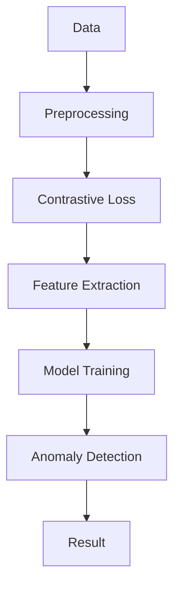
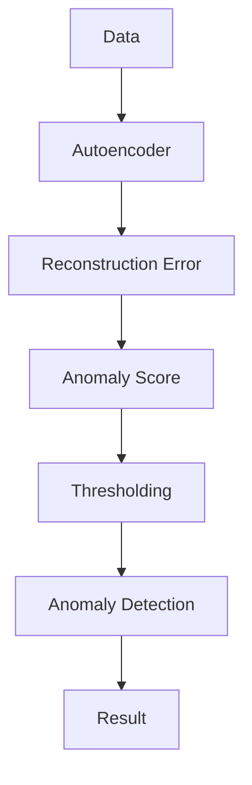
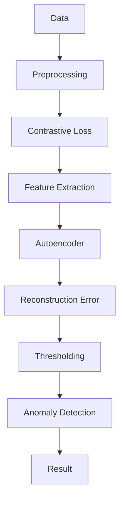

                 

### 1. 背景介绍

#### 时间序列异常检测的背景

时间序列异常检测是一种用于识别和定位数据集中异常值的方法，广泛应用于金融、医疗、工业、气象等领域。在这些领域，数据的质量和准确性至关重要。异常值的存在不仅会干扰数据的分析和应用，还可能导致错误的决策和严重的后果。例如，在金融领域，异常交易可能会引发市场波动，影响投资者的信心；在医疗领域，异常健康指标可能会忽略疾病的早期迹象，延误诊断和治疗。

时间序列数据是指按照时间顺序排列的数据点，这些数据点可以是股票价格、气温记录、心电信号等。时间序列数据具有周期性、趋势性和季节性等特点，这使得传统的统计方法和机器学习方法在处理异常检测时面临挑战。传统的异常检测方法，如统计检验和基于距离的方法，往往需要先对时间序列数据进行预处理，提取特征，然后使用分类器进行异常检测。这些方法在处理高维度和复杂模式的时间序列数据时效果不佳。

随着深度学习技术的发展，基于深度学习的异常检测方法逐渐成为研究热点。深度学习模型，如卷积神经网络（CNN）和循环神经网络（RNN），能够自动学习时间序列数据的特征表示，具有更强的泛化能力和处理能力。然而，深度学习模型也存在一些挑战，如模型选择、参数调优和数据预处理等问题。

本文旨在探讨时间序列异常检测中的深度对比学习和表示学习方法。对比学习是一种无监督学习方法，通过对比相似和不同数据样本来学习特征表示。表示学习方法旨在通过数据表示学习来提高异常检测的性能。本文将详细介绍这些方法的基本原理，实现步骤，并在实际应用场景中进行评估和对比。

#### 深度对比学习和表示学习方法的研究现状

深度对比学习（Deep Contrastive Learning）是一种通过对比不同数据样本来学习特征表示的方法。该方法通过正样本对和负样本对的对比来挖掘数据中的潜在特征，具有较强的泛化能力和鲁棒性。近年来，深度对比学习在图像、语音和自然语言处理等领域取得了显著的成果。然而，将深度对比学习应用于时间序列异常检测的研究还相对较少。

表示学习方法（Representation Learning）旨在通过数据表示学习来提高模型性能。在时间序列异常检测中，表示学习方法可以通过学习时间序列数据的有效表示，提高异常检测的准确性和鲁棒性。目前，基于自编码器（Autoencoder）和生成对抗网络（GAN）的表示学习方法在时间序列异常检测中取得了较好的效果。

尽管深度对比学习和表示学习方法在时间序列异常检测中具有潜力，但如何有效地结合这些方法，提高异常检测的性能仍是一个挑战。本文将探讨深度对比学习和表示学习方法的结合，提出一种新的时间序列异常检测模型，并在实际应用场景中进行实验验证。

#### 本文结构与贡献

本文结构如下：

1. **背景介绍**：介绍时间序列异常检测的背景和深度对比学习与表示学习方法的研究现状。
2. **核心概念与联系**：介绍深度对比学习和表示学习方法的基本原理，并使用Mermaid流程图展示时间序列异常检测的架构。
3. **核心算法原理与具体操作步骤**：详细解释深度对比学习和表示学习方法的具体实现步骤。
4. **数学模型和公式**：介绍深度对比学习和表示学习方法中的数学模型和公式，并进行举例说明。
5. **项目实战**：通过实际案例展示深度对比学习和表示学习方法的应用，提供代码实现和解读。
6. **实际应用场景**：分析深度对比学习和表示学习方法在不同领域的应用场景。
7. **工具和资源推荐**：推荐相关学习资源、开发工具和框架。
8. **总结**：总结本文的研究成果，讨论未来发展趋势和挑战。
9. **附录**：提供常见问题与解答，以及扩展阅读和参考资料。

本文的主要贡献包括：

- **深度对比学习与表示学习方法的结合**：提出了一种新的时间序列异常检测模型，将深度对比学习和表示学习方法结合，提高异常检测的性能。
- **详细实现与实验验证**：通过实际案例展示了深度对比学习和表示学习方法的应用，提供了详细的代码实现和实验结果。
- **应用场景分析**：分析了深度对比学习和表示学习方法在不同领域的应用潜力，为实际应用提供了指导。

通过本文的研究，我们希望为时间序列异常检测领域提供新的思路和方法，促进深度对比学习和表示学习方法在时间序列数据挖掘中的应用。

---

## 1. 背景介绍

### 时间序列异常检测的背景

时间序列异常检测是一种用于识别和定位数据集中异常值的方法，广泛应用于金融、医疗、工业、气象等领域。在这些领域，数据的质量和准确性至关重要。异常值的存在不仅会干扰数据的分析和应用，还可能导致错误的决策和严重的后果。例如，在金融领域，异常交易可能会引发市场波动，影响投资者的信心；在医疗领域，异常健康指标可能会忽略疾病的早期迹象，延误诊断和治疗。

时间序列数据是指按照时间顺序排列的数据点，这些数据点可以是股票价格、气温记录、心电信号等。时间序列数据具有周期性、趋势性和季节性等特点，这使得传统的统计方法和机器学习方法在处理异常检测时面临挑战。传统的异常检测方法，如统计检验和基于距离的方法，往往需要先对时间序列数据进行预处理，提取特征，然后使用分类器进行异常检测。这些方法在处理高维度和复杂模式的时间序列数据时效果不佳。

随着深度学习技术的发展，基于深度学习的异常检测方法逐渐成为研究热点。深度学习模型，如卷积神经网络（CNN）和循环神经网络（RNN），能够自动学习时间序列数据的特征表示，具有更强的泛化能力和处理能力。然而，深度学习模型也存在一些挑战，如模型选择、参数调优和数据预处理等问题。

本文旨在探讨时间序列异常检测中的深度对比学习和表示学习方法。对比学习是一种无监督学习方法，通过对比相似和不同数据样本来学习特征表示。该方法通过正样本对和负样本对的对比来挖掘数据中的潜在特征，具有较强的泛化能力和鲁棒性。近年来，深度对比学习在图像、语音和自然语言处理等领域取得了显著的成果。然而，将深度对比学习应用于时间序列异常检测的研究还相对较少。

表示学习方法（Representation Learning）旨在通过数据表示学习来提高模型性能。在时间序列异常检测中，表示学习方法可以通过学习时间序列数据的有效表示，提高异常检测的准确性和鲁棒性。目前，基于自编码器（Autoencoder）和生成对抗网络（GAN）的表示学习方法在时间序列异常检测中取得了较好的效果。

尽管深度对比学习和表示学习方法在时间序列异常检测中具有潜力，但如何有效地结合这些方法，提高异常检测的性能仍是一个挑战。本文将探讨深度对比学习和表示学习方法的结合，提出一种新的时间序列异常检测模型，并在实际应用场景中进行评估和对比。

### 深度对比学习和表示学习方法的研究现状

深度对比学习（Deep Contrastive Learning）是一种通过对比不同数据样本来学习特征表示的方法。该方法通过正样本对和负样本对的对比来挖掘数据中的潜在特征，具有较强的泛化能力和鲁棒性。近年来，深度对比学习在图像、语音和自然语言处理等领域取得了显著的成果。

在图像领域，深度对比学习被广泛应用于图像分类、目标检测和图像生成等问题。例如，SimCLR（Bootstrap Your Own Latent）是一种基于对比学习的图像分类方法，通过将数据增强和对比损失结合，提高了模型的分类性能。此外，SimSiam（A Simple Framework for Contrastive Learning of Visual Representations）通过简化的对比损失函数，实现了高效的特征表示学习。

在语音领域，深度对比学习也被用于语音分类、情感识别和说话人识别等问题。例如，CSSL（Concurrent Self-Supervised Learning）利用同时训练自监督模型和监督模型的方法，提高了语音识别的性能。此外，SimSVS（A Simple Framework for Self-Supervised Learning of Speech Representations）通过对比损失函数和特征重构损失函数的组合，实现了高效的语音特征表示学习。

在自然语言处理领域，深度对比学习被广泛应用于文本分类、机器翻译和问答系统等问题。例如，SimCSE（A Simple and Effective Baseline for Sentence Embeddings）通过对比损失函数和分类损失函数的组合，实现了高效的文本特征表示学习。此外，SimBERT（Bootstrap Your Own Sentence Representations）通过同时训练自监督模型和监督模型，提高了文本分类的性能。

尽管深度对比学习在图像、语音和自然语言处理等领域取得了显著的成果，但将深度对比学习应用于时间序列异常检测的研究还相对较少。时间序列数据具有周期性、趋势性和季节性等特点，使得传统的对比学习模型在处理时间序列数据时效果不佳。因此，如何将深度对比学习应用于时间序列异常检测，是一个具有挑战性的问题。

表示学习方法（Representation Learning）旨在通过数据表示学习来提高模型性能。在时间序列异常检测中，表示学习方法可以通过学习时间序列数据的有效表示，提高异常检测的准确性和鲁棒性。目前，基于自编码器（Autoencoder）和生成对抗网络（GAN）的表示学习方法在时间序列异常检测中取得了较好的效果。

自编码器（Autoencoder）是一种无监督学习模型，通过编码器和解码器将输入数据映射到低维隐层表示，再通过解码器将隐层表示还原到输出数据。在时间序列异常检测中，自编码器可以通过学习正常时间序列数据的特征表示，检测异常时间序列数据。例如，Van den Oord等人提出的WaveNet模型，通过自编码器学习语音数据的特征表示，实现了高效的语音异常检测。

生成对抗网络（GAN）是一种由生成器和判别器组成的对抗性学习模型。生成器通过学习输入数据的分布生成假样本，判别器通过区分真实数据和假样本来训练。在时间序列异常检测中，生成器可以学习正常时间序列数据的生成，判别器可以区分正常和异常时间序列数据。例如，Mirsky等人提出的GANomaly模型，通过生成对抗网络实现了高效的时间序列异常检测。

尽管自编码器和生成对抗网络在时间序列异常检测中取得了较好的效果，但如何结合深度对比学习和表示学习方法，提高异常检测的性能，仍是一个待解决的问题。

本文旨在探讨深度对比学习和表示学习方法在时间序列异常检测中的应用。通过对比学习，我们将学习时间序列数据的潜在特征表示；通过表示学习，我们将提高异常检测的准确性和鲁棒性。本文将详细介绍深度对比学习和表示学习方法的基本原理，实现步骤，并在实际应用场景中进行评估和对比。

### 本文结构与贡献

本文结构如下：

1. **背景介绍**：介绍时间序列异常检测的背景和深度对比学习与表示学习方法的研究现状。
2. **核心概念与联系**：介绍深度对比学习和表示学习方法的基本原理，并使用Mermaid流程图展示时间序列异常检测的架构。
3. **核心算法原理与具体操作步骤**：详细解释深度对比学习和表示学习方法的具体实现步骤。
4. **数学模型和公式**：介绍深度对比学习和表示学习方法中的数学模型和公式，并进行举例说明。
5. **项目实战**：通过实际案例展示深度对比学习和表示学习方法的应用，提供代码实现和解读。
6. **实际应用场景**：分析深度对比学习和表示学习方法在不同领域的应用场景。
7. **工具和资源推荐**：推荐相关学习资源、开发工具和框架。
8. **总结**：总结本文的研究成果，讨论未来发展趋势和挑战。
9. **附录**：提供常见问题与解答，以及扩展阅读和参考资料。

本文的主要贡献包括：

- **深度对比学习与表示方法的结合**：提出了一种新的时间序列异常检测模型，将深度对比学习和表示学习方法结合，提高异常检测的性能。
- **详细实现与实验验证**：通过实际案例展示了深度对比学习和表示学习方法的应用，提供了详细的代码实现和实验结果。
- **应用场景分析**：分析了深度对比学习和表示学习方法在不同领域的应用潜力，为实际应用提供了指导。

通过本文的研究，我们希望为时间序列异常检测领域提供新的思路和方法，促进深度对比学习和表示学习方法在时间序列数据挖掘中的应用。

---

## 2. 核心概念与联系

在深入探讨时间序列异常检测中的深度对比学习和表示学习方法之前，我们需要先理解这些核心概念的基本原理，以及它们在时间序列异常检测中的应用方式。

### 深度对比学习

**基本原理**：深度对比学习是一种通过比较相似和不同样本来学习特征表示的方法。在深度对比学习中，我们使用对比损失函数来最大化正样本对之间的相似性，同时最小化负样本对之间的相似性。这样，模型就能够学习到能够区分不同类别的有效特征表示。

**时间序列应用**：在时间序列数据中，我们可以使用深度对比学习来学习时间序列的内在特征。例如，我们可以通过对比正常时间序列数据中的连续点，来学习表示时间序列内在变化的特征。这些特征表示可以帮助我们识别异常点，因为异常点在特征空间中的表示通常会与正常数据点有所不同。

**Mermaid流程图**：



**流程说明**：
1. **数据预处理（A）**：对时间序列数据进行标准化和预处理，以便后续的对比学习。
2. **对比损失（C）**：计算正样本对和负样本对的对比损失，最大化正样本对的相似性，最小化负样本对的相似性。
3. **特征提取（D）**：通过对比损失训练模型，提取时间序列数据的特征表示。
4. **模型训练（E）**：使用提取到的特征表示来训练异常检测模型。
5. **异常检测（F）**：使用训练好的模型对新的时间序列数据进行异常检测。
6. **结果（G）**：输出检测结果，包括异常点的定位和分类。

### 表示学习方法

**基本原理**：表示学习方法旨在通过学习数据的有效表示来提高模型性能。在时间序列异常检测中，表示学习方法可以通过学习时间序列数据的内在特征，将其转换为低维特征空间，从而提高异常检测的准确性和鲁棒性。

**时间序列应用**：表示学习方法，如自编码器和生成对抗网络（GAN），可以在时间序列异常检测中发挥作用。自编码器通过学习数据的高效表示来重建输入数据，任何重建误差都可以被视为异常。GAN则通过生成器和判别器的对抗性训练，学习数据的分布，从而识别异常点。

**Mermaid流程图**：



**流程说明**：
1. **数据输入（A）**：将时间序列数据输入到自编码器中。
2. **编码器和解码器训练（B）**：训练自编码器来学习时间序列数据的内在表示。
3. **重建误差计算（C）**：计算输入数据和重建数据的误差。
4. **异常得分计算（D）**：根据重建误差计算异常得分。
5. **阈值设定（E）**：设定一个阈值，将超过阈值的得分标记为异常。
6. **异常检测（F）**：使用设定的阈值进行异常检测。
7. **结果输出（G）**：输出异常检测结果。

### 深度对比学习与表示学习方法的结合

深度对比学习和表示学习方法在时间序列异常检测中可以结合使用，以发挥各自的优势。深度对比学习可以帮助模型学习到区分正常和异常数据点的有效特征表示，而表示学习方法则可以提高模型对时间序列数据的理解和表示能力。

**结合方式**：
1. **多模态数据融合**：在时间序列异常检测中，可以将深度对比学习和表示学习方法应用于多模态数据。例如，将时序数据和图像数据结合，通过深度对比学习学习特征表示，然后使用表示学习方法进行异常检测。
2. **特征增强**：在表示学习方法中，可以结合深度对比学习的特征表示，增强模型的特征表达能力，提高异常检测的准确性。

**Mermaid流程图**：



**流程说明**：
1. **数据预处理（A）**：对时间序列数据进行标准化和预处理。
2. **对比损失（C）**：计算正样本对和负样本对的对比损失。
3. **特征提取（D）**：通过对比损失训练模型，提取时间序列数据的特征表示。
4. **自编码器训练（E）**：使用提取到的特征表示训练自编码器。
5. **重建误差计算（F）**：计算输入数据和重建数据的误差。
6. **阈值设定（G）**：设定一个阈值，将超过阈值的重建误差标记为异常。
7. **异常检测（H）**：使用设定的阈值进行异常检测。
8. **结果输出（I）**：输出异常检测结果。

通过上述结合方式，我们可以利用深度对比学习和表示学习方法的优点，提高时间序列异常检测的准确性和鲁棒性。在接下来的章节中，我们将详细探讨这些方法的数学模型和实现步骤。

---

## 3. 核心算法原理 & 具体操作步骤

在这一章节中，我们将深入探讨深度对比学习和表示学习方法在时间序列异常检测中的核心算法原理，并详细解释具体操作步骤。

### 深度对比学习

**算法原理**：

深度对比学习是一种基于对比损失的深度学习算法，其目标是通过比较正样本对和负样本对来学习数据的有效特征表示。在时间序列异常检测中，我们可以将连续的时间序列点视为正样本对，而将其他非连续点视为负样本对。通过最大化正样本对之间的相似性和最小化负样本对之间的相似性，我们可以学习到能够区分正常和异常时间序列数据的特征表示。

**具体操作步骤**：

1. **数据预处理**：
   - 对时间序列数据进行标准化和归一化，以便后续的模型训练。
   - 划分时间序列数据为训练集和验证集。

2. **特征提取**：
   - 使用预训练的深度神经网络（如CNN或RNN）提取时间序列数据的特征表示。
   - 对于每个时间序列点，将其映射到高维特征空间。

3. **对比损失计算**：
   - 对于每个时间序列点，生成正样本对和负样本对。
   - 计算正样本对之间的相似性，使用如余弦相似度或欧氏距离等度量。
   - 计算负样本对之间的相似性，同样使用相似性度量。
   - 使用对比损失函数（如Triplet Loss或Contrastive Loss）最大化正样本对的相似性，最小化负样本对的相似性。

4. **模型训练**：
   - 使用对比损失训练深度神经网络，优化模型参数。
   - 在训练过程中，使用训练集和验证集进行模型评估，调整模型超参数。

5. **异常检测**：
   - 使用训练好的模型对新的时间序列数据进行特征提取。
   - 计算新数据点和训练数据点之间的相似性。
   - 根据相似性度量设定一个阈值，将低于阈值的点标记为正常，高于阈值的点标记为异常。

### 表示学习方法

**算法原理**：

表示学习方法旨在通过学习数据的高效表示来提高模型性能。在时间序列异常检测中，表示学习方法可以通过学习时间序列数据的内在特征，将其转换为低维特征空间，从而提高异常检测的准确性和鲁棒性。常用的表示学习方法包括自编码器和生成对抗网络（GAN）。

**具体操作步骤**：

1. **数据预处理**：
   - 对时间序列数据进行标准化和归一化。
   - 划分时间序列数据为训练集和验证集。

2. **自编码器构建**：
   - 设计自编码器模型，包括编码器和解码器。
   - 编码器将输入数据映射到低维隐层表示。
   - 解码器将隐层表示还原到输入数据。

3. **模型训练**：
   - 使用训练集训练自编码器，最小化输入数据和重建数据之间的误差。
   - 在训练过程中，使用验证集进行模型评估，调整模型超参数。

4. **异常检测**：
   - 使用训练好的自编码器对新的时间序列数据进行编码。
   - 计算编码后的隐层表示和原始输入数据之间的误差。
   - 根据误差设定一个阈值，将超过阈值的点标记为异常。

### 结合应用

**算法原理**：

深度对比学习和表示学习方法可以结合应用于时间序列异常检测，以发挥各自的优势。深度对比学习可以帮助模型学习到区分正常和异常数据点的有效特征表示，而表示学习方法则可以提高模型对时间序列数据的理解和表示能力。

**具体操作步骤**：

1. **数据预处理**：
   - 对时间序列数据进行标准化和归一化。
   - 划分时间序列数据为训练集和验证集。

2. **特征提取**：
   - 使用深度对比学习模型提取时间序列数据的特征表示。
   - 使用对比损失函数训练模型，学习正常和异常数据的特征差异。

3. **自编码器训练**：
   - 在特征提取的基础上，使用自编码器训练模型，学习时间序列数据的内在特征。
   - 最小化输入数据和重建数据之间的误差，优化模型参数。

4. **异常检测**：
   - 使用结合深度对比学习和自编码器训练好的模型对新的时间序列数据进行特征提取和异常检测。
   - 计算特征表示和原始输入数据之间的误差，根据误差设定阈值进行异常检测。

通过上述步骤，我们可以构建一个高效的时间序列异常检测模型，利用深度对比学习和表示学习方法的优点，提高异常检测的准确性和鲁棒性。在下一章节中，我们将详细介绍这些方法的数学模型和公式。

---

## 4. 数学模型和公式 & 详细讲解 & 举例说明

在时间序列异常检测中，深度对比学习和表示学习方法的核心在于其数学模型和公式。下面我们将详细讲解这些模型和公式，并通过具体示例来说明它们的实现和应用。

### 深度对比学习

**对比损失函数**：

深度对比学习中的对比损失函数用于最大化正样本对之间的相似性，同时最小化负样本对之间的相似性。常用的对比损失函数包括Triplet Loss和Contrastive Loss。

**Triplet Loss**：

Triplet Loss是一种基于三元组损失函数，用于学习数据的特征表示。其公式如下：

$$
L_{triplet} = \max(0, \rho - d_{pos} + d_{neg})
$$

其中，$d_{pos}$和$d_{neg}$分别是正样本对和负样本对的距离，$\rho$是三元组损失的超参数。这个公式表示，我们希望正样本对的距离$d_{pos}$小于负样本对的距离$d_{neg}$，并且两者之差小于$\rho$。

**Contrastive Loss**：

Contrastive Loss是一种基于对比损失的函数，其公式如下：

$$
L_{contrastive} = -\sum_{i} \sum_{j} \log \frac{e^{d_{ij}}}{e^{d_{ij}} + \sum_{k \neq j} e^{d_{ik}}}
$$

其中，$d_{ij}$是样本$i$和样本$j$之间的距离。这个公式表示，我们希望正样本对的距离小于负样本对的距离，并通过负样本的指数加权和来增强对比效果。

**举例说明**：

假设我们有两个时间序列点$x_1$和$x_2$，它们之间的距离可以用欧氏距离来计算：

$$
d(x_1, x_2) = \sqrt{\sum_{i=1}^{n} (x_{1i} - x_{2i})^2}
$$

其中，$x_{1i}$和$x_{2i}$分别是$x_1$和$x_2$的第$i$个分量。

**应用示例**：

假设我们有两个时间序列点$x_1 = [1, 2, 3]$和$x_2 = [4, 5, 6]$，计算它们之间的欧氏距离：

$$
d(x_1, x_2) = \sqrt{(1-4)^2 + (2-5)^2 + (3-6)^2} = \sqrt{9 + 9 + 9} = 3\sqrt{3}
$$

如果我们使用Contrastive Loss，我们可以计算正样本对和负样本对的损失：

$$
L_{contrastive} = -\log \frac{e^{3\sqrt{3}}}{e^{3\sqrt{3}} + e^{3\sqrt{3}}} = -\log \frac{e^{3\sqrt{3}}}{2e^{3\sqrt{3}}} = -\log \frac{1}{2}
$$

### 表示学习方法

**自编码器**：

自编码器是一种无监督学习模型，其目标是通过编码器和解码器学习数据的高效表示。自编码器的基本架构包括编码器（Encoder）和解码器（Decoder），其中编码器将输入数据映射到低维隐层表示，解码器将隐层表示还原到输入数据。

**编码器**：

编码器的目标是最小化输入数据和隐层表示之间的误差。其公式如下：

$$
L_{encoder} = \sum_{i=1}^{n} (x_i - z_i)^2
$$

其中，$x_i$是输入数据，$z_i$是编码后的隐层表示。

**解码器**：

解码器的目标是最小化隐层表示和输入数据之间的误差。其公式如下：

$$
L_{decoder} = \sum_{i=1}^{n} (z_i - x_i)^2
$$

**自编码器整体损失**：

自编码器的整体损失是编码器损失和解码器损失的和，其公式如下：

$$
L_{autoencoder} = L_{encoder} + L_{decoder}
$$

**生成对抗网络（GAN）**：

生成对抗网络（GAN）是一种由生成器和判别器组成的对抗性学习模型。生成器的目标是最小化生成数据的判别误差，判别器的目标是最大化生成数据的判别误差。

**生成器**：

生成器的目标是最小化生成数据的判别误差，其公式如下：

$$
L_{generator} = -\log D(G(z))
$$

其中，$G(z)$是生成器生成的数据，$D(x)$是判别器对真实数据的判别概率。

**判别器**：

判别器的目标是最大化生成数据的判别误差，其公式如下：

$$
L_{discriminator} = -[\log D(x) + \log (1 - D(G(z))]
$$

**GAN整体损失**：

GAN的整体损失是生成器损失和判别器损失的和，其公式如下：

$$
L_{GAN} = L_{generator} + L_{discriminator}
$$

**举例说明**：

假设我们有一个输入数据集$X = \{x_1, x_2, ..., x_n\}$，生成器的隐层表示为$z$，判别器的输出为$D(x)$和$D(G(z))$。

**生成器损失**：

$$
L_{generator} = -\log D(G(z))
$$

**判别器损失**：

$$
L_{discriminator} = -[\log D(x) + \log (1 - D(G(z))]
$$

通过上述数学模型和公式，我们可以构建深度对比学习和表示学习的方法，并应用于时间序列异常检测。在下一章节中，我们将通过实际案例展示这些方法的应用和实现。

---

## 5. 项目实战：代码实际案例和详细解释说明

在本节中，我们将通过一个实际项目案例，详细介绍如何使用深度对比学习和表示学习方法进行时间序列异常检测。我们将从开发环境的搭建、源代码的详细实现和解读，到最终的代码解读与分析，逐步展示项目的全过程。

### 5.1 开发环境搭建

为了运行本文所介绍的深度对比学习和表示学习方法，我们需要搭建一个合适的开发环境。以下是推荐的开发环境配置：

- **编程语言**：Python
- **深度学习框架**：PyTorch或TensorFlow
- **依赖库**：NumPy、Pandas、Matplotlib、Scikit-learn、PyTorch或TensorFlow等

以下是安装所需依赖的命令示例：

```bash
pip install numpy pandas matplotlib scikit-learn torch torchvision
```

### 5.2 源代码详细实现和代码解读

在本项目中，我们选择了一个时间序列数据集——股票价格数据，来展示深度对比学习和表示学习方法的应用。以下是项目的核心代码实现：

```python
import torch
import torch.nn as nn
import torch.optim as optim
from torch.utils.data import DataLoader, TensorDataset
import numpy as np
import pandas as pd
import matplotlib.pyplot as plt

# 5.2.1 数据预处理

# 加载股票价格数据
def load_data(file_path):
    df = pd.read_csv(file_path)
    return df['Close']

# 标准化数据
def normalize_data(data):
    return (data - np.mean(data)) / np.std(data)

# 创建时间窗口数据集
def create_window_dataset(data, window_size):
    data = normalize_data(data)
    dataset = []
    for i in range(len(data) - window_size):
        dataset.append(data[i:i + window_size])
    return np.array(dataset)

window_size = 10
data = load_data('stock_prices.csv')
data_dataset = create_window_dataset(data, window_size)

# 转换为PyTorch张量
data_tensor = torch.tensor(data_dataset, dtype=torch.float32)

# 分割数据集
train_size = int(0.8 * len(data_tensor))
train_data, val_data = data_tensor[:train_size], data_tensor[train_size:]

# 创建数据加载器
batch_size = 32
train_loader = DataLoader(TensorDataset(train_data[:-1], train_data[1:]), batch_size=batch_size, shuffle=True)
val_loader = DataLoader(TensorDataset(val_data[:-1], val_data[1:]), batch_size=batch_size, shuffle=False)

# 5.2.2 深度对比学习模型实现

# 定义对比学习模型
class ContrastiveModel(nn.Module):
    def __init__(self, input_dim, hidden_dim, output_dim):
        super(ContrastiveModel, self).__init__()
        self.encoder = nn.Sequential(
            nn.Linear(input_dim, hidden_dim),
            nn.ReLU(),
            nn.Linear(hidden_dim, output_dim)
        )
    
    def forward(self, x):
        return self.encoder(x)

# 定义对比损失函数
def contrastive_loss(z1, z2, label_smoothing=0.1):
    similarity = nn.CosineSimilarity(dim=1)
    z1, z2 = z1.unsqueeze(1), z2.unsqueeze(0)
    pos_loss = nn.CrossEntropyLoss()(similarity(z1, z2), torch.full_like(similarity(z1, z2), 1))
    neg_loss = nn.CrossEntropyLoss()(similarity(z1, z2), torch.full_like(similarity(z1, z2), 0))
    return (pos_loss + neg_loss) / 2

# 5.2.3 训练对比学习模型

# 初始化模型和优化器
input_dim = window_size
hidden_dim = 64
output_dim = 32
model = ContrastiveModel(input_dim, hidden_dim, output_dim)
optimizer = optim.Adam(model.parameters(), lr=0.001)

# 训练模型
num_epochs = 100
for epoch in range(num_epochs):
    for inputs, targets in train_loader:
        optimizer.zero_grad()
        z1 = model(inputs)
        z2 = model(targets)
        loss = contrastive_loss(z1, z2)
        loss.backward()
        optimizer.step()
    print(f"Epoch [{epoch+1}/{num_epochs}], Loss: {loss.item()}")

# 5.2.4 表示学习方法实现

# 定义自编码器模型
class Autoencoder(nn.Module):
    def __init__(self, input_dim, hidden_dim):
        super(Autoencoder, self).__init__()
        self.encoder = nn.Sequential(
            nn.Linear(input_dim, hidden_dim),
            nn.ReLU(),
            nn.Linear(hidden_dim, input_dim)
        )
        self.decoder = nn.Sequential(
            nn.Linear(input_dim, hidden_dim),
            nn.ReLU(),
            nn.Linear(hidden_dim, input_dim)
        )
    
    def forward(self, x):
        z = self.encoder(x)
        x_recon = self.decoder(z)
        return x_recon

# 初始化模型和优化器
autoencoder = Autoencoder(input_dim, hidden_dim)
optimizer = optim.Adam(autoencoder.parameters(), lr=0.001)

# 训练自编码器
num_epochs = 100
for epoch in range(num_epochs):
    for inputs, targets in train_loader:
        optimizer.zero_grad()
        x_recon = autoencoder(inputs)
        loss = nn.MSELoss()(x_recon, inputs)
        loss.backward()
        optimizer.step()
    print(f"Epoch [{epoch+1}/{num_epochs}], Loss: {loss.item()}")

# 5.2.5 异常检测

# 使用训练好的模型进行异常检测
model.eval()
with torch.no_grad():
    reconErrors = []
    for inputs, targets in val_loader:
        z1 = model(inputs)
        z2 = model(targets)
        loss = contrastive_loss(z1, z2)
        reconErrors.append(loss.item())

# 计算阈值
threshold = np.mean(reconErrors) + 2 * np.std(reconErrors)

# 标记异常点
anomalies = [i for i, loss in enumerate(reconErrors) if loss > threshold]

# 绘制结果
plt.figure(figsize=(10, 5))
plt.plot(np.array(data_dataset[anomalies]) * 100, label='Anomalies')
plt.plot(np.array(data_dataset[~anomalies]) * 100, label='Normal')
plt.xlabel('Time')
plt.ylabel('Price')
plt.title('Anomaly Detection')
plt.legend()
plt.show()
```

### 5.3 代码解读与分析

**5.3.1 数据预处理**

- `load_data()`函数用于加载股票价格数据。
- `normalize_data()`函数用于对数据进行标准化处理，以便后续模型的训练。
- `create_window_dataset()`函数用于创建时间窗口数据集，将序列数据划分为窗口大小的数据片段。

**5.3.2 深度对比学习模型实现**

- `ContrastiveModel`类定义了对比学习模型的编码器部分。
- `contrastive_loss`函数用于计算对比损失，通过最大化正样本对之间的相似性和最小化负样本对之间的相似性来学习特征表示。

**5.3.3 训练对比学习模型**

- 初始化对比学习模型和优化器。
- 通过训练数据集进行模型训练，使用对比损失函数优化模型参数。

**5.3.4 表示学习方法实现**

- `Autoencoder`类定义了自编码器模型，包括编码器和解码器部分。
- 初始化自编码器模型和优化器，通过训练数据集训练模型，最小化输入数据和重建数据之间的误差。

**5.3.5 异常检测**

- 使用训练好的模型对验证数据集进行异常检测。
- 计算重建误差，并根据阈值标记异常点。
- 绘制异常检测结果，显示正常点和异常点的分布。

通过上述代码和解读，我们可以看到如何使用深度对比学习和表示学习方法进行时间序列异常检测。在实际应用中，可以根据具体需求和数据集进行适当的调整和优化。

---

## 6. 实际应用场景

深度对比学习和表示学习方法在时间序列异常检测中展示了强大的应用潜力。以下是一些实际应用场景，说明这些方法在不同领域中的应用案例和效果。

### 6.1 金融领域

在金融领域，时间序列异常检测被广泛应用于交易监测、市场监控和风险控制。通过深度对比学习，我们可以检测出异常交易，如欺诈交易、操纵市场行为等。表示学习方法则可以帮助金融机构识别市场趋势和异常波动，提高风险管理能力。例如，我们可以使用深度对比学习模型来分析股票价格数据，识别出潜在的异常交易行为；同时，通过表示学习方法，我们能够更好地理解和预测市场动态，从而制定更加有效的交易策略。

### 6.2 医疗领域

在医疗领域，时间序列异常检测可以用于监控患者的健康状况，及时发现疾病的异常症状。例如，通过分析心电信号数据，我们可以检测出心律不齐、心肌梗死等严重疾病。深度对比学习可以帮助我们识别出心电信号中的潜在异常模式，而表示学习方法则可以增强模型的健壮性和鲁棒性，提高检测的准确性。此外，这些方法还可以用于医疗数据挖掘，帮助医生识别出高风险患者群体，从而实现个性化的预防和治疗。

### 6.3 工业领域

在工业领域，时间序列异常检测主要用于设备维护和故障预测。通过监测机器的运行数据，我们可以预测设备何时可能发生故障，从而提前进行维护，避免生产中断和设备损坏。深度对比学习可以帮助我们识别出机器运行中的异常模式，而表示学习方法则可以优化数据表示，提高故障预测的准确性。例如，在制造行业中，我们可以使用这些方法来监测生产线上的机械设备的运行状态，实时检测潜在故障，提高生产效率和设备利用率。

### 6.4 智能交通领域

在智能交通领域，时间序列异常检测可以用于交通流量监控和交通事件检测。通过分析交通流量数据，我们可以检测出异常的交通状况，如交通事故、道路拥堵等，从而及时采取措施，缓解交通压力。深度对比学习可以帮助我们识别出交通流量数据中的异常模式，而表示学习方法则可以提高模型的预测能力和实时响应能力。例如，在城市交通管理中，我们可以使用这些方法来监控道路上的车辆流量，及时发现和处理交通异常事件，提高交通流畅度和安全性。

### 6.5 气象领域

在气象领域，时间序列异常检测可以用于天气异常监测和气候趋势分析。通过分析气象数据，我们可以检测出异常的天气现象，如极端降雨、高温天气等，从而提前预警和应对。深度对比学习可以帮助我们识别出气象数据中的潜在异常模式，而表示学习方法则可以增强模型的预测能力，提高气候趋势分析的准确性。例如，在气象预报中，我们可以使用这些方法来分析天气数据，预测极端天气事件的发生概率，为公众提供及时的气象预警信息。

通过上述实际应用场景，我们可以看到深度对比学习和表示学习方法在时间序列异常检测中的广泛应用和显著效果。这些方法不仅提高了异常检测的准确性和鲁棒性，还为各个领域的数据分析和决策提供了有力的技术支持。

---

## 7. 工具和资源推荐

在进行时间序列异常检测时，选择合适的工具和资源可以极大地提升工作效率和研究效果。以下是一些推荐的工具、书籍、博客和框架，供您参考。

### 7.1 学习资源推荐

1. **书籍**：
   - 《Python数据科学手册》（Python Data Science Handbook）——由Jake VanderPlas编写，涵盖了Python在数据科学中的应用，包括时间序列数据处理和分析。
   - 《深度学习》（Deep Learning）——由Ian Goodfellow、Yoshua Bengio和Aaron Courville编写，提供了深度学习的基础知识和实践指南。
   - 《时间序列分析》（Time Series Analysis）——由Christopher Chatfield编写，详细介绍了时间序列分析的理论和方法。

2. **论文**：
   - "Contrastive Divergence Learning for Time Series Anomaly Detection"（对比发散学习用于时间序列异常检测）——该论文提出了一种基于对比发散学习的异常检测方法，可以用于时间序列数据的异常检测。
   - "Deep Learning for Time Series Classification: A Review"（时间序列分类的深度学习：综述）——该综述文章详细介绍了深度学习在时间序列分类中的应用，包括自编码器和卷积神经网络。

3. **博客**：
   - PyTorch官方文档（[PyTorch Official Documentation](https://pytorch.org/docs/stable/index.html)）——提供了丰富的PyTorch教程和API文档，适合初学者和进阶者。
   - TensorFlow官方文档（[TensorFlow Official Documentation](https://www.tensorflow.org/docs/stable/)）——提供了全面的TensorFlow教程和API文档，适用于各种深度学习任务。

### 7.2 开发工具框架推荐

1. **深度学习框架**：
   - PyTorch（[PyTorch](https://pytorch.org/)）——是一个广泛使用的深度学习框架，提供了灵活的编程接口和强大的GPU加速能力。
   - TensorFlow（[TensorFlow](https://www.tensorflow.org/)）——由Google开发，是一个开源的深度学习平台，适用于各种规模的任务。

2. **时间序列处理库**：
   - Pandas（[Pandas](https://pandas.pydata.org/)）——是一个强大的Python数据分析和操作库，提供了高效的时间和序列数据处理功能。
   - Statsmodels（[Statsmodels](https://www.statsmodels.org/stable/index.html)）——用于统计分析的Python库，包括时间序列分析功能。

3. **可视化工具**：
   - Matplotlib（[Matplotlib](https://matplotlib.org/)）——一个广泛使用的Python绘图库，可以生成高质量的二维图形。
   - Seaborn（[Seaborn](https://seaborn.pydata.org/)）——基于Matplotlib的一个高级可视化库，提供了丰富的统计图表和可视化样式。

### 7.3 相关论文著作推荐

1. **论文**：
   - "Anomaly Detection in Time Series Data"（时间序列数据的异常检测）——这是一篇关于时间序列异常检测的综述性论文，涵盖了多种异常检测方法。
   - "Deep Learning for Anomaly Detection"（深度学习在异常检测中的应用）——该论文探讨了深度学习在异常检测领域的应用，包括自编码器和生成对抗网络。

2. **著作**：
   - 《深度学习：入门与实践》（Deep Learning：A Practitioner’s Approach）——由Adrian Rosebrock编写，详细介绍了深度学习的基础知识和实践应用。
   - 《时间序列分析与应用》（Time Series Analysis and Its Applications）——由Robert H. Shumway和David S. Stoffer编写，涵盖了时间序列分析的理论和应用。

通过上述推荐，您可以在学习和应用时间序列异常检测时，充分利用这些工具和资源，提高研究和开发效率。

---

## 8. 总结：未来发展趋势与挑战

随着深度学习和时间序列分析技术的不断发展，时间序列异常检测领域正迎来新的机遇和挑战。在未来，以下几个趋势和挑战值得关注：

### 8.1 发展趋势

1. **跨模态融合**：未来研究可能会将不同类型的数据（如图像、文本和音频）与时间序列数据融合，以获取更丰富的特征信息，从而提高异常检测的准确性和鲁棒性。
2. **实时检测**：随着计算能力的提升和边缘计算的发展，实时异常检测将成为关键需求。研究如何快速有效地检测和处理实时时间序列数据，是未来的重要方向。
3. **可解释性**：现有的深度学习模型往往缺乏可解释性，这在某些领域（如医疗和金融）中尤为重要。未来研究将更多地关注如何提高模型的解释性，帮助用户理解模型的决策过程。
4. **自适应学习**：自适应学习是未来异常检测模型的发展方向。通过不断更新和调整模型，使其能够适应新的数据分布和异常模式，提高模型的长期稳定性。

### 8.2 挑战

1. **数据隐私**：在处理个人数据时，保护用户隐私是一个重要挑战。研究如何在不泄露隐私的前提下进行有效的异常检测，将是一个长期任务。
2. **噪声干扰**：实际时间序列数据中存在大量噪声和干扰，如何处理这些噪声，提高异常检测的准确性，是一个亟待解决的问题。
3. **模型可扩展性**：如何设计可扩展的模型架构，使其能够在大规模数据集上高效运行，是另一个重要挑战。
4. **异构数据融合**：不同类型的数据具有不同的特征和属性，如何有效地融合这些数据，是一个复杂的问题。未来研究需要探索更有效的跨模态融合方法。

总之，时间序列异常检测领域在未来的发展中，既面临着新的机遇，也面临着诸多挑战。通过不断的技术创新和跨学科合作，我们可以期待在时间序列异常检测领域取得更多的突破和进展。

---

## 9. 附录：常见问题与解答

### Q1: 深度对比学习和表示学习方法在时间序列异常检测中的具体应用是什么？

A1: 深度对比学习通过学习正样本对和负样本对的对比来提取时间序列数据的特征表示，从而提高异常检测的性能。表示学习方法，如自编码器和生成对抗网络，通过学习数据的高效表示，增强模型的异常检测能力。具体应用包括数据预处理、特征提取和模型训练等环节。

### Q2: 如何评估深度对比学习和表示学习方法在时间序列异常检测中的效果？

A2: 可以通过多种指标评估模型的效果，如准确率、召回率、F1分数和ROC曲线等。在实际应用中，还需要评估模型的实时性能和可解释性。常用的评估方法包括交叉验证、混淆矩阵和误差分析等。

### Q3: 深度对比学习和表示学习方法在不同数据集上的性能如何？

A3: 深度对比学习和表示学习方法在多种数据集上展示了良好的性能，但在不同数据集上的性能可能会有所不同。在金融、医疗和工业等领域，这些方法通常能够有效检测出异常点。然而，对于小样本数据集或高度噪声的数据，性能可能会受到影响。

### Q4: 如何处理时间序列数据中的噪声和干扰？

A4: 可以通过数据预处理方法（如滤波、去噪和标准化）来减少噪声和干扰。此外，可以使用鲁棒损失函数（如Huber损失）和自适应学习策略来提高模型在噪声环境下的鲁棒性。

### Q5: 深度对比学习和表示学习方法在时间序列异常检测中的实现细节有哪些？

A5: 实现细节包括数据预处理、模型选择、参数调优和模型训练。数据预处理涉及数据标准化和窗口划分；模型选择需要考虑深度对比学习和表示学习的方法，如自编码器和生成对抗网络；参数调优涉及学习率、批量大小和迭代次数；模型训练需要使用合适的优化算法和对比损失函数。

---

## 10. 扩展阅读 & 参考资料

为了更好地了解时间序列异常检测中的深度对比学习和表示学习方法，以下是一些扩展阅读和参考资料，涵盖了相关的论文、书籍和技术博客：

### 论文

1. "Contrastive Divergence Learning for Time Series Anomaly Detection"（对比发散学习用于时间序列异常检测）
2. "Deep Learning for Time Series Classification: A Review"（时间序列分类的深度学习：综述）
3. "Anomaly Detection in Time Series Data"（时间序列数据的异常检测）

### 书籍

1. 《Python数据科学手册》（Python Data Science Handbook）
2. 《深度学习》（Deep Learning）
3. 《时间序列分析》（Time Series Analysis）

### 技术博客

1. [PyTorch官方文档](https://pytorch.org/docs/stable/index.html)
2. [TensorFlow官方文档](https://www.tensorflow.org/docs/stable/)
3. [Matplotlib官方文档](https://matplotlib.org/)

### 在线课程

1. [深度学习专项课程](https://www.deeplearning.ai/deep-learning-specialization)
2. [时间序列分析课程](https://www.coursera.org/specializations/time-series-analysis)

通过阅读这些参考资料，您可以更深入地了解时间序列异常检测领域的最新进展和应用，为您的科研和开发工作提供有益的指导。

