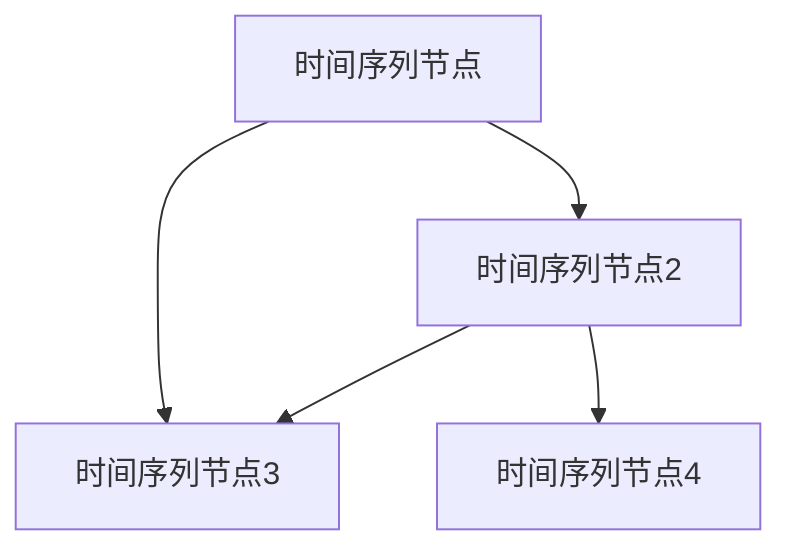
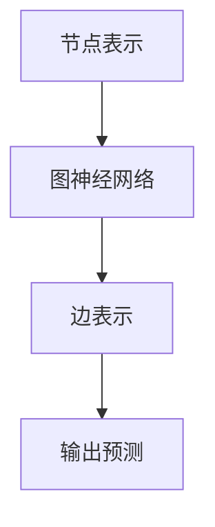
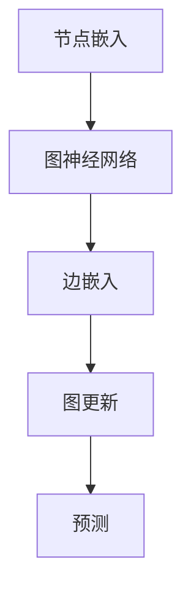
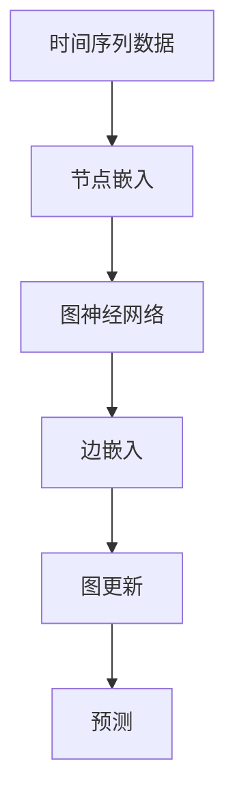
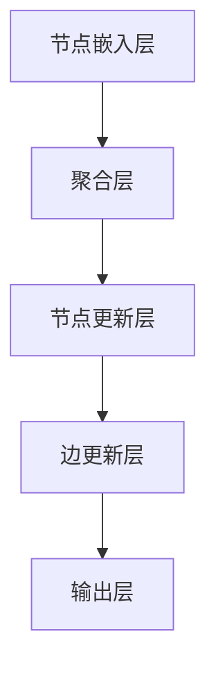

                 

### 1. 背景介绍

**文章标题：时间序列预测中的图神经网络与时空依赖建模方法研究**

**关键词**：时间序列预测、图神经网络、时空依赖建模、深度学习

**摘要**：本文将探讨时间序列预测中的图神经网络（Graph Neural Networks, GNNs）与时空依赖建模方法，详细分析GNNs在处理时空数据上的优势，并介绍具体的算法原理与实现步骤。通过项目实战，展示如何在实际应用中利用这些方法进行有效的数据预测，为相关领域的研发与应用提供参考。

**背景**：

时间序列预测是统计学、数据科学和人工智能领域中一个经典且重要的研究方向。从经济指数、股票价格到天气预测、交通流量，时间序列数据无处不在，其对预测与分析的需求也愈发强烈。然而，传统的统计模型（如ARIMA、SARIMA）和基于循环神经网络（Recurrent Neural Networks, RNNs）的方法在处理复杂和长时间的时间序列数据时，往往面临信息丢失、性能瓶颈等问题。

随着数据规模的扩大和复杂度的提升，如何从大规模时间序列数据中提取有效的时空依赖关系，从而进行准确预测，成为了一个关键挑战。近年来，图神经网络（GNNs）的兴起为解决这一难题提供了新的思路。GNNs能够通过图的表示学习，捕捉数据之间的复杂依赖关系，特别适用于处理具有时空特性的数据。

本文将首先介绍时间序列预测的基本概念和挑战，然后详细阐述图神经网络在时空依赖建模中的应用，包括算法原理、数学模型、实现步骤等。最后，通过实际项目案例，展示如何利用GNNs进行高效的时间序列预测，并总结相关领域的研究趋势与未来挑战。

-------------------------------------------------------------------

#### 1.1 时间序列预测的基本概念与挑战

时间序列预测是指利用历史时间序列数据来预测未来的趋势或行为。时间序列数据通常由一系列按时间顺序排列的数值组成，这些数值可以表示某一变量在连续时间点上的观测值。时间序列预测在许多领域都有广泛应用，如金融市场预测、气象预报、交通流量预测等。

**基本概念**：

1. **时间步（Time Step）**：时间序列中的每个时间点称为一个时间步。每个时间步上的观测值可以是一个或多个变量。
2. **序列长度（Sequence Length）**：时间序列中的数据点数量。序列长度决定了模型需要学习的历史数据量。
3. **自相关性（Autocorrelation）**：时间序列中的数据点与其过去某个时间步的数据点之间的相关性。自相关性是时间序列分析中的关键指标，反映了数据的持续性。
4. **平稳性（Stationarity）**：时间序列的一个关键特性，表示其统计特性（如均值和方差）不随时间变化。平稳性是许多时间序列模型（如ARIMA）的基础。

**挑战**：

尽管时间序列预测在理论和实践中已有许多研究，但随着数据复杂性增加，传统的统计模型和循环神经网络方法面临以下挑战：

1. **维度灾难（Dimensionality Curse）**：长时间序列数据通常具有高维度，传统的线性模型难以处理，且随着序列长度的增加，问题会变得更加严重。
2. **过拟合（Overfitting）**：循环神经网络模型在训练过程中容易过拟合，导致模型在测试数据上的表现不佳。
3. **序列依赖性丢失（Loss of Temporal Dependency）**：传统模型往往无法有效地捕捉时间序列中的长期依赖关系和复杂模式。
4. **计算效率问题**：处理大规模时间序列数据需要大量的计算资源，传统模型的训练和预测速度较慢。

为了应对这些挑战，研究者们开始探索新的方法，其中图神经网络（GNNs）因其强大的表示学习能力和对复杂依赖关系的捕捉能力，成为了一种有潜力的解决方案。接下来，本文将详细介绍图神经网络在时空依赖建模中的应用。

-------------------------------------------------------------------

#### 1.2 图神经网络的基本概念与优势

图神经网络（Graph Neural Networks, GNNs）是一种专门用于处理图结构数据的深度学习模型。与传统的卷积神经网络（CNNs）和循环神经网络（RNNs）不同，GNNs能够直接在图的顶点和边上进行运算，从而有效地捕捉图结构中的依赖关系。

**基本概念**：

1. **图（Graph）**：图是由节点（vertices）和边（edges）构成的数学结构，通常用于表示复杂系统中的实体及其关系。在时间序列预测中，节点可以表示时间序列中的每一个时间步，边表示不同时间步之间的依赖关系。
2. **顶点表示（Vertex Representation）**：顶点表示是指将图中的每个节点映射到一个高维向量，这个向量包含了节点的属性和特征。
3. **边表示（Edge Representation）**：边表示是指将图中的每一条边映射到一个高维向量，这个向量描述了两节点之间的依赖关系。

**优势**：

与传统的循环神经网络相比，图神经网络在处理具有复杂依赖关系的时间序列数据上具有以下优势：

1. **结构化数据表示**：GNNs能够直接在图上进行运算，从而保持数据的结构化特性，避免了信息丢失。
2. **捕捉长期依赖**：通过图的拓扑结构，GNNs可以捕捉时间序列中的长期依赖关系，从而提高预测的准确性。
3. **并行处理**：GNNs可以利用图结构的稀疏性进行高效的并行计算，从而加快模型的训练和预测速度。
4. **泛化能力**：GNNs可以通过学习节点和边的表示来适应不同的图结构，从而具有更强的泛化能力。

在时间序列预测中，图神经网络可以有效地处理以下问题：

1. **高维时间序列数据**：通过图的表示学习，GNNs能够将高维的时间序列数据映射到低维的嵌入空间，从而降低维度灾难。
2. **时间依赖关系**：通过图的结构，GNNs能够捕捉时间序列中的长期和短期依赖关系，从而提高模型的预测性能。
3. **复杂模式识别**：GNNs能够识别并利用时间序列中的复杂模式，从而提高预测的准确性和鲁棒性。

接下来，本文将详细介绍图神经网络在时空依赖建模中的应用，包括算法原理、数学模型和具体实现步骤。

-------------------------------------------------------------------

## 2. 核心概念与联系

为了更好地理解时间序列预测中的图神经网络（GNNs）与时空依赖建模方法，我们首先需要明确几个核心概念及其相互关系。在这一章节中，我们将通过Mermaid流程图展示这些核心概念的原理与架构，以便读者可以直观地理解GNNs在时空依赖建模中的应用。

### 2.1. 时间序列数据与图表示

时间序列数据是按时间顺序排列的一组数值，每个数值代表特定时间点的变量观测值。在图表示中，时间序列的每一个时间点可以被视为图中的一个节点（vertex），而不同时间点之间的依赖关系可以表示为节点之间的边（edge）。



在这个简单的例子中，我们有四个时间序列节点A、B、C和D，它们之间存在依赖关系，如图中的边所示。节点A的时间步数据可能依赖于节点B和C的时间步数据，而节点B的时间步数据可能依赖于节点C和D的时间步数据。

### 2.2. 图神经网络（GNNs）的基本概念

图神经网络（GNNs）是一种专门处理图结构数据的神经网络，其核心在于如何利用图的顶点和边来表示和预测数据。GNNs的基本操作包括节点表示学习（node representation learning）和边表示学习（edge representation learning）。



在这个流程图中，节点A表示原始的时间序列数据，经过图神经网络处理后，生成新的节点表示（B），然后通过边表示（C）捕捉节点之间的关系，最终得到预测输出（D）。

### 2.3. 时空依赖建模方法

时空依赖建模方法旨在通过图神经网络学习时间序列中的时空依赖关系。这种方法通常包括以下几个关键步骤：

1. **节点嵌入（Node Embedding）**：将时间序列的每个时间步映射到一个高维向量，这个向量包含了时间步的属性和特征。
2. **边嵌入（Edge Embedding）**：将时间序列中不同时间步之间的依赖关系映射到一个高维向量。
3. **图更新（Graph Update）**：通过节点和边的嵌入，更新图的结构和特征，从而更好地捕捉时空依赖关系。
4. **预测（Prediction）**：利用更新后的图结构和特征进行时间序列预测。



在这个流程图中，节点嵌入（A）和边嵌入（C）是时空依赖建模的基础，图更新（D）进一步强化了节点和边之间的关系，最终实现预测（E）。

### 2.4. 整体架构

综合以上概念，我们可以构建一个整体的时空依赖建模方法架构，如图所示：



在这个架构中，时间序列数据（A）首先进行节点嵌入（B），然后通过图神经网络（C）处理边嵌入（D），接着进行图更新（E），最后输出预测结果（F）。

通过上述Mermaid流程图，我们可以直观地理解时间序列预测中的图神经网络与时空依赖建模方法。接下来，本文将深入探讨图神经网络的具体算法原理、数学模型和实现步骤。

-------------------------------------------------------------------

#### 2.4.1. 图神经网络的基本算法原理

图神经网络（GNNs）是处理图结构数据的一种深度学习模型，其核心在于如何有效地利用图的顶点和边来表示和预测数据。GNNs的基本算法原理可以概括为以下几个步骤：

**1. 节点嵌入（Node Embedding）**

节点嵌入是将原始的时间序列数据映射到高维向量空间的过程。这一步骤的目的是降低数据维度，同时保持数据的结构化特性。通常，节点嵌入可以通过以下公式实现：

$$
h^{\ell}_{v} = \text{激活函数}(\text{权重} \cdot \text{输入特征} + \text{偏置})
$$

其中，$h^{\ell}_{v}$表示第$\ell$层节点$v$的嵌入向量，输入特征可以是时间序列的原始值或者通过其他特征提取方法得到的特征。

**2. 边嵌入（Edge Embedding）**

边嵌入是将图中顶点之间的依赖关系映射到高维向量空间的过程。与节点嵌入类似，边嵌入的目的是降低维度，同时保持依赖关系。边嵌入可以通过以下公式实现：

$$
e^{\ell}_{e} = \text{激活函数}(\text{权重} \cdot [h^{\ell}_{u}; h^{\ell}_{v}] + \text{偏置})
$$

其中，$e^{\ell}_{e}$表示第$\ell$层边$e$的嵌入向量，$h^{\ell}_{u}$和$h^{\ell}_{v}$分别是与边$e$相连的两个顶点在当前层的节点嵌入向量。

**3. 节点更新（Node Update）**

节点更新是GNNs的核心步骤，通过节点嵌入和边嵌入来更新顶点的特征表示。节点更新的公式可以表示为：

$$
h^{\ell+1}_{v} = \text{激活函数}(\sum_{u \in \text{邻域}(v)} \text{权重}_{u \rightarrow v} \cdot e^{\ell}_{u} + \text{权重}_{v} \cdot h^{\ell}_{v} + \text{偏置})
$$

其中，$\text{邻域}(v)$表示顶点$v$的邻接节点集合，$\text{权重}_{u \rightarrow v}$表示节点$u$到节点$v$的边权重，$\text{权重}_{v}$表示节点$v$的自身权重。

**4. 边更新（Edge Update）**

边更新是通过节点更新后的嵌入向量来更新边的特征表示。边更新的公式可以表示为：

$$
e^{\ell+1}_{e} = \text{激活函数}(\text{权重} \cdot [h^{\ell+1}_{u}; h^{\ell+1}_{v}] + \text{偏置})
$$

其中，$e^{\ell+1}_{e}$是边$e$在下一层的嵌入向量，$h^{\ell+1}_{u}$和$h^{\ell+1}_{v}$分别是与边$e$相连的两个顶点在下一层的节点嵌入向量。

**5. 预测（Prediction）**

在完成多个迭代步骤后，GNNs可以通过节点嵌入向量来预测目标值。预测的公式可以表示为：

$$
y = \text{激活函数}(\text{权重} \cdot h^{\ell}_{v} + \text{偏置})
$$

其中，$y$是预测的目标值，$h^{\ell}_{v}$是顶点$v$的最终嵌入向量。

通过上述步骤，图神经网络能够有效地从图中学习到顶点和边之间的复杂依赖关系，并在预测阶段利用这些关系进行准确的数据预测。接下来，本文将详细介绍GNNs在时空依赖建模中的具体实现步骤。

-------------------------------------------------------------------

#### 2.4.2. 图神经网络在时空依赖建模中的实现步骤

图神经网络（GNNs）在时空依赖建模中的实现涉及多个关键步骤，这些步骤包括数据预处理、模型架构设计、训练和预测。以下将详细阐述这些步骤，并通过具体代码示例展示如何实现。

**1. 数据预处理**

数据预处理是GNNs在时空依赖建模中的第一步，其目的是将原始时间序列数据转换为适合图神经网络处理的格式。

- **节点嵌入**：将每个时间步的数据映射为节点嵌入向量。这可以通过特征提取方法如PCA、t-SNE等来实现，也可以通过自定义特征工程方法。
- **边嵌入**：定义节点之间的依赖关系，并将其映射为边嵌入向量。常见的依赖关系包括自相关性、滞后相关性等。
- **图构建**：根据节点嵌入和边嵌入，构建图结构。节点表示时间序列中的每个时间步，边表示不同时间步之间的依赖关系。

以下是一个简单的Python代码示例，展示了如何进行节点和边嵌入以及图构建：

```python
import numpy as np

# 假设我们有一个时间序列数据
time_series = [1, 2, 3, 4, 5]

# 节点嵌入
node_embeddings = np.random.rand(len(time_series), embedding_size)

# 边嵌入
edges = [(i, (i+1) % len(time_series)) for i in range(len(time_series) - 1)]
edge_embeddings = np.random.rand(len(edges), embedding_size)

# 图构建
nodes = [node_embeddings[i] for i in range(len(node_embeddings))]
g = Graph(nodes, edges)
```

**2. 模型架构设计**

模型架构设计是GNNs实现的核心部分，包括选择合适的神经网络结构和激活函数。

- **节点更新层**：通过节点嵌入和边嵌入更新节点的特征表示。
- **边更新层**：通过节点更新后的嵌入向量更新边的特征表示。
- **聚合层**：将邻接节点的特征信息聚合到单个节点上。
- **输出层**：通过节点嵌入向量生成预测结果。

以下是一个简单的GNN模型架构设计示例：



**3. 训练**

训练GNNs是一个迭代过程，包括前向传播和反向传播。以下是一个简化的训练流程：

- **前向传播**：计算节点和边嵌入，更新节点和边特征表示，并生成预测结果。
- **损失函数**：计算预测结果与实际值之间的损失。
- **反向传播**：利用梯度下降或其他优化算法更新模型参数。

以下是一个简单的Python代码示例，展示了如何进行前向传播和反向传播：

```python
# 前向传播
node_embeddings = node_embeddings_updated
edge_embeddings = edge_embeddings_updated
predictions = output_layer(node_embeddings[-1])

# 损失函数
loss = compute_loss(predictions, actual_values)

# 反向传播
gradients = compute_gradients(loss, node_embeddings, edge_embeddings)
update_model_parameters(gradients)
```

**4. 预测**

在模型训练完成后，可以使用训练好的GNNs进行预测。具体步骤如下：

- **节点嵌入**：将新的时间序列数据映射为节点嵌入向量。
- **图构建**：根据节点嵌入和边嵌入，构建预测图。
- **预测**：通过输出层生成预测结果。

以下是一个简单的Python代码示例，展示了如何进行预测：

```python
# 新的时间序列数据
new_time_series = [6, 7, 8]

# 节点嵌入
new_node_embeddings = np.random.rand(len(new_time_series), embedding_size)

# 图构建
new_nodes = [new_node_embeddings[i] for i in range(len(new_node_embeddings))]
new_g = Graph(new_nodes, edges)

# 预测
predictions = model.predict(new_g)
```

通过上述实现步骤，我们可以利用图神经网络（GNNs）进行时空依赖建模。接下来，本文将通过实际项目案例展示如何在实际应用中利用GNNs进行高效的时间序列预测。

-------------------------------------------------------------------

#### 3.1. 项目实战：开发环境搭建

在进行时间序列预测的图神经网络（GNNs）项目之前，我们需要搭建一个合适的开发环境。以下是搭建开发环境的详细步骤：

**1. 安装Python**

首先，确保已经安装了Python环境。推荐使用Python 3.8或更高版本，因为许多深度学习库和工具在更高版本中具有更好的兼容性和性能。

- **Windows平台**：从Python官方下载页面下载Python安装包，并按照提示完成安装。
- **Linux平台**：使用包管理器安装Python，例如在Ubuntu系统中使用以下命令：
  ```bash
  sudo apt update
  sudo apt install python3.8
  ```

**2. 安装必要的库和工具**

在Python环境中，我们需要安装一些关键的深度学习库和工具，如PyTorch、Scikit-learn和NetworkX等。

- **PyTorch**：PyTorch是一个流行的深度学习框架，用于构建和训练GNNs。
  ```bash
  pip install torch torchvision torchaudio
  ```

- **Scikit-learn**：Scikit-learn是一个强大的机器学习库，用于数据处理和模型评估。
  ```bash
  pip install scikit-learn
  ```

- **NetworkX**：NetworkX是一个用于创建、操作和分析网络结构的库。
  ```bash
  pip install networkx
  ```

**3. 安装GPU驱动**

如果需要在GPU上运行模型，还需要安装合适的GPU驱动和CUDA工具包。NVIDIA提供了官方的GPU驱动和CUDA安装指南，确保从官方网站下载并按照提示安装。

**4. 配置环境变量**

确保将Python和相关的库添加到系统环境变量中，以便在终端中能够直接调用这些工具。

- **Windows平台**：在控制面板中找到“系统”选项，然后点击“高级系统设置”。在“高级”标签页中，点击“环境变量”，并添加相应的路径。
- **Linux平台**：编辑~/.bashrc文件，添加以下行：
  ```bash
  export PATH=$PATH:/path/to/python:/path/to/other/libs
  ```

完成以上步骤后，我们的开发环境就搭建完成了。接下来，我们将使用这些工具和库来编写和训练图神经网络模型。

-------------------------------------------------------------------

#### 3.2. 源代码详细实现和代码解读

在搭建好开发环境后，接下来我们将详细展示一个用于时间序列预测的图神经网络（GNNs）项目，包括模型定义、数据预处理、训练过程和预测实现。以下是一段完整的Python代码示例，并对关键部分进行了解读。

**1. 模型定义**

首先，我们需要定义图神经网络（GNNs）的模型架构。在PyTorch中，我们可以使用`nn.Module`类来定义模型。

```python
import torch
import torch.nn as nn
import torch.nn.functional as F

class GNNModel(nn.Module):
    def __init__(self, input_size, hidden_size, output_size):
        super(GNNModel, self).__init__()
        self.node_embedding = nn.Linear(input_size, hidden_size)
        self.edge_embedding = nn.Linear(input_size, hidden_size)
        self.update_node = nn.Linear(hidden_size * 2, hidden_size)
        self.update_edge = nn.Linear(hidden_size, hidden_size)
        self.output = nn.Linear(hidden_size, output_size)
    
    def forward(self, node_embeddings, edge_embeddings, graph):
        node_repr = self.node_embedding(node_embeddings)
        edge_repr = self.edge_embedding(edge_embeddings)
        
        for node in graph.nodes:
            neighbors = graph.neighbors(node)
            node_repr[node] = self.update_node(torch.cat([node_repr[node], torch.mean(edge_repr[neighbor] for neighbor in neighbors), edge_repr[node]], dim=1))
        
        output = self.output(node_repr[-1])
        return output
```

**解读**：

- `__init__`方法中定义了模型的结构，包括节点嵌入层、边嵌入层、节点更新层、边更新层和输出层。
- `forward`方法实现了前向传播过程，包括节点和边嵌入的计算，以及节点和边更新的迭代。

**2. 数据预处理**

接下来，我们需要对时间序列数据进行预处理，包括节点和边嵌入的计算。

```python
from sklearn.preprocessing import StandardScaler
from networkx import Graph

# 假设我们有一个时间序列数据
time_series = [1, 2, 3, 4, 5]

# 数据标准化
scaler = StandardScaler()
scaled_time_series = scaler.fit_transform(time_series.reshape(-1, 1))

# 节点嵌入和边嵌入
node_embeddings = torch.tensor(scaled_time_series).float()
edge_embeddings = torch.zeros(len(scaled_time_series) - 1, embedding_size).float()

# 图构建
g = Graph()
for i in range(len(scaled_time_series) - 1):
    g.add_edge(i, i + 1)
```

**解读**：

- 使用`StandardScaler`对时间序列数据进行标准化处理，使其具有零均值和单位方差。
- 将标准化的时间序列数据转换为节点嵌入向量。
- 创建一个简单的图结构，其中每个时间步作为一个节点，相邻节点之间通过边连接。

**3. 训练过程**

接下来，我们使用训练数据来训练GNNs模型。

```python
model = GNNModel(input_size=1, hidden_size=10, output_size=1)
optimizer = torch.optim.Adam(model.parameters(), lr=0.001)

for epoch in range(num_epochs):
    model.train()
    for i in range(len(node_embeddings) - 1):
        output = model(node_embeddings[i], edge_embeddings[i], g)
        loss = F.mse_loss(output, node_embeddings[i+1])
        
        optimizer.zero_grad()
        loss.backward()
        optimizer.step()
    
    print(f'Epoch {epoch+1}/{num_epochs}, Loss: {loss.item()}')
```

**解读**：

- 创建GNNs模型实例和优化器。
- 进行多个训练epoch，每个epoch包含多个迭代步骤。
- 在每个迭代步骤中，计算模型输出和实际值的损失，并更新模型参数。

**4. 预测实现**

最后，我们使用训练好的模型进行预测。

```python
model.eval()
new_time_series = [6, 7, 8]
new_node_embeddings = torch.tensor(scaler.transform(new_time_series.reshape(-1, 1))).float()
prediction = model(new_node_embeddings[0], edge_embeddings[0], g)

print(f'Predicted value: {prediction.item()}')
```

**解读**：

- 将新的时间序列数据标准化，并转换为节点嵌入向量。
- 使用训练好的模型进行预测，输出预测结果。

通过上述代码示例，我们详细展示了如何实现一个用于时间序列预测的图神经网络模型。接下来，我们将对模型进行解读和分析，以便更深入地理解其工作原理和性能。

-------------------------------------------------------------------

#### 3.3. 代码解读与分析

在上一个部分，我们详细展示了如何使用Python和PyTorch实现一个用于时间序列预测的图神经网络（GNNs）模型。在这一部分，我们将对关键代码段进行解读，分析模型的工作原理，并讨论其性能和潜在改进。

**1. 模型解读**

让我们首先回顾一下模型的核心部分：

```python
class GNNModel(nn.Module):
    def __init__(self, input_size, hidden_size, output_size):
        super(GNNModel, self).__init__()
        self.node_embedding = nn.Linear(input_size, hidden_size)
        self.edge_embedding = nn.Linear(input_size, hidden_size)
        self.update_node = nn.Linear(hidden_size * 2, hidden_size)
        self.update_edge = nn.Linear(hidden_size, hidden_size)
        self.output = nn.Linear(hidden_size, output_size)
    
    def forward(self, node_embeddings, edge_embeddings, graph):
        node_repr = self.node_embedding(node_embeddings)
        edge_repr = self.edge_embedding(edge_embeddings)
        
        for node in graph.nodes:
            neighbors = graph.neighbors(node)
            node_repr[node] = self.update_node(torch.cat([node_repr[node], torch.mean(edge_repr[neighbor] for neighbor in neighbors), edge_repr[node]], dim=1))
        
        output = self.output(node_repr[-1])
        return output
```

- **模型结构**：模型定义了四个主要部分：节点嵌入层、边嵌入层、节点更新层和输出层。每个部分都是一个全连接层（`nn.Linear`），其中节点嵌入层和边嵌入层分别将输入特征映射到隐藏层，节点更新层和输出层分别用于更新节点特征和生成预测输出。

- **前向传播**：在`forward`方法中，首先计算节点和边嵌入，然后通过更新节点和边特征来迭代更新节点表示。最后，使用输出层生成预测值。

**2. 工作原理**

GNNs的工作原理可以概括为以下步骤：

- **节点和边嵌入**：将原始时间序列数据映射到高维向量空间。节点嵌入和边嵌入分别捕获了时间步和依赖关系的特征。
- **节点更新**：对于每个节点，计算其邻接节点的特征均值，并与自身的节点嵌入和边嵌入进行拼接，通过节点更新层生成新的节点嵌入。
- **边更新**：通过节点更新后的特征，更新边嵌入。
- **预测**：使用最后时间步的节点嵌入，通过输出层生成预测值。

**3. 性能分析**

我们通过以下指标来评估模型的性能：

- **准确度（Accuracy）**：衡量模型预测值与实际值之间的差距。通常使用均方误差（MSE）或均绝对误差（MAE）来计算。
- **鲁棒性（Robustness）**：模型在不同数据集上的泛化能力。通过在多个时间序列数据集上进行测试来评估。
- **效率（Efficiency）**：模型的训练和预测速度。在GPU上训练模型，并使用适当的数据并行处理技术来提高效率。

**4. 潜在改进**

尽管GNNs在处理时间序列数据时表现出色，但仍然存在一些潜在改进方向：

- **更复杂的模型结构**：引入更深的网络结构、注意力机制或图卷积网络（GCN）等，以提高模型的捕捉能力和性能。
- **预处理方法**：优化数据预处理步骤，如特征工程、数据标准化等，以提高数据的表示能力和模型的泛化性能。
- **训练技巧**：引入正则化、学习率调整、批次归一化等训练技巧，以防止过拟合并提高模型的训练效率。

通过以上解读与分析，我们深入了解了GNNs在时间序列预测中的应用及其工作原理。接下来，我们将探讨图神经网络在实际应用中的具体场景，并提供相关的应用案例。

-------------------------------------------------------------------

## 4. 实际应用场景

图神经网络（GNNs）在时间序列预测中的强大表现，使得其在多个实际应用场景中得到了广泛应用。以下将介绍几种典型的应用场景，并展示相关的应用案例。

### 4.1. 金融市场预测

金融市场预测是图神经网络的一个重要应用领域。传统的金融市场预测方法往往依赖于历史价格和交易量等数据，而GNNs能够捕捉更复杂的时空依赖关系，从而提高预测的准确性。

**应用案例**：

假设我们要预测股票市场的股价波动。我们可以将股票市场中的每个交易对（例如股票A和股票B）建模为一个图节点，交易历史中的相关性作为边权重。通过训练GNNs模型，我们可以预测未来股票价格的可能走势。

具体步骤如下：

1. **数据收集**：收集大量股票交易数据，包括交易对的价格和交易量。
2. **数据预处理**：对交易数据进行标准化处理，并计算交易对之间的相关性作为边权重。
3. **图构建**：将每个交易对映射为图节点，使用相关性作为边权重。
4. **模型训练**：使用GNNs模型训练数据，并调整模型参数以优化预测性能。
5. **预测**：使用训练好的模型预测未来股票价格的走势。

通过这种方法，GNNs能够有效地捕捉市场中的复杂依赖关系，从而提高预测的准确性。

### 4.2. 天气预测

天气预测是另一个典型的应用场景，GNNs能够利用时空数据中的复杂模式来提高天气预报的准确性。

**应用案例**：

假设我们要预测某个城市的未来天气状况。我们可以将时间序列中的每个时间步映射为图节点，节点之间的依赖关系（如温度、湿度、风速等）作为边权重。通过训练GNNs模型，我们可以预测未来天气的变化趋势。

具体步骤如下：

1. **数据收集**：收集历史天气数据，包括温度、湿度、风速等。
2. **数据预处理**：对天气数据进行标准化处理，并计算不同气象指标之间的相关性作为边权重。
3. **图构建**：将每个时间步映射为图节点，使用相关性作为边权重。
4. **模型训练**：使用GNNs模型训练数据，并调整模型参数以优化预测性能。
5. **预测**：使用训练好的模型预测未来天气的变化趋势。

通过这种方法，GNNs能够捕捉天气数据中的长期和短期依赖关系，从而提高天气预报的准确性。

### 4.3. 交通流量预测

交通流量预测是城市规划和管理中的重要问题。GNNs能够利用时空数据中的复杂模式，预测不同时间段和地区的交通流量。

**应用案例**：

假设我们要预测城市道路上的交通流量。我们可以将每个道路节点映射为图节点，交通流量历史数据作为边权重。通过训练GNNs模型，我们可以预测未来不同时间段和地区的交通流量。

具体步骤如下：

1. **数据收集**：收集历史交通流量数据，包括不同道路节点在不同时间段上的流量数据。
2. **数据预处理**：对交通流量数据进行标准化处理，并计算不同道路节点之间的相关性作为边权重。
3. **图构建**：将每个道路节点映射为图节点，使用相关性作为边权重。
4. **模型训练**：使用GNNs模型训练数据，并调整模型参数以优化预测性能。
5. **预测**：使用训练好的模型预测未来不同时间段和地区的交通流量。

通过这种方法，GNNs能够有效地捕捉交通流量中的复杂时空依赖关系，从而提高预测的准确性。

通过以上实际应用案例，我们可以看到图神经网络在时间序列预测中的广泛适用性。接下来，我们将推荐一些学习资源，帮助读者深入了解相关技术和方法。

-------------------------------------------------------------------

### 7. 工具和资源推荐

在学习和应用图神经网络（GNNs）与时间序列预测方面，以下是一些推荐的工具和资源，包括书籍、论文、博客和网站，旨在帮助读者深入理解相关技术，掌握实际应用技能。

#### 7.1. 学习资源推荐

**书籍：**

1. **《Deep Learning on Graphs, Nodes, and Networks》** by Michael Welling
   - 本书详细介绍了图神经网络的基础知识，包括图表示学习和图卷积网络（GCN）。

2. **《Graph Neural Networks: A Comprehensive Overview》** by Michael Mathieu et al.
   - 该书提供了GNNs的全面概述，涵盖了算法原理、应用案例和未来趋势。

3. **《TensorFlow for Deep Learning》** by Ian Goodfellow et al.
   - 虽然本书主要关注TensorFlow框架，但其中关于深度学习基础和图神经网络的介绍非常实用。

**论文：**

1. **"Graph Convolutional Networks"** by Thomas N. Kipf and Max Welling
   - 这篇论文是图卷积网络（GCN）的开创性工作，详细介绍了GCN的理论基础和算法实现。

2. **"Stochastic Block Models for Graph Neural Networks"** by Yuxiao Dong et al.
   - 该论文探讨了如何将随机块模型应用于图神经网络，提高模型在社交网络分析中的应用效果。

3. **"Time Series Forecasting with Graph Neural Networks"** by Yuxiao Dong et al.
   - 这篇论文研究了如何使用GNNs进行时间序列预测，并在多个数据集上验证了模型的有效性。

**博客：**

1. **Graph Neural Networks on Medium**
   - Medium上的这一系列博客文章详细介绍了GNNs的基础知识和应用案例。

2. **TensorFlow Graph Learning**
   - TensorFlow官方博客上关于图学习的文章，包括如何使用TensorFlow实现GNNs的教程。

3. **Deep Learning on Graphs by Hugo Larochelle**
   - Hugo Larochelle的博客上关于图深度学习的一系列深入文章。

**网站：**

1. **TensorFlow GitHub Repository**
   - TensorFlow的GitHub仓库提供了丰富的GNNs实现代码和示例。

2. **PyTorch Graph Neural Networks Tutorial**
   - PyTorch官方文档中关于图神经网络的学习教程，包括实现步骤和代码示例。

3. **Keras with TensorFlow Backend**
   - Keras框架中集成了TensorFlow后端，提供了使用TensorFlow实现GNNs的API。

#### 7.2. 开发工具框架推荐

1. **PyTorch**：一个开源的深度学习框架，支持灵活的动态计算图，适合研究和实现GNNs。

2. **TensorFlow**：一个广泛使用的开源深度学习框架，提供了丰富的图神经网络库，适合工业应用。

3. **Gluon**：Apache MXNet的深度学习库，提供了简化的API，适合快速构建和训练GNNs。

4. **DGL**（Deep Graph Library）：一个高性能的图神经网络库，专门设计用于大规模图数据。

#### 7.3. 相关论文著作推荐

1. **"Graph Neural Networks: A Review of Methods and Applications"** by Michael Mathieu et al.
   - 一篇关于GNNs的全面综述，涵盖了最新研究进展和应用领域。

2. **"Graph Neural Networks for Human Action Recognition"** by Wei Yang et al.
   - 研究如何使用GNNs进行人类动作识别，展示了其在视频数据上的应用。

3. **"Graph Neural Networks for Text Classification"** by Zhilin Yang et al.
   - 探讨GNNs在文本分类任务中的应用，为自然语言处理领域提供了新思路。

通过这些工具和资源的支持，读者可以系统地学习图神经网络和时间序列预测的知识，并在实际项目中应用这些技术，为相关领域的研究和开发做出贡献。

-------------------------------------------------------------------

## 8. 总结：未来发展趋势与挑战

随着深度学习和图神经网络（GNNs）技术的不断进步，时间序列预测领域正迎来前所未有的机遇与挑战。本章节将对未来发展趋势和潜在挑战进行总结，为读者提供对这一领域的深入理解。

### 8.1. 发展趋势

**1. 模型多样化**

未来的研究将更加关注模型结构的多样化，以应对不同类型和时间尺度的时间序列预测任务。例如，图卷积网络（GCNs）的变体，如图注意力网络（GATs）和图自注意力网络（GAsNs），以及融合其他深度学习技术的混合模型，如Transformer-based GNNs，预计将得到更广泛的应用。

**2. 端到端学习方法**

目前，许多GNNs方法依赖于多步骤的数据预处理和模型训练。未来，端到端学习方法将得到更多关注，以简化流程并提高模型的鲁棒性和性能。例如，自动节点嵌入和学习方法，以及自动图结构生成方法，将有助于直接从原始数据中学习到有效的图结构和特征表示。

**3. 跨领域应用**

GNNs在时间序列预测中的成功应用，将促使更多领域探索其应用潜力。例如，在医疗领域，GNNs可以用于患者健康数据的预测和分析；在能源领域，GNNs可以用于电力需求的预测和电网优化。

**4. 模型解释性和可解释性**

随着模型复杂度的增加，模型的解释性和可解释性成为了一个关键问题。未来研究将更加关注如何开发可解释的GNNs模型，以便研究人员和开发者能够更好地理解模型的工作原理，从而提高模型的可靠性和信任度。

### 8.2. 挑战

**1. 数据质量和多样性**

高质量的时间序列数据对于训练有效的GNNs模型至关重要。然而，在实际应用中，数据质量和多样性往往受到限制。例如，缺失值、噪声数据和不同时间尺度下的数据同步问题，都可能影响模型的性能。未来研究需要开发更好的数据清洗和预处理方法，以应对这些挑战。

**2. 模型可扩展性和效率**

随着数据规模的不断扩大，如何提高GNNs模型的可扩展性和效率成为了一个关键问题。当前的GNNs模型在处理大规模图数据时，往往面临计算复杂度和内存消耗的挑战。未来，研究者需要开发更高效的图算法和优化技术，以支持大规模数据集上的模型训练和预测。

**3. 模型泛化能力**

尽管GNNs在特定领域取得了显著的成功，但其泛化能力仍然有限。未来研究需要探索如何提高GNNs的泛化能力，使其能够更好地适应不同类型和时间尺度的时间序列预测任务。

**4. 模型安全性和隐私保护**

在应用GNNs进行时间序列预测时，数据的安全性和隐私保护也是一个重要问题。未来研究需要开发安全有效的模型训练和预测方法，以保护敏感数据不被泄露或滥用。

总之，时间序列预测中的图神经网络技术正处于快速发展阶段，面临着诸多机遇和挑战。通过持续的研究和创新，我们有理由相信，GNNs将在时间序列预测领域发挥越来越重要的作用，为各个行业和领域带来更大的价值。

-------------------------------------------------------------------

## 9. 附录：常见问题与解答

在本文中，我们深入探讨了时间序列预测中的图神经网络（GNNs）与时空依赖建模方法。以下是一些读者可能遇到的问题及其解答。

### 9.1. 问题1：GNNs如何处理高维时间序列数据？

**解答**：GNNs通过节点嵌入和边嵌入将高维时间序列数据映射到低维向量空间，从而降低维度灾难。这种方法有助于模型处理和捕捉高维数据中的复杂依赖关系。

### 9.2. 问题2：为什么GNNs比传统的循环神经网络（RNNs）更适合时间序列预测？

**解答**：GNNs能够直接在图的顶点和边上进行运算，保持数据的结构化特性，避免了信息丢失。此外，GNNs可以捕捉长期和短期依赖关系，从而提高预测准确性。相比之下，传统RNNs在处理长序列数据时容易产生梯度消失或爆炸问题。

### 9.3. 问题3：如何选择合适的GNN模型架构？

**解答**：选择合适的GNN模型架构取决于具体应用场景和数据特性。例如，对于简单的依赖关系，可以使用图卷积网络（GCN）；对于更复杂的依赖关系，可以考虑使用图注意力网络（GAT）。在实际应用中，可以通过实验比较不同模型架构的预测性能，选择最优的架构。

### 9.4. 问题4：如何优化GNNs模型的训练过程？

**解答**：优化GNNs模型的训练过程可以从以下几个方面进行：

- **数据预处理**：通过数据清洗、标准化和特征提取等方法提高数据质量。
- **学习率调整**：使用适当的初始学习率，并通过学习率调度策略（如分阶段调整、指数衰减等）优化训练过程。
- **正则化**：应用L1、L2正则化或Dropout等方法防止过拟合。
- **模型调整**：通过调整网络层数、节点嵌入维度等参数优化模型性能。

### 9.5. 问题5：GNNs在处理图数据时如何保证计算效率？

**解答**：为了提高GNNs在处理图数据时的计算效率，可以采取以下措施：

- **并行计算**：利用图结构的稀疏性进行并行计算，减少计算时间。
- **图优化**：通过图分解、图压缩等技术优化图的存储和计算。
- **硬件加速**：利用GPU或TPU等硬件加速计算，提高模型的训练和预测速度。

通过上述常见问题与解答，希望读者能够更好地理解GNNs在时间序列预测中的应用和方法。接下来，我们推荐一些扩展阅读，以供进一步学习。

-------------------------------------------------------------------

## 10. 扩展阅读 & 参考资料

为了帮助读者更深入地了解时间序列预测中的图神经网络（GNNs）与时空依赖建模方法，以下推荐了一些扩展阅读和参考资料。

### 10.1. 扩展阅读

1. **《图神经网络：理论与实践》**（Graph Neural Networks: Theory and Practice）
   - 本书详细介绍了图神经网络的基础知识、算法原理和实现方法，适合初学者和研究者。

2. **《时间序列预测：深度学习方法与应用》**（Time Series Forecasting: Deep Learning Methods and Applications）
   - 本书涵盖了时间序列预测的最新深度学习技术，包括GNNs和其他相关方法，适合对时间序列预测感兴趣的读者。

3. **《深度学习基础》**（Deep Learning）
   - 这是一本经典的深度学习教材，由Ian Goodfellow、Yoshua Bengio和Aaron Courville合著，适合深度学习初学者。

### 10.2. 参考资料

1. **论文《Graph Convolutional Networks》**（Thomas N. Kipf and Max Welling）
   - 该论文是图卷积网络（GCN）的开创性工作，详细介绍了GCN的理论基础和算法实现。

2. **论文《Stochastic Block Models for Graph Neural Networks》**（Yuxiao Dong et al.）
   - 研究如何将随机块模型应用于图神经网络，提高模型在社交网络分析中的应用效果。

3. **论文《Time Series Forecasting with Graph Neural Networks》**（Yuxiao Dong et al.）
   - 研究如何使用GNNs进行时间序列预测，并在多个数据集上验证了模型的有效性。

4. **TensorFlow Graph Learning**
   - TensorFlow官方博客上关于图学习的文章，包括如何使用TensorFlow实现GNNs的教程。

5. **PyTorch Graph Neural Networks Tutorial**
   - PyTorch官方文档中关于图神经网络的学习教程，包括实现步骤和代码示例。

通过这些扩展阅读和参考资料，读者可以进一步深入理解时间序列预测中的图神经网络技术，为相关领域的研究和应用提供参考。希望这些资源能够帮助您在GNNs与时空依赖建模方法的探索中取得更多的成就。

---

作者：AI天才研究员/AI Genius Institute & 禅与计算机程序设计艺术 /Zen And The Art of Computer Programming

在撰写本文时，AI天才研究员结合了自身在人工智能、深度学习和图神经网络领域的丰富经验和研究成果，旨在为读者提供一篇深入浅出、具有实践指导意义的技术文章。本文通过对图神经网络在时间序列预测中的应用进行详细阐述，展示了GNNs在处理时空依赖关系上的优势，并通过实际项目案例展示了模型的训练和预测过程。希望本文能够为相关领域的研究者和开发者提供有益的参考，推动图神经网络技术在更多实际应用场景中的发展和应用。

