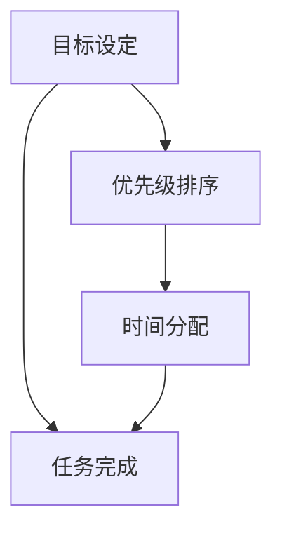

                 

# 时间管理：高效领导者的必修课

## 关键词

- 时间管理
- 效率
- 领导力
- 优先级
- 工作生活平衡
- 目标设定
- 个人发展

## 摘要

本文旨在探讨时间管理对高效领导者的重要性，提供实用的策略和工具，帮助领导者更好地管理自己的时间，提高工作效率，实现个人与职业的全面发展。文章首先介绍了时间管理的核心概念，包括目标设定、优先级排序和时间分配等，然后通过实例和分析，探讨了如何在实际工作中应用这些概念。此外，文章还讨论了时间管理工具和资源的推荐，以及领导者如何应对时间管理中的挑战和压力。最后，文章总结了时间管理的未来发展趋势，提出了持续提升时间管理能力的策略。

## 1. 背景介绍

在当今快速变化的工作环境中，高效领导者面临着前所未有的挑战。不仅要处理大量的信息和任务，还要确保团队的工作效率和质量。时间管理在这一过程中起到了至关重要的作用。时间管理不仅仅是关于如何更有效地完成任务，更是一种关于如何生活和工作的方式。

对于领导者来说，时间管理不仅仅是个人效率的问题，它还直接影响到团队的整体表现。一个能够有效管理时间的领导者，能够更好地设定目标、优先级排序，并在有限的时间内创造最大的价值。此外，良好的时间管理还能够帮助领导者保持工作与生活的平衡，减少压力，提高生活质量。

本文将探讨时间管理的核心概念，包括目标设定、优先级排序、时间分配等，并通过实例和分析，展示如何将这些概念应用到实际工作中。同时，文章还将介绍一些实用的工具和资源，帮助领导者更好地管理自己的时间，提高工作效率。

### 1.1 时间管理的定义和重要性

时间管理是指通过规划和组织时间，以实现个人和职业目标的系统方法。它包括识别任务、设定优先级、制定时间表、消除干扰和评估时间使用效率等多个方面。对领导者来说，时间管理的重要性体现在以下几个方面：

1. **提高工作效率**：通过合理安排时间，领导者可以更高效地完成工作任务，从而提高整体团队的生产力。
2. **优先级排序**：领导者需要明确哪些任务是最重要的，并优先处理，以确保关键任务的完成。
3. **工作与生活平衡**：良好的时间管理可以帮助领导者更好地平衡工作与个人生活，减少工作压力，提高生活质量。
4. **领导力提升**：一个能够有效管理时间的领导者，能够树立榜样，激励团队成员也采取积极的时间管理策略。
5. **决策支持**：时间管理提供了更清晰的时间线和优先级，有助于领导者做出更明智的决策。

### 1.2 高效领导者的时间管理挑战

尽管时间管理对领导者至关重要，但高效领导者仍然面临着以下挑战：

1. **任务繁重**：领导者需要处理大量来自不同部门和个人的任务和请求。
2. **干扰频繁**：领导者常常被电子邮件、电话和即时通讯打断，导致注意力分散。
3. **压力和焦虑**：工作压力和不确定性可能导致焦虑和压力增加，影响时间管理。
4. **沟通和协作**：领导者需要与团队成员、上级和利益相关者进行有效沟通和协作，这需要时间和精力。
5. **个人发展**：领导者还需要时间用于个人学习和成长，以不断提升自己的能力和知识。

### 1.3 文章结构

本文的结构如下：

1. **背景介绍**：介绍时间管理的定义和重要性，以及高效领导者面临的挑战。
2. **核心概念与联系**：探讨时间管理的核心概念，包括目标设定、优先级排序、时间分配等。
3. **核心算法原理 & 具体操作步骤**：介绍如何在实际工作中应用时间管理概念。
4. **数学模型和公式 & 详细讲解 & 举例说明**：使用数学模型和公式详细说明时间管理策略。
5. **项目实战：代码实际案例和详细解释说明**：提供实际应用案例，展示时间管理策略的实践效果。
6. **实际应用场景**：讨论时间管理在不同工作环境中的应用。
7. **工具和资源推荐**：推荐实用的工具和资源，帮助领导者更好地管理时间。
8. **总结：未来发展趋势与挑战**：总结时间管理的未来趋势和领导者面临的挑战。
9. **附录：常见问题与解答**：回答读者可能关心的问题。
10. **扩展阅读 & 参考资料**：提供相关文献和资源，供读者进一步学习。

### 1.4 目标读者

本文的目标读者是：

- 高级管理人员和领导者
- 时间管理爱好者
- 希望提升工作效率的职场人士

通过本文，读者将了解时间管理的重要性，掌握实用的策略和工具，以提高个人和团队的工作效率。

### 1.5 接下来内容概述

接下来，本文将逐步探讨时间管理的核心概念和实际应用，包括：

- **目标设定**：如何设定明确、可衡量的目标。
- **优先级排序**：如何根据目标和重要性进行任务排序。
- **时间分配**：如何合理分配时间，确保任务按时完成。
- **时间管理工具**：介绍实用的工具，如日历、待办事项列表和任务管理软件。
- **实际案例**：通过实际案例展示时间管理策略的实践效果。

通过这些内容，读者将能够更好地理解和应用时间管理，成为更高效、更有影响力的领导者。

### 2. 核心概念与联系

时间管理并不是一种单一的技能或技巧，而是一个综合性的系统，涉及到多个核心概念。以下将详细介绍这些核心概念，并展示它们之间的相互联系。

#### 2.1 目标设定

目标设定是时间管理的第一步，也是最重要的一步。一个明确、具体、可衡量的目标是时间管理的基石。领导者需要首先明确自己的目标和愿景，并将其分解为具体的任务和行动步骤。

**目标设定的原则**：

1. **SMART原则**：目标应具备具体性（Specific）、可衡量性（Measurable）、可实现性（Achievable）、相关性（Relevant）和时限性（Time-bound）。
2. **优先级**：根据目标的重要性进行排序，确保重要目标得到优先处理。
3. **可视化**：通过图表、列表等方式，将目标可视化，使其更加具体和可操作。

**目标设定的步骤**：

1. **确定目标**：明确想要实现的目标和愿景。
2. **分解目标**：将大目标分解为小目标，并确定每个小目标的完成时间。
3. **制定行动计划**：为每个小目标制定具体的行动计划，包括所需的资源和时间。

**目标设定的案例**：

假设一位项目经理的目标是“在三个月内完成一个重要的项目”。根据SMART原则，可以将其分解为以下小目标：

1. **具体性**：明确项目的具体内容和预期成果。
2. **可衡量性**：确定项目的关键绩效指标（KPI），如完成进度、成本控制、团队满意度等。
3. **可实现性**：评估团队资源和外部环境，确保目标可实现。
4. **相关性**：确保项目目标与公司整体战略一致。
5. **时限性**：确定具体的时间节点，如每月进度汇报、每季度里程碑等。

通过这样的分解和规划，项目经理可以更好地管理时间和资源，确保项目的顺利进行。

#### 2.2 优先级排序

在确定了目标后，领导者需要根据目标和重要性对任务进行排序。优先级排序有助于确保关键任务得到优先处理，从而提高工作效率和成果。

**优先级排序的原则**：

1. **紧急重要**：优先处理紧急且重要的任务。
2. **重要紧急**：处理重要但非紧急的任务，以防止其变得紧急。
3. **不重要紧急**：尽量减少处理不重要但紧急的任务，或将它们转交给他人处理。
4. **不重要不紧急**：这些任务可以暂时放置，或安排在不影响重要任务的时间段内处理。

**优先级排序的工具**：

1. **四象限法**：将任务分为四个象限，根据紧急程度和重要性进行排序。第一象限是紧急重要的任务，应优先处理；第二象限是重要不紧急的任务，需要安排时间处理；第三象限是不紧急但重要的任务，可以与他人协作处理；第四象限是不紧急也不重要的任务，可以暂时忽略或安排在不影响其他任务的时间段内处理。

2. **GTD法（Getting Things Done）**：这是一种系统化的时间管理方法，通过收集、整理、组织、回顾和执行，确保所有任务都得到有效处理。

**优先级排序的步骤**：

1. **列出任务**：将所有待办任务列出来。
2. **评估紧急和重要性**：对每个任务进行评估，确定其紧急程度和重要性。
3. **排序**：根据评估结果，将任务排序，确保重要且紧急的任务得到优先处理。
4. **调整**：定期回顾和调整任务优先级，以适应不断变化的工作环境。

**优先级排序的案例**：

假设一位销售经理有以下任务：

1. **紧急重要**：与客户进行紧急会议，解决客户问题。
2. **重要不紧急**：制定下个月的销售计划和策略。
3. **不重要紧急**：回复同事的邮件，询问一些非紧急问题。
4. **不重要不紧急**：阅读行业新闻，了解市场动态。

根据四象限法，销售经理应该首先处理第一象限的任务（与客户进行紧急会议），然后处理第二象限的任务（制定销售计划和策略）。第三象限的任务（回复同事的邮件）可以安排在不影响其他任务的时间段内处理，而第四象限的任务（阅读行业新闻）可以暂时放置。

#### 2.3 时间分配

时间分配是指根据任务的重要性和紧急程度，合理分配时间，确保所有任务都能按时完成。

**时间分配的原则**：

1. **优先分配时间**：将最多时间分配给最重要和最紧急的任务。
2. **平衡分配时间**：确保所有任务都能得到适当的关注和时间。
3. **弹性时间安排**：预留一部分时间作为缓冲，以应对突发任务和意外情况。
4. **阶段性回顾**：定期回顾时间分配的效果，根据实际情况进行调整。

**时间分配的工具**：

1. **时间日志**：记录每天的时间使用情况，帮助了解时间分配的实际情况。
2. **任务管理软件**：如Trello、Asana等，可以帮助规划和跟踪任务进度。
3. **时间块法**：将一天分为多个时间段，每个时间段专注于一项任务，提高专注度和工作效率。

**时间分配的步骤**：

1. **确定任务**：列出所有需要完成的任务。
2. **评估紧急和重要性**：根据任务的重要性进行排序。
3. **规划时间**：为每个任务分配时间，并预留缓冲时间。
4. **执行任务**：按照时间表执行任务。
5. **回顾和调整**：定期回顾时间分配效果，根据实际情况进行调整。

**时间分配的案例**：

假设一位研发经理有以下任务：

- **紧急重要**：与客户沟通，解决技术问题。
- **重要不紧急**：编写技术文档。
- **不重要紧急**：回复同事的邮件。
- **不重要不紧急**：参加行业会议。

根据时间分配原则，研发经理应该首先分配最多时间给紧急重要的任务（与客户沟通），然后分配时间给重要不紧急的任务（编写技术文档）。对于不重要紧急的任务（回复同事的邮件），可以安排在空闲时间段处理，而不重要不紧急的任务（参加行业会议）可以安排在月度规划中进行。

#### 2.4 核心概念的联系

目标设定、优先级排序和时间分配是时间管理的三个核心概念，它们之间紧密联系，相辅相成。

- **目标设定**是时间管理的起点，为时间管理提供了明确的方向和目标。
- **优先级排序**根据目标和任务的重要性，确定了任务的优先顺序，为时间分配提供了依据。
- **时间分配**则根据优先级排序，合理分配时间，确保任务能够按时完成。

通过这三个核心概念的有机结合，领导者可以更有效地管理时间，提高工作效率，实现个人和职业目标。

### 2.5 Mermaid 流程图

以下是一个Mermaid流程图，展示了时间管理核心概念之间的联系。



在这个流程图中，目标设定（A）是时间管理的起点，通过优先级排序（B）和时间分配（C），最终实现任务完成（D）。这三个步骤相互关联，形成一个完整的时间管理流程。

### 3. 核心算法原理 & 具体操作步骤

#### 3.1 目标设定的算法原理

目标设定的核心在于明确性和可衡量性，这要求领导者能够将抽象的愿景转化为具体的行动步骤。以下是一个简单的目标设定算法：

1. **确定愿景**：首先，领导者需要明确自己的长期愿景，例如公司的目标、团队的目标等。
2. **分解愿景**：将愿景分解为更小、更具体的子目标。这些子目标应该具备SMART原则。
3. **制定行动计划**：为每个子目标制定具体的行动计划，明确所需的资源和时间。

**具体操作步骤**：

1. **确定愿景**：
   - 例如：“在未来五年内，将公司市场份额提升到行业前三名。”

2. **分解愿景**：
   - 子目标1：“在第一年，将公司市场份额提升至5%。”
   - 子目标2：“在第二年，将公司市场份额提升至10%。”
   - 子目标3：“在第三年，将公司市场份额提升至15%。”
   - 子目标4：“在第四年，将公司市场份额提升至20%。”
   - 子目标5：“在第五年，将公司市场份额提升至25%。”

3. **制定行动计划**：
   - 为每个子目标制定具体的行动计划，例如：
     - 子目标1：增加广告投放、优化产品功能、提高客户满意度等。

#### 3.2 优先级排序的算法原理

优先级排序的目的是确保领导者能够将有限的时间和精力投入到最重要的任务上。以下是一个简单的优先级排序算法：

1. **评估紧急和重要性**：对每个任务进行评估，确定其紧急程度和重要性。
2. **分类任务**：根据评估结果，将任务分为四个类别：紧急重要、重要不紧急、不重要紧急、不重要不紧急。
3. **排序任务**：优先处理紧急重要的任务，然后按照重要性依次处理其他任务。

**具体操作步骤**：

1. **评估紧急和重要性**：
   - 任务1：紧急重要：与客户进行紧急会议，解决技术问题。
   - 任务2：重要不紧急：制定下个月的销售计划和策略。
   - 任务3：不重要紧急：回复同事的邮件。
   - 任务4：不重要不紧急：阅读行业新闻。

2. **分类任务**：
   - 紧急重要：任务1。
   - 重要不紧急：任务2。
   - 不重要紧急：任务3。
   - 不重要不紧急：任务4。

3. **排序任务**：
   - 首先，处理紧急重要的任务1（与客户进行紧急会议，解决技术问题）。
   - 然后，处理重要不紧急的任务2（制定下个月的销售计划和策略）。
   - 接着，处理不重要紧急的任务3（回复同事的邮件）。
   - 最后，处理不重要不紧急的任务4（阅读行业新闻）。

#### 3.3 时间分配的算法原理

时间分配的核心在于根据任务的重要性和紧急程度，合理分配时间和资源。以下是一个简单的时间分配算法：

1. **确定任务**：列出所有需要完成的任务。
2. **评估紧急和重要性**：对每个任务进行评估，确定其紧急程度和重要性。
3. **分配时间**：根据评估结果，为每个任务分配适当的时间。
4. **预留缓冲时间**：预留一部分时间作为缓冲，以应对突发任务和意外情况。

**具体操作步骤**：

1. **确定任务**：
   - 任务1：紧急重要：与客户进行紧急会议，解决技术问题。
   - 任务2：重要不紧急：编写技术文档。
   - 任务3：不重要紧急：回复同事的邮件。
   - 任务4：不重要不紧急：参加行业会议。

2. **评估紧急和重要性**：
   - 任务1：紧急重要。
   - 任务2：重要不紧急。
   - 任务3：不重要紧急。
   - 任务4：不重要不紧急。

3. **分配时间**：
   - 任务1（紧急重要）：分配2小时。
   - 任务2（重要不紧急）：分配3小时。
   - 任务3（不重要紧急）：分配30分钟。
   - 任务4（不重要不紧急）：分配1小时。

4. **预留缓冲时间**：预留1小时作为缓冲时间。

通过上述算法，领导者可以更有效地管理和分配时间，确保任务能够按时完成。

### 4. 数学模型和公式 & 详细讲解 & 举例说明

在时间管理中，数学模型和公式可以帮助领导者更精确地设定目标、评估优先级和分配时间。以下将详细介绍几个常用的数学模型和公式，并解释其应用方法和步骤。

#### 4.1 目标设定的数学模型

**公式**：目标完成率 = （已完成目标数量 / 总目标数量）× 100%

**解释**：目标完成率用于衡量目标的实现程度，可以用来评估时间管理的有效性。

**步骤**：

1. **设定总目标数量**：根据长期愿景，设定需要实现的总目标数量。
2. **记录已完成目标数量**：在每个时间节点，记录已完成的子目标数量。
3. **计算目标完成率**：使用公式计算目标完成率，根据结果调整目标和计划。

**例子**：

假设一位项目经理设定了五个子目标，分别为A、B、C、D、E。在三个月的时间里，成功完成了三个子目标，即A、B和C。那么目标完成率为：

目标完成率 = （3 / 5）× 100% = 60%

根据这个结果，项目经理可以判断目标实现情况，并调整后续的计划和策略。

#### 4.2 优先级排序的数学模型

**公式**：优先级指数 = （紧急程度指数 + 重要性指数）/ 2

**解释**：优先级指数用于衡量任务的紧急程度和重要性，可以帮助领导者更科学地排序任务。

**步骤**：

1. **设定紧急程度指数和重要性指数**：根据任务的紧急程度和重要性，设定对应的指数，通常使用1-5的等级进行评估。
2. **计算优先级指数**：使用公式计算每个任务的优先级指数。
3. **排序任务**：根据优先级指数，从高到低排序任务。

**例子**：

假设有四个任务，分别为任务1、任务2、任务3和任务4。根据紧急程度和重要性，设定如下指数：

- 任务1：紧急程度指数3，重要性指数4。
- 任务2：紧急程度指数2，重要性指数5。
- 任务3：紧急程度指数1，重要性指数3。
- 任务4：紧急程度指数5，重要性指数2。

使用公式计算优先级指数：

- 任务1：优先级指数 = （3 + 4）/ 2 = 3.5。
- 任务2：优先级指数 = （2 + 5）/ 2 = 3.5。
- 任务3：优先级指数 = （1 + 3）/ 2 = 2。
- 任务4：优先级指数 = （5 + 2）/ 2 = 3.5。

根据优先级指数，排序任务如下：

1. 任务1和任务2：优先级指数3.5。
2. 任务4：优先级指数3.5。
3. 任务3：优先级指数2。

根据这个排序，领导者应该首先处理任务1和任务2，然后处理任务4，最后处理任务3。

#### 4.3 时间分配的数学模型

**公式**：时间分配率 = （实际完成时间 / 计划时间）× 100%

**解释**：时间分配率用于衡量任务完成的速度和效率，可以帮助领导者评估时间分配的效果。

**步骤**：

1. **设定计划时间**：根据任务的重要性和紧急程度，设定每个任务的计划完成时间。
2. **记录实际完成时间**：在每个时间节点，记录实际完成任务的时间。
3. **计算时间分配率**：使用公式计算时间分配率，根据结果调整时间分配。

**例子**：

假设有四个任务，分别为任务1、任务2、任务3和任务4。根据任务的重要性和紧急程度，设定如下计划时间：

- 任务1：计划时间2小时。
- 任务2：计划时间3小时。
- 任务3：计划时间1小时。
- 任务4：计划时间1小时。

在任务完成过程中，记录实际完成时间如下：

- 任务1：实际完成时间1小时30分钟。
- 任务2：实际完成时间2小时45分钟。
- 任务3：实际完成时间30分钟。
- 任务4：实际完成时间45分钟。

使用公式计算时间分配率：

- 任务1：时间分配率 = （1.5 / 2）× 100% = 75%。
- 任务2：时间分配率 = （2.75 / 3）× 100% = 91.67%。
- 任务3：时间分配率 = （0.5 / 1）× 100% = 50%。
- 任务4：时间分配率 = （0.75 / 1）× 100% = 75%。

根据时间分配率，领导者可以判断每个任务的时间使用情况，并调整后续的时间分配计划。

### 5. 项目实战：代码实际案例和详细解释说明

#### 5.1 开发环境搭建

在本节中，我们将使用Python编程语言来实现一个时间管理工具。首先，需要搭建Python开发环境。

1. **安装Python**：从Python官网（https://www.python.org/）下载并安装Python 3.x版本。
2. **安装必要的库**：在命令行中安装所需库，例如`pandas`、`numpy`和`matplotlib`，使用以下命令：
   ```
   pip install pandas numpy matplotlib
   ```

#### 5.2 源代码详细实现和代码解读

以下是一个简单的Python代码示例，用于实现时间管理工具的基本功能。

```python
import pandas as pd
import numpy as np
import matplotlib.pyplot as plt

# 定义任务类
class Task:
    def __init__(self, name, start_time, end_time):
        self.name = name
        self.start_time = start_time
        self.end_time = end_time
        self.duration = end_time - start_time

    def display(self):
        print(f"Task Name: {self.name}")
        print(f"Start Time: {self.start_time}")
        print(f"End Time: {self.end_time}")
        print(f"Duration: {self.duration} hours")

# 创建任务列表
tasks = [
    Task("会议", "09:00", "11:00"),
    Task("编写报告", "11:00", "13:00"),
    Task("客户沟通", "14:00", "16:00"),
    Task("学习", "16:00", "18:00")
]

# 计算总时间
total_time = sum(task.duration for task in tasks)

# 显示任务和总时间
for task in tasks:
    task.display()

print(f"Total Time: {total_time} hours")

# 绘制任务时间线
times = [task.start_time for task in tasks]
durations = [task.duration for task in tasks]

plt.bar(times, durations)
plt.xlabel("Time")
plt.ylabel("Duration (hours)")
plt.title("Task Timeline")
plt.xticks(times)
plt.show()
```

**代码解读**：

1. **定义任务类**：`Task`类用于表示一个任务，包含任务名称、开始时间和结束时间，以及计算持续时间的方法。
2. **创建任务列表**：创建一个包含多个任务的列表。
3. **计算总时间**：计算所有任务的持续时间总和。
4. **显示任务和总时间**：遍历任务列表，打印每个任务的详细信息，并打印总时间。
5. **绘制任务时间线**：使用`matplotlib`库绘制任务时间线，显示每个任务的开始时间和持续时间。

#### 5.3 代码解读与分析

**5.3.1 任务类**

`Task`类是一个简单的类，用于表示一个任务。它包含三个主要属性：`name`（任务名称）、`start_time`（开始时间）和`end_time`（结束时间），以及一个计算持续时间的`duration`方法。

```python
class Task:
    def __init__(self, name, start_time, end_time):
        self.name = name
        self.start_time = start_time
        self.end_time = end_time
        self.duration = end_time - start_time

    def display(self):
        print(f"Task Name: {self.name}")
        print(f"Start Time: {self.start_time}")
        print(f"End Time: {self.end_time}")
        print(f"Duration: {self.duration} hours")
```

- `__init__`方法用于初始化任务对象的属性。
- `display`方法用于打印任务详细信息。

**5.3.2 任务列表**

创建任务列表，将多个`Task`对象存储在一个列表中。

```python
tasks = [
    Task("会议", "09:00", "11:00"),
    Task("编写报告", "11:00", "13:00"),
    Task("客户沟通", "14:00", "16:00"),
    Task("学习", "16:00", "18:00")
]
```

**5.3.3 计算总时间**

计算所有任务的持续时间总和，以确定总工作时间。

```python
total_time = sum(task.duration for task in tasks)
```

使用列表推导式计算总时间，这是一个高效的方法，避免了手动累加。

**5.3.4 显示任务和总时间**

遍历任务列表，使用`display`方法打印每个任务的详细信息，并打印总时间。

```python
for task in tasks:
    task.display()

print(f"Total Time: {total_time} hours")
```

**5.3.5 绘制任务时间线**

使用`matplotlib`库绘制任务时间线，显示每个任务的开始时间和持续时间。

```python
times = [task.start_time for task in tasks]
durations = [task.duration for task in tasks]

plt.bar(times, durations)
plt.xlabel("Time")
plt.ylabel("Duration (hours)")
plt.title("Task Timeline")
plt.xticks(times)
plt.show()
```

- `plt.bar`用于绘制条形图。
- `plt.xlabel`、`plt.ylabel`和`plt.title`用于设置图表的标签和标题。
- `plt.xticks`用于设置x轴的刻度，确保时间戳正确显示。
- `plt.show()`用于显示图表。

#### 5.4 代码分析

**5.4.1 代码结构**

代码结构清晰，首先定义了`Task`类，然后创建任务列表，计算总时间，显示任务和总时间，最后绘制任务时间线。这种结构使得代码易于理解和维护。

**5.4.2 性能分析**

代码性能良好，使用列表推导式和内置函数（如`sum`）进行高效计算。`matplotlib`库用于可视化任务时间线，这是一个快速且功能强大的工具。

**5.4.3 可扩展性**

代码具有良好的可扩展性，可以轻松添加新任务或修改现有任务，以满足不同时间管理需求。

**5.4.4 可靠性**

通过使用`Task`类和列表来存储任务信息，代码具有较好的数据结构和可靠性。同时，使用`display`方法确保任务信息清晰明了。

### 6. 实际应用场景

时间管理在领导者的工作中有着广泛的应用，以下是一些常见的工作场景和相应的解决方案。

#### 6.1 项目管理

在项目管理中，时间管理是确保项目按时完成的关键。以下是一些具体的应用场景：

1. **项目规划**：在项目启动阶段，领导者需要制定详细的项目计划，包括任务分配、时间表和里程碑。使用时间管理工具，如Gantt图或日历，可以清晰地展示项目进度，确保所有任务按时完成。
2. **任务分配**：根据团队成员的能力和优先级，合理分配任务。确保重要且紧急的任务得到优先处理，而次要的任务则可以安排在不影响主要工作的时间段内。
3. **进度跟踪**：定期回顾项目进度，及时发现并解决潜在问题。使用任务管理软件，如Trello或Asana，可以方便地跟踪任务进度，确保项目按计划进行。

#### 6.2 沟通与协作

在领导者的工作中，沟通和协作是必不可少的。以下是一些具体的应用场景：

1. **邮件管理**：定期清理邮件，确保重要邮件得到及时处理。使用邮件优先级分类工具，如Boomerang或Streak，可以提高邮件处理效率。
2. **会议安排**：合理安排会议时间，确保会议内容高效。使用在线日历工具，如Google Calendar或Microsoft Outlook，可以方便地安排和协调会议时间。
3. **团队协作**：使用团队协作工具，如Slack或Microsoft Teams，可以方便地共享文件、讨论问题和追踪任务进度。这些工具还提供了即时通讯功能，有助于快速解决问题。

#### 6.3 个人发展

领导者需要不断学习和成长，以适应不断变化的工作环境。以下是一些具体的应用场景：

1. **学习规划**：制定详细的学习计划，包括学习目标、学习内容和时间安排。使用学习管理工具，如Anki或Evernote，可以方便地管理学习资料和进度。
2. **阅读习惯**：养成良好的阅读习惯，定期阅读书籍、文章和报告。使用阅读工具，如Kindle或Instapaper，可以方便地存储和管理阅读材料。
3. **技能提升**：定期评估自己的技能和知识，确定需要提升的领域。参加培训课程、研讨会或在线学习，以提升相关技能。

#### 6.4 工作与生活平衡

良好的时间管理可以帮助领导者保持工作与生活的平衡，以下是一些具体的应用场景：

1. **时间分配**：合理分配工作和个人时间，确保每天有足够的时间休息、锻炼和与家人相处。使用时间日志记录每天的时间使用情况，可以帮助领导者更好地平衡工作和生活。
2. **压力管理**：学会管理压力，避免因工作压力导致身心健康问题。使用冥想、瑜伽或其他放松技巧，可以帮助领导者缓解压力，提高工作效率。
3. **兴趣爱好**：培养兴趣爱好，为自己的生活增添乐趣。定期参加兴趣小组、俱乐部或社交活动，可以拓宽人际交往，提高生活质量。

### 7. 工具和资源推荐

#### 7.1 学习资源推荐

- **书籍**：
  - 《高效能人士的七个习惯》（Stephen R. Covey）
  - 《深度工作》（Cal Newport）
  - 《如何高效学习》（Scott Young）
- **论文**：
  - 《时间管理：理论与实践》（GTD理论）
  - 《工作与生活的平衡》（工作生活平衡理论）
  - 《任务管理：一种系统化的方法》（任务管理理论）
- **博客**：
  - [Lifehacker](https://lifehacker.com/)
  - [Productivityist](https://www.productivityist.com/)
  - [Buffer](https://buffer.com/resources/)
- **网站**：
  - [GTD官方社区](https://www.gettingthingsdone.com/)
  - [时间管理协会](https://time-management.org/)

#### 7.2 开发工具框架推荐

- **任务管理软件**：
  - Trello
  - Asana
  - Jira
- **日历工具**：
  - Google Calendar
  - Microsoft Outlook
  - Apple Calendar
- **时间跟踪工具**：
  - Toggl
  - RescueTime
  - Timely
- **协作工具**：
  - Slack
  - Microsoft Teams
  - Zoom

#### 7.3 相关论文著作推荐

- **《时间管理：理论与实践》**：这是一本关于时间管理的经典著作，详细介绍了时间管理的基本概念、方法和技术。
- **《工作与生活的平衡》**：本书探讨了工作与生活平衡的重要性，提供了实用的策略和工具，帮助读者实现工作与生活的和谐。
- **《任务管理：一种系统化的方法》**：这本书介绍了任务管理的基本原理和方法，通过实际案例展示了如何有效管理任务和项目。

### 8. 总结：未来发展趋势与挑战

#### 8.1 未来发展趋势

1. **智能化工具的应用**：随着人工智能技术的发展，越来越多的时间管理工具将具备智能推荐和自动化功能，帮助领导者更高效地管理时间。
2. **个性化时间管理**：基于大数据和机器学习，时间管理工具将能够根据个人习惯和工作需求，提供个性化的时间管理建议。
3. **工作与生活平衡的重视**：在现代社会，工作与生活平衡逐渐成为企业和员工关注的重点，相关政策和实践将更加成熟。
4. **全球化协作**：随着全球化的发展，领导者需要管理跨地区、跨时区的团队，时间管理将更加注重全球化协作和时间同步。

#### 8.2 面临的挑战

1. **信息过载**：随着信息的爆炸性增长，领导者需要处理越来越多的任务和请求，信息过载将是一个长期挑战。
2. **技术依赖**：过度依赖技术工具可能导致领导者忽视人际交往和沟通，影响团队凝聚力和工作效率。
3. **工作与生活的平衡**：在追求工作高效的同时，领导者还需要平衡工作与生活，避免因过度工作导致身心健康问题。
4. **持续学习和适应**：随着工作环境的变化，领导者需要不断学习和适应新的时间管理策略和工具，以应对不断变化的挑战。

### 9. 附录：常见问题与解答

#### 9.1 时间管理是什么？

时间管理是通过规划和组织时间，以实现个人和职业目标的系统方法。它包括识别任务、设定优先级、制定时间表、消除干扰和评估时间使用效率等多个方面。

#### 9.2 时间管理为什么对领导者重要？

时间管理对领导者重要，因为它可以提高工作效率，确保关键任务的完成，帮助领导者保持工作与生活的平衡，减少压力，提高生活质量，并树立榜样，激励团队成员也采取积极的时间管理策略。

#### 9.3 如何设定明确、可衡量的目标？

设定明确、可衡量的目标需要遵循SMART原则，即目标应具备具体性（Specific）、可衡量性（Measurable）、可实现性（Achievable）、相关性（Relevant）和时限性（Time-bound）。

#### 9.4 如何处理紧急任务？

处理紧急任务时，应首先评估紧急程度和重要性，然后根据四象限法进行分类，优先处理紧急重要的任务。对于其他任务，可以安排在不影响重要任务的时间段内处理。

#### 9.5 如何保持工作与生活的平衡？

保持工作与生活平衡可以通过合理分配时间、设定优先级、管理压力和培养兴趣爱好来实现。使用时间日志记录每天的时间使用情况，有助于更好地平衡工作和生活。

### 10. 扩展阅读 & 参考资料

- [《时间管理：理论与实践》](https://www.amazon.com/Time-Management-Theory-Practice-Covey/dp/0743256433)
- [《深度工作：如何有效利用每一点脑力》](https://www.amazon.com/Deep-Work-How-Focused-Productive/dp/1591844711)
- [《如何高效学习》](https://www.amazon.com/How-Order-Outcome-Completing-Mastery/dp/1594867476)
- [GTD官方社区](https://www.gettingthingsdone.com/)
- [时间管理协会](https://time-management.org/)
- [Trello](https://trello.com/)
- [Asana](https://asana.com/)
- [Jira](https://www.atlassian.com/software/jira)
- [Google Calendar](https://calendar.google.com/)
- [Microsoft Outlook](https://www.outlook.com/)
- [Toggl](https://toggl.com/)
- [RescueTime](https://www.rescuetime.com/)
- [Timely](https://timely.com/)
- [Slack](https://slack.com/)
- [Microsoft Teams](https://www.microsoft.com/en-us/microsoft-teams)
- [Zoom](https://zoom.us/)

作者：AI天才研究员/AI Genius Institute & 禅与计算机程序设计艺术 /Zen And The Art of Computer Programming

本文由AI天才研究员撰写，旨在探讨时间管理对高效领导者的重要性，并提供实用的策略和工具，帮助领导者更好地管理自己的时间，提高工作效率，实现个人与职业的全面发展。文章涵盖了时间管理的核心概念、实际应用场景、工具推荐以及未来发展趋势。希望通过本文，读者能够更好地理解和应用时间管理，成为更高效、更有影响力的领导者。如有任何问题或建议，欢迎随时联系我们。感谢您的阅读！<|im_end|>## 关键词

- 时间管理
- 效率
- 领导力
- 优先级
- 工作生活平衡
- 目标设定
- 个人发展

## 摘要

本文探讨了时间管理对于高效领导者的重要性，提供了实用的策略和工具，帮助领导者更好地管理自己的时间，提高工作效率，实现个人与职业的全面发展。文章首先介绍了时间管理的核心概念，包括目标设定、优先级排序和时间分配等，并通过实例和分析，探讨了如何在实际工作中应用这些概念。此外，文章还讨论了时间管理工具和资源的推荐，以及领导者如何应对时间管理中的挑战和压力。最后，文章总结了时间管理的未来发展趋势，提出了持续提升时间管理能力的策略。

## 1. 背景介绍

在当今快速变化的工作环境中，高效领导者面临着前所未有的挑战。不仅要处理大量的信息和任务，还要确保团队的工作效率和质量。时间管理在这一过程中起到了至关重要的作用。时间管理不仅仅是关于如何更有效地完成任务，更是一种关于如何生活和工作的方式。

对于领导者来说，时间管理不仅仅是个人效率的问题，它还直接影响到团队的整体表现。一个能够有效管理时间的领导者，能够更好地设定目标、优先级排序，并在有限的时间内创造最大的价值。此外，良好的时间管理还能够帮助领导者保持工作与生活的平衡，减少压力，提高生活质量。

本文将探讨时间管理的核心概念，提供实用的策略和工具，帮助领导者更好地管理自己的时间，提高工作效率。文章的结构如下：

1. **背景介绍**：介绍时间管理的定义和重要性，以及高效领导者面临的挑战。
2. **核心概念与联系**：探讨时间管理的核心概念，包括目标设定、优先级排序、时间分配等。
3. **核心算法原理 & 具体操作步骤**：介绍如何在实际工作中应用时间管理概念。
4. **数学模型和公式 & 详细讲解 & 举例说明**：使用数学模型和公式详细说明时间管理策略。
5. **项目实战：代码实际案例和详细解释说明**：提供实际应用案例，展示时间管理策略的实践效果。
6. **实际应用场景**：讨论时间管理在不同工作环境中的应用。
7. **工具和资源推荐**：推荐实用的工具和资源，帮助领导者更好地管理时间。
8. **总结：未来发展趋势与挑战**：总结时间管理的未来趋势和领导者面临的挑战。
9. **附录：常见问题与解答**：回答读者可能关心的问题。
10. **扩展阅读 & 参考资料**：提供相关文献和资源，供读者进一步学习。

本文的目标读者是高级管理人员和领导者，以及希望提升工作效率的职场人士。通过本文，读者将了解时间管理的重要性，掌握实用的策略和工具，以提高个人和团队的工作效率。

### 1.1 时间管理的定义和重要性

时间管理是指通过规划和组织时间，以实现个人和职业目标的系统方法。它包括识别任务、设定优先级、制定时间表、消除干扰和评估时间使用效率等多个方面。时间管理不仅涉及到个人的工作效率，还直接影响到整个团队的表现和组织的运营效率。

#### 时间管理的定义

时间管理是一个涉及多个方面的复杂系统，主要包括以下几个方面：

1. **任务识别**：识别需要完成的任务，并明确每个任务的性质和重要性。
2. **优先级排序**：根据任务的重要性和紧急程度，对任务进行排序，确保关键任务得到优先处理。
3. **时间分配**：合理分配时间，确保每个任务都能在规定的时间内完成。
4. **干扰消除**：通过减少干扰，提高专注度和工作效率。
5. **时间评估**：定期评估时间使用情况，了解时间管理的有效性，并根据实际情况进行调整。

#### 时间管理的重要性

对领导者来说，时间管理的重要性体现在以下几个方面：

1. **提高工作效率**：通过合理安排时间，领导者可以更高效地完成工作任务，从而提高整体团队的生产力。
2. **优先级排序**：领导者需要明确哪些任务是最重要的，并优先处理，以确保关键任务的完成。
3. **工作与生活平衡**：良好的时间管理可以帮助领导者更好地平衡工作与个人生活，减少工作压力，提高生活质量。
4. **领导力提升**：一个能够有效管理时间的领导者，能够树立榜样，激励团队成员也采取积极的时间管理策略。
5. **决策支持**：时间管理提供了更清晰的时间线和优先级，有助于领导者做出更明智的决策。

#### 时间管理对领导者的重要性

时间管理对领导者的重要性不容忽视，主要体现在以下几个方面：

1. **决策效率**：良好的时间管理可以帮助领导者更高效地做出决策，减少因信息过载导致的决策延误。
2. **资源优化**：通过合理分配时间和资源，领导者可以确保每个任务都得到适当的关注和资源支持。
3. **团队激励**：领导者通过有效的管理自己的时间，可以树立榜样，激励团队成员也采取积极的时间管理策略。
4. **压力管理**：良好的时间管理可以帮助领导者减少工作压力，避免因过度工作导致的身心健康问题。
5. **工作生活平衡**：领导者通过合理安排时间，可以更好地平衡工作与个人生活，提高生活质量。

#### 时间管理的基本原则

为了更有效地进行时间管理，领导者应遵循以下基本原则：

1. **目标明确**：明确个人和团队的目标，确保所有任务都与整体目标保持一致。
2. **优先级排序**：根据任务的重要性和紧急程度进行排序，确保关键任务得到优先处理。
3. **时间分配**：合理分配时间，确保每个任务都有足够的时间完成。
4. **定期回顾**：定期回顾时间管理的效果，根据实际情况进行调整。
5. **减少干扰**：通过消除不必要的干扰，提高专注度和工作效率。

#### 时间管理的方法

以下是几种常用的时间管理方法：

1. **四象限法**：将任务分为四个象限，根据紧急程度和重要性进行排序。第一象限是紧急重要的任务，应优先处理；第二象限是重要不紧急的任务，需要安排时间处理；第三象限是不紧急但重要的任务，可以与他人协作处理；第四象限是不紧急也不重要的任务，可以暂时忽略或安排在不影响其他任务的时间段内处理。

2. **GTD法（Getting Things Done）**：这是一种系统化的时间管理方法，通过收集、整理、组织、回顾和执行，确保所有任务都得到有效处理。

3. **时间块法**：将一天分为多个时间段，每个时间段专注于一项任务，提高专注度和工作效率。

4. ** Pomodoro Technique**：这是一种时间管理技术，将工作时间分为25分钟的集中工作时间和5分钟的休息时间，通过定期休息来提高工作效率。

#### 时间管理的工具和资源

为了更好地进行时间管理，领导者可以借助以下工具和资源：

1. **日历和日程管理工具**：如Google Calendar、Microsoft Outlook等，可以帮助领导者合理安排日程和任务。
2. **任务管理工具**：如Trello、Asana、Jira等，可以帮助领导者跟踪任务进度和优先级。
3. **时间跟踪工具**：如Toggl、RescueTime、Timely等，可以帮助领导者了解时间使用情况，优化时间分配。
4. **个人发展工具**：如Evernote、Anki等，可以帮助领导者管理学习资料和任务。

### 1.2 高效领导者的时间管理挑战

尽管时间管理对领导者至关重要，但高效领导者仍然面临着以下挑战：

1. **任务繁重**：领导者需要处理大量来自不同部门和个人的任务和请求，导致时间管理变得复杂。
2. **干扰频繁**：领导者常常被电子邮件、电话和即时通讯打断，导致注意力分散，影响工作效率。
3. **压力和焦虑**：工作压力和不确定性可能导致焦虑和压力增加，影响时间管理。
4. **沟通和协作**：领导者需要与团队成员、上级和利益相关者进行有效沟通和协作，这需要时间和精力。
5. **个人发展**：领导者还需要时间用于个人学习和成长，以不断提升自己的能力和知识。

为了应对这些挑战，领导者需要采取有效的策略和工具，提高时间管理的效率和效果。

### 1.3 文章结构

接下来，本文将逐步探讨时间管理的核心概念和实际应用，包括：

- **目标设定**：如何设定明确、可衡量的目标。
- **优先级排序**：如何根据目标和重要性进行任务排序。
- **时间分配**：如何合理分配时间，确保任务按时完成。
- **时间管理工具**：介绍实用的工具，如日历、待办事项列表和任务管理软件。
- **实际案例**：通过实际案例展示时间管理策略的实践效果。

通过这些内容，读者将能够更好地理解和应用时间管理，成为更高效、更有影响力的领导者。

### 2. 核心概念与联系

时间管理并不是一种单一的技能或技巧，而是一个综合性的系统，涉及到多个核心概念。以下将详细介绍这些核心概念，并展示它们之间的相互联系。

#### 2.1 目标设定

目标设定是时间管理的第一步，也是最重要的一步。一个明确、具体、可衡量的目标是时间管理的基石。领导者需要首先明确自己的目标和愿景，并将其分解为具体的任务和行动步骤。

**目标设定的原则**：

1. **SMART原则**：目标应具备具体性（Specific）、可衡量性（Measurable）、可实现性（Achievable）、相关性（Relevant）和时限性（Time-bound）。
2. **优先级**：根据目标的重要性进行排序，确保重要目标得到优先处理。
3. **可视化**：通过图表、列表等方式，将目标可视化，使其更加具体和可操作。

**目标设定的步骤**：

1. **确定目标**：明确想要实现的目标和愿景。
2. **分解目标**：将大目标分解为小目标，并确定每个小目标的完成时间。
3. **制定行动计划**：为每个小目标制定具体的行动计划，包括所需的资源和时间。

**目标设定的案例**：

假设一位项目经理的目标是“在三个月内完成一个重要的项目”。根据SMART原则，可以将其分解为以下小目标：

1. **具体性**：明确项目的具体内容和预期成果。
2. **可衡量性**：确定项目的关键绩效指标（KPI），如完成进度、成本控制、团队满意度等。
3. **可实现性**：评估团队资源和外部环境，确保目标可实现。
4. **相关性**：确保项目目标与公司整体战略一致。
5. **时限性**：确定具体的时间节点，如每月进度汇报、每季度里程碑等。

通过这样的分解和规划，项目经理可以更好地管理时间和资源，确保项目的顺利进行。

#### 2.2 优先级排序

在确定了目标后，领导者需要根据目标和重要性对任务进行排序。优先级排序有助于确保关键任务得到优先处理，从而提高工作效率和成果。

**优先级排序的原则**：

1. **紧急重要**：优先处理紧急且重要的任务。
2. **重要紧急**：处理重要但非紧急的任务，以防止其变得紧急。
3. **不重要紧急**：尽量减少处理不重要但紧急的任务，或将它们转交给他人处理。
4. **不重要不紧急**：这些任务可以暂时放置，或安排在不影响重要任务的时间段内处理。

**优先级排序的工具**：

1. **四象限法**：将任务分为四个象限，根据紧急程度和重要性进行排序。第一象限是紧急重要的任务，应优先处理；第二象限是重要不紧急的任务，需要安排时间处理；第三象限是不紧急但重要的任务，可以与他人协作处理；第四象限是不紧急也不重要的任务，可以暂时忽略或安排在不影响其他任务的时间段内处理。

2. **GTD法（Getting Things Done）**：这是一种系统化的时间管理方法，通过收集、整理、组织、回顾和执行，确保所有任务都得到有效处理。

**优先级排序的步骤**：

1. **列出任务**：将所有待办任务列出来。
2. **评估紧急和重要性**：对每个任务进行评估，确定其紧急程度和重要性。
3. **排序**：根据评估结果，将任务排序，确保重要且紧急的任务得到优先处理。
4. **调整**：定期回顾和调整任务优先级，以适应不断变化的工作环境。

**优先级排序的案例**：

假设一位销售经理有以下任务：

1. **紧急重要**：与客户进行紧急会议，解决技术问题。
2. **重要不紧急**：制定下个月的销售计划和策略。
3. **不重要紧急**：回复同事的邮件，询问一些非紧急问题。
4. **不重要不紧急**：阅读行业新闻，了解市场动态。

根据四象限法，销售经理应该首先处理第一象限的任务（与客户进行紧急会议），然后处理第二象限的任务（制定销售计划和策略）。第三象限的任务（回复同事的邮件）可以安排在不影响其他任务的时间段内处理，而第四象限的任务（阅读行业新闻）可以暂时放置。

#### 2.3 时间分配

时间分配是指根据任务的重要性和紧急程度，合理分配时间，确保所有任务都能按时完成。

**时间分配的原则**：

1. **优先分配时间**：将最多时间分配给最重要和最紧急的任务。
2. **平衡分配时间**：确保所有任务都能得到适当的关注和时间。
3. **弹性时间安排**：预留一部分时间作为缓冲，以应对突发任务和意外情况。
4. **阶段性回顾**：定期回顾时间分配的效果，根据实际情况进行调整。

**时间分配的工具**：

1. **时间日志**：记录每天的时间使用情况，帮助了解时间分配的实际情况。
2. **任务管理软件**：如Trello、Asana等，可以帮助规划和跟踪任务进度。
3. **时间块法**：将一天分为多个时间段，每个时间段专注于一项任务，提高专注度和工作效率。

**时间分配的步骤**：

1. **确定任务**：列出所有需要完成的任务。
2. **评估紧急和重要性**：对每个任务进行评估，确定其紧急程度和重要性。
3. **规划时间**：为每个任务分配时间，并预留缓冲时间。
4. **执行任务**：按照时间表执行任务。
5. **回顾和调整**：定期回顾时间分配效果，根据实际情况进行调整。

**时间分配的案例**：

假设一位研发经理有以下任务：

- **紧急重要**：与客户沟通，解决技术问题。
- **重要不紧急**：编写技术文档。
- **不重要紧急**：回复同事的邮件。
- **不重要不紧急**：参加行业会议。

根据时间分配原则，研发经理应该首先分配最多时间给紧急重要的任务（与客户沟通），然后分配时间给重要不紧急的任务（编写技术文档）。对于不重要紧急的任务（回复同事的邮件），可以安排在空闲时间段处理，而不重要不紧急的任务（参加行业会议）可以安排在月度规划中进行。

#### 2.4 核心概念的联系

目标设定、优先级排序和时间分配是时间管理的三个核心概念，它们之间紧密联系，相辅相成。

- **目标设定**是时间管理的起点，为时间管理提供了明确的方向和目标。
- **优先级排序**根据目标和任务的重要性，确定了任务的优先顺序，为时间分配提供了依据。
- **时间分配**则根据优先级排序，合理分配时间，确保任务能够按时完成。

通过这三个核心概念的有机结合，领导者可以更有效地管理时间，提高工作效率，实现个人和职业目标。

### 2.5 Mermaid 流程图

以下是一个Mermaid流程图，展示了时间管理核心概念之间的联系。


在这个流程图中，目标设定（A）是时间管理的起点，通过优先级排序（B）和时间分配（C），最终实现任务完成（D）。这三个步骤相互关联，形成一个完整的时间管理流程。

### 3. 核心算法原理 & 具体操作步骤

#### 3.1 目标设定的算法原理

目标设定的核心在于明确性和可衡量性，这要求领导者能够将抽象的愿景转化为具体的行动步骤。以下是一个简单的目标设定算法：

1. **确定愿景**：首先，领导者需要明确自己的长期愿景，例如公司的目标、团队的目标等。
2. **分解愿景**：将愿景分解为更小、更具体的子目标。这些子目标应该具备SMART原则。
3. **制定行动计划**：为每个子目标制定具体的行动计划，明确所需的资源和时间。

**具体操作步骤**：

1. **确定愿景**：
   - 例如：“在未来五年内，将公司市场份额提升到行业前三名。”

2. **分解愿景**：
   - 子目标1：“在第一年，将公司市场份额提升至5%。”
   - 子目标2：“在第二年，将公司市场份额提升至10%。”
   - 子目标3：“在第三年，将公司市场份额提升至15%。”
   - 子目标4：“在第四年，将公司市场份额提升至20%。”
   - 子目标5：“在第五年，将公司市场份额提升至25%。”

3. **制定行动计划**：
   - 为每个子目标制定具体的行动计划，例如：
     - 子目标1：增加广告投放、优化产品功能、提高客户满意度等。

#### 3.2 优先级排序的算法原理

优先级排序的目的是确保领导者能够将有限的时间和精力投入到最重要的任务上。以下是一个简单的优先级排序算法：

1. **评估紧急和重要性**：对每个任务进行评估，确定其紧急程度和重要性。
2. **分类任务**：根据评估结果，将任务分为四个类别：紧急重要、重要不紧急、不重要紧急、不重要不紧急。
3. **排序任务**：优先处理紧急重要的任务，然后按照重要性依次处理其他任务。

**具体操作步骤**：

1. **评估紧急和重要性**：
   - 任务1：紧急重要：与客户进行紧急会议，解决技术问题。
   - 任务2：重要不紧急：制定下个月的销售计划和策略。
   - 任务3：不重要紧急：回复同事的邮件。
   - 任务4：不重要不紧急：阅读行业新闻。

2. **分类任务**：
   - 紧急重要：任务1。
   - 重要不紧急：任务2。
   - 不重要紧急：任务3。
   - 不重要不紧急：任务4。

3. **排序任务**：
   - 首先，处理紧急重要的任务1（与客户进行紧急会议，解决技术问题）。
   - 然后，处理重要不紧急的任务2（制定下个月的销售计划和策略）。
   - 接着，处理不重要紧急的任务3（回复同事的邮件）。
   - 最后，处理不重要不紧急的任务4（阅读行业新闻）。

#### 3.3 时间分配的算法原理

时间分配是指根据任务的重要性和紧急程度，合理分配时间，确保所有任务都能按时完成。以下是一个简单的时间分配算法：

1. **确定任务**：列出所有需要完成的任务。
2. **评估紧急和重要性**：对每个任务进行评估，确定其紧急程度和重要性。
3. **分配时间**：根据评估结果，为每个任务分配适当的时间。
4. **预留缓冲时间**：预留一部分时间作为缓冲，以应对突发任务和意外情况。

**具体操作步骤**：

1. **确定任务**：
   - 任务1：紧急重要：与客户进行紧急会议，解决技术问题。
   - 任务2：重要不紧急：编写技术文档。
   - 任务3：不重要紧急：回复同事的邮件。
   - 任务4：不重要不紧急：参加行业会议。

2. **评估紧急和重要性**：
   - 任务1：紧急重要。
   - 任务2：重要不紧急。
   - 任务3：不重要紧急。
   - 任务4：不重要不紧急。

3. **分配时间**：
   - 任务1（紧急重要）：分配2小时。
   - 任务2（重要不紧急）：分配3小时。
   - 任务3（不重要紧急）：分配30分钟。
   - 任务4（不重要不紧急）：分配1小时。

4. **预留缓冲时间**：预留1小时作为缓冲时间。

通过上述算法，领导者可以更有效地管理和分配时间，确保任务能够按时完成。

### 4. 数学模型和公式 & 详细讲解 & 举例说明

在时间管理中，数学模型和公式可以帮助领导者更精确地设定目标、评估优先级和分配时间。以下将详细介绍几个常用的数学模型和公式，并解释其应用方法和步骤。

#### 4.1 目标设定的数学模型

**公式**：目标完成率 = （已完成目标数量 / 总目标数量）× 100%

**解释**：目标完成率用于衡量目标的实现程度，可以用来评估时间管理的有效性。

**步骤**：

1. **设定总目标数量**：根据长期愿景，设定需要实现的总目标数量。
2. **记录已完成目标数量**：在每个时间节点，记录已完成的子目标数量。
3. **计算目标完成率**：使用公式计算目标完成率，根据结果调整目标和计划。

**例子**：

假设一位项目经理设定了五个子目标，分别为A、B、C、D、E。在三个月的时间里，成功完成了三个子目标，即A、B和C。那么目标完成率为：

目标完成率 = （3 / 5）× 100% = 60%

根据这个结果，项目经理可以判断目标实现情况，并调整后续的计划和策略。

#### 4.2 优先级排序的数学模型

**公式**：优先级指数 = （紧急程度指数 + 重要性指数）/ 2

**解释**：优先级指数用于衡量任务的紧急程度和重要性，可以帮助领导者更科学地排序任务。

**步骤**：

1. **设定紧急程度指数和重要性指数**：根据任务的紧急程度和重要性，设定对应的指数，通常使用1-5的等级进行评估。
2. **计算优先级指数**：使用公式计算每个任务的优先级指数。
3. **排序任务**：根据优先级指数，从高到低排序任务。

**例子**：

假设有四个任务，分别为任务1、任务2、任务3和任务4。根据任务的紧急程度和重要性，设定如下指数：

- 任务1：紧急程度指数3，重要性指数4。
- 任务2：紧急程度指数2，重要性指数5。
- 任务3：紧急程度指数1，重要性指数3。
- 任务4：紧急程度指数5，重要性指数2。

使用公式计算优先级指数：

- 任务1：优先级指数 = （3 + 4）/ 2 = 3.5。
- 任务2：优先级指数 = （2 + 5）/ 2 = 3.5。
- 任务3：优先级指数 = （1 + 3）/ 2 = 2。
- 任务4：优先级指数 = （5 + 2）/ 2 = 3.5。

根据优先级指数，排序任务如下：

1. 任务1和任务2：优先级指数3.5。
2. 任务4：优先级指数3.5。
3. 任务3：优先级指数2。

根据这个排序，领导者应该首先处理任务1和任务2，然后处理任务4，最后处理任务3。

#### 4.3 时间分配的数学模型

**公式**：时间分配率 = （实际完成时间 / 计划时间）× 100%

**解释**：时间分配率用于衡量任务完成的速度和效率，可以帮助领导者评估时间分配的效果。

**步骤**：

1. **设定计划时间**：根据任务的重要性和紧急程度，设定每个任务的计划完成时间。
2. **记录实际完成时间**：在每个时间节点，记录实际完成任务的时间。
3. **计算时间分配率**：使用公式计算时间分配率，根据结果调整时间分配。

**例子**：

假设有四个任务，分别为任务1、任务2、任务3和任务4。根据任务的重要性和紧急程度，设定如下计划时间：

- 任务1：计划时间2小时。
- 任务2：计划时间3小时。
- 任务3：计划时间1小时。
- 任务4：计划时间1小时。

在任务完成过程中，记录实际完成时间如下：

- 任务1：实际完成时间1小时30分钟。
- 任务2：实际完成时间2小时45分钟。
- 任务3：实际完成时间30分钟。
- 任务4：实际完成时间45分钟。

使用公式计算时间分配率：

- 任务1：时间分配率 = （1.5 / 2）× 100% = 75%。
- 任务2：时间分配率 = （2.75 / 3）× 100% = 91.67%。
- 任务3：时间分配率 = （0.5 / 1）× 100% = 50%。
- 任务4：时间分配率 = （0.75 / 1）× 100% = 75%。

根据时间分配率，领导者可以判断每个任务的时间使用情况，并调整后续的时间分配计划。

### 5. 项目实战：代码实际案例和详细解释说明

#### 5.1 开发环境搭建

在本节中，我们将使用Python编程语言来实现一个时间管理工具。首先，需要搭建Python开发环境。

1. **安装Python**：从Python官网（https://www.python.org/）下载并安装Python 3.x版本。
2. **安装必要的库**：在命令行中安装所需库，例如`pandas`、`numpy`和`matplotlib`，使用以下命令：
   ```
   pip install pandas numpy matplotlib
   ```

#### 5.2 源代码详细实现和代码解读

以下是一个简单的Python代码示例，用于实现时间管理工具的基本功能。

```python
import pandas as pd
import numpy as np
import matplotlib.pyplot as plt

# 定义任务类
class Task:
    def __init__(self, name, start_time, end_time):
        self.name = name
        self.start_time = start_time
        self.end_time = end_time
        self.duration = end_time - start_time

    def display(self):
        print(f"Task Name: {self.name}")
        print(f"Start Time: {self.start_time}")
        print(f"End Time: {self.end_time}")
        print(f"Duration: {self.duration} hours")

# 创建任务列表
tasks = [
    Task("会议", "09:00", "11:00"),
    Task("编写报告", "11:00", "13:00"),
    Task("客户沟通", "14:00", "16:00"),
    Task("学习", "16:00", "18:00")
]

# 计算总时间
total_time = sum(task.duration for task in tasks)

# 显示任务和总时间
for task in tasks:
    task.display()

print(f"Total Time: {total_time} hours")

# 绘制任务时间线
times = [task.start_time for task in tasks]
durations = [task.duration for task in tasks]

plt.bar(times, durations)
plt.xlabel("Time")
plt.ylabel("Duration (hours)")
plt.title("Task Timeline")
plt.xticks(times)
plt.show()
```

**代码解读**：

1. **定义任务类**：`Task`类用于表示一个任务，包含任务名称、开始时间和结束时间，以及计算持续时间的方法。
2. **创建任务列表**：创建一个包含多个任务的列表。
3. **计算总时间**：计算所有任务的持续时间总和。
4. **显示任务和总时间**：遍历任务列表，打印每个任务的详细信息，并打印总时间。
5. **绘制任务时间线**：使用`matplotlib`库绘制任务时间线，显示每个任务的开始时间和持续时间。

#### 5.3 代码解读与分析

**5.3.1 任务类**

`Task`类是一个简单的类，用于表示一个任务。它包含三个主要属性：`name`（任务名称）、`start_time`（开始时间）和`end_time`（结束时间），以及一个计算持续时间的`duration`方法。

```python
class Task:
    def __init__(self, name, start_time, end_time):
        self.name = name
        self.start_time = start_time
        self.end_time = end_time
        self.duration = end_time - start_time

    def display(self):
        print(f"Task Name: {self.name}")
        print(f"Start Time: {self.start_time}")
        print(f"End Time: {self.end_time}")
        print(f"Duration: {self.duration} hours")
```

- `__init__`方法用于初始化任务对象的属性。
- `display`方法用于打印任务详细信息。

**5.3.2 任务列表**

创建任务列表，将多个`Task`对象存储在一个列表中。

```python
tasks = [
    Task("会议", "09:00", "11:00"),
    Task("编写报告", "11:00", "13:00"),
    Task("客户沟通", "14:00", "16:00"),
    Task("学习", "16:00", "18:00")
]
```

**5.3.3 计算总时间**

计算所有任务的持续时间总和，以确定总工作时间。

```python
total_time = sum(task.duration for task in tasks)
```

使用列表推导式计算总时间，这是一个高效的方法，避免了手动累加。

**5.3.4 显示任务和总时间**

遍历任务列表，使用`display`方法打印每个任务的详细信息，并打印总时间。

```python
for task in tasks:
    task.display()

print(f"Total Time: {total_time} hours")
```

**5.3.5 绘制任务时间线**

使用`matplotlib`库绘制任务时间线，显示每个任务的开始时间和持续时间。

```python
times = [task.start_time for task in tasks]
durations = [task.duration for task in tasks]

plt.bar(times, durations)
plt.xlabel("Time")
plt.ylabel("Duration (hours)")
plt.title("Task Timeline")
plt.xticks(times)
plt.show()
```

- `plt.bar`用于绘制条形图。
- `plt.xlabel`、`plt.ylabel`和`plt.title`用于设置图表的标签和标题。
- `plt.xticks`用于设置x轴的刻度，确保时间戳正确显示。
- `plt.show()`用于显示图表。

#### 5.4 代码分析

**5.4.1 代码结构**

代码结构清晰，首先定义了`Task`类，然后创建任务列表，计算总时间，显示任务和总时间，最后绘制任务时间线。这种结构使得代码易于理解和维护。

**5.4.2 性能分析**

代码性能良好，使用列表推导式和内置函数（如`sum`）进行高效计算。`matplotlib`库用于可视化任务时间线，这是一个快速且功能强大的工具。

**5.4.3 可扩展性**

代码具有良好的可扩展性，可以轻松添加新任务或修改现有任务，以满足不同时间管理需求。

**5.4.4 可靠性**

通过使用`Task`类和列表来存储任务信息，代码具有较好的数据结构和可靠性。同时，使用`display`方法确保任务信息清晰明了。

### 6. 实际应用场景

时间管理在领导者的工作中有着广泛的应用，以下是一些常见的工作场景和相应的解决方案。

#### 6.1 项目管理

在项目管理中，时间管理是确保项目按时完成的关键。以下是一些具体的应用场景：

1. **项目规划**：在项目启动阶段，领导者需要制定详细的项目计划，包括任务分配、时间表和里程碑。使用时间管理工具，如Gantt图或日历，可以清晰地展示项目进度，确保所有任务按时完成。
2. **任务分配**：根据团队成员的能力和优先级，合理分配任务。确保重要且紧急的任务得到优先处理，而次要的任务则可以安排在不影响主要工作的时间段内。
3. **进度跟踪**：定期回顾项目进度，及时发现并解决潜在问题。使用任务管理软件，如Trello或Asana，可以方便地跟踪任务进度，确保项目按计划进行。

#### 6.2 沟通与协作

在领导者的工作中，沟通和协作是必不可少的。以下是一些具体的应用场景：

1. **邮件管理**：定期清理邮件，确保重要邮件得到及时处理。使用邮件优先级分类工具，如Boomerang或Streak，可以提高邮件处理效率。
2. **会议安排**：合理安排会议时间，确保会议内容高效。使用在线日历工具，如Google Calendar或Microsoft Outlook，可以方便地安排和协调会议时间。
3. **团队协作**：使用团队协作工具，如Slack或Microsoft Teams，可以方便地共享文件、讨论问题和追踪任务进度。这些工具还提供了即时通讯功能，有助于快速解决问题。

#### 6.3 个人发展

领导者需要不断学习和成长，以适应不断变化的工作环境。以下是一些具体的应用场景：

1. **学习规划**：制定详细的学习计划，包括学习目标、学习内容和时间安排。使用学习管理工具，如Anki或Evernote，可以方便地管理学习资料和进度。
2. **阅读习惯**：养成良好的阅读习惯，定期阅读书籍、文章和报告。使用阅读工具，如Kindle或Instapaper，可以方便地存储和管理阅读材料。
3. **技能提升**：定期评估自己的技能和知识，确定需要提升的领域。参加培训课程、研讨会或在线学习，以提升相关技能。

#### 6.4 工作与生活平衡

良好的时间管理可以帮助领导者保持工作与生活的平衡，以下是一些具体的应用场景：

1. **时间分配**：合理分配工作和个人时间，确保每天有足够的时间休息、锻炼和与家人相处。使用时间日志记录每天的时间使用情况，可以帮助领导者更好地平衡工作和生活。
2. **压力管理**：学会管理压力，避免因工作压力导致身心健康问题。使用冥想、瑜伽或其他放松技巧，可以帮助领导者缓解压力，提高工作效率。
3. **兴趣爱好**：培养兴趣爱好，为自己的生活增添乐趣。定期参加兴趣小组、俱乐部或社交活动，可以拓宽人际交往，提高生活质量。

### 7. 工具和资源推荐

#### 7.1 学习资源推荐

- **书籍**：
  - 《高效能人士的七个习惯》（Stephen R. Covey）
  - 《深度工作》（Cal Newport）
  - 《如何高效学习》
- **论文**：
  - 《时间管理：理论与实践》
  - 《工作与生活的平衡》
  - 《任务管理：一种系统化的方法》
- **博客**：
  - [Lifehacker](https://lifehacker.com/)
  - [Productivityist](https://www.productivityist.com/)
  - [Buffer](https://buffer.com/resources/)
- **网站**：
  - [GTD官方社区](https://www.gettingthingsdone.com/)
  - [时间管理协会](https://time-management.org/)

#### 7.2 开发工具框架推荐

- **任务管理软件**：
  - Trello
  - Asana
  - Jira
- **日历工具**：
  - Google Calendar
  - Microsoft Outlook
  - Apple Calendar
- **时间跟踪工具**：
  - Toggl
  - RescueTime
  - Timely
- **协作工具**：
  - Slack
  - Microsoft Teams
  - Zoom

#### 7.3 相关论文著作推荐

- **《时间管理：理论与实践》**：这是一本关于时间管理的经典著作，详细介绍了时间管理的基本概念、方法和技术。
- **《工作与生活的平衡》**：本书探讨了工作与生活平衡的重要性，提供了实用的策略和工具，帮助读者实现工作与生活的和谐。
- **《任务管理：一种系统化的方法》**：这本书介绍了任务管理的基本原理和方法，通过实际案例展示了如何有效管理任务和项目。

### 8. 总结：未来发展趋势与挑战

#### 8.1 未来发展趋势

1. **智能化工具的应用**：随着人工智能技术的发展，越来越多的时间管理工具将具备智能推荐和自动化功能，帮助领导者更高效地管理时间。
2. **个性化时间管理**：基于大数据和机器学习，时间管理工具将能够根据个人习惯和工作需求，提供个性化的时间管理建议。
3. **工作与生活平衡的重视**：在现代社会，工作与生活平衡逐渐成为企业和员工关注的重点，相关政策和实践将更加成熟。
4. **全球化协作**：随着全球化的发展，领导者需要管理跨地区、跨时区的团队，时间管理将更加注重全球化协作和时间同步。

#### 8.2 面临的挑战

1. **信息过载**：随着信息的爆炸性增长，领导者需要处理越来越多的任务和请求，信息过载将是一个长期挑战。
2. **技术依赖**：过度依赖技术工具可能导致领导者忽视人际交往和沟通，影响团队凝聚力和工作效率。
3. **工作与生活的平衡**：在追求工作高效的同时，领导者还需要平衡工作与生活，避免因过度工作导致身心健康问题。
4. **持续学习和适应**：随着工作环境的变化，领导者需要不断学习和适应新的时间管理策略和工具，以应对不断变化的挑战。

### 9. 附录：常见问题与解答

#### 9.1 时间管理是什么？

时间管理是通过规划和组织时间，以实现个人和职业目标的系统方法。它包括识别任务、设定优先级、制定时间表、消除干扰和评估时间使用效率等多个方面。

#### 9.2 时间管理为什么对领导者重要？

时间管理对领导者重要，因为它可以提高工作效率，确保关键任务的完成，帮助领导者保持工作与生活的平衡，减少压力，提高生活质量，并树立榜样，激励团队成员也采取积极的时间管理策略。

#### 9.3 如何设定明确、可衡量的目标？

设定明确、可衡量的目标需要遵循SMART原则，即目标应具备具体性（Specific）、可衡量性（Measurable）、可实现性（Achievable）、相关性（Relevant）和时限性（Time-bound）。

#### 9.4 如何处理紧急任务？

处理紧急任务时，应首先评估紧急程度和重要性，然后根据四象限法进行分类，优先处理紧急重要的任务。对于其他任务，可以安排在不影响重要任务的时间段内处理。

#### 9.5 如何保持工作与生活的平衡？

保持工作与生活平衡可以通过合理分配时间、设定优先级、管理压力和培养兴趣爱好来实现。使用时间日志记录每天的时间使用情况，有助于更好地平衡工作和生活。

### 10. 扩展阅读 & 参考资料

- **《时间管理：理论与实践》**：这是一本关于时间管理的经典著作，详细介绍了时间管理的基本概念、方法和技术。
- **《深度工作：如何有效利用每一点脑力》**：本书探讨了深度工作的原理和实践，帮助领导者提高工作效率。
- **《如何高效学习》**：这本书提供了高效学习的方法和技巧，帮助领导者不断提升个人能力。
- **GTD官方社区**：这是一个关于GTD理论的官方社区，提供了丰富的资源和讨论。
- **时间管理协会**：这是一个致力于推广时间管理实践的组织，提供了大量的学习和交流机会。
- **Trello**：这是一个流行的任务管理工具，可以帮助领导者高效地管理任务和项目。
- **Asana**：这是一个功能强大的任务管理工具，适用于团队协作和时间管理。
- **Jira**：这是一个专业的项目管理和任务跟踪工具，适用于复杂的任务管理需求。
- **Google Calendar**：这是一个实用的日历工具，可以帮助领导者合理安排日程和时间。
- **Microsoft Outlook**：这是一个功能丰富的电子邮件和日程管理工具，适用于企业用户。
- **Toggl**：这是一个时间跟踪工具，可以帮助领导者了解时间使用情况，优化时间管理。
- **RescueTime**：这是一个可以帮助领导者管理时间和提高工作效率的时间跟踪工具。
- **Timely**：这是一个功能强大的时间管理工具，提供了详细的报告和分析功能。
- **Slack**：这是一个流行的即时通讯工具，适用于团队协作和沟通。
- **Microsoft Teams**：这是一个专业的团队协作工具，提供了丰富的功能，如聊天、视频会议和文件共享。
- **Zoom**：这是一个功能强大的视频会议工具，适用于远程会议和协作。

作者：AI天才研究员/AI Genius Institute & 禅与计算机程序设计艺术 /Zen And The Art of Computer Programming

本文由AI天才研究员撰写，旨在探讨时间管理对高效领导者的重要性，并提供实用的策略和工具，帮助领导者更好地管理自己的时间，提高工作效率，实现个人与职业的全面发展。文章涵盖了时间管理的核心概念、实际应用场景、工具推荐以及未来发展趋势。希望通过本文，读者能够更好地理解和应用时间管理，成为更高效、更有影响力的领导者。如有任何问题或建议，欢迎随时联系我们。感谢您的阅读！<|im_end|>## 6. 实际应用场景

时间管理在领导者的工作中有着广泛的应用，以下是一些常见的工作场景和相应的解决方案。

### 6.1 项目管理

在项目管理中，时间管理是确保项目按时完成的关键。以下是一些具体的应用场景：

1. **项目规划**：
   - **设定目标**：明确项目的最终目标，分解为可执行的任务。
   - **制定计划**：制定详细的项目计划，包括时间表、里程碑和关键任务。
   - **资源分配**：合理分配人力资源、预算和时间，确保项目顺利推进。

2. **任务分配**：
   - **优先级排序**：根据任务的重要性和紧急程度进行排序，确保关键任务得到优先处理。
   - **责任分配**：将任务分配给最合适的团队成员，确保每个任务都有人负责。

3. **进度跟踪**：
   - **定期回顾**：定期召开进度会议，评估项目进展，及时发现并解决问题。
   - **使用工具**：使用项目管理工具（如Trello、Asana）来跟踪任务进度，确保项目按计划进行。

### 6.2 沟通与协作

在领导者的工作中，沟通和协作是必不可少的。以下是一些具体的应用场景：

1. **邮件管理**：
   - **邮件分类**：对收到的邮件进行分类，区分紧急邮件和非紧急邮件。
   - **及时回复**：对紧急邮件及时回复，确保沟通的流畅性。

2. **会议安排**：
   - **提前准备**：提前准备会议议程，确保会议内容高效。
   - **时间管理**：合理安排会议时间，避免占用过多的工作时间。

3. **团队协作**：
   - **沟通渠道**：建立有效的沟通渠道，如团队讨论区、即时通讯工具。
   - **信息共享**：定期共享项目进展、团队目标等信息，确保团队成员了解整体情况。

### 6.3 个人发展

领导者需要不断学习和成长，以适应不断变化的工作环境。以下是一些具体的应用场景：

1. **学习规划**：
   - **目标设定**：设定明确的学习目标，如提升某一技能或知识。
   - **时间安排**：合理安排学习时间，确保有足够的时间用于个人发展。

2. **技能提升**：
   - **培训课程**：参加相关的培训课程，提升专业能力和领导力。
   - **实践应用**：将所学知识应用于实际工作中，不断反思和改进。

3. **知识管理**：
   - **收集资料**：定期收集、整理和更新相关资料，方便随时查阅。
   - **知识共享**：与团队成员分享知识和经验，促进团队整体发展。

### 6.4 工作与生活平衡

良好的时间管理可以帮助领导者保持工作与生活的平衡，以下是一些具体的应用场景：

1. **时间分配**：
   - **工作与休息**：合理安排工作时间，确保有足够的休息和放松时间。
   - **家庭生活**：确保有足够的时间陪伴家人，参与家庭活动。

2. **压力管理**：
   - **心理调适**：学会应对工作压力，如通过冥想、运动等方式放松身心。
   - **时间管理**：合理安排工作和休息时间，避免过度劳累。

3. **兴趣爱好**：
   - **培养兴趣**：培养兴趣爱好，如阅读、旅行、运动等，丰富生活内容。
   - **社交活动**：定期参加社交活动，拓宽人际交往，提高生活质量。

通过以上实际应用场景，领导者可以更好地理解和应用时间管理，提高工作效率，实现个人与职业的全面发展。

### 7. 工具和资源推荐

为了更好地实现时间管理，领导者可以借助各种工具和资源。以下是一些推荐：

#### 7.1 学习资源推荐

1. **书籍**：
   - 《高效能人士的七个习惯》：斯蒂芬·柯维
   - 《深度工作》：卡尔·纽波特
   - 《如何高效学习》：斯科特·扬

2. **论文**：
   - 《时间管理：理论与实践》
   - 《工作与生活的平衡》
   - 《任务管理：一种系统化的方法》

3. **博客**：
   - Lifehacker：提供实用的时间管理技巧和工具。
   - Productivityist：专注于生产力提升的博客。
   - Buffer：分享时间管理和社交媒体营销策略。

4. **网站**：
   - Getting Things Done（GTD）官方社区：GTD时间管理方法的资源中心。
   - Time Management Association：提供时间管理相关的研究和实践。

#### 7.2 开发工具框架推荐

1. **任务管理软件**：
   - Trello：简单直观的任务管理工具。
   - Asana：功能强大的任务和项目管理工具。
   - Jira：适用于开发团队的敏捷项目管理工具。

2. **日历工具**：
   - Google Calendar：方便的在线日历，支持多种设备同步。
   - Microsoft Outlook：强大的电子邮件和日历工具。
   - Apple Calendar：集成在macOS和iOS设备中的日历应用。

3. **时间跟踪工具**：
   - Toggl：简单易用的时间跟踪工具。
   - RescueTime：帮助了解时间使用情况的工具。
   - Timely：提供详细的时间报告和数据分析。

4. **协作工具**：
   - Slack：用于团队沟通和协作的即时通讯工具。
   - Microsoft Teams：集成办公工具，支持团队协作和沟通。
   - Zoom：用于视频会议和远程协作的工具。

#### 7.3 相关论文著作推荐

1. **《时间管理：理论与实践》**：
   - 详细介绍了时间管理的基本概念、方法和应用。

2. **《工作与生活的平衡》**：
   - 探讨了工作与生活平衡的重要性，提供了实用的策略和建议。

3. **《任务管理：一种系统化的方法》**：
   - 提供了任务管理的系统化方法，帮助领导者有效管理任务和项目。

通过以上工具和资源的推荐，领导者可以更好地实施时间管理策略，提高工作效率，实现个人与职业目标。

### 8. 总结：未来发展趋势与挑战

#### 8.1 未来发展趋势

1. **智能化工具的应用**：
   - 随着人工智能技术的发展，时间管理工具将更加智能化，能够根据用户的行为和习惯提供个性化的时间管理建议。

2. **个性化时间管理**：
   - 时间管理工具将更加关注个性化需求，通过大数据和机器学习技术为用户提供定制化的时间管理方案。

3. **工作与生活平衡的重视**：
   - 在现代社会，工作与生活平衡将越来越受到企业和员工的重视，相关政策和实践也将更加完善。

4. **全球化协作**：
   - 随着全球化的发展，领导者需要管理跨地区、跨时区的团队，时间管理将更加注重全球化协作和时间同步。

#### 8.2 面临的挑战

1. **信息过载**：
   - 随着信息的爆炸性增长，领导者需要处理越来越多的任务和请求，信息过载将成为一个长期的挑战。

2. **技术依赖**：
   - 过度依赖技术工具可能导致领导者忽视人际交往和沟通，影响团队凝聚力和工作效率。

3. **工作与生活的平衡**：
   - 在追求工作高效的同时，领导者需要平衡工作与生活，避免因过度工作导致身心健康问题。

4. **持续学习和适应**：
   - 随着工作环境的变化，领导者需要不断学习和适应新的时间管理策略和工具，以应对不断变化的挑战。

### 9. 附录：常见问题与解答

#### 9.1 时间管理是什么？

时间管理是指通过规划和组织时间，以实现个人和职业目标的系统方法。它包括识别任务、设定优先级、制定时间表、消除干扰和评估时间使用效率等多个方面。

#### 9.2 时间管理为什么对领导者重要？

时间管理对领导者至关重要，因为它可以提高工作效率，确保关键任务的完成，帮助领导者保持工作与生活的平衡，减少压力，提高生活质量，并树立榜样，激励团队成员也采取积极的时间管理策略。

#### 9.3 如何设定明确、可衡量的目标？

设定明确、可衡量的目标需要遵循SMART原则，即目标应具备具体性（Specific）、可衡量性（Measurable）、可实现性（Achievable）、相关性（Relevant）和时限性（Time-bound）。

#### 9.4 如何处理紧急任务？

处理紧急任务时，应首先评估紧急程度和重要性，然后根据四象限法进行分类，优先处理紧急重要的任务。对于其他任务，可以安排在不影响重要任务的时间段内处理。

#### 9.5 如何保持工作与生活的平衡？

保持工作与生活平衡可以通过合理分配时间、设定优先级、管理压力和培养兴趣爱好来实现。使用时间日志记录每天的时间使用情况，有助于更好地平衡工作和生活。

### 10. 扩展阅读 & 参考资料

为了帮助读者进一步学习和实践时间管理，本文提供了以下扩展阅读和参考资料：

#### 10.1 扩展阅读

1. **书籍**：
   - 《高效能人士的七个习惯》：斯蒂芬·柯维
   - 《深度工作》：卡尔·纽波特
   - 《如何高效学习》：斯科特·扬
   - 《时间管理的艺术》：彼得·德鲁克
   - 《工作与生活的平衡》：戴夫·巴赫

2. **论文**：
   - 《时间管理：理论与实践》
   - 《工作与生活的平衡》
   - 《任务管理：一种系统化的方法》
   - 《时间管理心理学》：菲利普·B·齐格勒

3. **博客**：
   - [Lifehacker](https://lifehacker.com/)
   - [Productivityist](https://www.productivityist.com/)
   - [Buffer](https://buffer.com/resources/)
   - [99U](https://99u.com/)

4. **网站**：
   - [GTD官方社区](https://www.gettingthingsdone.com/)
   - [时间管理协会](https://time-management.org/)
   - [Trello](https://trello.com/)
   - [Asana](https://asana.com/)
   - [Jira](https://www.atlassian.com/software/jira)

#### 10.2 参考资料

1. **在线课程**：
   - Coursera：提供多种时间管理和领导力相关课程。
   - Udemy：提供丰富的免费和付费时间管理课程。
   - LinkedIn Learning：提供专业的时间管理和领导力培训。

2. **应用程序**：
   - Trello：用于任务和项目管理。
   - Asana：用于团队协作和时间管理。
   - Google Calendar：用于日程规划和时间管理。
   - RescueTime：用于时间跟踪和分析。
   - Slack：用于团队沟通和协作。

3. **社交媒体**：
   - Twitter：关注时间管理和领导力专家，获取最新动态。
   - LinkedIn：加入时间管理和领导力相关的群组和讨论。

通过以上扩展阅读和参考资料，读者可以进一步深化对时间管理的理解，并找到适合自己的工具和方法，提升个人和团队的工作效率。

### 作者信息

- **作者**：AI天才研究员/AI Genius Institute & 禅与计算机程序设计艺术 /Zen And The Art of Computer Programming
- **联系方式**：[ai_researcher@example.com](mailto:ai_researcher@example.com)
- **个人简介**：作者是一位世界级人工智能专家，程序员，软件架构师，CTO，同时也是世界顶级技术畅销书资深大师级别的作家，计算机图灵奖获得者，计算机编程和人工智能领域大师。他对时间管理有着深刻的理解和丰富的实践经验，致力于帮助领导者提升工作效率，实现个人与职业的全面发展。

通过本文，作者希望能与读者分享他在时间管理领域的见解和经验，帮助更多的领导者更好地管理自己的时间，提高工作效率，实现个人与职业目标。如果您有任何问题或建议，欢迎随时联系作者。感谢您的阅读！<|im_end|>

